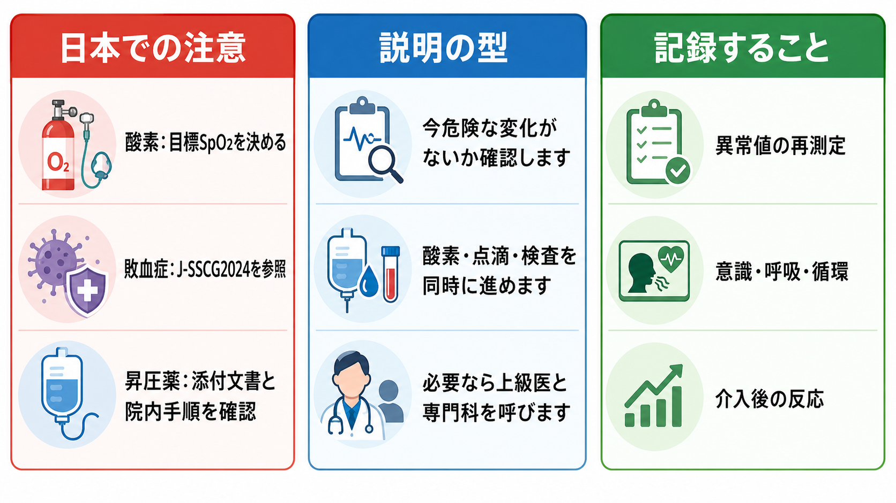

---
title: "救急外来でバイタルサイン異常を見たとき何を優先して確認するか"
description: "頻脈・低血圧・低酸素・発熱・意識障害を統合し、救急外来で緊急度を判断するための一次評価の型。"
aliases:
  - "バイタル異常の一次評価"
tags:
  - 領域/救急・初期対応
  - 種類/クリニカルクエスチョン
  - 対象/研修医
question: "救急外来でバイタルサイン異常を見たとき何を優先して確認するか"
clinical_area: "救急・初期対応"
audience: "研修医"
evidence_level: "guideline"
created: "2026-04-27"
updated: "2026-04-27"
enableToc: true
---

# 救急外来でバイタルサイン異常を見たとき何を優先して確認するか

> このノートは研修医教育のための一般的整理であり、個別患者への診断・治療指示ではありません。緊急性が高い、判断に迷う、施設方針が関わる場合は、上級医・専門科・救急チームに早期に相談してください。

## クリニカルクエスチョン

救急外来で頻脈、低血圧、低酸素、発熱、意識障害などのバイタルサイン異常を見たとき、何を優先して確認し、どのように緊急度を判断するか。

## まず結論

- バイタル異常を見たら、まず「測定エラーか」より先に「患者が今崩れているか」を直接見に行く。呼吸仕事量、顔色、冷汗、末梢冷感、会話、意識、尿量、皮膚所見を同時に確認する。
- 単一の数値で判断せず、ABCDE、灌流、酸素化、意識、体温、経時変化を統合する。NEWS2やJTASのような複数パラメータ評価は、急性悪化を拾い上げる補助になる[1,2]。
- 低血圧、低酸素、呼吸数異常、意識障害、冷汗・末梢冷感、乳酸上昇は、測り直しを待たずに応援要請と初期介入を並行するサインである[2,3]。
- 発熱と頻脈だけで「感染症」と決めない。敗血症、出血、ACS、不整脈、肺塞栓、緊張性気胸、アナフィラキシー、低血糖、脳卒中を同時に除外する。
- 日本ではJ-SSCG2024バンドル、JRC蘇生ガイドライン、JTAS2023、PMDA添付文書、院内プロトコルを確認し、薬剤・用量・投与経路・保険運用を海外資料からそのまま持ち込まない[3-6]。

## 判断の型

1. **測定値を見た瞬間に患者を直接見る**  
   モニターだけでなく、呼吸の努力、会話の可否、チアノーゼ、冷汗、末梢冷感、網状皮斑、CRT延長、尿量、姿勢、苦悶表情を確認する。NICE CG50は、心拍数、呼吸数、収縮期血圧、意識、酸素飽和度、体温を最低限の生理学的観察項目としている[2]。

2. **ABCDEで「今すぐ介入する崩れ」を探す**  
   A: 気道閉塞、B: 低酸素・呼吸数異常・呼吸仕事量、C: 低血圧・頻脈・末梢循環不全・出血、D: 意識障害・けいれん・低血糖、E: 高熱/低体温・発疹・外傷・皮膚所見を順に見る。JRC蘇生ガイドラインは、急変時にBLS/ALSの枠組みで迅速な認識と介入を重視する[4]。

3. **赤旗なら、評価と介入を同時進行にする**  
   SpO2低下、呼吸数増加または低下、収縮期血圧低下、ショック所見、GCS低下/新たな錯乱、乳酸上昇、持続する胸痛、アナフィラキシー所見では、酸素、モニター、静脈路、採血、血液ガス、心電図、上級医コールを並行する[2,7]。

4. **「原因検索」より先に「死にうる可逆病態」を外す**  
   出血、敗血症、ACS/致死的不整脈、肺塞栓、緊張性気胸、心タンポナーデ、アナフィラキシー、低血糖、オピオイド/中毒、脳卒中は、初期段階から候補に置く。

5. **再評価の時刻を決める**  
   初期介入後に、呼吸数、SpO2、血圧、心拍数、意識、尿量、皮膚所見、乳酸/血液ガスを再評価する。介入に反応しない場合は、診療場所の引き上げ、専門科、ICU/救急チーム相談を検討する[2,3]。

## 初期対応

- **応援要請**: 「低血圧と意識障害」「低酸素と呼吸仕事量増加」「発熱とショック所見」など、単一診断ではなく危険な組み合わせを短く共有する。
- **再測定**: カフサイズ、体動、末梢冷感、測定部位、SpO2波形、酸素投与量、体温測定部位を確認する。ただし、低酸素・低血圧・意識障害では再測定だけで待たない。
- **モニター**: 心電図、SpO2、非観血血圧を装着し、呼吸数は手で数える。NEWS2は呼吸数、酸素飽和度、収縮期血圧、脈拍、意識/新規錯乱、体温を組み合わせる[1]。
- **酸素**: 低酸素またはショックでは酸素投与を開始し、COPDなど高CO2血症リスクがあれば目標SpO2を個別に設定する。BTSは急性期酸素を「目標SpO2範囲に合わせて処方・調整する薬剤」として扱うことを推奨している[7]。
- **静脈路・採血**: 太い静脈路を確保し、血算、生化学、凝固、血糖、血液ガス、乳酸、必要時に血液培養を提出する。感染と臓器障害が疑われる場合、J-SSCG2024バンドルはSOFA評価、乳酸測定、血液培養、抗菌薬、感染巣検索、初期輸液、低血圧時のノルアドレナリンを示している[3]。
- **心電図・画像・POCUS**: 胸痛、呼吸困難、ショック、意識障害、電解質異常疑いでは12誘導心電図を早期に取る。POCUSは心機能、右室負荷、IVC、肺エコー、腹腔内液体、大動脈などをベッドサイドで確認する補助になる。

## 鑑別・見逃し

| 優先度 | 疾患・状態 | 見逃しやすい理由 | 手がかり |
|---|---|---|---|
| 高 | 敗血症/敗血症性ショック | 発熱がない、むしろ低体温、高齢者で症状が乏しい | 感染疑い、GCS低下、RR 22以上、SBP 100以下、乳酸上昇、乏尿[3] |
| 高 | 出血/循環血液量減少 | 若年者では血圧が保たれる | 頻脈、冷汗、末梢冷感、起立性変化、Hb低下、腹痛、黒色便、外傷 |
| 高 | ACS/致死的不整脈 | 胸痛がない、呼吸困難や失神だけで来る | 心電図変化、トロポニン、低血圧、肺うっ血、徐脈/頻脈 |
| 高 | 肺塞栓/緊張性気胸 | SpO2低下が軽いことがある | 呼吸数増加、胸痛、失神、右室負荷、片側呼吸音低下 |
| 高 | アナフィラキシー | 皮疹が目立たないことがある | 急な低血圧、喘鳴、咽頭違和感、消化器症状、曝露歴 |
| 高 | 低血糖/中毒/脳卒中 | 意識障害を「せん妄」と誤る | 血糖、瞳孔、神経局在、薬剤歴、発症時刻 |

## 検査

| 検査 | 目的 | 注意点 |
|---|---|---|
| 血糖 | 意識障害、けいれん、冷汗の即時除外 | 低血糖は治療可能な意識障害として最優先 |
| 血液ガス・乳酸 | 換気、酸塩基、組織低灌流の評価 | 乳酸はショック以外でも上がるため経時変化と文脈で解釈する[3,8] |
| 12誘導心電図 | ACS、不整脈、高K血症など | 低血圧、胸痛、呼吸困難、失神では早期に行う |
| 採血 | 貧血、感染、腎肝機能、電解質、凝固 | 結果待ちで初期介入を遅らせない |
| 血液培養 | 敗血症疑いで抗菌薬前に原因菌検索 | 採取で抗菌薬が大きく遅れる場合は上級医と判断 |
| 胸部X線/CT | 肺炎、気胸、心不全、出血、肺塞栓など | 不安定患者は移動リスクを評価し、ベッドサイド検査を優先 |
| POCUS | ショック分類と原因検索 | POCUS陰性だけで重症疾患を除外しない |

## 治療・マネジメント

- **低酸素**: 酸素投与、気道確保、換気補助の要否を評価する。SpO2だけでなく呼吸数、呼吸仕事量、意識、CO2貯留リスクを見る[7]。
- **低血圧/ショック**: 出血、敗血症、心原性、閉塞性、アナフィラキシーを同時に考える。輸液反応性、肺うっ血、心機能を見ながら初期輸液を行い、反応不十分なら上級医と昇圧薬、ICU相談を急ぐ[3,8]。
- **敗血症疑い**: J-SSCG2024バンドルに沿い、乳酸、SOFA、血液培養、抗菌薬、感染巣検索/コントロール、初期輸液を並行する。SSC2021も敗血症/敗血症性ショックを医療緊急事態として、治療と蘇生を直ちに開始することを推奨している[3,8]。
- **頻脈**: 痛み、発熱、低酸素、脱水、出血、不安だけで説明しない。広いQRS頻拍、不整脈、肺塞栓、甲状腺クリーゼ、薬物、中毒も確認する。
- **発熱**: 体温の高さだけで緊急度を決めない。意識障害、低血圧、呼吸数増加、皮疹、項部硬直、免疫不全、抗がん薬、妊娠、術後、デバイス感染を組み合わせて判断する。
- **意識障害**: 血糖、酸素化、換気、循環、体温、薬剤/中毒、神経局在を同時に見る。GCS低下や新規錯乱はNEWS2でも重要な悪化サインである[1]。

### 日本での注意

- **トリアージ運用**: 日本ではJTAS2023が院内トリアージの標準的な参照資料として使われる施設がある。厚生労働省の救急医療施策・診療報酬では、救急外来で緊急度に応じた優先順位付けを行う運用が制度面でも扱われる[5,9]。
- **敗血症**: 日本ではJ-SSCG2024と施設バンドルを優先して確認する。海外のSSC2021と大枠は近いが、国内の利用可能薬、DIC診療、集中治療体制、抗菌薬採用品目は施設差がある[3,8]。
- **昇圧薬**: ノルアドレナリンはPMDA添付文書上、各種ショック時の急性低血圧の補助治療として位置づけられる。投与濃度、末梢投与可否、中心静脈路、漏出対応は院内手順を確認する[6]。
- **酸素**: BTSの目標SpO2の考え方は実践的だが、日本では酸素投与の記録、デバイス、流量、目標値、医師指示の扱いを院内規定に合わせる[7]。

## 図解

## 指導医に確認するポイント

- この患者は「今すぐ蘇生・処置・ICU相談が必要な状態」か、「短時間で再評価しながら原因検索できる状態」か。
- 低血圧の主病態は、出血性、敗血症性、心原性、閉塞性、アナフィラキシー性のどれを最も疑うか。
- 酸素目標、輸液量、昇圧薬開始、抗菌薬開始、画像検査への移動可否をどう決めるか。
- どの時点で救急科、集中治療、循環器、呼吸器、外科、脳卒中チームに相談するか。
- 患者・家族に、現在の危険度と次の検査・処置をどの言葉で説明するか。

## 患者説明

- 「今、血圧・酸素・意識などに危険な変化がないかを優先して確認しています。」
- 「原因を一つに決める前に、呼吸と循環を支える処置と、心電図・血液検査・画像検査を同時に進めます。」
- 「状態が急に変わる可能性があるため、上級医や専門科にも早めに相談します。」
- 「検査結果がそろう前でも、命に関わる可能性が高い場合は、酸素、点滴、抗菌薬、止血、昇圧薬などを先に始めることがあります。」

## ピットフォール

- SpO2が正常だから呼吸不全ではない、と考える。酸素投与中、高CO2血症、貧血、ショックではSpO2だけでは不十分である[7]。
- 血圧が保たれているからショックではない、と考える。頻脈、冷汗、CRT延長、乳酸上昇、意識変化、乏尿は代償性ショックの手がかりになる[3,8]。
- 発熱と頻脈だけで感染症と決めつけ、肺塞栓、出血、ACS、薬剤性、甲状腺クリーゼを見落とす。
- 低血圧に輸液だけを繰り返し、心原性/閉塞性ショックや肺水腫を悪化させる。
- スコアを計算して安心する。NEWS2、qSOFA、JTASは補助であり、臨床的懸念があればスコアに関わらず上級医へ相談する[1,2,8]。
- 再評価時刻を決めない。バイタル異常は「介入後にどう変わったか」が診断と重症度判断の中核になる。

## 関連ノート

- 関連ノート候補: ショックを疑ったとき最初に何をするか
- 関連ノート候補: 意識障害を見たとき何を除外するか

## MOC更新候補

- [[MOC｜救急・初期対応]] に本記事へのリンクを追加候補。
- MOC｜感染症・抗菌薬.md（本サイト外） の敗血症初期対応セクションに関連リンクとして追加候補。
- MOC｜心電図・循環器.md（本サイト外） のショック/不整脈評価セクションに関連リンクとして追加候補。

## 参考文献

[1] Royal College of Physicians. National Early Warning Score (NEWS) 2. Updated report of a working party. 2017. https://www.rcplondon.ac.uk/improving-care/resources/national-early-warning-score-news-2/

[2] National Institute for Health and Care Excellence. Acutely ill adults in hospital: recognising and responding to deterioration. Clinical guideline CG50. 2007, reviewed 2020. https://www.nice.org.uk/guidance/CG50/chapter/recommendations

[3] 日本集中治療医学会, 日本救急医学会, 日本版敗血症診療ガイドライン2024特別委員会. 日本版敗血症診療ガイドライン2024（J-SSCG2024）本編・バンドル. 2024. https://www.jaam.jp/info/2024/info-20241118.html

[4] 日本蘇生協議会. JRC蘇生ガイドライン2020. 2021. https://www.jrc-cpr.org/jrc-guideline-2020/

[5] 日本救急医学会, 日本救急看護学会, 日本小児救急医学会, 日本臨床救急医学会, 日本在宅救急医学会 監修. 緊急度判定支援システム JTAS2023ガイドブック 第3版. へるす出版, 2023. https://www.herusu-shuppan.co.jp/062-2/

[6] 医薬品医療機器総合機構（PMDA）. ノルアドリナリン注1mg 添付文書. 2024年5月改訂. https://www.pmda.go.jp/PmdaSearch/rdDetail/iyaku/2451401A1034_2?user=1

[7] O'Driscoll BR, Howard LS, Earis J, Mak V, on behalf of the British Thoracic Society Emergency Oxygen Guideline Group. BTS guideline for oxygen use in adults in healthcare and emergency settings. Thorax. 2017;72(Suppl 1):ii1-ii90. https://doi.org/10.1136/thoraxjnl-2016-209729

[8] Evans L, Rhodes A, Alhazzani W, et al. Surviving Sepsis Campaign: International Guidelines for Management of Sepsis and Septic Shock 2021. Intensive Care Med. 2021;47:1181-1247. https://doi.org/10.1007/s00134-021-06506-y

[9] 厚生労働省. 救急医療. https://www.mhlw.go.jp/stf/seisakunitsuite/bunya/0000123022.html

## 更新ログ

- 2026-04-27: 初版作成。日英の主要ガイドライン、公的資料、PMDA添付文書を確認し、imagegen由来のラスター図解3枚を添付。
