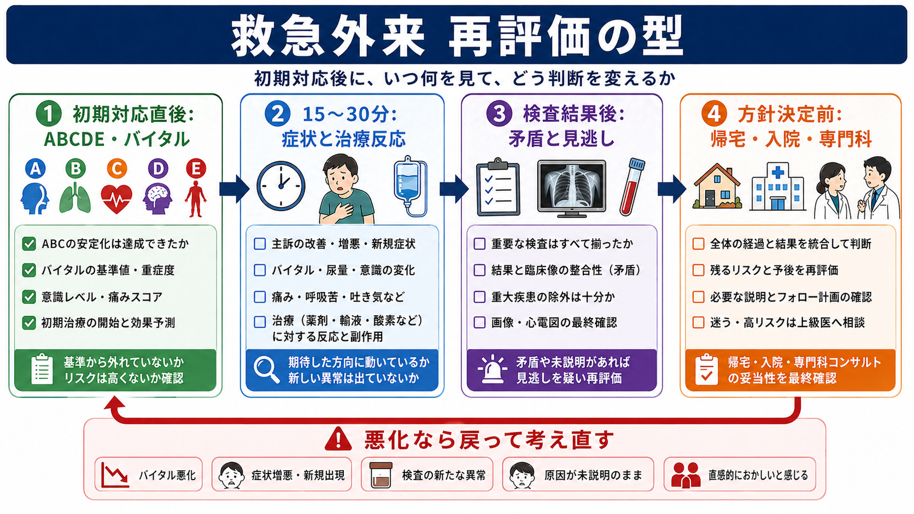
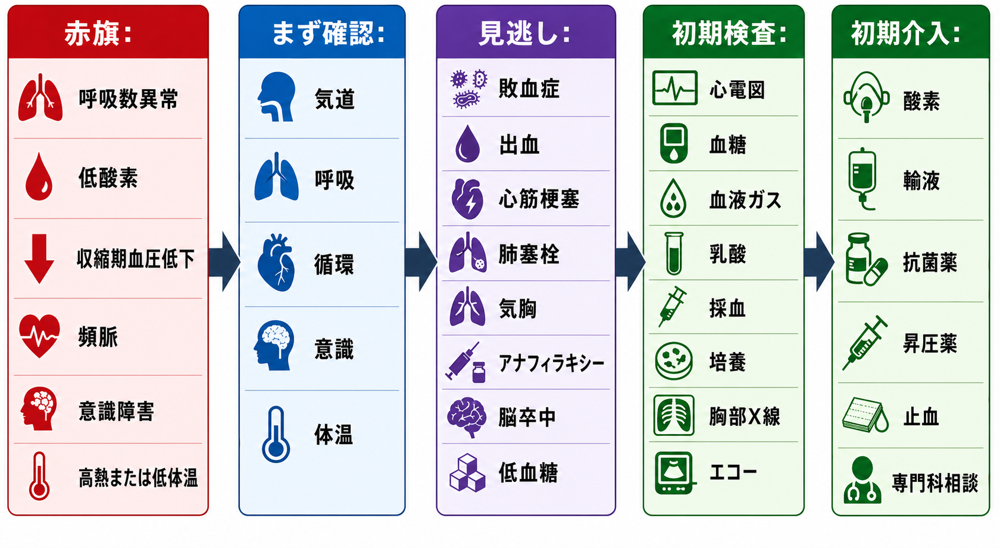
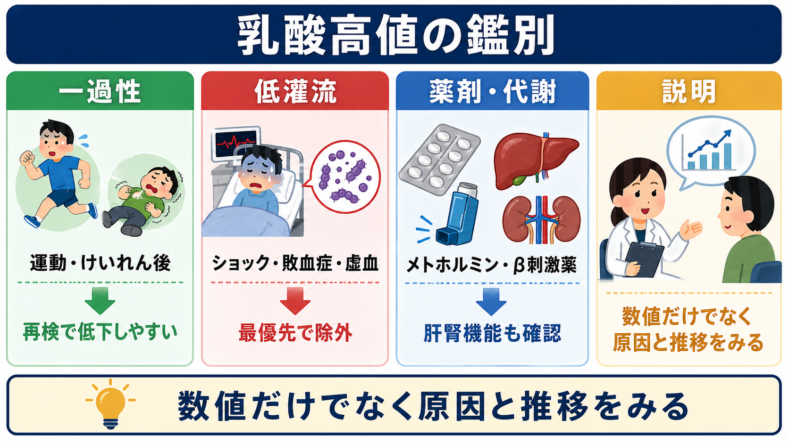

---
title: "救急外来で再評価はいつ何を見ればよいか"
description: "初期対応後にバイタル、症状、検査結果、治療反応を再確認し、方針変更につなげる。"
aliases:
  - "救急外来の再評価"
tags:
  - 領域/救急・初期対応
  - 種類/クリニカルクエスチョン
  - 対象/研修医
question: "救急外来で再評価はいつ何を見ればよいか"
clinical_area: "救急・初期対応"
audience: "研修医"
evidence_level: "mixed"
created: "2026-04-27"
updated: "2026-04-27"
enableToc: true
---

# 救急外来で再評価はいつ何を見ればよいか

> このノートは研修医教育のための一般的整理であり、個別患者の診断・治療指示ではありません。緊急性が高い、判断に迷う、施設方針が関わる場合は上級医・専門科に相談してください。

## クリニカルクエスチョン

救急外来で初期対応を終えたあと、いつ、何を、どの順番で再評価し、帰宅・入院・専門科相談などの方針変更につなげればよいか。

## まず結論

- 再評価は「時間が来たら見る」だけでなく、「初期対応直後」「治療後」「検査結果が出た時」「方針決定前」「患者・家族・看護師が悪化を感じた時」に必ず行う。
- 最初に見るのは主訴ではなく、ABCDE、呼吸数、SpO2、血圧、脈拍、体温、意識、尿量、痛みなどの生理学的悪化である。NICEは急性期患者で複数パラメータのトラック・アンド・トリガーを用い、異常があれば観察頻度を上げることを推奨している[3]。
- 待機中の再評価間隔は、院内トリアージの緊急度、院内基準、混雑状況で変わる。JTASは緊急度判定の標準的枠組みであり、日本では院内トリアージ基準に基づく評価と診療録記載が診療報酬上も求められる[1][2]。
- 方針決定前には「バイタルが正常化したか」だけでなく、症状の推移、検査結果と臨床像の整合性、治療反応、副作用、帰宅後の再診基準を確認する。
- 異常バイタルを残した退院は、再受診、入院、死亡などの不良転帰と関連する報告がある。特に低血圧、頻呼吸、低酸素、持続する頻脈は軽視しない[7][8]。
- 敗血症・ショックを疑う場合は、乳酸、輸液反応、毛細血管再充満時間、昇圧薬の必要性などを反復評価し、感染以外の鑑別も継続して探す[5][6]。

## 判断の型

1. **今すぐ戻るべきか**: ABCDE、低酸素、低血圧、意識変容、急な疼痛増悪、看護師の懸念を確認する。ここで異常があれば、診断名の確定を待たず上級医へ共有する。
2. **期待した方向に動いているか**: 酸素、輸液、鎮痛、制吐、解熱、抗菌薬、気管支拡張薬などの介入後に、症状とバイタルが同じ方向へ改善しているかを見る。
3. **検査結果は臨床像を説明するか**: 「正常だったから安心」ではなく、検査前確率、発症時刻、検査の感度、画像の限界を踏まえて矛盾を探す。
4. **残るリスクを説明できるか**: 帰宅、経過観察、入院、専門科相談のどれを選んでも、残る不確実性と再診基準を言語化する。
5. **記録に残す**: 再評価時刻、バイタル、所見、検査確認、治療反応、方針変更の理由、上級医相談の内容を短く記録する。

## 初期対応

- **初期対応直後**: ABCDEで生命危機を外し、酸素、モニター、静脈路、輸液、鎮痛などを行ったら、その介入が効いているかを数分から十数分単位で再確認する。
- **待機中**: トリアージ時の緊急度が高い、バイタル異常がある、高齢者、免疫不全、妊娠、抗凝固薬内服、独居、症状説明が乏しい場合は、診察待ち・検査待ちの間も観察頻度を上げる。
- **治療後**: 鎮痛後の腹部所見、酸素投与後の呼吸仕事量、輸液後の血圧・脈拍・尿量、制吐後の脱水評価など、介入で隠れた危険所見がないかを見直す。
- **検査結果後**: 血液検査、心電図、画像、尿検査、培養採取などがそろった時点で、初期仮説と矛盾しないか、追加検査や専門科相談が必要かを再評価する。
- **帰宅・入院前**: 最終バイタル、歩行・経口摂取・排尿、痛みの再燃、説明理解、帰宅後の観察者、再診手段を確認する。

## 鑑別・見逃し

| 優先度 | 疾患・状態 | 見逃さない理由 | 手がかり |
|---|---|---|---|
| 高 | 敗血症・敗血症性ショック | 初期は発熱や白血球だけでは判断しにくく、乳酸上昇や低灌流が後から明らかになる | 頻呼吸、低血圧、意識変容、尿量低下、乳酸上昇、感染巣不明[5][6] |
| 高 | 急性冠症候群・致死性不整脈 | 初回心電図や初回トロポニンだけで除外しにくい場合がある | 胸痛再燃、冷汗、失神、心電図変化、リスク因子 |
| 高 | 肺塞栓・気胸・重症喘息/COPD増悪 | SpO2だけでなく呼吸仕事量や頻呼吸が悪化を先に示す | 頻呼吸、低酸素、胸痛、片側呼吸音低下、酸素需要増加 |
| 高 | 頭蓋内出血・脳卒中・髄膜炎 | 意識や神経所見は時間で変化しうる | 新規神経脱落、頭痛増悪、嘔吐、項部硬直、抗凝固薬 |
| 高 | 腹部大動脈瘤破裂・消化管穿孔・腸管虚血 | 鎮痛で症状が軽く見え、検査初期に目立たないことがある | 持続痛、反跳痛、ショック、乳酸上昇、痛みと所見の不釣り合い |
| 中 | アナフィラキシー・薬剤副作用 | 初期改善後に再燃や遷延がある | 皮膚症状、喘鳴、消化器症状、低血圧、投薬後の時間経過 |
| 中 | 低血糖・電解質異常・中毒 | 意識変容の原因として迅速に修正可能 | 血糖、Na/K/Ca、薬剤歴、アルコール、腎機能 |

## 検査

| 検査 | 目的 | 注意点 |
|---|---|---|
| バイタル再測定 | 生理学的悪化の検出、退院・入院先の妥当性判断 | 呼吸数は省略されやすい。SpO2は酸素投与量とセットで見る[3][4] |
| 心電図 | 胸痛、息切れ、失神、電解質異常、薬剤性QT延長の確認 | 症状再燃時は再検する。初回正常で終わらせない |
| 血液ガス・乳酸 | 低灌流、換気不全、代謝性アシドーシスの評価 | 乳酸は敗血症だけでなく痙攣、低灌流、薬剤、肝機能でも上がる。高値なら推移を見る[5][6] |
| 血算・生化学・凝固 | 貧血、感染、腎肝機能、電解質、DICや出血傾向の把握 | 数値単独でなく、症状・バイタル・薬剤歴と統合する |
| 画像検査 | 胸腹部、頭部、外傷などの見逃しを減らす | 陰性でも発症早期、撮像範囲外、読影待ちのリスクを残す |
| 尿検査・妊娠反応 | 尿路感染、腎泌尿器疾患、妊娠関連疾患の確認 | 妊娠可能年齢では画像・薬剤選択にも影響する |

## 治療・マネジメント

- **再評価の最小セット**: 時刻、呼吸数、SpO2と酸素量、血圧、脈拍、体温、意識、痛み、尿量、主訴の推移、治療反応、検査の未確認項目を確認する。
- **悪化時の動き**: 低酸素、低血圧、意識変容、急な疼痛増悪、頻呼吸、検査の重大異常、看護師の懸念があれば、診断名より先にABCDEへ戻り、上級医・専門科・ICU相談を検討する。
- **治療反応を見る例**: 輸液後も低血圧や頻脈が続く、酸素投与で呼吸仕事量が下がらない、鎮痛後も腹膜刺激症状がある、制吐後も経口摂取不能なら、当初方針を見直す。
- **敗血症・ショック**: J-SSCG2024バンドルでは、感染と臓器障害を疑う場合に迅速評価、SOFA、乳酸測定、培養、抗菌薬、感染巣対策、初期輸液、低血圧時のノルアドレナリン早期使用、乳酸・心エコーの反復が示されている[5]。SSC 2021も、乳酸高値では再測定し、輸液反応は静的所見だけでなく動的指標を用いることを提案している[6]。
- **日本での注意**: 院内トリアージ実施料は、夜間・休日・深夜の初診患者に対し、院内基準に基づき医師または一定経験を有する看護師が緊急度区分と優先順位付けを行い、診療録へ記載する制度である[2]。実際の再評価間隔、観察場所、看護師権限、呼び出し基準は施設基準と院内手順に従う。
- **薬剤の注意**: 敗血症性ショックなどで昇圧薬を使う場合、海外ガイドラインの推奨だけでなく、日本で使用する製剤の添付文書、投与経路、希釈、血管外漏出、モニタリング、院内プロトコルを確認する。PMDAのノルアドリナリン注1mg添付文書情報も参照する[9]。
- **帰宅前**: 異常バイタルが残る場合は「本人の普段値」「疼痛・発熱・不安で説明可能」と早合点しない。再測定、原因説明、上級医確認、短時間観察、追加検査、入院の必要性を検討する[7][8]。

## 図解

## 指導医に確認するポイント

- この患者で「再評価しないと危ない」所見は何か。
- 最終バイタルの異常を、疾患・治療反応・帰宅後リスクとして説明できるか。
- 検査結果と臨床像が矛盾している点はないか。
- 短時間観察、再検、画像追加、専門科相談、入院の閾値はどこか。
- 帰宅可能と判断する場合、再診基準とフォロー手段は具体的か。

## 患者説明

- 「最初の処置で少し落ち着いていますが、救急外来では時間がたってから変化が出ることがあります。もう一度、血圧、脈、呼吸、酸素、症状、検査結果を確認して方針を決めます。」
- 「帰宅になった場合も、息苦しさ、胸痛、強い腹痛、意識がぼんやりする、ぐったりする、出血が増える、薬を飲んでも症状が悪くなる時は、我慢せず再受診してください。」
- 「今日の検査で全ての病気が完全に否定できるわけではありません。今の時点で危険性が低いか、追加で観察や入院が必要かを、経過も含めて判断します。」

## ピットフォール

- 呼吸数を測らず、SpO2だけで呼吸状態を判断する。
- 鎮痛・解熱・酸素投与で「よくなったように見える」ことを、疾患が軽いことと混同する。
- 検査結果を開いた時に、患者を見に行かず方針だけ決める。
- 退院直前の頻脈、低血圧、低酸素、頻呼吸を「緊張」「痛み」「発熱のせい」と説明して終える。
- 検査陰性を、発症早期・検査感度・撮像範囲・前処置の影響を考えずに過信する。
- 看護師、患者、家族の「さっきよりおかしい」という懸念を軽視する。

## 関連ノート

- 関連ノート候補: `ABCDE評価の基本`
- 関連ノート候補: `救急外来の院内トリアージ`
- 関連ノート候補: `敗血症を疑う初期対応`
- 関連ノート候補: `救急外来で帰宅判断前に確認すること`

## MOC更新候補

- [[MOC｜救急・初期対応]]
- 追加候補: `ABCDE・一次評価` 配下に「再評価」「トリアージ」「帰宅判断」をつなぐ入口として掲載。

## 参考文献

[1] 日本救急医学会, 日本救急看護学会, 日本小児救急医学会, 日本臨床救急医学会, 日本在宅救急医学会 監修. 緊急度判定支援システム JTAS2023ガイドブック 第3版. へるす出版, 2023. DOI: https://doi.org/10.32209/9784867190623

[2] 厚生労働省. 診療報酬の算定方法: B001-2-5 院内トリアージ実施料. https://www.mhlw.go.jp/web/t_doc?dataId=84aa9729&dataType=0

[3] National Institute for Health and Care Excellence. Acutely ill adults in hospital: recognising and responding to deterioration. NICE guideline CG50. 2007. https://www.nice.org.uk/guidance/CG50/chapter/recommendations

[4] Royal College of Physicians. National Early Warning Score (NEWS) 2: Standardising the assessment of acute-illness severity in the NHS. 2017. https://www.rcp.ac.uk/media/a4ibkkbf/news2-final-report_0_0.pdf

[5] 日本集中治療医学会, 日本救急医学会. 日本版敗血症診療ガイドライン2024（J-SSCG2024）バンドル. https://pre.jaam.jp/info/2024/files/bundle.pdf

[6] Evans L, Rhodes A, Alhazzani W, et al. Surviving Sepsis Campaign: International Guidelines for Management of Sepsis and Septic Shock 2021. Intensive Care Medicine. 2021. DOI: https://doi.org/10.1007/s00134-021-06506-y

[7] Long B, Keim SM, Gottlieb M, et al. Can I Discharge This Adult Patient with Abnormal Vital Signs From the Emergency Department? Journal of Emergency Medicine. 2024. DOI: https://doi.org/10.1016/j.jemermed.2024.05.009

[8] Chang CY, Abujaber S, Pany MJ, Obermeyer Z. Are vital sign abnormalities associated with poor outcomes after emergency department discharge? Acute Medicine. 2019;18(2):88-95. https://pubmed.ncbi.nlm.nih.gov/31127797/

[9] PMDA. ノルアドリナリン注1mg 医療用医薬品情報. https://www.pmda.go.jp/PmdaSearch/rdDetail/iyaku/2451401A1034_2?user=1

## 更新ログ

- 2026-04-27: 初版作成。
