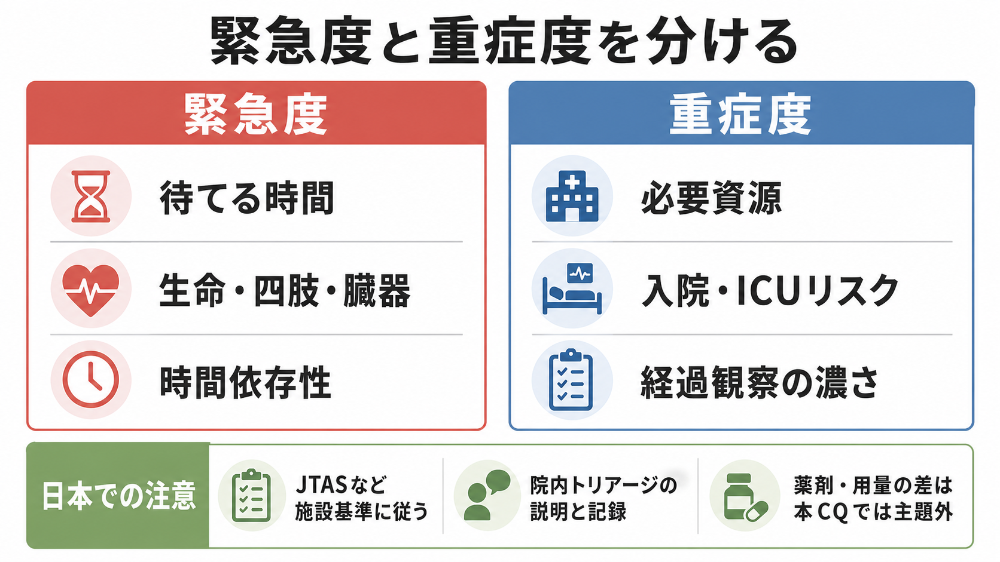
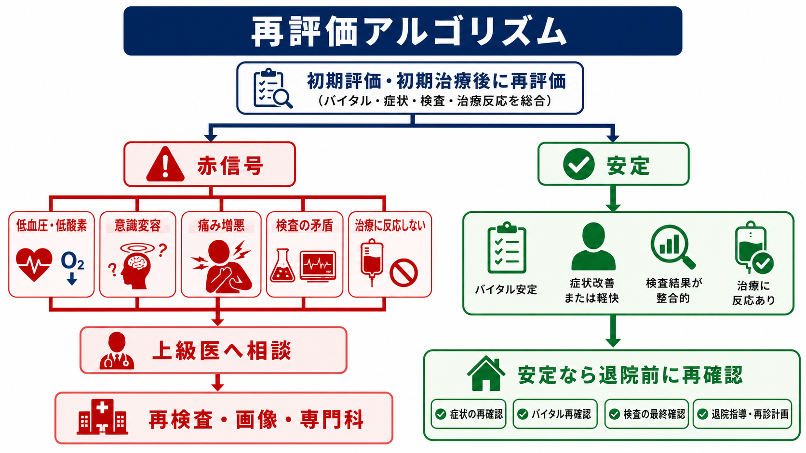
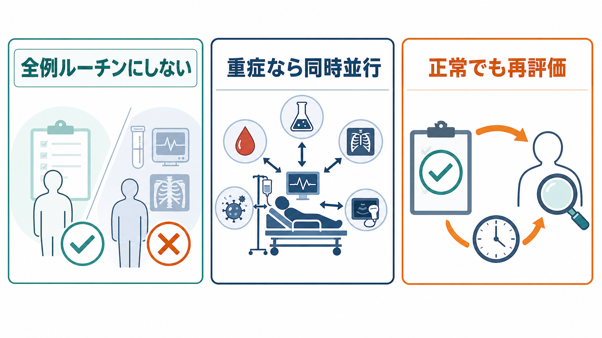

---
title: "救急外来で初期検査セットはどのように選ぶか"
description: "血液検査・血ガス・心電図・画像・尿検査を、主訴と重症度に応じて過不足なく選ぶ考え方を整理する。"
aliases:
  - "救急初期検査"
tags:
  - 領域/救急・初期対応
  - 種類/クリニカルクエスチョン
  - 対象/研修医
question: "救急外来で初期検査セットはどのように選ぶか"
clinical_area: "救急・初期対応"
audience: "研修医"
evidence_level: "mixed"
created: "2026-04-27"
updated: "2026-04-27"
enableToc: true
---

# 救急外来で初期検査セットはどのように選ぶか

> このノートは研修医教育のための一般的整理であり、個別患者の診断・治療指示ではありません。緊急性が高い、判断に迷う、施設方針が関わる場合は上級医・専門科に相談してください。

## クリニカルクエスチョン

救急外来で、血液検査・血ガス・心電図・画像・尿検査を、主訴と重症度に応じて過不足なく選ぶにはどう考えるか。

## まず結論

- 初期検査は「全例セット」ではなく、まずABCDE、バイタル、意識、SpO2、体温、疼痛、出血、感染徴候から、緊急度と重症度を分けて選ぶ。[1][2]
- 不安定例では、検査で診断を確定してから動くのではなく、蘇生・モニター・静脈路確保・上級医コールと並行して、血ガス、血糖、心電図、採血、必要画像を同時に走らせる。[1][3][4]
- 胸痛、呼吸困難、失神、意識障害、ショック、重症感染疑い、急性腹症、外傷、妊娠可能性では、見逃すと時間依存で悪化する疾患を先に置く。[3][5]
- 画像検査は「撮れるから撮る」ではなく、検査結果で方針が変わるか、被ばく・造影剤・搬送リスクに見合うかを確認する。[6][7][8]
- 尿検査・尿培養は、尿路症状、発熱源検索、妊娠、腎・代謝評価など目的がある時に使う。無症候性細菌尿を拾って抗菌薬過剰につなげない。[9]
- 正常な初期検査は「危険疾患なし」の証明ではない。症状の経時変化、再診リスク、再検・再診計画まで含めて初期検査セットと考える。[2][5]

## 判断の型

1. **まず患者の安定性を決める。** 気道、呼吸、循環、意識、体温、疼痛、出血、SpO2、低血糖を確認する。NICEは急性期患者の初期評価で心拍数、呼吸数、収縮期血圧、意識、酸素飽和度、体温を最低限の観察項目としている。[2]
2. **時間依存疾患を先に仮説化する。** ACS、大動脈解離、肺塞栓、脳卒中、敗血症、出血性ショック、異所性妊娠、絞扼・穿孔、髄膜炎、DKA/HHS、中毒を「まず除外したい病態」として置く。[1][3][5]
3. **主訴別に、検査を目的で選ぶ。** 「心筋虚血を拾う心電図・トロポニン」「低酸素・換気・代謝をみる血ガス」「感染と臓器障害をみる採血・乳酸」「方針変更につながる画像」のように、検査ごとに答えたい問いを明確にする。
4. **検査前確率と結果の使い道を確認する。** 低リスク頭部外傷や非特異的腰痛などでは、決定ルールやレッドフラッグなしに画像を足すと利益より害が大きくなり得る。[8]
5. **再評価でセットを更新する。** 初回で正常でも、胸痛の反復心電図・シリアルトロポニン、敗血症の乳酸再評価、腹痛の経時的診察など、時間で情報量が増える疾患がある。[3][4][5]

## 初期対応

- **不安定なら検査より先に人と場所を確保する。** ABCDE、酸素、モニター、除細動器準備、2本以上の静脈路、ベッドサイド血糖、上級医・看護師・放射線・検査室への早期共有を行う。[1]
- **ショック・敗血症疑いでは同時並行にする。** 感染と臓器障害を疑ったら、バイタル、SOFA評価、乳酸、血液培養2セット、感染巣検体、適切な抗菌薬、輸液、昇圧薬検討、感染巣検索を遅らせない。[3][4]
- **胸痛・呼吸困難では心電図を先に置く。** AHA/ACCは急性胸痛で心電図と高感度トロポニンを軸に、構造化リスク評価で追加検査を決めることを推奨している。[5]
- **画像搬送前に搬送耐性を確認する。** CT室へ行ける循環・呼吸状態か、モニター・酸素・薬剤・人員が足りるかを確認する。搬送が危険ならベッドサイドエコーやポータブルX線を先に検討する。[1][6]
- **日本での注意。** JTASや院内トリアージ、夜間の検査体制、CT・MRIの稼働、血液ガスの測定場所、血液培養ボトルの運用は施設差が大きい。施設セットを使う場合も、不要項目を外す・必要項目を足す意識を持つ。

## 鑑別・見逃し

| 優先度 | 疾患・状態 | 見逃さない理由 | 手がかり |
|---|---|---|---|
| 高 | ACS | 心電図・トロポニンの初期陰性だけでは早期除外できないことがある | 胸部圧迫感、冷汗、息切れ、悪心、糖尿病・高齢者の非典型症状 [5] |
| 高 | 敗血症・敗血症性ショック | 初期数時間の認識と治療開始が予後に関わる | 発熱または低体温、頻呼吸、低血圧、意識変容、乳酸高値 [3][4] |
| 高 | 大動脈解離・破裂性AAA | 鎮痛で落ち着いても致死的に進行し得る | 突然発症、移動痛、神経症状、血圧左右差、ショック |
| 高 | 肺塞栓 | SpO2低下が軽くても重症化することがある | 呼吸困難、胸痛、頻脈、DVTリスク、失神 |
| 高 | 脳卒中・頭蓋内出血 | 時間依存治療・転送判断に直結する | FAST陽性、突然の頭痛、意識障害、抗凝固薬 |
| 高 | 異所性妊娠・婦人科緊急 | 妊娠可能性を聞き漏らすと画像・治療方針を誤る | 下腹痛、不正出血、失神、妊娠反応陽性 |
| 中 | DKA/HHS・低血糖 | 意識障害や腹痛の背景に隠れる | 糖尿病、脱水、頻呼吸、血糖異常、ケトン、血ガス |
| 中 | 無症候性細菌尿の過剰診断 | 尿所見だけで抗菌薬を始めると害が出る | 尿路症状なし、発熱源不明で他所見不十分 [9] |

## 検査

| 検査 | 目的 | 注意点 |
|---|---|---|
| ベッドサイド血糖 | 意識障害、けいれん、脱力、ショック様状態の可逆的原因を拾う | 採血結果を待たない。低血糖なら治療と原因検索を並行する。 |
| 12誘導心電図 | ACS、不整脈、高K血症、肺塞栓を疑う所見を拾う | 胸痛・呼吸困難・失神・上腹部痛・高齢者の非典型症状では早めに取る。正常でも疑いが高ければ再検する。[5] |
| 血算 | 出血、感染、貧血、血小板減少を評価する | 軽度白血球増多だけで細菌感染と断定しない。 |
| 生化学・電解質・腎肝機能 | 腎不全、電解質異常、肝胆道疾患、造影や薬剤の安全性をみる | CT造影、NSAIDs、抗菌薬、メトホルミン使用の判断に関わる。[10] |
| 凝固 | 出血、抗凝固薬、DIC、手術・IVR前評価 | ルーチンではなく出血・肝障害・抗凝固薬・侵襲処置の文脈で選ぶ。 |
| 静脈/動脈血ガス | 換気、酸塩基、乳酸、K、Hb、低酸素・ショックの重症度を見る | 乳酸は敗血症だけでなくけいれん、虚血、低灌流、薬剤でも上がる。[3][4] |
| トロポニン | 心筋傷害の検出と胸痛リスク層別化 | 初回陰性で終了せず、発症時刻とプロトコルに応じてシリアル評価する。[5] |
| Dダイマー | PE・DVT・解離などの低から中等度リスク例で除外補助 | 高齢者、炎症、術後、妊娠で偽陽性が多い。検査前確率なしに出さない。 |
| 尿定性・尿沈渣 | 尿路症状、腎疾患、糖・ケトン、妊娠可能性の補助 | 尿路症状なしの陽性だけでUTIと断定しない。[9] |
| 尿/血清hCG | 妊娠可能性がある腹痛、失神、出血、画像・薬剤判断 | 本人申告だけに頼らず、診療上必要な場面では検査を検討する。 |
| 胸部X線 | 肺炎、気胸、心不全、誤嚥、デバイス位置 | CTより先に答えが得られることがある。重症例ではポータブルも選択肢。 |
| CT・MRI | 出血、梗塞、解離、PE、急性腹症、外傷などの方針決定 | 検査結果で方針が変わるか、造影・被ばく・搬送リスクを確認する。[6][7][8] |
| ベッドサイドエコー | ショック、心嚢液、右心負荷、気胸、腹腔内液体、胆道・尿路閉塞 | 陰性で除外しきれない病態がある。術者依存性を理解して使う。 |

### 主訴別の最小セット例

| 主訴・状態 | まず考える危険疾患 | 初期検査の考え方 |
|---|---|---|
| 胸痛・背部痛 | ACS、解離、PE、気胸、食道破裂 | 心電図、トロポニン、胸部X線を早く。解離・PEはリスクと所見で造影CTを検討。[5][6][7] |
| 呼吸困難 | ACS、心不全、PE、気胸、喘息/COPD、肺炎 | SpO2、血ガス、心電図、胸部X線、必要時BNP/トロポニン/Dダイマー/CT。 |
| 意識障害 | 低血糖、脳卒中、敗血症、低酸素、電解質、中毒 | 血糖、血ガス、採血、心電図、頭部画像の適応、感染検索を並行。 |
| 発熱・感染疑い | 敗血症、髄膜炎、肺炎、胆道感染、尿路閉塞感染 | 重症なら乳酸、血液培養2セット、感染巣検体、画像を治療と並行。[3][4] |
| 腹痛 | 穿孔、腸管虚血、胆道、膵炎、尿路結石、婦人科緊急 | 診察所見、妊娠反応、採血、尿、必要時エコー/CT。鎮痛で再評価を忘れない。 |
| 外傷 | 出血、気道・呼吸障害、頭蓋内出血、脊髄損傷 | ABCDE、FAST、X線/CTを循環状態と受傷機転で選ぶ。 |
| 失神 | 不整脈、ACS、PE、出血、SAH | 心電図は基本。採血・画像は病歴、診察、リスク所見に基づいて選ぶ。[8] |

## 治療・マネジメント

- 初期検査セットは治療開始を遅らせるためのものではない。不安定例、敗血症性ショック、ACS、脳卒中、外傷、出血では、治療・専門科連絡・転送準備を検査と並行する。[1][3][4][5]
- 検査値が正常でも、病歴と身体所見が危険なら観察、再検、画像、専門科相談を検討する。逆に検査だけ軽度異常で、症状・所見と合わなければ再評価して過剰治療を避ける。
- 造影CTを考える時は、腎機能、脱水、ショック、アレルギー歴、メトホルミン、施設の造影剤腎症対策を確認する。PMDAはヨード造影剤使用時のメトホルミン一時中止と造影後48時間の再開回避を注意喚起している。ただし緊急検査の必要性が上回る場合があるため、上級医・放射線科と相談する。[10]
- 尿培養や広域抗菌薬は「尿が汚い」だけで始めない。症状、発熱、炎症、画像、閉塞、カテーテル、妊娠、免疫不全など、感染として扱う理由を明確にする。[9]
- 日本での注意として、院内採血セットや救急セットは保険・検査室運用・夜間人員に合わせて作られていることが多い。セットを押した後も、不要な腫瘍マーカー、凝固、Dダイマー、培養、CTを見直す。

## 図解

## 指導医に確認するポイント

- この患者は「検査を待てる患者」か、「治療・専門科連絡と同時に検査する患者」か。
- この主訴で、最初に除外したい時間依存疾患は何か。
- 出した検査の結果が、入院、帰宅、専門科コンサルト、画像追加、抗菌薬、輸液、輸血、処置のどれを変えるのか。
- CT造影、Dダイマー、尿培養、凝固、血液培養を出す理由は何か。
- 初期検査が正常だった場合の観察時間、再検、帰宅時説明、再診指示は十分か。

## 患者説明

- 「救急外来では、まず命に関わる病気が隠れていないかを優先して検査を選びます。」
- 「すべての検査を一度に行うより、症状、診察、重症度から必要な検査を選ぶ方が、不要な被ばくや副作用を避けられます。」
- 「初回検査が正常でも、時間がたつと変化が出る病気があります。症状が続く・悪化する場合は再評価が必要です。」
- 「造影CTや薬の使用は、腎機能、アレルギー、内服薬を確認して安全性を見ながら判断します。」

## ピットフォール

- 「救急セット」を押したことで、検査を選んだつもりになる。
- Dダイマー、尿検査、CTを検査前確率なしに出し、偽陽性に引っ張られる。
- 胸痛で初回心電図だけ、敗血症で初回乳酸だけ、腹痛で初回診察だけで安心する。
- CT室搬送のリスクを見積もらず、不安定患者を検査に出す。
- 尿所見陽性を発熱源と決めつけ、肺炎、胆道感染、皮膚軟部組織感染、薬剤熱、非感染性炎症を見逃す。
- 「若い」「元気そう」「検査が正常」を理由に、妊娠、出血、低血糖、中毒、自殺リスクを確認しない。

## 関連ノート

- 関連ノート候補: `ABCDEで何を最初に見るか`
- 関連ノート候補: `救急外来で胸痛をどう初期対応するか`
- 関連ノート候補: `敗血症を疑った時の初期対応`
- 関連ノート候補: `Dダイマーをいつ出すか`
- 関連ノート候補: `救急外来でCTをいつ依頼するか`

## MOC更新候補

- [[MOC｜救急・初期対応]]
- MOC｜検査・画像・手技.md（本サイト外）

## 参考文献

[1] 日本蘇生協議会. JRC蘇生ガイドライン2020. https://www.jrc-cpr.org/jrc-guideline-2020/

[2] National Institute for Health and Care Excellence. Acutely ill adults in hospital: recognising and responding to deterioration. NICE Clinical guideline CG50. https://www.nice.org.uk/guidance/cg50

[3] 日本救急医学会, 日本集中治療医学会. 日本版敗血症診療ガイドライン2024（J-SSCG2024）. https://doi.org/10.3918/jsicm.2400001

[4] Evans L, Rhodes A, Alhazzani W, et al. Surviving Sepsis Campaign: International Guidelines for Management of Sepsis and Septic Shock 2021. Intensive Care Medicine. 2021;47:1181-1247. https://doi.org/10.1007/s00134-021-06506-y

[5] Gulati M, Levy PD, Mukherjee D, et al. 2021 AHA/ACC/ASE/CHEST/SAEM/SCCT/SCMR Guideline for the Evaluation and Diagnosis of Chest Pain. Circulation. 2021;144:e368-e454. https://doi.org/10.1161/CIR.0000000000001029

[6] 日本医学放射線学会. 画像診断ガイドライン2021年版（第3版）. https://www.radiology.jp/guideline/diagnostic_imaging_guideline.html

[7] American College of Radiology. ACR Appropriateness Criteria. https://cs.acr.org/Clinical-Resources/ACR-Appropriateness-Criteria

[8] American College of Emergency Physicians. ACEP Announces List of Tests as Part of Choosing Wisely Campaign. https://www.acep.org/administration/quality/acep-announces-list-of-tests-as-part-of-choosing-wisely-campaign/

[9] Nicolle LE, Gupta K, Bradley SF, et al. Clinical Practice Guideline for the Management of Asymptomatic Bacteriuria: 2019 Update by the Infectious Diseases Society of America. Clinical Infectious Diseases. 2019;68:e83-e110. https://doi.org/10.1093/cid/ciy1121

[10] 独立行政法人医薬品医療機器総合機構. 使用上の注意改訂情報（令和元年6月18日指示分）：メトホルミン塩酸塩. https://www.pmda.go.jp/safety/info-services/drugs/calling-attention/revision-of-precautions/0353.html

## 更新ログ

- 2026-04-27: 初版作成。
