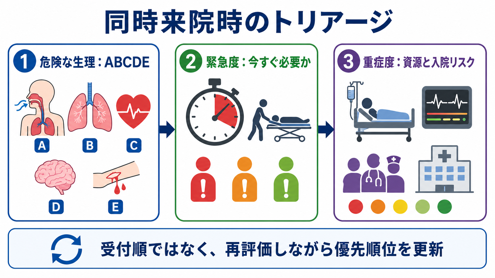
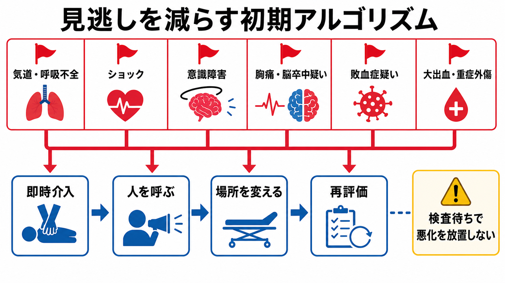

---
title: "救急外来で同時に複数患者が来たときトリアージをどう考えるか"
description: "緊急度と重症度を分けて考え、限られた人員で優先順位を決める基本を整理する。"
aliases:
  - "同時来院時のトリアージ"
tags:
  - 領域/救急・初期対応
  - 種類/クリニカルクエスチョン
  - 対象/研修医
question: "救急外来で同時に複数患者が来たときトリアージをどう考えるか"
clinical_area: "救急・初期対応"
audience: "研修医"
evidence_level: "mixed"
created: "2026-04-27"
updated: "2026-04-27"
enableToc: true
---

# 救急外来で同時に複数患者が来たときトリアージをどう考えるか

> このノートは研修医教育のための一般的整理であり、個別患者の診断・治療指示ではありません。緊急性が高い、判断に迷う、施設方針が関わる場合は上級医・専門科に相談してください。

## クリニカルクエスチョン

救急外来で同時に複数患者が来たとき、緊急度と重症度を分けて考え、限られた人員・場所・検査資源の中で診療の優先順位をどう決めるか。

## まず結論

- トリアージは「受付順」ではなく、「いま介入しないと生命・四肢・臓器に害が出るか」を優先して並べ替える作業である。日本では JTAS など施設の院内トリアージ基準に沿って運用する[1,2]。
- 最初に見るのは診断名ではなく、生理学的危険である。気道、呼吸、循環、意識、体温・外表を ABCDE で短く見て、危険なら診察順を待たせず人を呼ぶ[3]。
- 「緊急度」と「重症度」は別に考える。緊急度は待てる時間、重症度は必要資源・入院リスク・経過観察の濃さである。ESI も acuity と resource needs で5段階化する[4]。
- 一度決めた順位は固定しない。待機中の痛み増悪、SpO2低下、意識変容、バイタル悪化、家族・看護師の違和感があれば再評価して順位を上げる[2,5]。
- 複数患者が同時に来たら、研修医は「誰を先に診るか」だけでなく、「誰に応援を呼ぶか」「どこに移すか」「何を先に測るか」「待機患者を誰が再評価するか」まで声に出す。
- 薬剤・用量が主題のCQではないため、PMDA・添付文書の個別薬剤情報は直接の対象外である。ただし蘇生、鎮痛、鎮静、抗菌薬などに進む場合は日本の添付文書、院内採用薬、施設プロトコルを確認する。

## 判断の型

1. **危険な生理を先に拾う**  
   受付情報、第一印象、バイタル、SpO2、意識、皮膚色、呼吸努力、出血、疼痛の訴えを見て、ABCDE のどこが破綻しそうかを数十秒で把握する[3]。
2. **緊急度を決める**  
   「何分待てるか」を考える。気道閉塞、呼吸不全、ショック、意識障害、胸痛・脳卒中疑い、敗血症疑い、大出血・重症外傷は待たせない[3,6]。
3. **重症度と必要資源を見積もる**  
   ICU・入院の可能性、画像・採血・心電図・処置・専門科相談の必要性、モニターや隔離の要否を見積もる。ESI はこの「資源需要」を緊急度と組み合わせる考え方である[4]。
4. **役割を割り振る**  
   最重症を一人で抱え込まない。看護師、上級医、救急外来看護責任者、検査部門、専門科に早めに共有し、待機患者の再評価担当も決める。
5. **再評価で順位を更新する**  
   トリアージは単回判定ではなく、待機中の状態変化を拾うプロセスである。院内トリアージ実施料の施設基準関連資料でも、初回評価後の再評価を含む流れが求められている[2]。

## 初期対応

- **全体を見渡す**: 救急車、独歩、車椅子、付き添い、待合室、処置室の人数を把握し、受付・看護師から「誰が一番危ないか」を聞く。
- **第一印象で赤を拾う**: 話せない、座位保持困難、努力呼吸、チアノーゼ、冷汗、蒼白、活動性出血、けいれん、意識障害、激痛、突然発症を優先する。
- **最低限の測定を早く取る**: SpO2、血圧、脈拍、呼吸数、体温、意識、血糖、12誘導心電図は、症状に応じて診断前に優先する。
- **場所を変える**: 危険な患者は待合から処置室、モニター下、蘇生スペースへ移す。感染症疑いでは隔離・動線も同時に考える。
- **応援を呼ぶ基準を低くする**: 気道、呼吸、循環、意識の異常、複数の赤信号、診療スペース不足、待機患者が見きれない状況では、早めに上級医と責任者へ報告する。
- **記録する**: 来院時刻、評価時刻、主訴、バイタル、トリアージ区分、判断理由、再評価時刻、患者・家族への説明を簡潔に残す[2]。

## 鑑別・見逃し

| 優先度 | 疾患・状態 | 見逃さない理由 | 手がかり |
|---|---|---|---|
| 高 | 気道閉塞・アナフィラキシー・重症喘息 | 数分で低酸素、心停止へ進みうる | 話せない、吸気性喘鳴、努力呼吸、SpO2低下、膨疹、顔面浮腫 |
| 高 | ショック | 血圧が保たれていても代償性ショックのことがある | 冷汗、頻脈、末梢冷感、意識変容、尿量低下、乳酸上昇 |
| 高 | 急性冠症候群・致死的不整脈 | 時間依存性に予後が変わる | 胸痛、冷汗、失神、心電図異常、既往リスク |
| 高 | 脳卒中・くも膜下出血 | 再灌流、血圧管理、専門治療の時間制限がある | FAST陽性、突然の片麻痺、構音障害、最悪の頭痛、意識障害 |
| 高 | 敗血症 | 初期認識と蘇生開始の遅れが害になる | 発熱または低体温、頻呼吸、意識変容、低血圧、感染巣、免疫抑制 |
| 高 | 大出血・重症外傷 | 見た目以上に出血・臓器損傷が進むことがある | 高エネルギー外傷、抗凝固薬、腹痛、骨盤痛、外出血、意識変容 |
| 中 | 小児・高齢者・妊産婦・免疫抑制 | 症状が非典型で、悪化が早いことがある | いつもと違う、摂食不良、活動性低下、転倒、発熱なしの感染 |
| 中 | 精神症状に見える身体疾患 | 興奮・不穏の裏に低酸素、低血糖、頭蓋内疾患がある | SpO2低下、血糖異常、頭部外傷、薬物、発熱、神経所見 |

## 検査

| 検査 | 目的 | 注意点 |
|---|---|---|
| バイタル再測定 | トリアージ区分の妥当性と悪化の確認 | 「測ったから終わり」ではなく、待機中の再評価時刻を決める |
| SpO2・呼吸数 | 呼吸不全、敗血症、肺塞栓、心不全の拾い上げ | 呼吸数は重症度を反映しやすいが記録漏れしやすい |
| 血糖 | 意識障害、けいれん、脱力、精神症状の鑑別 | 低血糖は診断前に補正が必要になることがある |
| 12誘導心電図 | ACS、不整脈、高K血症などの迅速評価 | 胸痛、失神、呼吸困難、上腹部痛、高齢者では早めに取る |
| 採血・血液ガス・乳酸 | ショック、敗血症、代謝異常、重症度評価 | 採血待ちで蘇生、酸素、モニター、応援要請を遅らせない |
| 画像検査 | 脳卒中、外傷、肺炎、気胸、肺塞栓などの評価 | 画像室へ出す前に搬送耐性、モニター、同伴者を確認する |
| 感染対策評価 | 発熱・呼吸器症状・流行状況に応じた隔離 | JTAS2023では新興感染症など特別な病態も扱う[1] |

## 治療・マネジメント

- **最重症には「診断確定前の安定化」を優先する**: 酸素、気道確保準備、モニター、静脈路、輸液・止血・除細動準備など、ABCDE に直結する介入を上級医と並行して進める[3,7]。
- **優先順位を言語化する**: 「Aさんはショック疑いで処置室、Bさんは胸痛で心電図先行、Cさんは待合で15分後再評価」のように、チームが同じ地図を持つ形にする。
- **資源を詰まらせない**: CT、採血、ベッド、モニター、隔離室が少ないときは、重症度だけでなく時間依存性の高い患者を先に通す。
- **待機患者の安全を設計する**: 待合で待つ患者には、悪化時にすぐ知らせる症状を伝え、再評価担当と時刻を決める。
- **日本での注意**: 院内トリアージは診療報酬上も、施設基準、説明、記録、再評価の流れが関わる。算定目的ではなく安全目的の仕組みとして、施設の基準に従う[2]。
- **薬剤・用量の注意**: 本CQはトリアージの考え方が主題であり、特定薬剤の推奨や用量は扱わない。実際に鎮痛、鎮静、抗菌薬、抗凝固薬、昇圧薬などを使う場合は、PMDA情報、添付文書、院内採用薬、腎機能、妊娠、小児・高齢者、禁忌を確認する。

## 図解

## 指導医に確認するポイント

- この施設の院内トリアージ分類、再評価間隔、記録テンプレート、責任者への報告基準。
- 複数患者が同時に来たとき、研修医が独断で処置室へ移してよい基準と、必ず上級医確認が必要な基準。
- 救急車、独歩、紹介患者、発熱患者、精神症状患者、小児・妊産婦が重なったときのローカルルール。
- CT、心電図、採血、モニター、隔離室、蘇生スペースが競合したときの優先順位。
- 待合室で悪化した場合の再トリアージ、インシデント報告、家族説明の流れ。

## 患者説明

- 「救急外来では、来られた順番だけでなく、命や臓器への危険が近い方から診療することがあります。」
- 「待っている間に息苦しさ、胸痛、意識がぼんやりする、強い痛み、出血、しびれや麻痺が出た場合は、すぐスタッフに知らせてください。」
- 「今の評価では少し待っていただける状態と判断していますが、状態は変わることがあるため、必要に応じて再度確認します。」
- 「順番が前後することがありますが、重症の方を早く見つけるための仕組みです。」

## ピットフォール

- **受付順に引きずられる**: 先に来た軽症患者を診ている間に、後から来た呼吸不全やショックを待たせる。
- **診断名を当てに行きすぎる**: トリアージ段階では、診断確定より「危険な生理」を拾う方が重要である。
- **血圧だけで安心する**: 若年者や代償期ショックでは血圧が保たれる。頻脈、末梢冷感、呼吸数、意識、乳酸に注意する。
- **痛みを軽視する**: 激しい胸痛、頭痛、腹痛、背部痛、精巣痛、四肢虚血痛は、バイタルが安定していても時間依存性疾患を含む。
- **待機患者を再評価しない**: 最初に低緊急度でも、待機中に悪化すれば優先順位は変わる。
- **高齢者・小児・妊産婦・免疫抑制を通常成人と同じ感覚で見る**: 非典型症状や急変を前提に、閾値を下げて相談する。
- **制度と安全を混同する**: 診療報酬上の院内トリアージ実施料は制度の一部であり、臨床安全としてのトリアージ判断を置き換えるものではない。

## 関連ノート

- 関連ノート候補: ABCDE・一次評価
- 関連ノート候補: ショックを疑ったとき初期対応をどう進めるか
- 関連ノート候補: 救急外来で胸痛をどう初期評価するか
- 関連ノート候補: 意識障害を見たとき最初に何を確認するか

## MOC更新候補

- [[MOC｜救急・初期対応]]
- [[MOC｜ABCDE・一次評価]]

## 参考文献

[1] 日本救急医学会, 日本救急看護学会, 日本小児救急医学会, 日本臨床救急医学会, 日本在宅救急医学会 監修. 緊急度判定支援システム JTAS2023ガイドブック 第3版. へるす出版; 2023. DOI: https://doi.org/10.32209/9784867190623

[2] 厚生労働省. 診療報酬の算定方法: B001-2-5 院内トリアージ実施料. https://www.mhlw.go.jp/web/t_doc?dataId=84aa9729&dataType=0

[3] World Health Organization, International Committee of the Red Cross. Basic Emergency Care: approach to the acutely ill and injured. 2018. https://www.who.int/publications-detail-redirect/9789241513081

[4] Gilboy N, Tanabe P, Travers DA, Rosenau AM, Eitel DR. Emergency Severity Index, Version 4: Implementation Handbook. Agency for Healthcare Research and Quality. https://esitriage.org/handbook.asp

[5] Hinson JS, Martinez DA, Cabral S, George K, Whalen M, Hansoti B, Levin S. Triage Performance in Emergency Medicine: A Systematic Review. Ann Emerg Med. 2019;74(1):140-152. https://doi.org/10.1016/j.annemergmed.2018.09.022

[6] World Health Assembly. Emergency care systems for universal health coverage: ensuring timely care for the acutely ill and injured. WHA72.16. 2019. https://www.who.int/publications/i/item/WHA72.16

[7] 日本蘇生協議会. JRC蘇生ガイドライン2020. https://www.jrc-cpr.org/jrc-guideline-2020/

## 更新ログ

- 2026-04-27: 初版作成。
