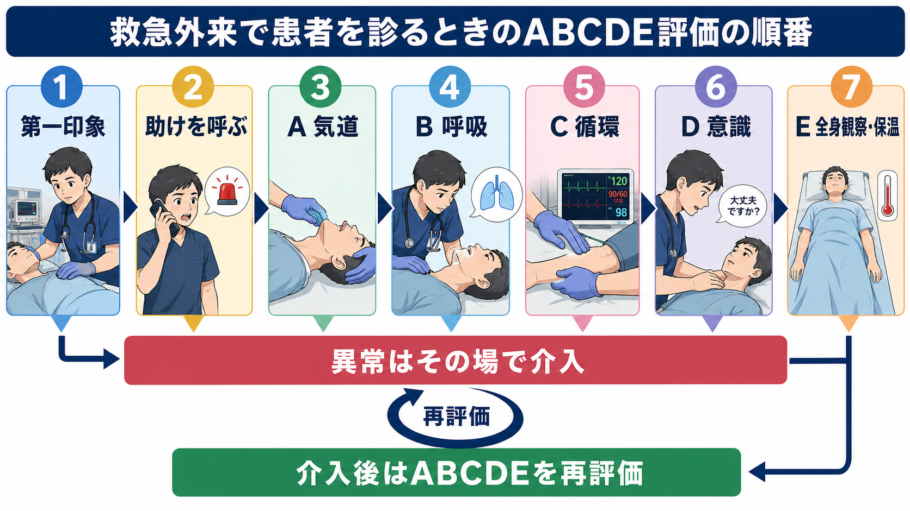
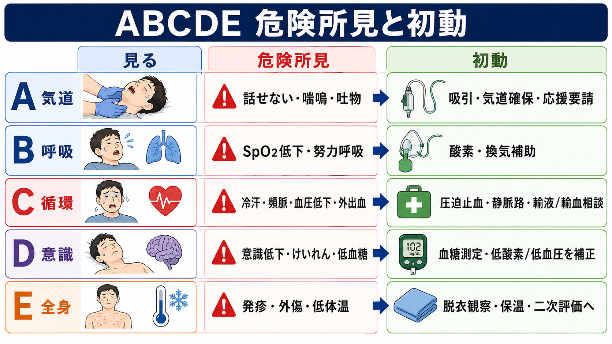
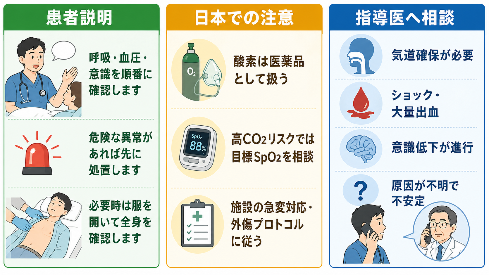

---
title: "救急外来で患者を診るときABCDE評価はどの順番で進めるか"
description: "第一印象から気道・呼吸・循環・意識・全身観察までを漏れなく評価し、重症患者を見逃さない基本手順を整理する。"
aliases:
  - "ABCDE評価の順番"
tags:
  - 領域/救急・初期対応
  - 種類/クリニカルクエスチョン
  - 対象/研修医
question: "救急外来で患者を診るときABCDE評価はどの順番で進めるか"
clinical_area: "救急・初期対応"
audience: "研修医"
evidence_level: "guideline"
created: "2026-04-27"
updated: "2026-04-27"
enableToc: true
---

# 救急外来で患者を診るときABCDE評価はどの順番で進めるか

> このノートは研修医教育のための一般的整理であり、個別患者の診断・治療指示ではありません。緊急性が高い、判断に迷う、施設方針が関わる場合は上級医・専門科に相談してください。

## クリニカルクエスチョン

救急外来で患者を診るとき、第一印象から気道・呼吸・循環・意識・全身観察まで、ABCDE評価をどの順番で進めるか。

## まず結論

- 最初に「安全確認、第一印象、応援要請、モニター・酸素・静脈路の準備」を始める。心停止または無反応・正常呼吸なしなら、ABCDE評価を続けずBLS/ALSへ移る [1,2]。
- 評価は原則として **A: Airway、B: Breathing、C: Circulation、D: Disability、E: Exposure/Environment** の順に進める [3,4]。
- 各段階で生命を脅かす異常を見つけたら、次へ進む前にその場で介入する。ABCDEは「全部見てから治療」ではなく「評価しながら安定化」する方法である [3,4]。
- 介入後は必ずAから再評価する。気道確保、酸素投与、輸液、止血、鎮静、体位変換などの処置で状態は変化する [3,4]。
- 外傷ではJATEC/ATLSの一次評価としてABCDEを用い、頸椎保護、外出血制御、低体温予防を早期に組み込む [5,6]。
- 日本では酸素は医療用医薬品として扱われる。高CO2血症リスクがある患者では、酸素投与の必要性と目標SpO2を上級医・施設プロトコルで確認する [7,8]。

## 判断の型

1. **入口で決める**: 患者を見た瞬間に、会話できるか、呼吸努力が強いか、顔色・冷汗・体動・意識がどうかを見る。危険なら応援を呼ぶ。
2. **Aから順に確認する**: Aで気道、Bで呼吸、Cで循環、Dで意識・神経、Eで全身・体温・環境を確認する。
3. **異常はその場で介入する**: 気道閉塞、低酸素、ショック、意識低下、低体温などは、原因診断を待たずに支持療法と応援要請を始める。
4. **介入後に戻る**: 酸素投与後、止血後、輸液後、気道操作後は、Aから再評価する。
5. **安定後に二次評価へ進む**: SAMPLE、主訴、既往、内服、アレルギー、身体診察、検査を広げるのは、一次評価で切迫した異常を拾った後に行う [3,4]。

## 初期対応

- **安全確認**: 感染防護、暴力・薬物曝露・放射線/化学物質曝露、外傷機転、周囲の安全を確認する。
- **第一印象**: 話せるか、座位保持できるか、呼吸音が聞こえるか、チアノーゼ・冷汗・蒼白・ぐったり感があるかを見る。
- **応援要請**: 「不安定」「気道が怪しい」「ショック」「意識低下」「重症外傷」は、研修医だけで抱えず早期に上級医、看護師、救急チーム、必要時専門科を呼ぶ [3,4]。
- **同時進行で準備**: モニター、SpO2、血圧、心電図、体温、血糖、酸素、吸引、バッグバルブマスク、静脈路/骨髄路、採血、除細動器を準備する。
- **心停止の除外**: 反応なし、正常な呼吸なし、脈拍確認に自信がない場合は、JRCに沿って胸骨圧迫とAED/除細動を優先する [1,2]。

## 鑑別・見逃し

| 優先度 | 疾患・状態 | 見逃さない理由 | 手がかり |
|---|---|---|---|
| 高 | 気道閉塞・誤嚥・アナフィラキシー | Aの異常は数分で低酸素、心停止につながる | 話せない、喘鳴、嗄声、流涎、顔面/咽頭浮腫、吐物 |
| 高 | 緊張性気胸・重症喘息/COPD増悪・肺塞栓 | Bの異常は酸素投与だけでは改善しないことがある | 努力呼吸、片側呼吸音低下、頸静脈怒張、SpO2低下、呼吸数増加 |
| 高 | ショック、敗血症、出血、ACS、大動脈疾患 | Cの異常は血圧だけでは遅れて現れる | 冷汗、末梢冷感、頻脈、意識変容、尿量低下、胸背部痛 |
| 高 | 低血糖、けいれん、脳卒中、薬物中毒 | Dの異常は低酸素・低血圧の結果でも起こる | JCS/GCS低下、瞳孔異常、片麻痺、血糖低値、薬剤歴 |
| 中 | 低体温、高体温、重症外傷、皮疹 | Eで初めて手がかりが見つかることがある | 体温異常、紫斑、外傷痕、刺創、熱傷、脱水 |

## 検査

| 検査 | 目的 | 注意点 |
|---|---|---|
| SpO2、呼吸数、聴診 | Bの異常を早く拾う | SpO2が正常でも呼吸仕事量増大、換気不全、CO中毒は見逃し得る |
| 血圧、心電図、末梢冷感、CRT | Cの異常を拾う | 血圧低下を待たず、頻脈、冷汗、意識変化を重視する |
| 血糖 | Dの可逆的原因を拾う | 意識障害では早期に測定する |
| 血液ガス、乳酸 | 呼吸不全、循環不全、代謝異常を評価する | 採血待ちで酸素、換気補助、止血、輸液などを遅らせない |
| CBC、生化学、凝固、交差適合、培養 | 出血、感染、臓器障害、輸血準備 | 状態不安定なら検査室搬送よりベッドサイド安定化を優先する |
| X線、超音波、CT | 気胸、肺炎、心嚢液、腹腔内出血、脳卒中などを評価する | CTは「ABCDEが許す患者」に行う。搬送中悪化のリスクを考える |

## 治療・マネジメント

- **A 気道**: 話せるなら気道は一定程度保たれているが、嗄声、喘鳴、吐物、顔面外傷、意識低下があれば吸引、下顎挙上、エアウェイ、バッグバルブマスク、気管挿管の準備を考える。気道確保が必要そうなら早く人を呼ぶ。
- **B 呼吸**: 呼吸数、努力呼吸、左右差、SpO2を見て、低酸素や呼吸仕事量増大があれば酸素投与、換気補助、緊張性気胸などの即時対応が必要な病態を考える [3,6]。
- **C 循環**: 外出血は圧迫止血を優先する。ショックが疑わしければモニター、太い静脈路、採血、輸液/輸血準備、感染・出血・心原性・閉塞性ショックの原因検索を並行する。
- **D 意識**: AVPU/JCS/GCS、瞳孔、麻痺、けいれん、血糖を確認する。意識障害は脳だけでなく、低酸素、低血圧、低血糖、薬物、中毒、感染の結果として扱う。
- **E 全身観察・環境**: 必要な範囲で脱衣し、背部、皮疹、外傷、刺創、熱傷、浮腫、体温を確認する。観察後は保温し、低体温を防ぐ [5,6]。
- **日本での注意**: 医療用酸素はPMDA添付文書上も医療用医薬品であり、酸素欠乏による症状改善に用いられる。長時間高濃度酸素や高CO2血症リスクでは、施設の酸素療法マニュアル、血液ガス、上級医判断に基づき目標SpO2を調整する [7,8]。

## 図解

## 指導医に確認するポイント

- 気道確保、挿管、NPPV/HFNC、バッグバルブマスク換気を誰が担当するか。
- ショックの型、輸液量、輸血開始、昇圧薬、抗菌薬、感染源コントロールをどう進めるか。
- CTや検査室へ移動できる安定度か、ベッドサイド評価を続けるべきか。
- 外傷では頸椎保護、チーム招集、輸血プロトコル、手術/IVR/転院の判断をどうするか。
- 高CO2血症リスク、妊娠、小児、高齢者、終末期方針など、通常のABCDEに加えて配慮すべき点があるか。

## 患者説明

- 「まず呼吸、血圧、意識を順番に確認します。」
- 「危ない異常があれば、原因が完全に分かる前でも先に支える処置をします。」
- 「必要な範囲で服を開いて全身を確認します。確認後は保温します。」
- 「状態が変わりやすいので、処置の後も同じ順番で繰り返し確認します。」

## ピットフォール

- 診断名を考え始めて、A/B/Cの不安定さを見落とす。
- 血圧が保たれているだけで循環は安定と判断する。
- SpO2だけを見て、呼吸数、努力呼吸、換気不全を見ない。
- 意識障害を脳疾患だけで説明し、低酸素、低血圧、低血糖を確認しない。
- 脱衣観察をした後に保温しない。
- 一度ABCDEを終えると安心し、介入後の再評価を忘れる。
- 研修医だけで不安定患者を抱え、応援要請が遅れる。

## 関連ノート

- [[救急外来で末梢冷感や網状皮斑をどう評価するか]]
- 関連ノート候補: ショックの初期対応、酸素投与の使い分け、意識障害の初期評価、気道確保の準備、外傷一次評価

## MOC更新候補

- [[MOC｜救急・初期対応]] に「ABCDE・一次評価」配下の記事として追加候補。

## 参考文献

[1] 日本蘇生協議会. JRC蘇生ガイドライン2020. https://www.jrc-cpr.org/jrc-guideline-2020/

[2] 厚生労働省. 救急医療: 救急蘇生法の指針2020（市民用）の周知. https://www.mhlw.go.jp/stf/seisakunitsuite/bunya/0000123022.html

[3] Resuscitation Council UK. The ABCDE Approach. Updated July 2024. https://www.resus.org.uk/library/abcde-approach

[4] World Health Organization and International Committee of the Red Cross. Basic emergency care: approach to the acutely ill and injured. 2018. https://www.who.int/publications-detail-redirect/9789241513081

[5] American College of Surgeons. Advanced Trauma Life Support. https://www.facs.org/quality-programs/trauma/education/advanced-trauma-life-support/

[6] Kool DR, Blickman JG. Advanced Trauma Life Support. ABCDE from a radiological point of view. Emerg Radiol. 2007;14(3):135-141. https://doi.org/10.1007/s10140-007-0633-x

[7] 日本呼吸ケア・リハビリテーション学会酸素療法マニュアル作成委員会, 日本呼吸器学会肺生理専門委員会. 酸素療法マニュアル. https://www.jrs.or.jp/publication/jrs_guidelines/20170104152945.html

[8] PMDA. 日本薬局方 酸素 添付文書等情報. https://www.pmda.go.jp/PmdaSearch/rdDetail/iyaku/799070EX1054_1?user=1

[9] NICE. Acutely ill adults in hospital: recognising and responding to deterioration. Clinical guideline CG50. https://www.nice.org.uk/Guidance/CG50

## 更新ログ

- 2026-04-27: 初版作成。
