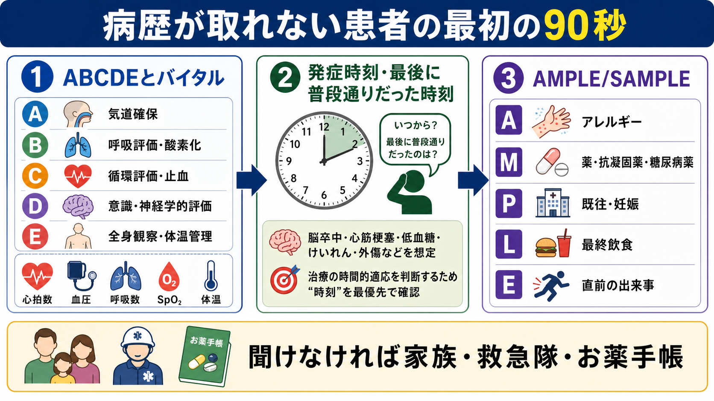
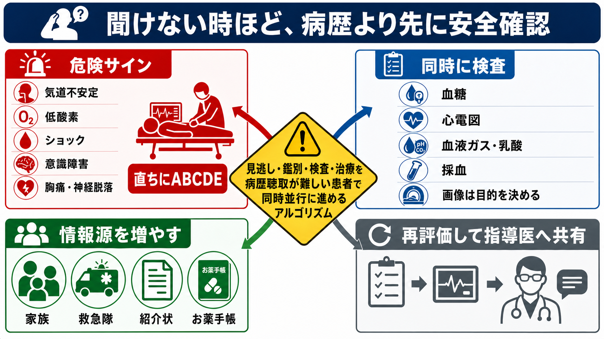
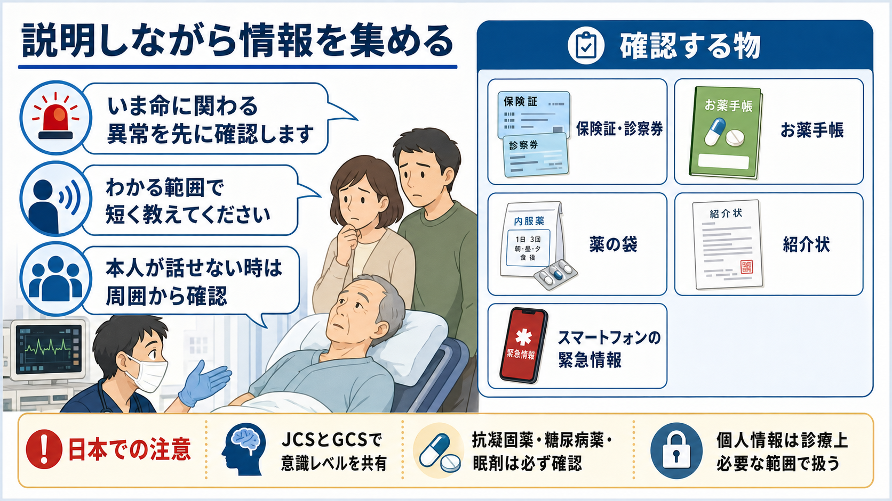

---
title: "救急外来で病歴聴取が難しい患者から何を聞くべきか"
description: "AMPLE・SAMPLE・OPQRSTを使い、病歴が十分に取れない救急患者でも短時間で診断と安全確保に必要な情報を集める。"
aliases:
  - "病歴聴取困難"
  - "AMPLE"
  - "SAMPLE"
  - "OPQRST"
tags:
  - 領域/救急・初期対応
  - 種類/クリニカルクエスチョン
  - 対象/研修医
question: "救急外来で病歴聴取が難しい患者から何を聞くべきか"
clinical_area: "救急・初期対応"
audience: "研修医"
evidence_level: "mixed"
created: "2026-04-27"
updated: "2026-04-27"
enableToc: true
---

# 救急外来で病歴聴取が難しい患者から何を聞くべきか

> このノートは研修医教育のための一般的整理であり、個別患者への診断・治療指示ではありません。緊急性が高い、判断に迷う、施設方針が関わる場合は上級医・救急担当医に相談してください。

## クリニカルクエスチョン

救急外来で、意識障害、疼痛、呼吸困難、認知症、せん妄、言語障害、酩酊、パニック、重症感などのために病歴聴取が難しい患者から、最初に何を聞くべきか。

## まず結論

- 病歴が取れない患者では、詳しい問診より先に **ABCDE、バイタル、意識レベル、血糖** を確認し、生命危機を処置しながら情報を集める[1][7][8]。
- 最初に聞くのは「主訴」よりも、**発症時刻、最後に普段通りだった時刻、直前の出来事、薬剤、アレルギー、既往、妊娠可能性、最終飲食** である。これは脳卒中、心筋梗塞、敗血症、外傷、中毒、低血糖、緊急手術・鎮静の判断に直結する[3][6][9]。
- 本人から聞けなければ、**家族、救急隊、同伴者、施設職員、紹介状、お薬手帳、薬袋、スマートフォンの緊急情報** を情報源にする。救急隊の経過は、発症時刻、現場状況、搬送中のバイタル変化を含むため優先度が高い[7][9]。
- 聞く型は、全例で **AMPLE/SAMPLE**、痛みや胸腹部症状では **OPQRST** を使う。聞けた項目と聞けなかった項目を明示して、再評価で埋める[9][10]。
- 日本では意識レベルを **JCSとGCS** の両方、または少なくとも施設標準の尺度で共有する。JCS 1でも意識障害として扱うべき状況があり、軽く見ない[3][4]。

## 判断の型

1. **安全確保**: まずABCDE、バイタル、SpO2、体温、意識レベル、血糖を確認する。異常があれば問診を止めずに、処置・モニター・応援要請を同時に行う[1][7][8]。
2. **時刻を押さえる**: 「いつから」「最後に普段通りだったのはいつか」「発見時の状態」を最優先で確認する。脳卒中、けいれん、失神、外傷、敗血症、急性冠症候群では時間情報が治療選択に関わる。
3. **AMPLE/SAMPLEで最低限をそろえる**: Allergy、Medication、Past history/Pregnancy、Last meal、Eventを聞く。SAMPLEではSigns/Symptomsを先頭に置く。
4. **症状が話せるならOPQRST**: Onset、Provocation/Palliation、Quality、Region/Radiation、Severity、Time courseを短く聞く。胸痛、腹痛、頭痛、背部痛、四肢痛で特に有用。
5. **情報源を増やす**: 本人だけで完結させない。家族、救急隊、施設、かかりつけ、紹介状、薬剤情報を同時に集める。
6. **要約して再評価**: 「いま分かっていること」「不明なこと」「危険サイン」「次に確認すること」を上級医へSBARで共有する[7]。

## 初期対応

- 到着直後に、名前・反応・発語の有無を見ながら気道と意識を同時に評価する。はっきり話せない、嗄声、喘鳴、泡沫状痰、嘔吐、顔面外傷があれば気道リスクとして扱う。
- 最初の一言は「いつからですか」より、状況に応じて「最後に普通に会話できたのはいつですか」「倒れる前に何をしていましたか」「薬は何を飲んでいますか」を優先する。
- 意識障害、けいれん後、冷汗、ふらつき、異常行動、ろれつ困難では、低血糖を鑑別に入れて迅速血糖を確認する。PMDAの重篤副作用マニュアルでも低血糖は意識障害・けいれん・異常行動を来しうる副作用として扱われている[6]。
- 服薬確認では、薬剤名が言えない場合でも「お薬手帳」「薬袋」「一包化の袋」「施設の薬剤表」「スマートフォンの写真」を探す。抗凝固薬、抗血小板薬、糖尿病薬、降圧薬、抗てんかん薬、睡眠薬、向精神薬、オピオイド、免疫抑制薬は優先して確認する[5]。
- 本人に説明できる状態なら、「命に関わる異常を先に確認します。分かる範囲で短く教えてください」と伝える。説明は協力を得るためであり、詳細な同意取得を長引かせて初期対応を遅らせない。

## 鑑別・見逃し

| 優先度 | 疾患・状態 | 見逃さない理由 | 手がかり |
|---|---|---|---|
| 高 | 気道閉塞、低酸素、ショック | 病歴より先に介入が必要 | 発語不能、SpO2低下、頻呼吸、冷汗、末梢冷感、血圧低下 |
| 高 | 脳卒中、頭蓋内出血、けいれん後 | 発症時刻と最後に普段通りだった時刻が治療選択に関わる | 片麻痺、共同偏視、失語、突然発症、抗凝固薬 |
| 高 | 急性冠症候群、大動脈解離、肺塞栓 | 痛みの性状や放散だけでなく危険因子と発症状況が重要 | 胸背部痛、失神、呼吸困難、冷汗、血圧左右差 |
| 高 | 低血糖・高血糖緊急症 | 問診不能の原因そのものになり、可逆的 | 糖尿病薬、食事摂取不良、腎機能低下、冷汗、異常行動[6] |
| 高 | 中毒・薬剤性 | 眠剤、アルコール、オピオイド、抗コリン薬などは病歴聴取を妨げる | 薬袋、空包、瞳孔、呼吸数、同居者情報 |
| 中 | 敗血症、髄膜炎、熱中症 | 発熱がなくても重症化しうる | 体温異常、頻呼吸、意識変容、皮疹、感染巣 |
| 中 | 外傷・虐待・転倒 | 本人が説明できず、受傷機転が不明なことが多い | 救急隊情報、衣類損傷、皮下出血、抗凝固薬 |

## 検査

| 検査 | 目的 | 注意点 |
|---|---|---|
| バイタル、SpO2、体温、意識レベル | 悪化リスクを早期に拾う | NICEは初期評価で心拍数、呼吸数、収縮期血圧、意識レベル、酸素飽和度、体温を最低限記録することを推奨している[8] |
| 迅速血糖 | 問診不能・意識障害の可逆的原因を拾う | 低血糖症状は非特異的で、異常行動やけいれんとして出ることがある[6] |
| 心電図 | 胸痛、呼吸困難、失神、ショック、意識障害の鑑別 | 症状を語れない高齢者・糖尿病患者ではACSを除外しにくい |
| 血液ガス、乳酸 | 低酸素、換気不全、循環不全、代謝異常の把握 | 採血結果待ちでABCDEを遅らせない |
| 採血、尿検査、薬毒物関連検査 | 感染、貧血、電解質、腎機能、薬剤性の評価 | 施設で使える検査と結果時間を把握する |
| CT、超音波、X線 | 頭蓋内病変、外傷、肺疾患、腹部疾患の確認 | 画像は「何を除外したいか」を決めて依頼する |

## 治療・マネジメント

- 病歴聴取が難しい時ほど、**問診を完璧にしてから処置する** のではなく、ABCDEで生命危機を処置しながら最小限の病歴を集める[7]。
- 低酸素、ショック、けいれん、重度低血糖、重症外傷、敗血症疑い、急性冠症候群疑い、脳卒中疑いでは、早期に上級医へ共有し、チームで役割分担する。
- 薬剤確認は診断と安全確保の両方に重要である。抗凝固薬は頭部外傷・出血、糖尿病薬は低血糖、眠剤・向精神薬・オピオイドは意識障害や呼吸抑制、免疫抑制薬は重症感染の評価に関わる[5][6]。
- 鎮痛・鎮静・処置が必要な時は、最終飲食、アレルギー、内服薬、既往、妊娠可能性を確認する。確認できない場合は「不明」と明記し、リスクを上級医と共有する。
- 日本での注意: JCSは国内の救急・病棟で共有されやすいが、国際的にはGCSやAVPUが多く使われる。救急隊・院内・転院先で尺度が違う場合は、数値だけでなく「開眼、発語、従命、痛み刺激への反応」を言葉で補う[3][4]。
- 日本での注意: 薬剤名・適応・用量・禁忌は国や製品で異なる。救急で薬剤性を疑う時は、PMDAの医療用医薬品情報検索や添付文書、患者向医薬品ガイドで国内製品情報を確認する[5]。

## 図解

## 指導医に確認するポイント

- この患者で、病歴聴取より先に処置すべきABCDE異常はあるか。
- 発症時刻、最後に普段通りだった時刻、発見状況は治療方針に影響するか。
- 抗凝固薬、糖尿病薬、睡眠薬、向精神薬、オピオイド、免疫抑制薬の確認は十分か。
- 画像検査は「何を除外するためか」が明確か。
- 本人から聞けない情報を、家族・救急隊・施設・かかりつけに誰が確認するか。

## 患者説明

- 「いまは詳しい原因を決める前に、呼吸、循環、意識、血糖など命に関わる異常を先に確認しています。」
- 「ご本人が話しにくい状態なので、分かる範囲で、いつから、普段通りだった最後の時刻、飲んでいる薬、アレルギー、持病を教えてください。」
- 「お薬手帳、薬の袋、紹介状、スマートフォンの緊急情報があれば確認します。診療に必要な範囲で扱います。」
- 「今の時点で分からないことは、不明として扱い、安全側に確認を進めます。」

## ピットフォール

- 詳細な現病歴にこだわり、低酸素、ショック、低血糖、けいれん、脳卒中、ACSを見逃す。
- 「本人が話せない」ことを情報不足のまま放置し、救急隊や家族が帰ってから重要情報を聞き逃す。
- 発症時刻だけ聞いて、**最後に普段通りだった時刻** を確認しない。
- 「薬はありません」という返答で止め、実際の薬袋・お薬手帳・施設薬剤表を確認しない。
- JCSやGCSの数字だけを申し送り、具体的な反応を共有しない。
- せん妄、認知症、酩酊、精神症状として片づけ、低酸素、低血糖、感染、頭蓋内病変、中毒を除外しない。

## 関連ノート

- [[MOC｜救急・初期対応]]
- 関連ノート候補（未作成）: ショック患者を見たら最初に何をするか
- 関連ノート候補（未作成）: 意識障害を見たら最初に何を確認するか
- 関連ノート候補（未作成）: 救急外来で血糖をいつ測るか
- 関連ノート候補（未作成）: 救急隊からの申し送りで何を聞くか

## MOC更新候補

- [[MOC｜救急・初期対応]] に「ABCDE・一次評価」配下の記事として追加候補。
- MOC｜医療安全・法律・倫理.md（本サイト外） に「本人から同意・病歴が得にくい場面の安全確認」として関連候補。
- MOC｜薬剤・処方・副作用.md（本サイト外） に「救急で薬剤情報を確認する場面」として関連候補。

## 参考文献

[1] 日本蘇生協議会. JRC蘇生ガイドライン2020. https://www.jrc-cpr.org/jrc-guideline-2020/

[2] 日本救急医療財団心肺蘇生法委員会 監修. 改訂6版 救急蘇生法の指針2020 医療従事者用. へるす出版; 2022. DOI: https://doi.org/10.32209/9784867190357

[3] 日本救急医学会. 医学用語解説集: 意識障害. https://www.jaam.jp/dictionary/dictionary/word/1025.html

[4] 山口陽子, 田中博之. 救急救命士らが現場でJapan Coma Scale（JCS）=1と判定した症例は意識障害として扱うべきである. 日本臨床救急医学会雑誌. 2016;19(1):21-28. DOI: https://doi.org/10.11240/jsem.19.21

[5] 独立行政法人 医薬品医療機器総合機構. 医薬品や医療機器等の情報を調べる. https://www.pmda.go.jp/search_index.html

[6] 独立行政法人 医薬品医療機器総合機構. 重篤副作用疾患別対応マニュアル（医療関係者向け）: 低血糖. https://www.pmda.go.jp/safety/info-services/drugs/adr-info/manuals-for-hc-pro/0001.html

[7] Resuscitation Council UK. The ABCDE Approach. Updated July 2024. https://www.resus.org.uk/library/abcde-approach

[8] National Institute for Health and Care Excellence. Acutely ill adults in hospital: recognising and responding to deterioration. NICE guideline CG50. https://www.nice.org.uk/guidance/CG50

[9] Zemaitis MR, Planas JH, Waseem M. Trauma Secondary Survey. StatPearls. Updated July 25, 2023. https://www.ncbi.nlm.nih.gov/books/NBK441902/

[10] University of Florida College of Medicine - Jacksonville. Pain Assessment and Management Initiative (PAMI): Basics of Pain Assessment and Management. https://pami.emergency.med.jax.ufl.edu/e-learning-modules/

## 更新ログ

- 2026-04-27: 初版作成。
