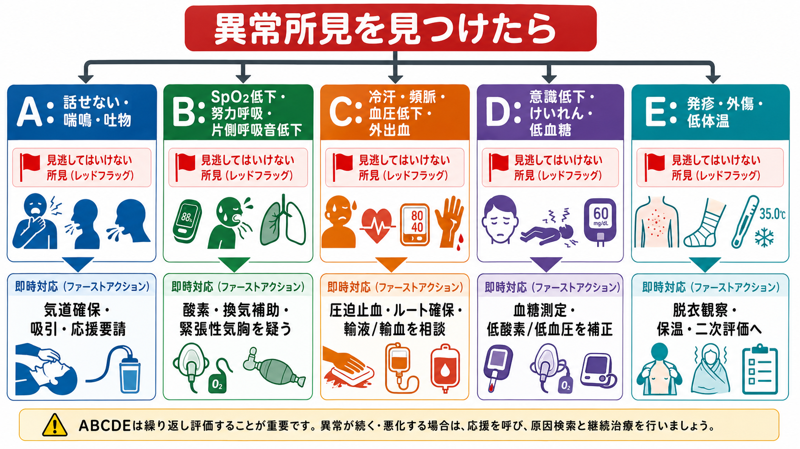
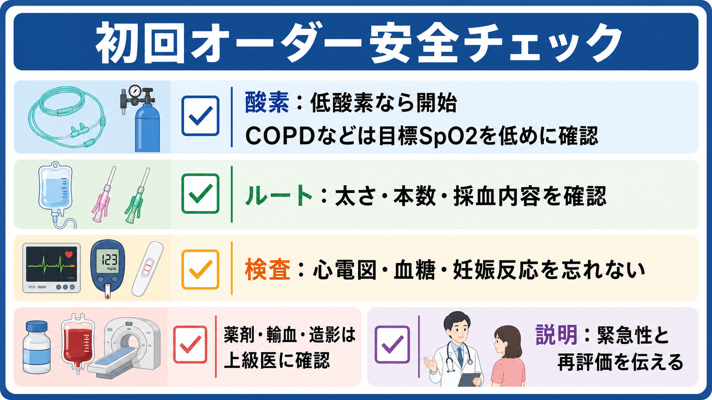

---
title: "救急外来で研修医が最初にオーダーしてよいことは何か"
description: "酸素、モニター、ルート、採血、心電図など、救急外来で研修医が初動として進めやすい安全性の高いオーダーと確認事項を整理する。"
aliases:
  - "救急外来の初回オーダー"
tags:
  - 領域/救急・初期対応
  - 種類/クリニカルクエスチョン
  - 対象/研修医
question: "救急外来で研修医が最初にオーダーしてよいことは何か"
clinical_area: "救急・初期対応"
audience: "研修医"
evidence_level: "guideline"
created: "2026-04-27"
updated: "2026-04-27"
enableToc: true
---

# 救急外来で研修医が最初にオーダーしてよいことは何か

> このノートは研修医教育のための一般的整理であり、個別患者の診断・治療指示ではありません。緊急性が高い、判断に迷う、施設方針が関わる場合は上級医・専門科に相談してください。

## クリニカルクエスチョン

救急外来で研修医が患者到着直後に、酸素、モニター、ルート、採血、心電図などをどこまで先にオーダーしてよいか。

## まず結論

- 最初にしてよいことは「診断を決めるオーダー」ではなく、「悪化を見逃さず、蘇生と再評価を始められる準備」である。WHO/ICRCのBasic Emergency Careも、初期評価をABCDEで進め、生命を脅かす問題へ同時並行で対応する考え方を採用している[1]。
- 低酸素、呼吸困難、ショック、意識障害、胸痛、けいれん、外傷などでは、上級医へ共有しながら、モニター装着、血圧・SpO2・体温・意識の反復評価、静脈路確保、必要な採血、血糖測定、12誘導心電図を先に進めてよいことが多い[2,3]。厚生労働省の臨床研修到達目標でも、救急医療ではバイタルサイン、重症度・緊急度、ショック対応、専門医へのコンサルテーションが経験目標に含まれる[10]。
- 酸素は安全そうに見えても医薬品であり、低酸素や呼吸仕事量増大がある患者に投与し、COPDなど高二酸化炭素血症リスクでは目標SpO2を低めに設定するか上級医に確認する[4,5]。
- 発熱・低血圧・頻呼吸・意識変容などで敗血症を疑う場合、乳酸、血液培養2セット、感染巣検体、初期輸液や抗菌薬の準備を遅らせない。ただし抗菌薬選択、昇圧薬、ICU相談は施設手順と上級医判断に乗せる[6,7]。
- 胸痛・息切れ・失神・動悸では、12誘導心電図は早く取るほど価値が高い。結果の解釈、抗血小板薬、抗凝固薬、再灌流判断は上級医・循環器へ早期共有する[3,8]。
- 研修医が単独で決めないほうがよいものは、薬剤投与の開始・増量、輸血、造影CT、鎮静、侵襲的処置、帰宅可否、DNARや治療制限の決定である。初動オーダー後は「結果を待つ」のではなく、ABCDEとバイタルを戻って再評価する[1,2]。

## 判断の型

1. **まず呼ぶ**: 患者が不安定、または自分が不安なら、オーダー入力より先に上級医・看護師へ「今危ない可能性がある」と共有する。JRC蘇生ガイドラインはBLS/ALS、ACS、脳神経蘇生などを救急蘇生の基本領域として整理しており、早期認識とチーム対応が前提になる[3]。
2. **ABCDEで見る**: Airway、Breathing、Circulation、Disability、Exposureの順に、今すぐ介入すべき異常を拾う[1]。
3. **測る**: 心電図モニター、SpO2、非侵襲的血圧、体温、呼吸数、意識レベルをそろえ、異常値は測り直してトレンドで見る。NICEは急性期の初期評価で心拍数、呼吸数、収縮期血圧、意識、酸素飽和度、体温を最低限記録することを推奨している[2]。
4. **取る**: 末梢静脈路、採血、血糖、12誘導心電図など、低侵襲で後続判断に直結するものを先に進める。
5. **戻る**: オーダー後に検査室や端末へ離れず、呼吸、循環、意識、痛み、出血、尿量、皮膚所見を再評価する。

## 初期対応

- **酸素**: SpO2低下、チアノーゼ、呼吸仕事量増大、ショック、意識障害、けいれん、重症外傷などでは投与を準備する。酸素はPMDA上も「日本薬局方 酸素」として医療用医薬品情報が公開されており、漫然投与ではなく適応と目標を意識する[4]。
- **モニター**: 不安定、胸痛、息切れ、失神、動悸、意識障害、重症感染疑い、薬物中毒、電解質異常疑いでは心電図モニター、SpO2、血圧測定を始める。モニターは「見ている」だけではなく、アラーム設定と記録間隔まで看護師と共有する[2]。
- **ルート**: ショック、出血、嘔吐・脱水、敗血症疑い、造影・鎮静・輸血の可能性がある患者では末梢静脈路を確保する。太さ、本数、採血を同時に行うかは病態と施設手順で調整する。
- **採血**: CBC、生化学、腎機能、電解質、肝胆道系、凝固、血液ガス・乳酸、心筋トロポニン、妊娠反応、血液型・交差適合の準備などは、主訴と重症度で目的を持って選ぶ。敗血症疑いでは乳酸測定と血液培養2セットを早期に考える[6,7]。
- **心電図**: 胸痛だけでなく、息切れ、失神、動悸、ショック、意識障害、電解質異常疑い、薬物中毒では12誘導心電図を早めに取る。急性冠症候群を疑う場合、心電図とトロポニンの早期評価が重要である[3,8]。
- **血糖**: 意識障害、けいれん、冷汗、ふらつき、糖尿病治療中、敗血症疑い、アルコール関連では、採血結果を待たずベッドサイド血糖を確認する。
- **隔離・感染対策**: 発熱、咳、発疹、下痢、海外渡航歴、曝露歴がある場合は、診断前でも標準予防策と必要な隔離を先に相談する。

## 鑑別・見逃し

| 優先度 | 疾患・状態 | 見逃さない理由 | 手がかり |
|---|---|---|---|
| 高 | 気道閉塞・アナフィラキシー | 酸素や採血より先に気道・循環の介入が必要になる | 話せない、喘鳴、顔面・舌の腫脹、蕁麻疹、血圧低下 |
| 高 | ショック | ルート、輸液、輸血、昇圧薬、原因検索を同時並行で進める必要がある | 冷汗、頻脈、低血圧、CRT延長、乏尿、意識変容 |
| 高 | 敗血症・敗血症性ショック | 乳酸、血液培養、抗菌薬、初期蘇生の遅れが転帰に関わる | 発熱または低体温、頻呼吸、意識変容、低血圧、感染巣[6,7] |
| 高 | 急性冠症候群 | 心電図変化やトロポニン上昇を早期に拾う必要がある | 胸痛、圧迫感、息切れ、冷汗、失神、糖尿病・高齢者の非典型症状[3,8] |
| 高 | 脳卒中・くも膜下出血 | 画像、血糖、抗凝固薬内服、発症時刻の確認が急ぐ | 片麻痺、構音障害、共同偏視、突然の激しい頭痛、意識障害 |
| 高 | 外傷性出血・内出血 | 低血圧が出る前から循環不全が進むことがある | 受傷機転、腹痛、骨盤痛、抗凝固薬、皮膚冷感、FAST陽性 |
| 中 | 異所性妊娠・産婦人科救急 | 妊娠可能年齢では腹痛・失神・出血の鑑別に必須 | 月経遅延、下腹部痛、不正出血、ショック |
| 中 | 中毒・薬剤性 | 心電図、意識、呼吸、低血糖、体温異常を同時に見る | 内服歴、散瞳・縮瞳、QT延長、徐脈、けいれん |

## 検査

| 検査 | 目的 | 注意点 |
|---|---|---|
| バイタル反復測定 | 悪化傾向と介入反応を見る | 単回値ではなく、測定条件と時刻を残す[2] |
| 12誘導心電図 | ACS、不整脈、電解質異常、中毒を拾う | 胸痛・息切れ・失神では早期に取り、異常があればすぐ共有する[3,8] |
| ベッドサイド血糖 | 低血糖・高血糖緊急症を見逃さない | 意識障害では採血結果を待たない |
| 静脈血液ガス・動脈血液ガス、乳酸 | 換気、酸塩基、循環不全、敗血症評価 | 乳酸高値は敗血症以外でも上がるため文脈で解釈する[6,7] |
| CBC、生化学、電解質、腎機能、肝胆道系 | 貧血、感染、腎不全、電解質異常、臓器障害を評価 | 採血セットの丸投げではなく主訴に対応させる |
| 凝固、血液型、交差適合 | 出血、抗凝固薬、輸血準備 | 輸血開始は上級医と施設手順に従う |
| 血液培養2セット | 敗血症・菌血症疑いで抗菌薬前に原因検索 | 採取で抗菌薬が大きく遅れる場合は上級医と優先順位を決める[6,7] |
| 妊娠反応 | 妊娠関連救急、薬剤、画像検査の判断 | 妊娠可能年齢の腹痛・失神・出血では低い閾値で確認する |
| 画像検査 | 出血、肺炎、気胸、脳卒中、大動脈疾患などの評価 | 造影CT、鎮静、搬送リスクは単独判断にしない |

## 治療・マネジメント

- **初動で進めやすいもの**: 酸素投与の準備、モニター装着、バイタル反復、末梢静脈路、採血、血糖測定、12誘導心電図、尿検査、妊娠反応、血液培養、標準予防策は、患者安全に直結し、後続判断の土台になる[1,2,6]。
- **上級医へ確認して進めるもの**: 抗菌薬選択、輸液量の大きなボーラス、昇圧薬、抗血小板薬・抗凝固薬、鎮痛・鎮静、輸血、造影CT、侵襲的処置、帰宅判断、入院先調整は、病態・禁忌・施設運用の影響が大きい。
- **酸素の考え方**: BTSは急性期酸素療法で、多くの急性疾患ではSpO2 94-98%、高二酸化炭素血症リスクでは88-92%などの目標範囲を示している[5]。日本でも酸素はPMDAの医療用医薬品情報に基づく医薬品であり、施設の酸素投与プロトコル、デバイス、流量、目標SpO2を確認する[4]。
- **敗血症疑い**: J-SSCG2024バンドルは、感染と臓器障害を疑ったら迅速評価、SOFA、乳酸、血液培養2セット、感染巣検体、初期蘇生、抗菌薬を直ちに考える流れを示している[6]。SSC 2021も乳酸測定、血液培養、抗菌薬、輸液、必要時昇圧薬を早期に進めることを強調する[7]。
- **胸痛・ACS疑い**: JRCのACS章とAHA/ACC胸痛ガイドラインは、急性胸痛評価で心電図と心筋トロポニンを重視している[3,8]。心電図は取るだけでなく、ST上昇、新規虚血変化、危険な不整脈を見たらその場で声に出して共有する。
- **日本での注意**: 酸素、抗菌薬、抗凝固薬、造影剤、輸血、昇圧薬は、日本の添付文書、保険適用、院内採用薬、救急外来プロトコル、看護師実施可能範囲に左右される。海外ガイドラインの用量・運用をそのままオーダーに落とし込まず、日本の添付文書と院内手順を確認する。

## 図解

## 指導医に確認するポイント

- この患者は「今すぐ処置室・蘇生ベッド・高次対応」に上げるべきか。
- 酸素の目標SpO2、投与デバイス、CO2貯留リスクをどう設定するか。
- ルートの太さと本数、採血項目、血液ガス、乳酸、血液培養、交差適合をどこまで同時に出すか。
- 抗菌薬、輸液量、昇圧薬、鎮痛・鎮静、輸血、造影CTを開始してよい条件は何か。
- 心電図、血糖、乳酸、血圧、意識レベルの異常を誰に、どのタイミングで共有するか。
- 帰宅候補に見えても、再診指示、観察時間、追加検査、専門科相談が必要な条件は何か。

## 患者説明

- 「まず命に関わる変化がないか確認するため、心電図モニター、血圧、酸素の値を続けて見ます。」
- 「点滴の管を確保し、必要な血液検査と心電図を先に行います。結果が出る前にも状態が変わらないか繰り返し確認します。」
- 「酸素や点滴は、今の呼吸や血圧を見ながら必要性を判断します。薬や詳しい治療は上級医とも相談して決めます。」
- 「検査の途中でも息苦しさ、胸痛、意識が遠のく感じ、痛みの悪化があればすぐ知らせてください。」

## ピットフォール

- オーダー入力に集中して、ベッドサイドの再評価が止まる。
- 酸素を「とりあえず全員に投与」と考え、COPDなどCO2貯留リスクの目標SpO2確認を忘れる[5]。
- モニターを付けたことで安心し、アラーム設定、血圧測定間隔、看護師との共有をしていない。
- 採血項目だけ増やして、血糖、心電図、乳酸、血液培養など時間依存性の高い検査を後回しにする[6-8]。
- 胸痛がないから心電図不要と考え、息切れ、失神、意識障害、電解質異常、中毒を見逃す。
- 「研修医が先に出してよいオーダー」と「研修医が単独で治療方針を決めてよいこと」を混同する。

## 関連ノート

- 関連ノート候補: ショックを疑ったとき最初に何を見るか（本サイト未同梱）
- 関連ノート候補: 胸痛患者で最初に見逃してはいけない疾患は何か（本サイト未同梱）
- 関連ノート候補: 敗血症を疑ったとき最初の1時間に何をするか（本サイト未同梱）
- 関連ノート候補: 救急外来で血液ガスをいつ取るか（本サイト未同梱）

## MOC更新候補

- [[MOC｜救急・初期対応]] に「ABCDE・一次評価」の初回オーダー記事として追加候補。
- MOC｜検査・画像・手技.md（本サイト外） に「救急初期検査の考え方」として相互参照候補。
- MOC｜薬剤・処方・副作用.md（本サイト外） に「酸素は医薬品として目標を設定する」観点の関連候補。

## 参考文献

[1] World Health Organization and International Committee of the Red Cross. (2018). *Basic emergency care: approach to the acutely ill and injured: participant workbook*. ISBN 9789241513081. https://iris.who.int/handle/10665/275635

[2] National Institute for Health and Care Excellence. (2007). *Acutely ill adults in hospital: recognising and responding to deterioration* (CG50). https://www.nice.org.uk/guidance/CG50

[3] 日本蘇生協議会. (2020). *JRC蘇生ガイドライン2020*. https://www.jrc-cpr.org/jrc-guideline-2020/

[4] 医薬品医療機器総合機構. (2026). *日本薬局方 酸素 医療用医薬品情報*. https://www.pmda.go.jp/PmdaSearch/rdDetail/iyaku/799070EX1054_1?user=1

[5] O'Driscoll BR, Howard LS, Earis J, Mak V; British Thoracic Society Emergency Oxygen Guideline Group. (2017). BTS guideline for oxygen use in adults in healthcare and emergency settings. *Thorax*, 72(Suppl 1), ii1-ii90. https://doi.org/10.1136/thoraxjnl-2016-209729

[6] 日本集中治療医学会・日本救急医学会. (2024). *日本版敗血症診療ガイドライン2024 初期治療とケアバンドル*. https://www.jaam.jp/info/2024/files/bundle.pdf

[7] Evans L, Rhodes A, Alhazzani W, et al. (2021). Surviving Sepsis Campaign: International Guidelines for Management of Sepsis and Septic Shock 2021. *Intensive Care Medicine*, 47, 1181-1247. https://doi.org/10.1007/s00134-021-06506-y

[8] Gulati M, Levy PD, Mukherjee D, et al. (2021). 2021 AHA/ACC/ASE/CHEST/SAEM/SCCT/SCMR Guideline for the Evaluation and Diagnosis of Chest Pain. *Journal of the American College of Cardiology*, 78(22), e187-e285. https://doi.org/10.1016/j.jacc.2021.07.053

[9] 日本救急医療財団心肺蘇生法委員会. (2022). *改訂6版 救急蘇生法の指針2020 医療従事者用*. https://doi.org/10.32209/9784867190357

[10] 厚生労働省. (2003). *別添 臨床研修の到達目標*. https://www.mhlw.go.jp/topics/bukyoku/isei/rinsyo/keii/030818/030818b.html

## 更新ログ

- 2026-04-27: 初版作成。
