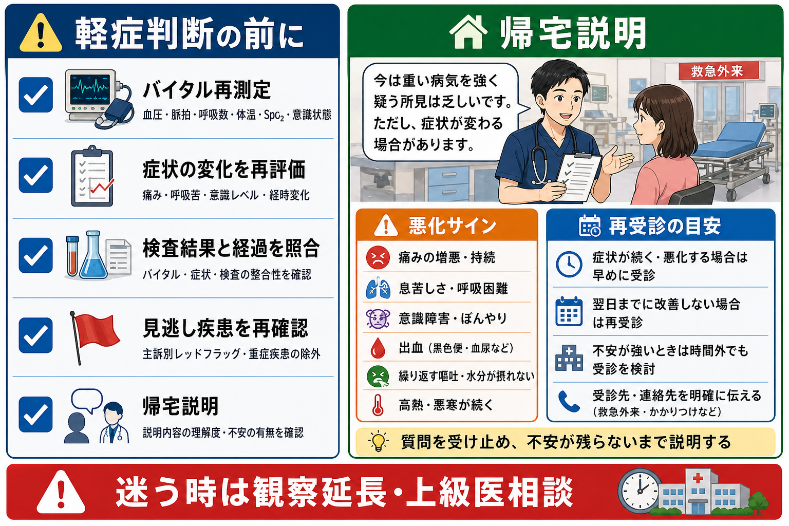
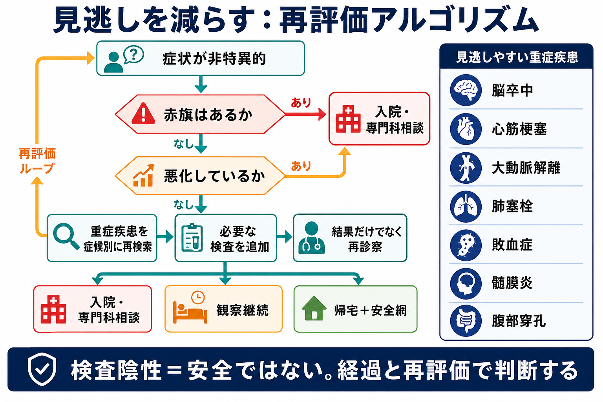
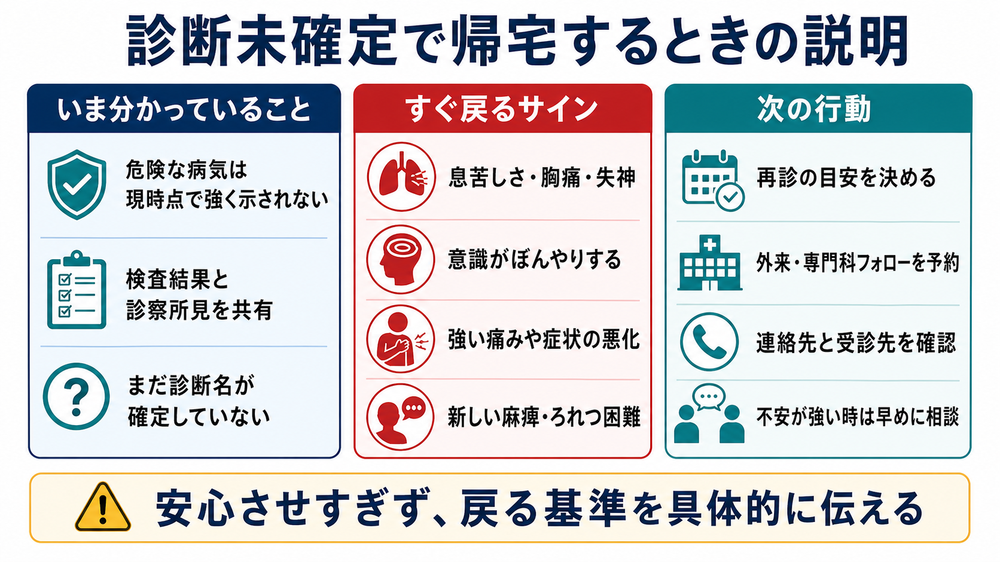

---
title: "救急外来で診断がつかない患者をどうマネジメントするか"
description: "不確実性が残る状況で、観察・追加検査・入院・帰宅指示をどう組み立てるかを学ぶ。"
aliases:
  - "診断未確定患者の救急外来マネジメント"
tags:
  - 領域/救急・初期対応
  - 種類/クリニカルクエスチョン
  - 対象/研修医
question: "救急外来で診断がつかない患者をどうマネジメントするか"
clinical_area: "救急・初期対応"
audience: "研修医"
evidence_level: "mixed"
created: "2026-04-27"
updated: "2026-04-27"
enableToc: true
---

# 救急外来で診断がつかない患者をどうマネジメントするか

> このノートは研修医教育のための一般的整理であり、個別患者の診断・治療指示ではありません。緊急性が高い、判断に迷う、施設方針が関わる場合は上級医・専門科に相談してください。

## クリニカルクエスチョン

救急外来で診断がつかない患者を、観察・追加検査・入院・帰宅指示のどれに進めるか、どのような型で判断すればよいか。

## まず結論

- 救急外来のゴールは、必ずしもその場で最終診断名をつけることではなく、「今すぐ介入が必要な病態を除外・治療し、次に安全な場所を決めること」である[1,2]。
- 診断がつかない時ほど、最初に ABCDE、バイタル、意識、疼痛、歩行、経時変化を再評価する。NICE は急性期患者で心拍数、呼吸数、収縮期血圧、意識、SpO2、体温などを記録し、悪化を検出する仕組みを推奨している[3]。
- 「検査が陰性」だけで帰宅可とはしない。AHRQ の救急外来診断エラーのレビューでは、脳卒中、心筋梗塞、大動脈解離、肺塞栓、血栓症などが見逃しによる重篤害と関連しやすい[4]。
- 観察は「検査待ちの保留」ではなく、再診察、バイタル再測定、症状トレンド、治療反応、家族・本人の違和感を評価する能動的な介入である。観察ユニットは、帰宅には不安が残るが通常入院までは要しない患者に、時間軸での評価を加える選択肢とされる[5]。
- 帰宅にする場合は、「危険な病気は現時点で強く示されないが、診断名は未確定」と明示し、再受診基準、フォロー先、連絡手段を具体化する。診断不確実性を伝えるチェックリストでは、検査結果、未確定であること、次の行動、戻る理由を説明する項目が重視されている[6,7]。
- 日本での注意: 二次・三次救急、救命救急センター、地域の救急相談窓口、紹介状・逆紹介、当直帯の専門科対応は地域差が大きい。帰宅時には、地域で利用可能な救急相談窓口や再診先を施設方針に沿って案内する[8,9]。

## 判断の型

1. **生理学的に安全かを先に決める。** 診断名より先に、気道、呼吸、循環、意識、体温、SpO2、尿量、疼痛、歩行、出血、感染兆候を見直す。悪化傾向や補助が必要な状態なら、診断未確定でも上級医・専門科へ早期相談する[2,3]。
2. **「見逃すと死ぬ・障害が残る疾患」を症候別に再検索する。** 非特異的症状ほど、脳卒中、心筋梗塞、大動脈解離、肺塞栓、敗血症、髄膜炎、腹部穿孔、異所性妊娠、中毒、外傷を再確認する[4]。
3. **時間軸を診断に使う。** 初診時点で分からない病気はある。観察、再診察、再検査、画像の再検討、家族からの追加病歴で、症状の方向性をみる[5]。
4. **帰宅可否は「医学的リスク」と「生活上の安全性」を合わせて決める。** 独居、認知機能、言語、移動、服薬、再診アクセス、家族の観察力、経済的・社会的制約は処分決定に影響する[5]。
5. **不確実性を説明して安全網を張る。** 「大丈夫です」ではなく、「現時点で危険な所見は乏しいが、変化したら戻る」という表現にする[6,7]。

## 初期対応

- **ABCDEで再評価する。** 気道閉塞、呼吸不全、ショック、意識障害、低体温・高体温、出血、アナフィラキシーなどがあれば、原因検索を待たずに安定化を優先する[2]。
- **バイタルは一度で終えない。** 初回正常でも、疼痛、発熱、脱水、出血、敗血症、薬剤、アルコール、待機時間で変化する。NICE は急性期患者に多項目の観察と track-and-trigger の使用を推奨している[3]。
- **第一印象を記録する。** 「いつもと違う」「歩けない」「顔色が悪い」「会話が遅い」「家族が強く心配している」など、検査値に出にくい異常を残す。
- **初期検査を目的別に選ぶ。** 心電図、血糖、妊娠反応、尿検査、血液ガス、乳酸、CBC、生化学、凝固、トロポニン、Dダイマー、感染検査、画像は、症候と危険疾患から逆算して選ぶ。
- **疼痛・嘔吐・不安への対処を遅らせない。** 症状緩和は診断を曇らせるだけではなく、再診察しやすくする。鎮痛後にも腹膜刺激や神経所見などを再評価する。
- **日本での注意: 造影CTを急ぐ時も安全確認を短く入れる。** ヨード造影剤はショック・アナフィラキシーを起こし得るため、アレルギー歴、喘息、過去の造影剤反応、腎機能、メトホルミンなどを施設手順に沿って確認する。ただし生命危機が強い場合は、上級医・放射線科とリスクを共有して遅延を最小化する[10]。

## 鑑別・見逃し

| 優先度 | 疾患・状態 | 見逃さない理由 | 手がかり |
|---|---|---|---|
| 高 | 脳卒中・くも膜下出血 | 時間依存の治療、後遺症リスク | 突然発症、片麻痺、失語、めまい＋歩行不能、激しい頭痛、抗凝固薬 |
| 高 | 急性冠症候群 | 心停止・心不全・致死的不整脈 | 胸痛、息切れ、冷汗、嘔気、高齢者・糖尿病の非典型症状、心電図変化 |
| 高 | 大動脈解離・動脈瘤破裂 | 急変しやすく、初期検査で見逃される | 移動する痛み、神経症状、左右差、失神、縦隔拡大、Dダイマー高値のみで断定しない |
| 高 | 肺塞栓 | 呼吸循環破綻、症状が非特異的 | 息切れ、胸痛、頻脈、低酸素、下肢腫脹、悪性腫瘍、手術・臥床、妊娠・産褥 |
| 高 | 敗血症・髄膜炎 | 早期治療が予後に直結 | 発熱または低体温、頻呼吸、意識変容、低血圧、項部硬直、皮疹、免疫不全 |
| 高 | 腹部穿孔・腸管虚血・胆道感染 | 初期に腹部所見が乏しいことがある | 高齢者、抗菌薬・ステロイド使用、乳酸上昇、持続痛、腹膜刺激、造影CT適応 |
| 高 | 異所性妊娠・卵巣茎捻転 | 妊娠可能年齢では診断遅れが危険 | 腹痛、性器出血、失神、妊娠反応、下腹部痛 |
| 中 | 中毒・薬剤性・離脱 | 病歴が取りにくく、意識障害や不整脈の原因 | 家族情報、薬袋、瞳孔、発汗、QT延長、低血糖、アセトアミノフェン |
| 中 | 高齢者の外傷・虐待・ネグレクト | 訴えが曖昧で重症外傷が隠れる | 転倒歴不明、抗凝固薬、皮下出血、ADL低下、家族説明の不一致 |

## 検査

| 検査 | 目的 | 注意点 |
|---|---|---|
| 反復バイタル・意識評価 | 悪化の早期検出 | 呼吸数、SpO2、意識、体温は抜けやすい。NEWS2など施設採用スコアがあれば活用する[3]。 |
| 12誘導心電図 | ACS、不整脈、電解質異常 | 初回正常でも、症状持続・再燃なら再検する。 |
| 血糖・血液ガス・乳酸 | 低血糖、呼吸不全、ショック、敗血症 | 乳酸単独で診断しない。臨床経過と合わせて評価する。 |
| CBC、生化学、肝胆膵、凝固 | 貧血、感染、腎機能、電解質、肝胆膵疾患 | 正常値でも早期疾患は否定できない。前回値があれば差分を見る。 |
| トロポニン | ACS評価 | 発症時刻と再検タイミングを確認する。施設プロトコルに従う。 |
| Dダイマー | 肺塞栓・大動脈解離などの補助 | 事前確率が低い時の除外に使う。高値だけで診断しない。 |
| 妊娠反応 | 妊娠関連救急の見逃し防止 | 妊娠可能年齢では症状にかかわらず早めに確認する。 |
| 尿検査 | 感染、血尿、ケトン、脱水 | 尿路感染と決めつけず、発熱・腹痛の他疾患を再確認する。 |
| CT・エコー・X線 | 重症疾患の検索、侵襲的処置の判断 | 画像陰性でも早期疾患は残る。造影のリスクと遅延リスクを比較する[10]。 |
| 観察中の再診察 | 時間経過で所見を拾う | 検査結果だけを待たず、疼痛、歩行、腹部、神経、呼吸状態を繰り返し見る。 |

## 治療・マネジメント

### 観察を選ぶとき

- 帰宅には不安があるが、ただちに入院適応とは言い切れない。
- 症状が進行中、発症早期、検査の再評価タイミングが必要、治療反応を見たい。
- 独居・高齢・認知機能低下・再受診困難など、家庭での観察が弱い。
- 観察中は「何を、何時間、どの基準で判断するか」を書く。例: バイタル再測定、疼痛再評価、心電図再検、トロポニン再検、腹部再診察、歩行確認、経口摂取確認。

### 追加検査を選ぶとき

- 危険疾患の事前確率が残る、初回検査が発症早期、所見と検査結果が合わない。
- 「検査を増やす」より、「この検査でどの危険疾患を除外または支持したいか」を明確にする。
- 画像検査は、陰性でも臨床疑いが高い時は上級医・専門科・放射線科と再検討する。

### 入院・専門科相談を選ぶとき

- バイタル異常、意識障害、強い疼痛、進行性症状、重症疾患の可能性、治療を要する検査異常がある。
- 帰宅後の悪化時に戻れない、自己管理できない、家族の観察が乏しい、社会的リスクが高い。
- 診断未確定でも、処分理由を「○○疑い」だけでなく「観察・治療・再評価が必要」と説明する。

### 帰宅を選ぶとき

- 危険疾患の可能性が十分低く、バイタルが安定し、症状が改善または許容範囲で、再診アクセスが確保できる。
- 診断が未確定であること、現時点で分かったこと、予想される経過、家庭での対応、再受診基準、フォロー時期を説明する[6,7]。
- 口頭説明だけに頼らず、可能なら書面で残す。退院指示の理解・想起にはばらつきがあるため、診断、治療、フォロー、戻る理由を具体的に伝える[7]。

## 図解

## 指導医に確認するポイント

- この患者で「見逃すと致命的な疾患」は何か。今の検査でどこまで下がったか。
- バイタル、症状、診察所見は時間経過で改善しているか、悪化しているか。
- 追加検査、観察、入院、帰宅のうち、最も安全な次の場所はどれか。
- 造影CT、専門科コール、入院相談を遅らせることで、どのリスクが増えるか[10]。
- 帰宅させるなら、本人・家族が再受診基準を理解し、実際に戻れる環境か。
- 「診断がつかないから帰宅」ではなく、「現時点の危険度、残る不確実性、次の行動」をカルテに残せているか。

## 患者説明

- 「今日の診察と検査では、今すぐ命に関わる病気を強く示す結果はありませんでした。ただし、症状の原因が完全に分かったわけではありません。」
- 「病気によっては、最初の数時間では検査に出にくいことがあります。症状の変化が大事です。」
- 「胸痛、息苦しさ、失神、意識がぼんやりする、麻痺、ろれつが回らない、強い痛み、出血、繰り返す嘔吐、高熱が続く、症状が悪くなる時は、待たずに救急外来へ戻ってください。」
- 「次の受診先と時期はここです。迷う場合は、地域で使える救急相談窓口や当院へ相談してください。」
- 「不安が残る場合や、家で様子を見るのが難しい場合は、観察を延ばす選択もあります。遠慮せず伝えてください。」

## ピットフォール

- 検査陰性を「安全」と言い換える。早期の心筋梗塞、脳卒中、腹部疾患、敗血症は初回検査で拾えないことがある[4]。
- バイタル再測定を忘れる。特に呼吸数、SpO2、体温、意識レベルは、悪化の早期サインになりやすい[3]。
- 高齢者、免疫不全、妊娠、抗凝固薬内服、認知症、独居を通常リスクと同じに扱う。
- 「専門科に相談しにくい」「入院ベッドがない」など運用上の事情で医学的リスクを過小評価する。
- 帰宅説明で「大丈夫」とだけ言う。診断未確定であること、戻る基準、フォロー先を明確にする[6,7]。
- カルテに不確実性と判断過程を残さない。何を除外し、何が残り、なぜ帰宅・観察・入院にしたかを書く。
- 日本での注意: 地域の救急相談窓口、二次救急・三次救急の役割、夜間専門科対応、紹介先は施設・地域で違う。自施設の導線を事前に確認する[8,9]。

## 関連ノート

- 関連ノート候補（未リンク）: ABCDE評価、ショックの初期対応、胸痛の救急対応、腹痛の救急対応、めまい・頭痛の危険徴候、敗血症の初期対応、造影CTの適応と注意。
- 既存ノート確認後に内部リンク化する。

## MOC更新候補

- [[MOC｜救急・初期対応]]
- [[MOC｜ABCDE・一次評価]]

## 参考文献

[1] 日本臨床救急医学会. JTASコースについて: Japan Triage and Acuity Scale. https://jsem.me/training/ctas/index.html

[2] 日本蘇生協議会. JRC蘇生ガイドライン2020. https://www.jrc-cpr.org/jrc-guideline-2020/

[3] National Institute for Health and Care Excellence. Acutely ill adults in hospital: recognising and responding to deterioration. NICE Clinical guideline CG50. https://www.nice.org.uk/guidance/CG50

[4] Newman-Toker DE, Peterson SM, Badihian S, et al. Diagnostic Errors in the Emergency Department: A Systematic Review. AHRQ Comparative Effectiveness Review No. 258. 2022; updated 2023. https://doi.org/10.23970/AHRQEPCCER258

[5] Society for Academic Emergency Medicine. Disposition of the Emergency Department Patient; History of Observation Medicine. https://www.saem.org/about-saem/academies-interest-groups-affiliates2/cdem/for-students/online-education/m3-curriculum/disposition/disposition-of-the-emergency-department-patient

[6] Rising KL, Powell RE, Cameron KA, et al. Development of the Uncertainty Communication Checklist: A Patient-Centered Approach to Patient Discharge From the Emergency Department. Academic Medicine. 2020;95(7):1026-1034. https://doi.org/10.1097/ACM.0000000000003231

[7] Hoek AE, Anker SCP, van Beeck EF, Burdorf A, Rood PPM, Haagsma JA. Patient Discharge Instructions in the Emergency Department and Their Effects on Comprehension and Recall of Discharge Instructions: A Systematic Review and Meta-analysis. Annals of Emergency Medicine. 2020;75(3):435-444. https://doi.org/10.1016/j.annemergmed.2019.06.008

[8] 厚生労働省. 救急医療提供体制の現況調べ（令和4年度実績）について. https://www.mhlw.go.jp/stf/newpage_50431.html

[9] 総務省消防庁. 救急安心センター事業（♯7119）ってナニ？ https://www.fdma.go.jp/mission/enrichment/appropriate/appropriate007.html

[10] PMDA. イオパミロン注（イオパミドール）医療用医薬品情報; 日本腎臓学会・日本医学放射線学会・日本循環器学会. 腎障害患者におけるヨード造影剤使用に関するガイドライン2018. https://www.pmda.go.jp/PmdaSearch/rdSearch/02/7219412A6071?user=1 / https://minds.jcqhc.or.jp/summary/c00490/

## 更新ログ

- 2026-04-27: 初版作成。
