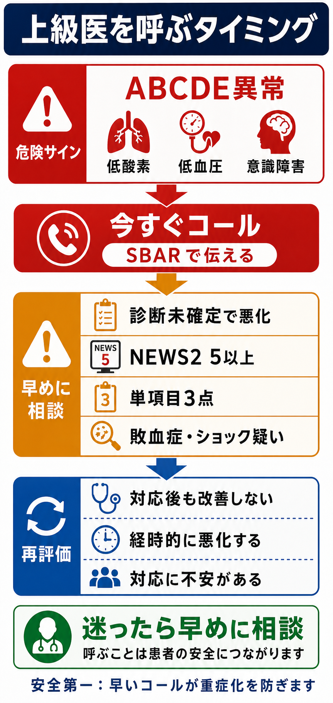
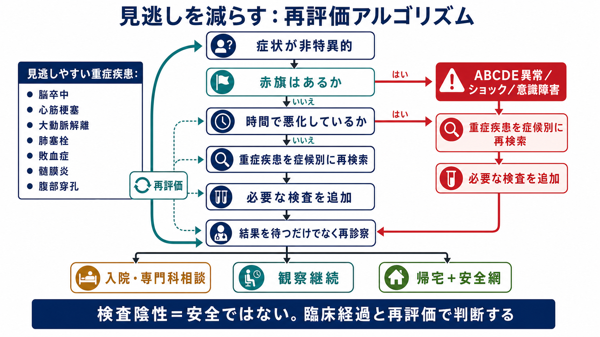
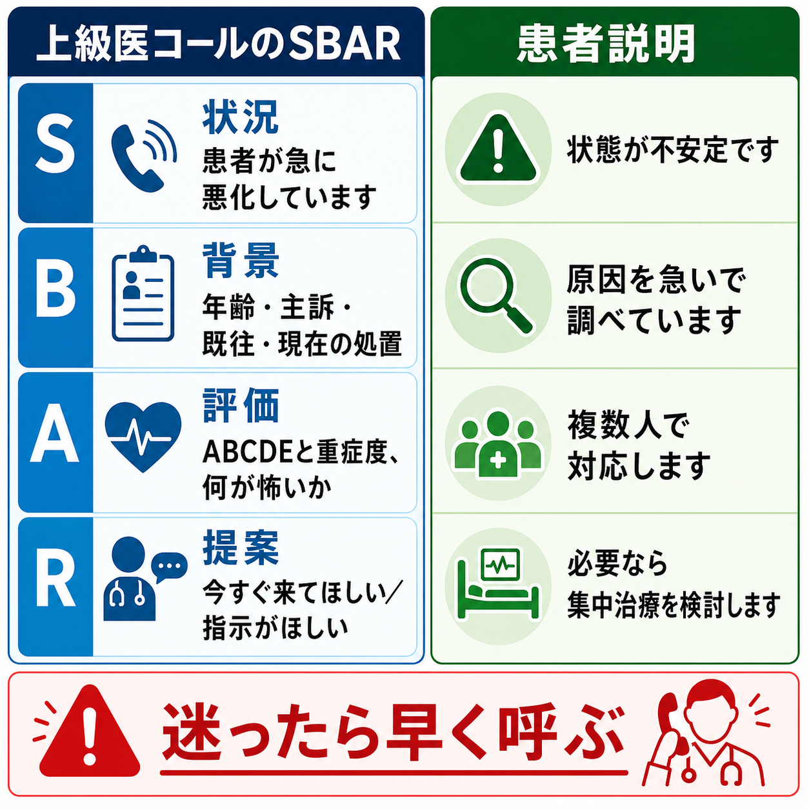

---
title: "救急患者で上級医を呼ぶタイミングはどう判断するか"
description: "研修医が一人で抱え込まず、危険なバイタル、ABCDE異常、診断未確定の急変例で早めに上級医へエスカレーションするための判断基準。"
aliases:
  - "上級医コール"
tags:
  - 領域/救急・初期対応
  - 種類/クリニカルクエスチョン
  - 対象/研修医
question: "救急患者で上級医を呼ぶタイミングはどう判断するか"
clinical_area: "救急・初期対応"
audience: "研修医"
evidence_level: "mixed"
created: "2026-04-27"
updated: "2026-04-27"
enableToc: true
---

# 救急患者で上級医を呼ぶタイミングはどう判断するか

> このノートは研修医教育のための一般的整理であり、個別患者の診断・治療指示ではありません。緊急性が高い、判断に迷う、施設方針が関わる場合は上級医・専門科に相談してください。

## クリニカルクエスチョン

救急外来・病棟急変で、研修医が「自分でどこまで見るか」と「いつ上級医を呼ぶか」をどう判断するか。

## まず結論

- **ABCDEのどれかが破綻しそうなら、診断名がつく前に上級医を呼ぶ。** 気道、呼吸、循環、意識の異常は、原因検索より先に人を集める合図である。[1],[2]
- **NEWS2 5点以上、または単一項目3点相当の異常は、少なくとも緊急レビューの水準**として扱う。NEWS2 7点以上相当、心停止・呼吸停止・ショックでは救急チーム、ICU、専門科を含めて同時に動く。[3],[4]
- **「診断未確定で悪化している」「検査陰性だが様子がおかしい」「処置後も改善しない」も呼ぶ理由になる。** スコアよりも臨床的懸念を優先する。[3],[4]
- **呼ぶ前に完璧な鑑別を作らない。** まず応援要請、モニター、酸素、静脈路、血糖、心電図、必要な蘇生準備を並行する。[1],[2]
- **SBARで短く伝える。** 「状況、背景、評価、依頼」を30-60秒で言えると、上級医は来るべき緊急度と持参すべき準備を判断しやすい。[5]
- 日本ではRRS、救急コール、ICUコール、当直上級医への連絡経路が施設で異なる。**ローカルな起動基準と電話番号を勤務前に確認する**ことが安全行動である。[6]

## 判断の型

1. **赤信号なら即コール**  
   心停止・呼吸停止、気道閉塞、SpO2低下、収縮期血圧低下、ショック徴候、意識障害、けいれん、急速な出血、アナフィラキシー疑い、重症外傷は、診断確定前に上級医・救急チームへ連絡する。[1],[2]
2. **スコア化できるものはスコア化する**  
   呼吸数、SpO2、酸素投与、収縮期血圧、脈拍、意識、体温をそろえ、NEWS2や施設の早期警告スコアで共通言語にする。[3],[4]
3. **スコアが低くても「違和感」があれば相談する**  
   NICEは、悪化リスクへの反応はスコアだけでなく臨床的懸念でも起動すべきとしている。[3]
4. **呼ぶ内容をSBARに圧縮する**  
   S: 何が起きているか、B: どんな患者か、A: 何が危ないと考えるか、R: 何を依頼するか、の順で伝える。[5]
5. **上級医を待つ間に再評価する**  
   ABCDE、バイタル、モニター波形、尿量、疼痛、意識、検査結果を時系列で追い、悪化すれば再コールする。

## 初期対応

- **人を呼ぶ**: 上級医、看護師リーダー、救急チーム、RRS、ICU、専門科、放射線、検査部など、施設の経路で同時に動かす。
- **場所を整える**: 処置室、蘇生室、モニター可能なベッド、酸素・吸引・バッグバルブマスク・除細動器を準備する。
- **ABCDEを同時並行で見る**: 気道の開通、呼吸数とSpO2、循環と末梢冷感、意識、体温・発疹・外傷を確認する。
- **最小限の即時検査**: 血糖、12誘導心電図、血液ガス・乳酸、採血、血液培養、尿検査、妊娠反応、必要な画像を目的別に追加する。
- **記録する**: 呼んだ時刻、呼んだ相手、伝えた内容、返答、バイタル推移、処置への反応を残す。RRS運用では起動事例のデータ収集と振り返りも重要である。[6]

## 鑑別・見逃し

| 優先度 | 疾患・状態 | 見逃さない理由 | 手がかり |
|---|---|---|---|
| 高 | 心停止・呼吸停止前状態 | 数分単位で転帰が変わる | 反応なし、異常呼吸、脈拍不明、徐脈・頻脈、チアノーゼ |
| 高 | 敗血症・敗血症性ショック | 迅速評価、培養、抗菌薬、初期蘇生、ICU判断が必要 | 感染疑い、GCS低下、呼吸数増加、収縮期血圧低下、乳酸上昇、尿量低下 [7] |
| 高 | 急性冠症候群・致死的不整脈 | ECGと再灌流・除細動の遅れが危険 | 胸痛、冷汗、失神、ST変化、広範な不整脈 |
| 高 | 脳卒中・頭蓋内出血 | 時間依存の治療と気道管理が関わる | 片麻痺、失語、突然の頭痛、意識障害、抗凝固薬 |
| 高 | アナフィラキシー | 気道浮腫・ショックへ急速に進む | 蕁麻疹、喘鳴、血圧低下、消化器症状、曝露歴 |
| 高 | 大出血・大動脈解離・肺塞栓・緊張性気胸 | 初期画像がそろう前にショック化する | 胸背部痛、呼吸困難、片側呼吸音低下、頸静脈怒張、外傷、DVTリスク |
| 中 | 低血糖・電解質異常・薬物中毒 | 治療可能だが見逃すと意識障害・不整脈 | 血糖異常、QT延長、徐脈、縮瞳、服薬歴 |

## 検査

| 検査 | 目的 | 注意点 |
|---|---|---|
| バイタル再測定、NEWS2/施設スコア | 悪化の客観化、上級医への共通言語 | スコアは臨床判断を置き換えない。違和感があれば低スコアでも相談する。[3],[4] |
| 血糖 | 意識障害・けいれん・発汗の可逆因子 | 指先血糖だけで終わらず、原因と再低下を確認する。 |
| 12誘導心電図・モニター | ACS、不整脈、高K血症、QT延長 | 胸痛なしのACSや電解質異常もある。 |
| 血液ガス、乳酸 | 低酸素、換気不全、代謝性アシドーシス、循環不全 | 敗血症疑いでは乳酸測定と再評価が初期対応の一部になる。[7] |
| 採血、血液培養、尿・喀痰など | 感染、貧血、電解質、腎肝機能、凝固 | 抗菌薬開始を不必要に遅らせない。培養採取と初期治療を並行する。[7],[8] |
| 画像検査 | 気胸、肺炎、出血、解離、脳卒中、腹部疾患 | 不安定患者を検査室へ動かす前に、搬送可否を上級医と決める。 |

## 治療・マネジメント

- **最初の治療は「診断確定」ではなく「破綻の予防」から始める。** 酸素、気道確保準備、体位、吸引、静脈路、輸液、圧迫止血、低血糖補正、除細動器準備などを、上級医を呼びながら進める。[1],[2]
- **敗血症疑いでは、迅速評価、乳酸、培養、経験的抗菌薬、感染巣探索、初期蘇生をセットで考える。** J-SSCG2024は、感染と臓器障害を疑ったら迅速評価と初期治療バンドルを行う構成を示している。[7]
- **昇圧薬、輸血、鎮静、気管挿管、抗血栓療法、侵襲的処置は一人で開始しない。** 必要性が迫るほど、上級医・専門科・ICUへ早くつなぐ。
- **日本での注意**: NEWS2は有用な共通言語だが、国内全施設で標準化された法的・制度的起動基準ではない。RRSの有無、救急外来の指揮系統、ICU受け入れ、当直専門科、輸血・造影・鎮静の承認手順は施設ごとに異なる。[3],[6]
- **日本での注意**: ノルアドレナリンやアドレナリンはPMDA添付文書上もショック・心停止などで扱われる薬剤だが、適応、投与経路、希釈、モニタリング、副作用、施設プロトコルの確認が必須である。研修医単独の判断で投与設計しない。[9],[10]
- **エスカレーション後も自分の役割を持つ。** バイタル推移を読む、家族情報を集める、検査を追う、投薬歴とアレルギーを確認する、記録係になる、搬送準備をする。

## 図解

## 指導医に確認するポイント

- この施設で「即コール」「RRS起動」「ICU相談」になる具体的なバイタル・症状・スコアは何か。
- NEWS2や院内早期警告スコアをどの場面で使い、どの点数で誰に連絡するか。
- 救急外来で診断未確定のまま帰宅を検討してよい条件、観察入院にする条件は何か。
- 敗血症疑い、胸痛、脳卒中疑い、アナフィラキシー、外傷、大出血で専門科へ同時連絡する基準は何か。
- 輸液、昇圧薬、抗菌薬、鎮静、輸血、造影CT、気管挿管の施設プロトコルと、研修医が単独で行ってよい範囲はどこまでか。

## 患者説明

- 「状態が不安定なため、原因を調べながら複数の医師・看護師で対応します。」
- 「現時点では診断が確定していない部分がありますが、危険な病気を見逃さないように検査と再評価を進めます。」
- 「必要に応じて、集中治療室、専門科、別の検査室へ移動して詳しく対応します。」
- 「ご家族に確認したい病歴や薬があります。分かる範囲で教えてください。」

## ピットフォール

- **「まだ診断がついていないから呼べない」と考える。** 呼ぶ理由は診断名ではなく、重症度、不確実性、悪化速度である。
- **呼ぶ前に検査をそろえようとして時間を失う。** 不安定患者では、検査オーダーより応援要請が先になることがある。
- **SpO2や血圧だけを見る。** 呼吸数、意識、尿量、末梢冷感、皮膚、疼痛の変化が先に悪化を示すことがある。
- **「検査陰性」を安全と誤解する。** 初回心電図、初回CT、初回血液検査が陰性でも、症状の進行や再評価で方針は変わる。
- **電話で依頼内容が曖昧になる。** 「見に来てほしい」「今すぐ来てほしい」「ICU適応を相談したい」「挿管準備を一緒に判断したい」まで言う。
- **患者・家族説明を後回しにしすぎる。** 不確実性と緊急性を短く共有し、検査・処置・移動の同意と情報収集を並行する。

## 関連ノート

- 現時点で確認済みの関連ノートなし。
- 関連ノート候補: 「ABCDE評価の進め方」「ショック患者の初期対応」「敗血症を疑う救急患者の初期対応」「救急外来で帰宅させてよいか迷うときの判断」。

## MOC更新候補

- [[MOC｜救急・初期対応]]
- MOC｜医療安全・法律・倫理.md（本サイト外）
- MOC｜病棟管理・退院支援.md（本サイト外）

## 参考文献

[1] 日本蘇生協議会. JRC蘇生ガイドライン2020. https://www.jrc-cpr.org/jrc-guideline-2020/

[2] American Heart Association. 2025 American Heart Association Guidelines for Cardiopulmonary Resuscitation and Emergency Cardiovascular Care: Adult Basic Life Support. https://cpr.heart.org/en/resuscitation-science/cpr-and-ecc-guidelines/adult-basic-and-advanced-life-support

[3] National Institute for Health and Care Excellence. Acutely ill adults in hospital: recognising and responding to deterioration. NICE guideline CG50. https://www.nice.org.uk/guidance/cg50

[4] Royal College of Physicians. National Early Warning Score (NEWS) 2: Standardising the assessment of acute-illness severity in the NHS. Updated report of a working party. 2017. https://www.rcp.ac.uk/improving-care/resources/national-early-warning-score-news-2/

[5] Agency for Healthcare Research and Quality. TeamSTEPPS: Tool: SBAR. https://www.ahrq.gov/teamstepps-program/curriculum/communication/tools/sbar.html

[6] 中村京太, 飯尾純一郎, 鹿瀬陽一, ほか. Rapid Response System運用指針. 日本集中治療医学会雑誌. 2025;32:2400002. https://doi.org/10.3918/jsicm.2400002

[7] 日本集中治療医学会, 日本救急医学会. 日本版敗血症診療ガイドライン2024（J-SSCG2024）. 日本集中治療医学会雑誌. 2024;31(Suppl):S1165-S1313. https://doi.org/10.3918/jsicm.2400001

[8] Evans L, Rhodes A, Alhazzani W, et al. Surviving Sepsis Campaign: International Guidelines for Management of Sepsis and Septic Shock 2021. Intensive Care Med. 2021;47:1181-1247. https://doi.org/10.1007/s00134-021-06506-y

[9] PMDA. ノルアドリナリン注1mg 医療用医薬品情報. https://www.pmda.go.jp/PmdaSearch/rdSearch/02/2451401A1034?user=1

[10] PMDA. アドレナリン注0.1%シリンジ「テルモ」 医療用医薬品情報. https://www.pmda.go.jp/PmdaSearch/rdSearch/02/2451402G1040?user=1

## 更新ログ

- 2026-04-27: 初版作成。
