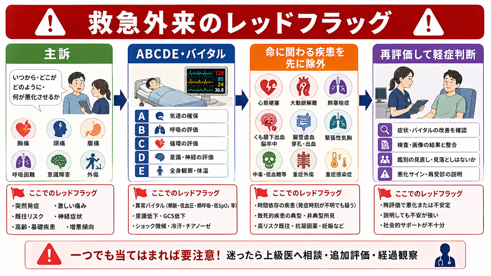
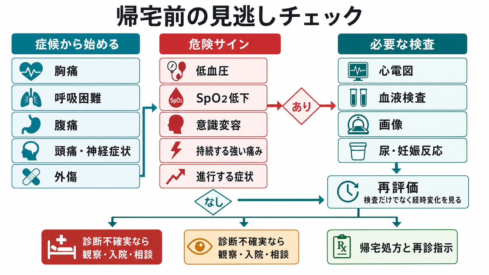
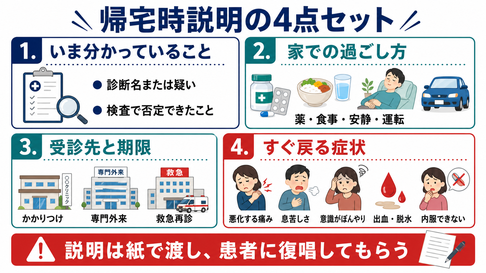

---
title: "救急患者の帰宅可否はどう判断するか"
description: "診断の確からしさ、悪化リスク、再診指示、社会背景を踏まえた安全な帰宅判断を整理する。"
aliases:
  - "救急帰宅判断"
tags:
  - 領域/救急・初期対応
  - 種類/クリニカルクエスチョン
  - 対象/研修医
question: "救急患者の帰宅可否はどう判断するか"
clinical_area: "救急・初期対応"
audience: "研修医"
evidence_level: "mixed"
created: "2026-04-27"
updated: "2026-04-27"
enableToc: true
---

# 救急患者の帰宅可否はどう判断するか

> このノートは研修医教育のための一般的整理であり、個別患者の診断・治療指示ではありません。緊急性が高い、判断に迷う、施設方針が関わる場合は上級医・専門科に相談してください。

## クリニカルクエスチョン

救急外来で初期評価・検査・治療を終えた患者を、帰宅としてよいか、観察・入院・専門科相談にすべきかをどう判断するか。

## まず結論

- 帰宅可否は「病名が軽いか」ではなく、1) 生理学的に安定している、2) 見逃すと危険な疾患を症候ごとに十分に下げた、3) 症状とバイタルが経時的に悪化していない、4) 帰宅後に悪化時の再受診が実行できる、の4条件で判断する。
- 帰宅直前のバイタル異常は軽視しない。高齢者のED帰宅例では、低血圧、頻脈、発熱、低酸素が7日以内入院と関連し、異常が複数あるほどリスクが高いと報告されている [8]。
- 「検査が陰性」は「安全に帰宅できる」と同義ではない。検査前確率、発症からの時間、検査の限界、症状の推移を合わせて再評価する [5]。
- 診断が不確実なまま帰宅する場合は、曖昧な「様子を見て」ではなく、戻る症状、戻る期限、受診先、交通手段、付き添い、内服できない場合の対応を具体的に書面で渡す [4], [6], [7]。
- 社会背景は医学的判断の一部である。独居、認知機能低下、言語・聴覚の障壁、経済的事情、移動手段なし、DV・虐待疑い、介護者不在は、観察延長や入院・地域連携の理由になり得る [4], [7]。
- 日本では、救急医療体制や救急相談・受診先は地域差が大きい。帰宅指示には「自院へ再診」「救急車」「#7119など地域の救急相談」「翌日かかりつけ」など、患者が実際に使える選択肢を書く [1], [2]。

## 判断の型

1. **ABCDEとバイタルを帰宅直前に再確認する。** 気道、呼吸、循環、意識、体温、SpO2、疼痛、歩行、経口摂取、尿量を見直し、初診時から改善しているかを確認する [5]。
2. **症候別に「帰せない疾患」を再検索する。** 胸痛ならACS・大動脈解離・肺塞栓、頭痛ならくも膜下出血・髄膜炎、腹痛なら腸管虚血・穿孔・異所性妊娠、発熱なら敗血症など、致死性と時間依存性が高い疾患を先に下げる [1], [3], [5]。
3. **診断の確からしさを言語化する。** 「確定診断」「暫定診断」「危険疾患を一定程度除外したが未確定」のどれかを記録し、未確定なら観察・再診計画を厚くする。
4. **治療反応と経時変化を見る。** 鎮痛、補液、解熱、制吐、気管支拡張、創処置などの後に、症状・バイタル・診察所見が期待どおり改善したか確認する。
5. **帰宅後の安全網を確認する。** 本人が説明を理解し復唱できるか、付き添いがいるか、夜間に戻れるか、処方を使えるか、翌日フォロー先があるかを確認する [6], [7]。

## 初期対応

- まず重症患者として扱うべき所見を探す。意識障害、ショック、呼吸不全、重度疼痛、持続する出血、痙攣、麻痺、敗血症疑い、重症外傷、妊娠関連急症は、帰宅判断より安定化と上級医・専門科相談を優先する [1], [3], [5]。
- 初診時のバイタルだけでなく、帰宅直前のバイタルを記録する。頻呼吸、SpO2低下、頻脈、低血圧、発熱、低体温、意識変容は「説明できているか」「改善しているか」「再悪化時に戻れるか」を確認する [5], [8]。
- 高齢者、乳幼児、妊婦、免疫抑制、透析、抗凝固薬内服、重い併存症、認知症・せん妄、施設入所者では、同じ症状でも悪化の余裕が小さい。消防庁の緊急度判定プロトコルも、重症度だけでなく時間経過で悪化する可能性を重視している [1]。
- 帰宅候補でも、鎮痛・補液・経口摂取・歩行確認・排尿確認など、症候に応じた「帰宅前の小さな再評価」を挟む。

## 鑑別・見逃し

| 優先度 | 疾患・状態 | 見逃さない理由 | 手がかり |
|---|---|---|---|
| 高 | 急性冠症候群 | 初期心電図や単回トロポニンだけでは不十分なことがある | 胸痛、息切れ、冷汗、高齢・糖尿病の非典型症状 |
| 高 | 大動脈解離 | 痛みが軽くても致死的、神経症状や腹痛で来ることがある | 移動する痛み、左右差、神経症状、失神 |
| 高 | 肺塞栓症 | バイタルが保たれても急変し得る | 息切れ、胸痛、低酸素、頻脈、DVTリスク |
| 高 | 敗血症・重症感染症 | 初期は発熱だけ、または低体温・意識変容のみのことがある | 頻呼吸、低血圧、意識変容、免疫抑制、乳酸上昇 [3] |
| 高 | 頭蓋内出血・髄膜炎 | 初期神経所見が軽くても進行することがある | 突然発症頭痛、項部硬直、意識変容、抗凝固薬、外傷 |
| 高 | 腸管虚血・穿孔・絞扼性腸閉塞 | 検査値より痛みや経時変化が先行することがある | 痛みの強さと所見の乖離、乳酸上昇、腹膜刺激、嘔吐 |
| 中 | 異所性妊娠・卵巣捻転 | 若年女性の腹痛では妊娠反応を忘れると危険 | 妊娠可能年齢、下腹部痛、性器出血、失神 |
| 中 | 虐待・自傷他害・DV | 医学的に軽症でも安全な帰宅先がないことがある | 受傷機転の不一致、反復受診、同伴者との関係、希死念慮 |

## 検査

| 検査 | 目的 | 注意点 |
|---|---|---|
| バイタル再測定 | 帰宅直前の生理学的安定性を確認する | 異常値を「いつものこと」と決めつけず、過去値・症状・治療反応と照合する [8] |
| 心電図・トロポニン | ACS、不整脈、電解質異常を拾う | 発症早期では陰性になり得る。胸痛の時間軸と再検計画を記録する |
| 血液検査 | 炎症、貧血、腎機能、電解質、肝胆道、凝固、乳酸などを確認する | 「異常なし」より、症候に対して何を下げたかを明確にする |
| 尿検査・妊娠反応 | 尿路感染、血尿、脱水、妊娠関連急症を確認する | 妊娠可能年齢の腹痛・失神・出血では妊娠反応を省略しない |
| 画像検査 | 外傷、肺炎、気胸、出血、穿孔、閉塞、結石などを確認する | 画像陰性でも発症早期・読影限界・撮像範囲外を説明する |
| 診察の再評価 | 検査では拾えない経時変化を確認する | 腹膜刺激、神経所見、歩行、呼吸仕事量、疼痛スケールを再確認する |

## 治療・マネジメント

- 帰宅処方は「症状を隠して悪化を遅らせないか」を考える。強い鎮痛薬、制吐薬、解熱薬を出す場合は、悪化サインと再診基準を必ずセットにする。
- NSAIDsは便利だが、消化性潰瘍、重篤な腎機能障害、重篤な心機能不全、アスピリン喘息、妊娠後期などで禁忌・注意がある。日本では添付文書と院内採用薬の用法用量を確認する [9]。
- アセトアミノフェンも「安全な薬」とだけ説明しない。重篤な肝障害、アルコール多量常飲、低栄養、総合感冒薬との重複などに注意し、OTCを含めた重複服用を確認する [10]。
- 抗菌薬、抗凝固薬、ステロイド、麻薬性鎮痛薬、睡眠薬を帰宅処方する場合は、適応、禁忌、服薬理解、フォロー先を上級医と確認する。
- 診断不確実性が高いときは、帰宅か入院の二択にせず、救急外来での再評価、短時間観察、翌日再診予約、電話フォロー、専門科外来の明確化を検討する。

### 日本での注意

- 日本の救急外来では、地域により夜間休日の再診先、#7119などの救急相談、二次・三次救急の受け入れ、院内の観察ベッド運用が異なる。帰宅指示は一般論でなく、その地域・施設で実行できる導線にする [1], [2]。
- 「救急車を呼ぶほどではない」ではなく、「この症状なら救急車」「この症状なら自院へ電話」「この状態なら翌日受診」と具体化する。消防庁の緊急度判定は、時間経過で生命予後・機能予後へ影響するかを重視している [1]。
- 処方はPMDA添付文書、院内採用薬、保険適用、妊娠・授乳、腎機能、併用薬を確認する。海外資料の用量やOTC名をそのまま日本の処方に使わない [9], [10]。

## 図解

## 指導医に確認するポイント

- 「この患者を帰宅にする最大の不安は何か」を一文で説明できるか。
- 帰宅直前のバイタル異常、強い疼痛、持続嘔吐、歩行困難、経口摂取不可、尿量低下、意識・認知の問題が残っていないか。
- 見逃すと危険な疾患について、どの所見・検査・経過で可能性を下げたか。
- 診断が未確定の場合、観察延長・翌日再診・専門科相談・入院のどれが最も安全か。
- 帰宅後に患者が戻れる現実的な手段があるか。独居、交通、介護、言語、費用、薬局の営業時間を確認したか。
- 研修医単独で帰宅判断してよい施設運用か。特に小児、妊婦、高齢者、精神科リスク、抗凝固薬内服、外傷、再診患者は確認する。

## 患者説明

- 「今日の診察では、すぐ命に関わる変化は現時点では強く疑いません。ただし、病気の初期ではあとから変化が出ることがあります。」
- 「検査で分かったことと、まだ完全には分からないことを説明します。」
- 「薬は症状を和らげる目的です。痛みや熱が薬で一時的に下がっても、悪化サインがあれば戻ってください。」
- 「息苦しさ、意識がぼんやりする、痛みが強くなる、出血が続く、水分が取れない、尿が出ない、歩けない、心配が強い場合は、夜間でも救急外来へ連絡または受診してください。」
- 「説明を確認したいので、家で具合が悪くなったらどうするか、最後に一緒に確認させてください。」Teach-backを使い、理解を患者・家族に復唱してもらう [6], [7]。

## ピットフォール

- 「若いから」「歩いて来たから」「検査が正常だから」で帰す。時間依存性の疾患では初期検査が正常なことがある。
- 帰宅直前のバイタルを測らず、初診時の改善印象だけで判断する。
- 鎮痛後に腹部所見や歩行、経口摂取を再評価しない。
- 診断名をつけることに集中し、診断不確実性と再診条件を説明しない。
- 患者が説明を理解したか確認せず、紙だけ渡す。救急外来の退院説明は口頭のみでは理解・想起が不十分になりやすい [6]。
- 独居、認知症、言語障壁、夜間交通手段、付き添い不在を「医学ではない」と切り離す。
- 帰宅処方でNSAIDsやアセトアミノフェンを出す際、禁忌、腎機能、肝障害、妊娠、OTC重複を確認しない [9], [10]。

## 関連ノート

- 関連ノート候補: 救急外来でABCDEはどう使うか
- 関連ノート候補: SpO2低下を見たとき酸素投与をどう選ぶか
- 関連ノート候補: ST上昇を見たら救急外来で何をするか
- 関連ノート候補: アナフィラキシーでアドレナリン筋注後は何を観察するか

## MOC更新候補

- [[MOC｜救急・初期対応]]
- MOC｜病棟管理・退院支援.md（本サイト外）
- MOC｜医療安全・法律・倫理.md（本サイト外）

## 参考文献

[1] 総務省消防庁. 緊急度判定プロトコルVer.3. https://www.fdma.go.jp/mission/enrichment/appropriate/appropriate002.html

[2] 厚生労働省. 救急医療. https://www.mhlw.go.jp/stf/seisakunitsuite/bunya/0000123022.html

[3] 日本救急医学会. 「日本版敗血症診療ガイドライン2024 (J-SSCG2024)」正式版 公開のお知らせ. https://www.jaam.jp/info/2024/info-20241118.html

[4] American College of Emergency Physicians. Safe Discharge from the Emergency Department. Revised June 2025. https://www.acep.org/patient-care/policy-statements/safe-discharge-from-the-emergency-department/

[5] National Institute for Health and Care Excellence. Acutely ill adults in hospital: recognising and responding to deterioration. NICE guideline CG50. https://www.nice.org.uk/guidance/cg50

[6] Hoek AE, Anker SCP, van Beeck EF, Burdorf A, Rood PPM, Haagsma JA. Patient Discharge Instructions in the Emergency Department and Their Effects on Comprehension and Recall of Discharge Instructions: A Systematic Review and Meta-analysis. Ann Emerg Med. 2020;75(3):435-444. https://doi.org/10.1016/j.annemergmed.2019.06.008

[7] Agency for Healthcare Research and Quality. Health Literacy Universal Precautions Toolkit, 3rd Edition. https://www.ahrq.gov/health-literacy/improve/precautions/index.html

[8] Gabayan GZ, Gould MK, Weiss RE, et al. Emergency Department Vital Signs and Outcomes After Discharge. Acad Emerg Med. 2017;24(7):846-854. https://doi.org/10.1111/acem.13194

[9] PMDA. ロキソプロフェンナトリウム水和物 医療用医薬品情報・添付文書. https://www.pmda.go.jp/PmdaSearch/rdSearch/02/1149019F1617?user=1

[10] PMDA. アセトアミノフェン 使用上の注意改訂情報. https://www.pmda.go.jp/safety/info-services/drugs/calling-attention/revision-of-precautions/0220.html

## 更新ログ

- 2026-04-27: 初版作成。
