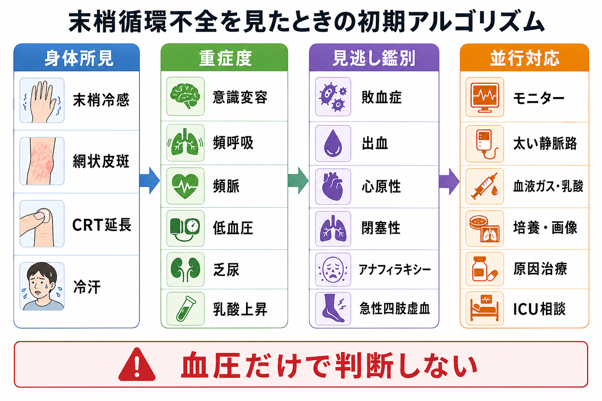
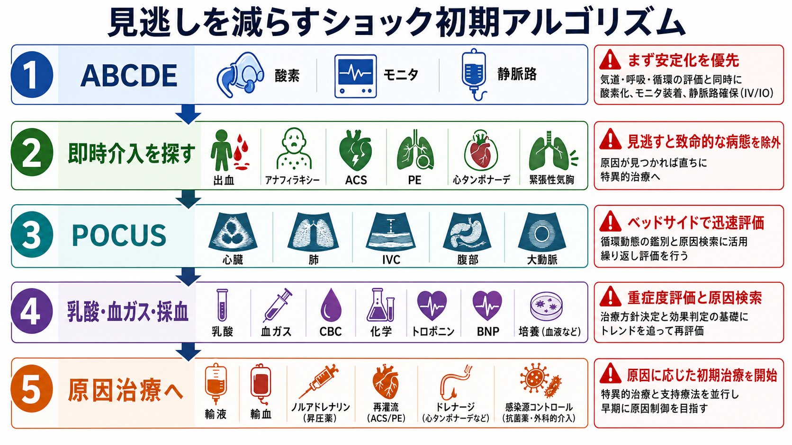
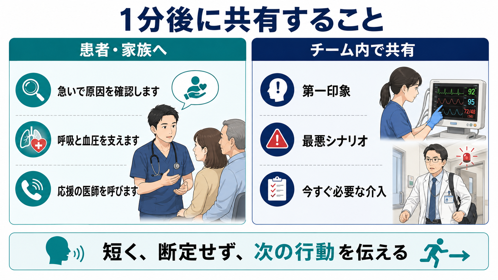

---
title: "第一印象で重症そうな患者を見たら最初の1分で何をするか"
description: "見た目・呼吸・循環・意識から危険信号を拾い、応援要請と初期介入につなげる最初の1分の型。"
aliases:
  - "重症そうな患者の最初の1分"
tags:
  - 領域/救急・初期対応
  - 種類/クリニカルクエスチョン
  - 対象/研修医
question: "第一印象で重症そうな患者を見たら最初の1分で何をするか"
clinical_area: "救急・初期対応"
audience: "研修医"
evidence_level: "guideline"
created: "2026-04-27"
updated: "2026-04-27"
enableToc: true
---

# 第一印象で重症そうな患者を見たら最初の1分で何をするか

> このノートは研修医教育のための一般的整理であり、個別患者の診断・治療指示ではありません。緊急性が高い、判断に迷う、施設方針が関わる場合は上級医・専門科に相談してください。

## クリニカルクエスチョン

第一印象で重症そうな患者を見たら、最初の1分で何を見て、誰を呼び、どの初期介入につなげるか。

## まず結論

- 最初の1分は「診断名を当てる時間」ではなく、「生命危機を見つけて、応援を呼び、ABCDEで介入を始める時間」と考える。[1],[2]
- 第一印象で、呼びかけへの反応、会話の長さ、呼吸仕事量、皮膚色・冷汗・末梢冷感、意識の変化を同時に見る。[1],[3]
- 「重症そう」と感じたら、バイタル確定を待たずに、看護師へモニター・SpO2・血圧・静脈路・血糖を依頼し、上級医または救急チームを早めに呼ぶ。[1],[3]
- ABCDEでは、異常を見つけたら次に進む前にその場で介入し、介入後に再評価する。[1],[2]
- 救急外来の緊急度判定では、JTASのような仕組みも参考になるが、目の前で悪化している患者ではスコア化より応援要請と初期介入を優先する。[10]
- 心停止または正常呼吸なしなら蘇生手順へ移行する。日本ではJRC蘇生ガイドラインと院内急変対応手順に従う。[4]
- ショック、敗血症、アナフィラキシー、大量出血、ACS/PE、脳卒中、緊張性気胸など、時間依存性の病態を「除外すべき危険」として並行して考える。[5],[6],[7]

## 判断の型

1. **安全確認と第一声**: 自分と周囲の安全、感染対策、患者への接近可否を確認する。反応がある患者には「大丈夫ですか」「息苦しいですか」と短く聞く。短文しか話せない、返答がない、ぐったりしている場合は重症サインとして扱う。[1],[2]
2. **見た目・呼吸・循環・意識の4点を見る**: 顔色、冷汗、努力呼吸、チアノーゼ、起坐呼吸、末梢冷感、網状皮斑、頻呼吸、徐呼吸、興奮、傾眠、せん妄を数秒で拾う。[1],[3]
3. **応援要請を言語化する**: 「重症そうです。モニター、酸素、血圧、静脈路、血糖、上級医コールをお願いします」と、役割と目的を具体的に伝える。[1]
4. **ABCDEで介入しながら評価する**: A/B/C/D/Eの順に、気道、呼吸、循環、意識・血糖、全身観察を行う。異常があれば、その場で酸素投与、換気補助、体位調整、圧迫止血、静脈路確保、輸液準備などを進める。[1],[2],[5]
5. **最悪シナリオを1つ口に出す**: 「気道閉塞が怖い」「ショックとして動く」「敗血症かもしれない」など、チームが同じ方向へ動ける言葉にする。[1],[6]

## 初期対応

- **0-10秒**: 周囲の安全、感染防護、患者の反応、正常呼吸の有無を確認する。意識なし、正常呼吸なし、脈拍判断に迷う場合は、院内急変コールとCPRへ移る。[4]
- **10-30秒**: 第一印象を言語化する。「重症そう」「呼吸が悪い」「循環が悪い」「意識が悪い」のどれかをチームへ伝える。[1]
- **30-60秒**: モニター、SpO2、非侵襲的血圧、心電図、体温、血糖を依頼し、太い静脈路を検討する。採血は静脈路確保時にまとめると時間を節約できる。[1],[3]
- **呼吸が悪い**: 気道開通、体位、吸引、酸素投与、バッグバルブマスク換気、挿管準備の必要性を上級医と確認する。[1],[2]
- **循環が悪い**: 皮膚所見、脈拍、血圧、尿量、意識、乳酸・血液ガスを合わせてショックとして扱う。出血が見えれば圧迫止血を先に行う。[2],[5],[6]
- **意識が悪い**: 低血糖、低酸素、高CO2、ショック、脳卒中、けいれん後、薬物、敗血症を同時に考え、まず血糖と酸素化を確認する。[2],[3]

## 鑑別・見逃し

| 優先度 | 疾患・状態 | 見逃さない理由 | 手がかり |
|---|---|---|---|
| 高 | 気道閉塞・換気不全 | 数分で低酸素、心停止に進む | 会話不能、喘鳴、陥没呼吸、徐呼吸、チアノーゼ、意識低下 |
| 高 | ショック全般 | 血圧低下前から臓器灌流不全が進む | 冷汗、末梢冷感、網状皮斑、頻脈、乏尿、乳酸上昇、意識変容 |
| 高 | 敗血症・敗血症性ショック | 抗菌薬、感染源制御、循環管理が遅れると転帰が悪化する | 発熱または低体温、頻呼吸、低血圧、意識変容、免疫抑制、感染巣 |
| 高 | アナフィラキシー | 気道・呼吸・循環が急速に悪化しうる | 急な発症、皮疹・粘膜症状、喘鳴、血圧低下、アレルゲン曝露。ただし皮膚症状がない例もある |
| 高 | 大量出血・外傷 | 出血制御と輸血判断が遅れる | 外出血、腹部膨満、骨盤不安定、抗凝固薬、外傷機転 |
| 高 | ACS・致死的不整脈・肺塞栓 | 初期心電図、除細動、再灌流、抗凝固などの時間依存性がある | 胸痛、失神、呼吸困難、低酸素、ショック、右心負荷、不整脈 |
| 高 | 脳卒中・頭蓋内病変 | 気道保護、血糖補正、画像・再灌流判断が遅れる | 片麻痺、構音障害、共同偏視、突然の頭痛、けいれん、意識障害 |
| 高 | 緊張性気胸・心タンポナーデ | 検査を待つと心停止に近づく | 片側呼吸音低下、頸静脈怒張、外傷、胸痛、ショック、POCUS所見 |

## 検査

| 検査 | 目的 | 注意点 |
|---|---|---|
| SpO2・心電図・非侵襲的血圧・呼吸数 | 生理学的悪化の早期認識 | NICEは初期評価とモニタリングで呼吸数、心拍数、収縮期血圧、意識、SpO2、体温などを重視している。[3] |
| 血糖 | 意識障害の可逆的原因を拾う | 低血糖は治療可能で、意識障害の初期評価で優先度が高い。[2] |
| 静脈血または動脈血ガス・乳酸 | 低酸素、高CO2、代謝性アシドーシス、灌流不全の把握 | 採血値だけで重症度を決めず、見た目・呼吸・循環と合わせる。 |
| CBC・生化学・凝固・交差適合 | 感染、出血、臓器障害、輸血準備 | 静脈路確保時に採血すると同時進行しやすい。[1] |
| 12誘導心電図 | ACS、不整脈、電解質異常の検出 | ショックや胸痛では早期に行うが、気道・呼吸・循環介入を遅らせない。 |
| POCUS | 心機能、IVC、肺、腹腔内液体、気胸、タンポナーデの評価 | ベッドサイドで原因検索に有用だが、画像取得が初期介入を止めないようにする。 |
| 画像検査 | 原因診断、根本治療方針の決定 | 不安定な患者をCTへ送る前に、搬送可能性、蘇生継続、同伴者、戻る基準を確認する。 |

## 治療・マネジメント

- **応援要請を治療の一部と考える**: Resuscitation Council UKは、早期に適切な助けを呼び、チームメンバーでモニター装着や静脈路確保などを同時進行することをABCDEの原則に含めている。[1]
- **酸素は「低酸素を避けるため」に使う**: 明らかな低酸素、呼吸不全、ショックでは酸素投与を開始しつつ、COPDなどCO2貯留リスクがある場合は目標SpO2を上級医と確認する。[1]
- **輸液はショックの型を考えながら開始する**: 敗血症性ショックでは初期循環管理が重要だが、心不全、腎不全、出血、閉塞性ショックでは反応と害を再評価する。[6]
- **アナフィラキシーを疑うときはアドレナリン筋注を遅らせない**: 気道・呼吸・循環症状を伴う急速なアレルギー反応では、アドレナリンが第一選択である。[7]
- **日本での注意**: 院内の酸素、輸液、昇圧薬、アドレナリン製剤は、施設の採用品、添付文書、院内急変・アナフィラキシー手順に従う。PMDAのアドレナリン注0.1%シリンジやエピペンの添付文書では、製剤ごとに適応、禁忌・注意、用法が異なるため、用途を取り違えない。[8],[9]
- **「検査がそろってから治療」では遅い場面がある**: 気道閉塞、換気不全、ショック、大量出血、アナフィラキシー、心停止では、検査と介入を並行する。[1],[2],[5]

## 図解

## 指導医に確認するポイント

- 気道確保、バッグバルブマスク換気、挿管準備、外科的気道確保を考える閾値。
- ショックとして動く場合の輸液量、輸血準備、昇圧薬開始、ICU・救急科・麻酔科コールの基準。
- 敗血症を疑う場合の採血培養、抗菌薬開始、感染源コントロール、J-SSCG2024に沿った院内手順。[6]
- アナフィラキシーを疑う場合のアドレナリン筋注、再投与間隔、点滴ルート、観察時間、処方済みエピペンの扱い。[7],[9]
- 不安定な患者をCT、処置室、ICUへ移動させる前の同伴者、モニター、酸素、薬剤、帰室基準。

## 患者説明

- 「今、呼吸や血圧、意識に危険な変化がないかを急いで確認しています。」
- 「原因を調べながら、先に呼吸や血圧を支える処置を始めます。」
- 「安全のため、応援の医師や看護師を呼んで複数人で対応します。」
- 「現時点で断定はできませんが、悪くなる病気を見逃さないように確認します。」

## ピットフォール

- 血圧だけを見て安心する。ショックは血圧低下前に、頻呼吸、冷汗、末梢冷感、意識変化、乳酸上昇として現れることがある。
- 「原因が分からないから待つ」。原因検索と支持療法は同時に進める。[1],[2]
- 応援要請が遅れる。最初の印象で重症なら、上級医に「今すぐ来てください」と具体的に伝える。
- SpO2だけを見て呼吸仕事量を見ない。努力呼吸、会話困難、徐呼吸、疲弊は重症サインである。
- 意識障害で血糖を忘れる。低血糖は迅速に確認できる可逆的原因である。[2]
- アナフィラキシーで皮疹がないため否定する。皮膚・粘膜症状が目立たない例でも、急な気道・呼吸・循環障害なら疑う。[7]
- 日本で使用する薬剤名、濃度、製剤を確認しない。アドレナリンはシリンジ製剤、アンプル、自己注射製剤で用途と扱いが異なる。[8],[9]

## 関連ノート

- [[救急外来で初期検査セットはどのように選ぶか]]
- [[救急外来で同時に複数患者が来たときトリアージをどう考えるか]]
- [[救急外来で末梢冷感や網状皮斑をどう評価するか]]
- [[乳酸値が高い患者をどう解釈するか]]
- [[出血性ショックを疑ったとき輸液と輸血をどう考えるか]]

## MOC更新候補

- [[MOC｜救急・初期対応]]

## 参考文献

[1] Resuscitation Council UK. The ABCDE Approach. Updated July 2024. https://www.resus.org.uk/library/abcde-approach

[2] World Health Organization and International Committee of the Red Cross. Basic emergency care: approach to the acutely ill and injured. 2018. https://www.who.int/publications-detail-redirect/9789241513081

[3] National Institute for Health and Care Excellence. Acutely ill adults in hospital: recognising and responding to deterioration. Clinical guideline CG50. 2007; surveillance decision 2020. https://www.nice.org.uk/guidance/cg50

[4] 日本蘇生協議会. JRC蘇生ガイドライン2020. https://www.jrc-cpr.org/jrc-guideline-2020/

[5] 日本外傷学会, 日本救急医学会 監修. 改訂第6版 外傷初期診療ガイドラインJATEC. へるす出版, 2021. https://www.herusu-shuppan.co.jp/014-2/

[6] 日本集中治療医学会, 日本救急医学会. 日本版敗血症診療ガイドライン2024. 日本集中治療医学会雑誌. 2024. https://www.jstage.jst.go.jp/article/jsicm/advpub/0/advpub_2400001/_article/-char/ja

[7] 厚生労働省. 重篤副作用疾患別対応マニュアル アナフィラキシー（令和8年2月改定）. https://www.mhlw.go.jp/topics/2006/11/tp1122-1h.html

[8] 医薬品医療機器総合機構. アドレナリン注0.1%シリンジ「テルモ」 医療用医薬品情報・添付文書. https://www.pmda.go.jp/PmdaSearch/rdSearch/02/2451402G1040?user=1

[9] 医薬品医療機器総合機構. エピペン注射液0.15mg／エピペン注射液0.3mg 医療用医薬品情報・添付文書. https://www.pmda.go.jp/PmdaSearch/rdSearch/02/2451402G3026?user=1

[10] 日本救急医学会, 日本救急看護学会, 日本小児救急医学会, 日本臨床救急医学会, 日本在宅救急医学会 監修. 緊急度判定支援システムJTAS2023ガイドブック 第3版. へるす出版, 2023. https://ndlsearch.ndl.go.jp/books/R100000002-I032726008

## 更新ログ

- 2026-04-27: 初版作成。
