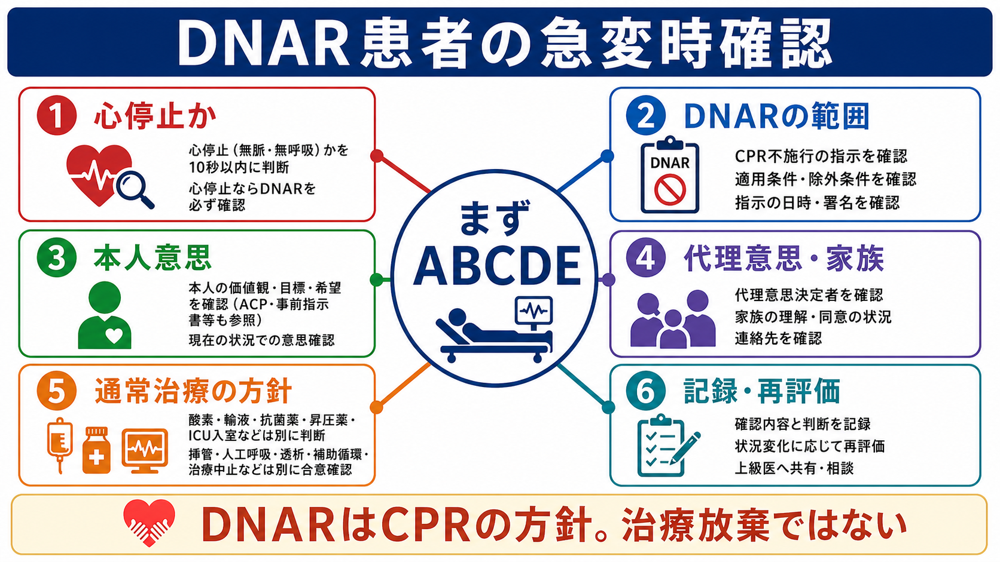
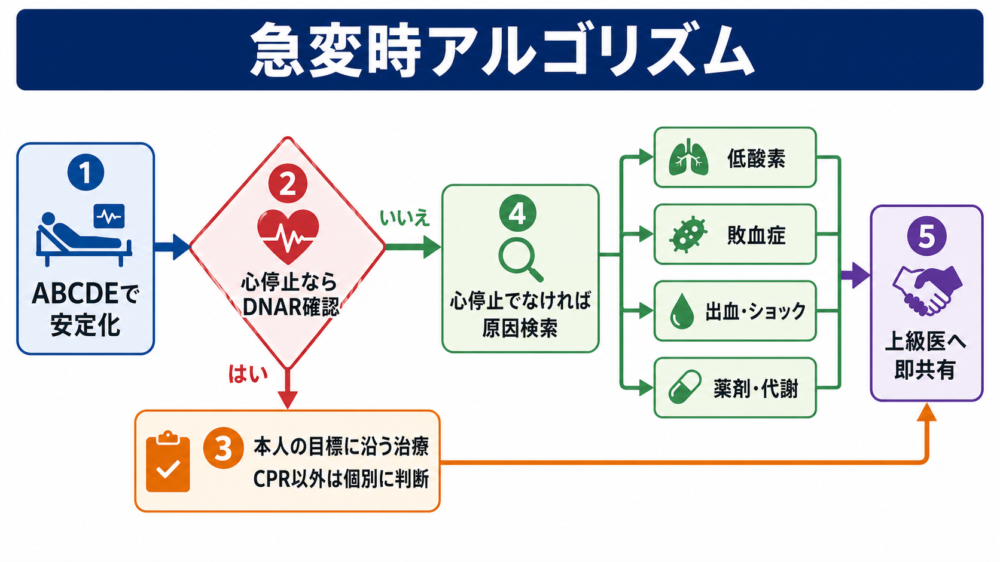
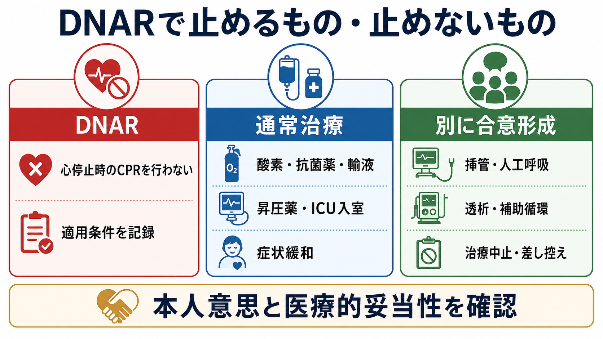

---
title: "DNARがある患者の急変時に何を確認するか"
description: "DNARの範囲、本人意思、家族説明、通常治療との違いを確認し、急変時の誤解と治療放棄を避ける。"
aliases:
  - "DNAR急変時確認"
tags:
  - 領域/救急・初期対応
  - 種類/クリニカルクエスチョン
  - 対象/研修医
question: "DNARがある患者の急変時に何を確認するか"
clinical_area: "救急・初期対応"
audience: "研修医"
evidence_level: "guideline"
created: "2026-04-27"
updated: "2026-04-27"
enableToc: true
---

# DNARがある患者の急変時に何を確認するか

> このノートは研修医教育のための一般的整理であり、個別患者の診断・治療指示ではありません。緊急性が高い、判断に迷う、施設方針が関わる場合は上級医・専門科に相談してください。

## クリニカルクエスチョン

DNARがある患者の急変時に、研修医は何を確認し、何を通常どおり行い、何を上級医と再確認するか。

## まず結論

- DNARは原則として「心停止時に心肺蘇生を試みない」という方針であり、酸素、抗菌薬、輸液、昇圧薬、症状緩和、検査、ICU相談などの通常治療を自動的に止める指示ではない[1,4-6]。
- 急変時はまず患者安全とABCDE評価を行い、心停止か、心停止でない急変かを分ける。DNARの確認作業で必要な初期評価や応援要請を遅らせない。
- 確認するのは、DNARの適用条件、署名・日時、本人意思、推定意思、家族等への説明内容、通常治療や挿管・ICU入室などの治療上限である[1-4]。
- DNARの記載が曖昧、古い、家族内で理解が違う、病状が変化した場合は、単独判断せず上級医・主治医・当直責任者へ即共有する[1,2,4]。
- 「DNARだから何もしない」「急変原因を調べない」「苦痛緩和もしない」は誤りである。本人の価値観と医学的妥当性に沿って、CPR以外の治療は個別に合意形成する[1,4,5]。
- 日本では事前指示や代理意思決定の法制度・運用が国や地域で異なるため、院内規程、記録様式、倫理相談体制に沿って確認する[2,3]。

## 判断の型

1. まずABCDE、応援要請、モニター装着、酸素投与など、急変対応として必要な安全確保を始める。
2. 「心停止か」を確認する。無反応・無呼吸または死戦期呼吸・脈拍なしなら、DNARの有無と有効性を直ちに確認する。
3. DNARが明確で有効なら、胸骨圧迫、除細動、蘇生目的の気管挿管、蘇生薬投与などCPRに相当する行為は行わず、苦痛緩和と家族連絡、上級医共有へ移る。
4. 心停止でない急変なら、低酸素、敗血症、出血・ショック、薬剤、代謝異常などを通常どおり評価し、本人の目標に沿う治療を選ぶ。
5. DNARだけでは、挿管、人工呼吸、透析、昇圧薬、ICU入室、抗菌薬、輸液、輸血、検査の可否は決まらない。各介入を別に確認する[1,4,5]。
6. 判断、説明、連絡先、同席者、未確認事項、再評価予定を診療録に残す。

## 初期対応

- 最初の30-60秒は「DNARを探す時間」ではなく、患者の安全を守る時間にする。気道、呼吸、循環、意識、体温・露出を素早く評価する。
- 応援要請はDNARの有無にかかわらず行う。DNARがあっても、急変原因の評価、苦痛緩和、家族説明、死亡確認、記録には複数人の対応が必要になりやすい。
- 心停止が疑われ、DNARの有効な記録が直ちに確認できない場合は、施設方針に従い、医学的に適切な蘇生を開始しながら情報確認を進める。AMA倫理指針も、記録上DNARがない心肺停止では医学的に適切なら蘇生を試み、その後本人意思が確認されれば中止指示を行う考え方を示している[4]。
- DNARが明確でも、呼吸困難、疼痛、不穏、分泌物、家族の混乱への対応は必要である。緩和ケア、看護師、主治医、当直責任者と役割分担する。
- 院外・施設間搬送・外来・検査室では、紙のDNAR用紙、電子カルテ、紹介状、ACP文書、家族持参書類の整合性を確認する。施設ごとに有効な書式や救急隊との扱いが異なる点に注意する。

## 鑑別・見逃し

| 優先度 | 疾患・状態 | 見逃さない理由 | 手がかり |
|---|---|---|---|
| 高 | 心停止 | DNARの適用場面そのもの。心停止でなければCPR以外の治療余地がある。 | 無反応、無呼吸または死戦期呼吸、脈拍触知不能、モニター波形 |
| 高 | 低酸素・気道閉塞 | 酸素、吸引、体位、非侵襲的な気道管理で苦痛や可逆性が改善する場合がある。 | SpO2低下、喘鳴、喀痰、誤嚥、舌根沈下 |
| 高 | 敗血症・感染増悪 | 抗菌薬、輸液、感染源評価はDNARと別判断。治療目標により実施範囲を調整する。 | 発熱・低体温、血圧低下、意識変容、乳酸上昇 |
| 高 | 出血・ショック | 輸液、輸血、止血処置、昇圧薬をどうするかは治療上限として別に確認する。 | 血圧低下、頻脈、冷汗、Hb低下、黒色便・吐血 |
| 中 | 薬剤性・代謝性急変 | 低血糖、オピオイド過量、電解質異常など可逆性がある。 | 新規薬剤、腎機能低下、血糖異常、意識障害 |
| 中 | DNARの誤解・情報不一致 | 「DNAR=治療しない」と誤解すると必要なケアが抜ける。 | 古い記録、口頭のみ、家族間不一致、署名や日時不明 |

## 検査

| 検査 | 目的 | 注意点 |
|---|---|---|
| バイタル・心電図モニター | 心停止か、心停止でない急変かを分ける。 | DNARがあっても状態把握のために必要なことが多い。 |
| SpO2・血液ガス | 低酸素、高二酸化炭素血症、アシドーシスを確認する。 | 検査侵襲が本人目標に合うか、繰り返し採血の必要性を考える。 |
| 血糖 | 低血糖など即時対応できる可逆性原因を確認する。 | 低侵襲で、意識障害の初期評価として有用。 |
| 採血・乳酸・培養 | 敗血症、出血、代謝異常、臓器障害を評価する。 | 抗菌薬や輸液を行う方針があるかとセットで考える。 |
| 画像検査 | 肺炎、気胸、出血、腸管穿孔などを評価する。 | 搬送リスク、検査結果が治療方針を変えるかを確認する。 |
| ACP・DNAR関連記録の確認 | 本人意思、代理意思、治療上限、再評価時期を確認する。 | 紙・電子カルテ・紹介状・家族持参文書に齟齬がないか見る。 |

## 治療・マネジメント

- DNARの範囲を分解して確認する。「胸骨圧迫」「除細動」「蘇生目的の気管挿管」「アドレナリン等の蘇生薬」はCPRとして扱う施設が多いが、院内規程で確認する。
- CPR以外の治療は別に確認する。酸素、吸引、体位調整、抗菌薬、輸液、昇圧薬、輸血、透析、NPPV/HFNC、気管挿管、ICU入室、搬送、手術、検査、症状緩和は、それぞれ本人の目標、医学的妥当性、負担、期待される利益で判断する[1,4,5]。
- 本人が意思決定能力を保っている場合は、現在の状況でDNARや治療上限の希望が変わっていないか確認する。ACPは状態変化に応じて繰り返し話し合い、記録・共有することが重要である[2]。
- 本人が意思表示できない場合は、事前指示、ACP記録、過去の発言、価値観を確認し、本人の意思を推定できる家族等から情報を得る。家族に「決めさせる」のではなく、本人なら何を望むかを一緒に推定する姿勢を取る[2,3]。
- 家族説明では、「DNARなので何もしません」ではなく、「心臓や呼吸が完全に止まった時に胸骨圧迫などの蘇生を行わない方針です。いま行う苦痛緩和や必要な治療は別に確認して進めます」と具体的に伝える。
- 不一致がある場合は、上級医、主治医、看護師、必要に応じて倫理委員会・医療安全部門へ相談する。日本集中治療医学会の勧告も、DNAR指示は患者本人の意思決定を基本とし、話し合い、記録、見直しを重視している[1]。
- 日本での注意: 日本ではACPや事前指示、代理意思決定の法的位置づけと現場運用が米国・英国と同じではない。救急・集中治療領域では3学会提言や院内規程に沿い、単独判断ではなくチームで合意形成する[2,3]。
- 日本での注意: このCQは薬剤選択・用量を決めるものではないため、PMDAや添付文書にDNAR固有の推奨薬や用量は存在しない。鎮痛薬、鎮静薬、昇圧薬、抗菌薬などを使う場合は、通常どおり適応、禁忌、腎肝機能、添付文書、院内プロトコルを確認する。

## 図解

## 指導医に確認するポイント

- この患者のDNARは「いつ」「誰と」「どの病状を想定して」合意されたものか。
- 心停止時のCPRだけでなく、挿管、人工呼吸、NPPV/HFNC、昇圧薬、透析、輸血、ICU入室、搬送、抗菌薬、輸液、手術の方針は決まっているか。
- 本人意思が直接確認されているか。本人が意思表示できない場合、誰が本人の価値観を最もよく知っているか。
- 家族等への説明内容に誤解や不一致がないか。急変後に再説明すべき相手と連絡先は誰か。
- DNAR記録が古い、病状が変わった、診療科間で方針が違う場合、誰が再評価の責任者になるか。
- 苦痛緩和の方針、死亡確認、看取り場所、家族到着までの対応はどうするか。

## 患者説明

- 「DNARは、心臓や呼吸が完全に止まった時に胸骨圧迫などの心肺蘇生を行わない、という方針です。」
- 「酸素、苦しさを和らげる治療、感染症の治療、点滴などをどうするかは、DNARとは別に、本人の希望と体への負担を見ながら相談します。」
- 「今の状態で何が起きているか、どこまでの治療が本人に合うかを、医療チームで確認しながら進めます。」
- 「状況が変われば、方針も確認し直します。以前の希望と今の希望が違う可能性があれば、そこを大切に確認します。」

## ピットフォール

- DNARを「治療不要」「看取りだけ」と読み替える。
- 心停止でない低酸素、敗血症、低血糖、出血を評価しない。
- 口頭の「DNARらしい」だけでCPRを差し控える、または有効な記録を確認しない。
- 家族に「蘇生しますか、しませんか」と突然選ばせ、本人意思の推定を支援しない。
- 挿管、ICU入室、昇圧薬、透析などの治療上限をDNARに含めたつもりで記録しない。
- 一度決まったDNARを再評価しない。ACPやDNARは病状変化、手術・処置、転院、本人意思の変化で見直す[2,4]。
- 「家族が希望しないから」で本人の価値観や医学的妥当性の確認を省略する。
- 苦痛緩和、家族連絡、死亡前後の説明、記録を後回しにする。

## 関連ノート

- 現時点で確認済みの関連ノートなし。作成候補: `急変時の家族説明をどう行うか.md`、`ACPを病棟でどう確認するか.md`、`終末期の呼吸困難にどう対応するか.md`

## MOC更新候補

- [[MOC｜救急・初期対応]]
- MOC｜医療安全・法律・倫理.md（本サイト外）
- MOC｜病棟管理・退院支援.md（本サイト外）

## 参考文献

[1] 日本集中治療医学会倫理委員会. Do Not Attempt Resuscitation(DNAR)指示のあり方についての勧告. 日本集中治療医学会. 2016. https://www.jsicm.org/news/news170316.html

[2] 厚生労働省. 人生の最終段階における医療・ケアの決定プロセスに関するガイドライン. 2018. https://www.mhlw.go.jp/stf/newpage_02783.html

[3] 日本救急医学会, 日本集中治療医学会, 日本循環器学会. 救急・集中治療における終末期医療に関するガイドライン ～3学会からの提言～. 2014. https://www.jaam.jp/info/2014/info-20141104_02.html

[4] American Medical Association. Code of Medical Ethics Opinion 5.4: Orders Not to Attempt Resuscitation (DNAR). https://code-medical-ethics.ama-assn.org/ethics-opinions/orders-not-attempt-resuscitation-dnar

[5] Resuscitation Council UK. CPR Recommendations, DNACPR and ReSPECT. https://www.resus.org.uk/public-resource/cpr-decisions-and-dnacpr

[6] NHS. Do not attempt cardiopulmonary resuscitation (DNACPR) decisions. 2023. https://www.nhs.uk/tests-and-treatments/do-not-attempt-cardiopulmonary-resuscitation-dnacpr-decisions/

## 更新ログ

- 2026-04-27: 初版作成。
