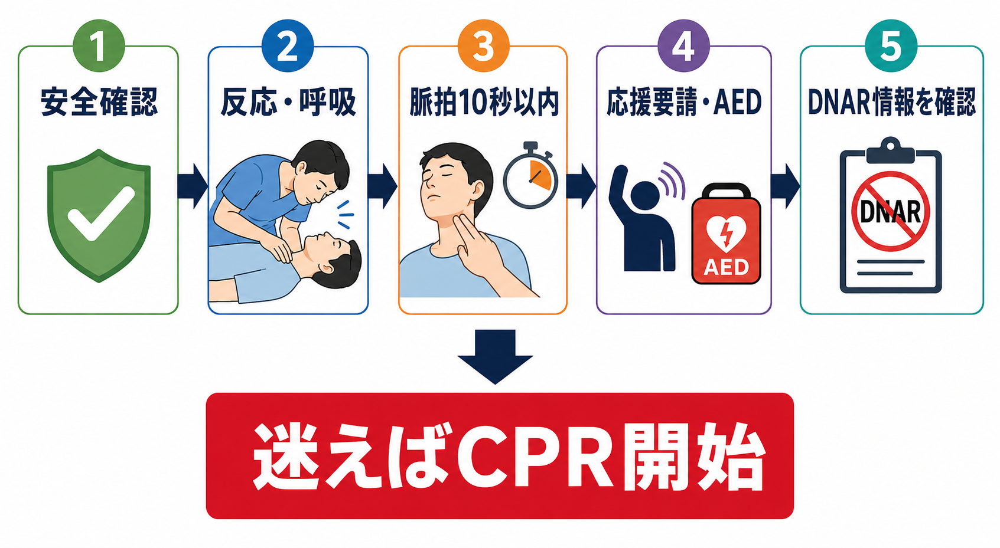
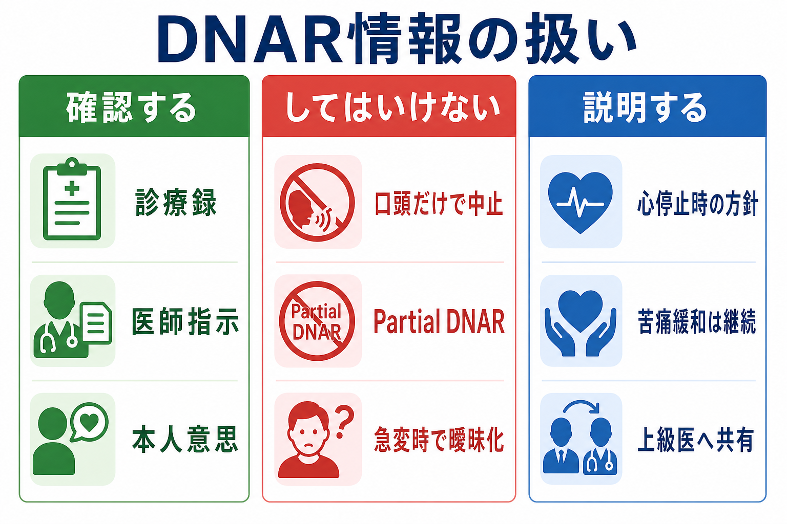

---
title: "心肺停止患者で蘇生を開始する前に何を確認するか"
description: "反応・呼吸・脈拍、応援要請、AED、DNAR情報、可逆的原因を、蘇生を遅らせずに確認する順序として整理する。"
aliases:
  - "心肺停止前確認"
tags:
  - 領域/救急・初期対応
  - 種類/クリニカルクエスチョン
  - 対象/研修医
question: "心肺停止患者で蘇生を開始する前に何を確認するか"
clinical_area: "救急・初期対応"
audience: "研修医"
evidence_level: "guideline"
created: "2026-04-27"
updated: "2026-04-27"
enableToc: true
---

# 心肺停止患者で蘇生を開始する前に何を確認するか

> このノートは研修医教育のための一般的整理であり、個別患者の診断・治療指示ではありません。緊急性が高い、判断に迷う、施設方針が関わる場合は上級医・専門科に相談してください。

## クリニカルクエスチョン

心肺停止が疑われる患者を見つけたとき、胸骨圧迫を遅らせずに、反応・呼吸・脈拍、応援要請、AED/除細動器、DNAR情報、可逆的原因をどの順番で確認するか。

## まず結論

- 「蘇生開始前の確認」は、長い問診やカルテ確認ではなく、**安全確認、反応、正常な呼吸、脈拍を10秒以内、応援要請、AED/除細動器**までを数十秒で行う作業である [1,2]。
- 無反応で正常な呼吸がなく、医療者が10秒以内に確実な脈拍を触れなければ、心停止として胸骨圧迫を開始する。脈拍確認に迷う時間がもっとも危険である [2]。
- 応援要請、院内急変コール、AED/除細動器、バッグバルブマスク、モニター、静脈路/骨髄路、記録係は、胸骨圧迫と並行して準備する [1,2]。
- DNAR情報は重要だが、**有効で明確な医師指示・診療録・本人意思の根拠が即時に確認できない場合、確認のためにCPRを遅らせない**。開始後に上級医と同時確認する [5,6]。
- DNARは心停止時の心肺蘇生を行わない指示であり、酸素、鎮痛、鎮静、抗菌薬、輸液、ICU入室などを自動的に中止する意味ではない。Partial DNARも避けるべきとされる [5]。
- CPR中は4H/4Tを意識し、低酸素、低容量、高/低K・代謝異常、低体温、緊張性気胸、心タンポナーデ、血栓症、中毒を、圧迫中断を最小にして探す [3,4]。

## 判断の型

1. **止まっているかを10秒以内に決める**: 安全確認、肩をたたいて反応確認、呼吸を見る。医療者は頸動脈などで脈拍を10秒以内に確認し、確実でなければ心停止として扱う [2]。
2. **人と機械を呼ぶ**: 「応援を呼んでください」「急変コール」「AED/除細動器」「救急カート」「記録係」と声に出して依頼する [1,2]。
3. **迷えばCPRを始める**: 脈拍・呼吸・DNAR情報の確認で迷う場合、上級医を呼びながら胸骨圧迫を開始する。開始後に情報を修正できるが、遅れた圧迫時間は戻らない。
4. **DNARは同時確認する**: 診療録、医師指示、事前指示書、本人意思、家族等からの情報を確認する。ただし口頭情報だけで研修医単独で中止判断しない [5,6]。
5. **原因検索はCPRを止めずに行う**: 心電図波形、血糖、血液ガス/電解質、POCUS、病歴、内服、透析歴、外傷・出血、窒息・中毒をチームで分担する [3,4]。

## 初期対応

- **安全確認**: 感染防護、感電、暴力、薬物・化学物質曝露、狭い場所、床面、医療機器のコードを確認する。安全でなければ人を増やして環境を整える。
- **反応確認**: 肩をたたき、大きな声で呼びかける。反応がなければ直ちに応援要請に移る。
- **呼吸確認**: 胸腹部の動き、努力呼吸、死戦期呼吸を確認する。死戦期呼吸は「呼吸あり」と扱わず、心停止を疑う [2]。
- **脈拍確認**: 医療者は頸動脈などを10秒以内に確認する。確実に触れなければ胸骨圧迫を開始する [2]。
- **応援要請**: 「心停止疑いです。急変コール、AED/除細動器、救急カート、上級医をお願いします」と具体的に依頼する。
- **AED/除細動器**: 到着次第パッドを貼り、音声指示またはモニター波形に従う。除細動前後の胸骨圧迫中断を最小にする [1,2,8]。
- **記録開始**: 発見時刻、CPR開始時刻、初期波形、除細動、薬剤、ROSC、DNAR確認過程、説明相手を記録する。

## 鑑別・見逃し

| 優先度 | 疾患・状態 | 見逃さない理由 | 手がかり |
|---|---|---|---|
| 高 | 心室細動/無脈性心室頻拍 | 早期除細動が転帰に直結する | 突然倒れた、初期波形VF/pVT、AEDがショック適応 |
| 高 | 低酸素・窒息・気道閉塞 | 換気なしではCPR効果が落ちる | 誤嚥、窒息、喘鳴、チアノーゼ、挿管/気管切開トラブル |
| 高 | 低容量・出血 | 圧迫だけでは循環が戻りにくい | 外傷、消化管出血、術後、透析後、脱水、腹部膨満 |
| 高 | 高K血症・低K血症・代謝異常 | 除細動抵抗性やPEAの原因になる | 透析、腎不全、薬剤、広いQRS、血液ガス/電解質異常 |
| 高 | 緊張性気胸 | 解除しなければ循環が戻らない | 片側呼吸音低下、胸部外傷、人工呼吸中、頸静脈怒張 |
| 高 | 心タンポナーデ | PEAの可逆的原因 | 外傷、心嚢液、悪性腫瘍、透析、POCUS所見 |
| 高 | 血栓症 | ACS/肺塞栓は院内心停止の重要原因 | 胸痛、息切れ、DVT、心電図変化、右心負荷 |
| 中 | 中毒・薬剤 | 特異的治療が転帰を変えることがある | オピオイド、β遮断薬、Ca拮抗薬、三環系抗うつ薬、鎮静薬 |
| 中 | 低体温 | 通常の判断と薬剤間隔が変わる可能性 | 低体温環境、溺水、体温低下、J波 |
| 高 | DNAR情報の誤解 | 救命努力の不適切な放棄または本人意思の無視につながる | 「急変時は何もしない」など曖昧な申し送り、指示未確認 |

## 検査

| 検査 | 目的 | 注意点 |
|---|---|---|
| 心電図モニター/AED解析 | VF/pVT、PEA、心静止を判定する | 波形確認のために胸骨圧迫を長く止めない |
| 血糖 | 可逆的な意識障害・代謝異常を拾う | 低血糖補正はCPRや除細動より優先しない |
| 血液ガス、乳酸、K、Ca、pH | 高/低K、重度アシドーシス、低酸素、循環不全を評価する | 採血待ちで圧迫・換気・除細動を遅らせない |
| POCUS | 心タンポナーデ、緊張性気胸、右心負荷、循環血液量を推定する | 圧迫中断を増やさない。リズムチェックの短時間で行う |
| 胸部所見・人工呼吸器確認 | 気道閉塞、チューブ逸脱、片肺換気、気胸を探す | 挿管後も胸郭挙上、EtCO2、聴診で確認する |
| 診療録・指示簿・ACP文書 | DNAR、治療制限、本人意思を確認する | 研修医単独で口頭情報だけを根拠に中止しない [5,6] |
| 内服・点滴・透析歴 | 中毒、電解質異常、薬剤性徐脈/ショックを探す | 家族、看護師、薬剤部、持参薬から同時に情報収集する |

## 治療・マネジメント

- **胸骨圧迫**: 心停止と判断したら圧迫から開始する。質の高いCPR、圧迫中断の最小化、早期除細動が基本である [1,2]。
- **換気**: バッグバルブマスク、酸素、吸引、気道確保を準備する。換気は胸郭挙上を目安に過換気を避ける [2]。
- **除細動**: VF/pVTなら施設プロトコルに従って除細動し、直後に胸骨圧迫を再開する [1,2]。
- **薬剤**: ALSではアドレナリン投与が扱われる。日本のPMDA添付文書ではアドレナリン注0.1%シリンジは「心停止の補助治療」に効能があり、蘇生などの緊急時の静注用量・反復間隔が記載されている [7]。実際の投与量、投与経路、タイミングはJRC/AHA/ERCと施設プロトコルに従い、上級医と確認する [1,3,4]。
- **可逆的原因への介入**: 低酸素なら換気と気道、低容量なら輸液/輸血、緊張性気胸なら減圧、心タンポナーデなら専門対応、高Kなら施設手順に沿った補正、中毒なら解毒・支持療法を検討する [3,4]。
- **DNAR確認後の対応**: 明確で有効なDNAR指示が確認され、上級医・チームで妥当性を確認した場合、心肺蘇生の不開始または中止を検討する。苦痛緩和、家族対応、看取りのケア、死亡確認の手順は継続する [5,6]。
- **日本での注意**: 国内ではJRC蘇生ガイドライン2020および日本救急医療財団の救急蘇生法の指針2020が実務標準として使われている。AHA/ERC 2025は最新の国際的整理として参考になるが、薬剤製剤、添付文書、院内急変コール、DNAR運用、死亡確認手順は日本の法制度・施設規程に合わせる。

## 図解

## 指導医に確認するポイント

- 胸骨圧迫開始、除細動、気道確保、薬剤投与、原因治療の役割分担を誰が担うか。
- 初期波形、ショック適応、アドレナリン投与、気道確保のタイミングを施設プロトコル上どう進めるか。
- DNAR情報がある場合、その根拠は診療録・医師指示・本人意思・家族等の説明内容のどれか。
- DNARが有効と判断した場合、心肺蘇生以外の治療、苦痛緩和、家族対応、死亡確認をどう進めるか。
- 心停止の可逆的原因として何を最優先で疑うか。POCUS、採血、輸血、専門科、カテ室、手術室、ECMOチームの要否をどう判断するか。

## 患者説明

- 家族等には、可能な限り上級医と一緒に「心臓と呼吸が止まっている状態として蘇生処置を始めています」と簡潔に説明する。
- DNAR情報が確認された場合は、「心停止時に心肺蘇生を行うかどうかの方針を確認しています。苦痛を和らげるケアは続けます」と説明する。
- 情報が曖昧な場合は、「本人の希望や記録を確認しながら、今必要な対応をチームで進めています」と伝え、研修医単独で断定しない。
- 蘇生中止や看取りの説明は、施設方針に沿って主治医・上級医・チームで行う。

## ピットフォール

- 脈拍確認を10秒以上続けて、胸骨圧迫開始が遅れる。
- 死戦期呼吸を「呼吸あり」と誤認する。
- AED/除細動器を呼ぶ依頼が曖昧で、到着が遅れる。
- DNARの有無をカルテで探すためにCPR開始を遅らせる。
- 「DNARあり」を、酸素、鎮痛、輸液、抗菌薬、ICU相談など全治療の中止と誤解する。
- 口頭の「急変時は何もしないで」だけで、研修医単独で蘇生を差し控える。
- 可逆的原因を考えるあまり、圧迫・除細動・換気という基本を乱す。
- 記録係を置かず、時刻、初期波形、薬剤、DNAR確認過程、説明内容が後から追えなくなる。

## 関連ノート

- [[救急外来で患者を診るときABCDE評価はどの順番で進めるか]]
- [[救急外来でバイタルサイン異常を見たとき何を優先して確認するか]]
- 関連ノート候補: 院内急変コールの使い方、DNARをどう確認し記録するか、心停止の4H/4T、死亡確認と家族説明、アドレナリン投与の実務

## MOC更新候補

- [[MOC｜救急・初期対応]] に「DNAR・急変時コミュニケーション」配下の記事として追加候補。
- MOC｜医療安全・法律・倫理.md（本サイト外） にDNAR運用・ACP関連の記事として追加候補。

## 参考文献

[1] 日本蘇生協議会. JRC蘇生ガイドライン2020. https://www.jrc-cpr.org/jrc-guideline-2020/

[2] American Heart Association. Part 7: Adult Basic Life Support. 2025 American Heart Association Guidelines for Cardiopulmonary Resuscitation and Emergency Cardiovascular Care. https://cpr.heart.org/en/resuscitation-science/cpr-and-ecc-guidelines/adult-basic-and-advanced-life-support

[3] American Heart Association. Part 9: Adult Advanced Life Support. 2025 American Heart Association Guidelines for Cardiopulmonary Resuscitation and Emergency Cardiovascular Care. https://cpr.heart.org/en/resuscitation-science/cpr-and-ecc-guidelines/adult-advanced-life-support

[4] European Resuscitation Council. European Resuscitation Council Guidelines 2025 Adult Advanced Life Support. Resuscitation. 2025;215(Suppl 1):110769. https://doi.org/10.1016/j.resuscitation.2025.110769

[5] 日本集中治療医学会. Do Not Attempt Resuscitation(DNAR)指示のあり方についての勧告. 2016. https://www.jsicm.org/news/news170316.html

[6] 厚生労働省. 人生の最終段階における医療・ケアの決定プロセスに関するガイドライン. 改訂 2018年3月. https://www.mhlw.go.jp/stf/newpage_02783.html

[7] PMDA. アドレナリン注0.1%シリンジ「テルモ」 医療用医薬品情報. 添付文書 2026年3月17日. https://www.pmda.go.jp/PmdaSearch/rdSearch/02/2451402G1040?user=1

[8] 厚生労働省. AEDを点検しましょう！ 自動体外式除細動器（AED）の適切な管理等の実施について. 令和6年6月12日時点. https://www.mhlw.go.jp/stf/seisakunitsuite/bunya/kenkou_iryou/iyakuhin/aed/index.html

## 更新ログ

- 2026-04-27: 初版作成。
