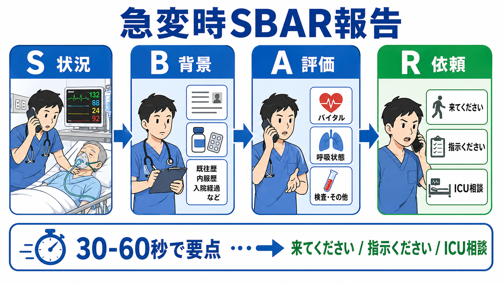
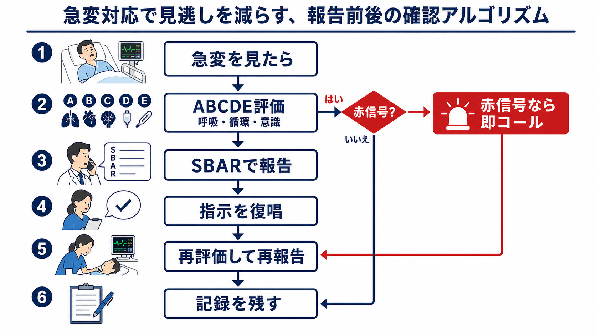

---
title: "急変対応中に上級医へどう報告するか"
description: "SBARを使い、急変時の状況・背景・評価・依頼を短く正確に伝えるための実践メモ。"
aliases:
  - "急変時SBAR報告"
tags:
  - 領域/救急・初期対応
  - 種類/クリニカルクエスチョン
  - 対象/研修医
question: "急変対応中に上級医へどう報告するか"
clinical_area: "救急・初期対応"
audience: "研修医"
evidence_level: "mixed"
created: "2026-04-27"
updated: "2026-04-27"
enableToc: true
---

# 急変対応中に上級医へどう報告するか

> このノートは研修医教育のための一般的整理であり、個別患者への診断・治療指示ではありません。緊急性が高い、判断に迷う、施設方針が関わる場合は上級医・専門科・院内急変対応チームへ相談してください。

## クリニカルクエスチョン

急変対応中に、研修医は上級医へ何を、どの順番で、どの程度短く報告すればよいか。

## まず結論

- **急変時の報告は「診断名」ではなく「危険な状態と依頼」を伝える。** まず「今すぐ来てほしいのか」「電話指示がほしいのか」「ICU/RRS相談が必要か」を明確にする。
- **型はSBARでよい。** S: 状況、B: 背景、A: 評価、R: 依頼の順に、30-60秒で伝える。TeamSTEPPSでもSBAR、Call-out、Check-backは医療チームの情報交換ツールとして位置づけられている[8]。
- **SBARは万能ではないが、電話での急変報告を標準化する道具として使いやすい。** 系統的レビューでは患者安全アウトカムの改善を示す研究はある一方、研究の質と異質性には限界があるとされる[9]。病棟急変時のSBAR導入前後研究では、看護師-医師間コミュニケーション改善と予期せぬ死亡の減少が報告された[10]。
- **Sには現在地・患者・一番危ない変化を入れる。** 例: 「7階病棟の70歳男性、肺炎入院中です。SpO2 88%で酸素を開始しました。すぐ来てください」。
- **Aは「私の評価」まで言う。** 「敗血症性ショック疑い」「気道閉塞が心配」「脳卒中を除外したい」など、仮説を1つ置くと上級医が準備しやすい。
- **Rは曖昧にしない。** 「今すぐベッドサイドへ来てください」「挿管準備を一緒に判断してください」「RRSを起動してよいか確認したいです」と依頼を動詞で終える。
- **日本での注意:** RRS、院内急変コール、ICU相談、当直上級医への連絡基準は施設差が大きい。勤務開始時に電話番号、起動基準、誰が最終判断者かを確認しておく[2]。

## 判断の型

1. **先に人を呼ぶか判断する**  
   心停止、呼吸停止、ショック、意識障害、けいれん、急速な出血、気道閉塞疑いでは、報告文を整える前に応援要請・急変コール・RRS起動を考える。JRC蘇生ガイドラインは蘇生場面での早期認識とチーム対応を重視している[1]。
2. **SBARの前に「場所」と「来てほしい」を言う**  
   電話の冒頭は「○病棟○号室、今すぐ来てください」。相手が移動を始めてからSBARを続ける。
3. **数値は現在値と変化をセットにする**  
   「血圧80/50、普段は120台」「SpO2 88%、酸素5 Lで92%」「GCS E3V4M6からE2V2M5」など、悪化速度が伝わる形にする。
4. **Rは3択で考える**  
   「来てください」「指示ください」「相談先を一緒に決めてください」。この3つのどれかを明示する。
5. **指示は復唱して記録する**  
   電話指示はCheck-backで復唱し、時刻、相手、指示内容、自分の実施内容、再評価結果を残す[8]。

## 初期対応

- **安全確保と役割分担:** 患者のもとを離れず、看護師・同僚・救急カート・モニター・酸素・吸引・静脈路を同時に依頼する。
- **ABCDEで崩れている場所を1つ言えるようにする:** A 気道、B 呼吸、C 循環、D 意識、E 外表・体温。NICE CG50は急性悪化を見逃さないため、観察値を記録し、track and trigger systemに結びつけることを推奨している[6]。
- **早期警告スコアは共通言語として使う:** NEWS2のようなスコアは急性期重症度を標準化して伝える助けになるが、日本では法的・制度的に一律の起動基準ではなく、施設のRRS基準に合わせて使う[7]。
- **報告前に最低限そろえる:** 場所、患者名/年齢、主病名、急変時刻、バイタル、酸素投与、意識、直近の処置、アレルギー、DNAR/治療方針の有無。
- **迷ったら「不完全なSBAR」でよい:** すべて調べてから呼ぶのではなく、「背景は確認中ですが、低血圧が進んでいます。すぐ来てください」と言う。
- **患者・家族への短い説明:** 「状態が急に悪くなったため、複数人で確認し、上級医にも来てもらっています」と不確実性と対応中であることを共有する。

## 鑑別・見逃し

| 優先度 | 見逃したくない状態 | 報告で必ず入れること | 依頼の例 |
|---|---|---|---|
| 高 | 心停止・呼吸停止寸前 | 反応、呼吸、脈、CPR/AEDの状況 | 「コードを起動しました。蘇生チームとして来てください」 |
| 高 | 気道閉塞・重症呼吸不全 | SpO2、呼吸数、酸素量、喘鳴/陥没呼吸 | 「気道確保と挿管適応を一緒に判断してください」 |
| 高 | ショック | 血圧、脈拍、冷汗、尿量、乳酸、輸液反応 | 「ショックです。昇圧薬/ICU相談を含めて来てください」 |
| 高 | 脳卒中・けいれん・意識障害 | 最終健常時刻、GCS、瞳孔、血糖、けいれん持続 | 「脳卒中/けいれん重積を疑い、専門科連絡を相談したいです」 |
| 中 | 薬剤・輸液・処置関連 | 薬剤名、用量、投与時刻、ルート、アレルギー | 「薬剤関連の可能性があります。添付文書と院内手順を確認中です」 |

## 検査

| 確認項目 | 目的 | 報告での言い方 |
|---|---|---|
| バイタル再測定 | 悪化速度と治療反応を見る | 「血圧は5分で95から78へ低下しています」 |
| モニター/心電図 | 致死的不整脈・虚血の示唆 | 「モニター上VT疑い、12誘導は準備中です」 |
| 血糖 | 意識障害の可逆因子 | 「血糖は58 mg/dLで補正中です」 |
| 血液ガス・乳酸 | 呼吸不全、循環不全、代謝異常 | 「乳酸上昇があり、ショックを疑っています」 |
| 画像・培養・採血 | 原因検索 | 「撮影へ動かす安全性を相談したいです」 |

検査は報告を遅らせる理由にしない。NICE CG50の考え方では、観察値の異常を認識したら、重症度に応じて反応する体制へつなげることが重要である[6]。

## 治療・マネジメント

- **報告しながら初期介入を進める:** 酸素、モニター、静脈路、体位、吸引、低血糖補正、出血圧迫など、施設で研修医が実施してよい範囲を確認しておく。
- **薬剤は「一般名・量・単位・時刻・反応」で報告する:** 「アドレナリンを使いました」だけでなく、製剤、濃度、投与量、投与経路、時刻を言う。日本では医薬品の効能・用法・禁忌・注意はPMDAの添付文書情報で確認できる[5]。
- **日本での注意:** このCQは薬剤選択や用量を決める記事ではない。アドレナリン、昇圧薬、鎮静薬、抗菌薬、輸血などの適応・用量・保険適用・承認内容は、院内プロトコル、各診療ガイドライン、PMDA添付文書、上級医判断に従う。
- **RRSの使い方を施設内で確認する:** 日本集中治療医学会のRRS運用指針は、病状増悪を早期に察知し迅速対応する医療安全管理システムとしてRRSを位置づけ、起動基準の周知、教育、データ収集、フィードバックを重視している[2]。
- **事故・ヒヤリハットの視点を持つ:** 急変時の連絡遅れ、情報不足、復唱不足は再発防止の対象になる。厚生労働省の医療事故情報収集等事業は、報告事例を分析し医療安全対策へ共有する仕組みであり[3]、日本医療機能評価機構が医療安全情報や報告書を公開している[4]。

## 図解

## 指導医に確認するポイント

- この施設で、研修医が迷わず起動してよい急変コール/RRS基準は何か。
- 当直帯に「まず電話する相手」と「同時に呼ぶ相手」は誰か。
- 電話指示で実施してよい処置・薬剤の範囲はどこまでか。
- DNAR、治療制限、ICU適応、転院搬送の判断は誰が最終確認するか。
- 急変後の記録、インシデント報告、デブリーフィングはどの形式で残すか。

## 患者説明

- 「今、呼吸・血圧・意識などを確認しながら、状態が急に悪くなった原因を調べています。」
- 「上級医と複数のスタッフに来てもらい、必要な処置を同時に進めています。」
- 「現時点で確定していないこともありますが、危険な状態を見逃さないように対応しています。」
- 「ご家族に確認したい病歴、普段の状態、薬、アレルギー、治療についての希望があれば教えてください。」

## ピットフォール

- **「診断がついてから報告する」と考える:** 急変報告の目的は診断発表ではなく、危険な状態を共有して人と資源を動かすこと。
- **Rがない:** 「どうしましょう」だけでは遅い。「来てください」「指示ください」「ICU相談を一緒に判断してください」まで言う。
- **数値がない:** 「苦しそう」だけでなく、呼吸数、SpO2、酸素量、血圧、脈拍、意識レベルを入れる。
- **電話で指示を聞き流す:** 薬剤、量、単位、経路、時刻は復唱する。特に急変時は聞き間違いが患者安全上のリスクになる。
- **家族説明を後回しにしすぎる:** 初期対応中でも、短く「急変し対応中」と伝える役割をチーム内で決める。

## 関連ノート

- [[救急患者で上級医を呼ぶタイミングはどう判断するか]]
- 関連ノート候補: [[救急外来で患者を診るときABCDE評価はどの順番で進めるか]]
- 関連ノート候補: DNAR確認中に急変したらどう動くか
- 関連ノート候補: 急変後のデブリーフィングをどう行うか

## MOC更新候補

- [[MOC｜救急・初期対応]]
- MOC｜医療安全・法律・倫理.md（本サイト外）
- MOC｜病棟管理・退院支援.md（本サイト外）

## 参考文献

[1] 日本蘇生協議会. JRC蘇生ガイドライン2020. https://www.jrc-cpr.org/jrc-guideline-2020/

[2] 中村京太, 飯尾純一郎, 鹿瀬陽一, ほか. Rapid Response System運用指針. 日本集中治療医学会雑誌. 2025;32:2400002. https://doi.org/10.3918/jsicm.2400002

[3] 厚生労働省. 医療事故情報収集等事業について. https://www.mhlw.go.jp/stf/newpage_22786.html

[4] 公益財団法人日本医療機能評価機構. 医療事故情報収集等事業. https://www.med-safe.jp/

[5] 独立行政法人医薬品医療機器総合機構. 医療用医薬品 添付文書等情報検索. https://www.pmda.go.jp/PmdaSearch/iyakuSearch/

[6] National Institute for Health and Care Excellence. Acutely ill adults in hospital: recognising and responding to deterioration. Clinical guideline CG50. Published 25 July 2007; surveillance decision January 2020. https://www.nice.org.uk/guidance/cg50

[7] Royal College of Physicians. National Early Warning Score (NEWS) 2: Standardising the assessment of acute-illness severity in the NHS. Updated report of a working party. 2017. https://www.rcp.ac.uk/improving-care/resources/national-early-warning-score-news-2/

[8] Agency for Healthcare Research and Quality. TeamSTEPPS Tools. Content last reviewed February 2024. https://www.ahrq.gov/teamstepps-program/resources/modules/index.html

[9] Muller M, Jurgens J, Redaelli M, et al. Impact of the communication and patient hand-off tool SBAR on patient safety: a systematic review. BMJ Open. 2018;8:e022202. https://doi.org/10.1136/bmjopen-2018-022202

[10] De Meester K, Verspuy M, Monsieurs KG, Van Bogaert P. SBAR improves nurse-physician communication and reduces unexpected death: a pre and post intervention study. Resuscitation. 2013;84(9):1192-1196. https://doi.org/10.1016/j.resuscitation.2013.03.016

## 更新ログ

- 2026-04-27: 初版作成。
