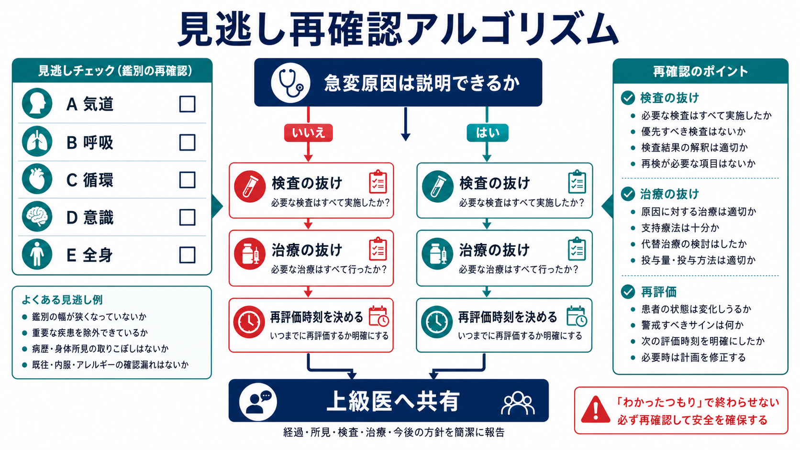
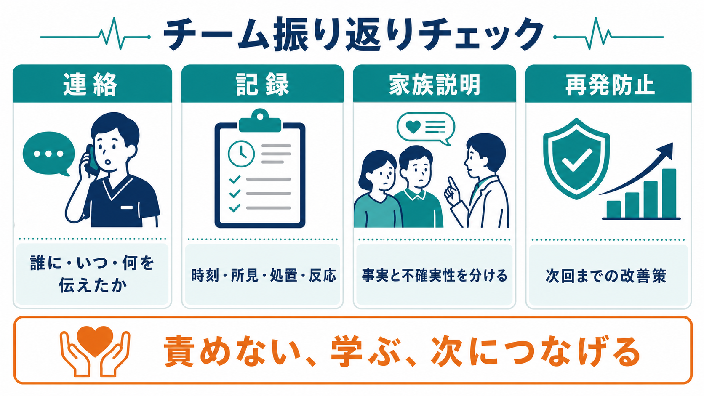

---
title: "急変対応後の振り返りでは何を確認するか"
description: "医学的判断、チーム連携、連絡、記録、再発防止を整理し、次の対応に活かす。"
aliases:
  - "急変後振り返り"
tags:
  - 領域/救急・初期対応
  - 種類/クリニカルクエスチョン
  - 対象/研修医
question: "急変対応後の振り返りでは何を確認するか"
clinical_area: "救急・初期対応"
audience: "研修医"
evidence_level: "mixed"
created: "2026-04-27"
updated: "2026-04-27"
enableToc: true
---

# 急変対応後の振り返りでは何を確認するか

> このノートは研修医教育のための一般的整理であり、個別患者の診断・治療指示ではありません。緊急性が高い、判断に迷う、施設方針が関わる場合は上級医・専門科に相談してください。

## クリニカルクエスチョン

急変対応後の振り返りでは何を確認し、次の対応にどうつなげるか。

## まず結論

- 振り返りは「反省会」ではなく、患者の安全を保ち、次の再評価・連絡・記録・再発防止を決める短いチーム作業である。
- 最初に確認するのは、患者がいま安定しているか、次の悪化に備えた監視・再評価時刻・責任者が決まっているかである。
- 医学的には、ABCDE、急変原因、見逃した鑑別、検査の抜け、治療の抜け、処置や薬剤への反応を確認する。
- チーム面では、誰がリーダーだったか、声出し・復唱・役割分担・応援要請・上級医相談が機能したかを見る。
- 連絡と記録では、本人・家族、看護師、上級医、専門科、ICU、医療安全部門へ、誰が・いつ・何を伝えたかを整理する。
- デブリーフィングや事後フィードバックは、蘇生・急変対応のプロセス改善に役立つ可能性があるが、患者長期予後への効果は不確実で、構造化して継続することが重要である [2][4][5]。
- 予期しない死亡や重大な有害事象が疑われる場合は、個人判断で処理せず、施設の医療安全管理者・上級医・診療科責任者へ早期に共有する [6][7][8]。

## 判断の型

1. 患者の現在地を固定する: 生存・死亡、ROSC後、ICU搬送前、処置継続中、家族説明前など、いまの段階を全員で合わせる。
2. 医学的判断を再点検する: ABCDE、急変原因、重症鑑別、検査・治療・薬剤投与、処置後反応を確認する。
3. 次の30分から数時間を決める: 監視項目、再評価時刻、再急変時の呼び出し基準、DNAR/ACP情報の再確認、担当者を明確にする。
4. チーム連携を振り返る: リーダー、役割分担、声出し、閉ループコミュニケーション、応援要請、情報共有の遅れを確認する。
5. 記録・連絡・制度対応を閉じる: カルテ、家族説明、上級医報告、インシデント報告、医療事故調査制度の該当可能性を施設ルールに沿って相談する [6][7][8]。

## 初期対応

- 振り返りを始める前に、患者の気道、呼吸、循環、意識、体温、疼痛、出血、尿量、モニター、酸素、ルート、ドレーン、デバイスが安全域にあるかを確認する。
- 再急変時に誰を呼ぶか、どのバイタル異常で再コールするか、何分後に誰が再評価するかを決める。
- 家族が待機している、死亡確認が必要、DNARや治療制限が関係する、医療事故の可能性がある場合は、研修医だけで説明・判断を完結させない。
- 直後の短い振り返りでは「事実」「不確実な点」「次の行動」だけを扱い、責任追及や長い原因分析は別枠で行う。
- 心停止や蘇生後であれば、JRC/AHAなどの蘇生ガイドラインに沿って、胸骨圧迫、除細動、気道管理、薬剤、ROSC後管理、チーム行動の質を確認する [1][2][3]。

## 鑑別・見逃し

| 優先度 | 疾患・状態 | 見逃さない理由 | 手がかり |
|---|---|---|---|
| 高 | 気道閉塞・換気不全 | 再急変しやすく、モニター上の安定だけでは見逃す | 喘鳴、努力呼吸、SpO2低下、高CO2、意識低下 |
| 高 | ショックの持続・再燃 | 一時的な血圧改善後も臓器低灌流が残る | 乳酸高値、乏尿、冷汗、末梢冷感、意識変容 |
| 高 | 致死的不整脈・ACS・肺塞栓・大動脈解離 | 急変原因が説明できないときに再発リスクが高い | 胸痛、心電図変化、突然の低酸素、片側下肢腫脹、背部痛 |
| 高 | 敗血症・出血・アナフィラキシー | 初期対応後も原因治療の遅れが予後に影響する | 発熱/低体温、出血源、皮疹、薬剤・食物・造影剤曝露 |
| 中 | 薬剤過量・投与経路間違い・投与漏れ | 急変の原因にも再発要因にもなる | 投与時刻、濃度、投与量、希釈、ポンプ設定、同名薬 |
| 中 | デバイス・チューブ関連トラブル | 処置後の安定化を妨げる | 気管チューブ位置、酸素回路、輸液ルート、ドレーン、モニター送信機 |
| 中 | DNAR/ACP情報の未確認 | 目標と異なる侵襲的対応につながる | カルテ記載、家族発言、紹介状、施設文書、主治医方針 |

## 検査

| 検査 | 目的 | 注意点 |
|---|---|---|
| バイタル・意識・尿量の再評価 | いまの安定化と再悪化の早期発見 | 処置直後の一時改善だけで終えない |
| 心電図・モニター波形・除細動記録 | 不整脈、虚血、蘇生プロセスの確認 | 時刻、リズム、除細動、薬剤投与との対応を残す |
| 血液ガス・乳酸・電解質・血糖 | 低酸素、換気不全、ショック、代謝異常の確認 | 採血時刻と処置前後の変化を分ける |
| CBC、凝固、腎肝機能、炎症反応、培養 | 出血、感染、臓器障害、原因治療の判断 | 抗菌薬前培養など、タイミングの意味を記録する |
| 画像検査 | 気胸、肺水腫、出血、脳卒中、PE、解離などの確認 | 不安定なら検査室移動より安定化を優先する |
| 薬剤・輸液・輸血の確認 | 投与漏れ、過量、濃度間違い、反応の確認 | アドレナリンなどは製剤・濃度・投与経路・時刻を復唱して記録する [9] |

## 治療・マネジメント

- 患者の方針: ICU入室、HCU、一般病棟継続、転院、手術・IVR・内視鏡、緩和的方針など、次の場所と責任診療科を決める。
- 再評価計画: 「15分後に血圧・呼吸数・SpO2・意識を再評価」「乳酸を何時に再検」「尿量を何時間で評価」など、時間で指定する。
- 薬剤確認: 急変時に使った薬剤名、濃度、量、経路、投与時刻、投与後反応、有害事象を確認する。日本の添付文書上の用量・禁忌・注意と、蘇生ガイドライン上の実運用が異なる場合があるため、施設プロトコルと上級医判断を優先して照合する [1][9]。
- 連絡: 上級医、主治医、専門科、ICU、看護師長、当直責任者、薬剤部、臨床工学技士、医療安全管理部門など、必要な相手へ漏れなく共有する。
- 記録: 発見時刻、発見者、バイタル、初期所見、急変判断、応援要請時刻、処置、薬剤、検査、患者反応、説明内容、今後の方針を時系列で残す。
- 再発防止: 個人の注意不足に閉じず、検査結果通知、呼び出し基準、モニター設定、薬剤配置、役割分担、教育、チェックリストなど、仕組みで直せる点を1つ以上決める [5][6][7]。
- 日本での注意: 予期しない死亡または死亡につながる可能性がある重大事象では、医療事故調査制度、医療事故情報収集等事業、院内インシデント報告の対象が関係しうる。制度上の判断は医療機関管理者・医療安全部門が行うため、研修医は早期報告と事実記録を優先する [7][8]。

## 図解

## 指導医に確認するポイント

- 急変原因をどこまで説明できているか。まだ除外すべき致死的鑑別は何か。
- 患者の現在の重症度、監視場所、再評価時刻、再急変時の呼び出し基準は妥当か。
- 使用薬剤、輸液、輸血、処置の量・時刻・反応・有害事象に記録漏れがないか。
- 家族説明で、事実、不確実性、今後の見通し、次の説明時刻をどう伝えるか。
- DNAR/ACP、治療制限、主治医方針、家族の理解に齟齬がないか。
- インシデント報告、医療安全部門への共有、医療事故調査制度の相談が必要か。

## 患者説明

- 「急に状態が悪くなったため、呼吸・循環を安定させる処置を行いました。現在の状態と、次に注意してみる点を整理しています。」
- 「原因は現時点で分かっていることと、まだ確認中のことがあります。分かった事実と今後の見通しを分けて説明します。」
- 「今後も再び悪化する可能性があるため、どの項目をどの間隔で確認するかをチームで決めています。」
- 「追加の検査や治療方針については、上級医・専門科とも確認して説明します。」
- 断定できない段階で「もう大丈夫」「原因はこれだけです」と言い切らない。

## ピットフォール

- 患者が一時的に落ち着いたことで、再評価時刻と責任者を決めずに解散する。
- 「誰かが記録しているはず」「誰かが家族に説明したはず」と思い込み、連絡・記録が抜ける。
- 急変原因を1つに決めつけ、ABCの再評価や重症鑑別の見直しをしない。
- デブリーフィングが個人攻撃になり、次の改善策やシステム要因に進まない。
- 薬剤名だけ記録し、濃度、量、経路、投与時刻、反応を残さない。
- 予期しない死亡や重大事象を、研修医と現場スタッフだけで処理しようとする。

## 関連ノート

- [[急変対応中に上級医へどう報告するか]]
- [[急変後の家族説明で何を避けるべきか]]
- [[DNARがある患者の急変時に何を確認するか]]
- [[心肺停止患者で蘇生を開始する前に何を確認するか]]
- [[救急外来で再評価はいつ何を見ればよいか]]
- 作成候補: 急変患者のカルテには何を記録するか

## MOC更新候補

- [[MOC｜救急・初期対応]]
- MOC｜医療安全・法律・倫理.md（本サイト外）

## 参考文献

[1] 日本蘇生協議会. JRC蘇生ガイドライン2020. https://www.jrc-cpr.org/jrc-guideline-2020/

[2] Cheng A, Nadkarni VM, Mancini MB, et al. Part 6: Resuscitation Education Science: 2020 American Heart Association Guidelines for Cardiopulmonary Resuscitation and Emergency Cardiovascular Care. Circulation. 2020. https://doi.org/10.1161/CIR.0000000000000903

[3] Berg KM, Soar J, Andersen LW, et al. Part 7: Systems of Care: 2020 American Heart Association Guidelines for Cardiopulmonary Resuscitation and Emergency Cardiovascular Care. Circulation. 2020. https://doi.org/10.1161/CIR.0000000000000899

[4] Couper K, Salman B, Soar J, Finn J, Perkins GD. Debriefing to improve outcomes from critical illness: a systematic review and meta-analysis. Intensive Care Medicine. 2013;39(9):1513-1523. https://doi.org/10.1007/s00134-013-2951-7

[5] Phillips EC, Smith SE, Tallentire V, Blair S. Systematic review of clinical debriefing tools: attributes and evidence for use. BMJ Quality & Safety. 2024;33(3):187-198. https://doi.org/10.1136/bmjqs-2022-015464

[6] World Health Organization. Patient safety incident reporting and learning systems: technical report and guidance. 2020. https://www.who.int/publications-detail-redirect/9789240010338

[7] 厚生労働省. 医療事故情報収集等事業について. https://www.mhlw.go.jp/stf/newpage_22786.html

[8] 厚生労働省. 医療事故調査制度に関するQ&A（Q2）. https://www.mhlw.go.jp/stf/seisakunitsuite/bunya/0000086544.html

[9] 医薬品医療機器総合機構（PMDA）. アドレナリン注0.1%シリンジ「テルモ」 医療用医薬品情報. https://www.pmda.go.jp/PmdaSearch/rdDetail/iyaku/2451402G1040_1?user=1

## 更新ログ

- 2026-04-27: 初版作成。
