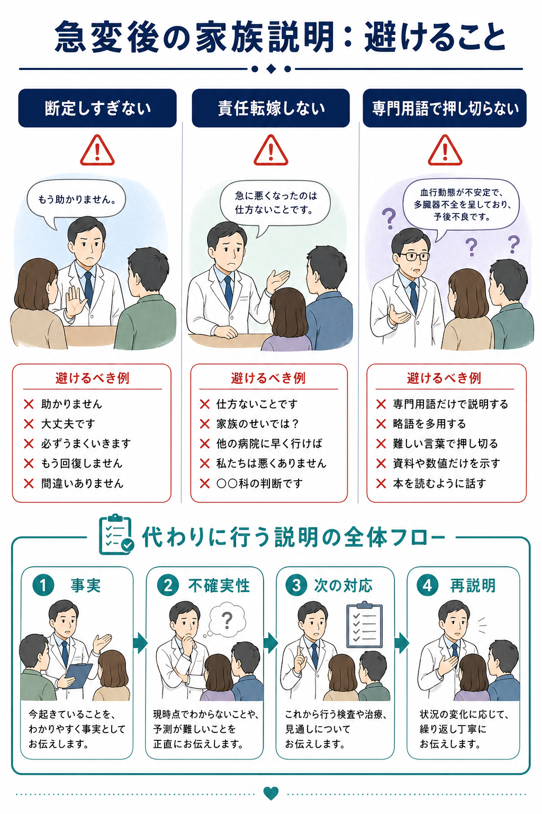
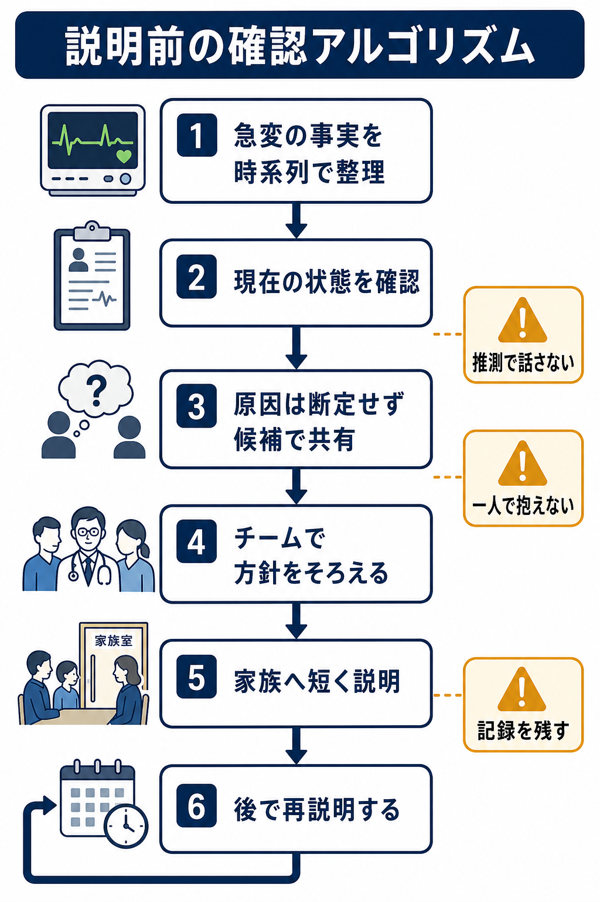
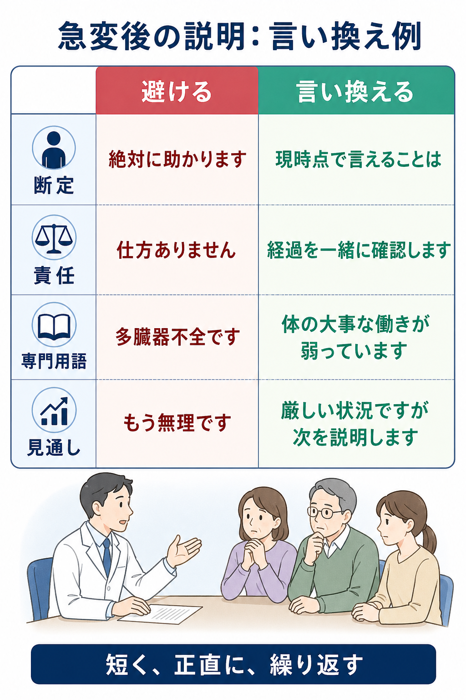

---
title: "急変後の家族説明で何を避けるべきか"
description: "断定しすぎ、責任転嫁、専門用語過多を避け、事実・不確実性・次の見通しを丁寧に伝えるための実践的な型。"
aliases:
  - "急変後の家族説明"
tags:
  - 領域/救急・初期対応
  - 種類/クリニカルクエスチョン
  - 対象/研修医
question: "急変後の家族説明で何を避けるべきか"
clinical_area: "救急・初期対応"
audience: "研修医"
evidence_level: "mixed"
created: "2026-04-27"
updated: "2026-04-27"
enableToc: true
---

# 急変後の家族説明で何を避けるべきか

> このノートは研修医教育のための一般的整理であり、個別患者への診断・治療指示ではありません。緊急性が高い、判断に迷う、治療制限や医療安全上の論点が関わる場合は、上級医・主治医・診療科責任者・医療安全管理部門に相談してください。

## クリニカルクエスチョン

急変後の家族説明で、断定しすぎ、責任転嫁、専門用語過多を避けながら、事実と見通しをどのように伝えるべきか。

## まず結論

- 急変直後の説明では、**「分かっている事実」「まだ分からないこと」「今している対応」「次にいつ説明するか」**を分けて伝える。原因や予後を急いで断定しない。
- 避けるべき表現は、**過度な保証、早すぎる予後断定、責任転嫁、他職種・他施設批判、専門用語だけの説明、家族の反応を遮る説明**である。悪い知らせの伝達では、情報提供だけでなく、相手の理解・感情・今後の計画を確認する構造化が推奨される[6],[7]。
- 家族は急変や生命危機を突然知らされ、理解・意思決定・悲嘆が同時に起こる。集中治療領域の家族ケア指針は、家族が患者状況を理解できる情報提供、信頼関係の維持、苦痛緩和、意思決定支援を中核に置いている[3]。
- 終末期、DNAR、生命維持治療の差し控え・終了に関わる説明は、研修医単独で担わない。日本の救急・集中治療終末期ガイドラインは、判断と対応を主治医個人ではなく医療チームの総意として進める重要性を示している[2]。
- 医療事故が疑われる死亡・死産では、過誤の有無をその場で断定せず、管理者判断、遺族説明、院内調査、センター報告など制度上の流れに沿う。日本医療安全調査機構の資料も、説明時には専門用語をできる限り避け、疑問や不明点を確認するよう求めている[4],[5]。
- **日本での注意:** このCQは薬剤選択・投与量を扱うものではないため、PMDA添付文書に基づく個別薬剤の用量差は原則として該当しない。ただし、蘇生薬、昇圧薬、鎮静薬、輸血、侵襲的処置を家族へ説明する場合は、各薬剤・処置の国内承認、添付文書、院内手順、同意取得の運用を別途確認する。例えばアドレナリンやノルアドレナリンの効能・効果、用法・用量、注意事項はPMDA添付文書で確認する[9],[10]。

## 判断の型

1. **説明する前に事実をそろえる。** 急変時刻、発見時の状態、実施した処置、現在のバイタル、検査中の項目、主治医・上級医の方針を確認する。
2. **説明の目的を決める。** 初回説明は「全てを説明する場」ではなく、「家族を置き去りにしないための初期共有」と考える。
3. **事実と推測を分ける。** 「急に血圧が下がりました」は事実、「感染かもしれません」は候補、「必ず助かります」は保証であり、急変直後には避ける。
4. **責任の所在より安全確保を優先する。** 原因調査や医療安全上の論点は重要だが、急変直後に他者へ責任を寄せる言い方は信頼を損ない、調査の公平性も損なう[8]。
5. **説明は一回で終わらせない。** 初回は短く、理解と感情を確認し、次の説明時刻を約束する。家族の理解や意思は変化しうるため、繰り返し話し合い、記録して共有する[1]。

## 初期対応

- **上級医と説明役をそろえる。** 研修医が第一報をする場合も、「主治医・上級医と確認したうえで、現時点の情報をお伝えします」と位置づける。
- **場所を整える。** 廊下や処置室前で長い説明をしない。可能なら座れる場所、同席者、通訳、看護師同席、連絡先を整える。
- **冒頭で警告する。** 「大事なお話です」「状態がかなり不安定です」と前置きし、急に結論だけを投げない。
- **短い事実から入る。** 「○時ごろ呼吸と血圧が悪くなり、現在は酸素と点滴、必要な処置を行っています」のように、時系列で話す。
- **感情を受け止める。** 「驚かれたと思います」「突然で受け止めにくいと思います」と一度止める。説明を続けすぎない。
- **次の説明を約束する。** 「検査結果と反応を見て、30分後を目安にもう一度説明します」のように、再説明の予定を置く。

## 鑑別・見逃し

| 優先度 | 避けるべき説明 | なぜ危険か | 代わりの言い方 |
|---|---|---|---|
| 高 | 「絶対に大丈夫です」「必ず助かります」 | 過度な保証になり、後で信頼を失う | 「厳しい状況ですが、今できる対応を進めています」 |
| 高 | 「もう助かりません」 | 急変直後の早すぎる断定になりうる | 「現時点ではかなり危険な状態です。反応を見ながら判断します」 |
| 高 | 「前の病院が」「夜勤帯だから」 | 責任転嫁・他者批判に聞こえ、調査前の断定になる | 「経過を確認し、分かったことは順に説明します」 |
| 高 | 「多臓器不全でDICです」だけ | 家族が理解できず、意思決定支援にならない | 「血圧、呼吸、腎臓など体の大事な働きが弱っています」 |
| 中 | 「説明しましたよね」 | 家族の急性ストレス反応を軽視する | 「大事な点なので、もう一度一緒に確認します」 |
| 中 | 「決めてください」だけ | 家族に丸投げになる | 「本人なら何を大切にしたかを一緒に考えたいです」 |

## 検査

| 確認すること | 目的 | 注意点 |
|---|---|---|
| 急変前後の時系列 | 事実と推測を分ける | 「たぶん」だけで説明しない。分からないことは分からないと伝える。 |
| 現在の重症度 | 家族に緊急性を伝える | バイタル、酸素、昇圧薬、意識、蘇生処置の有無を上級医と確認する。 |
| 原因候補 | 次の検査・治療の説明につなげる | 感染、出血、心筋梗塞、肺塞栓、脳卒中、薬剤、窒息などを候補として扱い、断定しない。 |
| 本人意思・ACP・DNAR | 治療方針の整合性を確認する | 日本のガイドラインでは本人意思を基本とし、本人意思が確認できない場合は家族等と医療・ケアチームで本人にとって最善を考える[1]。 |
| 医療安全上の論点 | 調査・説明・記録の漏れを防ぐ | 予期しない死亡等では、医療事故調査制度の該当性を管理者・医療安全部門へ相談する[5]。 |

## 治療・マネジメント

- **医学的対応と説明を分担する。** 一人が家族説明をしている間も、治療チームはABCDE、原因検索、処置、記録を続ける。
- **治療の選択肢を「可能・不可能」だけで言わない。** 「人工呼吸器を使うか」ではなく、「呼吸を機械で支える治療は可能だが、本人の状態や望んでいたことに照らして考える必要がある」と説明する。
- **本人意思を探す。** 家族に「本人なら何を大切にしていたか」「以前に延命治療について話していたか」を尋ねる。これは家族に責任を押しつけるためではなく、本人の価値観を知るためである[1],[2]。
- **医療事故の可能性は制度に乗せる。** 急変が医療に起因する、または起因が疑われる予期しない死亡・死産に該当する可能性がある場合、研修医が過誤の有無を判断せず、管理者・医療安全管理部門へ速やかに相談する[5]。
- **フォローの窓口を決める。** 誰が次に説明するか、家族からの質問を誰が受けるか、夜間・休日の連絡をどうするかを明確にする。

## 図解

## 指導医に確認するポイント

- 初回説明で「現時点で言ってよい事実」と「まだ言わない方がよい推測」は何か。
- 予後、DNAR、治療制限、ICU適応、転院、侵襲的処置について、誰が主説明者になるか。
- 本人意思・ACP・家族関係・キーパーソン・代理意思決定者の確認はどこまで進んでいるか。
- 医療安全管理部門、病院管理者、患者相談窓口、倫理コンサルテーションへ連絡すべき状況か。
- 説明内容、家族の質問、同席者、次回説明予定をどの粒度で記録するか。

## 患者説明

- 「突然のことで驚かれていると思います。まず、今分かっていることを短くお伝えします。」
- 「○時ごろから呼吸と血圧が不安定になり、現在、酸素、点滴、必要な処置を行っています。」
- 「原因はまだ一つに決められません。感染、心臓、出血などを含めて確認しています。」
- 「現時点では厳しい状態です。ただ、今の反応と検査結果を見ながら、次にできることをチームで判断します。」
- 「専門用語が多くなったら止めてください。分かりにくいところは言い換えます。」
- 「ご本人が以前、治療や延命について話していたことがあれば、分かる範囲で教えてください。」
- 「次は○時ごろに、検査結果と状態の変化を合わせてもう一度説明します。」

## ピットフォール

- **初回説明で全部を説明しようとする。** 家族は急性ストレス下にあり、長い説明は保持しにくい。短く伝え、繰り返す。
- **「分からない」と言えず、推測を事実のように話す。** 不確実性を認めることは逃げではない。次に何を確認するかを添える。
- **家族の反応を沈黙で待てない。** 涙、怒り、沈黙は情報不足とは限らない。すぐに追加説明で埋めない。
- **専門用語を日本語にしただけで説明した気になる。** 「DIC」「多臓器不全」「昇圧薬」ではなく、体の働きと危険性に言い換える。
- **DNARを急変後に単独で取りに行く。** DNARは同意書取得作業ではなく、本人意思、医学的適応、チーム判断、家族との共有を含むプロセスである[1],[2]。
- **医療事故の可能性をその場で否定・肯定する。** 事実確認と制度上の判断を分け、院内の医療安全手順に沿う[4],[5],[8]。

## 関連ノート

- [[急変対応中に上級医へどう報告するか]]
- 関連ノート候補（未作成）: DNARを急変時にどう確認するか
- 関連ノート候補（未作成）: 急変後に本人意思とACPをどう確認するか
- 関連ノート候補（未作成）: 医療事故が疑われる死亡時に研修医は何をしてはいけないか

## MOC更新候補

- [[MOC｜救急・初期対応]] の「DNAR・急変時コミュニケーション」または「急変時の家族説明」に本ノートを追加する。
- 将来、コミュニケーション系MOCを作成する場合は、DNAR、ACP、医療安全説明、悪い知らせの伝え方の横断リンクとして追加する。

## 参考文献

[1] 厚生労働省. 人生の最終段階における医療・ケアの決定プロセスに関するガイドライン. 2018. https://www.mhlw.go.jp/stf/houdou/0000197665.html

[2] 日本救急医学会, 日本集中治療医学会, 日本循環器学会. 救急・集中治療における終末期医療に関するガイドライン ～3学会からの提言～. 2014. https://www.jsicm.org/pdf/3gakkai_02.pdf

[3] 日本集中治療医学会. 集中治療領域における終末期患者家族のこころのケア指針. 2011. https://www.jsicm.org/pdf/110606syumathu.pdf

[4] 日本医療安全調査機構. 医療機関のみなさまへ: 医療事故調査制度 遺族への説明. https://www.medsafe.or.jp/survey/medical

[5] 厚生労働省. 医療事故調査制度に関するQ&A. https://www.mhlw.go.jp/stf/newpage_31442.html

[6] Davidson JE, Aslakson RA, Long AC, et al. Guidelines for Family-Centered Care in the Neonatal, Pediatric, and Adult ICU. Crit Care Med. 2017;45(1):103-128. https://doi.org/10.1097/CCM.0000000000002169

[7] Baile WF, Buckman R, Lenzi R, Glober G, Beale EA, Kudelka AP. SPIKES-A six-step protocol for delivering bad news: application to the patient with cancer. Oncologist. 2000;5(4):302-311. https://doi.org/10.1634/theoncologist.5-4-302

[8] Agency for Healthcare Research and Quality. Communication and Optimal Resolution (CANDOR) Toolkit. https://www.ahrq.gov/patient-safety/settings/hospital/candor/index.html

[9] PMDA. アドレナリン注0.1%シリンジ「テルモ」 医療用医薬品情報. https://www.pmda.go.jp/PmdaSearch/rdSearch/02/2451402G1040?user=1

[10] PMDA. ノルアドリナリン注1mg 医療用医薬品情報. https://www.pmda.go.jp/PmdaSearch/rdSearch/02/2451401A1034?user=1

## 更新ログ

- 2026-04-27: 初版作成。
