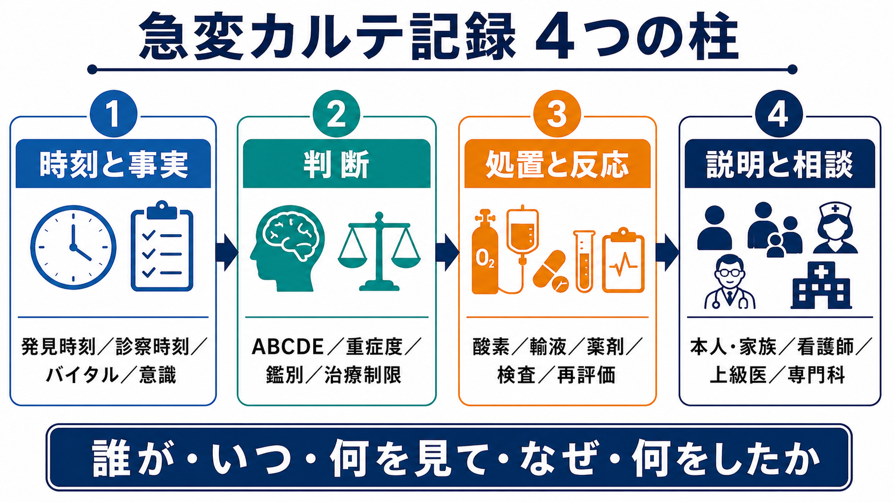
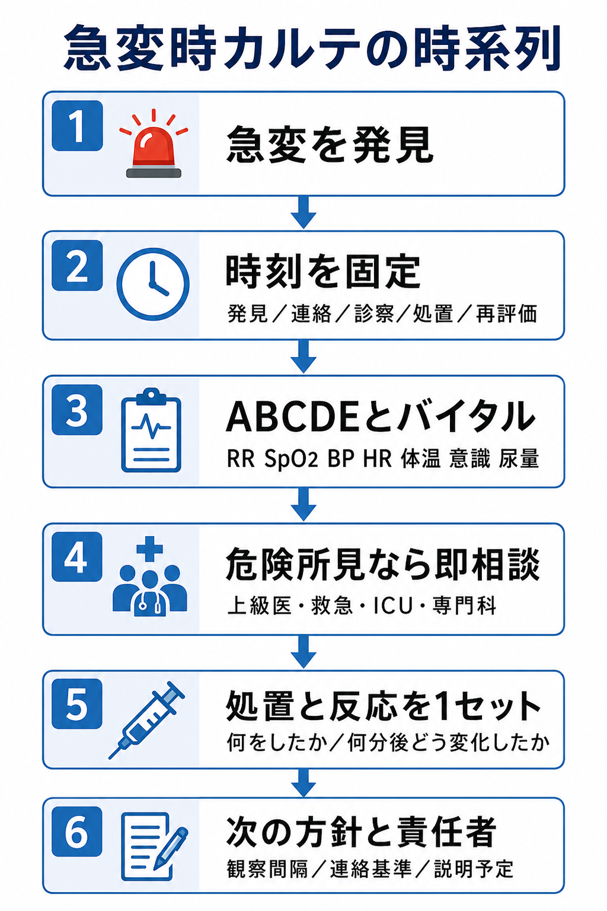
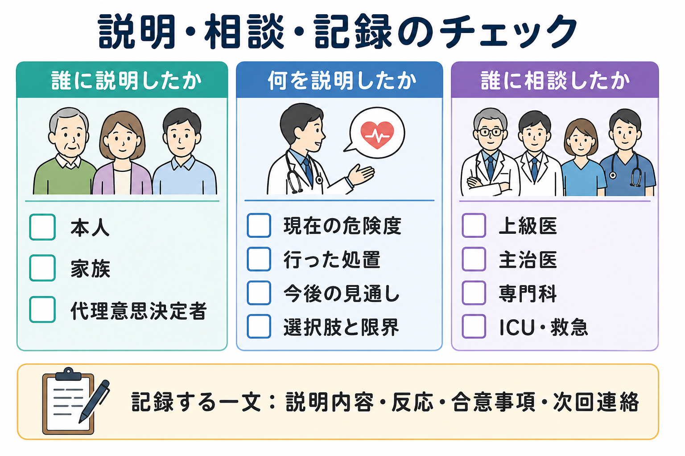

---
title: "急変患者のカルテには何を記録するか"
description: "時刻、バイタル、判断、処置、説明、相談先を後から検証可能な形で記載する。"
aliases:
  - "急変時カルテ記録"
tags:
  - 領域/救急・初期対応
  - 種類/クリニカルクエスチョン
  - 対象/研修医
question: "急変患者のカルテには何を記録するか"
clinical_area: "救急・初期対応"
audience: "研修医"
evidence_level: "mixed"
created: "2026-04-27"
updated: "2026-04-27"
enableToc: true
---

# 急変患者のカルテには何を記録するか

> このノートは研修医教育のための一般的整理であり、個別患者への診断・治療指示ではありません。急変時、蘇生、治療制限、説明、法的・倫理的判断に迷う場合は、上級医、主治医、救急・集中治療チーム、医療安全部門に早期に相談してください。

## クリニカルクエスチョン

急変患者のカルテには、時刻、バイタル、判断、処置、説明、相談先を、後から第三者が経過を再構成できる形でどこまで記録すればよいか。

## まず結論

- 急変記録は「誰が、いつ、何を見て、なぜ、何をしたか」を時系列で残す。特に発見時刻、連絡時刻、診察開始時刻、処置時刻、再評価時刻は分けて書く。
- 最低限、ABCDE、意識、呼吸数、SpO2、血圧、脈拍、体温、尿量、疼痛、皮膚所見、モニター波形、治療制限の有無を記録する。NICEは急性期入院患者で心拍数、呼吸数、収縮期血圧、意識、酸素飽和度、体温を記録することを推奨している[1]。
- 判断は「肺炎による低酸素疑い」など断定だけでなく、「ショック、低酸素、敗血症、ACS、脳卒中、薬剤性を鑑別中」のように、その時点で考えた危険な候補を残す。
- 処置は「酸素開始」だけでなく、酸素デバイス・流量、輸液量、薬剤名・用量・投与経路、検査、処置者、何分後にどう変化したかを1セットにする。
- 説明と相談は、本人・家族・代理意思決定者、看護師、上級医、主治医、専門科、ICU・救急へ「誰に、何を、いつ、どの手段で」伝えたかを記録する。
- DNARや治療制限は「CPRしない」だけで終わらせず、人工呼吸、昇圧薬、ICU、輸血、抗菌薬、緩和ケアなど、実施する治療・しない治療・再確認時期を明確にする。本人の意思決定とチームでの方針決定を重視する厚生労働省ガイドラインに沿って記録する[2]。
- 診療録は法的にも医師に作成・保存義務があり、電子カルテでは真正性・見読性・保存性を意識する[3][4]。



## 判断の型

### 1. 時刻を分ける

急変記録で最も重要なのは、時刻の粒度である。次を分けて書く。

| 記録する時刻 | 例 | 意味 |
|---|---|---|
| 発見時刻 | 14:05 看護師がSpO2低下を確認 | 患者状態が変わった時点 |
| 連絡時刻 | 14:07 研修医へPHS連絡 | 誰がいつ呼ばれたか |
| 診察開始時刻 | 14:10 ベッドサイド到着 | 医師が直接評価した時点 |
| 指示・処置時刻 | 14:12 酸素10 L/分開始 | 介入の開始点 |
| 再評価時刻 | 14:18 SpO2 88%から95%へ改善 | 介入への反応 |
| 相談時刻 | 14:20 上級医Aへ電話、14:25 到着 | エスカレーションの根拠 |

### 2. 事実と解釈を分ける

事実は測定値・観察所見として書き、解釈は「疑い」「鑑別」「判断」として書く。

- 事実: 「SpO2 82%（室内気）、RR 32/分、努力呼吸あり、血圧 84/52 mmHg、JCS II-10」
- 解釈: 「急性低酸素血症と循環不全。肺炎増悪、肺塞栓、心不全、敗血症を鑑別」
- 方針: 「酸素投与、ルート確保、採血・血液ガス・胸部X線、上級医へ即時相談」

GMCは、診療録を明確・正確・同時性をもって読める形にし、臨床所見、提案・実施した検査や治療、患者に共有した情報、決定、行動、作成者と時刻を含めることを求めている[5]。

### 3. 判断の限界も残す

急変直後は確定診断がつかないことが多い。記録すべきなのは「当たった診断名」だけではなく、危険な見逃しをどう扱ったかである。

- 「原因未確定だが、低酸素とショックを優先して対応」
- 「ACS、肺塞栓、敗血症、出血、薬剤性、脳卒中を鑑別に置く」
- 「検査結果待ちだが、低血圧が持続するため上級医・ICUへ相談」
- 「DNARは確認済み。ただし酸素、抗菌薬、輸液、昇圧薬、ICU相談の可否は未確認のため主治医へ確認」

## 初期対応

急変対応中は詳細な文章を書き込む余裕がない。まず短く、後から追記してよい。ただし、時刻と主要判断はその場で固定する。

### 最初の1分で残すメモ

```text
14:10 ベッドサイド到着。看護師より「SpO2低下、呼吸苦増悪」でコール。
JCS I-3、RR 30/分、SpO2 84%（室内気）、BP 88/50、HR 118、T 38.5。
A:発語可 B:努力呼吸あり C:四肢冷感あり D:意識軽度低下 E:皮疹なし。
急性低酸素血症＋ショック疑い。酸素投与、ルート確保、採血・血ガス・胸部X線を指示。
14:12 上級医Aへ電話相談。
```

### 落ち着いた後に追記する項目

- 急変前のベースライン: 直前のバイタル、ADL、酸素需要、意識、尿量、食事、疼痛、術後・処置後・投薬後か。
- 急変のトリガー: 体位変換、食事、排泄、輸液、造影、投薬、転倒、せん妄、疼痛、発熱、出血など。
- 指示内容: 酸素、輸液、薬剤、検査、モニター、安静度、NPO、処置、転棟準備。
- 反応: 何分後にバイタル・症状・意識・尿量・波形がどう変化したか。
- 相談: 誰に連絡し、何を共有し、どの方針になったか。



## 鑑別・見逃し

急変記録では、鑑別リストそのものより「見逃すと危険な状態を認識し、必要な相談・検査・治療につなげたこと」を示す。

| 優先度 | 見逃し | カルテに残すポイント |
|---|---|---|
| 高 | 心肺停止・切迫停止 | 反応、呼吸、脈、CPR開始時刻、除細動時刻、薬剤、ROSC時刻、チーム到着時刻 |
| 高 | 気道閉塞・低酸素 | 気道所見、RR、SpO2、酸素デバイス・流量、換気補助、挿管相談 |
| 高 | ショック | BP、HR、皮膚冷感、尿量、乳酸、輸液反応、昇圧薬検討、ICU相談 |
| 高 | 敗血症 | 感染巣、発熱、qSOFA/SOFA要素、培養、抗菌薬開始時刻、J-SSCG/院内バンドルとの整合 |
| 高 | ACS・不整脈 | 胸痛、心電図時刻、トロポニン、波形、循環器相談 |
| 高 | 脳卒中・けいれん | 最終健常確認時刻、神経所見、血糖、画像、脳卒中チーム相談 |
| 中 | 薬剤性・アナフィラキシー | 投薬名、投与時刻、皮疹、喘鳴、血圧、対応薬、PMDA添付文書・院内手順確認 |
| 中 | DNAR・治療制限の誤読 | 事前文書、本人意思、家族・代理人、主治医確認、実施する治療範囲 |

JRC蘇生ガイドラインは、BLS/ALSを含む急変時対応の標準的な枠組みであり、心肺停止・切迫停止では時刻、リズム、胸骨圧迫、除細動、薬剤、ROSC、チーム連携を後から追える記録が重要になる[6]。

## 検査

検査は「出した」だけでなく、目的、時刻、結果、結果を受けた判断を残す。

| 検査・確認 | 記録する目的 | 注意点 |
|---|---|---|
| バイタル再測定 | 悪化・改善の確認 | 呼吸数は手で数える。SpO2だけで呼吸状態を判断しない。 |
| 血糖 | 意識障害の可逆因子 | 低血糖補正後の意識変化を記録する。 |
| 血液ガス・乳酸 | 低酸素、換気、循環不全、代謝性アシドーシス | 採血時刻、酸素条件、乳酸の再検予定を残す。 |
| 心電図 | ACS、不整脈、電解質異常 | 症状出現時刻、記録時刻、上級医確認時刻を書く。 |
| 採血・培養 | 感染、出血、臓器障害、DIC | 抗菌薬前に培養を採れたか、遅れる場合の理由を書く。 |
| 画像 | 肺炎、心不全、気胸、出血、脳卒中など | 移動リスク、撮像時刻、読影・相談時刻を残す。 |
| 既存方針の確認 | DNAR、治療制限、ACP、同意書 | 文書名、確認者、確認時刻、未確認なら未確認と書く。 |

NICEは、急性期入院患者に対して観察項目と観察頻度を明記したモニタリング計画を求め、悪化リスクにはトラック・アンド・トリガーシステムを用いることを推奨している[1]。NEWS2も複数の生理学的指標を組み合わせて悪化を検出し、エスカレーションにつなげる枠組みである[7]。

## 治療・マネジメント

### 処置は「内容、根拠、反応」で書く

```text
14:12 酸素リザーバーマスク10 L/分開始。低酸素血症への対応。
14:16 SpO2 84%→93%、RR 30→26/分、呼吸苦は残存。
14:18 末梢ルート右前腕20G確保。乳酸測定、血培2セット、採血提出。
14:20 BP 82/48持続、四肢冷感あり。敗血症性ショックを含めICU適応を上級医Aと相談。
```

### 薬剤は「投与した事実」を曖昧にしない

急変時にアドレナリン、抗不整脈薬、鎮静薬、昇圧薬、抗菌薬などを使用した場合は、薬剤名、濃度、用量、投与経路、投与時刻、指示者、実施者、反応、副作用、院内プロトコルとの整合を記録する。薬剤名や規格は施設採用薬とPMDA添付文書で確認する[8]。

### 日本での注意

- 日本では診療録の作成・保存義務、電子カルテの安全管理、個人情報保護、診療報酬上の記録要件がある。急変記録は医療安全だけでなく、法的・制度的にも重要である[3][4]。
- DNARは「心肺停止時にCPRを試みない」という限定的な方針であり、急変時の酸素、抗菌薬、輸液、昇圧薬、ICU、NPPV、挿管、緩和ケアまで自動的に禁止するものではない。施設のDNAR/ACP様式、倫理指針、厚生労働省の人生の最終段階の意思決定プロセスを確認する[2]。
- 海外のReSPECTのような包括的な救急治療計画は、日本の全施設で同じ様式として運用されているわけではない。ReSPECTは救急治療とCPRに関する推奨を患者中心にまとめる枠組みだが、日本では院内のACP文書、DNAR指示、説明同意書、倫理カンファレンス記録と整合させる[9][10]。
- PMDA添付文書や海外ガイドラインの記載をそのまま急変現場に持ち込まず、国内採用薬、院内プロトコル、投与経路、モニタリング体制を確認する。

## 図解




## 指導医に確認するポイント

- 急変発見時刻、診察開始時刻、処置時刻、再評価時刻は追えるか。
- ABCDE、バイタル、意識、尿量、酸素条件、モニター波形は十分に記録できているか。
- その時点の鑑別と「まず除外すべき危険な状態」が書けているか。
- 上級医、主治医、専門科、ICU、救急チームへの相談時刻と相談内容は記録できているか。
- DNAR、治療制限、ACP、説明同意書の確認内容が曖昧ではないか。
- 患者・家族への説明内容、反応、合意事項、次回説明予定が残っているか。
- 追記するとき、後から書いたことが分かる形になっているか。

## 患者説明

- 「急に血圧、酸素、意識などに変化があり、危険な原因が隠れていないかを確認しています。」
- 「今は原因を一つに決める前に、呼吸と循環を安定させる処置を先に行っています。」
- 「行った処置と反応を見ながら、必要に応じて上級医、専門科、集中治療のチームと相談します。」
- 「心肺蘇生や人工呼吸器などの治療について、事前の希望や方針があるか確認します。分からない点は一緒に整理します。」
- 「説明した内容、相談した内容、次に確認することはカルテに記録し、チームで共有します。」


## ピットフォール

- 「急変対応した」とだけ書き、時刻と数値がない。
- SpO2、血圧、心拍数だけで、呼吸数、意識、尿量、皮膚所見が抜ける。
- 「上級医に報告済み」と書くが、誰に、いつ、何を伝え、どう返答されたかがない。
- 「家族へ説明済み」と書くが、説明内容、理解、反応、合意事項、次回連絡がない。
- 薬剤投与で、薬剤名、用量、投与経路、時刻、反応が抜ける。
- 検査結果が出た後に、結果を受けた判断を書かない。
- DNARを「何もしない」と誤解し、実施する治療範囲を確認しない。
- 後から追記した内容を、急変時にリアルタイムで記録したように見せてしまう。
- 事実と推測が混ざり、後から読んだ人が経過を再構成できない。

## 関連ノート

- 関連ノート候補: `急変患者で家族に最初に何をどう説明するか`
- 関連ノート候補: `DNAR指示がある患者の急変時に何を確認するか`
- 関連ノート候補: `救急外来で再評価はいつ何を見ればよいか`
- 関連ノート候補: `救急外来でバイタルサイン異常を見たとき何を優先して確認するか`

## MOC更新候補

- [[MOC｜救急・初期対応]] の「DNAR・急変時コミュニケーション」配下に本記事へのリンクを追加候補。
- MOC｜医療安全・法律・倫理.md（本サイト外） に「急変時記録」「説明・相談記録」の関連リンクとして追加候補。

## 参考文献

[1] National Institute for Health and Care Excellence. Acutely ill adults in hospital: recognising and responding to deterioration. Clinical guideline CG50. 2007. https://www.nice.org.uk/guidance/CG50/chapter/recommendations

[2] 厚生労働省. 人生の最終段階における医療・ケアの決定プロセスに関するガイドライン. 2018年改訂. https://www.mhlw.go.jp/stf/houdou/0000197665.html

[3] e-Gov法令検索. 医師法 第24条（診療録）. https://laws.e-gov.go.jp/law/323AC0000000201

[4] 厚生労働省. 医療情報システムの安全管理に関するガイドライン 第6.0版. 2023年5月. https://www.mhlw.go.jp/stf/shingi/0000516275_00006.html

[5] General Medical Council. Good medical practice: Domain 3, Recording your work clearly, accurately, and legibly. 2024. https://www.gmc-uk.org/professional-standards/professional-standards-for-doctors/good-medical-practice/domain-3-colleagues-culture-and-safety

[6] 日本蘇生協議会. JRC蘇生ガイドライン2020. https://www.jrc-cpr.org/jrc-guideline-2020/

[7] Royal College of Physicians. National Early Warning Score (NEWS) 2: Standardising the assessment of acute-illness severity in the NHS. 2017. https://www.rcp.ac.uk/media/a4ibkkbf/news2-final-report_0_0.pdf

[8] PMDA. 医療用医薬品情報検索（添付文書情報）. https://www.pmda.go.jp/PmdaSearch/iyakuSearch/

[9] Resuscitation Council UK. ReSPECT: Recommended Summary Plan for Emergency Care and Treatment. https://www.resus.org.uk/respect

[10] Resuscitation Council UK. FAQs: Emergency treatment plans and recommendations about CPR. https://www.resus.org.uk/professional-library/faqs/faqs-decision-making-cpr

## 更新ログ

- 2026-04-27: 初版作成。国内資料（厚生労働省、e-Gov、JRC、PMDA）と海外・国際資料（NICE、GMC、RCP NEWS2、Resuscitation Council UK）を確認し、imagegen由来のPNG図解3枚を添付。
