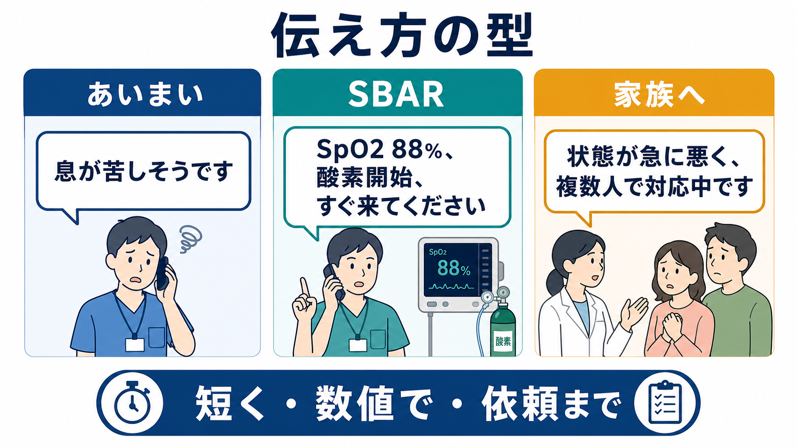
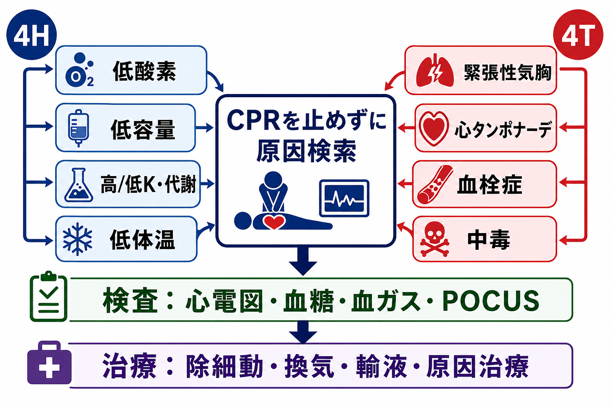
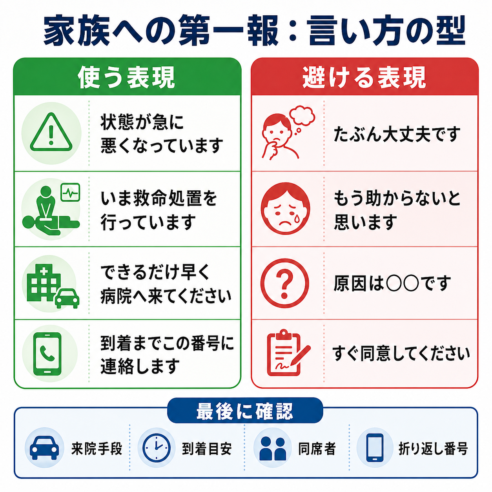

---
title: "急変時に家族へどのように第一報を伝えるか"
description: "不確実な状況でも、現在の状態・行っている対応・来院依頼を明確に伝えるための第一報の型。"
aliases:
  - "急変時の家族第一報"
tags:
  - 領域/救急・初期対応
  - 種類/クリニカルクエスチョン
  - 対象/研修医
question: "急変時に家族へどのように第一報を伝えるか"
clinical_area: "救急・初期対応"
audience: "研修医"
evidence_level: "mixed"
created: "2026-04-27"
updated: "2026-04-27"
enableToc: true
---

# 急変時に家族へどのように第一報を伝えるか

> このノートは研修医教育のための一般的整理であり、個別患者への診断・治療指示ではありません。緊急性が高い、判断に迷う、施設方針や法的・倫理的判断が関わる場合は、上級医・救急チーム・医療安全担当者に相談してください。

## クリニカルクエスチョン

急変時に家族へどのように第一報を伝えるか。

## まず結論

- 第一報の目的は「詳細な病状説明を完結すること」ではなく、家族に現在の重大性を伝え、来院や連絡継続につなげることである。
- 伝える順番は、名乗る、本人確認、現在の状態、今している対応、来院依頼、折り返し先、記録の7点に固定する。
- 原因、予後、責任、死亡見込みを不確実なまま断定しない。急変直後は「いま分かっていること」と「まだ確認中のこと」を分ける。
- 電話は救命対応を止めない範囲で行う。研修医1人で抱えず、可能なら上級医・看護師・事務担当と役割分担する。
- DNARや終末期方針がある患者でも、DNARは心停止時のCPRに関する指示であり、苦痛緩和や急変原因への対応、説明責任を省く根拠にはならない[2][3]。
- 日本では、終末期医療・DNAR・医療事故調査制度・個人情報保護・施設の同意手順が関わりうる。急変第一報だけで重大な方針決定を迫らない。

## 判断の型

### 30秒で組み立てる「名乗る・状態・対応・来院」

1. **名乗る**: 「○○病院の△△医師です。□□さんのことで緊急のご連絡です。」
2. **本人確認**: 「□□さんのご家族の○○さんでよろしいでしょうか。今お話しできる場所ですか。」
3. **状態**: 「□□さんの状態が急に悪くなっています。」
4. **対応**: 「現在、医師・看護師で呼吸と循環を支える処置を行っています。」
5. **不確実性**: 「原因や見通しはまだ確認中です。分かったことは続けてお伝えします。」
6. **来院依頼**: 「可能であれば、できるだけ早く病院へ来てください。」
7. **連絡継続**: 「到着まで、この番号に折り返します。来院手段と到着目安を教えてください。」

### 電話前の最小確認

| 確認項目 | 目的 | 注意点 |
|---|---|---|
| 患者氏名・ID・病棟 | 誤連絡を防ぐ | 電話中も個人情報を話しすぎない |
| 家族連絡先・続柄・キーパーソン | 誰に伝えるかを明確にする | 未確認の相手には最小限にする |
| 現在のバイタル・意識・呼吸循環 | 重大性を短く伝える | 数値を言うなら正確に |
| 実施中の対応 | 家族の不安を下げる | 「何もしていない」と受け取られない表現にする |
| 事前意思・DNAR・ACP | 方針の整合性を確認する | 急変電話だけで同意取得を急がない[1][3] |
| 上級医の所在 | 方針判断の支援 | 研修医単独で不可逆的判断をしない |

## 初期対応

- 患者対応を優先し、第一報は可能なら役割分担する。例: 1人がABCDE評価と処置、1人が記録、1人が家族連絡。
- 電話をかける前に、患者名、連絡相手、現在の状態、今していること、来院依頼の要否をメモにする。
- 最初の一文で緊急性を明示する。「少しお話があります」だけでは重大性が伝わりにくい。
- 家族が移動中・運転中なら、詳しい説明より安全確保を優先し、折り返し可能な状態を確認する。
- 来院を依頼する場合は、救急外来入口、夜間入口、病棟、代表電話など、施設ごとの導線を具体的に伝える。
- 電話後すぐに、時刻、相手、伝えた内容、家族の反応、来院予定、折り返し先を診療録または看護記録に残す。

## 鑑別・見逃し

### 臨床的に見逃しやすいこと

| 優先度 | 疾患・状況 | 見逃しやすい理由 | 手がかり |
|---|---|---|---|
| 高 | 気道閉塞・低酸素・誤嚥 | 電話対応中に処置が遅れる | SpO2低下、喘鳴、喀痰、意識低下 |
| 高 | ショック・敗血症・出血 | 「急に悪い」の背景が多様 | 血圧低下、頻脈、冷汗、尿量低下 |
| 高 | 致死的不整脈・急性冠症候群 | 予後を断定しやすい | 心電図、胸痛、失神、K異常 |
| 高 | 脳卒中・けいれん・低血糖 | 意識障害の原因が混在 | 麻痺、瞳孔、血糖、服薬歴 |
| 中 | 薬剤性急変・アナフィラキシー | 投与直後の関連を見落とす | 投薬時刻、皮疹、気道症状、血圧低下 |
| 中 | DNAR/ACPの誤解 | CPR以外の治療まで控えられる | 事前指示、説明記録、家族理解 |

### コミュニケーション上の見逃し

- 「大丈夫です」「たぶん助かります」のような安心の断定は避ける。
- 「もう無理です」「助かりません」のような不可逆的判断は、状況評価と上級医確認なしに言わない。
- 原因を推測で決めつけない。「心筋梗塞です」ではなく「心臓や呼吸の問題を含めて確認中です」とする。
- 家族に即時の治療同意を迫る表現を避ける。緊急避難的対応と、方針相談・同意取得を分ける。
- 電話の相手がキーパーソンでない場合は、来院依頼と代表者への連絡調整に留める。

## 検査

このCQの「検査」は、家族への第一報に必要な情報確認を指す。臨床的な急変評価では、施設の急変対応・RRS・コードブルー手順に従い、ABCDE評価、モニター、心電図、血糖、血液ガス、採血、画像、POCUSなどを並行して行う[6]。

| 確認 | 目的 | 電話での使い方 |
|---|---|---|
| ABCDEとバイタル | 現在の重大性を把握 | 「呼吸と血圧が不安定です」 |
| 直前の経過 | 急変の時系列 | 「先ほど急に悪化しました」 |
| 実施中の処置 | 対応中であることを伝える | 「酸素投与、点滴、心電図確認をしています」 |
| 事前意思・DNAR | 方針の矛盾を避ける | 「事前の方針も確認しながら対応しています」 |
| 連絡先と続柄 | 誤連絡防止 | 「代表して連絡を受ける方を確認します」 |
| 医療安全上の事案可能性 | 説明・報告経路 | 施設管理者・医療安全担当へ早期共有[4] |

## 治療・マネジメント

### 第一報の基本スクリプト

> 「○○病院の△△です。□□さんのことで緊急のご連絡です。□□さんのご家族の○○さんでよろしいでしょうか。  
> いま、□□さんの状態が急に悪くなっています。呼吸と血圧が不安定で、医師と看護師で救命処置を行っています。原因や今後の見通しはまだ確認中ですが、重大な状況です。  
> 可能であれば、できるだけ早く病院へ来てください。到着まではこの番号にご連絡します。来院手段と到着の目安を教えてください。」

### 家族の反応への返し方

| 家族の反応 | 返答例 | ねらい |
|---|---|---|
| 「助かるんですか」 | 「いまは断定できません。助けるための処置を続けています。」 | 不確実性と努力を同時に伝える |
| 「何が原因ですか」 | 「原因は確認中です。心臓、呼吸、感染などを急いで調べています。」 | 推測で断定しない |
| 「行けません」 | 「電話で連絡を続けます。代表で連絡を受ける方はいますか。」 | 連絡経路を確保する |
| 「治療をやめてください」 | 「大事な希望として受け止めます。現在の状態を上級医と確認し、方針を改めて相談します。」 | 急変第一報と方針決定を分ける |
| 「前にDNARと言いました」 | 「確認します。DNARは心停止時の蘇生に関する方針で、苦痛を取る対応や必要な説明は続けます。」 | DNARの誤用を避ける[3] |

### 日本での注意

- 厚生労働省の人生の最終段階の医療・ケアのガイドラインは、本人の意思を基本に、本人・家族等・医療ケアチームで繰り返し話し合うプロセスを重視している[1]。急変第一報は、その話し合いを始める入口であって、単独で終末期方針を確定する場ではない。
- 救急・集中治療の終末期ガイドラインでは、急性重症患者の終末期判断は慎重な医学的判断とチームでの説明を要する[2]。研修医の電話だけで「終末期です」と決めつけない。
- 日本集中治療医学会のDNAR勧告では、DNARがCPR以外の治療内容に影響してはならないという考え方が強調されている[3]。
- 医療事故調査制度の対象になりうる死亡・死産では、管理者判断、遺族への説明、センター報告、院内調査などの手順がある[4]。急変時点で事故と断定しない一方、予期しない経過や医療起因が疑われる場合は医療安全担当へ早期共有する。
- このCQは薬剤選択や用量を扱わないため、PMDA添付文書に基づく個別薬剤推奨はない。ただし薬剤性急変が疑われる場合は、投与薬の添付文書、PMDA医療安全情報、患者向医薬品ガイド等を確認し、必要な報告経路を検討する[5]。

## 図解

## 指導医に確認するポイント

- 今の時点で家族へ伝えてよい医学情報と、まだ確認中として保留すべき情報は何か。
- 来院依頼の強さをどう表現するか。「すぐ来てください」と言うべき状況か。
- DNAR、ACP、事前説明、同意書、キーパーソン情報に矛盾がないか。
- 家族到着後の説明担当は誰か。救急・ICU・主治医・病棟医のどこが主担当になるか。
- 医療安全上の報告、インシデント記録、管理者報告が必要な可能性はあるか。
- 死亡確認、病理解剖、医療事故調査制度の説明などに進む可能性がある場合、施設手順は何か。

## 患者説明

家族への第一報では、専門用語よりも短く具体的な言葉を使う。

- 「状態が急に悪くなっています。」
- 「呼吸や血圧が不安定です。」
- 「いま複数の医療者で対応しています。」
- 「原因や見通しはまだ確認中です。」
- 「重大な状況なので、可能であればできるだけ早く病院へ来てください。」
- 「運転中であれば安全な場所に停めてください。到着まで連絡を続けます。」

伝えた後は、沈黙を恐れず、家族が話せる時間を短く取る。重篤な場面での家族支援では、情報提供だけでなく、感情への応答、家族が話す時間、継続的な連絡が重要とされる[7][9][10]。

## ピットフォール

- 家族連絡を「後でよい」として遅らせる。救命対応を優先しつつ、役割分担して第一報を入れる。
- 詳細な病態説明をしようとして長電話になり、現場対応や記録が崩れる。
- 「原因は○○です」と推測を断定する。
- 「大丈夫」「危ない」だけで、現在の対応と来院依頼を言わない。
- 家族の感情に反射的に弁解する。まず「突然で驚かれたと思います」と受け止める。
- DNARを「何もしない」と誤解する。DNARはCPRの方針であり、苦痛緩和、原因検索、説明、家族支援は継続する[3]。
- 電話記録を残さない。後続の説明、医療安全、家族間の情報共有で問題になる。

## 関連ノート

- 関連ノート候補: 急変時のABCDE評価（本サイト未同梱）
- 関連ノート候補: DNAR指示をどう確認するか（本サイト未同梱）
- 関連ノート候補: 医療事故発生時の初期対応（本サイト未同梱）
- 関連ノート候補: ACPをどう聞くか（本サイト未同梱）

## MOC更新候補

- [[MOC｜救急・初期対応]] に「DNAR・急変時コミュニケーション」配下の記事として追加候補。
- MOC｜医療安全・法律・倫理.md（本サイト外） に「急変時・予期しない死亡・医療事故調査制度に関連するコミュニケーション」として相互参照候補。

## 参考文献

[1] 厚生労働省. 人生の最終段階における医療・ケアの決定プロセスに関するガイドライン. https://www.mhlw.go.jp/stf/seisakunitsuite/bunya/kenkou_iryou/iryou/saisyu_iryou/index.html

[2] 日本救急医学会・日本集中治療医学会・日本循環器学会. 救急・集中治療における終末期医療に関するガイドライン 3学会からの提言. 2014. https://www.j-circ.or.jp/old/topics/qq_teigen.htm

[3] 日本集中治療医学会倫理委員会. DNAR指示のあり方についての勧告. 2017. https://www.jsicm.org/pdf/DNAR20161216.pdf

[4] 厚生労働省. 医療事故調査制度に関するQ&A. https://www.mhlw.go.jp/stf/newpage_31442.html

[5] 独立行政法人 医薬品医療機器総合機構. PMDA医療安全情報・患者向医薬品ガイド. https://www.pmda.go.jp/safety/info-services/medical-safety-info/0001.html

[6] National Institute for Health and Care Excellence. Acutely ill adults in hospital: recognising and responding to deterioration. NICE clinical guideline CG50. 2007. https://www.nice.org.uk/guidance/cg50

[7] Davidson JE, Aslakson RA, Long AC, et al. Guidelines for Family-Centered Care in the Neonatal, Pediatric, and Adult ICU. Crit Care Med. 2017;45(1):103-128. https://doi.org/10.1097/CCM.0000000000002169

[8] Ariadne Labs. Serious Illness Conversation Guide. Updated May 2023. https://www.ariadnelabs.org/resources/downloads/serious-illness-conversation-guide/

[9] VitalTalk. COVID Ready Communication Playbook. https://www.vitaltalk.org/guides/covid-19-communication-skills/

[10] Lautrette A, Darmon M, Megarbane B, et al. A communication strategy and brochure for relatives of patients dying in the ICU. N Engl J Med. 2007;356(5):469-478. https://doi.org/10.1056/NEJMoa063446

## 更新ログ

- 2026-04-27: 初版作成。
