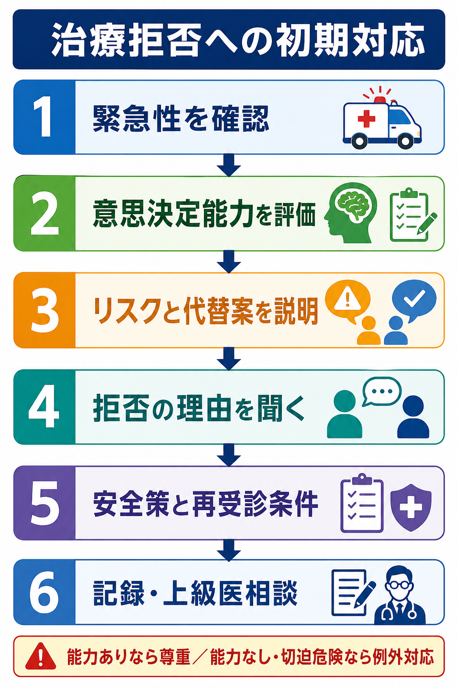
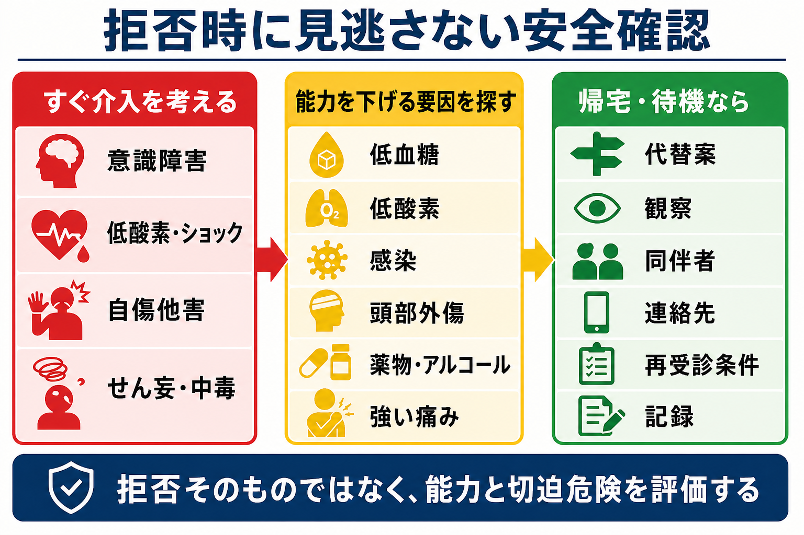
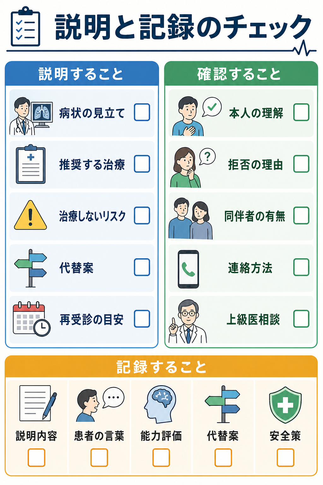

---
title: "救急外来で患者が治療を拒否したらどう対応するか"
description: "意思決定能力、説明、代替案、記録、緊急時の例外を整理する。"
aliases:
  - "治療拒否"
tags:
  - 領域/救急・初期対応
  - 種類/クリニカルクエスチョン
  - 対象/研修医
question: "救急外来で患者が治療を拒否したらどう対応するか"
clinical_area: "救急・初期対応"
audience: "研修医"
evidence_level: "mixed"
created: "2026-04-27"
updated: "2026-04-27"
enableToc: true
---

# 救急外来で患者が治療を拒否したらどう対応するか

> このノートは研修医教育のための一般的整理であり、個別患者の診断・治療指示ではありません。緊急性が高い、判断に迷う、施設方針が関わる場合は上級医・専門科に相談してください。

## クリニカルクエスチョン

救急外来で患者が検査、処置、入院、搬送、輸血、薬剤投与などを拒否したとき、研修医は何を確認し、どう説明し、どこまで記録すればよいか。

## まず結論

- 治療拒否は「説得して同意させる場面」ではなく、まず緊急性、意思決定能力、説明の質、代替案、安全策、記録を順に確認する場面である。[1],[2]
- 意思決定能力は「その人に能力があるか」ではなく、「この時点で、この治療選択について、理解・認識・推論・選択表明ができるか」を見る。[3],[4]
- 能力があり、十分な説明を理解した成人患者の拒否は、医学的には不合理に見えても尊重するのが原則である。[2],[5]
- 能力が不十分で、死亡または重大な害を防ぐために直ちに介入が必要で、代理判断者を待てない場合は、緊急時の例外として必要最小限の救急処置を検討する。[2],[3]
- 拒否された治療を諦めるだけで終わらず、より受け入れやすい代替案、観察、同伴者、連絡先、再受診条件を具体化する。[1],[6]
- 日本では、終末期やDNARに近い話題では本人の意思を基本に、医療・ケアチームで十分に話し合い、話し合った内容を文書化・共有する姿勢が重視される。[7],[8]

## 判断の型

1. **切迫危険を先に見る**：低酸素、ショック、意識障害、自傷他害、せん妄、中毒、急性冠症候群、脳卒中、敗血症など、待つと不可逆的な害が出る状態を除外する。
2. **意思決定能力をその場の決定に限って評価する**：理解、認識、推論、選択表明を患者自身の言葉で確認する。[3],[4]
3. **情報提供を整える**：病状の見立て、推奨する治療、治療しないリスク、代替案、帰宅・待機時の安全策を、専門用語を避けて説明する。[2],[5]
4. **拒否の理由を聞く**：費用、待ち時間、痛みへの恐怖、家族・仕事、宗教、過去の医療不信、薬剤副作用、認知症・せん妄・精神症状、暴力被害や虐待の背景を確認する。
5. **受け入れ可能な代替案を作る**：全部拒否か全部実施かにせず、短時間観察、最低限の検査、内服のみ、紹介状、翌日受診、同伴者への説明などを提案する。
6. **記録と相談を残す**：能力評価、説明内容、患者の理解、拒否の言葉、代替案、再受診条件、同席者、上級医相談、院内方針を診療録に残す。[3],[6]

## 初期対応

- まず通常の救急初期評価として、気道、呼吸、循環、意識、体温、疼痛、低血糖、酸素化を確認する。拒否があっても、会話可能性と安全確保のための観察は継続する。
- 医師ひとりで抱えず、看護師、上級医、必要に応じて警備、精神科、ソーシャルワーカー、倫理相談、事務・医事課に早めに共有する。
- 患者が怒っている、帰ろうとしている、家族と対立しているときほど、最初に「何が一番心配ですか」「何が嫌ですか」と聞く。理由が分かると代替案を作れる。
- 通訳、補聴器、眼鏡、筆談、平易な言葉を使い、聞こえない・読めない・日本語が分からないための「見かけ上の能力低下」を避ける。[3]
- アルコール、薬物、せん妄、低酸素、低血糖、頭部外傷、強い疼痛、発熱、敗血症、精神病症状が疑われる場合は、能力評価を急がず、改善可能な要因を治療・補正して再評価する。[3],[4]
- 暴力や自傷他害リスクがある場合は、治療拒否の倫理問題だけでなく、本人・周囲の安全確保と院内プロトコルを優先する。身体拘束や鎮静を考える状況では、必ず上級医と施設方針に従う。

## 鑑別・見逃し

| 優先度 | 疾患・状態 | 見逃さない理由 | 手がかり |
|---|---|---|---|
| 高 | 低酸素・ショック・敗血症 | 能力評価の前に生命危機を来しうる | SpO2低下、頻呼吸、低血圧、冷汗、意識変容、発熱 |
| 高 | 低血糖・電解質異常 | 可逆的な判断能力低下の原因 | 糖尿病薬、発汗、ふらつき、けいれん、Na異常 |
| 高 | 頭部外傷・脳卒中・てんかん後 | 拒否や興奮が神経症状の表現になりうる | 片麻痺、失語、頭痛、外傷、抗凝固薬、発作後 |
| 高 | 中毒・アルコール・薬物影響 | 判断能力、同意、帰宅安全性を損なう | 瞳孔異常、呼気臭、処方薬、眠気、興奮 |
| 高 | せん妄・急性精神病・自殺企図 | 自傷他害、治療中断、逃走リスク | 見当識障害、幻覚妄想、希死念慮、急な性格変化 |
| 中 | 費用・仕事・介護・家族事情 | 拒否理由の解決で受療可能になる | 「帰らないと困る」「お金がない」「家族に言えない」 |
| 中 | 宗教・価値観に基づく拒否 | 不合理ではなく価値に基づく決定の可能性 | 輸血拒否、侵襲処置拒否、明確な一貫した説明 |

## 検査

| 検査 | 目的 | 注意点 |
|---|---|---|
| バイタル、SpO2、意識レベル、血糖 | 切迫危険と可逆的な能力低下の確認 | 拒否が強いときも、非侵襲的に必要性を説明して最小限から提案する |
| 心電図、トロポニン、胸部X線、血液ガスなど | 症状に応じて急性冠症候群、呼吸不全、代謝異常を評価 | 検査拒否時は「何を見逃す可能性があるか」を具体的に説明する |
| 頭部CT、神経診察 | 意識変容、頭部外傷、脳卒中、抗凝固薬内服時の評価 | 画像拒否では、観察や再診条件を厳格にする |
| CBC、生化学、凝固、感染評価 | せん妄、感染、貧血、電解質異常の評価 | 採血拒否時は、採血項目を絞る、再評価時刻を決める |
| 妊娠反応 | 妊娠可能性がある患者の検査・薬剤・画像判断 | 目的とプライバシー保護を説明する |
| 精神科評価、ソーシャルワーカー相談 | 自傷他害、虐待、帰宅困難、意思決定支援 | 医学的安全確認と並行して進める |

検査は「拒否を突破するため」ではなく、能力低下の可逆因子と、拒否した場合に重大な害が出る疾患を確認するために選ぶ。患者が全部を拒む場合は、最小限の検査、短時間観察、同伴者への説明など、受け入れ可能な選択肢へ分解する。

## 治療・マネジメント

- **能力がある場合**：本人が理解・認識・推論・選択表明を示し、強制や重大な誤解がなければ、拒否を尊重する。拒否の結果が医学的に危険でも、それだけで能力なしとは判断しない。[3],[4]
- **能力が疑わしい場合**：低酸素、低血糖、せん妄、薬物、痛み、言語・聴覚・視覚の障壁を補正し、時間を置いて再評価する。精神科相談は有用だが、最終的な治療に関する能力評価は原則として担当医が行う。[3]
- **能力がなく切迫危険がある場合**：死亡または重大な害を防ぐための即時介入が必要で、代理判断者を待てないなら、必要最小限の救急処置を上級医と検討する。[2],[3]
- **代理判断者がいる場合**：本人の過去の意思、価値観、事前指示、家族等の推定意思を確認し、医学的妥当性と患者にとっての最善を医療・ケアチームで検討する。[7],[8]
- **非有益な介入を求められる場合**：拒否とは逆に、患者・家族が医学的利益の乏しい介入を求めることもある。ACEPは、利益が現実的に見込めない介入を医師が倫理的義務として行う必要はない一方、不確実なら一時的対応や入院、追加相談を使って意思決定を支えるとしている。[6]
- **日本での注意**：治療拒否、DNAR、終末期方針は日本の法制度・院内規程・倫理委員会運用の影響が大きい。研修医単独で「法的に可能」と判断せず、上級医、診療科責任者、病院の倫理相談、医療安全部門に早めに相談する。
- **薬剤に関する注意**：このCQ自体は特定薬剤・用量の問題ではない。興奮、せん妄、自傷他害への鎮静薬や身体拘束を考える場合は、疾患別プロトコル、禁忌、PMDA添付文書、院内手順を確認し、最小限・短時間・継続観察を原則とする。[9]

## 図解

## 指導医に確認するポイント

- この患者の拒否は、どの検査・治療・入院・搬送についての拒否か。
- 患者は理解、認識、推論、選択表明をどの程度示しているか。患者自身の言葉で確認できたか。
- 低酸素、低血糖、せん妄、中毒、頭部外傷、精神症状、強い疼痛など、能力を下げる要因を補正したか。
- 今すぐ介入しないと死亡または重大な害が起こる切迫性があるか。
- 代理判断者、家族等、事前指示、ACP、DNAR文書、かかりつけ情報は確認したか。
- 代替案、観察時間、再受診条件、帰宅時の同伴者、連絡先は現実的か。
- 診療録に、説明内容、拒否の言葉、能力評価、相談先、同席者、方針変更の余地を残したか。

## 患者説明

- 「無理に治療を受けさせるためではなく、今の危険度と選択肢を一緒に確認したいです。」
- 「今おすすめしているのは、〇〇を見逃すと命に関わる可能性があるためです。」
- 「受けない選択も含めて考えられます。その場合に起こりうることと、代わりにできることを説明します。」
- 「検査を全部受けるのが難しければ、最低限の確認、短時間の観察、明日の再診など、受け入れやすい方法を相談できます。」
- 「帰宅する場合は、悪化したときに戻る目安、連絡先、誰と一緒にいるかを確認させてください。」
- 「気持ちが変わったら、いつでも再度相談してください。」

## ピットフォール

- 「拒否しているから自己責任」と書いて終わる。説明、能力評価、代替案、安全策、再受診条件が記録されていないと不十分である。[3]
- 「患者が怒っている」「医学的に不合理」だけで能力なしと決める。価値観に基づく拒否は能力ありでも起こりうる。[4],[5]
- 説明が専門用語だらけで、患者が理解できないまま拒否している。通訳、筆談、家族同席、図示などを検討する。[3]
- 拒否理由を聞かずに説得だけする。費用、時間、恐怖、家族事情を解決すると、受け入れ可能な代替案が見つかることがある。
- 研修医単独で法的・倫理的判断を抱える。救急例外、身体拘束、精神科入院、DNAR、終末期方針は施設運用差が大きい。
- 帰宅後の安全策が曖昧。誰と帰るか、何を見たら戻るか、いつ再評価するかを具体化する。

## 関連ノート

- 関連ノート候補: DNARを救急外来でどう確認するか
- 関連ノート候補: 意思決定能力をどう評価するか
- 関連ノート候補: せん妄患者が帰宅を希望したときの対応
- 関連ノート候補: 自殺企図・自傷他害リスクの初期対応

## MOC更新候補

- [[MOC｜救急・初期対応]]
- MOC｜医療安全・法律・倫理.md（本サイト外）
- [[MOC｜DNAR・急変時コミュニケーション]]

## 参考文献

[1] Marco CA, Brenner JM, Kraus CK, McGrath NA, Derse AR; ACEP Ethics Committee. Refusal of Emergency Medical Treatment: Case Studies and Ethical Foundations. Ann Emerg Med. 2017;70(5):696-703. https://doi.org/10.1016/j.annemergmed.2017.04.015

[2] American College of Emergency Physicians. Code of Ethics for Emergency Physicians. Revised 2017. https://www.acep.org/siteassets/uploads/uploaded-files/acep/clinical-and-practice-management/policy-statements/code-of-ethics-for-emergency-physicians.pdf

[3] Barstow C, Shahan B, Roberts M. Evaluating Medical Decision-Making Capacity in Practice. Am Fam Physician. 2018;98(1):40-46. https://www.aafp.org/pubs/afp/issues/2018/0701/p40.html

[4] Appelbaum PS. Assessment of Patients' Competence to Consent to Treatment. N Engl J Med. 2007;357(18):1834-1840. https://doi.org/10.1056/NEJMcp074045

[5] 日本医師会. 医師の職業倫理指針 第3版. 2016. https://www.med.or.jp/dl-med/doctor/syokurin3.pdf

[6] American College of Emergency Physicians. Nonbeneficial Emergency Medical Interventions. Revised February 2023. https://www.acep.org/patient-care/policy-statements/nonbeneficial-emergency-medical-interventions

[7] 厚生労働省. 人生の最終段階における医療・ケアの決定プロセスに関するガイドライン. 2018. https://www.mhlw.go.jp/stf/newpage_02783.html

[8] 日本救急医学会, 日本集中治療医学会, 日本循環器学会. 救急・集中治療における終末期医療に関するガイドライン 3学会からの提言. 2014. https://www.jaam.jp/info/2014/info-20141104_02.html

[9] 独立行政法人 医薬品医療機器総合機構. 医療用医薬品 添付文書等情報検索. https://www.pmda.go.jp/PmdaSearch/iyakuSearch/

## 更新ログ

- 2026-04-27: 初版作成。
