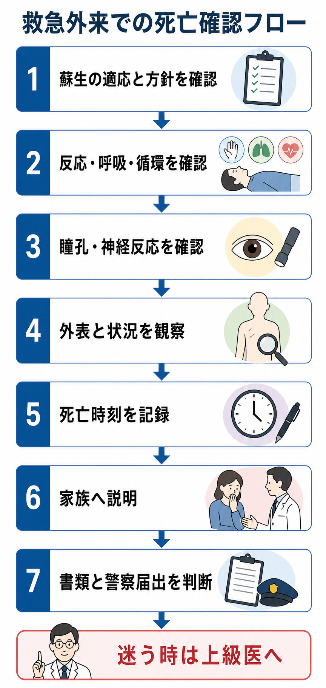
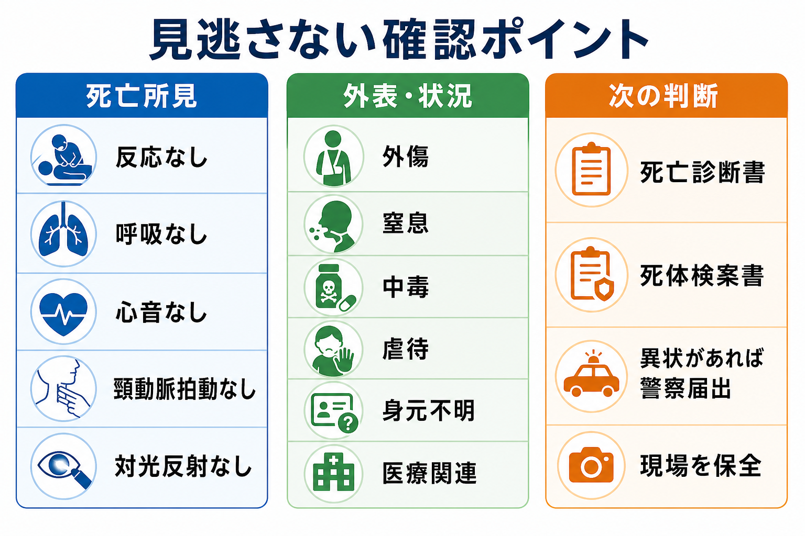
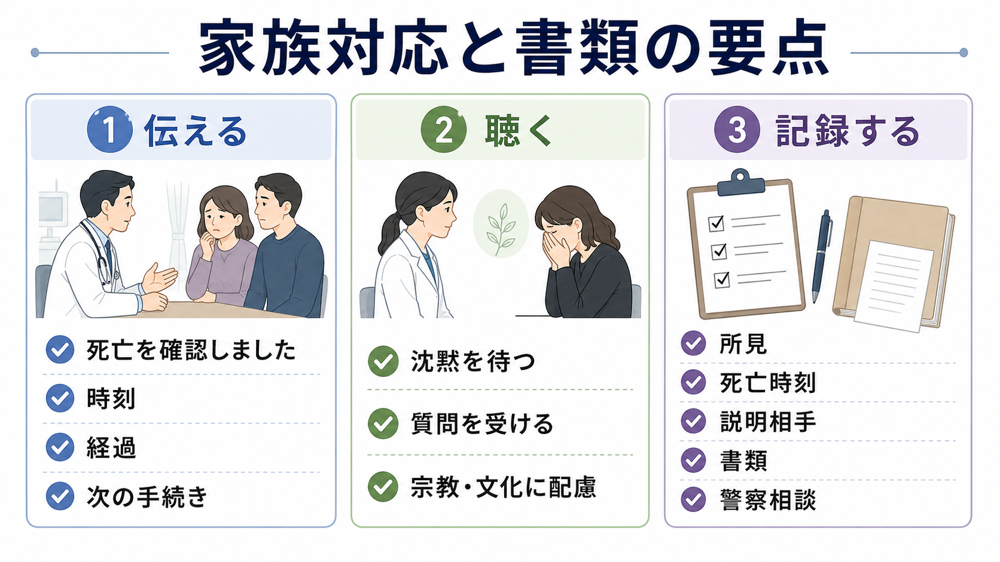

---
title: "救急外来で死亡確認をする流れはどう進めるか"
description: "死亡診断に必要な所見、家族対応、死亡診断書・死体検案書、警察届出が必要な場合を救急外来向けに整理する。"
aliases:
  - "救急外来での死亡確認"
tags:
  - 領域/救急・初期対応
  - 種類/クリニカルクエスチョン
  - 対象/研修医
question: "救急外来で死亡確認をする流れはどう進めるか"
clinical_area: "救急・初期対応"
audience: "研修医"
evidence_level: "mixed"
created: "2026-04-27"
updated: "2026-04-27"
enableToc: true
---

# 救急外来で死亡確認をする流れはどう進めるか

> このノートは研修医教育のための一般的整理であり、個別患者の診断・治療指示ではありません。緊急性が高い、判断に迷う、施設方針が関わる場合は上級医・専門科に相談してください。

## クリニカルクエスチョン

救急外来で死亡確認をする流れはどう進めるか。

## まず結論

- 救急外来での死亡確認は、最初に「蘇生を続けるべき状況が残っていないか」をチームで確認し、そのうえで反応、呼吸、循環、瞳孔・脳幹反射を落ち着いて確認する[6]。
- 死亡時刻は、心停止が始まった時刻ではなく、医師が死亡を確認し、必要な所見がそろったと判断した時刻として記録するのが実務上の基本である[6]。
- 書類は、診療中の傷病に関連して死亡したと判断できる場合は死亡診断書、それ以外は死体検案書を考える。両者は法的・統計的な効力に差はない[1]。
- 死亡診断書か死体検案書かにかかわらず、死体に異状を認める場合は医師法第21条に基づき24時間以内に所轄警察署へ届け出る[1,2]。
- CPA搬送で初診の患者でも、かかりつけ医や診療録などから生前の傷病と死亡の関連を正確に把握できる場合、死亡後診察を行ったうえで死亡診断書を交付できることがある[1]。
- 家族対応では、まず「死亡を確認しました」と明確に伝え、時刻、確認した所見、今後の手続き、警察相談の可能性を簡潔に説明し、沈黙と質問の時間を確保する[6]。
- 日本での注意: 警察届出、死亡診断書・死体検案書、医療事故調査制度は国内法・施設運用に依存する。海外資料の確認手順や死因記載法は参考になるが、日本の書類・届出判断を置き換えない[1,2,4]。

## 判断の型

1. **蘇生継続の適応を確認する。** DNAR、終末期方針、蘇生処置の経過、可逆的原因、低体温・中毒など死亡確認を急がず評価すべき状況がないかを上級医と確認する[6]。
2. **死亡所見を身体診察で確認する。** 反応なし、自発呼吸なし、心音なし、頸動脈拍動なし、対光反射なしを、モニター所見だけに頼らず自分の診察として記録する[6]。
3. **死亡時刻を宣言・記録する。** チーム内で時刻をそろえ、診療録に「死亡確認時刻」「確認者」「確認所見」「立ち会い者」を記載する[6]。
4. **外表と状況を観察する。** 外傷、窒息、中毒、自傷他害、虐待・ネグレクト、身元不明、発見状況の不自然さ、医療行為との関連を確認する[1,3]。
5. **書類と届出を判断する。** 死亡診断書か死体検案書か、警察届出が必要か、医療事故調査制度の院内報告対象かを、単独で抱えず上級医・医療安全部門と確認する[1,2,4]。
6. **家族へ説明する。** 死亡確認後すぐに、責任者またはチームで説明する。経過説明と死因説明を混同せず、未確定の死因は未確定として伝える。

## 初期対応

- モニター、心電図波形、SpO2、呼吸の有無を見ながらも、最終判断は身体診察で行う。モニターの平坦化だけで死亡確認を済ませない[6]。
- 挿管、人工呼吸、機械的胸骨圧迫、ペーシング、ECMO、低体温、中毒、鎮静薬・筋弛緩薬の影響がある場合は、通常の心肺停止後の死亡確認と同じ感覚で進めず、上級医・集中治療医に相談する。
- 蘇生中止の判断と死亡確認は別の作業として扱う。蘇生終了の方針が決まった後、観察・診察・記録を改めて行う。
- 家族が立ち会っている場合は、いったん静かな場所を用意し、死亡確認の前後で「今から最終確認をします」「死亡を確認しました」と短く伝える。
- 外傷、中毒、窒息、溺水、転落、自傷他害、虐待、身元不明、到着時死亡、死因不明では、衣服・所持品・ライン類を安易に処分せず、施設の手順に沿って現場保全と警察相談を行う[1,3]。

## 鑑別・見逃し

| 優先度 | 疾患・状態 | 見逃さない理由 | 手がかり |
|---|---|---|---|
| 高 | 蘇生可能な心肺停止 | 死亡確認ではなく蘇生継続・可逆因子検索が必要 | 低体温、中毒、電解質異常、緊張性気胸、心タンポナーデ、低血糖など |
| 高 | 外因死・外因疑い | 異状を認めれば警察届出が必要 | 外傷、転落、交通事故、溺水、窒息、中毒、熱傷、発見状況の不自然さ[1,3] |
| 高 | 自殺・他殺・虐待・ネグレクト | 法的・社会的対応が必要 | 説明困難な外傷、保護者・同伴者の説明不一致、縊頸、薬物、乳幼児・高齢者の不自然な状況 |
| 高 | 医療関連の予期しない死亡 | 医療事故調査制度や院内報告の対象になりうる | 処置・検査・投薬・手術・入院管理の直後、想定外の急変[4] |
| 中 | 死因不明の突然死 | 死体検案書、警察届出、剖検・Ai相談が必要になることがある | 既往歴不明、診療情報なし、急激な死亡、若年者突然死 |
| 中 | 死亡診断書を書ける情報不足 | 不適切な死因記載や書類選択につながる | かかりつけ情報未確認、診療録未確認、家族情報のみで死因を断定 |

## 検査

| 検査 | 目的 | 注意点 |
|---|---|---|
| 身体診察 | 死亡確認の中核 | 反応、自発呼吸、心音、頸動脈拍動、対光反射を記録する[6] |
| 心電図・モニター | 補助情報、記録補助 | 身体診察の代替にしない。波形だけで死亡確認を完結しない |
| 体温 | 低体温の見逃し回避 | 低体温では蘇生継続や復温の適応判断が絡むため上級医へ |
| 血糖・血液ガス・電解質 | 可逆的原因の確認 | 蘇生継続判断の文脈で使う。死亡確認後の死因断定目的で安易に広げない |
| 画像検査・死亡時画像診断 | 外傷、死因不明、医療安全上の情報整理 | 実施可否は施設体制、警察・法医学、家族説明、医療安全部門と相談する[4,5] |
| 診療情報の照会 | 死亡診断書か死体検案書かの判断 | 初診CPAでも、かかりつけ医等から生前の傷病と死亡の関連を把握できれば死亡診断書を交付できる場合がある[1] |

## 治療・マネジメント

- 死亡確認後は、医療処置を終えるだけでなく、記録、家族説明、書類、遺体の扱い、警察届出の要否までを一連の業務として進める。
- 死亡診断書は「自らの診療管理下にある患者が、生前に診療していた傷病に関連して死亡した」と認める場合に交付する。それ以外では死体検案書を考える[1]。
- 生前に担当していない医師でも、同一医療機関の診療録、他院・かかりつけ医からの情報提供などで生前の状況を正確に把握し、死亡後診察で関連死亡と判断できる場合、死亡診断書を交付できることがある[1]。
- 死因欄は「心停止」「呼吸停止」など終末イベントだけで済ませず、直接死因から原死因へ因果の連鎖を考えて記載する。WHO/CDCも、死亡統計の質のために原死因と因果系列を具体的に書くことを重視している[7,8]。
- 異状の判断は、書類名ではなく「死体に異状があるか」で行う。死亡診断書を交付する場合でも、死体に異状を認めれば所轄警察署へ届け出る[1,2]。
- 医療に起因し、または起因すると疑われる死亡・死産で、管理者が予期しなかったものは、医療事故調査制度の対象になりうる。研修医は単独判断せず、ただちに上級医、診療科責任者、医療安全部門へ報告する[4]。
- 日本での注意: このCQには標準薬剤・用量はないため、PMDA添付文書上の薬剤適応差は中心論点ではない。ただし、中毒、鎮静薬、筋弛緩薬、終末期鎮静などが死亡判断に関わる場合は、薬剤影響を除外せず上級医へ相談する。

## 図解

## 指導医に確認するポイント

- 蘇生を終了してよい医学的・倫理的・施設運用上の根拠はそろっているか。
- 死亡確認所見、死亡確認時刻、記録内容に不足がないか。
- 死亡診断書と死体検案書のどちらを交付する状況か。
- 異状死体として所轄警察署へ届け出る必要があるか[1,2]。
- 死因欄に書ける医学的根拠があるか。不明点を「推定」または「不詳」として扱うべきか。
- 医療事故調査制度、院内インシデント報告、医療安全部門への連絡が必要か[4]。
- 家族説明を誰が担当し、どこまで確定情報として伝えるか。

## 患者説明

- 「確認の結果、〇時〇分に死亡を確認しました。」
- 「反応、呼吸、心臓の音と脈、瞳孔の反応を確認し、生命の兆候がないことを確認しました。」
- 「現時点で分かっている経過は〇〇です。死因については、診療情報や検査結果を確認したうえで説明します。」
- 「死亡診断書または死体検案書の手続きが必要です。状況によっては、法律に基づいて警察へ届け出、確認を受ける必要があります。」
- 「ご質問にお答えします。少しお時間を取りますので、今は分かる範囲で一つずつ確認します。」

## ピットフォール

- モニター波形だけで死亡確認したつもりになる。死亡確認は身体診察と記録が中核である[6]。
- 蘇生中止の時刻、心停止発生時刻、死亡確認時刻を混同する。
- 「救急外来で初診CPAだから必ず死体検案書」と単純化する。診療情報を正確に把握できる場合は死亡診断書を交付できることがある[1]。
- 「死亡診断書なら警察届出不要」「死体検案書なら警察届出必須」と誤解する。届出要否は異状の有無で判断する[1]。
- 家族に死因を早く断定しすぎる。死因不明、外因疑い、医療関連の可能性があれば、未確定であることを明確に伝える。
- ルート、挿管チューブ、衣服、所持品、外表所見を、異状の有無を確認する前に整理・廃棄してしまう。
- 医療関連の予期しない死亡を、死亡診断書作成だけで終わらせる。院内報告と医療安全部門への連絡を忘れない[4]。

## 関連ノート

- [[DNARがある患者の急変時に何を確認するか]]
- [[救急外来でバイタルサイン異常を見たとき何を優先して確認するか]]
- [[救急外来で研修医が最初にオーダーしてよいことは何か]]

## MOC更新候補

- [[MOC｜救急・初期対応]]
- MOC｜医療安全・法律・倫理.md（本サイト外）

## 参考文献

[1] 厚生労働省. 死亡診断書（死体検案書）について. https://www.mhlw.go.jp/stf/seisakunitsuite/bunya/kenkou_iryou/iryou/sibousinndannsyo.html

[2] e-Gov法令検索. 医師法. https://laws.e-gov.go.jp/law/323AC0000000201

[3] 日本救急医学会. 医学用語解説集「異状死体」. https://www.jaam.jp/dictionary/dictionary/word/1031.html

[4] 厚生労働省. 医療事故調査制度について. https://www.mhlw.go.jp/stf/seisakunitsuite/bunya/0000061201.html

[5] 日本医師会. 医療安全・死因究明. https://www.med.or.jp/doctor/anzen_siin/

[6] Academy of Medical Royal Colleges. A Code of Practice for the diagnosis and confirmation of death: 2025 update. https://www.aomrc.org.uk/wp-content/uploads/2025/01/Code_of_Practice_Diagnosis_of_Death_010125.pdf

[7] Centers for Disease Control and Prevention, National Center for Health Statistics. Physicians' Handbook on Medical Certification of Death. 2003. https://www.cdc.gov/nchs/data/misc/hb_cod.pdf

[8] World Health Organization. Medical certification of cause of death: instructions for physicians on use of international form of medical certificate of cause of death, 4th ed. 1979. https://iris.who.int/handle/10665/40557

## 更新ログ

- 2026-04-27: 初版作成。
