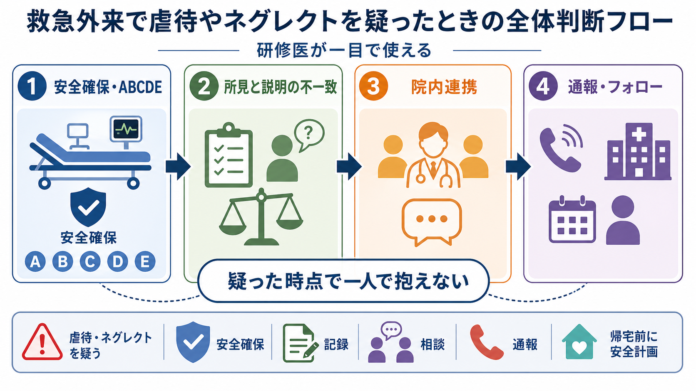
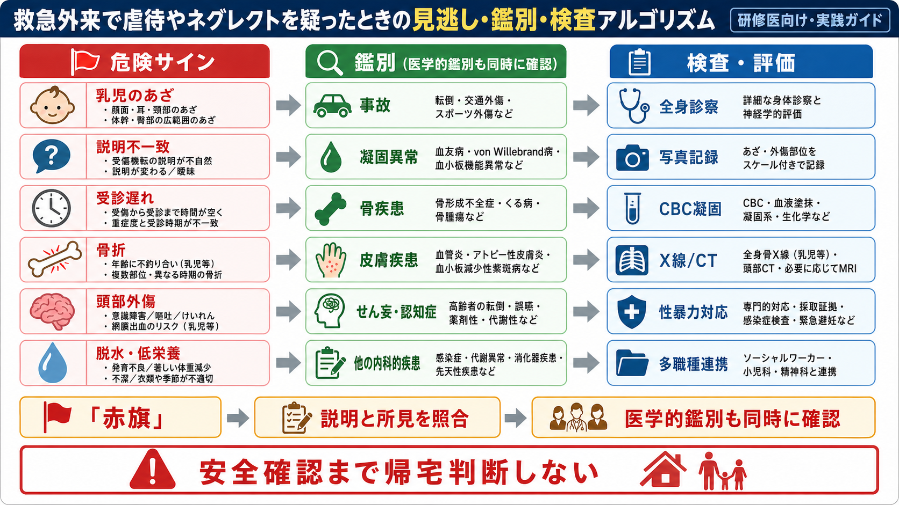
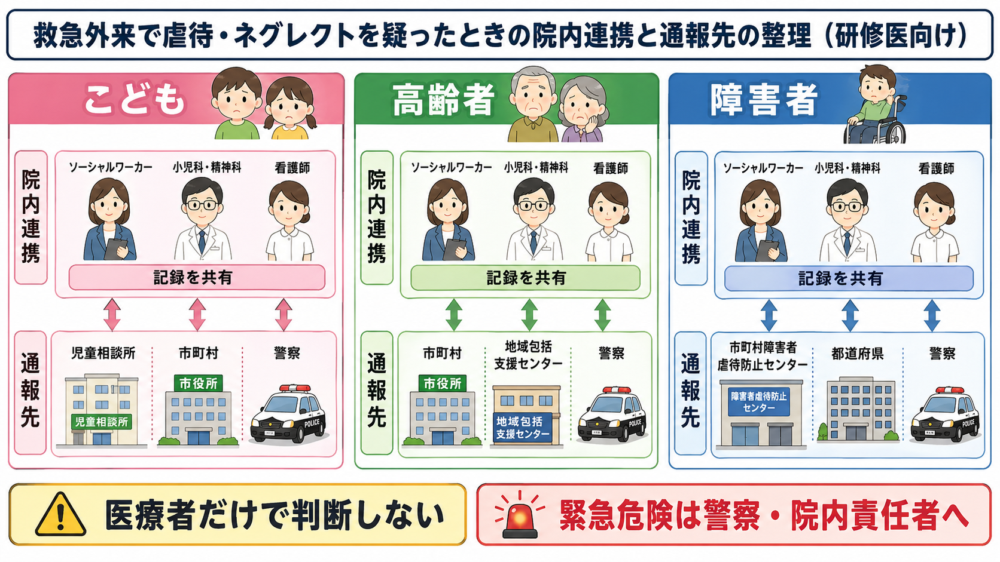

---
title: "救急外来で虐待やネグレクトを疑ったら何をするか"
description: "身体所見、説明の不一致、社会背景を確認し、院内連携や通報を検討する。"
aliases:
  - "虐待・ネグレクト初期対応"
tags:
  - 領域/救急・初期対応
  - 種類/クリニカルクエスチョン
  - 対象/研修医
question: "救急外来で虐待やネグレクトを疑ったら何をするか"
clinical_area: "救急・初期対応"
audience: "研修医"
evidence_level: "guideline"
created: "2026-04-27"
updated: "2026-04-27"
enableToc: true
---

# 救急外来で虐待やネグレクトを疑ったら何をするか

> このノートは研修医教育のための一般的整理であり、個別患者への診断・治療指示ではありません。虐待・ネグレクトの疑いは患者安全、法制度、院内方針が関わるため、一人で判断せず、上級医・小児科・救急責任者・看護師・医療ソーシャルワーカー・院内虐待対応チームへ早期に相談してください。

## クリニカルクエスチョン

救急外来で虐待やネグレクトを疑ったら、研修医は最初に何を確認し、誰に相談し、どのように通報や帰宅判断を進めるか。

## まず結論

- 虐待・ネグレクトを疑ったら、まず通常の救急診療として ABCDE、疼痛、脱水、低体温、感染、頭部外傷、性暴力被害などの緊急性を評価し、医学的安定化を優先する。
- 「外傷の説明が年齢・発達・所見と合わない」「受診が遅い」「複数部位・時期の異なる外傷」「低栄養・不潔・服薬中断・介護放棄」などは赤旗である。疑いは診断確定ではなく、保護と追加評価の入口として扱う [1,2]。
- 事実関係の断定や加害者探しを救急外来で単独に行わない。患者の言葉、介護者の説明、身体所見、写真、時刻、同席者、相談先を客観的に記録し、早期に院内チームへ共有する [3,4]。
- こどもでは「虐待を受けたと思われる児童」を発見した者に通告義務があり、守秘義務は通告を妨げない。児童相談所全国共通ダイヤル 189、市町村、児童相談所、緊急危険時は警察を検討する [5,6,9]。
- 高齢者虐待は市町村・地域包括支援センター、障害者虐待は市町村障害者虐待防止センター等が窓口になる。対象者の属性で通報先が変わるため、院内MSWや地域連携部門と確認する [7,8]。
- 日本での注意: 通報・保護の制度運用は自治体、年齢、障害区分、施設虐待か養護者虐待かで異なる。海外資料の「mandatory reporting」や児童保護制度をそのまま日本に置き換えず、日本の法令と院内規程を優先して確認する。

## 判断の型

1. **安定化**: ABCDE、意識、疼痛、脱水、低体温、感染、出血、骨折、頭部・腹部外傷を先に評価する。
2. **赤旗を拾う**: 身体所見、説明、発達段階、受診までの時間、社会背景、同席者の態度を照合する。
3. **鑑別を残す**: 凝固異常、骨疾患、皮膚疾患、事故、薬剤・代謝性疾患、認知症やせん妄などを同時に評価する。
4. **記録する**: 誰が、いつ、何を言ったかを引用に近い形で記録し、所見は部位・大きさ・色・形・圧痛・写真の有無を残す。
5. **相談する**: 上級医、責任医師、看護師長、MSW、小児科、精神科、産婦人科、法医学・性暴力対応窓口などへ早めに共有する。
6. **安全確認まで帰宅判断しない**: 帰宅先、同伴者、再受診手段、保護機関への連絡状況、院内責任者の判断を確認する。

## 初期対応

- 患者と同伴者を必要に応じて分けて問診する。威圧的に問い詰めず、「安全確認のため、通常どなたにも確認しています」と説明する。
- 小児、認知症、障害、言語障壁、依存関係、施設入所、介護者疲弊、経済困窮、DV、アルコール・薬物問題など、脆弱性と支援資源を確認する。
- 小児では、年齢・発達に合わない説明、非移動児のあざ、耳・頸部・体幹・臀部・大腿内側の外傷、複数時期の外傷、受傷機転の変化、きょうだいの安全を重視する [2,3]。
- 高齢者・障害者では、褥瘡、低栄養、脱水、不潔、服薬中断、介護者の説明の不自然さ、金銭管理の問題、本人が話せない・話しにくい状況を確認する [7,8]。
- 性暴力や性的虐待が疑われる場合は、採取前の洗浄・更衣・排尿で証拠が失われる可能性を説明し、院内の性暴力対応手順、産婦人科、小児科、警察相談、ワンストップ支援センター等へつなぐ。

## 鑑別・見逃し

| 優先度 | 疾患・状況 | 見逃しやすい理由 | 手がかり |
|---|---|---|---|
| 高 | 乳児虐待頭部外傷、腹部外傷 | 外表所見が乏しいことがある | 嘔吐、意識変容、けいれん、哺乳不良、説明不一致 |
| 高 | 乳幼児の骨折、肋骨骨折 | 単純な転倒として説明されやすい | 非歩行児、複数骨折、治癒時期の違い |
| 高 | ネグレクト | 「家庭事情」「介護疲れ」として流される | 脱水、低栄養、低体温、不潔、服薬・受診中断 |
| 高 | 高齢者・障害者虐待 | 本人が訴えにくい、介護者依存がある | 褥瘡、拘束痕、金銭問題、介護者の過度な支配 |
| 中 | 凝固異常・血小板異常 | あざだけで虐待と誤認しうる | 家族歴、鼻出血、紫斑、CBC・凝固異常 |
| 中 | 骨形成不全、くる病、骨腫瘍 | 骨折が虐待に見える | 既往、家族歴、低身長、骨変形、画像所見 |
| 中 | 皮膚疾患・文化的療法 | 熱傷・打撲に見える | 分布、疼痛、発熱、処置歴、皮膚科相談 |
| 中 | 事故、転倒、スポーツ外傷 | 虐待と事故が併存することもある | 目撃者、発達段階、受傷部位、再現性 |

## 検査

| 検査 | 目的 | 注意点 |
|---|---|---|
| 全身診察・神経診察 | 隠れた外傷、脱水、低栄養、意識障害を拾う | 頭髪内、口腔、耳介後面、頸部、体幹、臀部、会陰、四肢を系統的に見る |
| 写真記録 | 所見の客観化 | 院内規程に従い、同意・保存先・スケール・日時を確認する |
| CBC、凝固、肝腎機能、CK、炎症反応、尿検査 | 出血性素因、脱水、横紋筋融解、感染、腹部外傷の示唆 | 検査正常でも虐待は否定できない |
| X線、CT、超音波、MRI | 骨折、頭部・腹部外傷、内出血の評価 | 小児では年齢と疑いの程度に応じて小児科・放射線科と相談する |
| 性暴力関連検査 | 妊娠、性感染症、証拠採取、緊急避妊の検討 | 本人の意思、法的手続、院内SANE等の体制を確認する |
| 社会的評価 | 帰宅先の安全、支援者、介護負担、経済状況の把握 | 医学的検査と同じ重みで記録し、MSWへつなぐ |

小児身体的虐待では、所見・説明・発達段階の整合性を評価し、必要に応じて骨系統撮影、頭部画像、腹部評価、眼科評価、凝固異常のスクリーニングを検討する。AAPは、疑わしい外傷では詳細な病歴、全身診察、写真を含む記録、必要な補助検査、専門家との連携を重視している [3]。

## 治療・マネジメント

- 医学的治療は通常の救急原則に従う。気道、呼吸、循環、外傷、感染、疼痛、不安、脱水、栄養、低体温を放置しない。
- 鎮痛、鎮静、抗菌薬、ワクチン、緊急避妊、HIV曝露後予防などが関わる場合は、それぞれの適応・禁忌・年齢・妊娠可能性・PMDA添付文書・院内プロトコルを確認する [10]。
- 日本での注意: 虐待・ネグレクト自体にPMDA上の特異的薬剤はない。薬剤は外傷、感染、性暴力被害、精神症状など個別の医学的適応に基づいて選び、保護・通報判断の代替にしない。
- 帰宅が危険な可能性がある場合は、入院、院内一時待機、児童相談所・市町村・警察との相談、施設職員や別家族の安全な同伴などを検討する。
- 院内で「誰が通報するか」「通報済みか」「通報先の担当者名」「帰宅可否の責任者判断」を明確にする。通報した事実と時刻は記録する。

## 図解

## 指導医に確認するポイント

- この患者の医学的緊急度は何か。頭部外傷、腹部外傷、骨折、脱水、感染、性暴力被害の評価に抜けがないか。
- 所見と説明の不一致はどこか。虐待以外の医学的鑑別はどこまで確認したか。
- 患者と同伴者を分けて聴取したか。患者が安全に話せる環境を作れたか。
- 院内の誰に共有したか。MSW、看護師長、虐待対応チーム、小児科、精神科、産婦人科、地域連携部門への相談が必要か。
- 通報先は児童相談所、市町村、高齢者虐待担当、障害者虐待防止センター、警察のどれか。誰が、いつ、どこへ連絡するか。
- 帰宅させる場合、誰とどこへ帰るのか。再加害や放置のリスクを誰が確認したか。

## 患者説明

- 「けがや体調だけでなく、帰宅後に安全に過ごせるかも救急外来で確認しています。」
- 「責めるためではなく、安全を確認するために、患者さんご本人と同伴者の方から別々にお話を聞くことがあります。」
- 「必要に応じて、病院内の専門職や地域の相談機関と連携します。生命や安全に関わる場合は、関係機関へ連絡することがあります。」
- 小児には、年齢に応じて短く説明する。「あなたが悪いわけではありません。安全に過ごせるように、病院の人たちで相談します。」

## ピットフォール

- 「確証がないから何もしない」。日本の児童虐待では、通告対象は「虐待を受けたと思われる児童」であり、診断確定を待つ必要はない [5,6]。
- 「家族が否定したから帰宅」。説明の変化、発達段階と合わない機転、受診遅れ、本人の萎縮は重要な所見である [1,3]。
- 「虐待と決めつける」。凝固異常、骨疾患、皮膚疾患、事故、認知症・せん妄、介護者疲弊などの鑑別を同時に進める。
- 「写真だけで記録したつもりになる」。写真の有無にかかわらず、診療録には部位、サイズ、形、色、圧痛、患者・同伴者の発言を文章で残す。
- 「通報したので診療終了」。外傷・感染・脱水・疼痛・精神的危機への治療、帰宅先の安全、フォロー予約まで確認する。
- 「海外資料の制度をそのまま使う」。日本では小児、高齢者、障害者で窓口と法的枠組みが異なる。

## 関連ノート

- 関連ノート候補: `せん妄を疑ったとき研修医は何から評価するか`
- 関連ノート候補: `外傷患者を見たら最初に何をするか`
- 関連ノート候補: `性暴力被害を疑ったら救急外来で何をするか`
- 関連ノート候補: `高齢者の転倒を救急外来でどう評価するか`
- 存在確認済みノートが未確認のため、本文中では未作成ノートへの wikilink は置かない。

## MOC更新候補

- [[MOC｜救急・初期対応]]
- MOC_医療安全・法律・倫理.md（本サイト外）
- MOC_小児・産婦人科.md（本サイト外）
- MOC_退院支援・在宅調整.md（本サイト外）

## 参考文献

[1] National Institute for Health and Care Excellence. Child abuse and neglect. NICE guideline NG76. 2017, updated. https://www.nice.org.uk/guidance/ng76/chapter/recommendations

[2] World Health Organization. Responding to child maltreatment: a clinical handbook for health professionals. 2022. https://www.who.int/publications/i/item/9789240048737

[3] Kellogg ND; American Academy of Pediatrics Committee on Child Abuse and Neglect. Evaluation of suspected child physical abuse. Pediatrics. 2007;119(6):1232-1241. https://doi.org/10.1542/peds.2007-0883

[4] Centers for Disease Control and Prevention. About Abuse of Older Persons. 2024. https://www.cdc.gov/elder-abuse/about/index.html

[5] こども家庭庁. 児童虐待防止対策. https://www.cfa.go.jp/policies/jidougyakutai/

[6] 厚生労働省. 児童虐待の防止等に関する法律（平成十二年法律第八十二号）. https://www.mhlw.go.jp/bunya/kodomo/dv22/01.html

[7] 厚生労働省. 市町村・都道府県における高齢者虐待への対応と養護者支援について（国マニュアル）. https://www.mhlw.go.jp/stf/seisakunitsuite/bunya/0000200478_00004.html

[8] 厚生労働省. 障害者虐待防止法. https://www.mhlw.go.jp/stf/seisakunitsuite/bunya/hukushi_kaigo/shougaishahukushi/gyakutaiboushi/index.html

[9] こども家庭庁. 「子ども虐待対応の手引き」の一部改正. 2024. https://www.cfa.go.jp/policies/jidougyakutai/hourei-tsuuchi/taiou_tebiki

[10] 独立行政法人医薬品医療機器総合機構. 医療用医薬品 添付文書等情報検索. https://www.pmda.go.jp/PmdaSearch/iyakuSearch/

## 更新ログ

- 2026-04-27: 初版作成。救急外来での安全確保、医学的鑑別、記録、院内連携、対象者別の通報先を整理した。
