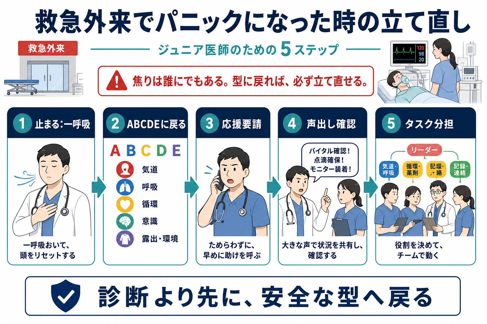
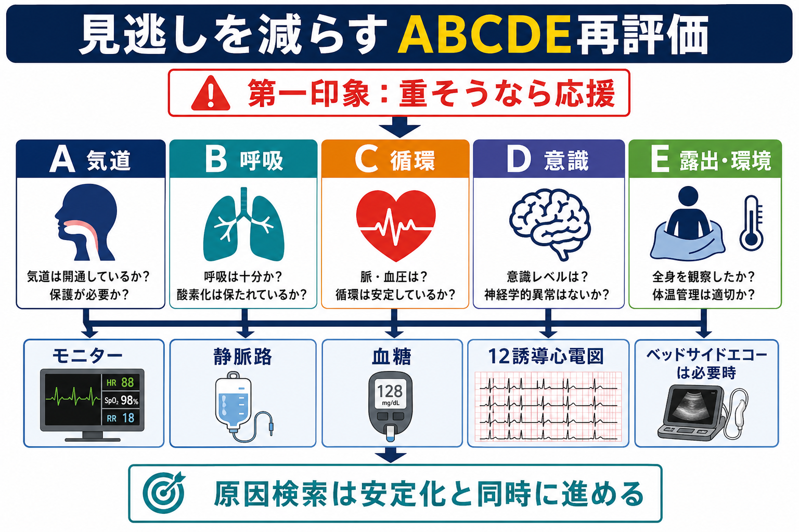
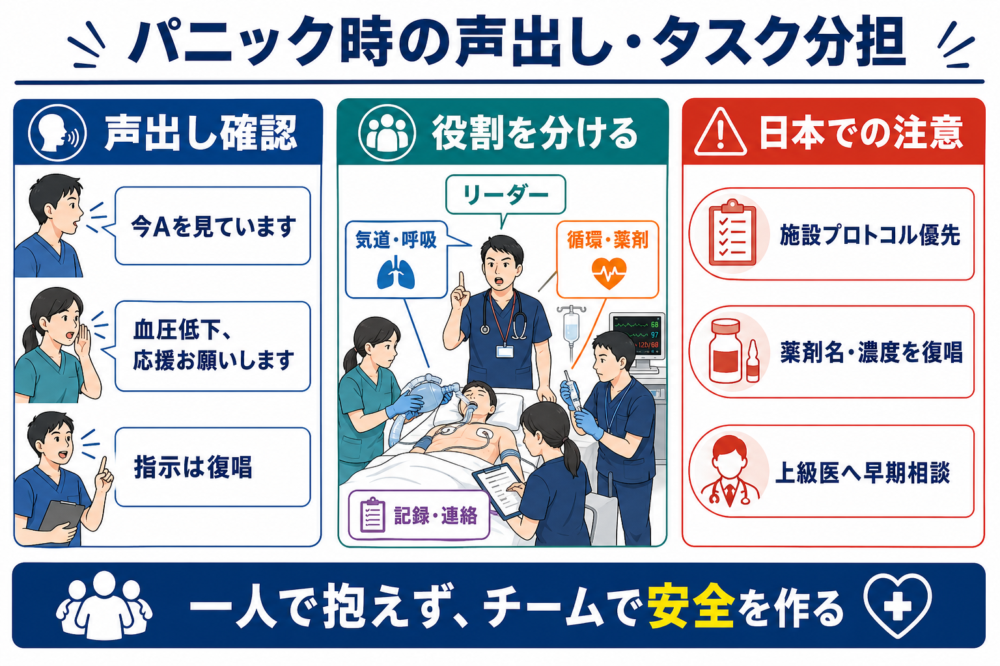

---
title: "研修医が救急外来でパニックになったときどう立て直すか"
description: "ABCDE、応援要請、声出し確認、タスク分担を使って、救急外来で焦ったときに安全な型へ戻るための実践メモ。"
aliases:
  - "救急外来でパニックになった時の立て直し"
tags:
  - 領域/救急・初期対応
  - 種類/クリニカルクエスチョン
  - 対象/研修医
question: "研修医が救急外来でパニックになったときどう立て直すか"
clinical_area: "救急・初期対応"
audience: "研修医"
evidence_level: "mixed"
created: "2026-04-27"
updated: "2026-04-27"
enableToc: true
---

# 研修医が救急外来でパニックになったときどう立て直すか

> このノートは研修医教育のための一般的整理であり、個別患者への診断・治療指示ではありません。緊急性が高い、判断に迷う、施設方針が関わる場合は、上級医・救急担当医・院内急変対応チームへ早期に相談してください。

## クリニカルクエスチョン

研修医が救急外来で「頭が真っ白になった」「何から手をつければよいかわからない」と感じたとき、患者安全を損なわずに対応を立て直すにはどうすればよいか。

## まず結論

- パニック時の目標は「診断を当てる」ではなく、まず**安全な型に戻る**ことである。
- 最初の一手は、数秒止まって「ABCDEに戻ります」と声に出し、患者の生命危機をA、B、C、D、Eの順に再評価する。ABCDEは重症患者への共通した初期評価・再評価の枠組みであり、治療反応を見ながら繰り返す[8]。
- 「重そう」「一人では無理」「判断が止まった」と感じた時点で、上級医、救急担当医、看護師、RRS/院内急変対応チームなどへ早期に応援を要請する。RRSは病状増悪を早期に察知し迅速対応する医療安全システムとして位置づけられる[2]。
- 声出し確認は、場を乱す行為ではなく安全行動である。TeamSTEPPSでは、call-out、check-back、SBARなどが医療チームの情報共有ツールとして整理されている[9]。
- タスクは「気道・呼吸」「循環・薬剤」「記録・連絡」「リーダー」に分け、指示は名前を呼んで出し、復唱で閉じる。
- 日本では、RRSの起動基準、救急カート薬剤、挿管・鎮静・昇圧薬の運用、DNARや治療制限の確認手順は施設差が大きい。迷ったら施設プロトコルと上級医判断を優先する。

## 判断の型

1. **止まる：一呼吸**  
   心の中ではなく、短く声に出す。「一度ABCDEに戻ります」「今、応援を呼びます」。数秒の停止は遅れではなく、認知負荷を下げるためのリセットである。
2. **ABCDEに戻る**  
   A：気道、B：呼吸、C：循環、D：意識・神経、E：露出・体温・全身観察の順に、生命危機を先に処理する。RCUKのABCDEアプローチも、生命を脅かす問題を次の評価へ進む前に治療し、治療後に再評価することを原則にしている[8]。
3. **応援要請を先延ばししない**  
   「自分で片付けてから呼ぶ」では遅い。意識障害、呼吸不全、ショック、けいれん、急速な出血、気道閉塞疑い、原因不明の急変では、上級医や急変対応チームを早期に呼ぶ[1][2]。
4. **声出し確認でチームの頭をそろえる**  
   「血圧80台、Cが崩れています」「酸素10 LでSpO2 88%です」「今から気道を見ます」のように、事実と次の行動を短く共有する。
5. **タスク分担する**  
   「佐藤さん、モニター装着と血圧再測定をお願いします」「田中先生、気道評価を一緒にお願いします」「鈴木さん、時系列記録をお願いします」のように、名前、行動、期限をセットで伝える。
6. **処置と反応を1セットにする**  
   酸素、輸液、体位、薬剤、除細動、検査などを行ったら、「何をしたか」「何分後にどう変化したか」を再評価する。NICE CG50も急性悪化の認識には生理学的観察値とtrack and trigger systemを用いた対応を推奨している[7]。

## 初期対応

- **安全確認:** 手袋、針刺し・暴力リスク、患者の転落、酸素・吸引・モニターの準備を確認する。
- **30秒の第一印象:** 話せるか、呼吸様式、皮膚色、冷汗、体位、意識、脈の触れ方を見る。重症感があれば、その場で応援を呼ぶ[8]。
- **ABCDEを声に出す:** 「Aは開通、Bは努力呼吸あり、Cは血圧低下、DはJCS II-10、Eで発疹なし」のように、短く共有する。
- **同時並行で頼む:** モニター、SpO2、血圧、12誘導心電図、静脈路、血糖、採血、血液ガス、尿量確認などは一人で抱え込まない。
- **SBARで上級医へ連絡:** S「救急外来で急変」、B「来院理由と既往」、A「ABCDEで何が崩れているか」、R「来てほしい、気道判断を一緒に、ICU/RRS相談をしたい」まで言う。SBARは電話や申し送りの構造化に使いやすく、患者安全アウトカム改善の報告はあるが、研究の質や異質性には限界がある[10]。
- **患者・家族への一言:** 「状態が急に悪くなったため、複数人で確認しながら対応しています」と説明し、不確実な診断名を断定しない。

## 鑑別・見逃し

| 優先度 | 見逃したくない状態 | その場で見ること | 立て直しの言葉 |
|---|---|---|---|
| 高 | 心停止・切迫心停止 | 反応、正常呼吸、脈、モニター | 「コード/RRSを呼びます。CPR準備」 |
| 高 | 気道閉塞・呼吸不全 | 発声、喘鳴、SpO2、呼吸数、努力呼吸 | 「A/Bが危ないです。気道と酸素を優先します」 |
| 高 | ショック | 血圧、脈拍、冷汗、末梢冷感、尿量、乳酸 | 「Cが崩れています。ルート、輸液、出血検索」 |
| 高 | 意識障害・けいれん・脳卒中 | GCS/JCS、瞳孔、血糖、神経巣症状 | 「Dを再評価します。血糖と神経所見を確認」 |
| 高 | アナフィラキシー・重症薬物反応 | 皮疹、喘鳴、血圧、曝露薬剤、食物、造影剤 | 「薬剤/造影剤を止め、応援を呼びます」 |
| 中 | 手技・薬剤・ライン関連トラブル | 投与薬、濃度、投与経路、ライン、酸素接続 | 「薬剤名・濃度・経路を復唱して確認します」 |

## 検査

| 検査・確認 | 目的 | パニック時の注意 |
|---|---|---|
| バイタル再測定 | 悪化速度と治療反応を把握する | 数値単発ではなく「前値からの変化」を共有する |
| モニター・12誘導心電図 | 致死性不整脈、虚血、頻脈・徐脈の評価 | 装着を頼み、判読は上級医と共有する |
| 血糖 | 可逆的な意識障害の確認 | D評価の早い段階で測る |
| 血液ガス・乳酸 | 呼吸不全、循環不全、代謝異常の把握 | 採血に集中しすぎてA/B/Cの再評価を止めない |
| 画像・エコー | 原因検索 | 安定化より検査継続を優先しない |
| 記録 | 時系列、処置、反応、連絡先を残す | 記録係を置き、後で記憶に頼らない |

## 治療・マネジメント

- **診断確定より安定化を優先する。** ABCDEで生命危機を処理しながら原因検索を進める[7][8]。
- **薬剤は「名前・濃度・量・経路・時刻」を復唱する。** 救急では焦りが薬剤名、濃度、投与経路の取り違えにつながる。厚生労働省は医療安全対策を推進しており、PMDAは医薬品・医療機器のヒヤリ・ハットや繰り返し報告される事例を医療安全情報として周知している[3][4][6]。
- **リーダー役は処置しすぎない。** 手が動く人が多いほど、誰が全体像を見るかが曖昧になる。自分がリーダー役なら、手技は依頼し、時刻、ABCDE、次の3分を見続ける。
- **声出しは短く、評価と行動を分ける。** 「血圧が下がっています」は評価、「ルートをもう1本お願いします」は行動。混ぜずに伝える。
- **日本での注意:** このCQは特定薬剤の用量を決める記事ではない。アドレナリン、鎮静薬、昇圧薬、抗けいれん薬、輸血などの適応・用量・禁忌・保険適用は、各疾患ガイドライン、PMDA添付文書検索、院内プロトコル、上級医判断に従う[5]。
- **急変後は短くデブリーフィングする。** RRS運用指針は、起動事例のデータ収集・分析とフィードバックを推奨している[2]。責める場ではなく、次回の応援要請、記録、役割分担を改善する場にする。

## 図解

## 指導医に確認するポイント

- この施設で研修医が救急外来から上級医を呼ぶ基準は何か。
- RRS、院内急変コール、救急カート、ICU相談の起動基準と電話番号はどこに掲示されているか。
- 研修医が単独で実施してよい処置・薬剤と、必ず上級医確認が必要な処置・薬剤は何か。
- 急変時のリーダー、記録係、家族対応、他科連絡は誰が担う運用か。
- DNAR、治療制限、代理意思決定者、転院搬送の判断は誰が最終確認するか。

## 患者説明

- 「今、呼吸・血圧・意識などを順番に確認し、危険な変化を見逃さないよう複数人で対応しています。」
- 「原因はまだ確認中ですが、まず命に関わる問題がないかを優先して見ています。」
- 「必要な処置を行いながら、上級医にも来てもらっています。」
- 「ご家族に確認したい既往、薬、アレルギー、普段の状態があれば教えてください。」

## ピットフォール

- **診断名探しに固着する:** まずABCDEで生命危機を安定化し、原因検索は同時並行にする。
- **応援要請を敗北と感じる:** 応援要請は安全行動であり、RRSも病状悪化を早期に察知し標準化して対応するためのシステムである[2]。
- **声が小さくなる:** 周囲が情報を共有できず、同じ確認や矛盾した指示が増える。短いcall-outで全員の認識をそろえる[9]。
- **指示が閉じない:** 「お願いします」で終わらず、復唱と完了報告を待つ。AHRQはcheck-backを、情報が正しく受け取られたことを確認する閉ループコミュニケーションとして説明している[9]。
- **薬剤へ飛びつく:** 薬剤名、濃度、経路、投与量、適応を復唱し、施設プロトコルと添付文書情報を確認する[4][5]。
- **記録が後回しになる:** 時刻、所見、処置、反応、連絡先、説明内容をその場で記録係に残してもらう。

## 関連ノート

- [[急変対応中に上級医へどう報告するか]]
- [[DNARがある患者の急変時に何を確認するか]]
- 関連ノート候補：救急外来でABCDE評価をどう進めるか
- 関連ノート候補：急変後のデブリーフィングをどう行うか

## MOC更新候補

- [[MOC｜救急・初期対応]]
- MOC・医療安全・法律・倫理.md（本サイト外）
- MOC・研修医の働き方・学習法.md（本サイト外）

## 参考文献

[1] 日本蘇生協議会. JRC蘇生ガイドライン2020. https://www.jrc-cpr.org/jrc-guideline-2020/

[2] 中村京太, 飯尾純一郎, 鹿瀬陽一, ほか. Rapid Response System運用指針. 日本集中治療医学会雑誌. 2025;32:2400002. https://doi.org/10.3918/jsicm.2400002

[3] 厚生労働省. 医療安全推進週間について. https://www.mhlw.go.jp/stf/seisakunitsuite/bunya/kenkou_iryou/iryou/iryouanzen2022.html

[4] 独立行政法人医薬品医療機器総合機構. PMDA医療安全情報、取り違えることによるリスクの高い医薬品に関する安全対策について. https://www.pmda.go.jp/safety/info-services/medical-safety-info/0013.html

[5] 独立行政法人医薬品医療機器総合機構. 医療用医薬品 情報検索. https://www.pmda.go.jp/PmdaSearch/iyakuSearch/

[6] PMDA. PMDA医療安全情報. https://www.pmda.go.jp/safety/info-services/medical-safety-info/0001.html

[7] National Institute for Health and Care Excellence. Acutely ill adults in hospital: recognising and responding to deterioration. Clinical guideline CG50. Published 25 July 2007. https://www.nice.org.uk/Guidance/CG50

[8] Resuscitation Council UK. The ABCDE Approach. Updated July 2024. https://www.resus.org.uk/library/abcde-approach

[9] Agency for Healthcare Research and Quality. TeamSTEPPS Tools and Pocket Guide. Content reviewed 2024. https://www.ahrq.gov/teamstepps-program/resources/modules/index.html

[10] Müller M, Jürgens J, Redaèlli M, et al. Impact of the communication and patient hand-off tool SBAR on patient safety: a systematic review. BMJ Open. 2018;8:e022202. https://doi.org/10.1136/bmjopen-2018-022202

## 更新ログ

- 2026-04-27: 初版作成。ABCDE、応援要請、声出し確認、タスク分担、RRS/TeamSTEPPS/PMDA医療安全情報を中心に整理。
