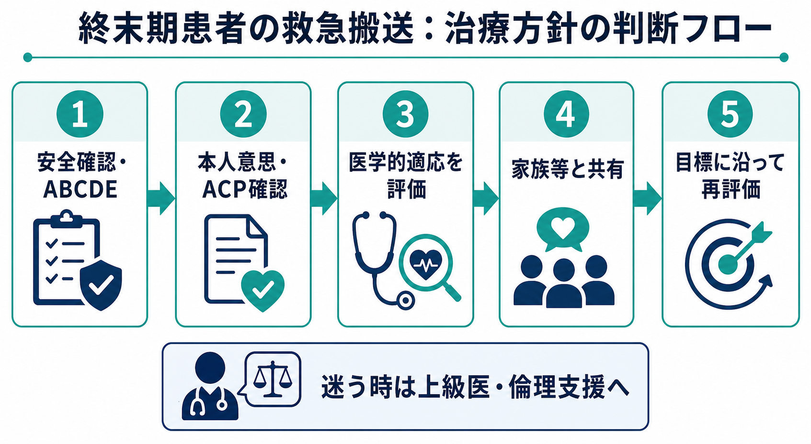
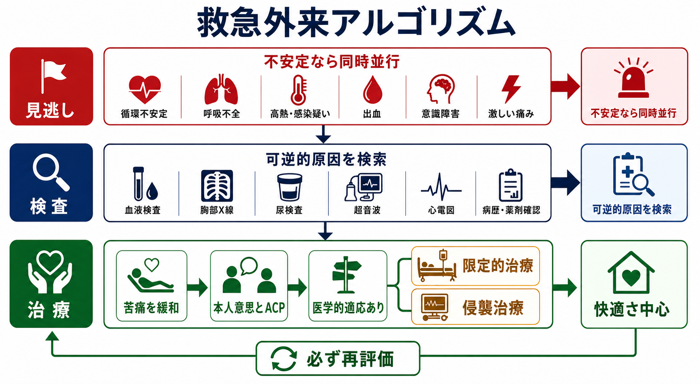
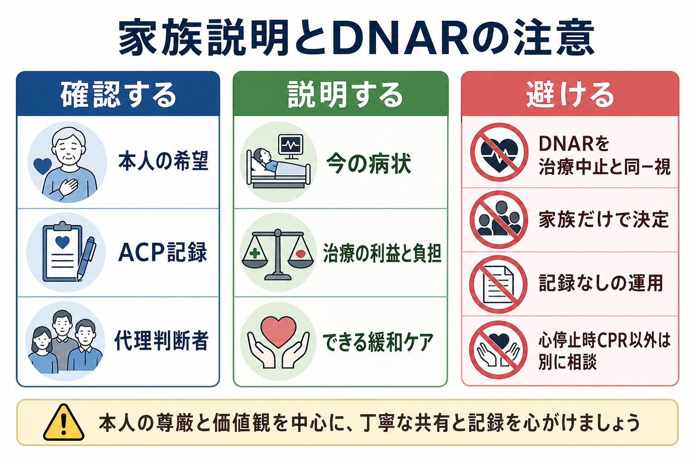

---
title: "終末期患者の救急搬送でどこまで治療するかどう考えるか"
description: "本人意思、ACP、医学的適応、家族等の理解を踏まえて、救急外来で治療目標と治療範囲を整理する。"
aliases:
  - "終末期救急搬送の治療方針"
tags:
  - 領域/救急・初期対応
  - 種類/クリニカルクエスチョン
  - 対象/研修医
question: "終末期患者の救急搬送でどこまで治療するかどう考えるか"
clinical_area: "救急・初期対応"
audience: "研修医"
evidence_level: "guideline"
created: "2026-04-27"
updated: "2026-04-27"
enableToc: true
---

# 終末期患者の救急搬送でどこまで治療するかどう考えるか

> このノートは研修医教育のための一般的整理であり、個別患者の診断・治療指示ではありません。緊急性が高い、判断に迷う、施設方針が関わる場合は上級医・専門科に相談してください。

## クリニカルクエスチョン

終末期患者が救急搬送されたとき、本人意思、ACP、医学的適応、家族等の理解を踏まえて、どこまで治療するかをどう考えるか。

## まず結論

- まずは「終末期だから何もしない」ではなく、ABCDEで苦痛と危険を評価し、可逆的な原因があるかを同時に見る。救急・集中治療領域の国内3学会提言も、救急現場の終末期対応では患者の尊厳と慎重な合意形成を重視している [3]。
- 治療方針は、本人の意思・価値観、ACPや事前指示、医学的妥当性、家族等の理解を分けて確認する。厚生労働省ガイドラインは、本人の意思決定を基本に、医療・ケアチームとの十分な話し合いで方針を決めることを求めている [1]。
- DNARは「心停止時にCPRを試みない」という指示であり、酸素、輸液、抗菌薬、鎮痛、鎮静、ICU入室などを一括して中止する指示ではない [4], [9]。
- 救急外来では「フルコードか看取りか」の二択ではなく、苦痛緩和、限定的治療、可逆的病態への治療、侵襲的生命維持治療を分けて提示する。
- 医学的に利益が見込めない介入は、患者・家族が希望してもそのまま実施義務があるわけではない。ただし、一方的に拒否せず、根拠、目標、代替の緩和ケアを説明し、上級医・倫理支援へつなぐ [8], [9]。
- 家族等は「決定者」ではなく、本人の意思を推定する重要な情報源として関わる。本人が意思表示できない場合は、ACP記録、かかりつけ医、施設職員、救急隊情報を早く集める [1], [7]。
- 方針は1回で固定しない。病状、反応、本人・家族等の理解が変われば、治療範囲を再評価して記録する [1], [9]。

## 判断の型

1. **今すぐの安全と苦痛を取る**  
   気道閉塞、低酸素、ショック、けいれん、激痛、せん妄、出血などは、治療方針の確認と同時に安定化・緩和を始める。終末期でも苦痛緩和と基本的ケアは継続する [1], [5]。
2. **本人意思を最優先で探す**  
   意識があり判断能力があるなら、本人に「何を大切にしたいか」「避けたい治療は何か」を短く確認する。意思は変わりうるため、過去のACP記録だけで現在の希望を上書きしない [1], [2]。
3. **医学的適応を分けて評価する**  
   CPR、挿管、人工呼吸、昇圧薬、透析、輸血、抗菌薬、輸液、酸素、鎮痛・鎮静を一括で扱わず、各介入の期待利益、負担、本人の目標との一致を考える。
4. **家族等には「本人ならどう考えるか」を聞く**  
   「ご家族はどうしたいですか」だけでは、家族に過剰な決定責任を負わせる。本人の言葉、生活歴、価値観、以前の医療への態度を尋ねる。
5. **合意した治療目標を記録し、再評価する**  
   例: 「可逆的な感染症は治療するが、心停止時CPRと挿管は行わない」「苦痛緩和を最優先し、ICU入室はしない」など、具体的に書く。

## 初期対応

- **ABCDEと苦痛評価**: 気道、呼吸、循環、意識、体温、痛み、呼吸困難、不穏を確認する。救命処置が本人意思と矛盾する可能性があっても、情報が不明で可逆性があり、医学的に適応がある場合は、短時間の安定化を行いながら情報収集する考え方が現実的である [7], [8]。
- **情報源を並行して集める**: ACP文書、DNAR指示書、施設サマリー、訪問診療指示書、緩和ケア計画、薬剤情報、救急隊記録、かかりつけ医連絡先を確認する。
- **本人に聞ける場合の最小セット**: 「今いちばんつらいこと」「避けたい治療」「入院・ICU・人工呼吸への希望」「大切な人に伝えてほしいこと」を短く確認する。
- **家族等への最初の共有**: 「まず苦痛を取ります」「同時に、本人が望んでいた医療と、医学的に役立つ治療を確認します」と説明する。
- **早めに呼ぶ人**: 上級医、救急責任医、主治医・訪問診療医、緩和ケア、集中治療、看護師長、医療ソーシャルワーカー、必要時は倫理支援。
- **退院・帰宅・施設帰所まで見越す**: 終末期ケアは救急外来内で完結しない。NICEは、本人が必要とし望むケアへ全ての場でアクセスできるよう、サービス提供と介護者支援を含めた体制整備を扱っている [10]。

## 鑑別・見逃し

| 優先度 | 疾患・状態 | 見逃さない理由 | 手がかり |
|---|---|---|---|
| 高 | 気道閉塞・窒息・誤嚥 | 苦痛が強く、短時間で死亡しうる。緩和目的でも吸引・体位・酸素などの介入余地がある。 | 喘鳴、湿性嗄声、チアノーゼ、食事中発症 |
| 高 | 敗血症・肺炎・尿路感染 | 終末期でも抗菌薬や輸液が目標に合う場合がある一方、負担が大きい場合もある。 | 発熱、低体温、頻呼吸、血圧低下、意識変容 |
| 高 | 急性冠症候群・致死的不整脈・心不全増悪 | 呼吸困難・胸痛の緩和、利尿、酸素、NPPVなど、目標に応じた選択が必要。 | 胸痛、冷汗、心電図変化、肺うっ血 |
| 高 | 脳卒中・けいれん・低血糖 | 可逆性や苦痛緩和の介入がある。意思確認不能の原因にもなる。 | 片麻痺、共同偏視、けいれん、血糖異常 |
| 中 | 薬剤性過鎮静・オピオイド過量 | 終末期症状と誤認しやすく、調整可能な場合がある。 | 新規増量、縮瞳、呼吸数低下、腎機能悪化 |
| 中 | 尿閉・便秘・疼痛・せん妄 | 生命維持治療の議論の前に、強い苦痛の原因として対応できる。 | 下腹部膨満、便秘、不穏、体動時痛 |
| 中 | 虐待・ネグレクト・搬送背景の不一致 | 「終末期」という説明で医療安全・権利擁護の問題を見逃す危険がある。 | 説明不一致、外傷、介護疲弊、受診遅れ |

## 検査

| 検査 | 目的 | 注意点 |
|---|---|---|
| バイタル・SpO2・血糖 | すぐ対応できる可逆的異常を拾う。 | 数値だけで治療強度を決めず、苦痛と本人目標を合わせて見る。 |
| 心電図 | 致死的不整脈、急性冠症候群、電解質異常の手がかり。 | 侵襲治療を望まない場合も、症状緩和や説明に役立つことがある。 |
| 血算・電解質・腎機能・肝機能・CRP | 感染、貧血、腎不全、薬剤蓄積などを評価する。 | 検査結果が治療方針を変えないなら採血の負担を考える。 |
| 血液ガス・乳酸 | 呼吸不全、循環不全、代謝性異常の重症度を見る。 | 挿管・ICUをしない方針でも、酸素・NPPV・緩和薬調整の参考になる。 |
| 胸部X線・超音波 | 肺炎、心不全、胸水、気胸、尿閉などを評価する。 | ベッドサイドで負担を抑えられる検査を優先する。 |
| CT | 脳卒中、出血、肺塞栓、腹部急症などの診断。 | 搬送・造影・待機の負担が本人目標に合うかを事前に考える。 |

## 治療・マネジメント

- **治療範囲を4層で考える**  
  1) 苦痛緩和と基本ケア、2) 可逆的原因への低侵襲治療、3) 入院・ICUを含む限定的生命維持治療、4) CPR・挿管・人工呼吸・透析・補助循環などの侵襲的生命維持治療、に分ける。
- **DNARを拡大解釈しない**  
  DNARは心停止時CPRの不開始に関する指示であり、その他の治療や看護を自動的に制限するものではない [4], [9]。
- **医学的適応が乏しい治療は、代替案とセットで説明する**  
  「挿管はしません」ではなく、「人工呼吸器で元の生活に戻る見込みは極めて低く、苦痛と負担が大きいと判断します。その代わり呼吸苦を和らげる酸素、体位、薬剤、そばにいる環境を整えます」と説明する。
- **緩和ケアは早く始める**  
  呼吸困難には体位調整、送風、酸素の適応評価、原因治療、薬物療法を組み合わせる。進行性疾患の呼吸困難では、病態と目標に応じてオピオイドを含む薬物療法が検討される [5]。
- **日本での注意**  
  オピオイド、鎮静薬、抗菌薬、輸液、NPPV、在宅酸素・在宅医療資源は、国内添付文書、保険適用、院内規定、麻薬管理、施設間連携に従う。モルヒネ注射剤は呼吸抑制など重大な副作用に注意し、投与量・投与経路は添付文書、緩和ケア専門家、院内プロトコルに沿って調整する [5], [6]。
- **始めた治療を見直してよい**  
  海外倫理指針では、治療を開始した後でも、反応や本人の目標が明らかになった時点で中止・差し控えを再検討できるとされる [8], [9]。日本でも、本人意思と医療・ケアチームの話し合い、医学的妥当性を踏まえて慎重に判断する [1]。
- **記録する内容**  
  本人の意思、判断能力、ACP文書の有無、家族等から得た本人価値観、医学的判断、合意した治療範囲、説明者・同席者、再評価時点を書く。

## 図解

## 指導医に確認するポイント

- この患者は医学的に「終末期」または生命維持治療の限界に近い状態といえるか。可逆的病態はどこまで評価済みか。
- 本人の判断能力は現在あるか。過去のACPやDNAR記録は、今の状況に適用できる内容か。
- CPR、挿管、人工呼吸、ICU、昇圧薬、透析、輸血、抗菌薬、輸液、酸素、鎮痛・鎮静をそれぞれどう扱うか。
- 家族等の発言は本人意思の推定か、家族自身の希望か。意見不一致がある場合、誰が調整するか。
- 院内のDNAR書式、倫理コンサルト、緩和ケア、在宅主治医連絡、死亡確認後の手続きはどう進めるか。

## 患者説明

- 「まず、息苦しさや痛みを和らげる対応をすぐに行います。」
- 「同時に、ご本人が大切にしてきたこと、以前に話していた希望、今の医学的な見通しを確認して、治療の範囲を一緒に整理します。」
- 「心臓が止まった時の心肺蘇生を行わない方針と、今できる治療や緩和ケアを行わないことは同じではありません。」
- 「人工呼吸器や心肺蘇生のような強い治療が、回復よりも苦痛を増やす可能性が高い場合があります。その場合も、苦しさを取る医療は続けます。」
- 「今決めた方針は、状態の変化や新しい情報に応じて見直します。」

## ピットフォール

- 「終末期」「DNAR」と聞いた瞬間に、ABCDE、鎮痛、呼吸困難緩和、可逆的原因検索を止めてしまう。
- DNARを「酸素も輸液も抗菌薬も入院も不要」という包括指示として扱う。
- 家族に「どうしますか」と丸投げし、本人の価値観を確認しない。
- ACP文書の存在だけで現在の本人意思を確認しない。意思は変わりうる [1]。
- 医学的適応が乏しい治療を「家族が希望したから」と無批判に開始する、または逆に一方的に拒否する。
- 「治療中止」と「苦痛緩和」を対立させて説明し、患者・家族に見捨てられ感を与える。
- 説明内容、合意した治療範囲、再評価予定を記録しない。

## 関連ノート

- [[救急外来で患者を診るときABCDE評価はどの順番で進めるか]]
- [[救急患者で上級医を呼ぶタイミングはどう判断するか]]
- [[救急外来で病歴聴取が難しい患者から何を聞くべきか]]

## MOC更新候補

- [[MOC｜救急・初期対応]]
- MOC｜医療安全・法律・倫理.md（本サイト外）
- MOC｜病棟管理・退院支援.md（本サイト外）

## 参考文献

[1] 厚生労働省. 人生の最終段階における医療・ケアの決定プロセスに関するガイドラインの改訂について. 2018. https://www.mhlw.go.jp/stf/houdou/0000197665.html

[2] 厚生労働省. 自分らしく生きるための「人生会議」ポータルサイト. 2026. https://www.mhlw.go.jp/acp-jinseikaigi/

[3] 日本救急医学会・日本集中治療医学会・日本循環器学会. 救急・集中治療における終末期医療に関するガイドライン ～3学会からの提言～. 2014. https://www.jaam.jp/info/2014/info-20141104_02.html

[4] 日本集中治療医学会. Do Not Attempt Resuscitation(DNAR)指示のあり方についての勧告. 2017. https://www.jsicm.org/news/news170316.html

[5] 日本緩和医療学会. 進行性疾患患者の呼吸困難の緩和に関する診療ガイドライン（2023年版）. 2023. https://www.jspm.ne.jp/publication/guidelines/individual.html?entry_id=1390

[6] 医薬品医療機器総合機構. モルヒネ塩酸塩注射液 医療用医薬品情報. https://www.pmda.go.jp/PmdaSearch/rdDetail/iyaku/8114401A3093_2?user=1

[7] American College of Emergency Physicians. Ethical Issues at the End of Life. 2020. https://www.acep.org/patient-care/policy-statements/ethical-issues-at-the-end-of-life

[8] American College of Emergency Physicians. Ethical Issues of Resuscitation. Revised 2021. https://www.acep.org/patient-care/policy-statements/ethical-issues-of-resuscitation/

[9] American Medical Association. Code of Medical Ethics Opinion 5.4: Orders Not to Attempt Resuscitation (DNAR). https://code-medical-ethics.ama-assn.org/ethics-opinions/orders-not-attempt-resuscitation-dnar

[10] National Institute for Health and Care Excellence. End of life care for adults: service delivery (NICE Guideline NG142). 2019. https://www.ncbi.nlm.nih.gov/books/NBK547815/

## 更新ログ

- 2026-04-27: 初版作成。
