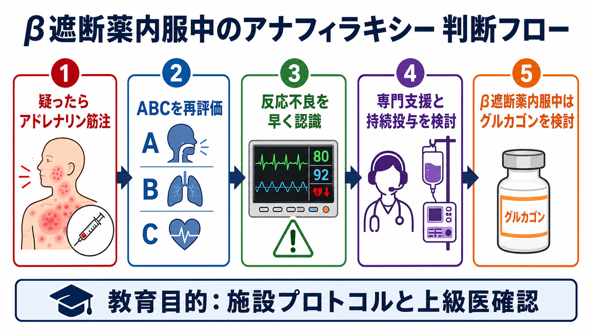
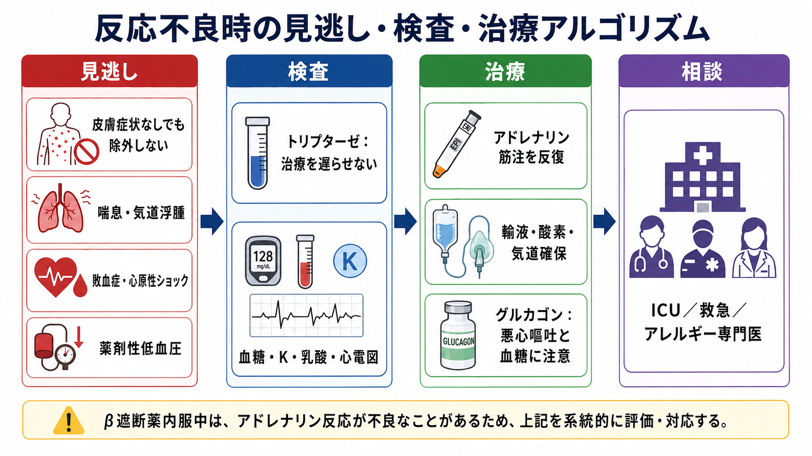
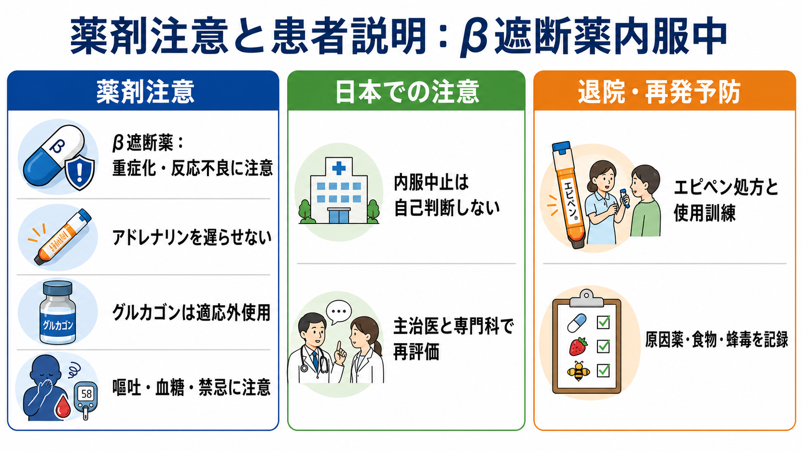

---
title: "β遮断薬内服中のアナフィラキシーでは何に注意するか"
description: "β遮断薬内服中のアナフィラキシーでは、アドレナリン反応不良を早く認識し、補助治療としてのグルカゴンを施設方針と上級医判断で検討する。"
aliases:
  - "β遮断薬とアナフィラキシー"
tags:
  - 領域/救急・初期対応
  - 種類/クリニカルクエスチョン
  - 対象/研修医
question: "β遮断薬内服中のアナフィラキシーでは何に注意するか"
clinical_area: "救急・初期対応"
audience: "研修医"
evidence_level: "mixed"
created: "2026-04-27"
updated: "2026-04-27"
enableToc: true
---

# β遮断薬内服中のアナフィラキシーでは何に注意するか

> このノートは研修医教育のための一般的整理であり、個別患者の診断・治療指示ではありません。緊急性が高い、判断に迷う、施設方針が関わる場合は上級医・専門科に相談してください。

## クリニカルクエスチョン

β遮断薬内服中の患者がアナフィラキシーを起こしたとき、通常対応と比べて何に注意し、アドレナリン反応不良やグルカゴン使用をどう考えるか。

## まず結論

- β遮断薬内服中でも、アナフィラキシーを疑ったら最優先はアドレナリン筋注であり、抗ヒスタミン薬やステロイドを待って遅らせない[1,3,4]。
- β遮断薬は、頻脈を目立ちにくくし、気管支拡張・心拍出増加などのβ作用を弱め、アドレナリンへの反応不良や重症化と関連する可能性がある[2,7,8]。
- 2回の適切なアドレナリン筋注、体位、酸素、輸液後も気道・呼吸・循環が不安定なら「反応不良」と考え、救急・集中治療・麻酔科などの支援を早く呼ぶ[3,4]。
- β遮断薬内服中の反応不良例では、グルカゴンがβ受容体を介さず心収縮・心拍を支える補助薬として国際的に検討される。ただし根拠は主に症例報告・ガイドライン推奨で強くはない[3,6,9]。
- 日本での注意として、グルカゴンGノボの添付文書上の効能・効果に「アナフィラキシー」は含まれない。使用する場合は適応外使用として、禁忌、嘔吐、血糖変動、カリウム変動、施設プロトコルを確認する[5]。
- β遮断薬を自己判断で中止させない。退院後は原因検索、再発予防、エピペン適応、β遮断薬継続のリスク・ベネフィットを主治医、循環器、アレルギー専門医で再評価する[8]。

## 判断の型

1. **まずアナフィラキシーとして扱う。** 皮膚症状が乏しくても、急な気道・呼吸・循環障害があれば除外しない[1,3]。
2. **内服薬を確認する。** β遮断薬、ACE阻害薬、抗凝固薬、降圧薬、喘息治療薬を確認する。点眼β遮断薬も見落とさない。
3. **アドレナリン反応を時間で見る。** 筋注後の呼吸、血圧、意識、SpO2、喘鳴、皮膚所見を再評価し、改善が乏しければ反復投与と支援要請を早める[3,4]。
4. **反応不良なら「投与不足・別疾患・β遮断薬影響」を同時に考える。** 筋注部位、投与量、静脈路、輸液量、気道浮腫、気管支喘息、心原性ショック、敗血症、薬剤性低血圧を点検する。
5. **グルカゴンは補助薬として位置づける。** アドレナリンの代替ではなく、β遮断薬内服中でアドレナリン反応不良の循環不全が続くときに、上級医判断で検討する[3,6,9]。

## 初期対応

- **ABCDEを声に出して再評価する。** 気道浮腫、嗄声、喘鳴、低酸素、ショック、意識障害があれば重症として扱う。
- **アドレナリン筋注を遅らせない。** 成人では大腿前外側への筋注を基本にし、改善が不十分なら反復を検討する[1,3,4]。
- **体位、酸素、モニター、静脈路、輸液を同時に進める。** 仰臥位または下肢挙上を基本にし、呼吸苦や嘔吐が強い場合は安全な体位を選ぶ。
- **β遮断薬内服中は頻脈が乏しいことがある。** 「頻脈がないからショックではない」と判断しない。
- **2回のアドレナリン筋注でもABCが安定しない場合は早く応援を呼ぶ。** IVアドレナリン持続投与、昇圧薬、気道確保、ICU管理は経験者・施設プロトコル下で行う[4]。

## 鑑別・見逃し

| 優先度 | 疾患・状態 | 見逃さない理由 | 手がかり |
|---|---|---|---|
| 高 | 気道浮腫・喉頭浮腫 | 急速に挿管困難化する | 嗄声、吸気性喘鳴、流涎、会話困難 |
| 高 | 重症気管支攣縮・喘息合併 | β遮断薬で気管支拡張反応が悪いことがある | 喘鳴、呼気延長、SpO2低下、既往 |
| 高 | アドレナリン反応不良のアナフィラキシー | 循環虚脱が進行する | 筋注後も低血圧、意識障害、冷汗 |
| 高 | 心原性ショック・急性冠症候群 | アドレナリンやアナフィラキシーと症状が重なる | 胸痛、心電図変化、肺水腫、心疾患 |
| 中 | 敗血症・出血性ショック | アレルギー所見が乏しいと誤る | 発熱、感染巣、出血、乳酸上昇 |
| 中 | 薬剤性低血圧・迷走神経反射 | 徐脈・低血圧が目立つ | 処置直後、蒼白、徐脈、皮膚粘膜症状なし |

## 検査

| 検査 | 目的 | 注意点 |
|---|---|---|
| 血糖 | グルカゴン使用時、意識障害、低血糖鑑別 | グルカゴンは血糖変動を起こし得るため経時的に見る[5] |
| 電解質・血液ガス・乳酸 | ショック、代謝性アシドーシス、K変動の把握 | 治療を待たせる検査にしない |
| 心電図・心筋逸脱酵素 | 心疾患、アドレナリン副作用、β遮断薬背景の確認 | 胸痛、虚血性心疾患、高齢者では特に確認 |
| トリプターゼ | アナフィラキシー診断補助、後日の専門評価 | 採血しても急性期治療は遅らせない。急性期とベースライン比較が有用[8] |
| 原因候補の記録 | 再発予防、紹介時の情報整理 | 食物、薬剤、造影剤、蜂毒、運動、NSAIDs、感染を時系列で残す |

## 治療・マネジメント

- **アドレナリンが第一選択。** β遮断薬内服中でも「効きにくいかもしれない」ことを理由に投与を遅らせない[1,3,4]。
- **非選択性β遮断薬では特に注意する。** PMDA添付文書では、非選択性β遮断薬との併用で相互の効果減弱、血圧上昇、徐脈が起こり得るとされる[2]。
- **反応不良ではアドレナリン持続投与と輸液を考える。** 反復筋注のみで粘りすぎず、経験者のもとで静注薬管理に移る準備をする[4]。
- **グルカゴンは「β遮断薬内服中の反応不良例」の補助選択肢。** 成人では国際資料で1-5 mgを5分程度で静注し、その後5-15 μg/分の持続投与を考慮する記載があるが、施設プロトコルと上級医判断を優先する[6,9]。
- **グルカゴン使用時の注意。** 嘔気・嘔吐、血糖上昇後の低血糖、高血糖、カリウム変動、アナフィラキシー、血圧変動に注意する。褐色細胞腫またはパラガングリオーマの患者・疑いでは禁忌である[5]。
- **日本での注意。** グルカゴンGノボの効能・効果は、消化管検査前処置、低血糖時の救急処置、成長ホルモン分泌機能検査、肝型糖原病検査、胃内視鏡的治療前処置であり、アナフィラキシー治療は添付文書上の効能・効果ではない[5]。
- **抗ヒスタミン薬・ステロイドは補助。** 皮膚症状や遷延症状への補助であり、気道・呼吸・循環障害を改善する主治療として扱わない[3,4]。
- **退院時は再発予防までセット。** 原因候補、救急受診基準、エピペン適応、使用訓練、β遮断薬継続の再評価、専門外来紹介を確認する[1,8]。

## 図解

## 指導医に確認するポイント

- アドレナリン筋注の投与量、投与間隔、反復回数は適切か。
- 反応不良として、救急・ICU・麻酔科・アレルギー専門医へ応援要請する段階か。
- IVアドレナリン持続投与、追加昇圧薬、気道確保を誰が管理するか。
- β遮断薬の種類は非選択性か、心不全・虚血性心疾患など中止リスクが高い背景はあるか。
- グルカゴンを使う場合、施設内の適応外使用手順、禁忌、調製、投与経路、モニタリング、制吐薬、血糖・K確認をどうするか。
- 退院後のエピペン処方、原因検索、β遮断薬継続可否の相談先をどう設定するか。

## 患者説明

- 「今回の反応は、急に血圧や呼吸が悪くなるアレルギー反応として扱います。まずアドレナリンを早く使うことが重要です。」
- 「β遮断薬を飲んでいると、アドレナリンの効き方が弱く見えたり、脈拍の変化が分かりにくいことがあります。」
- 「必要時には追加の薬を使うことがありますが、施設の手順に沿って血糖や吐き気などを確認しながら行います。」
- 「β遮断薬は心臓の病気で大切な薬のことがあるため、自己判断で中止せず、主治医と専門医で今後の方針を相談します。」

## ピットフォール

- β遮断薬内服中の「頻脈がないショック」を軽く見る。
- アドレナリン反応不良を恐れて、最初のアドレナリン筋注まで遅らせる。
- 皮膚症状がないためアナフィラキシーを除外する。
- 反応不良例で、筋注反復だけで時間を使い、IVアドレナリン持続投与や気道確保の支援要請が遅れる。
- グルカゴンをアドレナリンの代替薬として扱う。
- グルカゴンの嘔吐、血糖変動、禁忌、適応外使用の確認を忘れる。
- 退院時に原因検索、エピペン訓練、β遮断薬継続可否の再評価をつなげない。

## 関連ノート

- 関連ノート候補: アナフィラキシーの初期対応
- 関連ノート候補: アドレナリン筋注の使い方
- 関連ノート候補: エピペン処方と患者指導
- 関連ノート候補: 造影剤アレルギーの対応
- 関連ノート候補: 蜂刺傷とアナフィラキシー

## MOC更新候補

- [[MOC｜救急・初期対応]]
- MOC｜薬剤・処方・副作用.md（本サイト外）
- MOC｜膠原病・免疫・アレルギー.md（本サイト外）

## 参考文献

[1] 日本アレルギー学会Anaphylaxis対策委員会. アナフィラキシーガイドライン2022. 2022/2023. https://www.jsaweb.jp/uploads/files/Web_AnaGL_2023_0301.pdf

[2] PMDA. アドレナリン注0.1%シリンジ「テルモ」添付文書. 2026年3月改訂. https://www.pmda.go.jp/PmdaSearch/iyakuDetail/470034_2451402G1040_1_06

[3] Cardona V, Ansotegui IJ, Ebisawa M, et al. World Allergy Organization anaphylaxis guidance 2020. World Allergy Organization Journal. 2020;13(10):100472. https://doi.org/10.1016/j.waojou.2020.100472

[4] Resuscitation Council UK. Emergency treatment of anaphylaxis: Guidelines for healthcare providers. May 2021. https://www.resus.org.uk/library/additional-guidance/guidance-anaphylaxis/emergency-treatment

[5] PMDA. グルカゴンGノボ注射用1mg（添付溶解液あり）添付文書. 2023年11月改訂. https://www.pmda.go.jp/PmdaSearch/iyakuDetail/620023_7229402D1036_1_09

[6] Boyce JA, Assa'ad A, Burks AW, et al. Guidelines for the Diagnosis and Management of Food Allergy in the United States: Report of the NIAID-Sponsored Expert Panel. Journal of Allergy and Clinical Immunology. 2010;126(6 Suppl):S1-S58. https://doi.org/10.1016/j.jaci.2010.10.007

[7] Tejedor-Alonso MA, Farias-Aquino E, Pérez-Fernández E, et al. Relationship Between Anaphylaxis and Use of Beta-Blockers and Angiotensin-Converting Enzyme Inhibitors: A Systematic Review and Meta-Analysis of Observational Studies. Journal of Allergy and Clinical Immunology: In Practice. 2019;7(3):879-897.e5. https://doi.org/10.1016/j.jaip.2018.10.042

[8] Golden DBK, Wang J, Waserman S, et al. Anaphylaxis: A 2023 practice parameter update. Annals of Allergy, Asthma & Immunology. 2024;132(2):124-176. https://doi.org/10.1016/j.anai.2023.09.015

[9] Pouessel G, Turner PJ, Worm M, et al. Management of Refractory Anaphylaxis: An Overview of Current Guidelines. Clinical and Experimental Allergy. 2024. https://pmc.ncbi.nlm.nih.gov/articles/PMC11439156/

## 更新ログ

- 2026-04-27: 初版作成。
