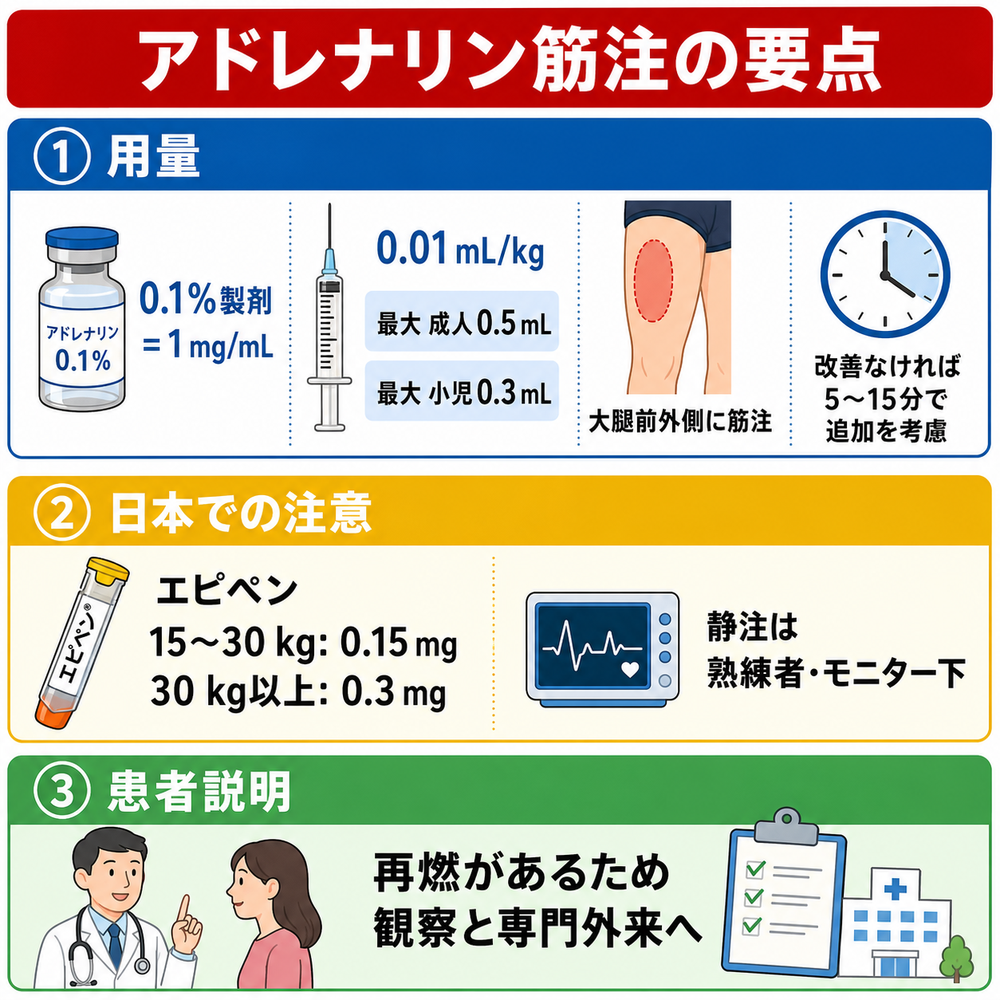
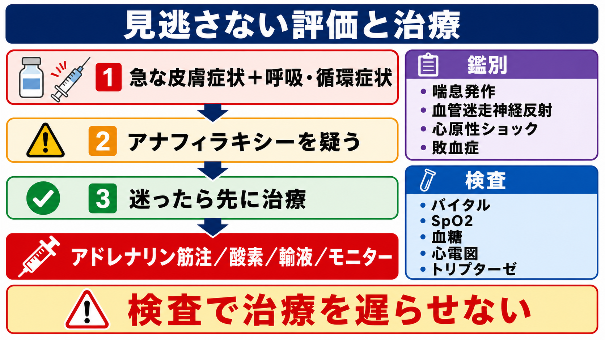
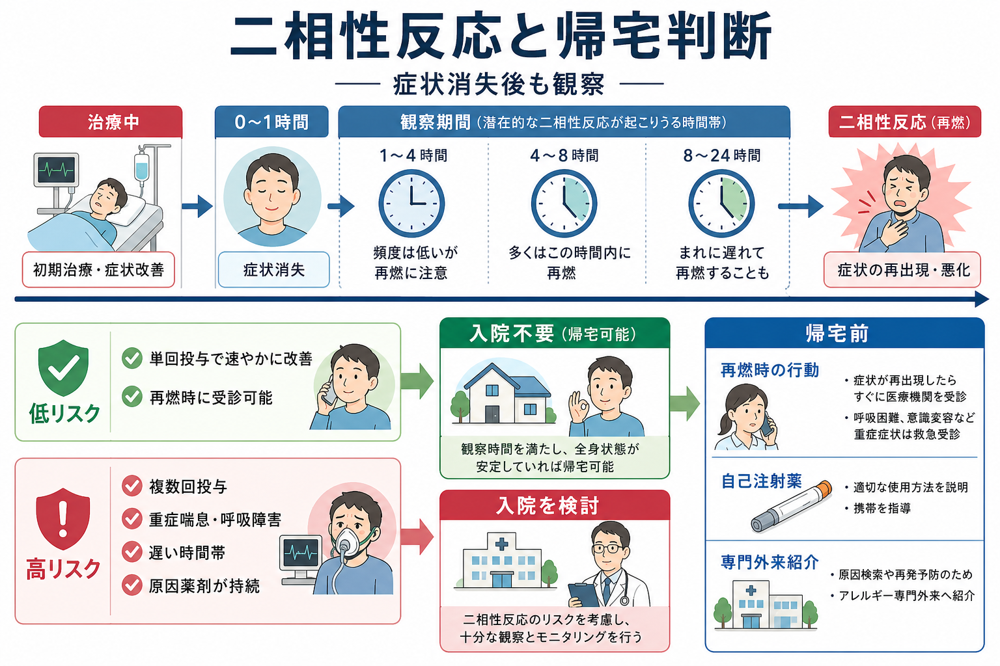

---
title: "アナフィラキシーでアドレナリン筋注後は何を観察するか"
description: "アドレナリン筋注後の再投与、酸素、輸液、二相性反応、入院・帰宅判断を整理する。"
aliases:
  - "アナフィラキシー筋注後観察"
tags:
  - 領域/救急・初期対応
  - 種類/クリニカルクエスチョン
  - 対象/研修医
question: "アナフィラキシーでアドレナリン筋注後は何を観察するか"
clinical_area: "救急・初期対応"
audience: "研修医"
evidence_level: "guideline"
created: "2026-04-27"
updated: "2026-04-27"
enableToc: true
---

# アナフィラキシーでアドレナリン筋注後は何を観察するか

> このノートは研修医教育のための一般的整理であり、個別患者の診断・治療指示ではありません。緊急性が高い、判断に迷う、施設方針が関わる場合は上級医・専門科に相談してください。

## クリニカルクエスチョン

アナフィラキシーでアドレナリンを筋注した後、再投与、酸素、輸液、二相性反応、入院・帰宅判断のために何を観察するか。

## まず結論

- 筋注後は「効いたか」ではなく、**気道・呼吸・循環・意識・皮膚消化器症状が進行していないか**を数分単位で見直す。アドレナリン筋注は初期治療の第一選択であり、呼吸・循環症状が続くなら追加投与を遅らせない。[1], [2]
- 改善が不十分、または悪化する場合は、一般に5分前後でアドレナリン筋注の再投与を検討し、酸素、静脈路、急速輸液、気道確保準備、応援要請を同時に進める。[2], [3]
- SpO2低下、喘鳴、嗄声、咽頭違和感、舌・口唇腫脹、低血圧、失神、冷汗、意識変容は「観察して待つ」所見ではなく、再評価と上級医・救急集中治療チームへの相談対象である。[1], [2]
- 抗ヒスタミン薬は皮膚症状の補助、ステロイドは喘息合併や遷延する症状への補助として位置づけ、呼吸・循環症状へのアドレナリン再投与や輸液を置き換えない。ステロイドで二相性反応を確実に防げるとは考えない。[2], [4]
- 症状が消えても二相性反応を観察する。観察時間は一律ではなく、単回投与で速やかに完全改善した低リスク例と、複数回投与、重症喘息・呼吸障害、循環不安定、原因薬剤の持続吸収、夜間・遠方などの高リスク例で分ける。[2], [5]

## 判断の型

1. **0-5分でABCDEを再評価する。** 気道音、嗄声、喘鳴、SpO2、呼吸仕事量、血圧、脈拍、末梢冷感、意識、蕁麻疹・血管性浮腫、嘔吐・腹痛を見直す。[1], [2]
2. **改善不十分なら治療を足す。** アドレナリン筋注の再投与、酸素、高流量酸素、静脈路確保、晶質液ボーラス、β2刺激薬吸入、気道確保準備を、所見に合わせて並行して行う。[2], [3]
3. **安定化後に記録と原因評価へ移る。** 発症時刻、曝露状況、投与時刻、反応、再燃、トリプターゼ採血の適応、帰宅前説明、専門外来紹介を確認する。[5], [6]

## 初期対応

- **応援要請とモニター**: アナフィラキシーは急速に致死的になりうるため、筋注後も医師・看護師・救急カート・気道確保可能な体制を早めに呼ぶ。[1], [2]
- **体位**: 基本は臥位で下肢挙上を考える。呼吸困難が強い場合は座位を許容するが、急な起立・歩行は循環虚脱を悪化させうるため避ける。[5]
- **酸素**: 呼吸困難、低酸素、再投与を要する例、循環不安定例では高濃度酸素を開始する。[2]
- **輸液**: 低血圧、失神、末梢冷感、遷延する頻脈など循環不安定があれば、太い静脈路を確保し晶質液を投与する。WAOは循環不安定例で20 mL/kgの晶質液ボーラスを挙げている。[2]
- **アドレナリン再投与**: 呼吸・循環症状が残る、または進行する場合は、筋注再投与を遅らせない。RCUKは症状が解決しない場合、5分後の反復筋注を強調している。[3], [4]
- **気道**: 嗄声、吸気性喘鳴、舌・咽頭腫脹、唾液貯留、会話困難は気道閉塞の前段階として扱い、早期に上級医・麻酔科・救急集中治療に相談する。[1], [2]

## 鑑別・見逃し

| 優先度 | 疾患・状態 | 見逃さない理由 | 手がかり |
|---|---|---|---|
| 高 | 進行するアナフィラキシー | 皮膚症状が目立たなくても気道・呼吸・循環が破綻しうる。[1], [2] | 嗄声、喘鳴、SpO2低下、低血圧、失神、冷汗、意識変容 |
| 高 | 気管支喘息発作の合併 | β2刺激薬だけではアナフィラキシーの循環・粘膜浮腫を治療できない。[2] | 既往、広範な喘鳴、呼気延長、PEF低下 |
| 高 | 血管性浮腫・上気道浮腫 | 遅れて挿管困難になる可能性がある。[1], [2] | 舌・口唇・咽頭腫脹、嗄声、嚥下困難 |
| 中 | 血管迷走神経反射 | アドレナリン適応の判断を迷わせる。 | 徐脈、蒼白、臥位で速やかに改善、皮疹や喘鳴に乏しい |
| 中 | 敗血症・心原性ショック・出血性ショック | 低血圧の別原因。アドレナリンだけで説明しない。 | 発熱、感染巣、胸痛、出血、心電図異常 |
| 中 | 薬剤副作用・過量投与 | アドレナリン後の頻脈・振戦・高血圧と病勢悪化を区別する。 | 投与量、投与経路、胸痛、不整脈、血圧異常上昇 |

## 検査

| 検査 | 目的 | 注意点 |
|---|---|---|
| バイタル・SpO2・心電図モニター | 再投与、酸素、輸液、気道介入の判断 | 検査ではなく観察そのもの。筋注後も数分単位で反復する。[2] |
| 血糖 | 意識障害、振戦、糖尿病、アドレナリン後の高血糖評価 | 低血糖や薬剤影響を見落とさない。 |
| 動脈血または静脈血ガス、乳酸 | 低酸素、ショック、代謝性アシドーシスの評価 | 重症例・遷延例で有用。採血で治療を遅らせない。 |
| 血清トリプターゼ | 肥満細胞活性化の後方確認、専門外来での原因評価 | NICEは成人・16歳以上で治療開始後できるだけ早く、発症1-2時間を理想に4時間以内の2本目を推奨する。小児では薬剤・蜂毒・特発性が疑われる場合などに考慮する。[5] |
| 原因検索用の記録 | 再発予防と専門外来紹介 | 食物、薬剤、造影剤、ラテックス、蜂毒、運動、NSAIDs、飲酒、感染などの曝露時刻を残す。[1], [5] |

## 治療・マネジメント

- **アドレナリン筋注**: 0.1%製剤は1 mg/mLで、国際的には0.01 mg/kg、成人最大0.5 mgを大腿前外側に筋注する考え方が広く使われる。[2] 日本のエピペン添付文書は0.15 mgまたは0.3 mg製剤を体重に応じて筋注する補助治療薬として記載している。[7]
- **日本での注意**: PMDAのエピペン添付文書では、エピペンは医療機関での治療に代わるものではなく、使用後は必ず医療機関を受診するよう指導するとされている。[7] また、アドレナリン注0.1%シリンジは急性低血圧・ショック時の補助治療などの効能で、過量投与、不整脈、血圧異常上昇、相互作用に注意する。[8]
- **静注アドレナリン**: 初期対応としての静注ボーラスは原則避ける。難治例で必要な場合は、モニター下で希釈・持続投与に習熟した医師が扱う領域として上級医に相談する。[1], [2]
- **酸素・輸液**: 呼吸困難や低酸素、再投与例では高濃度酸素を使い、循環不安定では晶質液を投与する。アドレナリンだけで待たない。[2]
- **β2刺激薬吸入**: 気管支攣縮の補助には使えるが、アナフィラキシーの根幹治療ではなく、呼吸・循環症状が続くならアドレナリン再投与を優先する。[2]
- **抗ヒスタミン薬**: 蕁麻疹・掻痒など皮膚症状の補助に限定して考える。呼吸・循環症状を治療しないため、初期対応を遅らせる使い方は避ける。[4]
- **ステロイド**: 急性期の効果発現は遅く、二相性反応予防の確実な根拠は乏しい。喘息合併や遷延症状など、上級医と適応を確認して補助的に使う。[4]
- **観察時間と帰宅判断**: NICEは成人・16歳以上で6-12時間観察を基本とし、速やかに制御された例では短縮を考慮しうるとしている。[5] RCUKはリスク層別化を行い、単回投与で30分以内に良好反応し、完全改善、自己注射薬・教育・同伴者などが整う低リスク例では短めの観察、複数回投与や重症喘息・呼吸障害、遅い時間帯、原因物質の持続吸収、遠方居住などでは長めの観察・入院を検討する。[3], [4]

## 図解

## 指導医に確認するポイント

- 5分前後の再評価で、アドレナリン筋注を再投与する所見が残っていないか。
- 気道浮腫、喘鳴、低酸素、低血圧、意識変容があり、麻酔科・救急集中治療・小児科などを呼ぶべき段階ではないか。
- 観察時間を短縮できる低リスク例か、複数回投与・重症喘息・遷延する呼吸循環症状・原因薬剤の持続などで入院観察が必要な例か。
- エピペン処方、使用指導、2本携帯の説明、専門外来紹介、職場・学校・保育所での対応書類が必要か。
- トリプターゼ採血や薬剤・造影剤アレルギー記録を、施設の手順に沿って残せているか。

## 患者説明

- 「一度よくなっても、数時間後に症状が戻ることがあります。呼吸苦、声のかすれ、ふらつき、じんましんの拡大、嘔吐などが戻るかを観察します。」
- 「自己注射薬を使った場合も、治療が終わったという意味ではありません。必ず医療機関で診察と観察を受けてください。」[7]
- 「帰宅できる場合でも、再燃時の受診方法、自己注射薬の使い方、原因を避ける方法、専門外来での確認を一緒に整理します。」[5], [7]
- 「次回の予防のため、食べたもの、使った薬、運動、飲酒、虫刺され、発症時刻をできるだけ記録してください。」

## ピットフォール

- 皮膚症状が軽い、または消えたことを理由にアナフィラキシーを否定する。
- 抗ヒスタミン薬やステロイド投与で安心し、アドレナリン再投与、酸素、輸液、気道準備を遅らせる。
- 筋注後の頻脈や振戦だけを副作用と決めつけ、低血圧・低酸素・上気道浮腫の進行を見落とす。
- 「症状消失=すぐ帰宅可」と考え、二相性反応、自己注射薬、同伴者、帰宅後アクセス、専門外来紹介を確認しない。
- 日本のエピペンは補助治療薬であり、使用後受診が前提である点を患者・家族へ説明し忘れる。[7]
- 保育所・学校・職場での対応が必要な患者で、生活管理指導表や緊急時対応票の確認につなげない。[9]

## 関連ノート

- 関連ノート候補: [[MOC｜アナフィラキシー]]
- 関連ノート候補: アナフィラキシーの初期診断とアドレナリン筋注
- 関連ノート候補: エピペン使用後の患者説明
- 関連ノート候補: 造影剤アレルギー後の記録と再投与判断

## MOC更新候補

- [[MOC｜救急・初期対応]]
- MOC｜アレルギー.md（本サイト外）
- [[MOC｜アナフィラキシー]] 配下のカテゴリ索引がある場合は、本記事を「初期対応」「帰宅判断」「患者説明」に追加する。

## 参考文献

[1] 日本アレルギー学会Anaphylaxis対策委員会. アナフィラキシーガイドライン2022. 2022, 2023年3月1日修正版. https://www.jsaweb.jp/uploads/files/Web_AnaGL_2023_0301.pdf

[2] Cardona V, Ansotegui IJ, Ebisawa M, et al. World Allergy Organization Anaphylaxis Guidance 2020. World Allergy Organization Journal. 2020;13(10):100472. https://doi.org/10.1016/j.waojou.2020.100472

[3] Resuscitation Council UK. Emergency treatment of anaphylaxis: Guidelines for healthcare providers. 2021. https://www.resus.org.uk/library/additional-guidance/guidance-anaphylaxis/emergency-treatment

[4] Dodd A, Hughes A, Sargant N, Whyte AF, Soar J, Turner PJ. Evidence update for the treatment of anaphylaxis. Resuscitation. 2021;163:86-96. https://doi.org/10.1016/j.resuscitation.2021.04.010

[5] National Institute for Health and Care Excellence. Anaphylaxis: assessment and referral after emergency treatment. NICE Clinical guideline CG134. Last updated 2020. https://www.nice.org.uk/guidance/cg134

[6] Golden DBK, Wang J, Waserman S, et al. Anaphylaxis: A 2023 practice parameter update. Annals of Allergy, Asthma & Immunology. 2024;132(2):124-176. https://doi.org/10.1016/j.anai.2023.09.015

[7] 医薬品医療機器総合機構. エピペン注射液0.15mg／エピペン注射液0.3mg 添付文書. 2026年3月改訂. https://www.pmda.go.jp/PmdaSearch/iyakuDetail/671450_2451402G2020_4_07

[8] 医薬品医療機器総合機構. アドレナリン注0.1%シリンジ「テルモ」 添付文書. 2026年3月改訂. https://www.pmda.go.jp/PmdaSearch/iyakuDetail/470034_2451402G1040_1_06

[9] 厚生労働省. 保育所におけるアレルギー対応ガイドライン（2019年改訂版）. https://www.mhlw.go.jp/content/11907000/000476878.pdf

## 更新ログ

- 2026-04-27: 初版作成。
