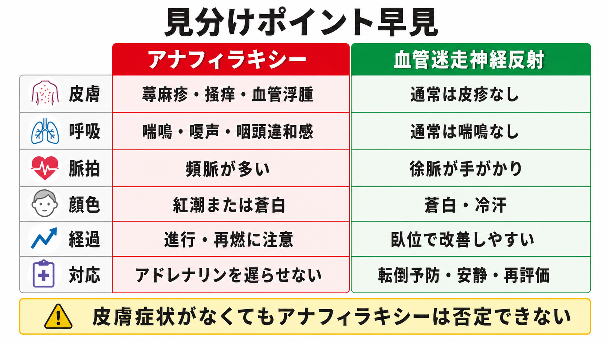

---
title: "アナフィラキシーと血管迷走神経反射をどう見分けるか"
description: "曝露後の急変で、皮膚・呼吸・循環症状、徐脈、顔面蒼白、臥位での改善を比較し、アナフィラキシーの誤診を避ける。"
aliases:
  - "アナフィラキシーと迷走神経反射"
tags:
  - 領域/救急・初期対応
  - 種類/クリニカルクエスチョン
  - 対象/研修医
question: "アナフィラキシーと血管迷走神経反射をどう見分けるか"
clinical_area: "救急・初期対応"
audience: "研修医"
evidence_level: "guideline/review"
created: "2026-04-27"
updated: "2026-04-27"
enableToc: true
---

# アナフィラキシーと血管迷走神経反射をどう見分けるか

> このノートは研修医教育のための一般的整理であり、個別患者の診断・治療指示ではありません。緊急性が高い、判断に迷う、施設方針が関わる場合は上級医・専門科に相談してください。

## クリニカルクエスチョン

アナフィラキシーと血管迷走神経反射をどう見分けるか。

## まず結論

- 曝露後の急変では、まず「皮膚・粘膜」「呼吸」「循環」の3系統を同時に見る。皮膚症状に呼吸症状または循環症状を伴う、または既知・強く疑うアレルゲン曝露後に低血圧、気管支攣縮、喉頭症状が出れば、皮膚症状がなくてもアナフィラキシーを強く疑う [1][5]。
- 血管迷走神経反射は、注射・採血・疼痛・不安の直後に、徐脈、顔面蒼白、冷汗、悪心、失神を呈し、臥位または側臥位で速やかに改善しやすい [6][7]。
- アナフィラキシーでは、蕁麻疹、掻痒、血管浮腫、咽頭違和感、嗄声、喘鳴、SpO2低下、持続する低血圧、頻脈が手がかりになる。皮膚症状がない例もあるため、皮疹がないことだけで否定しない [1][5][6]。
- 迷うときは「経過観察のみ」で止めず、上級医を呼び、ABCDE評価、酸素、モニター、静脈路、アドレナリン筋注の適応確認を同時に進める。アナフィラキシーではアドレナリン筋注が第一選択で、抗ヒスタミン薬やステロイドを第一選択の代替にしない [1][5][8]。
- 日本での注意: 日本のエピペンは医療関係者向け添付文書上、アナフィラキシー反応に対する「補助治療」薬として扱われ、0.15 mg製剤と0.3 mg製剤がある。院内でのアンプル製剤や静注アドレナリンの運用は施設プロトコル、薬剤部、上級医の確認が必要である [3]。

## 判断の型

1. **曝露と時間を確認する。** 食物、薬剤、造影剤、ワクチン、蜂刺傷、ラテックス、運動などの曝露から、数分から数時間で急変したかを確認する。注射薬・ワクチン・造影剤では数分から30分以内に発症しやすい [2][5][6]。
2. **皮膚だけでなく呼吸と循環を優先する。** 蕁麻疹が目立たなくても、喘鳴、嗄声、咽頭違和感、舌・咽頭腫脹、SpO2低下、低血圧、虚脱があればアナフィラキシーを疑う [1][5]。
3. **徐脈と臥位改善は血管迷走神経反射の手がかりにする。** 徐脈、蒼白、冷汗、悪心、短時間の失神があり、横にすると速やかに改善するなら血管迷走神経反射を考える。ただし、改善が不十分、呼吸症状がある、血圧低下が持続する場合はアナフィラキシー側に倒して対応する [6][7]。
4. **迷ったら治療を遅らせない。** アナフィラキシーを疑う状況では、検査結果を待ってアドレナリンを遅らせない。トリプターゼは診断補助であり、急性期治療の開始条件ではない [1][5][8]。

## 初期対応

- **助けを呼ぶ。** 曝露後の急変、呼吸症状、意識障害、低血圧、広範な皮疹があれば、上級医、救急、看護師、薬剤部に早めに共有する。
- **ABCDE評価を同時進行する。** 気道狭窄音、嗄声、舌・咽頭腫脹、呼吸仕事量、SpO2、脈拍、血圧、意識レベル、末梢冷感を確認する。
- **体位を整える。** アナフィラキシーでも血管迷走神経反射でも、原則は臥位または下肢挙上で循環を支える。アナフィラキシーでは急に立たせたり歩かせたりしない [5]。
- **アナフィラキシーを疑うなら初期治療を優先する。** 原因薬剤や輸液を止める、アレルゲンを除く、酸素、モニター、静脈路、急速輸液の準備を行い、アドレナリン筋注を上級医・施設手順に沿って実施する [1][5][8]。
- **血管迷走神経反射らしくても再評価する。** 臥位で数分以内に血圧・脈拍・意識が戻るか、皮疹や呼吸症状が後から出ないかを観察する。再増悪、持続する低血圧、SpO2低下があれば診断を見直す。

## 鑑別・見逃し

| 優先度 | 疾患・状態 | 見逃さない理由 | 手がかり |
|---|---|---|---|
| 高 | アナフィラキシー | 気道閉塞、呼吸不全、循環虚脱へ進行しうる。アドレナリン遅れが危険。 | 曝露後、蕁麻疹・血管浮腫、喘鳴・嗄声、咽頭違和感、SpO2低下、低血圧、頻脈、持続・進行 [1][5] |
| 高 | 血管迷走神経反射 | 転倒外傷を起こす。アナフィラキシーとの誤認・逆誤認が起こりやすい。 | 注射・採血・疼痛・不安の直後、徐脈、蒼白、冷汗、悪心、失神、臥位で改善 [6][7] |
| 高 | 気管支喘息発作 | 喘鳴だけでアナフィラキシーと迷う。低酸素が進行する。 | 皮膚症状なし、アレルゲン曝露が不明、既往、呼気延長。ただし食物・薬剤曝露後の急な喘鳴はアナフィラキシーとして扱う [5] |
| 高 | 心原性失神・不整脈 | 失神を迷走神経反射で片付けると危険。 | 労作中、胸痛、動悸、心疾患既往、心電図異常、回復後も不安定 |
| 中 | 造影剤・薬剤投与中の非アレルギー反応 | 悪心、熱感、蕁麻疹、血圧変動が混在する。 | 投与薬、投与速度、皮膚・呼吸・循環の組み合わせを再確認 |
| 中 | パニック発作・過換気 | 息苦しさやしびれで紛らわしい。 | 血圧・SpO2が保たれ、喘鳴・蕁麻疹・咽頭腫脹がない。除外診断にしない |

## 検査

| 検査 | 目的 | 注意点 |
|---|---|---|
| バイタルサイン反復測定 | 頻脈・徐脈、血圧低下、SpO2低下、再燃を拾う | 1回正常でも否定しない。トレンドで見る |
| 心電図・モニター | 徐脈、頻脈性不整脈、虚血、心原性失神を確認 | アドレナリン使用時や高齢者・心疾患既往では特に重要 |
| 血糖 | 意識障害・冷汗の鑑別 | 低血糖を見逃さない |
| 血清トリプターゼ | 肥満細胞活性化の診断補助、後日のアレルギー評価 | 採血で治療を遅らせない。陰性でもアナフィラキシーを除外しない [5][8] |
| 原因薬・食物・造影剤・ワクチン情報の記録 | 再曝露予防、専門外来紹介、報告制度対応 | 商品名、ロット、投与時刻、症状出現時刻、治療時刻を記録する |

## 治療・マネジメント

- **アナフィラキシーを疑う場合:** アドレナリン筋注を第一選択として、酸素、輸液、気道管理、モニター、救急搬送または院内急変対応を組み合わせる [1][5][8]。
- **アドレナリンの位置づけ:** WAO、ASCIA、CDC、Resuscitation Council UKはいずれも、アナフィラキシー治療の第一選択を筋注アドレナリンとしている [5][6][7][8]。
- **抗ヒスタミン薬・ステロイド:** 皮膚症状の補助や遷延反応への補助として検討されることはあるが、気道・呼吸・循環症状の初期治療を代替しない [5][8]。
- **血管迷走神経反射を疑う場合:** 転倒予防、臥位または側臥位、下肢挙上、気道確保、バイタル再測定を行う。通常は臥位で改善するが、改善しない場合はアナフィラキシー、出血、不整脈、低血糖などを再評価する [6][7]。
- **日本での注意:** エピペンは0.15 mgと0.3 mgの自己注射製剤で、国内添付文書・患者向医薬品ガイドを確認して処方、携帯、使用説明を行う。院内でアンプルのアドレナリンを使用する場合、濃度、投与経路、希釈、静注可否は施設手順と熟練者の管理下で確認する [3][4]。
- **観察と紹介:** アナフィラキシーは一旦改善しても遷延・二相性反応がありうるため、施設方針に沿って観察し、原因検索と再発予防のためアレルギー専門外来への紹介を検討する [1][5][6]。

## 図解

## 指導医に確認するポイント

- この急変は「アナフィラキシー疑い」としてアドレナリン筋注を行うべき状況か。
- 血圧低下・SpO2低下・嗄声・咽頭違和感のうち、どれを重症サインとして扱うか。
- 院内プロトコル上のアドレナリン製剤、濃度、投与経路、準備場所、記録方法。
- 観察時間、入院適応、救急・集中治療・アレルギー科への相談基準。
- 原因薬剤・造影剤・ワクチンの再投与可否、禁忌表示、患者説明、紹介状への記載。

## 患者説明

- 「今回は、注射や処置への反射で一時的に血圧や脈が下がる状態と、全身のアレルギー反応の両方を考えて観察しています。」
- 「息苦しさ、声のかすれ、のどの違和感、全身のじんましん、ふらつきが続く場合は、アレルギー反応として早く治療する必要があります。」
- 「横になってすぐ改善しても、あとから症状が出ることがあるため、しばらくバイタルと症状を確認します。」
- 「原因として疑った薬剤、食べ物、造影剤、ワクチンは、自己判断で再使用せず、次回受診時に必ず医療者へ伝えてください。」

## ピットフォール

- 皮疹がないからアナフィラキシーではない、と決めつける。呼吸・循環症状があれば皮膚症状なしでも疑う [1][5][6]。
- 徐脈があるから血管迷走神経反射、と決めつける。低酸素、重症アナフィラキシー、不整脈、薬剤影響でも脈拍所見は単純でない。
- 臥位で少し改善しただけで帰してしまう。再燃、二相性反応、原因不明例、呼吸症状、低血圧例は観察・相談が必要 [1][6]。
- 抗ヒスタミン薬やステロイドを先に投与して、アドレナリン筋注が遅れる [5][8]。
- トリプターゼ採血や原因検索を急ぎ、ABCDE評価と治療開始が遅れる。
- ワクチン会場や外来で失神を想定せず、座位・立位のまま観察して転倒外傷を起こす [7]。

## 関連ノート

- [[救急外来で患者を診るときABCDE評価はどの順番で進めるか]]
- [[アナフィラキシーを疑ったらアドレナリンをいつ打つか]]
- [[アナフィラキシーでアドレナリン筋注後は何を観察するか]]
- [[アナフィラキシー患者を帰宅させてよい条件は何か]]
- [[β遮断薬内服中のアナフィラキシーでは何に注意するか]]
- [[アナフィラキシーによるショックをどう見抜き対応するか]]
- [[失神とけいれんをどう見分けるか]]

## MOC更新候補

- [[MOC｜救急・初期対応]]
- MOC｜膠原病・免疫・アレルギー.md（本サイト外）
- MOC｜薬剤・処方・副作用.md（本サイト外）

## 参考文献

[1] 日本アレルギー学会 Anaphylaxis対策委員会. アナフィラキシーガイドライン2022. 日本アレルギー学会. https://www.jsaweb.jp/uploads/files/Web_AnaGL_2023_0301.pdf

[2] 厚生労働省. 重篤副作用疾患別対応マニュアル アナフィラキシー. 平成20年3月、令和元年9月改定. PMDA掲載. https://www.pmda.go.jp/files/000231682.pdf

[3] PMDA. エピペン注射液0.15mg／エピペン注射液0.3mg 医療用医薬品情報（添付文書、2026年3月31日更新）. https://www.pmda.go.jp/PmdaSearch/rdSearch/02/2451402G3026?user=1

[4] PMDA. エピペン注射液0.15mg／エピペン注射液0.3mg 患者向医薬品ガイド. 2024年7月更新. https://www.info.pmda.go.jp/downfiles/ph/GUI/671450_2451402G2020_4_00G.pdf

[5] Cardona V, Ansotegui IJ, Ebisawa M, et al. World Allergy Organization Anaphylaxis Guidance 2020. World Allergy Organization Journal. 2020;13(10):100472. https://doi.org/10.1016/j.waojou.2020.100472

[6] Australian Government Department of Health and Aged Care. Table. Clinical features that may help differentiate between a vasovagal episode and anaphylaxis. The Australian Immunisation Handbook. https://immunisationhandbook.health.gov.au/resources/tables/table-clinical-features-that-may-help-differentiate-between-a-vasovagal-episode-and-anaphylaxis

[7] CDC. Preventing and Managing Adverse Reactions. Vaccines & Immunizations. Last reviewed 2024-04-02. https://www.cdc.gov/vaccines/hcp/imz-best-practices/preventing-managing-adverse-reactions.html

[8] Resuscitation Council UK. Emergency treatment of anaphylactic reactions: Guidelines for healthcare providers. 2021. https://www.resus.org.uk/library/additional-guidance/guidance-anaphylaxis/emergency-treatment

## 更新ログ

- 2026-04-27: 初版作成。
