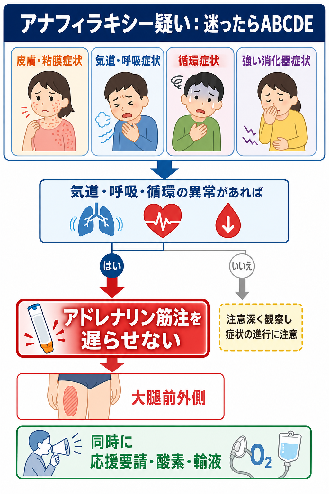
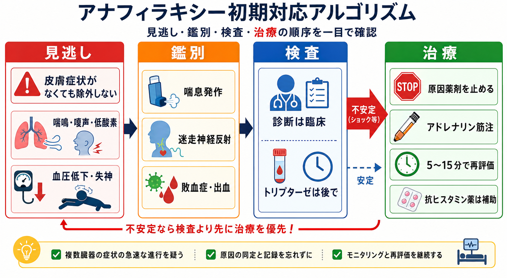

---
title: "アナフィラキシーを疑ったらアドレナリンをいつ打つか"
description: "診断基準と重症度を理解し、アドレナリン筋注を遅らせない判断を学ぶ。"
aliases:
  - "アナフィラキシーとアドレナリン"
tags:
  - 領域/救急・初期対応
  - 種類/クリニカルクエスチョン
  - 対象/研修医
question: "アナフィラキシーを疑ったらアドレナリンをいつ打つか"
clinical_area: "救急・初期対応"
audience: "研修医"
evidence_level: "guideline"
created: "2026-04-27"
updated: "2026-04-27"
enableToc: true
---

# アナフィラキシーを疑ったらアドレナリンをいつ打つか

> このノートは研修医教育のための一般的整理であり、個別患者の診断・治療指示ではありません。緊急性が高い、判断に迷う、施設方針が関わる場合は上級医・専門科に相談してください。

## クリニカルクエスチョン

アナフィラキシーを疑ったら、診断確定や検査結果を待たずに、どのタイミングでアドレナリン筋注を行うべきか。

## まず結論

- アナフィラキシーは「急速に進行する全身性過敏反応」で、気道・呼吸・循環のいずれかに生命を脅かす異常があれば、皮膚症状がなくても疑う[1][5]。
- アドレナリン筋注は第一選択であり、呼吸器症状、喉頭症状、血圧低下、失神、ショック、または急速に進行する多臓器症状があれば、診断確定を待たずに打つ[1][2][5][6]。
- 「じんま疹だけ」なら観察や抗ヒスタミン薬で足りる場面があるが、喘鳴、嗄声、咽頭違和感、低酸素、血圧低下、強い腹痛・反復嘔吐が重なるなら、抗ヒスタミン薬を先にしてはいけない[1][2][6]。
- 標準は大腿前外側への筋注で、0.1%アドレナリンは 1 mg/mL、0.01 mg/kg相当を用い、成人最大0.5 mg、小児最大0.3 mgを目安にする[1][2][3]。
- 反応不十分なら酸素、仰臥位、急速輸液、原因薬剤中止、応援要請を並行し、5から15分ごとに再評価して追加筋注を検討する[1][2][6]。
- トリプターゼなどの検査は診断補助であり、治療開始を遅らせる理由にしない[5][7]。

## 判断の型

1. まず「アレルゲン曝露らしさ」よりも ABCD を見る。喉頭浮腫、喘鳴、低酸素、血圧低下、失神、意識変容があれば重症として扱う[1][5][6]。
2. 皮膚・粘膜症状があるかを確認する。ただし、皮膚症状がないことはアナフィラキシー除外にならない[5][6]。
3. 急速発症で、皮膚・粘膜症状に呼吸器症状、循環症状、強い消化器症状のいずれかが重なれば、アナフィラキシーとして初期対応する[1][5]。
4. 既知または可能性の高いアレルゲン曝露後に、低血圧、気管支攣縮、喉頭症状が出た場合は、皮膚症状がなくてもアナフィラキシーを強く疑う[5]。
5. 迷う場合は「この患者が数分で気道・呼吸・循環破綻に進む可能性があるか」で判断し、可能性があればアドレナリン筋注を優先する[1][2][6]。

## 初期対応

- 応援を呼び、モニター、血圧、SpO2、心電図、静脈路を準備する。薬剤投与中なら原因候補を止める[1][2]。
- 患者は原則として仰臥位で下肢挙上とし、呼吸困難が強い場合は呼吸が楽な体位を取りつつ、急な立位や歩行を避ける[6][7]。
- 気道・呼吸・循環症状があれば、0.1%アドレナリンを大腿前外側へ筋注する。投与量は 0.01 mg/kg、成人最大0.5 mg、小児最大0.3 mgを目安にする[1][2][3]。
- 低酸素や呼吸苦があれば酸素投与、ショックや血圧低下があれば等張晶質液の急速輸液を行う[1][2][6]。
- 改善が不十分、または再増悪する場合は5から15分ごとに再評価し、追加アドレナリン筋注、気道確保、集中治療、アレルギー・救急・麻酔科などへの相談を検討する[1][2][6]。

## 鑑別・見逃し

| 優先度 | 疾患・状態 | 見逃さない理由 | 手がかり |
|---|---|---|---|
| 高 | アナフィラキシーショック | アドレナリン遅延が致命的になりうる | 急速発症、血圧低下、失神、喘鳴、喉頭症状、皮膚・粘膜症状 |
| 高 | 気道閉塞・喉頭浮腫 | 短時間で挿管困難になりうる | 嗄声、吸気性喘鳴、咽頭違和感、舌・口唇腫脹 |
| 高 | 重症喘息発作 | 喘鳴だけでは鑑別困難で、アナフィラキシーを合併しうる | アレルゲン曝露、皮膚症状、血圧低下、反復嘔吐 |
| 中 | 迷走神経反射 | 不要な治療を避けるが、循環虚脱との鑑別が必要 | 徐脈、冷汗、臥位で改善、皮膚膨疹や喘鳴なし |
| 中 | 敗血症・出血・肺塞栓 | ショックの別原因を同時に考える | 発熱、感染巣、出血、胸痛、リスク因子 |
| 中 | パニック発作・過換気 | 呼吸苦の鑑別だが、除外診断にしない | SpO2保たれる、皮膚・粘膜症状や血圧低下なし |

## 検査

| 検査 | 目的 | 注意点 |
|---|---|---|
| バイタル、SpO2、心電図モニター | 重症度と治療反応の評価 | 検査というより継続的な再評価として扱う |
| 血糖、血液ガス、乳酸、電解質 | 意識障害、ショック、低酸素、代謝異常の評価 | 初期治療を遅らせない |
| 血算、生化学、凝固、培養など | 鑑別診断や合併症評価 | 敗血症、出血、他のショックを疑うときに追加 |
| 血清トリプターゼ | 肥満細胞活性化の診断補助 | 発症後できるだけ早く、1から2時間後、遅くとも4時間以内が目安。陰性でも除外不可[7] |
| 原因検索 | 再発予防、専門外来での評価 | 急性期は原因同定より救命を優先する[5][7] |

## 治療・マネジメント

- 第一選択はアドレナリン筋注である。抗ヒスタミン薬、ステロイド、吸入β2刺激薬は補助であり、気道・呼吸・循環症状のある患者でアドレナリンに先行させない[1][2][5][6]。
- 日本で医療機関内にある 0.1%アドレナリン製剤は 1 mg/mLであり、用量計算は「0.01 mL/kg」と「0.01 mg/kg」が同じ意味になる。成人最大0.5 mL、小児最大0.3 mLを超えないよう確認する[2][3]。
- アドレナリン自己注射薬は、日本ではエピペン0.15 mgと0.3 mgがあり、PMDA掲載添付文書上は15 kg以上30 kg未満に0.15 mg、30 kg以上に0.3 mgが対応する[4]。
- 日本での注意: エピペンは医療機関外での初期対応を支える補助治療であり、使用後も救急受診と観察が必要である。医療機関内では施設の救急カート、注射製剤、手順書に従う[2][4]。
- 日本での注意: アドレナリン静注は不整脈・高血圧などのリスクがあり、心停止や難治性ショックなどを除き、熟練者がモニター下で行う運用に限定して考える[1][2][6]。
- 観察時間は症状の重症度、必要投与回数、喘息合併、原因、遠隔地帰宅、再燃リスクで変わる。NICEは成人・16歳以上で救急治療後6から12時間観察を基本とし、速やかに安定し退院時対応が整えば短縮を考慮できるとしている[7]。
- 退院前には、再燃リスク、原因回避、自己注射薬の適応、専門外来紹介、次回発症時の行動を確認する[5][7]。

## 図解

## 指導医に確認するポイント

- アドレナリン筋注の適応に迷う症状か、すでに気道・呼吸・循環症状として扱うべきか。
- 体重不明時の用量、院内の救急カートにある製剤、希釈・投与手順、再投与間隔。
- 静脈路確保、輸液量、酸素投与、気道確保、挿管準備、ICU入室の要否。
- 原因薬剤・食物・ラテックス・造影剤などの記録方法と、再曝露防止の院内表示。
- 退院可否、観察時間、自己注射薬処方、アレルギー専門外来紹介の施設方針。

## 患者説明

- 「アレルギー反応が全身に広がり、息苦しさや血圧低下につながる可能性がある状態として対応しています。」
- 「アドレナリンは、この状態で最も重要な初期治療です。動悸や震えが出ることがありますが、重症化を防ぐ目的で使います。」
- 「一度よくなっても数時間後に症状が戻ることがあるため、しばらく観察します。」
- 「原因候補を記録し、再発予防と自己注射薬の必要性について専門外来で確認します。」

## ピットフォール

- 皮膚症状がないからアナフィラキシーではない、と判断する。
- 抗ヒスタミン薬やステロイドを先に投与し、アドレナリン筋注が遅れる。
- 「血圧がまだ保たれている」ことを理由に、喉頭症状や喘鳴を軽く扱う。
- トリプターゼ採血や原因検索を優先し、初期治療を遅らせる。
- 0.1%製剤の mL と mg を混同する。
- 自己注射薬を使った患者を、再燃リスクや専門外来紹介なしに帰宅させる。

## 関連ノート

- 関連ノート候補: ショックの初期対応
- 関連ノート候補: 喘息発作の初期対応
- 関連ノート候補: 造影剤アレルギーへの対応
- 関連ノート候補: 薬剤アレルギーの問診と記録

## MOC更新候補

- [[MOC｜救急・初期対応]]
- MOC｜膠原病・免疫・アレルギー.md（本サイト外）
- MOC｜薬剤・処方・副作用.md（本サイト外）

## 参考文献

[1] 日本アレルギー学会. アナフィラキシーガイドライン 2022（Web版修正版）. 2023. https://www.jsaweb.jp/uploads/files/Web_AnaGL_2023_0301.pdf

[2] 厚生労働省. 重篤副作用疾患別対応マニュアル アナフィラキシー（令和8年2月改定）. https://www.mhlw.go.jp/topics/2006/11/tp1122-1h.html

[3] PMDA. アドレナリン注0.1%シリンジ「テルモ」 医療用医薬品情報・添付文書. https://www.pmda.go.jp/PmdaSearch/rdSearch/02/2451402G1040?user=1

[4] PMDA. エピペン注射液0.15mg／エピペン注射液0.3mg 医療用医薬品情報・添付文書. https://www.pmda.go.jp/PmdaSearch/rdSearch/02/2451402G3026?user=1

[5] Cardona V, Ansotegui IJ, Ebisawa M, et al. World Allergy Organization Anaphylaxis Guidance 2020. World Allergy Organization Journal. 2020;13(10):100472. https://doi.org/10.1016/j.waojou.2020.100472

[6] Resuscitation Council UK. Emergency treatment of anaphylaxis: Guidelines for healthcare providers. 2021. https://www.resus.org.uk/library/additional-guidance/guidance-anaphylaxis/emergency-treatment

[7] National Institute for Health and Care Excellence. Anaphylaxis: assessment and referral after emergency treatment. NICE guideline CG134. Updated 2020. https://www.nice.org.uk/guidance/cg134/chapter/1-recommendations

## 更新ログ

- 2026-04-27: 初版作成。
