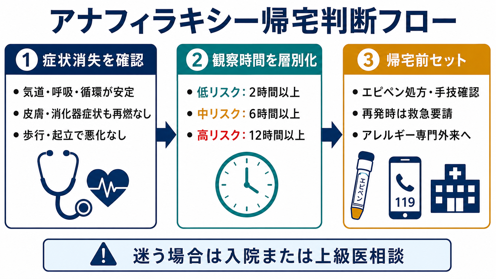
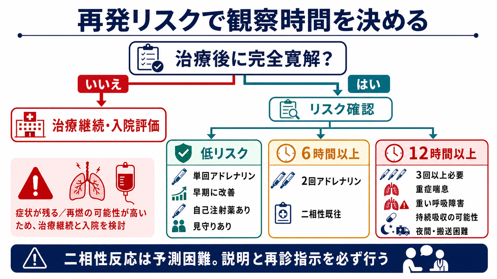
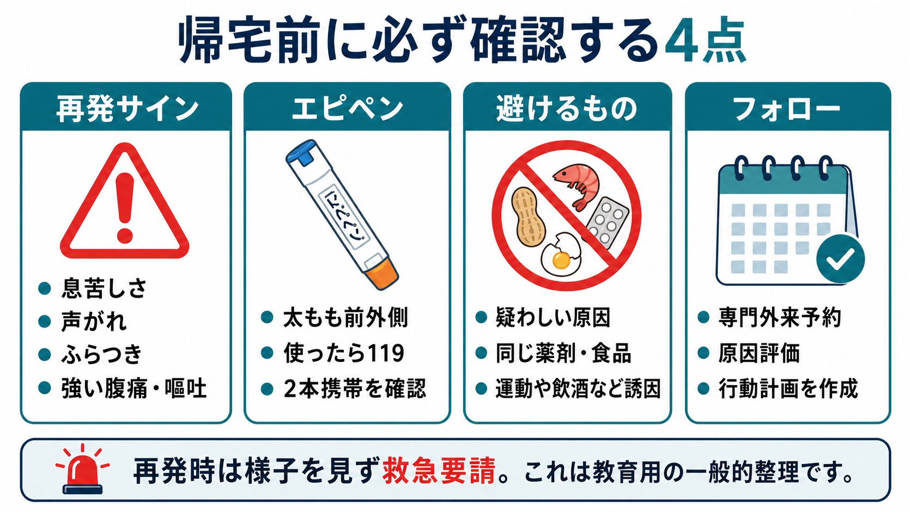

---
title: "アナフィラキシー患者を帰宅させてよい条件は何か"
description: "症状消失、観察時間、再発リスク、エピペン処方、再診指示をそろえて、アナフィラキシー後の帰宅可否を安全側に判断する。"
aliases:
  - "アナフィラキシー帰宅判断"
tags:
  - 領域/救急・初期対応
  - 種類/クリニカルクエスチョン
  - 対象/研修医
question: "アナフィラキシー患者を帰宅させてよい条件は何か"
clinical_area: "救急・初期対応"
audience: "研修医"
evidence_level: "guideline"
created: "2026-04-27"
updated: "2026-04-27"
enableToc: true
---

# アナフィラキシー患者を帰宅させてよい条件は何か

> このノートは研修医教育のための一般的整理であり、個別患者の診断・治療指示ではありません。緊急性が高い、判断に迷う、施設方針が関わる場合は上級医・専門科に相談してください。

## クリニカルクエスチョン

アナフィラキシーの急性期治療後に症状が消失した患者を、どの条件がそろえば帰宅可と考え、どの条件なら観察延長・入院を検討するか。

## まず結論

- 帰宅判断は「症状が消えた」だけで決めない。気道・呼吸・循環・消化器・皮膚粘膜症状が完全に寛解し、バイタルが安定し、再燃リスクに応じた観察時間を終え、再発時対応とフォローが整っていることを確認する。[1],[3],[4]
- 低リスクでも、症状消失後すぐの帰宅は避ける。RCUK 2021は、良好な反応、完全寛解、自己注射薬と使用訓練、帰宅後の見守りがある場合に、症状消失後2時間の短時間観察を検討できるとしている。[4]
- 2回のアドレナリン筋注を要した、または二相性反応の既往がある場合は、症状消失後6時間以上の観察が目安になる。[4]
- 3回以上のアドレナリン、重症喘息、重い呼吸障害、持続吸収が疑われる薬剤・食物、夜間発症、搬送困難地域、帰宅後の見守り不足では、症状消失後12時間以上の観察または入院を検討する。[4]
- 帰宅前には、エピペンなどアドレナリン自己注射薬の処方・手技確認、再発時は使用後に救急要請する説明、原因回避、アレルギー専門外来への紹介をセットで行う。[3],[4],[5],[8]
- 日本では、エピペンは「アナフィラキシー反応に対する補助治療剤」であり、使用後も医療機関での治療・観察が必要である。海外資料の「2本携帯」推奨は参考にしつつ、国内添付文書、施設運用、処方可能性を確認する。[1],[5],[8]

## 判断の型

1. **まず「帰宅可能な状態」かを確認する**  
   気道違和感、嗄声、喘鳴、息苦しさ、低血圧、ふらつき、反復嘔吐、強い腹痛、全身蕁麻疹の増悪が残る場合は帰宅判断に進まない。[1],[2]

2. **治療反応で観察時間を層別化する**  
   単回アドレナリンで早期に改善した低リスクか、複数回投与・呼吸循環障害・重症喘息などの高リスクかを分ける。[3],[4],[6]

3. **帰宅後に悪化した時の安全網を作る**  
   自己注射薬、使用練習、119番指示、同伴者・見守り、帰宅手段、救急再受診しやすさ、専門外来フォローを確認する。[3],[5]

4. **迷う条件は入院側に倒す**  
   二相性反応は完全には予測できない。重症度、再発リスク、夜間、独居、遠方、理解度、原因不明が重なる場合は、上級医と観察延長・入院を検討する。[4],[6]

## 初期対応

- 帰宅判断の前提として、急性期にはアナフィラキシーを臨床診断し、必要時に大腿部中央前外側へアドレナリン筋注を遅らせない。[1],[3]
- 日本アレルギー学会ガイドライン2022では、0.1%アドレナリン 1 mg/mLを0.01 mg/kg、最大成人0.5 mg・小児0.3 mgで筋注し、反応不十分なら5-15分ごとの再投与を検討する。[1]
- 酸素、体位、モニター、静脈路、等張晶質液、原因曝露の中止、気道確保準備を並行する。[1],[3]
- 抗ヒスタミン薬やステロイドは補助療法であり、呼吸・循環障害の初期治療としてアドレナリンを置き換えない。[3],[6]
- 急性期の処置が終わったら、発症時刻、原因候補、アドレナリン投与時刻・回数、症状消失時刻を記録する。観察時間は「来院時刻」ではなく、少なくとも症状消失後の時間軸で考える。[4]

## 鑑別・見逃し

| 優先度 | 疾患・状態 | 見逃さない理由 | 手がかり |
|---|---|---|---|
| 高 | 気道浮腫の再燃 | 突然の窒息リスクがある | 嗄声、咽頭違和感、吸気性喘鳴、唾液嚥下困難 |
| 高 | 気管支攣縮・喘息増悪 | 二相性反応や呼吸不全のリスク | 喘鳴、SpO2低下、呼吸仕事量増加、重症喘息既往 |
| 高 | 遷延性ショック | 帰宅後の急変につながる | 低血圧、頻脈、末梢冷感、起立時ふらつき |
| 中 | 二相性アナフィラキシー | 完全には予測できず、数時間後に再発しうる | 重症初発、アドレナリン複数回、二相性既往 |
| 中 | 血管迷走神経反射 | 過大診断・過小診断の両方が起こる | 徐脈、顔面蒼白、仰臥位で改善、皮膚呼吸器症状なし |
| 中 | 食物依存性運動誘発・薬剤誘発 | 帰宅後の再曝露で再燃する | 食事、運動、NSAIDs、飲酒、造影剤、抗菌薬 |

## 検査

| 検査 | 目的 | 注意点 |
|---|---|---|
| バイタル再評価 | 帰宅可能な安定性を確認する | 安静時だけでなく起立・歩行で悪化しないか確認する |
| SpO2・呼吸状態 | 気管支攣縮や上気道症状の残存を拾う | 喘息既往・呼吸器症状例では長めに見る |
| 血糖・心電図・血液ガスなど | 鑑別疾患やアドレナリン後の合併症を評価する | 一律ではなく病態に応じて選ぶ |
| 血清トリプターゼ | 診断補助、後日の専門評価に使う | 治療を遅らせない。NICEは急性期開始後早期と発症1-2時間、遅くとも4時間以内の採血を示す。[5] |
| 原因評価の情報整理 | 再発予防と紹介状作成 | 食物、薬剤、造影剤、蜂刺傷、運動、飲酒、NSAIDs、β遮断薬などを記録する |

## 治療・マネジメント

- **帰宅可の最低条件**  
  気道・呼吸・循環が安定し、皮膚・消化器症状も再燃せず、起立・歩行で悪化せず、観察中に追加治療を要していないことを確認する。[1],[4]

- **低リスクで短時間観察を検討できる条件**  
  RCUK 2021では、発症後30分以内に投与された単回アドレナリンへ5-10分で良好に反応し、症状が完全に消失し、未使用のアドレナリン自己注射薬を持ち使用訓練済みで、帰宅後の見守りがある場合に、症状消失後2時間の短時間観察を検討できる。[4]

- **6時間以上観察を考える条件**  
  2回のアドレナリン筋注を要した場合、または二相性反応の既往がある場合は、症状消失後6時間以上の観察を目安にする。[4]

- **12時間以上観察または入院を考える条件**  
  3回以上のアドレナリンを要した、重症喘息がある、反応が重い呼吸障害を伴った、徐放薬・大量摂取など持続吸収が疑われる、夜間で悪化時の対応が難しい、救急医療へのアクセスが悪い場合は、12時間以上の観察または入院を検討する。[4]

- **二相性反応の説明**  
  二相性反応は完全寛解後に再曝露なしで症状が再発する状態で、NICEでは72時間以内の再発として説明される。重症初発反応や複数回アドレナリンはリスク因子として扱われる。[5],[6]

- **エピペン処方と手技確認**  
  帰宅前に自己注射薬が必要かを上級医と確認し、処方する場合は太もも前外側への使用方法、使用後に119番すること、横になって急に立ち上がらないこと、期限・保管・携帯を説明する。[5],[8]

- **日本での注意**  
  エピペンの国内添付文書では、通常アドレナリン0.01 mg/kgが推奨用量で、体重を考慮して0.15 mgまたは0.3 mgを筋肉内注射する。0.3 mg製剤は通常30 kg以上、0.15 mg製剤は15 kg以上30 kg未満が目安である。[8]  
  エピペンは救急搬送前の補助治療であり、使用後に医療機関での治療・観察が必要である。国内の処方運用、講習、院内採用、保険・在庫状況は施設で確認する。[8]  
  厚生労働省/PMDAの重篤副作用疾患別対応マニュアルは、薬剤性アナフィラキシーの初期症状、早期対応、鑑別、治療を確認する国内資料として参照する。[2],[7]

## 図解

## 指導医に確認するポイント

- この患者は低リスク、6時間観察、12時間以上観察・入院のどこに入るか。
- 「完全寛解」と判断してよいか。嗄声、喘鳴、低血圧、腹痛、嘔吐、起立時ふらつきが残っていないか。
- アドレナリン筋注の回数、投与時刻、反応時間、症状消失時刻は記録されているか。
- エピペン処方、手技指導、2本携帯の要否、紹介先、院内の薬剤師説明フローはどうするか。
- 原因薬剤・食品・造影剤を電子カルテのアレルギー欄、紹介状、患者説明書にどう残すか。
- 小児、妊娠、高齢、独居、遠方、夜間、重症喘息、β遮断薬内服などで帰宅判断を変えるべき点はあるか。

## 患者説明

- 「症状が一度消えても、数時間後に再び息苦しさ、ふらつき、腹痛、じんましんなどが出ることがあります」と説明する。
- 「息苦しさ、声がれ、のどの腫れ、ふらつき、強い腹痛、繰り返す嘔吐が出たら、様子を見ずに救急要請してください」と伝える。[2]
- 「エピペンを使った場合も、それで終わりではありません。使ったら119番し、医療機関で評価を受けてください」と説明する。[5],[8]
- 「疑わしい食品・薬・造影剤・蜂刺されなどは、専門外来で評価するまで避けてください。自己判断で再摂取・再使用しないでください」と伝える。
- 「帰宅後は一人で過ごさず、可能なら家族・同居者に症状と対応を共有してください」と確認する。

## ピットフォール

- 「蕁麻疹が消えた」だけで帰宅可にして、呼吸・循環・消化器症状の残存を見逃す。
- 観察時間を来院時刻から数えてしまい、症状消失後の再発リスクを見ていない。
- アドレナリン2回以上、重症喘息、重い呼吸障害、夜間、遠方、独居などのリスクを軽く扱う。
- エピペン処方だけ行い、使用練習、使用後119番、横になること、再受診基準を説明しない。
- 原因候補をカルテ・紹介状・患者説明に残さず、再曝露を防げない。
- 抗ヒスタミン薬やステロイド内服を出したことで安全網ができたと誤解する。これらは再発時の救命対応を置き換えない。[3],[6]

## 関連ノート

- [[アナフィラキシーによるショックをどう見抜き対応するか]]

関連ノート候補:

- アナフィラキシーでアドレナリン筋注後は何を観察するか
- アナフィラキシー患者にエピペンをどう説明するか
- アナフィラキシーと血管迷走神経反射をどう見分けるか
- 薬剤性アナフィラキシー後の再投与禁忌をどう記録するか
- 食物依存性運動誘発アナフィラキシーをどう疑うか

## MOC更新候補

- [[MOC｜救急・初期対応]]
- MOC｜膠原病・免疫・アレルギー.md（本サイト外）
- MOC｜薬剤・処方・副作用.md（本サイト外）

## 参考文献

[1] 日本アレルギー学会Anaphylaxis対策委員会. アナフィラキシーガイドライン2022. 2022（2023年修正版）. https://www.jsaweb.jp/uploads/files/Web_AnaGL_2023_0301.pdf

[2] 厚生労働省. 重篤副作用疾患別対応マニュアル アナフィラキシー. 2008年3月（2019年9月改定、2026年2月改定）. https://www.pmda.go.jp/files/000279383.pdf

[3] Cardona V, Ansotegui IJ, Ebisawa M, et al. World Allergy Organization Anaphylaxis Guidance 2020. World Allergy Organization Journal. 2020;13(10):100472. https://doi.org/10.1016/j.waojou.2020.100472

[4] Resuscitation Council UK. Emergency treatment of anaphylaxis: Guidelines for healthcare providers. May 2021. https://www.resus.org.uk/sites/default/files/2021-05/Emergency%20Treatment%20of%20Anaphylaxis%20May%202021_0.pdf

[5] National Institute for Health and Care Excellence. Anaphylaxis: assessment and referral after emergency treatment. NICE guideline CG134. Published 2011, last updated 24 August 2020, minor update December 2021. https://www.nice.org.uk/guidance/cg134/chapter/1-recommendations

[6] Shaker MS, Wallace DV, Golden DBK, et al. Anaphylaxis-a 2020 practice parameter update, systematic review, and GRADE analysis. Journal of Allergy and Clinical Immunology. 2020;145(4):1082-1123. https://doi.org/10.1016/j.jaci.2020.01.017

[7] PMDA. 重篤副作用疾患別対応マニュアル（医療関係者向け）. 2026年2月改定掲載. https://www.pmda.go.jp/safety/info-services/drugs/adr-info/manuals-for-hc-pro/0001.html

[8] PMDA. エピペン注射液0.15mg／エピペン注射液0.3mg 医療用医薬品情報. 添付文書 2026年3月31日. https://www.pmda.go.jp/PmdaSearch/rdSearch/02/2451402G3026?user=1

## 更新ログ

- 2026-04-27: 初版作成。日本アレルギー学会ガイドライン2022、厚生労働省/PMDA資料、PMDAエピペン添付文書、WAO、RCUK、NICE、AAAAI/ACAAI practice parameterを確認。
