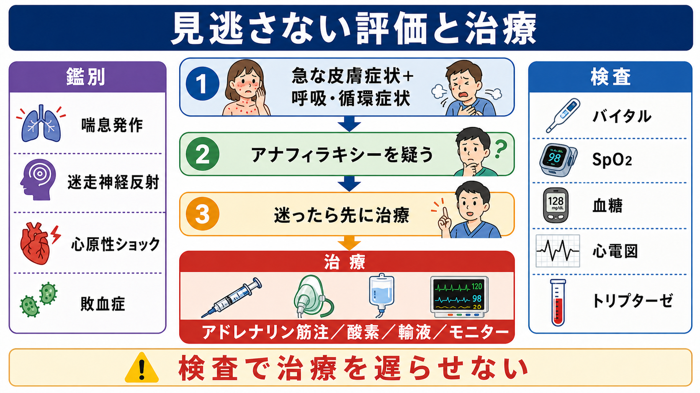
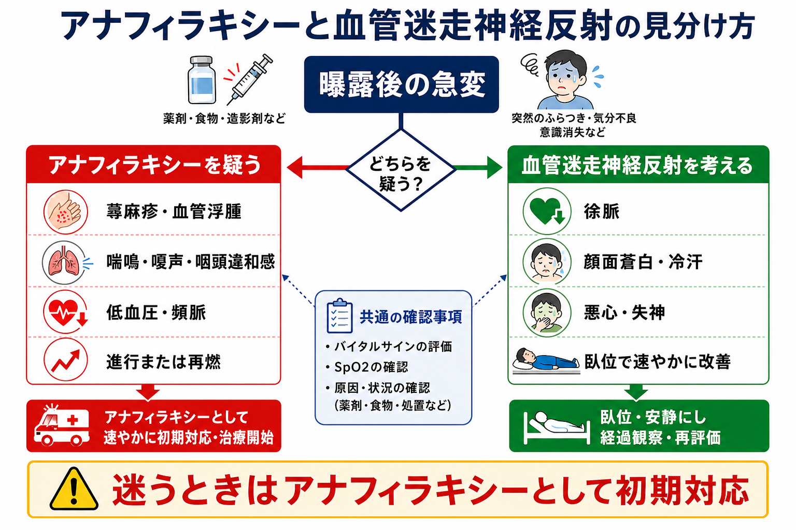
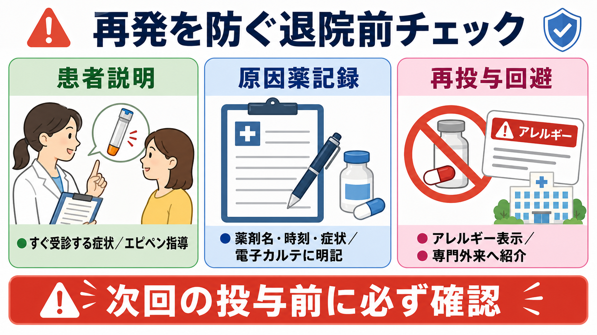

---
title: "薬剤投与中に蕁麻疹と呼吸苦が出たら何をするか"
description: "薬剤投与中に蕁麻疹と呼吸苦が出た場合に、薬剤中止、ABCDE評価、アドレナリン筋注、原因薬記録と再投与回避を整理する。"
aliases:
  - "薬剤投与中のアナフィラキシー対応"
tags:
  - 領域/救急・初期対応
  - 種類/クリニカルクエスチョン
  - 対象/研修医
question: "薬剤投与中に蕁麻疹と呼吸苦が出たら何をするか"
clinical_area: "救急・初期対応"
audience: "研修医"
evidence_level: "guideline"
created: "2026-04-27"
updated: "2026-04-27"
enableToc: true
---

# 薬剤投与中に蕁麻疹と呼吸苦が出たら何をするか

> このノートは研修医教育のための一般的整理であり、個別患者への診断・治療指示ではありません。緊急性が高い、判断に迷う、施設手順が関わる場合は上級医・救急チーム・専門科に相談してください。

## クリニカルクエスチョン

薬剤投与中または投与直後に、蕁麻疹・紅斑などの皮膚症状と呼吸苦が出たとき、研修医は何を中止し、何を評価し、いつアドレナリン筋注を優先し、原因薬をどう記録して再投与を避けるか。

## まず結論

- 薬剤投与中に急な蕁麻疹と呼吸苦が出たら、まず原因候補の薬剤投与を止め、応援を呼び、ABCDEで気道・呼吸・循環を同時に評価する。アナフィラキシーは皮膚症状が目立たないこともあり、呼吸・循環症状を優先して重症度を判断する[1,4]。
- アナフィラキシーを疑い、呼吸障害、低血圧、意識障害、進行する症状があれば、検査や抗ヒスタミン薬を待たずにアドレナリン筋注を第一選択として考える[1,4,5]。
- 日本アレルギー学会のガイドラインでは、0.1%アドレナリン、すなわち 1 mg/mL 製剤を大腿外側広筋へ 0.01 mg/kg、成人最大 0.5 mg を目安に筋注する整理である[1]。実施時は施設プロトコル、使用製剤、上級医判断を確認する。
- 酸素、モニター、静脈路、急速輸液、気道確保準備を並行する。抗ヒスタミン薬やステロイドは補助的治療であり、急性期の呼吸・循環破綻を速やかに改善する主治療としてアドレナリンを置き換えない[1,4,5]。
- 症状が改善しても、発症時刻、投与薬、投与量、投与経路、ロット、併用薬、バイタル、処置、反応を記録し、電子カルテのアレルギー欄に原因薬候補を明記する。安易な再投与を避け、必要に応じてアレルギー専門医へつなぐ[1,2,6]。

## 判断の型

1. **時間軸で疑う**  
   投与開始から数分から数時間以内に、蕁麻疹、紅斑、掻痒、血管浮腫、喘鳴、嗄声、咽頭違和感、息苦しさ、低血圧、失神、腹痛、嘔吐が出たら、薬剤関連アナフィラキシーを上位に置く[1,4]。

2. **皮膚だけでなくABCを見る**  
   「蕁麻疹があるか」より、「気道浮腫はないか」「呼吸仕事量やSpO2は悪化していないか」「血圧・脈拍・意識は崩れていないか」を先に見る。皮膚症状が乏しいアナフィラキシーもある[1,4]。

3. **迷ったら治療を遅らせない**  
   急な皮膚症状に呼吸または循環症状が重なる場合、トリプターゼ、心電図、採血、画像をそろえる前に安定化を優先する[1,4,5]。

4. **原因薬の同定は後で検証できる形に残す**  
   投与中止だけで終わらせず、薬剤名、一般名、投与経路、投与開始・中止時刻、投与量、希釈液、ロット、併用薬、処置前後のバイタルを記録する[2,6]。

## 初期対応

- **投与を止める**: 疑わしい薬剤、輸液ライン、注入ポンプ、同じラインから流している薬剤を確認する。可能ならルートは抜去せず、生理食塩液で確保し、追加薬剤の誤投与を防ぐ。
- **応援を呼ぶ**: 上級医、看護師、救急カート、気道確保できる人、薬剤準備できる人を早めに集める。悪化してから一人で抱えない。
- **ABCDEで評価する**: Aは嗄声・咽頭違和感・舌口唇腫脹、Bは喘鳴・呼吸数・SpO2・努力呼吸、Cは血圧・脈拍・末梢冷感・皮膚色、Dは意識・不穏、Eは蕁麻疹・紅斑・浮腫・発汗を確認する[1,4]。
- **アナフィラキシーを疑えばアドレナリン筋注を準備する**: 呼吸苦、喘鳴、低酸素、低血圧、失神、進行する症状があれば、抗ヒスタミン薬やステロイドより前に検討する[1,4,5]。
- **同時に支持療法を進める**: 高濃度酸素、モニター、静脈路、急速輸液、仰臥位または下肢挙上、気道確保準備を、症状と施設手順に応じて進める[1,4]。

## 鑑別・見逃し

| 優先度 | 鑑別 | 見逃しやすい理由 | 手がかり |
|---|---|---|---|
| 高 | アナフィラキシー | 皮膚症状が軽い、または血圧低下が遅れて見える | 薬剤曝露後の急な蕁麻疹、呼吸苦、喘鳴、咽頭違和感、低血圧、消化器症状 |
| 高 | 気管支喘息発作 | 喘鳴だけに見える | 皮膚症状、薬剤曝露、血圧低下、腹部症状があればアナフィラキシーを再考 |
| 高 | 血管迷走神経反射 | 採血・注射直後に起こる | 徐脈、冷汗、顔面蒼白、臥位で速やかに改善。蕁麻疹や喘鳴は通常目立たない |
| 高 | 心原性ショック・不整脈 | 薬剤投与中の急変として重なる | 胸痛、心電図異常、肺水腫、既往、薬剤の循環器副作用 |
| 中 | 敗血症・輸液反応・発熱反応 | 発熱や悪寒が主訴になる | 発熱、感染巣、投与製剤、培養、経時変化 |
| 中 | 遺伝性または薬剤性血管性浮腫 | 蕁麻疹なしの顔面・咽頭浮腫で紛らわしい | ACE阻害薬、家族歴、反復歴、蕁麻疹の有無、気道症状 |

## 検査

| 検査 | 目的 | 注意点 |
|---|---|---|
| バイタル、SpO2、意識評価 | 重症度と治療反応を見る | 一度正常でも悪化しうるため、繰り返す |
| 心電図、モニター | 不整脈、虚血、アドレナリン後の変化を確認 | 心電図待ちでアドレナリン筋注を遅らせない |
| 血糖 | 意識障害・発汗の鑑別 | 低血糖は並行して補正する |
| 血液ガス、乳酸 | 呼吸不全、循環不全、ショックの評価 | 採血のために治療開始を待たない |
| 血清トリプターゼ | 診断補助、後日の検証 | 陰性でもアナフィラキシーを除外できない。施設で採血タイミングを確認する[4,5] |
| CBC、生化学、凝固、培養など | 鑑別疾患や併存病態の確認 | 安定化後に必要性を判断する |

## 治療・マネジメント

- **アドレナリン筋注**  
  アナフィラキシーが疑われ、呼吸・循環症状がある場合の第一選択はアドレナリン筋注である[1,4,5]。国内ガイドラインでは 0.1%アドレナリン 1 mg/mL を大腿外側広筋へ 0.01 mg/kg、成人最大 0.5 mg を目安にする[1]。再投与間隔や持続投与の適応は、反応、血圧、呼吸状態、施設手順、上級医判断で決める。

- **酸素・体位・輸液**  
  低酸素や呼吸苦があれば酸素投与を行い、低血圧やショックでは仰臥位・下肢挙上と等張晶質液の急速投与を検討する[1,4]。嘔吐、呼吸苦、妊娠、気道浮腫がある場合は、誤嚥や換気を考えて体位を調整する。

- **気道確保の準備**  
  嗄声、舌・口唇・咽頭浮腫、吸気性喘鳴、SpO2低下、会話困難があれば、早期に気道確保できる人を呼ぶ。気道浮腫が進む前に相談する。

- **補助薬**  
  H1抗ヒスタミン薬は皮膚症状の緩和、ステロイドは遅発相・二相性反応への期待で使われることがあるが、急性期の気道・呼吸・循環を速やかに改善する治療ではない[1,4,5]。これらでアドレナリン筋注を遅らせない。

- **観察と再評価**  
  症状改善後も二相性反応や再燃がありうるため、重症度、アドレナリン複数回投与、喘息、持続症状、搬送困難、夜間などを踏まえて観察時間や入院を判断する[4,5]。

- **日本での注意**  
  厚生労働省/PMDAの重篤副作用疾患別対応マニュアルも、医薬品関連の副作用初期対応を確認する国内資料として参照できる[3]。エピペンは、食物・薬物などによるアナフィラキシー反応への補助治療薬であり、使用後も医療機関での評価が必要である[8]。院内急変では、自己注射薬の有無だけでなく、施設採用のアドレナリン製剤、濃度、投与経路、投与量を確認する。アドレナリン製剤の添付文書には併用注意や原則禁忌が記載されるが、アナフィラキシーショック等の救急治療時は例外的に使用される記載があるため、施設手順と上級医判断に従う[7,9]。

## 図解

## 指導医に確認するポイント

- この症状をアナフィラキシーとして扱う根拠と、同時に除外すべき鑑別は何か。
- アドレナリン筋注の用量、投与経路、再投与間隔、使用する製剤は施設手順と合っているか。
- 気道確保、ICU、救急科、麻酔科、アレルギー専門科へ相談するタイミングはいつか。
- 原因薬候補、同系統薬、添加物、希釈液、ラテックス、輸血・造影剤などをどこまで記録するか。
- 退院時説明、エピペン処方・指導、再診指示、専門外来紹介をどう組み立てるか。

## 患者説明

- 「薬の投与中に、皮膚の症状と息苦しさが同時に出ました。急なアレルギー反応で、呼吸や血圧に影響することがあります」と説明する。
- 「最初に原因になりうる薬を止め、呼吸と血圧を確認し、必要な場合はアドレナリンの筋肉注射、酸素、点滴で対応します」と伝える。
- 「一度よくなっても再び悪くなることがあるため、しばらく観察します」と説明する[4,5]。
- 「次に同じ薬を使う前に必ず確認できるよう、薬剤名と症状を記録します。自己判断で再使用しないでください」と共有する[2,6]。

## ピットフォール

- 蕁麻疹だけに注目し、嗄声、咽頭違和感、喘鳴、低血圧、失神を見落とす。
- 抗ヒスタミン薬やステロイドを先に入れて、アドレナリン筋注が遅れる[1,4,5]。
- 採血、トリプターゼ、心電図、画像検査をそろえるまで治療開始を待つ。
- 投与を止めた薬剤名だけを曖昧に記録し、一般名、時刻、投与量、経路、併用薬、処置反応を残さない。
- 「アレルギー」とだけ記載し、原因薬候補と反応の重症度が次回投与前に伝わらない。
- 改善後の観察、再燃時の受診指示、専門外来紹介を忘れる。

## 関連ノート

既存ノートの文字化けやリンク先未確認があるため、本文中の内部リンクは追加しない。

関連ノート候補:

- アナフィラキシーによるショックをどう見抜き対応するか
- 救急外来で患者を診るときABCDE評価はどの順番で進めるか
- 薬剤アレルギー歴をどう聴取し記録するか
- エピペンをいつ処方しどう説明するか

## MOC更新候補

- [[MOC｜救急・初期対応]] に「アナフィラキシー」配下の記事として追加候補。
- MOC・アレルギー.md（本サイト外） が存在する場合、薬剤アレルギー・アナフィラキシー関連として追加候補。
- MOC・薬剤・処方・副作用.md（本サイト外） が存在する場合、薬剤投与中急変・副作用対応として追加候補。

## 参考文献

[1] 日本アレルギー学会 Anaphylaxis対策特別委員会. アナフィラキシーガイドライン2022. 2022（2023年修正版）. https://www.jsaweb.jp/uploads/files/Web_AnaGL_2023_0301.pdf

[2] 厚生労働省. 重篤副作用疾患別対応マニュアル アナフィラキシー. 2008年3月（2019年9月改定、2026年2月改定）. https://www.pmda.go.jp/files/000279383.pdf

[3] PMDA. 重篤副作用疾患別対応マニュアル（医療関係者向け）. 2026年2月改定資料掲載. https://www.pmda.go.jp/safety/info-services/drugs/adr-info/manuals-for-hc-pro/0001.html

[4] Cardona V, Ansotegui IJ, Ebisawa M, et al. World Allergy Organization Anaphylaxis Guidance 2020. World Allergy Organization Journal. 2020;13(10):100472. https://doi.org/10.1016/j.waojou.2020.100472

[5] Resuscitation Council UK. Emergency treatment of anaphylaxis: Guidelines for healthcare providers. 2021, updated. https://www.resus.org.uk/library/additional-guidance/guidance-anaphylaxis/emergency-treatment

[6] Muraro A, Worm M, Alviani C, et al. EAACI guideline: Anaphylaxis (2021 update). Allergy. 2022;77(2):357-377. https://doi.org/10.1111/all.15032

[7] PMDA. ボスミン注1mg 医療用医薬品情報. https://www.pmda.go.jp/PmdaSearch/rdSearch/02/2451400A1030?user=1

[8] PMDA. エピペン注射液0.15mg・エピペン注射液0.3mg 医療用医薬品情報. https://www.pmda.go.jp/PmdaSearch/rdSearch/02/2451402G3026?user=1

[9] PMDA. アドレナリン注0.1%シリンジ「テルモ」医療用医薬品情報. https://www.pmda.go.jp/PmdaSearch/rdSearch/02/2451402G1040?user=1

## 更新ログ

- 2026-04-27: 初版作成。日本アレルギー学会ガイドライン、厚生労働省/PMDA資料、PMDA添付文書、WAO/RCUK/EAACI資料を確認し、薬剤投与中の蕁麻疹と呼吸苦への初期対応として整理。
