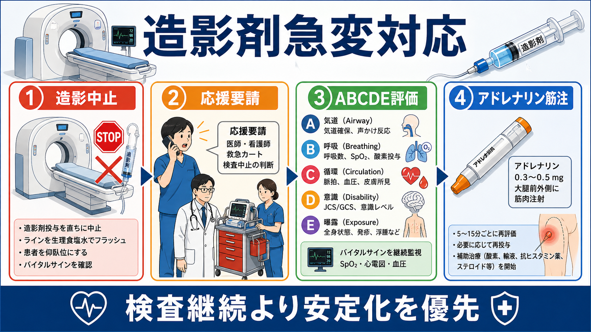
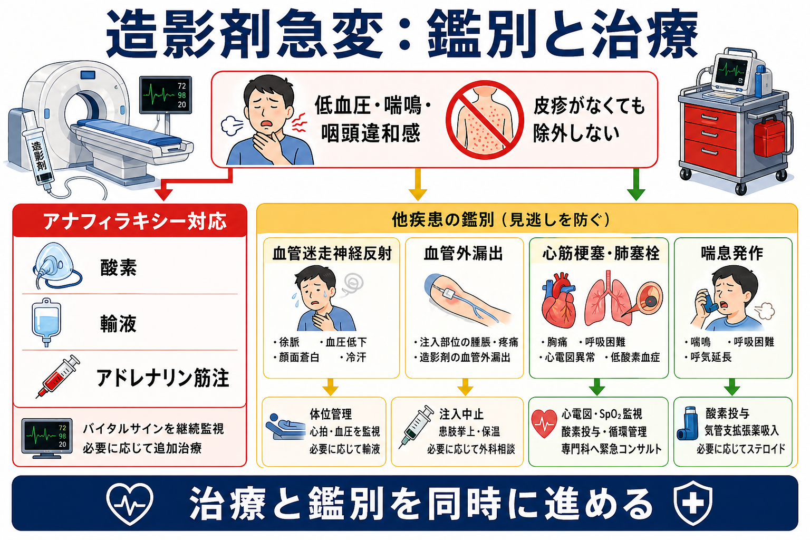
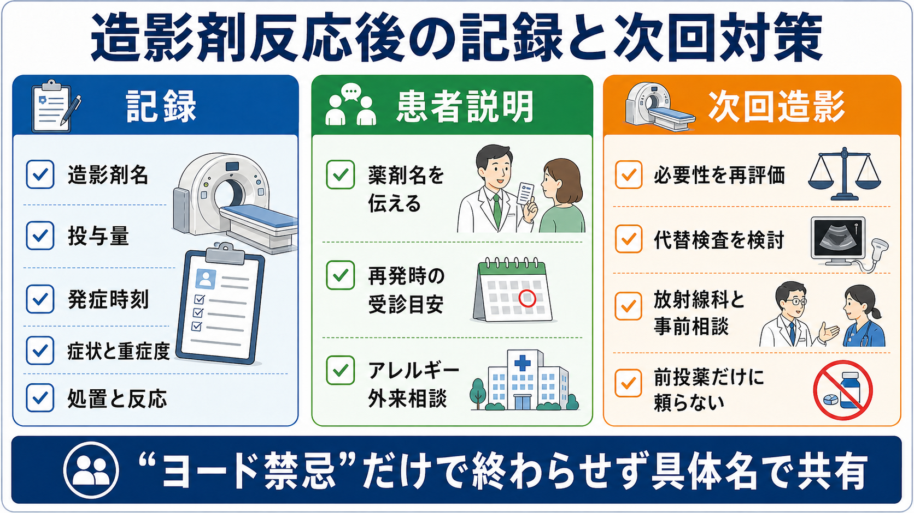

---
title: "造影剤アレルギー疑いの急変ではどう対応するか"
description: "造影検査中の急変で、造影中止、救急対応、記録、次回造影検査時の注意点を整理する。"
aliases:
  - "造影剤急変対応"
  - "造影剤アナフィラキシー"
tags:
  - 領域/救急・初期対応
  - 種類/クリニカルクエスチョン
  - 対象/研修医
question: "造影剤アレルギー疑いの急変ではどう対応するか"
clinical_area: "救急・初期対応"
audience: "研修医"
evidence_level: "guideline"
created: "2026-04-27"
updated: "2026-04-27"
enableToc: true
---

# 造影剤アレルギー疑いの急変ではどう対応するか

> このノートは研修医教育のための一般的整理であり、個別患者への診断・治療指示ではありません。急変時、判断に迷う場合、施設手順が関わる場合は上級医、救急チーム、放射線科、麻酔科・集中治療チームに早期相談してください。

## クリニカルクエスチョン

造影CT・造影MRIなどの検査中または直後に、低血圧、呼吸困難、喘鳴、咽頭違和感、蕁麻疹、嘔吐、意識変容などが出たとき、造影剤アレルギー疑いとして何を止め、何を先に行い、何を記録し、次回造影検査にどうつなげるか。

## まず結論

- 造影中または直後に急変したら、まず造影剤投与を止め、患者を直接確認し、応援要請、ABCDE評価、酸素、モニター、静脈路確保を同時に始める。検査継続より安定化を優先する。[1],[5],[6]
- 低血圧、気道症状、呼吸症状、強い消化器症状を伴う急性反応では、皮疹が乏しくてもアナフィラキシーとして扱う。治療判断を検査結果待ちにしない。[1],[2],[5]
- アナフィラキシーが疑わしければ、第一選択はアドレナリン筋注である。日本のアナフィラキシーガイドラインでは、0.1%アドレナリン（1 mg/mL）を大腿外側へ0.01 mg/kg、成人最大0.5 mgを目安に筋注する。[1],[2]
- 抗ヒスタミン薬やステロイドは補助療法であり、低血圧・気道・呼吸症状への初期治療としてアドレナリン筋注を置き換えない。[1],[5],[8]
- 急変後は「ヨード禁忌」とだけ記録せず、造影剤名、投与量、投与経路、発症時刻、症状、重症度、処置、反応を具体的に残す。次回は必要性、代替検査、造影剤変更、放射線科・アレルギー専門診療への相談を検討する。[5],[6]
- 日本での注意: 薬剤の濃度、適応、禁忌、院内救急カートの採用品、造影検査時の同意・説明、放射線科への連絡手順は施設差がある。国内添付文書、PMDA情報、院内プロトコルで確認する。[3],[4]

## 判断の型

1. **造影剤投与を止める**  
   造影剤の注入を止め、可能ならルートを生理食塩水でフラッシュし、患者を寝台上で安全な体位にする。急変時は「撮像完遂」ではなく「急変対応」へ切り替える。[5],[6]

2. **急性アレルギー様反応か、別の急変かを同時に考える**  
   造影剤反応は蕁麻疹、掻痒、顔面・咽頭浮腫、喘鳴、低血圧、嘔吐などで出るが、皮膚症状が目立たない重症例もある。血管迷走神経反射、血管外漏出、心筋梗塞、肺塞栓、喘息発作、低血糖、けいれんも並行して見る。[1],[5]

3. **重症ならアナフィラキシーとして治療を先行する**  
   急な低血圧、失神、喘鳴、嗄声、咽頭違和感、SpO2低下、反復嘔吐がある場合は、アナフィラキシーを上位に置く。アドレナリン筋注、酸素、輸液、気道対応、救急チーム要請を遅らせない。[1],[2],[5]

4. **記録と次回対策までを急変対応に含める**  
   症状が改善しても、薬剤名と反応内容が曖昧なままだと次回検査で同じリスクが繰り返される。放射線科、主治医、患者へ同じ情報が伝わる形で残す。[5],[6]

## 初期対応

- **応援要請**: 検査室内で一人対応にしない。放射線科医、救急チーム、看護師、上級医へ連絡し、救急カート、酸素、吸引、バッグバルブマスク、モニター、除細動器を準備する。[5],[6]
- **A/B**: 気道閉塞、嗄声、舌・咽頭浮腫、吸気性喘鳴、喘鳴、SpO2低下を確認する。高流量酸素を開始し、気道悪化が疑わしければ挿管可能なチームへ早めに相談する。[1],[5]
- **C**: 血圧、脈拍、末梢冷感、皮膚色、意識、尿量を確認し、太い静脈路を確保する。低血圧では仰臥位、下肢挙上、急速輸液を検討する。[1],[5]
- **アナフィラキシー疑い**: アドレナリン筋注を第一選択にする。日本の目安は0.1%アドレナリン（1 mg/mL）0.01 mg/kg、大腿外側筋注、成人最大0.5 mgである。[1],[2]
- **再評価**: 5-15分ごとに気道、呼吸、血圧、意識、皮膚、消化器症状を再評価し、改善不十分なら追加治療、ICU/救急外来への移動、持続的監視を相談する。[1],[5]
- **補助療法**: 抗ヒスタミン薬、気管支拡張薬、ステロイドは症状に応じて使うが、ショックや気道・呼吸障害への初期対応としてアドレナリン筋注を置き換えない。[1],[5],[8]

## 鑑別・見逃し

| 優先度 | 疾患・状態 | 見逃しやすい理由 | 手がかり |
|---|---|---|---|
| 高 | アナフィラキシー | 皮疹がないと否定されやすい | 造影直後、低血圧、喘鳴、咽頭違和感、嘔吐、失神 |
| 高 | 血管迷走神経反射 | 造影剤反応と時間的に重なる | 徐脈、顔面蒼白、冷汗、仰臥位で改善 |
| 高 | 造影剤血管外漏出 | 全身急変ではなく局所症状に見える | 注入部痛、腫脹、皮膚緊満、神経血管障害 |
| 高 | 心筋梗塞・肺塞栓・不整脈 | 検査前から進行していた急変が重なる | 胸痛、心電図変化、SpO2低下、頻脈、ショック |
| 中 | 喘息発作・COPD増悪 | 喘鳴だけで造影剤反応と決めやすい | 既往、感染症状、呼気延長、気管支拡張薬反応 |
| 中 | 不安・過換気・パニック | 軽症反応と混同される | しびれ、過呼吸、血圧維持、SpO2維持 |

## 検査

| 検査 | 目的 | 注意点 |
|---|---|---|
| バイタルサイン連続監視 | 反応の重症度と治療反応を見る | 血圧、SpO2、心電図、呼吸数、意識を繰り返す |
| 心電図 | ACS、不整脈、低酸素の影響を確認 | 胸痛、低血圧、意識変容では早めに行う |
| 血液ガス・乳酸 | 低酸素、ショック、代謝性異常を確認 | 採血でアドレナリン筋注を遅らせない |
| 血算、生化学、腎機能、電解質 | 鑑別、輸液・薬剤、次回造影計画の基礎情報 | 結果待ちで初期治療を止めない |
| 血清トリプターゼ | アナフィラキシー診断の補助 | 急性期とベースライン比較が有用だが、陰性でも除外しない。[1],[8] |
| 注入部観察 | 血管外漏出の評価 | 疼痛、腫脹、皮膚色、末梢循環、神経症状を記録 |

## 治療・マネジメント

- **軽症の皮膚症状のみ**: 掻痒、限局性蕁麻疹のみで気道・呼吸・循環症状がなければ、観察、抗ヒスタミン薬、再評価を行う。ただし進行があれば直ちに重症対応へ移る。[5],[6]
- **中等症以上または進行性**: 広範な蕁麻疹、顔面・咽頭症状、喘鳴、反復嘔吐、低血圧、意識変容があれば、アナフィラキシーとして酸素、アドレナリン筋注、輸液、救急チーム要請を並行する。[1],[5]
- **低血圧・ショック**: 仰臥位、下肢挙上、急速輸液、アドレナリン筋注を行い、反応不十分なら上級医・集中治療管理下で昇圧薬や気道確保を検討する。[1],[5]
- **気道症状**: 嗄声、咽頭違和感、舌・口唇浮腫、吸気性喘鳴は悪化が早い。挿管困難になり得るため、麻酔科・救急・耳鼻科など施設の気道チームへ早期相談する。[1],[5]
- **血管外漏出**: 造影剤注入を止め、注入部の状態、疼痛、神経血管障害を確認する。重症の腫脹、皮膚障害、コンパートメント症候群疑いでは外科系相談を行う。[5]
- **日本での注意**: アドレナリン製剤は、ボスミン注、アドレナリン注シリンジ、自己注射製剤などで濃度、適応、投与経路が異なる。急変時は院内手順と添付文書を確認し、取り違えを避ける。[3]
- **次回造影計画**: 反応歴がある患者では、前投薬だけで安全が保証されるわけではない。検査の必要性、非造影CT、MRI、超音波、核医学、造影剤種類の変更、実施場所、監視体制を放射線科と事前に相談する。[5],[6]

## 図解

## 指導医に確認するポイント

- この急変はアナフィラキシーとして扱うべき重症度か、別疾患の同時評価をどこまで進めるか。
- アドレナリン筋注の用量、製剤、投与部位、再投与間隔が院内手順と合っているか。
- 検査室から救急外来、ICU、病棟へどのタイミングで移動するか。
- 造影剤名、投与量、発症時刻、処置、反応を誰が診療録・放射線部門システム・アレルギー欄へ記録するか。
- 次回造影の可否、代替検査、放射線科・アレルギー専門診療への相談をどう手配するか。

## 患者説明

- 「造影剤を使った直後に、血圧や呼吸に影響する急な反応が疑われたため、検査を止めて救急対応を優先しました。」
- 「皮膚の発疹が目立たなくても、急な血圧低下や息苦しさがある場合は重いアレルギー反応として扱うことがあります。」
- 「次に造影検査を受ける可能性がある時は、今回使った造影剤名と起きた症状を医療者に伝えてください。」
- 「今後は造影検査が本当に必要か、代わりの検査でよいか、放射線科と相談して計画します。前もって薬を飲めば必ず安全という意味ではありません。」

## ピットフォール

- 造影を最後まで入れることを優先して、患者確認と応援要請が遅れる。
- 蕁麻疹がないためアナフィラキシーを否定する。
- 抗ヒスタミン薬やステロイドを先に使い、低血圧・気道・呼吸症状へのアドレナリン筋注が遅れる。
- 採血、心電図、画像確認を待って初期治療を遅らせる。
- 「ヨードアレルギー」「造影剤禁忌」だけを記録し、具体的な造影剤名、症状、重症度、処置、反応を残さない。
- 次回検査時に前投薬だけで対応可能と判断し、代替検査や実施体制を検討しない。

## 関連ノート

- [[アナフィラキシーによるショックをどう見抜き対応するか]]
- [[ショック患者を見たら最初に何をするか]]
- [[救急患者で上級医を呼ぶタイミングはどう判断するか]]
- [[救急外来で初期検査セットはどのように選ぶか]]

関連ノート候補:

- 造影CT前に確認すること
- アナフィラキシーでアドレナリン筋注後は何を観察するか
- 造影剤反応歴がある患者の次回検査をどう計画するか

## MOC更新候補

- [[MOC｜救急・初期対応]]
- MOC｜検査・画像・手技.md（本サイト外）
- MOC｜膠原病・免疫・アレルギー.md（本サイト外）
- MOC｜薬剤・処方・副作用.md（本サイト外）

## 参考文献

[1] 日本アレルギー学会 Anaphylaxis対策委員会. アナフィラキシーガイドライン2022. https://www.jsaweb.jp/modules/news_topics/index.php?content_id=688

[2] 厚生労働省 / PMDA. 重篤副作用疾患別対応マニュアル アナフィラキシー. 令和8年2月改定. https://www.pmda.go.jp/files/000279383.pdf

[3] PMDA. ボスミン注1mg 医療用医薬品情報. https://www.pmda.go.jp/PmdaSearch/rdSearch/02/2451400A1030?user=1

[4] PMDA. イオパミロン注（イオパミドール）医療用医薬品情報. https://www.pmda.go.jp/PmdaSearch/rdSearch/02/7219412A6071?user=1

[5] American College of Radiology. ACR Manual on Contrast Media 2026. https://www.acr.org/Clinical-Resources/Clinical-Tools-and-Reference/Contrast-Manual

[6] European Society of Urogenital Radiology Contrast Media Safety Committee. ESUR Guidelines on Contrast Media. https://www.esur.org/esur-guidelines-on-contrast-media/

[7] 日本腎臓学会, 日本医学放射線学会, 日本循環器学会. 腎障害患者におけるヨード造影剤使用に関するガイドライン2018. Minds. https://minds.jcqhc.or.jp/summary/c00490/

[8] Cardona V, Ansotegui IJ, Ebisawa M, et al. World Allergy Organization Anaphylaxis Guidance 2020. World Allergy Organization Journal. 2020;13(10):100472. https://doi.org/10.1016/j.waojou.2020.100472

## 更新ログ

- 2026-04-27: 初版作成。造影中止、急変対応、鑑別、記録、次回造影検査時の注意点を整理し、imagegen由来のラスター図解3枚を添付。
