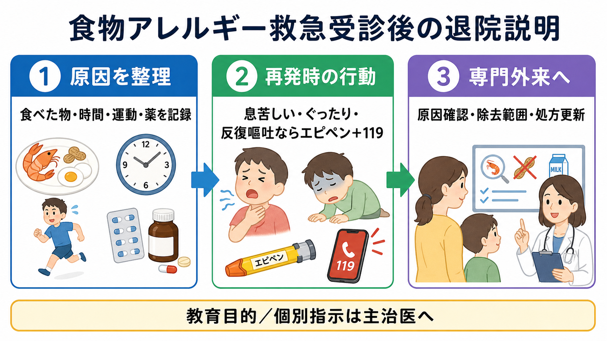
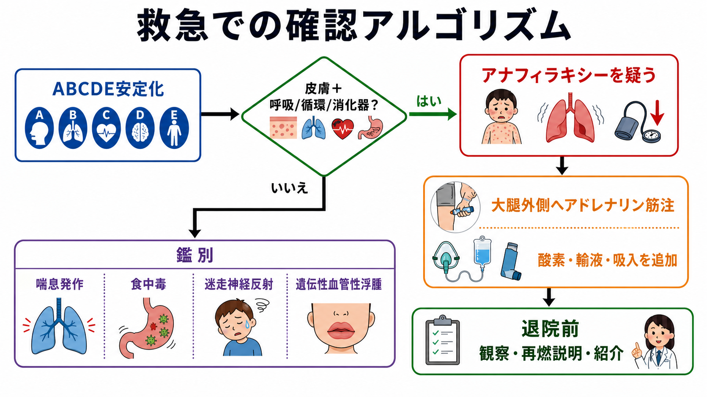
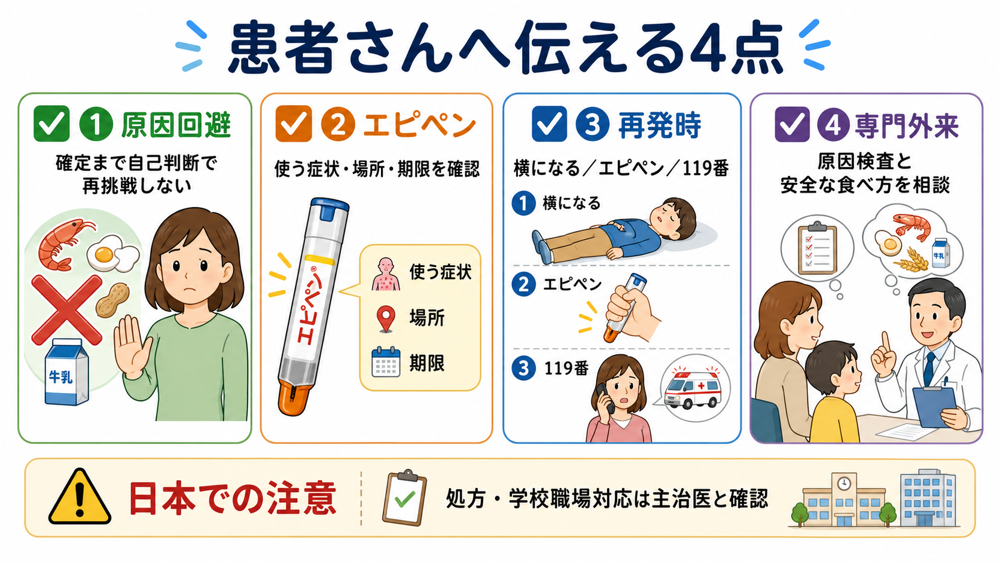

---
title: "食物アレルギーによる救急受診で何を説明するか"
description: "原因回避、エピペン、再発時対応、専門外来紹介を含めた食物アレルギー・アナフィラキシー後の退院指導を整理する。"
aliases:
  - "食物アレルギー退院指導"
tags:
  - 領域/救急・初期対応
  - 種類/クリニカルクエスチョン
  - 対象/研修医
question: "食物アレルギーによる救急受診で何を説明するか"
clinical_area: "救急・初期対応"
audience: "研修医"
evidence_level: "guideline/review"
created: "2026-04-27"
updated: "2026-04-27"
enableToc: true
---

# 食物アレルギーによる救急受診で何を説明するか

> このノートは研修医教育のための一般的整理であり、個別患者の診断・治療指示ではありません。緊急性が高い、判断に迷う、施設方針が関わる場合は上級医・専門科に相談してください。

## クリニカルクエスチョン

食物アレルギーまたは食物誘発アナフィラキシーで救急受診した患者に、退院前に何を説明し、どのように専門外来へつなぐか。

## まず結論

- 退院説明は「原因候補の整理」「再発時の行動」「アドレナリン自己注射薬の扱い」「専門外来紹介」の4点に絞って、患者・家族に復唱してもらう。[1][5][7]
- アナフィラキシーを疑う症状、特に気道・呼吸・循環症状、ぐったり、反復嘔吐などを説明し、再発時はためらわず救急要請につなげる。[1][5]
- エピペンはアナフィラキシーの補助治療薬であり、使用後も医療機関受診が必要である。日本では0.15 mgと0.3 mg製剤があり、処方・指導には国内添付文書と施設運用を確認する。[3]
- 原因食物は「疑わしいものを記録し、専門評価まで自己判断で再摂取しない」と説明する一方、不要な広範囲除去は栄養・生活面の不利益があるため、除去範囲は専門外来で再評価する。[2]
- 小児では学校・園、成人では職場・外食・運動・飲酒・NSAIDsなどの共因子を含めた生活場面の再発予防を確認する。国内ではアレルギー疾患対策基本指針に沿った地域・学校等との連携も意識する。[2][4][5][9]

## 判断の型

1. **これはアナフィラキシーだったかを言語化する。** 皮膚症状だけでなく、呼吸、循環、消化器、意識変容を確認し、皮膚症状が目立たない重症例もあると説明する。[1][5]
2. **退院してよい状態かを確認する。** 症状の再燃、アドレナリン反復投与、喘息合併、遠方居住、介助者不在、小児などは観察・入院・上級医相談の閾値を下げる。[1][7]
3. **原因を「確定」ではなく「候補」として渡す。** 食べた物、摂取時刻、運動、入浴、飲酒、NSAIDs、感染、月経、同時摂取物を記録してもらう。[2][5]
4. **再発時の行動を短く決める。** 「横になる、エピペンを使う、119番、使用済みエピペンを持参」を患者説明に入れる。[3][5][7]
5. **専門外来で完結させる項目を明確にする。** 原因検査、経口負荷試験の適応、除去範囲、栄養指導、エピペン更新、学校・職場対応はアレルギー専門外来で再評価する。[2][4][7]

## 初期対応

- 退院指導の前に、急性期対応が完了していることを確認する。アナフィラキシーを診断または強く疑う場合、第一選択は大腿前外側へのアドレナリン筋注であり、抗ヒスタミン薬やステロイドは代替にならない。[1][5][8]
- 気道狭窄、喘鳴、SpO2低下、低血圧、意識障害、反復嘔吐、急速な進行があれば、退院説明よりも再評価・再治療・上級医相談を優先する。[1][5]
- 観察時間は一律ではない。NICEは成人・16歳以上で6-12時間観察を原則とし、反応が速やかに制御され適切な退院後ケアが整う場合に短縮を考慮するとしている。日本でも施設方針、重症度、再燃リスクで判断する。[7]
- トリプターゼは全例必須ではないが、診断が不確実、重症、反復、特発性、肥満細胞疾患を疑う場合は、急性期採血とベースライン比較の要否を上級医・専門科と相談する。[6][8]
- 退院時は、診療録と紹介状に「摂取物、時刻、症状の時間経過、治療反応、アドレナリン使用の有無、再燃の有無」を残す。[2][7]

## 鑑別・見逃し

| 優先度 | 疾患・状態 | 見逃さない理由 | 手がかり |
|---|---|---|---|
| 高 | アナフィラキシー再燃・二相性反応 | 一度改善しても数時間後に再燃しうる | 呼吸器症状、低血圧、反復嘔吐、アドレナリン複数回使用 |
| 高 | 喘息発作 | 食物アレルギーと併存すると重症化しやすい | 喘鳴、呼気延長、既往、吸入薬使用歴 |
| 高 | 気道浮腫・喉頭浮腫 | 窒息リスクがある | 嗄声、咽頭違和感、吸気性喘鳴、舌・口唇腫脹 |
| 中 | 食中毒・感染性胃腸炎 | 嘔吐・腹痛のみでは鑑別が必要 | 同席者発症、発熱、下痢、潜伏時間 |
| 中 | 迷走神経反射 | 低血圧・失神をアナフィラキシーと誤認しうる | 徐脈、冷汗、臥位で速やかに改善、皮膚膨疹なし |
| 中 | 遺伝性血管性浮腫 | アドレナリンや抗ヒスタミン薬の反応が乏しいことがある | 蕁麻疹なし、腹痛発作、家族歴、反復する浮腫 |
| 中 | 食物依存性運動誘発アナフィラキシー | 食物単独では再現しないことがある | 小麦・甲殻類など、食後運動、飲酒、NSAIDs併用 |

## 検査

| 検査 | 目的 | 注意点 |
|---|---|---|
| バイタル・SpO2・意識評価 | 重症度と退院可否の判断 | 正常化しても再燃リスク説明は必要 |
| 血清トリプターゼ | アナフィラキシー診断補助、肥満細胞疾患評価 | 食物アナフィラキシーでは上昇しないこともある。ベースライン比較が重要。[6][8] |
| 血液検査・血糖・乳酸など | ショック、鑑別、合併症評価 | 安定化前に検査を優先しない |
| 特異的IgE・皮膚プリックテスト | 原因候補の評価 | 救急外来で確定診断を急がない。検査陽性だけで除去を広げない。[2] |
| 食物経口負荷試験 | 安全な摂取可否、除去解除の判断 | 専門施設で適応とリスクを判断する。[2] |

## 治療・マネジメント

- **原因回避:** 退院時点では「疑わしい食品・同時条件を避ける」と伝える。確定前に自己判断で再挑戦しないが、検査なしに関連食品を広く禁止しすぎない。[2]
- **再発時対応:** 呼吸苦、嗄声、喘鳴、ぐったり、失神、強い腹痛・反復嘔吐、急速に広がる蕁麻疹などがあれば、エピペンの適応を含めて救急要請するよう説明する。[1][3][5]
- **エピペン:** 日本の添付文書では、蜂毒、食物、薬物などに起因するアナフィラキシー反応に対する補助治療として用いられる。0.15 mgは体重15 kg以上30 kg未満、0.3 mgは30 kg以上が基本で、使用後は直ちに医師の診療を受ける必要がある。[3]
- **指導方法:** 口頭説明だけでなく、トレーナーや実物見本で「安全キャップ、太もも前外側、衣服の上から可、使用後の受診」を確認する。患者・家族に言い返してもらう teach-back が有用である。[5][7]
- **処方数:** NICEは退院前に2本のアドレナリン注射器処方と常時携帯を推奨しているが、日本ではエピペンの処方資格、院内採用、保険・自己負担、在庫、更新期限の運用が施設で異なる。救急外来単独で完結できない場合は、当日処方可否と専門外来予約を上級医に確認する。[3][7]
- **専門外来紹介:** 原因食物の確定、食事指導、栄養評価、経口負荷試験、エピペン継続、学校・職場対応、アクションプラン作成を目的に紹介する。[2][4][7]
- **日本での注意:** 海外資料では「退院時にアドレナリン自己注射薬を2本処方」が明確に推奨されることが多い。一方、日本ではエピペン処方には製剤・体重区分・処方医講習・同意書など国内運用が関わるため、救急医は処方可能性だけでなく、専門外来へ確実につなぐ導線を整える。[3][7][9]

## 図解

## 指導医に確認するポイント

- この症例はアナフィラキシーとして扱うべきか、単純な急性蕁麻疹としてよいか。
- 観察継続、入院、小児科・アレルギー科・救急科への相談が必要か。
- エピペンを救急外来で処方できる施設運用か。処方できない場合、いつ・どこで処方評価するか。
- 紹介状に原因候補、時間経過、治療内容、再燃リスク、患者説明内容が入っているか。
- 学校、園、職場、介護施設、遠方居住、独居など、退院後に再発対応が遅れる条件がないか。

## 患者説明

- 「今日の症状は、食べ物がきっかけの強いアレルギー反応だった可能性があります。原因は今日だけでは確定できないため、食べた物、時間、運動、薬、体調をメモして専門外来で確認しましょう。」
- 「息苦しさ、声のかすれ、ぐったり、失神、強い腹痛や繰り返す嘔吐が出たら、軽い発疹だけと考えず、横になって助けを呼び、エピペンを持っている場合は説明された通りに使って119番してください。」
- 「エピペンは使ったら終わりではなく、救急受診までの補助です。使った後は症状がよくなっても医療機関で確認が必要です。」[3]
- 「原因が分かるまでは疑わしい食べ物を自己判断で試さないでください。ただし、必要以上の除去は栄養や生活に影響するため、どこまで避けるかは専門外来で相談しましょう。」[2]
- 「学校・園・職場には、主治医の指示書や対応方法を共有する必要があります。次の外来で、食事、薬、エピペン、緊急連絡先を確認しましょう。」[4]

## ピットフォール

- 発疹が消えたことだけで退院可と判断する。気道・呼吸・循環・消化器症状と再燃リスクを確認する。
- 抗ヒスタミン薬やステロイドを使ったため、アドレナリンが不要だったと説明してしまう。アナフィラキシーの第一選択はアドレナリン筋注である。[1][5][8]
- 「原因はこの食品」と断定して、専門評価なしに広範囲除去を指示する。
- エピペンの処方だけで安心し、使う症状、使う場所、使用後受診、期限、保管、携帯方法を確認しない。
- 海外ガイドラインの2本処方やEMS運用を、日本の処方資格・薬剤規格・救急体制の差を説明せずそのまま当てはめる。
- 小児で学校・園への共有を忘れる。成人でも職場、外食、運動、飲酒、NSAIDsなどの共因子確認を忘れる。

## 関連ノート

- 関連ノート候補: `アナフィラキシーでアドレナリンをいつ使うか`
- 関連ノート候補: `エピペン処方後の患者説明をどう行うか`
- 関連ノート候補: `食物依存性運動誘発アナフィラキシーをどう疑うか`
- 関連ノート候補: `急性蕁麻疹とアナフィラキシーをどう見分けるか`

## MOC更新候補

- [[MOC｜救急・初期対応]]
- MOC｜アレルギー・膠原病.md（本サイト外）
- MOC｜小児・産婦人科.md（本サイト外）

## 参考文献

[1] 一般社団法人日本アレルギー学会 Anaphylaxis対策委員会. アナフィラキシーガイドライン2022. 2022/2023修正版. https://www.jsaweb.jp/uploads/files/Web_AnaGL_2023_0301.pdf

[2] 日本小児アレルギー学会食物アレルギー委員会. 食物アレルギー診療ガイドライン2021. Mindsガイドラインライブラリ. https://minds.jcqhc.or.jp/summary/c00691/

[3] PMDA. エピペン注射液0.15mg／エピペン注射液0.3mg 添付文書・患者向医薬品ガイド. https://www.pmda.go.jp/PmdaSearch/rdSearch/02/2451402G3026?user=1

[4] 文部科学省. アレルギー疾患対応／学校のアレルギー疾患に対する取り組みガイドライン・学校給食における食物アレルギー対応指針. https://www.mext.go.jp/a_menu/kenko/hoken/1353630.htm

[5] Cardona V, Ansotegui IJ, Ebisawa M, et al. World Allergy Organization Anaphylaxis Guidance 2020. World Allergy Organ J. 2020;13(10):100472. https://doi.org/10.1016/j.waojou.2020.100472

[6] Golden DBK, Wang J, Waserman S, et al. Anaphylaxis: A 2023 practice parameter update. Ann Allergy Asthma Immunol. 2024;132(2):124-176. https://doi.org/10.1016/j.anai.2023.09.015

[7] National Institute for Health and Care Excellence. Anaphylaxis: assessment and referral after emergency treatment. NICE guideline CG134. Last updated 2020. https://www.nice.org.uk/guidance/cg134

[8] Muraro A, Worm M, Alviani C, et al. EAACI guidelines: Anaphylaxis (2021 update). Allergy. 2022;77(2):357-377. https://doi.org/10.1111/all.15032

[9] 厚生労働省. アレルギー疾患対策の推進に関する基本的な指針. https://www.mhlw.go.jp/web/t_doc?dataId=00010380&dataType=0&pageNo=1

## 更新ログ

- 2026-04-27: 初版作成。
