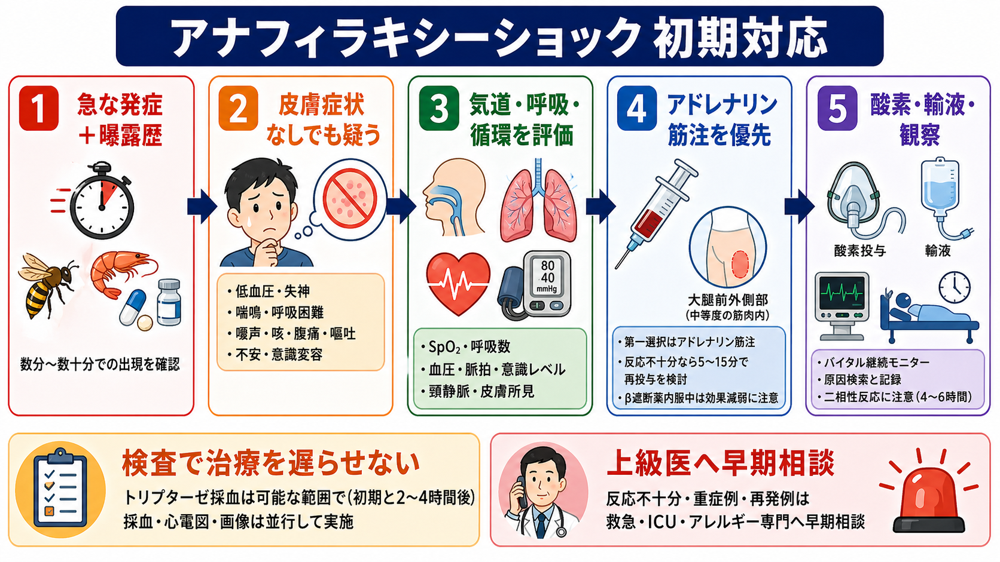
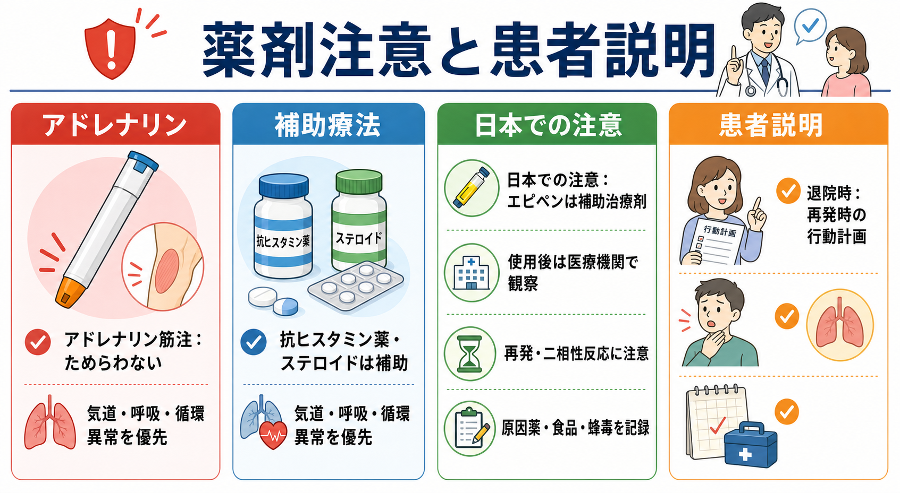

---
title: "アナフィラキシーによるショックをどう見抜き対応するか"
description: "皮膚症状が乏しいアナフィラキシーショックも想定し、アドレナリン筋注を遅らせない初期判断を整理する。"
aliases:
  - "アナフィラキシーショック"
tags:
  - 領域/救急・初期対応
  - 種類/クリニカルクエスチョン
  - 対象/研修医
question: "アナフィラキシーによるショックをどう見抜き対応するか"
clinical_area: "救急・初期対応"
audience: "研修医"
evidence_level: "guideline"
created: "2026-04-27"
updated: "2026-04-27"
enableToc: true
---

# アナフィラキシーによるショックをどう見抜き対応するか

> このノートは研修医教育のための一般的整理であり、個別患者の診断・治療指示ではありません。緊急性が高い、判断に迷う、施設方針が関わる場合は上級医・専門科に相談してください。

## クリニカルクエスチョン

皮膚症状が目立たない、または主訴が低血圧・呼吸困難・失神だけに見える患者で、アナフィラキシーによるショックをどう疑い、アドレナリン筋注を遅らせずに対応するか。

## まず結論

- アナフィラキシーは「急な発症」「誘因への曝露」「気道・呼吸・循環・消化器・皮膚粘膜症状の組み合わせ」で臨床診断する。皮膚症状がないことだけで除外しない。[1],[4]
- 低血圧、失神、意識変容、喘鳴、嗄声、咽頭違和感、持続する強い腹痛・反復嘔吐が急に出たら、まずアナフィラキシーショックを鑑別の上位に置く。[1],[2]
- 診断した、または強く疑う場合の第一選択はアドレナリン筋注であり、抗ヒスタミン薬・ステロイド・検査を先にして筋注を遅らせない。[1],[4],[6]
- 日本アレルギー学会ガイドライン2022では、0.1%アドレナリン 1 mg/mLを大腿部中央前外側へ 0.01 mg/kg、最大成人0.5 mg・小児0.3 mgを直ちに筋注する整理である。[1]
- 酸素、仰臥位または呼吸状態に応じた体位、大量輸液、原因曝露の中止、モニター、再評価、上級医・救急・ICUへの早期相談を同時並行で行う。[1],[4]
- トリプターゼ、心電図、画像、感染・出血検索は重要だが、治療開始後に「診断の補助」「鑑別の除外」「経過記録」の目的で行う。[1],[5]

## 判断の型

1. **時間軸を見る**  
   数分から数時間以内に、食品、薬剤、造影剤、蜂刺傷、ラテックス、運動、処置、輸血などの後で悪化していないかを確認する。[1],[4]

2. **皮膚ではなくABCで重症度を見る**  
   蕁麻疹・紅斑が乏しくても、嗄声、吸気性喘鳴、喘鳴、SpO2低下、低血圧、末梢冷感、失神、意識変容があればショックとして扱う。[1],[2]

3. **迷ったら「治療してから詰める」**  
   アナフィラキシーが強く疑われ、循環または呼吸が崩れている場面では、検査結果を待たずにアドレナリン筋注を優先する。[1],[4],[6]

4. **鑑別は並行して潰す**  
   敗血症、出血、心筋梗塞・不整脈、肺塞栓、気胸、血管迷走神経反射、喘息発作、異物・喉頭浮腫を同時に評価する。[1],[5]

5. **反応を時間で再評価する**  
   アドレナリン筋注後も呼吸・循環が改善しない、または悪化する場合は、5-15分ごとの再投与、輸液、昇圧薬、気道確保、ICU管理を上級医と検討する。[1],[4]

## 初期対応

- 応援を呼び、救急カート、酸素、吸引、バッグバルブマスク、挿管準備、モニター、静脈路を確保する。
- 原因薬剤・輸液・造影剤・輸血・食物摂取を可能な範囲で中止し、蜂針など除去できる誘因は処置する。[1],[4]
- ABCDEで、気道狭窄、呼吸仕事量、SpO2、血圧、脈拍、意識、皮膚温、尿量を確認する。
- 低血圧や失神があれば仰臥位を基本にし、下肢挙上を検討する。嘔吐や呼吸困難が強い場合は誤嚥・換気を優先して体位を調整する。[1],[4]
- アナフィラキシーと診断または強く疑う場合は、0.1%アドレナリン 1 mg/mLを大腿部中央前外側へ筋注する。国内ガイドラインの目安は 0.01 mg/kg、最大成人0.5 mg・小児0.3 mgである。[1]
- 酸素投与、等張晶質液の急速投与、気管支攣縮への吸入β2刺激薬、上気道浮腫への気道確保準備を並行する。[1],[4]
- 心停止または心停止に近い状態を除き、初回対応としてのアドレナリン静注ボーラスは不整脈・高血圧などの有害事象リスクがあるため避け、必要時は監視下で経験者が希釈・持続投与を扱う。[1],[4]

## 鑑別・見逃し

- **皮膚症状がないアナフィラキシー**  
  急な低血圧、気管支攣縮、上気道閉塞、強い消化器症状では、典型的な蕁麻疹がなくても疑う。[1],[4]

- **血管迷走神経反射**  
  徐脈、冷汗、顔面蒼白、仰臥位で速やかに改善する経過は示唆的。ただし曝露後の呼吸器症状や持続する低血圧があればアナフィラキシーを優先する。

- **敗血症・出血・心原性ショック**  
  発熱、感染巣、出血、胸痛、心電図異常、心エコー所見を確認する。アナフィラキシーとして処置しながら、矛盾する所見が出たら診断を更新する。

- **喘息発作・COPD急性増悪**  
  喘鳴だけに見えても、食物・薬剤・蜂毒・造影剤後の急な全身症状、低血圧、皮膚粘膜症状、腹痛・嘔吐があればアナフィラキシーを考える。

- **ACE阻害薬関連血管性浮腫・遺伝性血管性浮腫**  
  蕁麻疹を伴わない顔面・舌・喉頭浮腫では鑑別に入れる。気道評価と耳鼻科・麻酔科相談を遅らせない。

## 検査

- **検査は治療を遅らせない**  
  アナフィラキシーは臨床診断で初期治療を開始する。採血や画像のためにアドレナリン筋注を待たない。[1],[4]

- **トリプターゼ**  
  診断補助として有用なことがあるが、陰性でも除外できない。可能なら急性期と後日のベースラインを比較できる形で採血を検討する。[4],[5]

- **ショック鑑別のための検査**  
  血算、電解質、腎肝機能、血糖、血液ガス、乳酸、心電図、胸部X線、心エコー、感染・出血検索は、経過と矛盾があるときや反応不十分なときに特に重要。

- **誘因同定のための情報**  
  発症時刻、摂取物、処方薬、注射薬、造影剤、消毒薬、ラテックス、蜂刺傷、運動、月経、飲酒、NSAIDs、β遮断薬・ACE阻害薬の内服を記録する。[1],[4]

## 治療・マネジメント

- **第一選択はアドレナリン筋注**  
  国内ガイドラインは、診断または強く疑う場合に大腿部中央前外側へ 0.01 mg/kg、最大成人0.5 mg・小児0.3 mgの筋注を推奨している。[1]

- **再投与と難治例**  
  効果が短時間で減弱するため、反応不十分なら5-15分ごとの再投与を検討する。複数回筋注を要する、低血圧が遷延する、気道狭窄が進む場合は、救急・ICU・麻酔科と持続アドレナリン、昇圧薬、気道確保を相談する。[1],[4]

- **補助療法の位置づけ**  
  抗ヒスタミン薬は皮膚症状の緩和、ステロイドは遅発・二相性反応への期待として使われることがあるが、急性期の呼吸・循環破綻を速やかに改善する主治療ではない。これらでアドレナリンを置き換えない。[6]

- **観察と二相性反応**  
  重症例、アドレナリン複数回投与、喘息・心血管疾患、原因不明、遠方帰宅、再燃リスクが高い場合は長めの観察や入院を検討する。米国系practice parameterでは、重症または反復アドレナリンが二相性反応のリスク因子とされる。[6]

- **日本での注意**  
  医薬品関連では、厚生労働省/PMDAの重篤副作用疾患別対応マニュアルも、初期症状への早期対応と医療者向け鑑別・治療整理を確認する資料になる。[2],[3]  
  エピペンは日本の添付文書上、蜂毒・食物・薬物などによるアナフィラキシー反応への「補助治療剤」であり、使用後も医療機関での評価・観察が必要である。[8]  
  また、アドレナリン製剤の添付文書には抗精神病薬・α遮断薬などとの禁忌記載があるが、アナフィラキシーショックの救急治療時は例外とされる記載がある。現場では添付文書、施設手順、上級医判断を確認する。[7],[9]

## 図解

## 指導医に確認するポイント

- この患者でアナフィラキシーを最も疑う根拠と、同時に除外すべきショック鑑別は何か。
- アドレナリン筋注量、再投与間隔、使用製剤、投与部位が施設手順と合っているか。
- 気道確保、ICU入室、麻酔科・耳鼻科・救急科・アレルギー専門科相談のタイミング。
- 原因薬剤・造影剤・食品・蜂毒の記録、禁忌登録、紹介状、再発時行動計画をどう残すか。
- β遮断薬内服、妊娠、高齢、冠動脈疾患、喘息合併などで注意すべき点。

## 患者説明

- 「急なアレルギー反応で、呼吸や血圧に影響して命に関わることがあります。皮膚の発疹が目立たない場合でも起こります」と説明する。
- 「最初に効く治療はアドレナリンの筋肉注射で、抗アレルギー薬やステロイドは補助的に使います」と伝える。
- 「一度よくなっても再び悪くなることがあるため、しばらく観察します」と説明する。
- 「原因候補、発症時刻、食べた物、使った薬、蜂刺され、造影剤、運動などを一緒に確認します」と共有する。
- 帰宅時は再発時の受診行動、エピペン処方・使用指導の要否、アレルギー専門外来フォローを上級医と相談する。[4],[8]

## ピットフォール

- 蕁麻疹がないために、低血圧・喘鳴・失神を別疾患だけで説明してしまう。
- 抗ヒスタミン薬やステロイドを先に投与し、アドレナリン筋注が遅れる。
- 採血、CT、心電図、胸部X線をそろえるまで治療開始を待つ。
- アドレナリンの濃度、投与経路、投与量を取り違える。筋注は 1 mg/mL製剤を大腿部中央前外側へ行う整理をチームで確認する。[1],[4]
- 改善後に観察・原因記録・再発時説明・専門外来フォローを省略する。
- 「アドレナリンは危険」という不安だけで、ショックに対する第一選択薬を控える。過量投与や静注ボーラスは危険だが、適切な筋注を遅らせることも危険である。[1],[4]

## 関連ノート

現時点では未作成ノートへのリンクは張らない。

関連ノート候補:

- アナフィラキシーを疑ったらアドレナリンをいつ打つか
- アナフィラキシーでアドレナリン筋注後は何を観察するか
- アナフィラキシーと血管迷走神経反射をどう見分けるか
- β遮断薬内服中のアナフィラキシーでは何に注意するか
- ショック患者を見たら最初に何をするか

## MOC更新候補

- [[MOC｜救急・初期対応]]
- [[MOC｜ショック・循環不全]]
- MOC｜アレルギー.md（本サイト外）

## 参考文献

[1] 日本アレルギー学会Anaphylaxis対策委員会. アナフィラキシーガイドライン2022. 2022（2023年修正版）. https://www.jsaweb.jp/uploads/files/Web_AnaGL_2023_0301.pdf

[2] 厚生労働省. 重篤副作用疾患別対応マニュアル アナフィラキシー. 2008年3月（2019年9月改定、2026年2月改定）. https://www.pmda.go.jp/files/000279383.pdf

[3] PMDA. 重篤副作用疾患別対応マニュアル（医療関係者向け）. 2026年2月改定掲載. https://www.pmda.go.jp/safety/info-services/drugs/adr-info/manuals-for-hc-pro/0001.html

[4] Cardona V, Ansotegui IJ, Ebisawa M, et al. World Allergy Organization Anaphylaxis Guidance 2020. World Allergy Organization Journal. 2020;13(10):100472. https://doi.org/10.1016/j.waojou.2020.100472

[5] Muraro A, Worm M, Alviani C, et al. EAACI guideline: Anaphylaxis (2021 update). Allergy. 2022;77(2):357-377. https://doi.org/10.1111/all.15032

[6] Shaker MS, Wallace DV, Golden DBK, et al. Anaphylaxis-a 2020 practice parameter update, systematic review, and GRADE analysis. Journal of Allergy and Clinical Immunology. 2020;145(4):1082-1123. https://doi.org/10.1016/j.jaci.2020.01.017

[7] PMDA. ボスミン注1mg 医療用医薬品情報. 2026年3月改訂. https://www.pmda.go.jp/PmdaSearch/rdSearch/02/2451400A1030?user=1

[8] PMDA. エピペン注射液0.15mg／エピペン注射液0.3mg 医療用医薬品情報. 2026年3月改訂. https://www.pmda.go.jp/PmdaSearch/rdSearch/02/2451402G3026?user=1

[9] PMDA. アドレナリン注0.1%シリンジ「テルモ」 医療用医薬品情報. 2026年3月改訂. https://www.pmda.go.jp/PmdaSearch/rdSearch/02/2451402G1040?user=1

## 更新ログ

- 2026-04-27: 初版作成。日本アレルギー学会ガイドライン2022、厚生労働省/PMDA資料、WAO/EAACI/AAAAI-ACAAI系資料、PMDA添付文書を確認。
