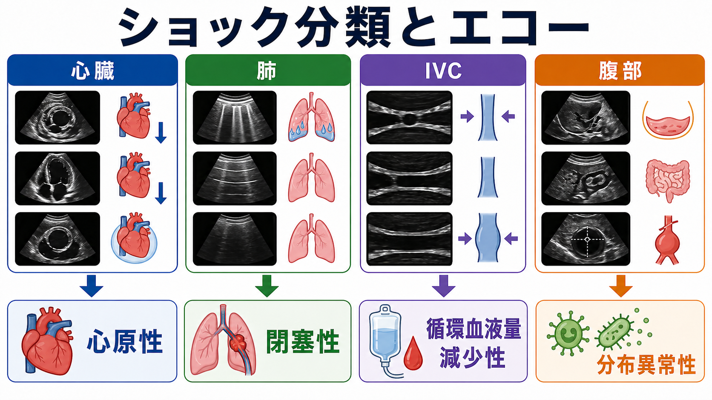
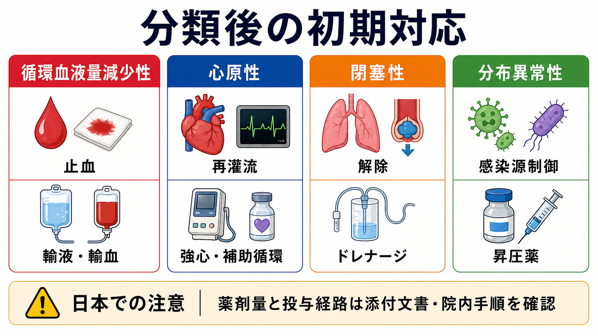

---
title: "ショックの4分類を救急外来でどう見分けるか"
description: "循環血液量減少性・心原性・閉塞性・分布異常性ショックを、病歴、身体所見、POCUS、初期検査から推定するための研修医向け整理。"
aliases:
  - "ショック4分類"
tags:
  - 領域/救急・初期対応
  - 種類/クリニカルクエスチョン
  - 対象/研修医
question: "ショックの4分類を救急外来でどう見分けるか"
clinical_area: "救急・初期対応"
audience: "研修医"
evidence_level: "mixed"
created: "2026-04-27"
updated: "2026-04-27"
enableToc: true
---

# ショックの4分類を救急外来でどう見分けるか

> このノートは研修医教育のための一般的整理であり、個別患者への診断・治療指示ではありません。緊急性が高い、判断に迷う、施設方針が関わる場合は上級医・専門科に相談してください。

## クリニカルクエスチョン

救急外来で低血圧、頻脈、意識障害、冷汗、乏尿、乳酸上昇などからショックを疑う患者を診たとき、循環血液量減少性・心原性・閉塞性・分布異常性を、病歴・身体所見・エコー・検査からどう推定するか。

## まず結論

- ショックは「低血圧」ではなく「酸素供給が需要に足りない全身性循環不全」として扱う。血圧が保たれていても、意識障害、冷汗、末梢冷感、皮膚網状斑、尿量低下、乳酸上昇があれば早期ショックを疑う [1,2]。
- 最初の5分は、分類を決め切るよりも、ABCDE、酸素、モニタ、静脈路、採血、乳酸、12誘導心電図、ベッドサイドエコーを同時に進める [2,3]。
- 4分類は「前負荷が足りない」「ポンプが悪い」「戻れない・出られない」「血管が開きすぎる」と言い換えると整理しやすい [1]。
- 循環血液量減少性は出血・脱水、平坦な頸静脈、肺うっ血なし、小さく虚脱するIVCが手がかり。心原性は胸痛・心不全歴、肺うっ血、頸静脈怒張、左室収縮低下や壁運動異常が手がかり [1,4,5]。
- 閉塞性は肺塞栓、心タンポナーデ、緊張性気胸を先に探す。右室拡大、心嚢液、片側肺スライディング消失、頸静脈怒張、急な低酸素があれば見逃さない [1,6,7]。
- 分布異常性は敗血症、アナフィラキシー、神経原性などを考える。皮膚が温かいこともあるため、「温かいから軽い」と判断しない [2,3]。
- 日本での注意: ノルアドレナリンなど循環作動薬の用量、希釈、投与経路、血管外漏出時対応はPMDA添付文書と院内手順に従う。末梢投与の可否や運用は施設差が大きい [10]。

## 判断の型

1. **ショックらしさを先に判定する**  
   収縮期血圧や平均血圧だけでなく、意識、皮膚、呼吸数、脈圧、尿量、乳酸、毛細血管再充満時間を組み合わせる。敗血症性ショックでは乳酸や毛細血管再充満時間も蘇生評価の補助に使われる [2,3]。

2. **4分類を「血管内量・ポンプ・閉塞・血管トーン」で分ける**  
   出血・脱水なら血管内量、心筋梗塞・心不全・不整脈ならポンプ、PE・タンポナーデ・緊張性気胸なら閉塞、敗血症・アナフィラキシーなら血管トーンを中心に考える [1]。

3. **病歴で事前確率を上げる**  
   外傷、吐下血、黒色便、発熱、悪寒、胸痛、突然の呼吸困難、手術後・長期臥床、透析、心不全、薬剤、アレルゲン曝露、妊娠・産褥を短く拾う。

4. **身体所見で「冷たいショック」と「温かいショック」を仮置きする**  
   冷汗・末梢冷感・狭い脈圧は低心拍出や血管収縮を示唆する。温かい四肢・広い脈圧は分布異常性を示唆するが、敗血症の進行例では冷たくなるため経時変化を見る [1,2]。

5. **POCUSで危険な仮説を潰す**  
   左室収縮、右室拡大、心嚢液、肺Bライン、気胸所見、IVC、腹腔内液体、大動脈を観察する。SHoC-ED試験では、未分化低血圧患者でPOCUSが診断精度を改善するかが検証されており、POCUSは単独診断ではなく病歴・診察・検査に足す情報として使う [8]。

## 初期対応

- ABCDEで気道、呼吸、循環、意識、体温・全身観察を確認する。
- 心電図、SpO2、非侵襲血圧を装着し、重症なら動脈ラインやICU管理を早期に相談する。
- 太い末梢静脈路を2本目標にし、採血、血液ガス、乳酸、血算、生化学、凝固、交差適合、血液培養を病態に応じて提出する。
- 12誘導心電図、胸部X線、POCUSを早期に行う。CTへ行く前に、搬送に耐えられる循環・呼吸かを上級医と確認する。
- 敗血症が疑わしければ、培養採取と抗菌薬、感染源コントロール、輸液、昇圧薬の必要性を同時に考える [2,3]。
- 出血が疑わしければ、輸液だけで時間を使わず、止血、輸血、外科・IVR・産婦人科などの介入先を早く呼ぶ。

## 鑑別・見逃し

| 優先度 | 疾患・病態 | 見逃しやすい理由 | 手がかり |
|---|---|---|---|
| 高 | 出血性ショック | 初期は血圧が保たれることがある | 外傷、吐下血、黒色便、腹痛、抗凝固薬、Hb低下、腹腔内液体 |
| 高 | 急性冠症候群・心原性ショック | 胸痛が乏しい例がある | 心電図変化、肺うっ血、冷汗、壁運動異常、トロポニン |
| 高 | 肺塞栓 | 呼吸苦・失神だけで来る | 低酸素、頻呼吸、右室拡大、DVTリスク、Dダイマーは低リスク除外で使う [6,7] |
| 高 | 心タンポナーデ | Beck三徴がそろわない | 頸静脈怒張、微弱脈、心嚢液、右房・右室虚脱 |
| 高 | 緊張性気胸 | X線待ちで遅れる | 片側呼吸音低下、頸静脈怒張、肺スライディング消失、急な低酸素 |
| 高 | 敗血症性ショック | 発熱がないことがある | 感染巣、意識変容、頻呼吸、乳酸上昇、皮膚温の変化 [2,3] |
| 高 | アナフィラキシー | 皮疹が目立たないことがある | 薬剤・食物・造影剤曝露、喘鳴、粘膜症状、急な血圧低下 |
| 中 | 薬剤性・中毒 | 病歴が取れないことがある | β遮断薬、Ca拮抗薬、三環系、鎮静薬、オピオイド、農薬など |

## 検査

| 検査 | 目的 | 注意点 |
|---|---|---|
| 血液ガス・乳酸 | 低灌流、換気、酸塩基、重症度の補助評価 | 乳酸は低灌流以外でも上がる。正常でもショックを完全には否定しない [2] |
| 血算・生化学・凝固 | 出血、感染、腎肝障害、DIC、電解質異常 | 初回正常でも再検が必要なことがある |
| 血液培養・各種培養 | 敗血症疑いで原因微生物を拾う | 抗菌薬を不必要に遅らせない [2,3] |
| 12誘導心電図・トロポニン・BNP | ACS、不整脈、心不全を評価 | 心原性ショックでは輸液負荷を慎重にする [4,5] |
| POCUS | 心臓、肺、IVC、腹部、大動脈を迅速に見る | 所見は病歴・診察と統合し、単独で確定診断にしない [8] |
| 造影CT | PE、大動脈疾患、出血、感染巣の確認 | 不安定ならCT搬送リスクを上級医と相談 |

## 治療・マネジメント

- **循環血液量減少性**: 出血なら止血と輸血を優先する。脱水なら晶質液で反応を見る。輸液反応性は血圧だけでなく、意識、脈圧、尿量、肺うっ血、エコーで再評価する [1,2]。
- **心原性**: 肺うっ血、低心拍出、ACS、不整脈を評価する。漫然とした大量輸液は肺うっ血を悪化させる可能性がある。再灌流、強心薬、血管作動薬、補助循環の要否を循環器・集中治療へ早期相談する [4,5,9]。
- **閉塞性**: 原因解除が治療の中心。PE、心タンポナーデ、緊張性気胸は、画像確定を待つより先に救命処置が必要になる場面がある [1,6]。
- **分布異常性**: 敗血症なら感染源制御、抗菌薬、晶質液、昇圧薬を遅らせない。SSC 2021は敗血症性ショックでノルアドレナリンを第一選択昇圧薬として推奨している [2]。
- **日本での注意**: J-SSCG 2024は日本の救急・集中治療現場に合わせた敗血症診療の枠組みを示す。薬剤量、希釈、末梢投与、中心静脈路、血管外漏出対応は添付文書・院内プロトコルを確認する [3,10]。

## 図解

`$imagegen`で生成を試みた追加図解案: 「病歴・身体所見・POCUSから循環血液量減少性、心原性、閉塞性、分布異常性へ分岐する日本語ラスター判断フロー」。生成物に別テーマが混入したため、存在しない画像リンクは挿入していない。

## 指導医に確認するポイント

- いま最も疑う分類と、同時に除外したい致死的原因は何か。
- 追加輸液を続けてよいか、肺うっ血・心機能・IVC・尿量からどう判断するか。
- 昇圧薬を開始する基準、投与経路、濃度、観察項目は院内手順と一致しているか。
- CTへ移動できる安定性か、先に処置・挿管・輸血・専門科コールが必要か。
- 心原性または閉塞性ショックを疑う所見があるとき、循環器、心外、呼吸器、IVR、集中治療へいつ相談するか。

## 患者説明

- 「血圧だけでなく、意識、尿、皮膚、血液検査から、全身に血液と酸素が足りているかを見ています。」
- 「原因は、血液や水分が足りない、心臓のポンプが弱い、血液の流れが詰まっている、感染やアレルギーで血管が広がりすぎている、などに分けて考えます。」
- 「原因を探す検査と、酸素、点滴、輸血、抗菌薬、血圧を支える薬、詰まりを解除する治療を、状態に応じて同時に進めます。」

## ピットフォール

- 収縮期血圧が正常だからショックではないと判断する。
- 敗血症性ショックを「四肢が温かいから軽症」とみなす。
- 心原性・閉塞性ショックを考えずに大量輸液を続ける。
- 乳酸だけで重症度を決め、皮膚所見、尿量、意識、呼吸数を見落とす。
- POCUS所見だけで確定診断し、病歴や検査と統合しない。
- ノルアドレナリンの濃度、投与経路、血管外漏出時対応を院内手順で確認しない。

## 関連ノート

- [[救急外来で末梢冷感や網状皮斑をどう評価するか]]

関連ノート候補:
- 救急外来でショックをどう初期評価するか
- 敗血症性ショックで乳酸をどう使うか
- 救急外来で心原性ショックをどう見抜くか
- 急性肺塞栓症を疑ったら初期対応をどう進めるか

## MOC更新候補

- [[MOC｜救急・初期対応]]
- MOC｜心電図・循環器.md（本サイト外）
- MOC｜感染症・抗菌薬.md（本サイト外）

## 参考文献

[1] Cecconi M, De Backer D, Antonelli M, et al. Consensus on circulatory shock and hemodynamic monitoring. Intensive Care Med. 2014;40(12):1795-1815. https://doi.org/10.1007/s00134-014-3525-z

[2] Evans L, Rhodes A, Alhazzani W, et al. Surviving Sepsis Campaign: International Guidelines for Management of Sepsis and Septic Shock 2021. Intensive Care Med. 2021;47:1181-1247. https://doi.org/10.1007/s00134-021-06506-y

[3] 日本版敗血症診療ガイドライン2024特別委員会. 日本版敗血症診療ガイドライン2024 (J-SSCG2024). 日本集中治療医学会・日本救急医学会. https://www.jstage.jst.go.jp/article/jsicm/advpub/0/advpub_2400001/_article/-char/ja/

[4] Tsutsui H, Ide T, Ito H, et al. JCS/JHFS 2021 Guideline Focused Update on Diagnosis and Treatment of Acute and Chronic Heart Failure. Circ J. 2021;85(12):2252-2291. https://doi.org/10.1253/circj.CJ-21-0431

[5] Tsutsui H, Isobe M, Ito H, et al. JCS 2017/JHFS 2017 Guideline on Diagnosis and Treatment of Acute and Chronic Heart Failure - Digest Version. Circ J. 2019;83:2084-2184. https://doi.org/10.1253/circj.CJ-19-0342

[6] Konstantinides SV, Meyer G, Becattini C, et al. 2019 ESC Guidelines for the diagnosis and management of acute pulmonary embolism. Eur Heart J. 2020;41(4):543-603. https://doi.org/10.1093/eurheartj/ehz405

[7] 孟真, 立石綾, 原田裕輔. 「肺血栓塞栓症・深部静脈血栓症および肺高血圧症に関するガイドライン（2025年改訂版）」における静脈血栓症の診断. 日本血栓止血学会誌. 2025;36(6):737-743. https://doi.org/10.2491/jjsth.36.737

[8] Peach M, Milne J, Diegelmann L, et al. Does point-of-care ultrasonography improve diagnostic accuracy in emergency department patients with undifferentiated hypotension? CJEM. 2023;25(1):48-56. https://doi.org/10.1007/s43678-022-00431-9

[9] Heidenreich PA, Bozkurt B, Aguilar D, et al. 2022 AHA/ACC/HFSA Guideline for the Management of Heart Failure. Circulation. 2022;145:e895-e1032. https://doi.org/10.1161/CIR.0000000000001063

[10] 医薬品医療機器総合機構. ノルアドリナリン注1mg 医療用医薬品情報・添付文書. https://www.pmda.go.jp/PmdaSearch/rdDetail/iyaku/2451401A1034_2?user=1

## 更新ログ

- 2026-04-27: 初版作成。
