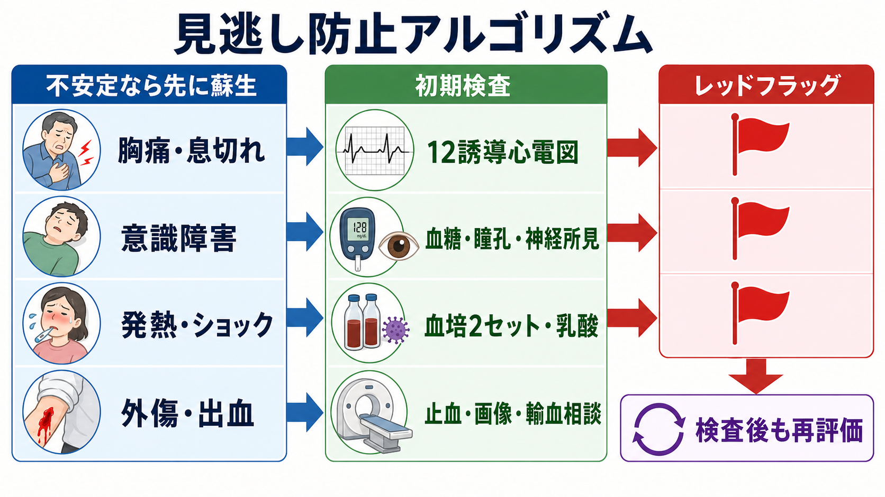
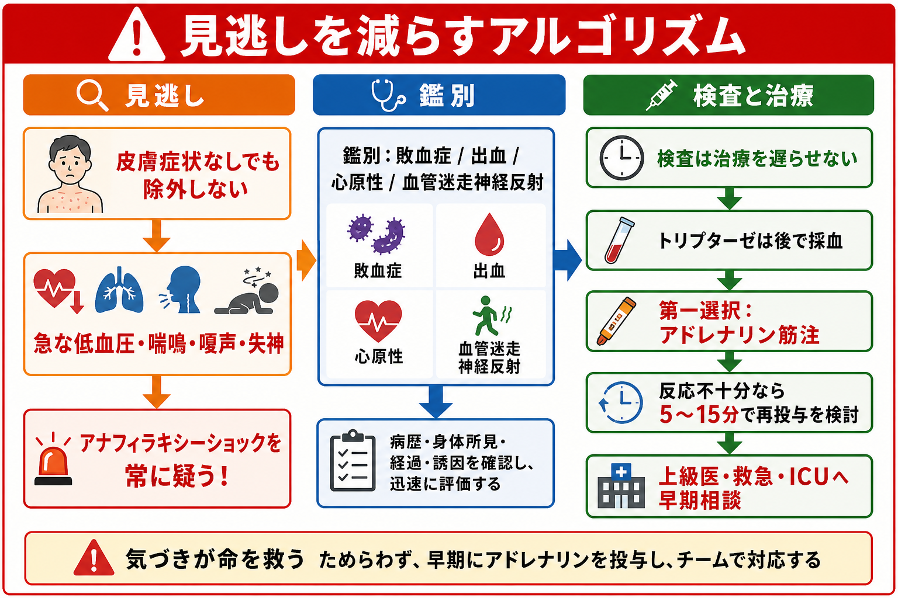
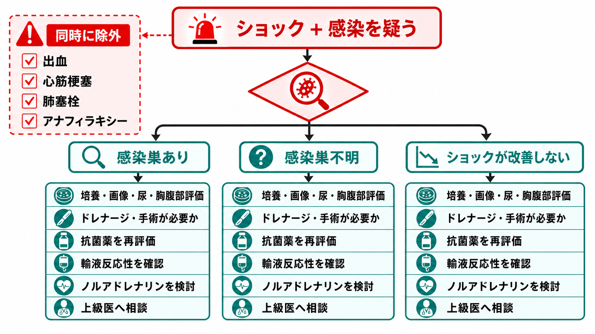

---
title: "ショック患者を見たら最初に何をするか"
description: "ショックの認識、応援要請、酸素投与、ルート確保、輸液、原因検索の初動を整理する。"
aliases:
  - "ショック初期対応"
tags:
  - 領域/救急・初期対応
  - 種類/クリニカルクエスチョン
  - 対象/研修医
question: "ショック患者を見たら最初に何をするか"
clinical_area: "救急・初期対応"
audience: "研修医"
evidence_level: "mixed"
created: "2026-04-27"
updated: "2026-04-27"
enableToc: true
---

# ショック患者を見たら最初に何をするか

> このノートは研修医教育のための一般的整理であり、個別患者への診断・治療指示ではありません。緊急性が高い、判断に迷う、施設方針が関わる場合は上級医・専門科に相談してください。

## クリニカルクエスチョン

ショック患者を見たら最初に何をするか。

## まず結論

- ショックを「血圧低下」だけで待たず、意識変容、冷汗・皮膚冷感、頻脈、呼吸促迫、尿量低下、乳酸上昇などの低灌流として認識する[1][8]。
- 最初に一人で抱えず、上級医、看護師、救急チーム、ICU/専門科を呼び、モニター、酸素、除細動器、救急カートを同時に準備する[2][9]。
- ABCDEで、気道・呼吸・循環の破綻を先に処置しながら、太い静脈路2本または骨髄路を確保し、採血、血液ガス、乳酸、血糖、心電図、エコーを並行する[2][7][9]。
- 輸液は細胞外液を用いて少量ボーラスごとに再評価する。敗血症性ショックでは初期3時間に30 mL/kgを目安にしつつ、心不全、腎不全、高齢者では過剰輸液を避ける[1][8]。
- 原因別に、出血なら止血・輸血、敗血症なら培養と抗菌薬、心原性なら心電図・心エコーと循環器相談、閉塞性なら緊張性気胸・肺塞栓・心タンポナーデの解除、アナフィラキシーならアドレナリン筋注を遅らせない[1][3][4][5][6]。

## 判断の型

1. 「低血圧か」ではなく「低灌流か」を見る。収縮期血圧、平均動脈圧、脈拍、呼吸数、SpO2、意識、皮膚、CRT、尿量、乳酸を組み合わせる[1][8]。
2. 最初の声出しは「ショック疑いです。応援とモニター、酸素、太いルート、血ガス、心電図、エコーをお願いします」と具体化する。
3. ABCDEを1周で終わらせず、介入後に再評価する。酸素を投与した、輸液を入れた、昇圧薬を始めた、除圧した、除細動した、抗菌薬を入れた、という各介入後に戻る[2][8]。
4. 原因は4群で仮置きする。循環血液量減少性、心原性、閉塞性、分布異常性で考えると、止血、輸液、輸血、除圧、抗菌薬、アドレナリン、循環器相談を漏らしにくい。
5. 検査は治療を遅らせない。ショックは「検査してから治療」ではなく「危険なら処置しながら原因を絞る」状況である[7][8]。

## 初期対応

- 応援要請: 上級医、看護師リーダー、救急/ICU、必要な専門科を早めに呼ぶ。重症患者は人手、モニター、薬剤、搬送先を同時に動かす。
- A/B: 気道閉塞、努力呼吸、低酸素、誤嚥リスクを確認し、酸素投与を開始する。低酸素があればリザーバーマスクやHFNC、換気補助、挿管準備を検討する[7][8]。
- C: 心電図、血圧、SpO2を連続モニターし、除細動器を近くに置く。不安定な頻拍性不整脈では同期下カルディオバージョンが推奨される[9]。
- ルート: 18G以上を目安に太い末梢静脈路2本を狙う。末梢確保が遅れる場合は骨髄路を検討する。AHAでは緊急薬剤投与でIVをまず試み、困難ならIOを用いる流れが示されている[9]。
- 輸液: 乳酸、CRT、皮膚、肺うっ血、頸静脈、心エコーを見ながら、細胞外液を少量ずつ投与して反応を確認する。敗血症性ショックでは晶質液が第一選択で、30 mL/kg/3時間が国際的目安だが、全例に漫然と入れ続けない[1][8]。
- 採血・検査: 血液ガス、乳酸、血糖、電解質、腎機能、肝胆道系、血算、凝固、交差適合、トロポニン、培養、12誘導心電図、胸部X線、POCUSを状況に応じて並行する。
- 昇圧薬: 輸液反応性が乏しい、輸液を待てない、または過剰輸液が危険な敗血症性ショックではノルアドレナリンを早期に検討する。国際ガイドラインでは第一選択とされ、中心静脈路を待たず短時間の近位末梢静脈投与も許容されるが、施設プロトコルと上級医確認が前提である[1][8]。

## 鑑別・見逃し

| 優先度 | 疾患・状態 | 見逃さない理由 | 手がかり |
|---|---|---|---|
| 高 | 大量出血・外傷・消化管出血 | 輸液だけでは解決せず、止血と輸血が必要 | 外傷、吐下血、腹痛、貧血、FAST陽性、抗凝固薬 |
| 高 | 敗血症性ショック | 抗菌薬、感染源制御、輸液、昇圧薬を遅らせない | 発熱/低体温、悪寒、感染巣、乳酸高値、意識変容[1][8][10] |
| 高 | 急性冠症候群・心筋梗塞 | 輸液で悪化することがあり、再灌流や循環補助が必要 | 胸痛、ST変化、壁運動異常、肺水腫 |
| 高 | 不安定頻拍・徐脈 | 電気治療やペーシングが初動になる | 動悸、失神、広QRS頻拍、徐脈、意識障害[9] |
| 高 | 緊張性気胸 | 画像を待つと遅れる | 片側呼吸音低下、頸静脈怒張、胸部外傷、人工呼吸中 |
| 高 | 肺塞栓 | 低酸素とショックを来し、早期専門相談が必要 | 急な呼吸困難、胸痛、DVTリスク、右心負荷 |
| 高 | 心タンポナーデ | 輸液だけで持たず、穿刺/手術が必要 | 頸静脈怒張、心音減弱、外傷、心嚢液 |
| 高 | アナフィラキシー | 皮膚症状が乏しくてもあり得る。アドレナリン遅延が危険 | 急な低血圧、喘鳴、腹痛、蕁麻疹、曝露歴[4][5] |

## 検査

| 検査 | 目的 | 注意点 |
|---|---|---|
| 血液ガス・乳酸 | 低灌流、換気、酸塩基、K、Hbを早く見る | 乳酸は敗血症以外でも上がる。経時変化を見る[8] |
| 血糖 | 低血糖・高血糖の除外 | 意識障害では最初に確認する |
| 12誘導心電図 | ACS、不整脈、高K血症 | 不安定なら電気治療を優先する[9] |
| 心エコー/POCUS | 心機能、右心負荷、心嚢液、IVC、肺うっ血 | POCUS陰性で重症疾患を除外しきらない |
| FAST/腹部エコー | 外傷性出血、腹腔内液体 | 循環不安定ならCTより先に蘇生と外科相談 |
| 血液培養2セット | 敗血症の原因検索 | 抗菌薬を不必要に遅らせない[1][10] |
| 交差適合・凝固 | 大量出血・DICの準備 | MTPや輸血プロトコルを早めに確認する[3] |
| 胸部X線/CT | 気胸、肺炎、肺水腫、出血源 | 不安定ならベッドサイド評価と処置を優先 |

## 治療・マネジメント

- 酸素: 低酸素、呼吸仕事量増大、意識障害があれば投与する。COPDやCO2貯留リスクでは過剰酸素に注意しつつ、ショックや重篤低酸素では低酸素の是正を優先する[7]。
- 輸液: まず晶質液を使う。敗血症性ショックでは早期に十分量が必要だが、肺水腫、心不全、腎不全、右心不全では小刻みに再評価する[1][8]。
- 輸血・止血: 大量出血では輸液で血圧を「薄めて」満足しない。外傷、消化管出血、産科出血では施設の大量輸血プロトコル、外科/内視鏡/IVR/産科への早期相談を行う[3]。
- 昇圧薬: 敗血症性ショックの第一選択はノルアドレナリンで、初期目標MAP 65 mmHgが国際的に推奨される[8]。日本の添付文書でも急性低血圧またはショック時の補助治療に用いられるが、輸液・輸血の代わりではない点に注意する[6]。
- アナフィラキシー: アドレナリン筋注を第一選択として遅らせない。酸素、輸液、気道管理、抗ヒスタミン薬、ステロイドは補助であり、アドレナリンの代わりではない[4][5]。
- 不整脈: 不安定な頻拍、広QRS頻拍、徐脈によるショックは、薬剤で粘らず同期下カルディオバージョン、除細動、ペーシングを早期に考える[2][9]。
- 原因制御: 抗菌薬、ドレナージ、除圧、止血、再灌流、解毒、内視鏡、手術、IVRなど、循環を立て直すだけでなく原因を止める。

### 日本での注意

- ノルアドレナリンは国内添付文書で「ショック時の補助治療」とされるが、応急処置剤であり、輸液または輸血にかわるものではない[6]。
- アドレナリン製剤は添付文書上、アナフィラキシーショックの救急治療の第一次選択剤とされる一方、用量、投与経路、希釈、禁忌例外、過量投与リスクは製剤ごとに確認する[5]。
- 敗血症性ショックの初期輸液、末梢からの昇圧薬開始、抗菌薬投与タイミングは国際推奨と国内運用が施設ごとに異なる。院内敗血症バンドル、ICU入室基準、薬剤濃度、末梢投与の観察ルールを確認する[1][8]。
- 大量輸血は施設のMTP、血液型不明時の緊急輸血手順、同意・照合手順に従う。手順確認の遅れが止血遅延になり得る[3]。

## 図解

## 指導医に確認するポイント

- この患者は「ショック」として扱ってよいか。低灌流の根拠は何か。
- どの原因群が最も危険か。出血、敗血症、心原性、閉塞性、アナフィラキシーのうち、今すぐ除外できないものは何か。
- 輸液をどこまで入れるか。次の再評価指標は血圧、CRT、尿量、乳酸、肺エコー、心エコーのどれか。
- 昇圧薬、輸血、抗菌薬、除圧、電気治療、挿管、ICU入室のどれを先に動かすか。
- 施設の敗血症バンドル、MTP、末梢ノルアドレナリン、アナフィラキシー対応、挿管応援のルールは何か。

## 患者説明

- 「血圧だけでなく、体の臓器に血液が十分届いていない可能性があります。命に関わる状態として、酸素、点滴、採血、心電図、画像検査を同時に進めます。」
- 「原因は出血、感染、心臓、肺の血管や胸の中の圧、強いアレルギー反応など複数あります。検査を待つ間にも必要な処置を先に行います。」
- 「薬や輸血、集中治療、専門科処置が必要になることがあります。状況が急に変わるため、治療方針は検査結果と反応を見ながら更新します。」

## ピットフォール

- 血圧が正常だからショックではない、と考える。代償期では頻脈、冷汗、CRT延長、尿量低下、乳酸上昇が先に出る。
- 「点滴を入れてから相談」と考え、応援要請が遅れる。
- 検査室やCTへ移動してから悪化する。循環不安定ならベッドサイド蘇生と専門科相談を優先する。
- 心原性ショックや閉塞性ショックに大量輸液を続け、肺水腫や右心負荷を悪化させる。
- 出血性ショックに晶質液だけを続ける。止血、輸血、MTP、外科/IVRの起動が必要である[3]。
- アナフィラキシーで抗ヒスタミン薬やステロイドを先に使い、アドレナリン筋注が遅れる[4][5]。
- ノルアドレナリンを「輸液や輸血の代わり」として使う。添付文書上も代替ではない[6]。
- 不安定な頻拍に薬剤で粘り、同期下カルディオバージョンが遅れる[9]。

## 関連ノート

- [[MOC｜救急・初期対応]]
- 関連ノート候補: 「敗血症性ショックの初期対応」「アナフィラキシーを疑ったら何をするか」「大量出血でMTPをいつ起動するか」「不安定頻拍を見たらどう動くか」

## MOC更新候補

- [[MOC｜救急・初期対応]] に「ショック・循環不全」項目として本記事を追加候補。
- 将来、「ショック・循環不全」配下に敗血症性ショック、出血性ショック、心原性ショック、閉塞性ショック、アナフィラキシーの記事をまとめる候補。

## 参考文献

[1] 日本集中治療医学会・日本救急医学会. 日本版敗血症診療ガイドライン2024. 日本集中治療医学会雑誌. 2024. DOI: https://doi.org/10.3918/jsicm.2400001

[2] 日本蘇生協議会. JRC蘇生ガイドライン2020. https://www.jrc-cpr.org/jrc-guideline-2020/

[3] 日本外傷学会, 日本救急医学会 監修. 外傷初期診療ガイドラインJATEC 改訂第6版. 2021. 国立国会図書館書誌情報: https://ndlsearch.ndl.go.jp/books/R100000002-I031286472

[4] 日本アレルギー学会 Anaphylaxis対策委員会. アナフィラキシーガイドライン2022. https://www.jsaweb.jp/modules/news_topics/index.php?content_id=688

[5] PMDA. アドレナリン注0.1%シリンジ「テルモ」医療用医薬品情報. https://www.pmda.go.jp/PmdaSearch/rdSearch/02/2451402G1040?user=1

[6] PMDA. ノルアドリナリン注1mg 医療用医薬品情報. https://www.pmda.go.jp/PmdaSearch/rdDetail/iyaku/2451401A1034_2?user=1

[7] 日本呼吸器学会ほか. 酸素療法マニュアル. https://www.jrs.or.jp/publication/jrs_guidelines/20170104152945.html

[8] Evans L, Rhodes A, Alhazzani W, et al. Surviving Sepsis Campaign: International Guidelines for Management of Sepsis and Septic Shock 2021. Intensive Care Med. 2021;47:1181-1247. DOI: https://doi.org/10.1007/s00134-021-06506-y

[9] American Heart Association. Adult Advanced Life Support Guidelines. https://cpr.heart.org/en/resuscitation-science/cpr-and-ecc-guidelines/adult-advanced-life-support

[10] National Institute for Health and Care Excellence. Suspected sepsis: recognition, diagnosis and early management. NICE guideline NG51. 2024. https://www.ncbi.nlm.nih.gov/books/NBK553314/

## 更新ログ

- 2026-04-27: 初回作成。国内外ガイドライン、PMDA添付文書情報を確認し、imagegen由来のPNG図解3枚を添付。
