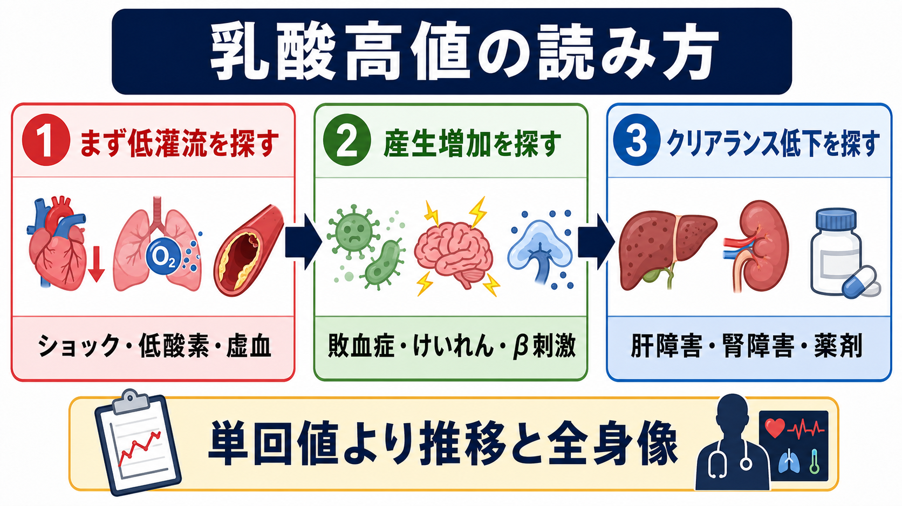
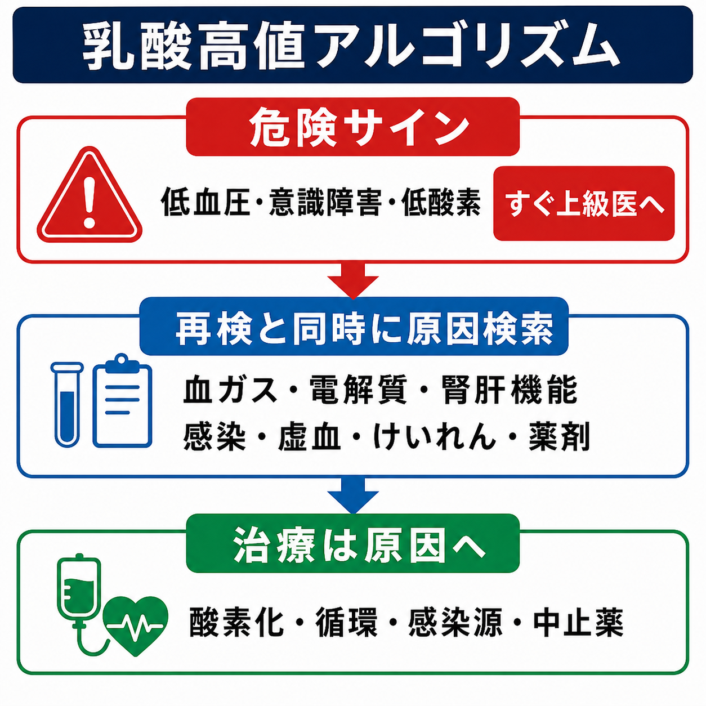

---
title: "乳酸値が高い患者をどう解釈するか"
description: "乳酸高値を、低灌流・敗血症・けいれん後・薬剤・肝腎機能低下に分け、重症度評価と原因検索に使う。"
aliases:
  - "乳酸高値"
  - "高乳酸血症"
tags:
  - 領域/救急・初期対応
  - 種類/クリニカルクエスチョン
  - 対象/研修医
question: "乳酸値が高い患者をどう解釈するか"
clinical_area: "救急・初期対応"
audience: "研修医"
evidence_level: "mixed"
created: "2026-04-27"
updated: "2026-04-27"
enableToc: true
---

# 乳酸値が高い患者をどう解釈するか

> このノートは研修医教育のための一般的整理であり、個別患者の診断・治療指示ではありません。緊急性が高い、判断に迷う、施設方針が関わる場合は上級医・専門科に相談してください。

## クリニカルクエスチョン

乳酸値が高い患者をどう解釈し、低灌流、敗血症、けいれん、薬剤、肝障害などをどう鑑別して重症度評価に使うか。

## まず結論

- 乳酸高値は「ショックの検査値」だけではない。まず組織低灌流・低酸素・虚血を探し、同時に敗血症、けいれん後、薬剤、肝腎機能低下、代謝疾患を並行して考える。[4]
- 乳酸が高い患者で、低血圧、意識障害、低酸素、乏尿、皮膚冷感、胸腹部痛、感染徴候があれば、数値の解釈より先にABCDE、酸素化、循環評価、上級医への共有を優先する。[1], [2]
- 敗血症が疑わしいとき、乳酸は診断の単独決め手ではなく、臨床所見・臓器障害・感染源評価に足す「重症度と再評価の指標」として使う。[2], [3]
- 乳酸値は単回値より推移が重要である。上昇が持続する、再上昇する、臨床像と合わないほど高い場合は、隠れた低灌流、虚血、薬剤性、肝腎機能低下を見直す。[2], [4]
- けいれん直後や激しい運動後は乳酸が一過性に上がりうる。全身状態が落ち着き、再検で低下するなら解釈は変わるが、外傷、低酸素、感染、薬剤中毒を見逃さない。[5]
- メトホルミン内服中の乳酸高値では、腎機能低下、脱水、低酸素、ショック、重度肝障害、過度の飲酒を必ず確認する。日本の添付文書・注意喚起ではこれらが重要な禁忌・リスクとして扱われる。[6], [7]

## 判断の型

1. **まず危険サインを見る。** 低血圧、頻呼吸、低酸素、意識障害、冷汗・末梢冷感、乏尿、強い胸痛・腹痛、重症感染徴候があれば、乳酸値の理由を詰める前にショック対応として扱う。[1], [2]
2. **低灌流・低酸素・虚血を優先して除外する。** 出血、脱水、心原性ショック、敗血症性ショック、肺塞栓、腸管虚血、四肢虚血、心停止後などは「乳酸が高いからあり得る」ではなく「見逃すと致命的」として探す。[3], [4]
3. **乳酸産生の増加を考える。** 敗血症、けいれん後、激しい筋活動、β刺激薬、アドレナリン、悪性腫瘍、糖尿病性ケトアシドーシス、チアミン欠乏などを病歴・薬歴・身体所見から拾う。[4], [5]
4. **乳酸クリアランス低下を考える。** 肝障害、腎障害、循環不全、薬剤性、アルコール関連を確認する。特にメトホルミンでは腎機能・脱水・低酸素・肝障害が重要である。[6], [7]
5. **再検で方向を決める。** 初期対応後に乳酸、pH、HCO3-、アニオンギャップ、循環所見、尿量、意識、呼吸状態を再評価する。乳酸が下がっても原因疾患が消えたとは限らない。[2], [4]

## 初期対応

- **ABCDEとモニタリング:** 気道、呼吸数、SpO2、血圧、心拍、意識、体温、尿量、末梢冷感を確認し、必要なら酸素投与、静脈路確保、心電図モニタ、採血、血液ガスを同時進行にする。[1], [2]
- **ショックなら原因別に動く:** 低容量性なら出血・脱水、心原性なら心電図・心エコー、閉塞性なら肺塞栓・緊張性気胸・心タンポナーデ、分布異常なら敗血症・アナフィラキシー・副腎不全を考える。
- **敗血症疑い:** 感染源、培養、抗菌薬、輸液反応性、昇圧薬の要否を上級医と早期に共有する。J-SSCG 2024とSSC 2021はいずれも敗血症・敗血症性ショックを緊急病態として扱い、早期認識と初期対応を重視する。[1], [2]
- **乳酸値の採血条件も確認:** 動脈・静脈・血液ガス機器・検査室測定で値がずれることがある。駆血時間、採血後放置、激しい体動も解釈に影響するため、臨床像と合わないときは再検する。
- **重症アシドーシス:** 乳酸高値にpH低下、HCO3-低下、高K血症、腎不全、意識障害、呼吸疲弊を伴う場合はICU、腎代替療法、原因治療の相談が必要になりうる。

## 鑑別・見逃し

| 優先度 | 疾患・状態 | 見逃さない理由 | 手がかり |
|---|---|---|---|
| 高 | 敗血症・敗血症性ショック | 早期治療で転帰が変わる。乳酸は重症度・再評価の補助指標になる。[1], [2] | 発熱/低体温、頻呼吸、意識変容、低血圧、感染源、臓器障害 |
| 高 | 出血・脱水・低容量性ショック | 低灌流が進むと急速に悪化する。 | 外傷、消化管出血、産科出血、下痢嘔吐、皮膚冷感、頻脈 |
| 高 | 心原性ショック・急性冠症候群 | 血圧が保たれても組織低灌流がありうる。 | 胸痛、肺うっ血、心電図変化、心エコー、BNP/トロポニン |
| 高 | 腸管虚血・四肢虚血 | 初期所見が乏しくても致命的。乳酸上昇は遅れて出ることもある。 | 強い腹痛、心房細動、血便、代謝性アシドーシス、疼痛と所見の不一致 |
| 高 | 肺塞栓・重症低酸素 | 低酸素と右心負荷で乳酸が上がる。 | 急な呼吸困難、胸痛、失神、Dダイマー、心エコー、造影CT |
| 中 | けいれん後・激しい筋活動 | 一過性高値なら再検で低下しやすいが、低酸素・外傷・中枢感染を除外する。[5] | 目撃情報、舌咬傷、失禁、筋痛、短時間での乳酸低下 |
| 中 | 薬剤性・中毒 | 原因薬の中止・解毒・集中治療が必要なことがある。[4], [8] | メトホルミン、β刺激薬、アドレナリン、サリチル酸、シアン化物、一酸化炭素 |
| 中 | 肝障害・腎障害 | 産生だけでなくクリアランス低下で乳酸が持続する。[4] | 肝硬変、急性肝不全、AKI/CKD、アルコール、黄疸、凝固異常 |
| 中 | 糖尿病性ケトアシドーシス・チアミン欠乏 | 代謝性アシドーシスの鑑別が変わる。 | 高血糖/正常血糖DKA、ケトン、栄養不良、アルコール使用、慢性消耗 |

## 検査

| 検査 | 目的 | 注意点 |
|---|---|---|
| 血液ガス、乳酸、pH、HCO3-、Base excess | 乳酸高値がアシドーシスを伴うか、呼吸性代償が足りるかを見る。 | 乳酸だけでなくpHと全身状態で重症度を判断する。[4] |
| 電解質、血糖、腎機能、肝機能、浸透圧、ケトン | DKA、腎不全、肝障害、脱水、薬剤蓄積を評価する。 | SGLT2阻害薬使用中は正常血糖DKAにも注意する。 |
| CBC、CRP、プロカルシトニン、血液培養、尿検査、画像 | 感染源と臓器障害を探す。 | 培養採取で抗菌薬開始を不必要に遅らせない。 |
| 心電図、胸部X線、心エコー、トロポニン | 心原性ショック、ACS、肺塞栓、心不全を探す。 | 乳酸高値と胸部症状があれば心血管評価を急ぐ。 |
| 造影CT、腹部診察反復、外科相談 | 腸管虚血、出血、感染源、塞栓症を探す。 | 腎機能だけを理由に造影判断を遅らせない場面があるため上級医と相談する。 |
| 薬歴・中毒スクリーニング、アセトアミノフェン/サリチル酸など | 薬剤性・中毒性乳酸アシドーシスを拾う。 | 市販薬、吸入薬、漢方、サプリ、飲酒、腎機能低下を確認する。 |
| 乳酸再検 | 初期対応後の方向性を見る。 | 値の低下はよいサインだが、原因疾患の治療完了を意味しない。[2], [4] |

## 治療・マネジメント

- **乳酸値そのものではなく原因を治療する。** 低酸素なら酸素化、ショックなら循環、出血なら止血と輸血、感染なら感染源コントロールと抗菌薬、虚血なら再灌流・外科/循環器相談が中心になる。[1], [2], [4]
- **輸液は反応性を見ながら行う。** 敗血症性低灌流では初期輸液が重要だが、心不全・腎不全・高齢者では過剰輸液の害があるため、血圧、尿量、末梢冷感、肺うっ血、エコー、受動的下肢挙上などを組み合わせる。[2]
- **昇圧薬・ICU相談:** 輸液で改善しない低血圧、乳酸高値が持続する低灌流、呼吸循環不全、重症アシドーシスでは、早期に上級医・集中治療に相談する。
- **けいれん後:** 発作が止まっており、低酸素・外傷・感染・中毒が否定的で、乳酸が短時間で低下するなら一過性上昇として説明できることがある。ただし初回発作、持続する意識障害、発熱、神経巣症状では原因検索を続ける。[5]
- **薬剤性:** メトホルミン、β刺激薬、アドレナリン、サリチル酸、シアン化物、一酸化炭素などを疑う。中毒や重症メトホルミン関連乳酸アシドーシスが疑われる場合は救急・集中治療・腎臓内科・中毒相談窓口への相談を考える。[4], [6], [8]
- **日本での注意:** メトホルミンは日本のPMDA使用上の注意改訂で、乳酸アシドーシス既往、重度腎機能障害または透析、重度肝機能障害、ショック・心不全・心筋梗塞・肺塞栓など低酸素を伴いやすい状態、脱水、過度のアルコール摂取が禁忌として整理されている。[6]
- **単位換算:** 乳酸は mmol/L 表記が多い。施設によって mg/dL 表記の場合があり、目安として 1 mmol/L は約 9 mg/dL である。閾値を使うときは必ず単位を確認する。

## 図解

## 指導医に確認するポイント

- この乳酸高値を「低灌流あり」と扱うべきか、現時点でショックとして動くべきか。
- 敗血症を疑う根拠、感染源、培養、抗菌薬開始、感染源コントロールの優先順位。
- 輸液を続けるか、昇圧薬・ICU相談・心エコー評価へ進むか。
- 腸管虚血、肺塞栓、ACS、出血、重症中毒など、見逃すと致命的な疾患をどこまで除外できているか。
- メトホルミン、β刺激薬、アドレナリン、サリチル酸など薬剤性を疑う根拠と、休薬・専門相談・腎代替療法の要否。
- 乳酸再検のタイミングと、改善しなかった場合の次の一手。

## 患者説明

- 「乳酸は、体に十分な酸素や血流が届いていない時だけでなく、けいれん、感染、薬、肝臓や腎臓の働きの低下でも上がることがあります。」
- 「数値だけで病名を決めるのではなく、血圧、呼吸、意識、尿量、感染の有無、薬の影響を合わせて原因を探します。」
- 「重い病気のサインのことがあるため、再検査をしながら、必要な治療や専門医への相談を進めます。」

## ピットフォール

- 乳酸が高いだけで敗血症と決めつける。乳酸は感染以外でも上がる。[4]
- 乳酸が正常だからショックや敗血症はないと考える。早期や局所虚血では乳酸が目立たないことがある。
- けいれん後の一過性乳酸高値を、再検せずに重症感染や中毒として固定する。または逆に「けいれん後」と決めつけて低酸素・頭蓋内疾患・感染を見逃す。[5]
- メトホルミン内服中に、腎機能、脱水、低酸素、肝障害、飲酒、造影検査前後の情報を確認しない。[6], [7]
- 乳酸の再検だけに集中し、末梢冷感、尿量、意識、呼吸仕事量、皮膚所見などのベッドサイド所見を見落とす。
- 単位を確認せず、mg/dL と mmol/L を混同する。

## 関連ノート

- ショックを疑ったとき最初に何をするか
- 敗血症を疑ったら最初の1時間で何をするか
- 血液ガスで代謝性アシドーシスをどう読むか
- メトホルミン内服中のシックデイをどう説明するか
- けいれん後の検査異常をどう解釈するか

## MOC更新候補

- [[MOC｜救急・初期対応]]
- MOC｜輸液・電解質・酸塩基.md（本サイト外）
- MOC｜薬剤・処方・副作用.md（本サイト外）

## 参考文献

[1] 日本版敗血症診療ガイドライン2024特別委員会. 日本版敗血症診療ガイドライン2024. 日本集中治療医学会雑誌. 2024. https://www.jstage.jst.go.jp/article/jsicm/advpub/0/advpub_2400001/_article/-char/ja/

[2] Evans L, Rhodes A, Alhazzani W, et al. Surviving Sepsis Campaign: International Guidelines for Management of Sepsis and Septic Shock 2021. Intensive Care Med. 2021;47:1181-1247. doi:10.1007/s00134-021-06506-y. https://doi.org/10.1007/s00134-021-06506-y

[3] Singer M, Deutschman CS, Seymour CW, et al. The Third International Consensus Definitions for Sepsis and Septic Shock (Sepsis-3). JAMA. 2016;315(8):801-810. doi:10.1001/jama.2016.0287. https://doi.org/10.1001/jama.2016.0287

[4] Andersen LW, Mackenhauer J, Roberts JC, Berg KM, Cocchi MN, Donnino MW. Etiology and Therapeutic Approach to Elevated Lactate Levels. Mayo Clin Proc. 2013;88(10):1127-1140. doi:10.1016/j.mayocp.2013.06.012. https://doi.org/10.1016/j.mayocp.2013.06.012

[5] Nass RD, Zur B, Elger CE, Holdenrieder S, Surges R. Acute metabolic effects of tonic-clonic seizures. Epilepsia Open. 2019;4(4):599-608. doi:10.1002/epi4.12364. https://doi.org/10.1002/epi4.12364

[6] 独立行政法人医薬品医療機器総合機構. 使用上の注意改訂情報（令和元年6月18日指示分）：メトホルミン塩酸塩. https://www.pmda.go.jp/safety/info-services/drugs/calling-attention/revision-of-precautions/0353.html

[7] 日本糖尿病学会・日本糖尿病協会. メトホルミンの適正使用に関するRecommendation. 2020年3月18日改訂. https://www.nittokyo.or.jp/modules/information/index.php?content_id=23

[8] Smith ZR, Horng M, Rech MA. Medication-Induced Hyperlactatemia and Lactic Acidosis: A Systematic Review of the Literature. Pharmacotherapy. 2019;39(9):946-963. doi:10.1002/phar.2316. https://doi.org/10.1002/phar.2316

## 更新ログ

- 2026-04-27: 初版作成。
