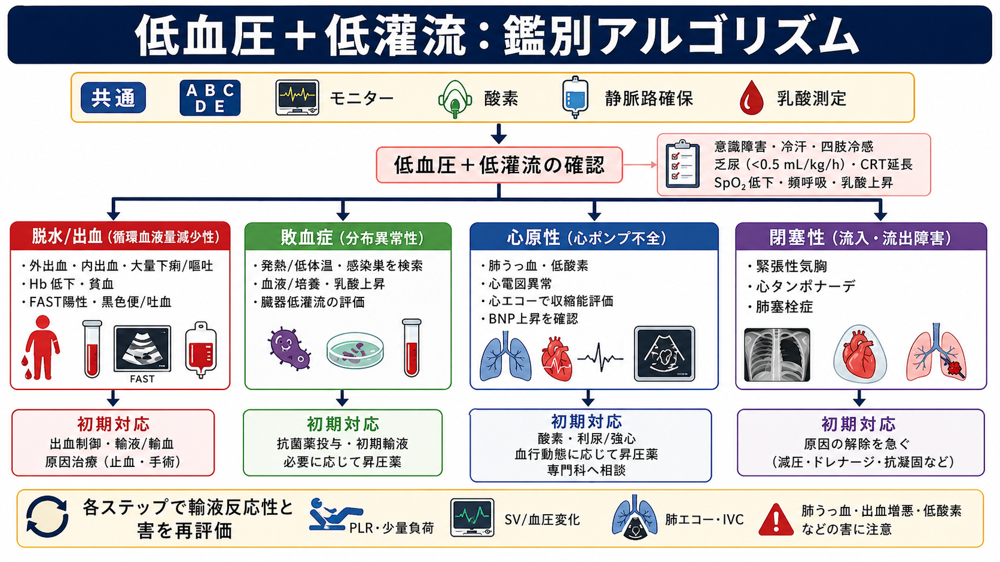
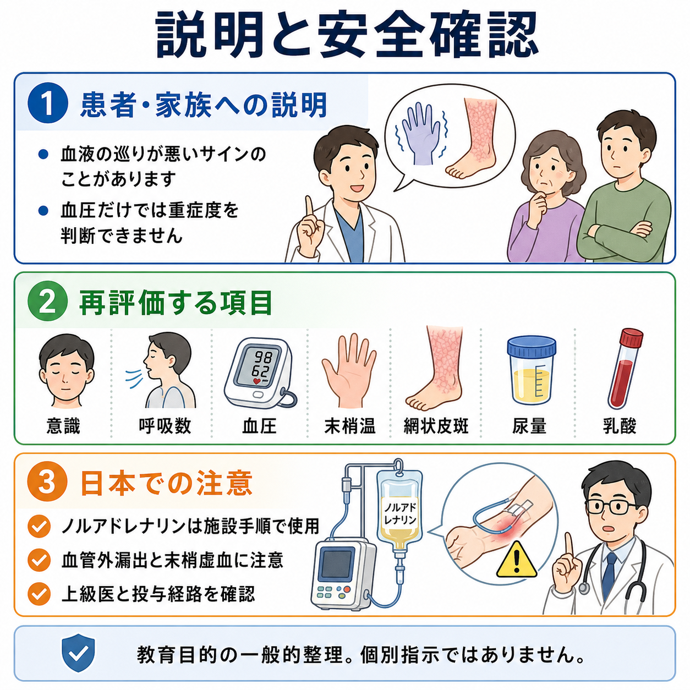

---
title: "低血圧患者で輸液を入れてよいかどう判断するか"
description: "脱水・出血、敗血症、心不全、閉塞性ショックを鑑別し、輸液反応性と輸液による害を同時に評価する。"
aliases:
  - "低血圧の輸液判断"
tags:
  - 領域/救急・初期対応
  - 種類/クリニカルクエスチョン
  - 対象/研修医
question: "低血圧患者で輸液を入れてよいかどう判断するか"
clinical_area: "救急・初期対応"
audience: "研修医"
evidence_level: "mixed"
created: "2026-04-27"
updated: "2026-04-27"
enableToc: true
---

# 低血圧患者で輸液を入れてよいかどう判断するか

> このノートは研修医教育のための一般的整理であり、個別患者への診断・治療指示ではありません。緊急性が高い、判断に迷う、施設方針が関わる場合は上級医・専門科へ早めに相談してください。

## クリニカルクエスチョン

低血圧患者で「とりあえず輸液」をしてよいか、脱水・敗血症・心不全・出血などをどう鑑別し、輸液反応性と危険性をどう評価するか。

## まず結論

- 輸液を入れるかは、血圧値だけでなく「低灌流があるか」「原因は何か」「輸液で心拍出量が増えそうか」「肺うっ血などの害が出そうか」で決める。ショックは組織酸素利用不全を伴う急性循環不全として捉える [3]。
- 脱水・出血などの循環血液量減少性ショックでは輸液や輸血が必要になりやすい。一方、心原性ショック、閉塞性ショック、肺うっ血がある状態では、漫然とした輸液で悪化しうる [3], [4]。
- 敗血症性ショックでは初期輸液は重要だが、過剰輸液の害にも注意する。J-SSCG 2024 は、一部の患者で3時間以内に少なくとも30 mL/kgの晶質液が必要になり得る一方、輸液反応性評価が必要とする [1]。
- 初期輸液後や迷う状況では、PLR、少量輸液負荷、心エコー、脈圧・一回拍出量変化などの動的指標で再評価する。CVPや血圧だけで輸液を続ける判断は避ける [2], [3]。
- 低血圧が続き、輸液反応性が乏しい、または輸液の害が強いときは、昇圧薬、輸血、感染源コントロール、閉塞解除、心不全治療など「原因治療」へ切り替える [1], [3], [5]。

## 判断の型

1. **ショックかを確認する**  
   意識変容、冷汗・末梢冷感、CRT延長、乏尿、乳酸上昇、頻呼吸、SpO2低下を確認する。敗血症では乳酸とCRTが初期蘇生の低灌流評価に使われる [1], [2]。

2. **4分類で原因を置く**  
   循環血液量減少性（脱水・出血）、分布異常性（敗血症・アナフィラキシー）、心原性、閉塞性（緊張性気胸・心タンポナーデ・肺塞栓）に分ける [3]。

3. **輸液反応性を見る**  
   「入れた水が血管内に入り、心拍出量を増やすか」を見る。PLRで血圧・脈圧・心拍出量が上がる、少量負荷で血圧や一回拍出量が改善する、虚脱したIVCなどが参考になる [2], [3]。

4. **輸液有害性を見る**  
   肺うっ血、頸静脈怒張、低酸素、右心負荷、高度心不全、重い腎不全、無尿、すでに多量輸液後では、少量ずつ止めて再評価する。心不全では肺・全身うっ血と組織低灌流の評価が重要で、うっ血解除を目的に利尿薬などを使う局面がある [4]。

5. **再評価で止めどきを決める**  
   250-500 mL程度の少量負荷ごとに、血圧、脈拍、呼吸数、SpO2、肺雑音、尿量、乳酸、心エコー所見を見直す。改善しない、呼吸が悪化する、肺エコーB-lineが増える、頸静脈怒張が強い場合は追加輸液を止める。

## 初期対応

- ABCDE、モニター、12誘導心電図、SpO2、血圧再測定、体温、血糖、意識レベル、尿量を確認する。
- 低灌流があれば、太い静脈路を確保し、採血、血液ガス、乳酸、血算、生化学、凝固、交差適合、感染が疑わしければ血液培養を同時に進める。
- 明らかな外出血は圧迫止血を優先し、内出血が疑わしければFAST、造影CT可否、外科・IVR・輸血部門への連絡を早める。
- 敗血症が疑わしければ、培養採取、抗菌薬、感染源評価、晶質液、必要時の昇圧薬を並行して進める。J-SSCG 2024 は初期蘇生で平衡晶質液を生理食塩液より提案し、標準治療に反応せず大量晶質液を要する場合の等張アルブミンを提案している [1]。
- 心不全・心原性が疑わしい低血圧では、肺うっ血、心電図異常、心エコー、BNP/NT-proBNP、胸部X線を確認し、輸液は慎重にする [4]。

## 鑑別・見逃し

- **出血・脱水**: 外傷、消化管出血、吐下血、黒色便、大量下痢・嘔吐、発汗、利尿薬、口渇、皮膚乾燥、Hb低下。ただし急性出血では初期Hbが保たれることがある。
- **敗血症**: 発熱または低体温、悪寒戦慄、感染巣、意識変容、頻呼吸、乳酸上昇。初期は皮膚温が保たれた低血圧でも否定しない [1], [2]。
- **心原性**: 胸痛、呼吸困難、肺うっ血、S3、頸静脈怒張、下腿浮腫、心電図異常、心エコーで収縮低下・弁膜症・右心負荷。
- **閉塞性**: 緊張性気胸、心タンポナーデ、肺塞栓。輸液だけで粘らず、減圧・ドレナージ・再灌流など原因解除を急ぐ [3]。
- **薬剤・内分泌・代謝**: 降圧薬、硝酸薬、利尿薬、β遮断薬、Ca拮抗薬、鎮静薬、副腎不全、低血糖、アナフィラキシー。

## 検査

- **ベッドサイド**: 血圧を左右差・カフサイズも含めて再測定、心拍、呼吸数、SpO2、体温、CRT、皮膚冷感、頸静脈、肺雑音、浮腫、尿量。
- **血液検査**: 血液ガス、乳酸、血算、電解質、腎機能、肝胆道系、凝固、トロポニン、BNP/NT-proBNP、血糖。敗血症疑いでは培養を抗菌薬前に可能な範囲で採る [1], [2]。
- **画像・生理検査**: 心電図、胸部X線、心エコー、肺エコー、IVC評価、FAST、必要時CT。
- **輸液反応性評価**: PLR、少量輸液負荷、心エコーでの一回拍出量変化、脈圧変化を組み合わせる。静的なCVPや単回血圧だけで判断しない [2], [3]。

## 治療・マネジメント

- **輸液してよい可能性が高い場面**: 明らかな脱水、出血制御と並行する循環血液量減少、敗血症性低灌流、PLRや少量負荷で血圧・脈圧・心拍出量が改善する場合。
- **輸液を慎重にする場面**: 肺うっ血、頸静脈怒張、低酸素、心エコーで重い心機能低下・右心負荷、無尿に近い腎不全、すでに大量輸液後、閉塞性ショック疑い。
- **量と見直し**: 250-500 mLずつ投与し、毎回「低灌流は改善したか」「呼吸は悪化していないか」「尿量や乳酸は改善方向か」を見る。敗血症では初期に一定量が必要な患者がいるが、過剰輸液による臓器うっ血を避けるため反応性評価が必要である [1], [2]。
- **出血が疑わしい場合**: 輸液だけで血圧を上げるより、止血、輸血、凝固補正、外科・IVRを優先する。厚生労働省の輸血療法指針では、出血時は血圧・脈拍・尿量・心電図・血算・血液ガスを参考に輸液・輸血を管理するとされる [6]。
- **敗血症性ショック**: 初期輸液と並行し、低血圧が続く場合は早期昇圧薬を検討する。J-SSCG 2024 はノルアドレナリンを第一選択、バソプレシンを第二選択として提案している [1]。
- **日本での注意**: ノルアドレナリン注1mgのPMDA添付文書上の効能は「急性低血圧またはショック時の補助治療」であり、輸血・輸液に代わる薬剤ではない。投与経路、希釈、血管外漏出、過度の昇圧反応は施設手順と上級医確認が必要である [5]。

## 図解

## 指導医に確認するポイント

- この低血圧は本当にショックか、低灌流所見は何か。
- 4分類のどれが最も疑わしいか。複数の型が混在していないか。
- 追加輸液の根拠は何か。PLR、少量負荷、エコー、尿量、乳酸のどれで再評価するか。
- 肺うっ血、右心負荷、腎不全、低酸素など輸液の害はないか。
- 輸液で改善しない場合、昇圧薬、輸血、抗菌薬、止血、閉塞解除、循環器・集中治療への相談をいつ行うか。

## 患者説明

- 「血圧が低く、体の臓器へ血液が十分届いていない可能性があります。」
- 「原因には脱水、出血、感染、心臓の働きの低下などがあり、原因によって点滴が助けになる場合と、逆に息苦しさを悪くする場合があります。」
- 「少量ずつ点滴し、血圧、呼吸、尿量、血液検査、エコーを見ながら続けるか判断します。」
- 「状態によっては、点滴だけでなく、抗菌薬、輸血、血圧を支える薬、出血を止める処置、心臓や肺の治療が必要になります。」

## ピットフォール

- 血圧だけを見て「低いから輸液」と決める。
- 心不全・肺うっ血・閉塞性ショックに気づかず、輸液で低酸素を悪化させる。
- 敗血症で初期輸液後も同じ速度で入れ続け、再評価しない。
- 出血性ショックで輸液だけを続け、止血・輸血・外科/IVR連絡が遅れる。
- ノルアドレナリンを「輸液の代わり」と誤解する。添付文書上も輸血・輸液に代わるものではない [5]。
- CVP、単回のIVC径、単回血圧だけで輸液反応性を断定する。

## 関連ノート

- 作成候補: `敗血症性ショックの初期対応`
- 作成候補: `心原性ショックを疑う低血圧の初期対応`
- 作成候補: `出血性ショックで輸血を始めるタイミング`
- 作成候補: `PLRと輸液反応性の見方`

## MOC更新候補

- [[MOC｜救急・初期対応]]
- MOC・循環不全.md（本サイト外）

## 参考文献

[1] Shime N, Nakada TA, Yatabe T, et al. The Japanese Clinical Practice Guidelines for Management of Sepsis and Septic Shock 2024. *Acute Medicine & Surgery*. 2025;12:e70037. https://doi.org/10.1002/ams2.70037

[2] Evans L, Rhodes A, Alhazzani W, et al. Surviving Sepsis Campaign: International Guidelines for Management of Sepsis and Septic Shock 2021. *Intensive Care Medicine*. 2021;47:1181-1247. https://doi.org/10.1007/s00134-021-06506-y

[3] Cecconi M, De Backer D, Antonelli M, et al. Consensus on Circulatory Shock and Hemodynamic Monitoring. Task Force of the European Society of Intensive Care Medicine. *Intensive Care Medicine*. 2014;40:1795-1815. https://doi.org/10.1007/s00134-014-3525-z

[4] Kitai T, Kohsaka S, Kato T, et al. JCS/JHFS 2025 Guideline on Diagnosis and Treatment of Heart Failure. *Circulation Journal*. 2025;89:1278-1444. https://doi.org/10.1253/circj.CJ-25-0002

[5] 医薬品医療機器総合機構（PMDA）. ノルアドリナリン注1mg 医療用医薬品情報（添付文書 2026年4月21日）. https://www.pmda.go.jp/PmdaSearch/rdSearch/02/2451401A1034?user=1

[6] 厚生労働省. 輸血療法の実施に関する指針（改定版）. https://www.mhlw.go.jp/new-info/kobetu/iyaku/kenketsugo/5tekisei3a.html

## 更新ログ

- 2026-04-27: 初版作成。
