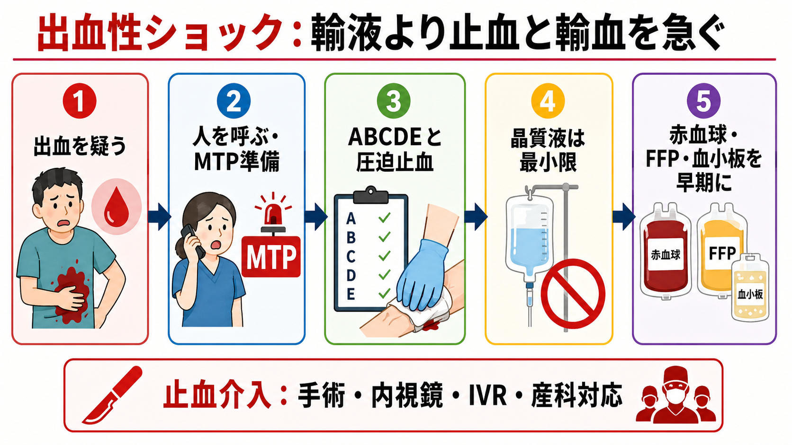
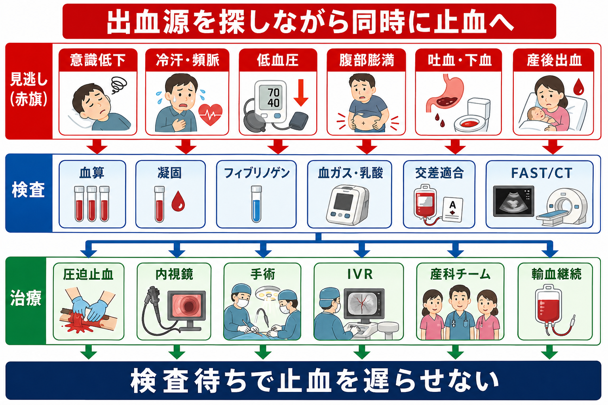
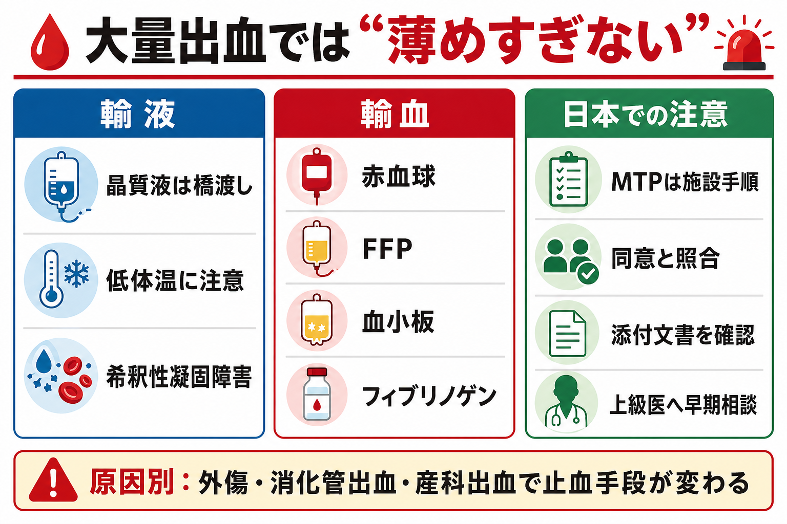

---
title: "出血性ショックを疑ったとき輸液と輸血をどう考えるか"
description: "外傷・消化管出血・産科出血などで、晶質液に偏らず大量輸血と止血介入へつなげる初期対応を整理する。"
aliases:
  - "出血性ショックの輸液と輸血"
tags:
  - 領域/救急・初期対応
  - 種類/クリニカルクエスチョン
  - 対象/研修医
question: "出血性ショックを疑ったとき輸液と輸血をどう考えるか"
clinical_area: "救急・初期対応"
audience: "研修医"
evidence_level: "guideline/review"
created: "2026-04-27"
updated: "2026-04-27"
enableToc: true
---

# 出血性ショックを疑ったとき輸液と輸血をどう考えるか

> このノートは研修医教育のための一般的整理であり、個別患者の診断・治療指示ではありません。緊急性が高い、判断に迷う、施設方針が関わる場合は上級医・専門科に相談してください。

## クリニカルクエスチョン

出血性ショックを疑ったとき、初期輸液、輸血、大量輸血プロトコル、止血介入をどの順番で考えるか。

## まず結論

- 出血性ショックでは「血圧を輸液だけで戻す」より、「出血源を止める」「赤血球・血漿・血小板・フィブリノゲンを早く補う」ことを同時に進める。[1],[2],[6]
- 晶質液はルート確保から輸血開始までの橋渡しにとどめ、過量投与による低体温、希釈性凝固障害、アシドーシスを避ける。[1],[6]
- 外傷では圧迫止血、骨盤固定、手術、IVRを早く考え、消化管出血では内視鏡、産科出血では産科・麻酔科・輸血部門を含む危機的出血対応へつなげる。[3],[6],[7]
- 大量輸血があり得ると感じた時点で、上級医、救急、外科、産婦人科、内視鏡、IVR、麻酔科、輸血部へ同時に連絡する。[1],[2],[3]
- トラネキサム酸は外傷性出血や産後出血で早期投与の根拠があるが、適応、禁忌、投与量、施設手順を確認して使う。[8],[9],[10]
- 日本では、MTP、緊急輸血、O型赤血球、FFP・血小板の払い出し、フィブリノゲン製剤・クリオプレシピテートの運用が施設で異なる。院内手順と添付文書を必ず確認する。[2],[3],[4],[5]

## 判断の型

1. 出血性ショックを「否定できない」と判断したら、初期輸液の前に人を呼ぶ。
2. ABCDEを進めながら、見える出血は圧迫止血、骨盤外傷は骨盤固定、産科出血は産科危機的出血の宣言を考える。[3],[6]
3. 太い末梢静脈路または骨髄路を確保し、採血、血液型、交差適合、不規則抗体、血算、凝固、フィブリノゲン、血ガス・乳酸を同時に出す。[1],[2]
4. 輸血開始までの晶質液は最小限にし、温めた輸液・輸血、保温、カルシウム、低体温・アシドーシス・低Ca血症の補正を意識する。[1],[6]
5. 画像や検査で待たず、外傷なら手術・IVR、消化管出血なら内視鏡、産科出血なら子宮収縮薬・バルーン・手術・IVRなど、原因別の止血ルートへ乗せる。[3],[6],[7]

## 初期対応

- **安全確保と応援要請**: 大量出血、冷汗、頻脈、低血圧、意識障害、乳酸上昇、腹部膨満、吐下血、産後出血を見たら、単独対応をやめて上級医と関連チームを呼ぶ。
- **ABCDE**: 気道・呼吸を確認し、酸素投与、モニター、除細動器、体温管理を準備する。意識障害は低灌流、低酸素、頭部外傷、低血糖も同時に確認する。
- **Cの最優先**: 見える出血は直接圧迫、止血帯、創部パッキングなどを施設手順内で行う。骨盤外傷が疑わしければ骨盤固定を考える。[6]
- **ルートと採血**: 18G以上の末梢静脈路2本を目標にし、難しければ早期に骨髄路や中心静脈路を相談する。輸血前採血は大事だが、採血で輸血開始を遅らせない。
- **輸液**: 晶質液は一時的な循環維持の橋渡し。大量に入れて血液を薄める対応は、出血性ショックでは不利になり得る。[1],[6]
- **MTP**: 大量輸血が必要になりそうなら、院内のMTPまたは緊急輸血手順を発動する。発動基準、製剤比、解除基準は施設差が大きい。[1],[2]

## 鑑別・見逃し

| 優先度 | 疾患・状態 | 見逃さない理由 | 手がかり |
|---|---|---|---|
| 高 | 外傷性大量出血 | 防ぎ得る外傷死の主要因で、止血介入の遅れが致命的になる。 | 高エネルギー外傷、骨盤痛、腹部膨満、FAST陽性、低体温 |
| 高 | 上部消化管出血 | 内視鏡止血・IVR・手術へつなぐ疾患で、輸液だけでは解決しない。 | 吐血、黒色便、NSAIDs、抗血栓薬、肝硬変、ショック |
| 高 | 産科危機的出血 | 急速にDICへ進み、フィブリノゲン低下が早い。 | 産後出血、胎盤異常、弛緩出血、ショックインデックス上昇、フィブリノゲン低値 [3] |
| 高 | 破裂性大動脈瘤・大動脈解離破裂 | 輸血と同時に外科・血管内治療へ直結する。 | 突然の腹痛・背部痛、拍動性腫瘤、高齢、循環虚脱 |
| 中 | 後腹膜出血 | 外表から出血量が分かりにくい。 | 骨盤骨折、抗凝固薬、腰背部痛、Hb低下 |
| 中 | 医原性出血 | 手技後・抗血栓薬使用中では急速に悪化する。 | カテーテル後、穿刺部腫脹、抗凝固薬、血圧低下 |

## 検査

| 検査 | 目的 | 注意点 |
|---|---|---|
| 血算 | Hb、血小板、出血量の推定 | 急性出血直後のHbは過小評価にも過大評価にもなり得る。数値だけで安心しない。 |
| PT-INR、APTT、フィブリノゲン | 凝固障害と補充対象の把握 | 産科出血や大量出血ではフィブリノゲン低下を早く見る。[1],[3],[4] |
| 血液型、不規則抗体、交差適合 | 安全な輸血準備 | 緊急度に応じて院内の緊急輸血手順を使う。[2],[5] |
| 血ガス、乳酸、電解質、Ca | 低灌流、アシドーシス、低Ca血症の評価 | 大量輸血ではクエン酸負荷による低Ca血症に注意する。[6] |
| FAST、単純X線、造影CT | 外傷出血源の推定 | 不安定ならCT室へ行く前に止血ルートを相談する。[6] |
| 内視鏡関連評価 | 消化管出血の止血方針 | 入院を要する上部消化管出血では内視鏡を早期に計画する。[7] |

## 治療・マネジメント

- **止血が治療の中心**: 輸液・輸血は時間を稼ぐ手段であり、根治は圧迫、内視鏡、手術、IVR、産科的処置などの出血制御である。[3],[6],[7]
- **輸液は最小限**: 輸血開始前に必要な循環維持として使う。大量晶質液で血圧だけを正常化しようとすると、凝固因子・血小板の希釈、低体温、組織浮腫を招く。[1],[6]
- **輸血は成分を意識する**: 赤血球だけでなく、FFP、血小板、フィブリノゲンを含めて凝固能を保つ。MTPの比率や検査補正型の運用は施設の手順に従う。[1],[2]
- **消化管出血の輸血閾値は文脈で変わる**: 上部消化管出血の入院患者ではHb 7 g/dLを目安に赤血球輸血を考える推奨があるが、ショック、持続出血、心血管疾患、抗血栓薬内服では機械的に当てはめない。[7]
- **トラネキサム酸**: 外傷性出血では早期投与、産後出血では出血発症後できるだけ早期の投与が国際的に推奨される。日本では薬剤添付文書、施設手順、禁忌、腎機能、血栓リスクを確認して上級医と判断する。[8],[9],[10]
- **フィブリノゲン**: 産科危機的出血ではフィブリノゲン低下が重症化の手がかりになり、フィブリノゲン製剤やクリオプレシピテートの使用が話題になる。日本ではフィブリノゲンHTの適応・保険、院内在庫、払い出し手順を確認する。[3],[4]
- **日本での注意**: 2026年3月24日に厚生労働省は従来の「血液製剤の使用指針」「輸血療法の実施に関する指針」「血液製剤保管管理マニュアル」を廃止し、「輸血療法実践ガイド」参照へ整理した。現場では院内輸血療法委員会の手順、輸血同意、照合、記録、緊急時例外規定を確認する。[2]
- **相談基準**: 赤血球輸血が始まりそう、収縮期血圧が保てない、乳酸が高い、凝固異常がある、抗凝固薬内服、産後出血、外傷、吐下血が持続する場合は、早期に上級医・専門科へ相談する。

## 図解

## 指導医に確認するポイント

- この患者は「大量輸血が必要になりそう」と判断してよいか。MTPを発動するか。
- 緊急輸血の順番は、O型赤血球、同型未交差、交差適合後のどれで進めるか。
- FFP、血小板、フィブリノゲン、カルシウム補正をどのタイミングで入れるか。
- 外傷なら手術室、IVR、CTのどれを優先するか。消化管出血なら内視鏡室へいつ移すか。産科出血なら危機的出血宣言をするか。
- 抗凝固薬・抗血小板薬の中和、トラネキサム酸、PPI、子宮収縮薬など、原因別治療をどう組み合わせるか。
- 輸血同意が未取得または本人確認困難な緊急時に、院内規定上どう記録するか。

## 患者説明

- 「出血で体の血液量や血を固める力が足りなくなっている可能性があります。」
- 「点滴だけでは足りないことがあり、血液製剤で酸素を運ぶ力と止血に必要な成分を補う必要があります。」
- 「同時に、出血している場所を止めるために、内視鏡、手術、カテーテル治療、産科処置などを急いで検討します。」
- 「輸血には副作用や感染症などのリスクがありますが、今は出血による危険とのバランスを見て必要性を判断します。」

## ピットフォール

- Hbがまだ高いから大丈夫、と判断する。急性出血では初回Hbが重症度を反映しないことがある。
- 晶質液を大量に入れて、低体温と希釈性凝固障害を悪化させる。
- 赤血球だけを急いで、FFP、血小板、フィブリノゲン、Ca、体温を忘れる。
- CTや検査結果を待つ間に、外科・内視鏡・IVR・産科チームへの連絡が遅れる。
- 産科出血を通常の貧血対応として見て、フィブリノゲン低下やDICを見逃す。
- 緊急輸血の照合、記録、副作用観察を「忙しいから後で」にしてしまう。

## 関連ノート

- 該当する既存ノートが未確認のため、今回は新規 wikilink は作成しない。
- 関連候補: ショックの初期対応、輸血副作用、上部消化管出血、産科危機的出血、外傷初期診療、抗凝固薬内服中の出血。

## MOC更新候補

- [[MOC｜救急・初期対応]]
- MOC｜血液・腫瘍・輸血.md（本サイト外）
- MOC｜消化器.md（本サイト外）
- MOC｜小児・産婦人科.md（本サイト外）

## 参考文献

[1] 松本雅則, ほか. 大量出血症例に対する血液製剤の適正な使用のガイドライン（第2版）. 日本輸血細胞治療学会誌. 2025;71(6):750-798. https://doi.org/10.3925/jjtc.71.750

[2] 厚生労働省. 「血液製剤の使用指針」、「輸血療法の実施に関する指針」及び「血液製剤保管管理マニュアル」の廃止並びに「輸血療法実践ガイド」の周知について. 2026-03-24. https://www.mhlw.go.jp/stf/newpage_72052.html

[3] 日本産科婦人科学会. 産科危機的出血への対応指針 2022 のお知らせ. 2022-06-03. https://www.jsog.or.jp/medical/867/

[4] PMDA. フィブリノゲンHT静注用1g「JB」医療用医薬品情報. https://www.pmda.go.jp/PmdaSearch/rdSearch/02/6343411X1058?user=1

[5] 日本赤十字社. 輸血用血液製剤添付文書集. 2024年3月現在. https://www.jrc.or.jp/mr/relate/info/pdf/202403tenpubunsyo_book.pdf

[6] Rossaint R, Afshari A, Bouillon B, et al. The European guideline on management of major bleeding and coagulopathy following trauma: sixth edition. Critical Care. 2023;27:80. https://doi.org/10.1186/s13054-023-04327-7

[7] Laine L, Barkun AN, Saltzman JR, Martel M, Leontiadis GI. ACG Clinical Guideline: Upper Gastrointestinal and Ulcer Bleeding. Am J Gastroenterol. 2021;116(5):899-917. https://doi.org/10.14309/ajg.0000000000001245

[8] Roberts I, Shakur H, Coats T, et al. The CRASH-2 trial: effects of tranexamic acid on death, vascular occlusive events and transfusion requirement in bleeding trauma patients. Health Technol Assess. 2013;17(10):1-79. https://doi.org/10.3310/hta17100

[9] World Health Organization. WHO recommendation on tranexamic acid for the treatment of postpartum haemorrhage. 2017. https://www.who.int/publications/i/item/9789241550154

[10] PMDA. トランサミン注5%／トランサミン注10% 医療用医薬品情報. https://www.pmda.go.jp/PmdaSearch/rdSearch/02/3327401A1127?user=1

## 更新ログ

- 2026-04-27: 初版作成。
