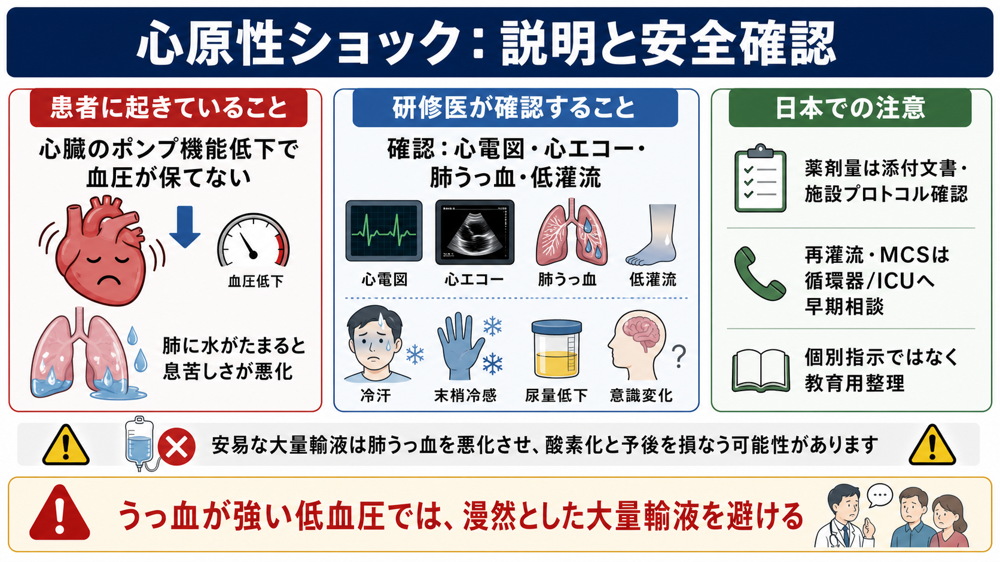
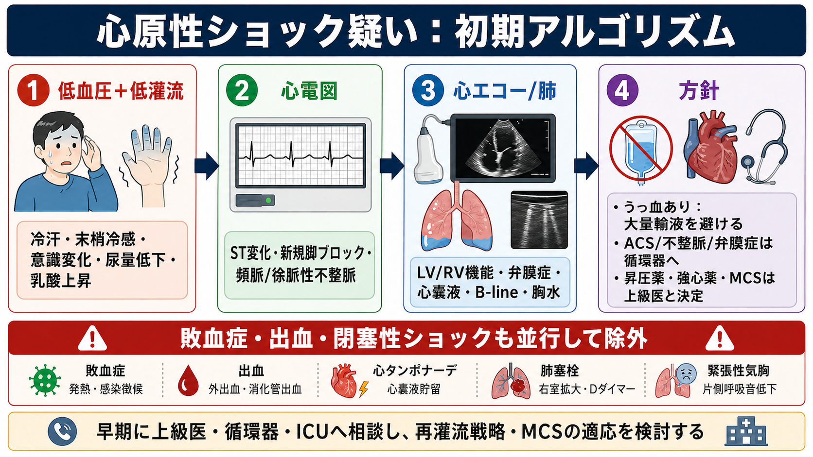

---
title: "心原性ショックを疑う低血圧患者で何を確認するか"
description: "心電図・心エコー・肺うっ血・末梢冷感から心原性を見抜き、過剰輸液を避ける。"
aliases:
  - "心原性ショックの確認"
tags:
  - 領域/救急・初期対応
  - 種類/クリニカルクエスチョン
  - 対象/研修医
question: "心原性ショックを疑う低血圧患者で何を確認するか"
clinical_area: "救急・初期対応"
audience: "研修医"
evidence_level: "mixed"
created: "2026-04-27"
updated: "2026-04-27"
enableToc: true
---

# 心原性ショックを疑う低血圧患者で何を確認するか

> このノートは研修医教育のための一般的整理であり、個別患者の診断・治療指示ではありません。緊急性が高い、判断に迷う、施設方針が関わる場合は上級医・専門科に相談してください。

## クリニカルクエスチョン

心原性ショックを疑う低血圧患者で何を確認するか。

## まず結論

- 低血圧だけで心原性ショックとは判断しない。低灌流（意識変化、冷汗、末梢冷感、尿量低下、乳酸上昇）と、心原性を示す所見（心電図異常、心エコー異常、肺うっ血、頸静脈怒張など）を同時に確認する [1,2]。
- 最初の数分は「心電図」「心エコー」「肺うっ血」「末梢冷感」を並行して見る。ST変化・新規脚ブロック・致死性不整脈、左室/右室機能低下、急性弁膜症、心嚢液貯留、B-lineや胸水があれば心原性・閉塞性を強く疑う [1,2,5]。
- うっ血がある低血圧に漫然と大量輸液を行うと、肺水腫と酸素化を悪化させる可能性がある。輸液反応性が不明な場合は、少量で再評価し、昇圧薬・強心薬・利尿・再灌流・MCSの要否を上級医、循環器、ICUと早期に相談する [1,2,5]。
- 急性冠症候群による心原性ショックでは、早期再灌流が予後改善に直結する重要介入である [4,7]。ただし、敗血症、出血、肺塞栓、心タンポナーデ、緊張性気胸などは並行して除外する [2,6]。
- 日本で使用する昇圧薬・強心薬・MCSは、薬剤添付文書、施設プロトコル、実施可能な循環器/ICU体制に依存する。投与量やデバイス選択は研修医単独で決めず、施設手順に沿って確認する [3,9,10]。

## 判断の型

1. ショックか：低血圧に加えて、低灌流のサインを探す。血圧値だけでなく、意識、皮膚、尿量、乳酸、腎機能、肝胆道系酵素、末梢冷感の変化を見る [1,6]。
2. 心臓が原因か：12誘導心電図、ベッドサイド心エコー、肺エコー/胸部X線、頸静脈怒張、ラ音、末梢冷感を組み合わせる。左室・右室・弁・心嚢液の異常を短時間で拾う [1,2,5]。
3. うっ血があるか：肺B-line、胸水、ラ音、低酸素、頸静脈怒張があれば、大量輸液よりも循環器・ICUへの早期エスカレーションを優先する [1,2]。
4. 原因治療に直結する病態か：ACS、不整脈、機械的合併症、重症弁膜症、心筋炎、右室梗塞、肺塞栓、心タンポナーデを探す [2,4,5]。
5. 重症度を共有するか：SCAI SHOCK分類のA-Eは、悪化速度とエスカレーションの必要性をチーム内で共有する言語として有用である [6]。

## 初期対応

- ABCDEで気道、呼吸、循環、意識、体温を確認し、心電図モニター、血圧、SpO2、静脈路、採血、動脈血/静脈血ガス、乳酸を同時に進める [1,5]。
- 12誘導心電図を早期に取り、ST上昇/低下、新規脚ブロック、徐脈、頻拍、心室性不整脈、ペーシング不全を確認する [4,5]。
- ベッドサイド心エコーで、左室収縮、右室拡大/収縮低下、局所壁運動、重症弁膜症、乳頭筋断裂を示唆する僧帽弁逆流、心嚢液、下大静脈を確認する [1,5]。
- 肺うっ血を、ラ音、低酸素、肺エコーB-line、胸部X線で見る。肺うっ血が強い場合、低血圧でも大量輸液は危険になり得る [1,2]。
- 心原性が疑わしい時点で、上級医、循環器、ICU、カテーテル室、必要時は心臓血管外科へ早めに共有する。搬送・転院が必要な施設では、遅らせない [2,4]。

## 鑑別・見逃し

| 優先度 | 疾患・状態 | 見逃さない理由 | 手がかり |
|---|---|---|---|
| 高 | 急性冠症候群による心原性ショック | 早期再灌流が予後に関わる | 胸痛、ST変化、新規脚ブロック、壁運動異常、トロポニン上昇 [4,7] |
| 高 | 致死性不整脈・徐脈 | 除細動、ペーシング、薬物治療で急変を止められる可能性 | wide QRS頻拍、VT/VF、完全房室ブロック、徐脈性ショック [5] |
| 高 | 右室梗塞 | 硝酸薬や過剰利尿で悪化し得る | 下壁梗塞、右側胸部誘導、右室拡大、頸静脈怒張、肺うっ血が乏しい低血圧 [5] |
| 高 | 心タンポナーデ | 心原性に見えて閉塞性ショックであり、治療が異なる | 心嚢液、右房/右室虚脱、頸静脈怒張、奇脈 [5,6] |
| 高 | 肺塞栓 | 右室不全・低酸素・ショックの原因になる | 右室拡大、D-shaped LV、低酸素、Dダイマー、リスク因子 [6] |
| 中 | 急性弁膜症・機械的合併症 | ACS後の急性MR、VSD、自由壁破裂は緊急対応が必要 | 新規雑音、急性肺水腫、局所壁運動異常、心エコー異常 [4,5] |
| 中 | 敗血症・出血との混合ショック | 心原性所見があっても血管拡張や低容量が重なる | 発熱、感染巣、出血、Hb低下、温かい皮膚、広い脈圧 [2,6] |

## 検査

| 検査 | 目的 | 注意点 |
|---|---|---|
| 12誘導心電図 | ACS、不整脈、伝導障害を拾う | 初回正常でも経時変化があり得るため再検する [4] |
| ベッドサイド心エコー | LV/RV機能、壁運動、弁膜症、心嚢液、下大静脈を評価する | 画像が不十分なら心エコー可能な医師・技師に早期相談する [1,5] |
| 肺エコー・胸部X線 | 肺うっ血、胸水、肺炎、気胸を評価する | 低血圧で肺うっ血があれば輸液方針を見直す [1,2] |
| 血液ガス・乳酸 | 低灌流、酸塩基、呼吸不全の評価 | 乳酸上昇は心原性に限らず重症度のサインとして扱う [6] |
| トロポニン、BNP/NT-proBNP | 心筋傷害、心不全を補助評価する | BNP高値だけで心原性とは断定しない。腎機能や慢性心不全で上がる [1,6] |
| 採血一般、凝固、腎肝機能 | 臓器障害、出血、感染、薬剤調整を評価する | 昇圧薬、造影、MCSのリスク評価にも関わる [2,3] |

## 治療・マネジメント

- 原則は「低灌流を改善しながら、原因治療へつなぐ」。ACSでは再灌流、不整脈では除細動・ペーシング・抗不整脈、機械的合併症や重症弁膜症では循環器・心臓血管外科の判断が必要になる [4,5,7]。
- うっ血が強い場合は、輸液を自動的に反復しない。少量投与で反応を見ても改善しない、または酸素化・肺うっ血が悪化する場合は方針を切り替える [1,2]。
- 昇圧薬は冠灌流圧と臓器灌流を保つために検討される。AHA statementではノルエピネフリンが多くの心原性ショックで選択肢になり得ると整理されているが、日本では添付文書、施設手順、投与経路、末梢漏出対策を確認する [5,9]。
- 強心薬は低心拍出が主体のときに検討されるが、頻脈、不整脈、虚血悪化のリスクがある。ドブタミン、ドパミンなどの使用は、添付文書と施設プロトコルに沿い、上級医・循環器・ICUと決める [1,5,9]。
- 薬剤で灌流が保てない、急速に悪化する、酸素化不良が重なる場合はMCSを検討する。日本ではPCPS/ECMO/IMPELLAの適応と運用は施設経験、デバイス利用条件、チーム体制に依存する [2,3]。
- ECLS-SHOCKでは急性MI関連ショックに対する routine ECLS の30日死亡改善は示されず、DanGer Shockでは選択されたSTEMI関連ショックでmicroaxial flow pumpが6か月死亡を下げた一方、合併症が増えた。MCSは「早く入れればよい」ではなく、対象選択、挿入・抜去、合併症管理まで含めたチーム判断が必要である [3,8]。

日本での注意:

- 海外文献の vasopressor/inotrope、shock team、advanced shock center、MCS の記載は、そのまま日本の薬剤名、用量、適応、保険、デバイス運用に置き換えない。PMDA添付文書、JCS/J4CS文書、施設プロトコル、地域の循環器救急体制を確認する [2,3,9,10]。
- 厚生労働省の循環器病対策推進基本計画は、心疾患を含む循環器病の医療提供体制整備を政策課題として位置づけている。現場では、自施設で完結できる治療と、早期転院・搬送調整が必要な治療を最初から分けて考える [10]。

## 図解

## 指導医に確認するポイント

- 心原性、閉塞性、敗血症性、出血性のどれを最も疑うか。混合ショックとして扱うべきか。
- 追加輸液をしてよい状況か。肺うっ血、右室梗塞、心タンポナーデ、出血の評価は十分か。
- どの時点で循環器、ICU、カテーテル室、心臓血管外科、転院先へ連絡するか。
- 昇圧薬・強心薬の選択、投与経路、モニタリング、末梢投与時の漏出対策、中心静脈路の要否。
- 再灌流、除細動/ペーシング、IABP、PCPS/ECMO、IMPELLAなどの適応を検討する段階か [3,4]。

## 患者説明

- 「血圧が低いだけでなく、心臓のポンプ機能が落ちて全身の血流が足りない可能性があります。」
- 「心電図、心臓の超音波、肺に水がたまっていないか、手足の冷たさや尿量を見て、心臓が原因かを急いで確認します。」
- 「肺に水がたまっている場合、点滴を増やすと息苦しさが悪くなることがあります。血圧を支える薬や心臓の治療を専門チームと相談します。」
- 「心筋梗塞や重い不整脈が原因なら、カテーテル治療や電気的治療が必要になることがあります。」

## ピットフォール

- 血圧値だけを見て「脱水」と決め、肺うっ血を確認しないまま輸液を反復する。
- 心電図を1回だけ見て終わる。ACSや不整脈は経時的に変化する。
- 心エコーで左室だけを見る。右室梗塞、肺塞栓、心タンポナーデ、急性弁膜症を見落とす。
- 冷汗・末梢冷感・尿量低下・意識変化を「なんとなく重そう」で終わらせ、低灌流として共有しない。
- 昇圧薬・強心薬の開始が目的化し、原因治療や転院・MCS検討が遅れる。
- 海外ガイドラインの薬剤・デバイス記載を、そのまま日本の用量・保険・施設運用に当てはめる。

## 関連ノート

- 関連ノート候補: 「ショック患者の初期対応」「敗血症性ショックで最初に何をするか」「急性冠症候群を疑う胸痛で何を確認するか」「肺塞栓を疑うショックで何を確認するか」「ベッドサイド心エコーでショックをどう見るか」
- 内部リンク化は、既存ノートの実在確認後に行う。

## MOC更新候補

- [[MOC｜救急・初期対応]]
- MOC｜循環器.md（本サイト外）

## 参考文献

[1] Kitai T, Kohsaka S, Kato T, et al. JCS/JHFS 2025 Guideline on Diagnosis and Treatment of Heart Failure. Circulation Journal. 2025;89(8):1278-1444. https://doi.org/10.1253/circj.CJ-25-0002

[2] Nakashima T, Kondo T, Nakata J, et al. Expert Consensus Statement on the Evaluation, Treatment, and Transfer of Cardiogenic Shock Using a Delphi Method Approach: A Report of the Japan Critical Care Cardiology Committee (J4CS). Circulation Journal. 2025;89(7):998-1011. https://doi.org/10.1253/circj.CJ-25-0192

[3] Nishimura T, Hirata Y, Ise T, et al. JCS/JSCVS/JCC/CVIT 2023 Guideline Focused Update on Indication and Operation of PCPS/ECMO/IMPELLA. Circulation Journal. 2024;88(6):1010-1046. https://doi.org/10.1253/circj.CJ-23-0698

[4] Rao SV, O'Donoghue ML, Ruel M, et al. 2025 ACC/AHA/ACEP/NAEMSP/SCAI Guideline for the Management of Patients With Acute Coronary Syndromes. Journal of the American College of Cardiology. 2025;85(22):2135-2237. https://doi.org/10.1016/j.jacc.2024.11.009

[5] van Diepen S, Katz JN, Albert NM, et al. Contemporary Management of Cardiogenic Shock: A Scientific Statement From the American Heart Association. Circulation. 2017;136(16):e232-e268. https://doi.org/10.1161/CIR.0000000000000525

[6] Naidu SS, Baran DA, Jentzer JC, et al. SCAI SHOCK Stage Classification Expert Consensus Update: A Review and Incorporation of Validation Studies. Journal of the American College of Cardiology. 2022;79(9):933-946. https://doi.org/10.1016/j.jacc.2022.01.018

[7] Hochman JS, Sleeper LA, Webb JG, et al. Early Revascularization in Acute Myocardial Infarction Complicated by Cardiogenic Shock. New England Journal of Medicine. 1999;341(9):625-634. https://doi.org/10.1056/NEJM199908263410901

[8] Thiele H, Zeymer U, Akin I, et al. Extracorporeal Life Support in Infarct-Related Cardiogenic Shock. New England Journal of Medicine. 2023;389:1286-1297. https://doi.org/10.1056/NEJMoa2307227 / Moller JE, Engstrom T, Jensen LO, et al. Microaxial Flow Pump or Standard Care in Infarct-Related Cardiogenic Shock. New England Journal of Medicine. 2024;390:1382-1393. https://doi.org/10.1056/NEJMoa2312572

[9] PMDA. 医療用医薬品情報: ノルアドリナリン注1mg、ドブタミン塩酸塩製剤、イノバン注100mg. https://www.pmda.go.jp/PmdaSearch/rdSearch/02/2451401A1034?user=1 / https://www.pmda.go.jp/PmdaSearch/rdSearch/02/2119404A1026?user=1 / https://www.pmda.go.jp/PmdaSearch/rdSearch/02/2119402A1299?user=1

[10] 厚生労働省. 循環器病対策推進基本計画（第2期）. 2023. https://www.mhlw.go.jp/stf/newpage_31654.html

## 更新ログ

- 2026-04-27: 初版作成。
