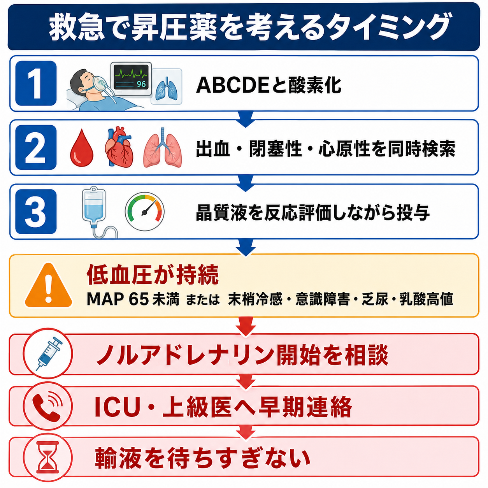
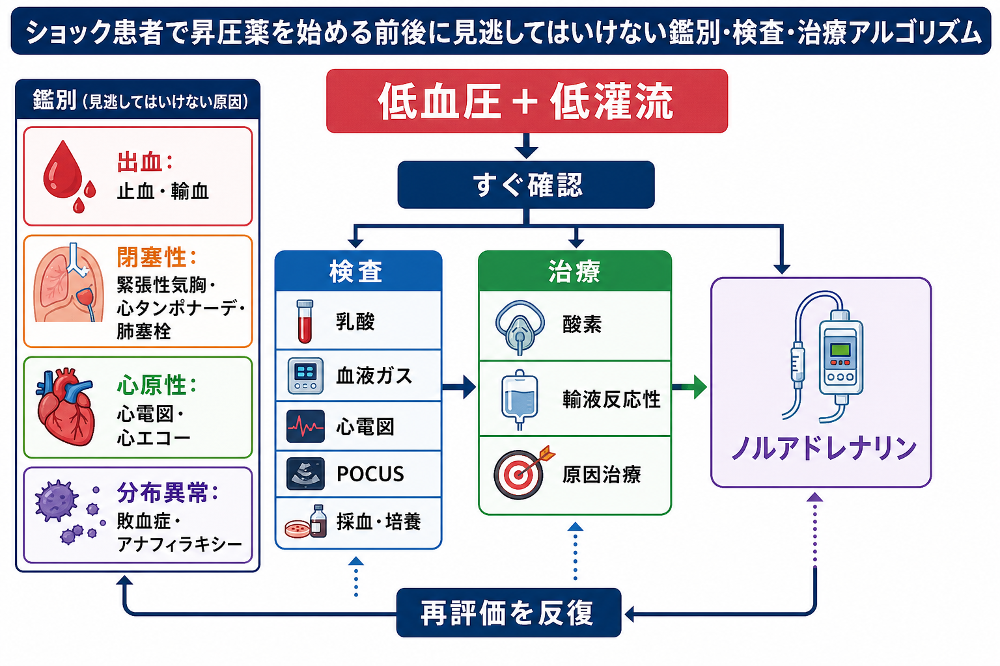
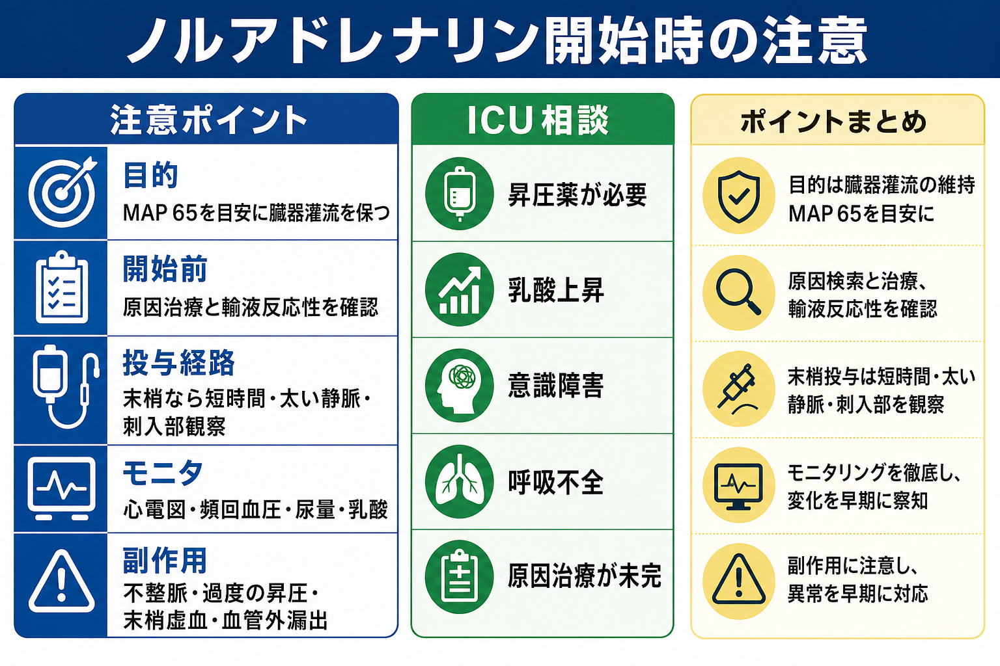

---
title: "救急で昇圧薬開始を考えるタイミングはいつか"
description: "十分な初期対応でも低血圧が続く場合のノルアドレナリン導入とICU相談の判断を学ぶ。"
aliases:
  - "昇圧薬開始のタイミング"
tags:
  - 領域/救急・初期対応
  - 種類/クリニカルクエスチョン
  - 対象/研修医
question: "救急で昇圧薬開始を考えるタイミングはいつか"
clinical_area: "救急・初期対応"
audience: "研修医"
evidence_level: "mixed"
created: "2026-04-27"
updated: "2026-04-27"
enableToc: true
---

# 救急で昇圧薬開始を考えるタイミングはいつか

> このノートは研修医教育のための一般的整理であり、個別患者の診断・治療指示ではありません。緊急性が高い、判断に迷う、施設方針が関わる場合は上級医・専門科に相談してください。

## クリニカルクエスチョン

救急で昇圧薬開始を考えるタイミングはいつか。

## まず結論

- 昇圧薬開始を考えるタイミングは、「輸液を何mL入れたか」だけではなく、ABCDE、酸素化、出血・閉塞性・心原性ショックの検索、原因治療を進めても、低血圧と低灌流が続く時点である。
- 敗血症性ショックでは、初期目標として MAP 65 mmHg 前後を目安にし、ノルアドレナリンを第一選択薬として考える。ただし慢性高血圧、頭部病変、心原性ショックなどでは目標は個別化する [1,2]。
- 大量輸液を待ちすぎると肺水腫、希釈性凝固障害、腹腔内圧上昇などの害がありうる。輸液反応性が乏しい、または輸液過剰が危ない患者では、上級医・ICUと相談して早めに昇圧薬へ移る [2,5]。
- ノルアドレナリンは日本でも急性低血圧・ショック時の補助治療に使われるが、輸血・輸液や原因治療の代替ではない。過度の昇圧、血管外漏出、末梢虚血、不整脈を監視する [3]。
- 研修医の実務上は「昇圧薬を準備する」こと自体が ICU・救急上級医・集中治療医へ早期連絡するサインである。

## 判断の型

1. **低血圧だけでなく低灌流を確認する。** 収縮期血圧、MAP、意識、皮膚冷感、毛細血管再充満時間、尿量、乳酸、代謝性アシドーシスをセットで見る。敗血症性ショックでは MAP 65 mmHg が初期目標として推奨される [1,2]。
2. **原因別に「昇圧薬だけでは危ない病態」を除外・同時対応する。** 出血性ショックは止血・輸血、緊張性気胸は脱気、心タンポナーデはドレナージ、肺塞栓は専門治療、心原性ショックは循環器・集中治療への早期相談が中心になる。
3. **輸液反応性を短い間隔で評価する。** 晶質液を使う場合も、血圧、末梢灌流、肺うっ血、エコー所見、尿量を見ながら投与する。固定量を満たすまで昇圧薬を待つ発想は避ける [2,5]。
4. **低血圧と低灌流が残るなら昇圧薬を準備する。** 敗血症性ショックではノルアドレナリンが第一選択であり、中心静脈路確保を待って開始が遅れる場合は、施設手順に従い太い末梢静脈から短時間開始する選択肢もある [2]。
5. **開始後も原因治療を止めない。** 抗菌薬、感染源コントロール、止血、再灌流、アナフィラキシーへのアドレナリン筋注など、原因別治療が予後を左右する。

## 初期対応

- **A/B:** 気道、呼吸仕事量、SpO2、酸素投与、換気不全を確認する。ショックでは低酸素とアシドーシスが循環不全を悪化させる。
- **C:** 2本以上の静脈路、採血、血液培養が必要なら抗菌薬前に採取、心電図モニタ、頻回血圧測定を行う。可能なら動脈圧ラインを検討する。
- **輸液:** 等張晶質液を基本に、肺うっ血、頸静脈怒張、心エコー、下大静脈、下肢浮腫、透析歴、心不全歴を見ながら反応を評価する [2]。
- **原因治療:** 敗血症が疑わしければ抗菌薬と感染源検索を急ぐ。出血なら止血と輸血、アナフィラキシーならアドレナリン筋注を優先する [4]。
- **相談:** 初期対応中に MAP 65 mmHg 未満が持続する、乳酸上昇、意識障害、乏尿、末梢冷感、呼吸不全を伴う場合は、昇圧薬開始前から上級医・ICUへ連絡する。

## 鑑別・見逃し

| 優先度 | 疾患・状態 | 見逃さない理由 | 手がかり |
|---|---|---|---|
| 高 | 出血性ショック | 昇圧薬だけでは組織酸素供給を改善しにくく、止血・輸血が遅れる | 外傷、消化管出血、腹痛、Hb低下、FAST陽性、抗凝固薬 |
| 高 | 敗血症性ショック | 早期の抗菌薬、感染源コントロール、ノルアドレナリンが必要になりうる | 発熱または低体温、感染巣、乳酸上昇、末梢冷感またはwarm shock |
| 高 | 閉塞性ショック | 原因解除が治療であり、昇圧薬は橋渡しに過ぎない | 緊張性気胸、心タンポナーデ、肺塞栓、頸静脈怒張、片側呼吸音低下 |
| 高 | 心原性ショック | 輸液過剰で悪化しやすく、強心薬・再灌流・補助循環を要することがある | 胸痛、心電図変化、肺水腫、心エコーで収縮不全 |
| 高 | アナフィラキシー | 第一選択はアドレナリン筋注で、ノルアドレナリン開始だけでは初期治療にならない | 蕁麻疹、喘鳴、喉頭症状、曝露歴、急速な血圧低下 [4] |
| 中 | 薬剤性・内分泌性 | 原因薬中止、解毒、ステロイド補充などが必要 | β遮断薬、Ca拮抗薬、鎮静薬、副腎不全、甲状腺クリーゼ |

## 検査

| 検査 | 目的 | 注意点 |
|---|---|---|
| 血液ガス・乳酸 | 低灌流とアシドーシスの把握、再評価の指標 | 乳酸だけでなく末梢灌流や尿量も合わせて判断する [2,6] |
| 心電図・トロポニン | 心筋梗塞、不整脈、心原性ショックの評価 | 正常心電図でも心原性を完全には除外しない |
| POCUS | 心機能、心嚢液、右室負荷、肺うっ血、気胸、腹腔内液体を短時間で見る | 所見が不確実なら画像・専門医評価へつなぐ |
| 血算・凝固・生化学 | 出血、DIC、腎障害、肝障害、電解質異常の把握 | 輸液・輸血・抗菌薬投与で変化するため反復評価する |
| 血液培養・感染巣検査 | 敗血症の原因検索と抗菌薬選択 | ショックでは検査で抗菌薬や循環補助を遅らせない [1,2] |
| 尿量 | 腎灌流と蘇生反応のモニタ | 尿道カテーテルの適応と感染リスクを考える |

## 治療・マネジメント

- **開始を考える具体的場面:** 初期輸液に反応しない、または肺水腫・心不全・腎不全などで追加輸液が危ない状況で、MAP 65 mmHg 未満、意識障害、乏尿、末梢冷感、乳酸上昇が残る場合。
- **敗血症性ショック:** ノルアドレナリンを第一選択として考える。SSC 2021はノルアドレナリンを他の昇圧薬より優先し、初期 MAP 65 mmHg を推奨している [2]。J-SSCG 2024も初期蘇生・循環作動薬を主要領域として扱う国内ガイドラインであり、日本の運用確認に使う [1]。
- **輸液との関係:** CLOVERS試験では、初期1-3 L後の敗血症性低血圧に対して、昇圧薬を早めに使う制限輸液戦略と多めの輸液戦略で90日までの死亡に有意差はなかった。したがって「早めの昇圧薬」は万能ではないが、輸液過剰を避ける選択肢として理解する [5]。
- **早期ノルアドレナリンの位置づけ:** CENSER試験では早期低用量ノルアドレナリンが6時間時点のショックコントロールを改善したが、単施設の第II相試験であり、死亡改善を断定する根拠ではない [7]。
- **末梢投与:** 中心静脈路確保まで昇圧薬を遅らせるより、施設プロトコル下で太い末梢静脈から短時間開始する方針が検討される。ただし刺入部観察、漏出時対応、中心静脈路への移行計画が必要 [2,3]。
- **日本での注意:** PMDA添付文書上、ノルアドレナリンは急性低血圧・ショック時の補助治療に用いられるが、「輸血又は輸液にかわるものではない」とされる。添付文書の用法用量表記と、集中治療で使う体重当たり持続投与プロトコルは施設ごとに異なるため、院内手順、希釈濃度、シリンジポンプ設定、末梢投与可否を必ず確認する [3]。
- **アナフィラキシー:** 低血圧があっても第一選択はアドレナリン筋注である。ノルアドレナリンは反応不十分な循環不全の補助として上級医・ICU管理下で考える [4]。
- **ICU相談の目安:** 昇圧薬が必要、乳酸上昇が持続、意識障害、呼吸不全、尿量低下、原因治療未完、複数臓器障害、侵襲的モニタや人工呼吸が必要になりそうな場合。

## 図解

## 指導医に確認するポイント

- この患者のショック分類は何が最もありそうか。昇圧薬より先に解除すべき閉塞・出血・心原性要因はないか。
- MAP目標を 65 mmHg でよいか、慢性高血圧、頭部病変、心筋虚血、妊娠などで調整が必要か。
- これ以上の輸液は有益か、有害か。輸液反応性を何で評価するか。
- ノルアドレナリンの希釈、開始量、増量幅、末梢投与可否、中心静脈路確保のタイミングは院内手順に合っているか。
- ICU、救急科、集中治療、循環器、外科、麻酔科、放射線IVRのどこへ同時連絡するか。

## 患者説明

- 「血圧が低いだけでなく、脳・腎臓・皮膚などへの血流が足りない可能性があります。」
- 「点滴で血管の中の量を補いながら、原因を調べて治療します。それでも血圧や血流が保てない場合は、血管を締めて血圧を支える薬を使うことがあります。」
- 「この薬は集中して観察しながら使う必要があるため、集中治療室や重症対応の病床で管理する可能性があります。」
- 「原因によっては、抗菌薬、止血、輸血、心臓の治療、アレルギーの治療などを同時に行います。」

## ピットフォール

- **輸液量だけで判断する。** 「30 mL/kgが終わるまで昇圧薬を待つ」と機械的に考えると、輸液過剰や昇圧薬開始遅れにつながる。
- **血圧だけ見て低灌流を見ない。** MAPが少し改善しても、意識障害、乏尿、冷汗、乳酸上昇が残れば蘇生は終わっていない。
- **原因治療が止まる。** 昇圧薬は橋渡しであり、感染源コントロール、止血、脱気、再灌流、アドレナリン筋注の代替ではない。
- **末梢投与の観察不足。** 血管外漏出は局所虚血性壊死のリスクがある。刺入部を見える状態にし、短い間隔で確認する [3]。
- **相談が遅れる。** 昇圧薬が必要なショックは、研修医単独で完結させる状態ではない。

## 関連ノート

- [[救急外来で末梢冷感や網状皮斑をどう評価するか]]
- [[乳酸値が高い患者をどう解釈するか]]
- [[出血性ショックを疑ったとき輸液と輸血をどう考えるか]]

## MOC更新候補

- [[MOC｜救急・初期対応]]

## 参考文献

[1] 志馬伸朗, 中田孝明, 矢田部智昭, ほか. 日本版敗血症診療ガイドライン2024. 日本集中治療医学会雑誌. 2024. DOI: https://doi.org/10.3918/jsicm.2400001

[2] Evans L, Rhodes A, Alhazzani W, et al. Surviving Sepsis Campaign: International Guidelines for Management of Sepsis and Septic Shock 2021. Intensive Care Medicine. 2021;47:1181-1247. DOI: https://doi.org/10.1007/s00134-021-06506-y

[3] PMDA. ノルアドリナリン注1mg 添付文書. 2024年改訂. https://www.pmda.go.jp/PmdaSearch/rdDetail/iyaku/2451401A1034_2?user=1

[4] 日本アレルギー学会 Anaphylaxis対策委員会. アナフィラキシーガイドライン2022. https://www.jsaweb.jp/modules/news_topics/index.php?content_id=688

[5] National Heart, Lung, and Blood Institute Prevention and Early Treatment of Acute Lung Injury Clinical Trials Network. Early Restrictive or Liberal Fluid Management for Sepsis-Induced Hypotension. New England Journal of Medicine. 2023;388:499-510. DOI: https://doi.org/10.1056/NEJMoa2212663

[6] Hernandez G, Ospina-Tascon GA, Damiani LP, et al. Effect of a Resuscitation Strategy Targeting Peripheral Perfusion Status vs Serum Lactate Levels on 28-Day Mortality Among Patients With Septic Shock: The ANDROMEDA-SHOCK Randomized Clinical Trial. JAMA. 2019;321:654-664. DOI: https://doi.org/10.1001/jama.2019.0071

[7] Permpikul C, Tongyoo S, Viarasilpa T, et al. Early Use of Norepinephrine in Septic Shock Resuscitation (CENSER): A Randomized Trial. American Journal of Respiratory and Critical Care Medicine. 2019;199:1097-1105. DOI: https://doi.org/10.1164/rccm.201806-1034OC

## 更新ログ

- 2026-04-27: 初版作成。
