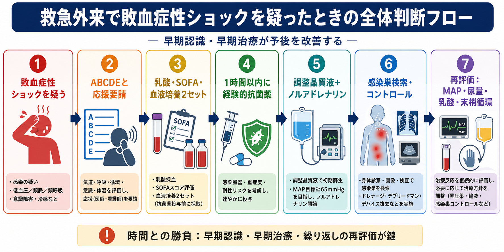
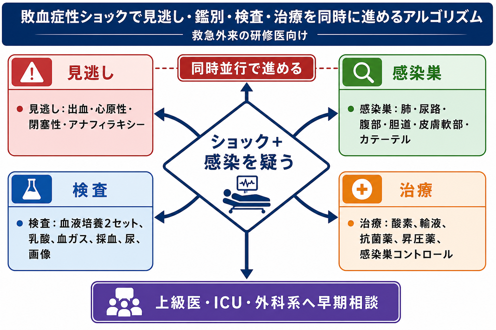
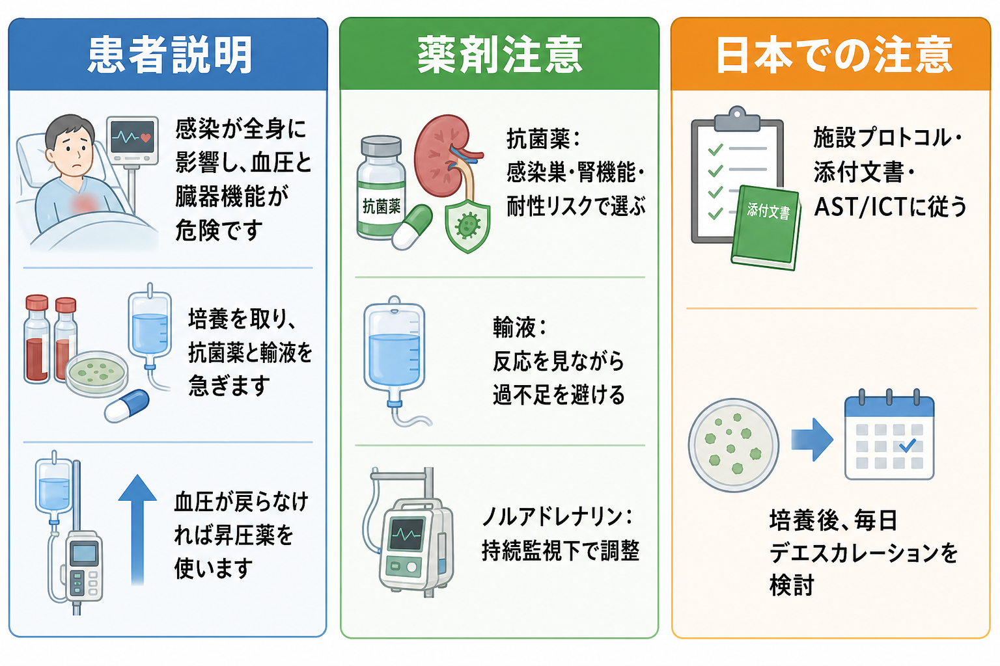

---
title: "救急外来で敗血症性ショックを疑ったら何をするか"
description: "感染巣推定、培養採取、抗菌薬、輸液、昇圧薬、乳酸測定を同時並行で進める初期対応を整理する。"
aliases:
  - "敗血症性ショック初期対応"
tags:
  - 領域/救急・初期対応
  - 種類/クリニカルクエスチョン
  - 対象/研修医
question: "救急外来で敗血症性ショックを疑ったら何をするか"
clinical_area: "救急・初期対応"
audience: "研修医"
evidence_level: "guideline"
created: "2026-04-27"
updated: "2026-04-27"
enableToc: true
---

# 救急外来で敗血症性ショックを疑ったら何をするか

> このノートは研修医教育のための一般的整理であり、個別患者の診断・治療指示ではありません。緊急性が高い、判断に迷う、施設方針が関わる場合は上級医・専門科に相談してください。

## クリニカルクエスチョン

救急外来で、感染症が疑われる患者に低血圧、意識障害、頻呼吸、末梢循環不全、乳酸高値などを認め、敗血症性ショックがあり得ると考えたとき、研修医は何を同時に進めるべきか。

## まず結論

- 敗血症性ショックは「診断を確定してから動く疾患」ではなく、感染と循環不全を疑った時点で、ABCDE、応援要請、モニタリング、静脈路確保を同時に始める。[1,2]
- 最初にやることは、感染巣を当てることだけではない。乳酸測定、SOFA評価、血液培養2セット、感染巣検体、経験的抗菌薬、調整晶質液、早期ノルアドレナリンを並行して進める。[1,2]
- 敗血症性ショックまたはその可能性が高い敗血症では、抗菌薬は認識後できるだけ早く、理想的には1時間以内を目標にする。培養採取は重要だが、採取のために抗菌薬を不必要に遅らせない。[2,4]
- 初期輸液は調整晶質液を基本に、反応を見ながら行う。低血圧が持続する場合は、輸液完了を待ちすぎず、持続監視下でノルアドレナリンを早期に検討する。[1,2,4]
- 乳酸は「重症度と蘇生反応を見る指標」であり、単独で敗血症の診断を確定する検査ではない。末梢循環、尿量、意識、血圧、心エコーなどと合わせて再評価する。[3-5]
- 日本では、J-SSCG2024、J-SSCG2024バンドル、施設の敗血症プロトコル、抗菌薬適正使用支援チーム（AST/ICT）、PMDA添付文書を確認し、薬剤選択・用量・投与経路は施設運用に合わせる。[1,2,6,7]

## 判断の型

1. **まず「ショックか」を見る。** 収縮期血圧低下、頻脈、頻呼吸、意識変容、冷汗、末梢冷感、網状皮斑、尿量低下、乳酸高値があれば、感染以外も含めてショックとして扱う。
2. **感染があり得るかを同時に探す。** 肺、尿路、腹部、胆道、皮膚軟部組織、カテーテル、髄膜炎、壊死性軟部組織感染、術後・処置後感染を短時間で拾う。
3. **「培養を取る、抗菌薬を入れる、循環を支える」を止めない。** 病歴聴取や画像検査に時間を使いすぎて、培養・抗菌薬・輸液・昇圧薬が遅れないようにする。[2,4]
4. **輸液反応性と過剰輸液リスクを繰り返し評価する。** 肺水腫、心不全、腎不全、末梢浮腫がある患者では、少量投与後の血圧、呼吸、心エコー、下大静脈、末梢循環を見て調整する。
5. **感染巣コントロールを早く呼ぶ。** 胆管炎、腎盂腎炎の閉塞、腹腔内感染、膿瘍、壊死性筋膜炎、感染デバイスは、抗菌薬だけでは立て直せないことがある。[1,4]

## 初期対応

- **応援要請:** 救急指導医、ICU、感染症科またはAST/ICT、外科系診療科、看護師リーダー、薬剤師に早めに共有する。ひとりで順番に処理しない。
- **ABCDE:** 気道、呼吸、循環、意識、体温と皮膚所見を確認する。酸素投与、モニター、除細動器準備、2本以上の静脈路または中心静脈路の準備を進める。
- **モニタリング:** 血圧、心拍数、SpO2、呼吸数、体温、意識、尿量、末梢循環、乳酸を時系列で追う。動脈ラインや尿道カテーテルは上級医と適応を確認する。
- **採血・培養:** 抗菌薬前に血液培養2セット、感染巣が疑われる検体を採取する。ただし、採取困難で抗菌薬が遅れる場合は上級医へ即相談し、優先順位を決める。[2,4]
- **抗菌薬:** ショックまたは高い敗血症可能性では、認識後できるだけ早く経験的抗菌薬を開始する。感染巣、重症度、腎機能、アレルギー、耐性菌リスク、最近の抗菌薬歴を同時に確認する。[1,4,6]
- **輸液:** 調整晶質液を基本に初期蘇生を行う。SSC 2021は敗血症性低灌流または敗血症性ショックで最初の3時間に少なくとも30 mL/kgの晶質液を提案しているが、日本の現場では心不全・腎不全・高齢者では反応を見ながら調整する。[2,4]
- **昇圧薬:** 低血圧が持続する、または輸液をこれ以上入れにくい場合は、ノルアドレナリンを第一選択として検討する。施設プロトコルに従い、持続監視下で上級医と開始する。[1,4,7]
- **移動先:** ICU、HCU、救急集中治療室など、頻回再評価と持続投与が安全にできる場所への移動を早く調整する。[2,4]

## 鑑別・見逃し

| 優先度 | 疾患・状態 | 見逃さない理由 | 手がかり |
|---|---|---|---|
| 高 | 出血性ショック | 輸液・昇圧薬だけでは悪化し、輸血・止血が必要 | 外傷、吐下血、腹痛、貧血進行、FAST陽性、抗凝固薬 |
| 高 | 心原性ショック | 大量輸液で肺水腫や低酸素を悪化させる | 胸痛、心電図変化、肺水腫、頸静脈怒張、心エコーで収縮不全 |
| 高 | 閉塞性ショック | 緊張性気胸、肺塞栓、心タンポナーデは処置が優先 | 片側呼吸音低下、右室負荷、頸静脈怒張、突然の低酸素 |
| 高 | アナフィラキシー | アドレナリン筋注が遅れると致命的 | 蕁麻疹、喘鳴、薬剤・食物・造影剤曝露、急速な血圧低下 |
| 高 | 壊死性軟部組織感染 | 外科的デブリードマンが遅れると死亡率が上がる | 強い疼痛、皮膚色調変化、水疱、握雪感、急速進行 |
| 高 | 胆管炎・閉塞性腎盂腎炎 | ドレナージが必要な感染巣コントロール疾患 | 黄疸、右上腹部痛、尿管結石、腎盂拡張、菌血症 |
| 中 | 薬剤性・副腎不全 | 感染と併存し、昇圧薬抵抗性の原因になる | ステロイド内服、免疫抑制、低Na、高K、難治性低血圧 |

## 検査

| 検査 | 目的 | 注意点 |
|---|---|---|
| 血液培養2セット | 菌血症の確認、後日のデエスカレーション | 抗菌薬前が原則。ただし抗菌薬を遅らせすぎない。[2,4] |
| 乳酸、血液ガス | 組織低灌流、重症度、蘇生反応の評価 | 乳酸高値は敗血症以外でも起こる。再測定で変化を見る。[3-5] |
| CBC、生化学、凝固、肝胆道系、腎機能 | 臓器障害、DIC、腎機能による薬剤調整 | SOFA評価と薬剤選択に直結する。[1,3] |
| 尿検査、尿培養 | 尿路感染、閉塞性腎盂腎炎の評価 | 尿路感染と決めつけず、閉塞の有無を画像で確認する。 |
| 胸部X線、CT、超音波 | 肺炎、腹腔内感染、胆道感染、膿瘍、閉塞の検索 | 循環が不安定なら検査室搬送よりベッドサイド評価を優先する。 |
| 心電図、心エコー | 心原性・閉塞性ショック、輸液反応性の評価 | 敗血症性心筋症や併存ACSを見逃さない。 |

## 治療・マネジメント

- **経験的抗菌薬:** 重症敗血症・敗血症性ショックでは、感染巣と耐性菌リスクを想定して広く開始し、培養結果と臨床経過で毎日狭域化・中止を検討する。[1,4,6]
- **感染巣コントロール:** ドレナージ、デブリードマン、閉塞解除、感染デバイス抜去は、抗菌薬と同じくらい初期から計画する。外科・泌尿器科・消化器内科・放射線科への相談を遅らせない。[1,4]
- **輸液:** 低灌流がある初期は調整晶質液を用いる。反応が乏しい、呼吸状態が悪化する、心エコーで容量負荷が危ない場合は、追加輸液より昇圧薬・ICU管理を優先する。[1,4]
- **昇圧薬:** ノルアドレナリンは敗血症性ショックの第一選択として推奨される。PMDA添付文書上も「敗血症によるショック」を含むショック時の補助治療に用いられるが、輸液や原因治療の代替ではない。[4,7]
- **再評価:** MAP、意識、尿量、SpO2、呼吸仕事量、末梢冷感、皮膚斑状変化、乳酸、心エコーを繰り返し確認する。毛細血管再充満時間は、他の灌流指標に追加して使える。[4,5]
- **日本での注意:** 抗菌薬の選択・用量は、国内承認、添付文書、腎機能、施設採用薬、院内アンチバイオグラム、AST/ICTの助言に従う。海外ガイドラインの薬剤名や用量をそのまま持ち込まない。[1,6,7]
- **小児・妊産婦・免疫不全:** このノートは成人救急の一般整理である。小児、妊産婦、好中球減少、移植後、透析、重度肝硬変では、早期に専門科へ相談する。

## 図解

## 指導医に確認するポイント

- 敗血症性ショックとして扱う閾値、ICU/HCUへの移動基準、動脈ライン・中心静脈路の適応。
- 抗菌薬の初回選択、腎機能低下時の用量、MRSA・緑膿菌・ESBL産生菌・嫌気性菌をどこまでカバーするか。
- 培養採取が難しいとき、抗菌薬開始をどこまで待つか。
- 輸液を追加するか、昇圧薬を始めるか、心エコーや下大静脈評価をどう使うか。
- 胆道、尿路、腹腔内、皮膚軟部組織、デバイス感染で、どの診療科にどのタイミングで連絡するか。
- DNAR、治療制限、本人意思、家族連絡、集中治療の適応について誰が説明するか。

## 患者説明

- 「感染が体全体に影響して、血圧や臓器の働きが危険な状態になっている可能性があります。」
- 「原因菌を調べるために血液や尿などの検体を取り、同時に抗菌薬、点滴、血圧を支える薬を急いで始めます。」
- 「原因の場所が胆道、尿路、お腹、皮膚などにある場合は、薬だけでなく処置や手術が必要になることがあります。」
- 「状態は短時間で変わるため、集中治療室などで継続的に見守る必要があります。」

## ピットフォール

- 「発熱がないから敗血症ではない」と判断する。高齢者、免疫不全、重症例では低体温や平熱のことがある。
- 画像検査で感染巣を確定しようとして、培養・抗菌薬・循環蘇生が遅れる。
- 血液培養2セットにこだわりすぎて、ショック患者の抗菌薬開始が大きく遅れる。
- 乳酸が正常だから安心する。乳酸は重要だが、低血圧、尿量低下、意識障害、末梢循環不全を打ち消す検査ではない。
- 輸液だけで粘りすぎる。心不全・腎不全・ARDSリスクがある患者では、早期昇圧薬とICU管理を考える。
- ノルアドレナリンを「輸液の代わり」に使う。添付文書上もショック治療の原則は換気、輸液、心拍出量増加、昇圧であり、原因治療と循環血液量の評価が必要である。[7]
- 抗菌薬開始後に見直さない。培養、画像、臨床経過がそろったら、狭域化、投与期間、中止を毎日検討する。[6]

## 関連ノート

- [[ショック患者を見たら最初に何をするか]]
- [[乳酸値が高い患者をどう解釈するか]]
- [[救急で昇圧薬開始を考えるタイミングはいつか]]
- 関連ノート候補（未作成または所在未確認）: 発熱患者で血液培養はいつ何セット取るべきか、発熱患者で抗菌薬を始める前に何を確認するか、発熱患者で敗血症を疑う基準は何か

## MOC更新候補

- [[MOC｜救急・初期対応]]
- MOC｜感染症・抗菌薬.md（本サイト外）
- MOC｜輸液・電解質・酸塩基.md（本サイト外）

## 参考文献

[1] 日本版敗血症診療ガイドライン2024特別委員会. 日本版敗血症診療ガイドライン2024. 日本集中治療医学会雑誌. 2024;31(Supplement):S1165-S1313. https://doi.org/10.3918/jsicm.2400001

[2] 日本版敗血症診療ガイドライン2024特別委員会. 初期治療とケアバンドル（J-SSCG2024バンドル）. 日本集中治療医学会・日本救急医学会. https://www.jsicm.org/pdf/cq/J-SSCG2024/bundle.pdf

[3] Singer M, Deutschman CS, Seymour CW, et al. The Third International Consensus Definitions for Sepsis and Septic Shock (Sepsis-3). JAMA. 2016;315(8):801-810. https://doi.org/10.1001/jama.2016.0287

[4] Evans L, Rhodes A, Alhazzani W, et al. Surviving sepsis campaign: international guidelines for management of sepsis and septic shock 2021. Intensive Care Medicine. 2021;47:1181-1247. https://doi.org/10.1007/s00134-021-06506-y

[5] Hernández G, Ospina-Tascón GA, Damiani LP, et al. Effect of a Resuscitation Strategy Targeting Peripheral Perfusion Status vs Serum Lactate Levels on 28-Day Mortality Among Patients With Septic Shock: The ANDROMEDA-SHOCK Randomized Clinical Trial. JAMA. 2019;321(7):654-664. https://doi.org/10.1001/jama.2019.0071

[6] 厚生労働省. 薬剤耐性（AMR）対策：抗微生物薬適正使用の手引き. https://www.mhlw.go.jp/stf/seisakunitsuite/bunya/0000120172.html

[7] 医薬品医療機器総合機構（PMDA）. ノルアドリナリン注1mg 医療用医薬品情報・添付文書. https://www.pmda.go.jp/PmdaSearch/rdDetail/iyaku/2451401A1034_2?user=1

## 更新ログ

- 2026-04-27: 初版作成。
