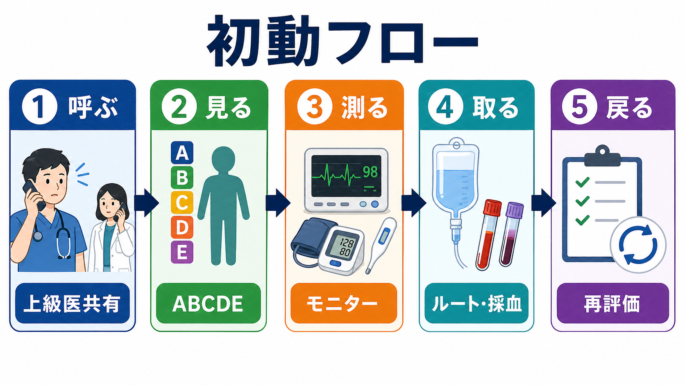
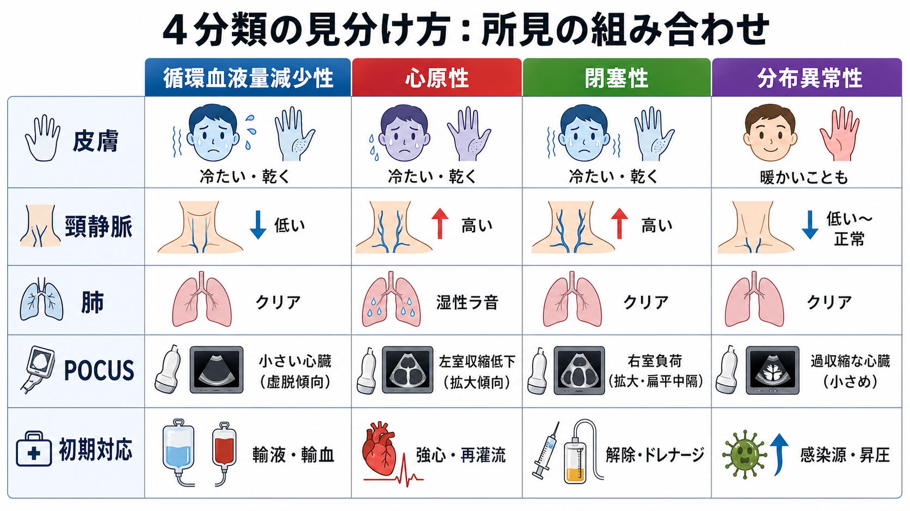

---
title: "救急外来で末梢冷感や網状皮斑をどう評価するか"
description: "循環不全の身体所見をバイタルや乳酸と組み合わせ、ショックの早期認識につなげる。"
aliases:
  - "末梢冷感と網状皮斑"
tags:
  - 領域/救急・初期対応
  - 種類/クリニカルクエスチョン
  - 対象/研修医
question: "救急外来で末梢冷感や網状皮斑をどう評価するか"
clinical_area: "救急・初期対応"
audience: "研修医"
evidence_level: "mixed"
created: "2026-04-27"
updated: "2026-04-27"
enableToc: true
---

# 救急外来で末梢冷感や網状皮斑をどう評価するか

> このノートは研修医教育のための一般的整理であり、個別患者の診断・治療指示ではありません。緊急性が高い、判断に迷う、施設方針が関わる場合は上級医・専門科に相談してください。

## クリニカルクエスチョン

救急外来で末梢冷感や網状皮斑を見たとき、バイタル、毛細血管再充満時間、尿量、意識、乳酸をどう組み合わせて循環不全を早期に認識するか。

## まず結論

- 末梢冷感、膝周囲から広がる網状皮斑、毛細血管再充満時間の延長は、血圧がまだ保たれていても「末梢循環が悪い」サインとして扱う。ショックは単なる低血圧ではなく、急性循環不全による組織酸素利用不全として評価する [1]。
- 最初に、意識、呼吸仕事量、SpO2、心拍数、血圧、脈圧、皮膚所見、尿量、体温を同時に見る。収縮期血圧だけで安心しない。
- 末梢冷感や網状皮斑がある患者では、乳酸、血液ガス、血算、生化学、凝固、感染・出血・心原性・閉塞性ショックの検索を早めに出す。敗血症が疑わしい場合、乳酸測定と早期治療開始が推奨される [2,3]。
- 毛細血管再充満時間は、乳酸や血圧の代替ではなく補助指標として使う。敗血症性ショックでは、末梢灌流をみながら蘇生を調整する考え方が国際ガイドラインでも示されている [2,4]。
- 網状皮斑が膝を越えて広がる、乳酸上昇、乏尿、意識障害、頻呼吸、冷汗を伴う場合は、見た目が落ち着いていても上級医へ早期共有し、モニター管理、太い静脈路、採血、画像、抗菌薬・輸液・昇圧薬の必要性を並行して評価する。

## 判断の型

1. **まずショックとして扱うかを決める**  
   末梢冷感・網状皮斑に、頻呼吸、頻脈、意識変容、尿量低下、乳酸上昇、低血圧、脈圧狭小、冷汗のいずれかがあれば、循環不全の可能性を上げる [1,2]。
2. **皮膚所見を標準化して記録する**  
   末梢冷感は「手足だけか、前腕・下腿までか」、網状皮斑は「膝周囲のみか、大腿・体幹へ広がるか」、毛細血管再充満時間は「どこで何秒か」を記録する。網状皮斑スコアは敗血症性ショックの死亡リスクと関連した観察研究がある [5]。
3. **バイタルと乳酸で重症度を補正する**  
   皮膚所見が悪くても乳酸が正常なことはあり、乳酸が高くても末梢が温かいことはある。どちらか一方で否定せず、トレンドで見る [2,4]。
4. **ショックの型を同時並行で絞る**  
   分布異常性、循環血液量減少性、心原性、閉塞性を想定し、感染、出血、脱水、心筋梗塞、不整脈、肺塞栓、緊張性気胸、アナフィラキシーを先に拾う [1]。
5. **治療反応で再評価する**  
   輸液、酸素、抗菌薬、止血、血管作動薬などの介入後に、血圧だけでなく末梢温、網状皮斑の範囲、毛細血管再充満時間、尿量、乳酸を見直す [2,4]。

## 初期対応

- **ABCDEで危険を先に処理する。** 気道、呼吸、循環、意識、全身露出を順に確認し、心停止・呼吸不全・重篤な低血圧があれば救急蘇生の流れに乗せる。JRC蘇生ガイドラインは日本の救急蘇生実践の基本資料である [6]。
- **モニターを付ける。** 心電図、SpO2、非侵襲血圧、体温を開始し、ショックが疑わしければ血圧測定間隔を短くする。重症例では動脈ラインやICU管理の要否を上級医と相談する [1,2]。
- **静脈路と採血を早める。** 末梢太径ルートを2本目標にし、血液ガス、乳酸、血算、生化学、肝腎機能、凝固、血糖、血液培養、交差適合、心筋逸脱酵素などを病態に応じて出す。
- **感染が疑わしい場合は敗血症として動く。** 敗血症・敗血症性ショックは医療緊急事態として扱い、乳酸測定、培養、抗菌薬、輸液、昇圧薬の必要性を同時に検討する [2,3]。
- **出血・閉塞性ショックを見逃さない。** 外傷、消化管出血、腹腔内出血、産婦人科出血、大動脈疾患、肺塞栓、緊張性気胸、心タンポナーデは、皮膚所見が悪くなってからでは遅い。

## 鑑別・見逃し

| 優先度 | 疾患・状態 | 見逃さない理由 | 手がかり |
|---|---|---|---|
| 高 | 敗血症性ショック | 初期は血圧が保たれていても末梢循環不全、乳酸上昇、意識変容が先行しうる | 発熱または低体温、頻呼吸、感染巣、乳酸上昇、網状皮斑、乏尿 [2,3] |
| 高 | 出血性ショック | 若年者や代償期では血圧低下が遅れる | 頻脈、脈圧狭小、冷汗、腹痛、下血、外傷、抗凝固薬 |
| 高 | 心原性ショック | 輸液で悪化することがある | 胸痛、肺うっ血、頸静脈怒張、冷汗、不整脈、心エコー異常 |
| 高 | 閉塞性ショック | 迅速な手技・専門対応が必要 | 呼吸困難、片側呼吸音低下、頸静脈怒張、急性右心負荷、心嚢液 |
| 高 | アナフィラキシー | 皮膚が温かいことも冷たいこともあり、気道浮腫を伴う | 蕁麻疹、喘鳴、血圧低下、曝露歴、消化器症状 |
| 中 | 低体温・環境曝露 | 末梢冷感そのものが強く、徐脈や意識障害を伴う | 低体温、屋外曝露、アルコール、低血糖 |
| 中 | 末梢動脈閉塞・急性四肢虚血 | 全身ショックではなく局所虚血のことがある | 片側優位の疼痛、蒼白、冷感、脈拍触知不良、感覚運動障害 |
| 中 | 薬剤・中毒 | 血管収縮、血管拡張、乳酸上昇を来す | β遮断薬、Ca拮抗薬、交感神経刺激薬、CO中毒、シアン化物など |

## 検査

| 検査 | 目的 | 注意点 |
|---|---|---|
| 血液ガス・乳酸 | 組織低灌流、呼吸不全、代謝性アシドーシスの把握 | 乳酸は低灌流以外でも上がるため、臨床文脈とトレンドで解釈する [2] |
| 血算・生化学・凝固 | 感染、出血、腎障害、肝障害、DIC、電解質異常を探す | 初回正常でも再検が必要なことがある |
| 血液培養・感染巣検査 | 敗血症が疑わしいときの原因検索 | 抗菌薬投与を不必要に遅らせない [2,3] |
| 心電図・トロポニン・BNP | 心筋梗塞、不整脈、心不全の評価 | 心原性ショックでは輸液量を慎重にする |
| ベッドサイド超音波 | 心機能、IVC、肺水腫、心嚢液、腹腔内液、深部静脈血栓を評価 | 所見は病態と合わせて解釈し、必要なら専門医に相談する |
| 画像検査 | 感染巣、出血、肺塞栓、大動脈疾患などの確認 | 不安定な患者をCTへ送る前に安全性と搬送体制を確認する |
| 尿量測定 | 腎灌流と蘇生反応のモニター | カテーテル適応は侵襲・感染リスクと比較する |

## 治療・マネジメント

- **所見を「低血圧待ち」にしない。** 末梢冷感、網状皮斑、毛細血管再充満時間延長、乳酸上昇、尿量低下が重なれば、血圧が保たれていても循環不全として上級医に共有する。
- **輸液は反応性を見ながら行う。** 敗血症性低灌流・ショックでは初期輸液が推奨される一方、過剰輸液は害になりうる。受動的下肢挙上、心エコー、肺エコー、脈圧変動、尿量、末梢灌流を使って反応を評価する [2]。
- **昇圧薬は遅らせすぎない。** 敗血症性ショックで輸液だけでは平均血圧や灌流が保てない場合、国際ガイドラインではノルアドレナリンが第一選択とされる [2]。
- **日本での注意。** ノルアドレナリン製剤は日本ではPMDA添付文書に基づき、適応、希釈、投与経路、血管外漏出、末梢循環障害、不整脈などに注意して施設手順で投与する [7]。末梢ラインから開始する運用は施設差が大きいため、救急外来のプロトコルと上級医指示を確認する。
- **原因治療を同時に進める。** 感染なら抗菌薬と感染巣コントロール、出血なら止血・輸血、心原性なら循環器相談、閉塞性なら減圧・血栓治療・心嚢穿刺など、原因ごとの決定的治療を遅らせない。
- **再評価の間隔を短くする。** 15から30分ごとに、意識、呼吸数、心拍数、血圧、末梢温、網状皮斑範囲、毛細血管再充満時間、尿量、乳酸トレンドを見直す。

## 図解

## 指導医に確認するポイント

- 末梢冷感・網状皮斑があるが血圧は保たれている患者を、どの時点でショック疑いとしてモニター管理・初療室対応に上げるか。
- 乳酸値、血圧、尿量、意識、皮膚所見のどれを優先して再評価するか。
- 敗血症が疑わしいときの抗菌薬投与タイミング、培養、輸液量、昇圧薬開始基準。
- 心原性・閉塞性ショックがありうるとき、輸液をどこまで許容するか。
- 末梢からノルアドレナリンを開始する施設ルール、濃度、投与部位、観察方法、血管外漏出時対応。
- CT搬送、ICU入室、専門科コールの判断基準。

## 患者説明

- 「手足が冷たい、皮膚がまだらに見える、尿が少ないといった所見は、血液の巡りが悪くなっているサインのことがあります。」
- 「血圧だけでは重症度が分からないため、採血で乳酸などを確認し、心電図や画像検査で原因を探します。」
- 「感染、出血、心臓、肺の血管の詰まりなど、急いで治療が必要な病気が隠れていないかを同時に調べます。」
- 「点滴、酸素、抗菌薬、血圧を支える薬などが必要になることがあり、状態によっては集中治療室や専門科での治療を相談します。」

## ピットフォール

- 収縮期血圧が正常だからショックではない、と判断する。
- 末梢冷感を「寒いだけ」と扱い、頻呼吸、頻脈、意識、尿量、乳酸を見ない。
- 網状皮斑の範囲を記録せず、悪化・改善のトレンドを追えない。
- 乳酸が正常だから循環不全を否定する。早期、局所虚血、測定タイミング、肝機能、薬剤などで解釈は変わる。
- 乳酸高値だけを目標に大量輸液を続け、肺水腫や心不全を悪化させる。
- 心原性・閉塞性ショックを考えずに敗血症だけとして扱う。
- 末梢ラインの昇圧薬を漫然と継続し、血管外漏出や末梢虚血を見逃す。

## 関連ノート

- 救急外来でショックをどう初期評価するか
- 敗血症を疑ったとき乳酸をどう使うか
- 救急外来で心原性ショックをどう見抜くか
- 急性四肢虚血をどう初期対応するか

## MOC更新候補

- [[MOC｜救急・初期対応]]
- [[MOC｜ショック・循環不全]]

## 参考文献

[1] Cecconi M, De Backer D, Antonelli M, et al. Consensus on circulatory shock and hemodynamic monitoring. Task force of the European Society of Intensive Care Medicine. Intensive Care Med. 2014;40(12):1795-1815. https://doi.org/10.1007/s00134-014-3525-z

[2] Evans L, Rhodes A, Alhazzani W, et al. Surviving sepsis campaign: international guidelines for management of sepsis and septic shock 2021. Intensive Care Med. 2021;47(11):1181-1247. https://doi.org/10.1007/s00134-021-06506-y

[3] 日本版敗血症診療ガイドライン2020特別委員会. 日本版敗血症診療ガイドライン2020. 日本集中治療医学会雑誌. 2021;28(Supplement):S1-S411. https://doi.org/10.3918/jsicm.27S0001

[4] Hernández G, Ospina-Tascón GA, Damiani LP, et al. Effect of a resuscitation strategy targeting peripheral perfusion status vs serum lactate levels on 28-day mortality among patients with septic shock: The ANDROMEDA-SHOCK randomized clinical trial. JAMA. 2019;321(7):654-664. https://doi.org/10.1001/jama.2019.0071

[5] Ait-Oufella H, Lemoinne S, Boelle PY, et al. Mottling score predicts survival in septic shock. Intensive Care Med. 2011;37(5):801-807. https://doi.org/10.1007/s00134-011-2163-y

[6] 日本蘇生協議会. JRC蘇生ガイドライン2020. https://www.jrc-cpr.org/jrc-guideline-2020/

[7] 医薬品医療機器総合機構. ノルアドリナリン注1mg 医療用医薬品情報・添付文書. https://www.pmda.go.jp/PmdaSearch/rdDetail/iyaku/2451401A1034_2?user=1

## 更新ログ

- 2026-04-27: 初版作成。
