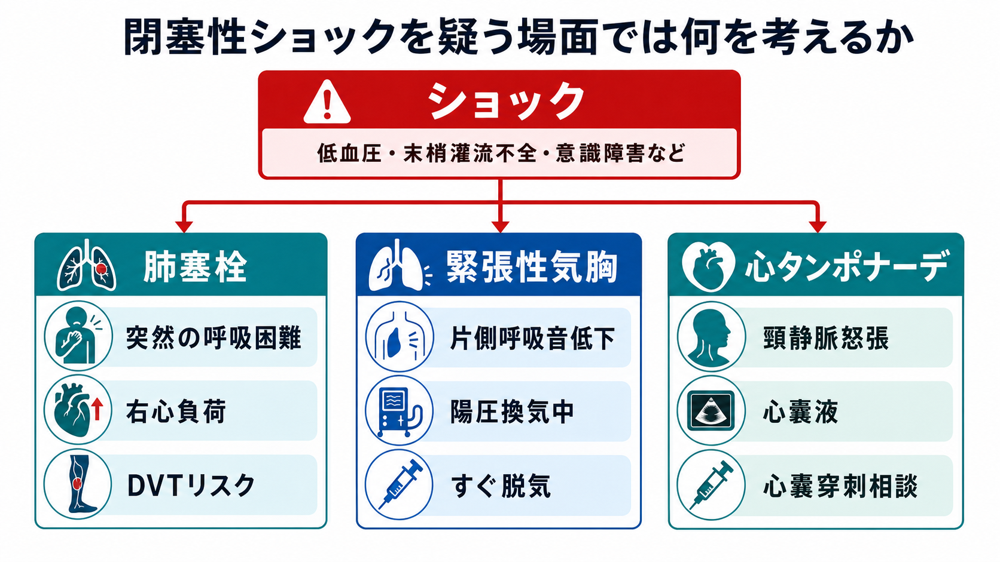
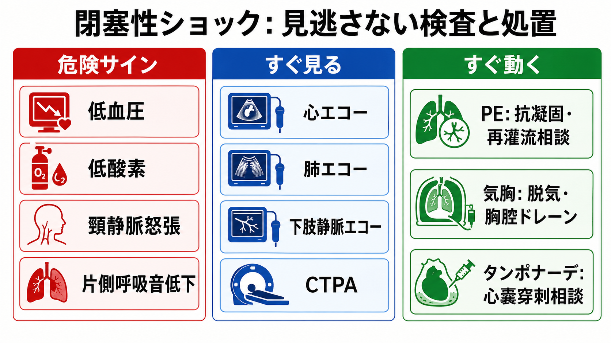
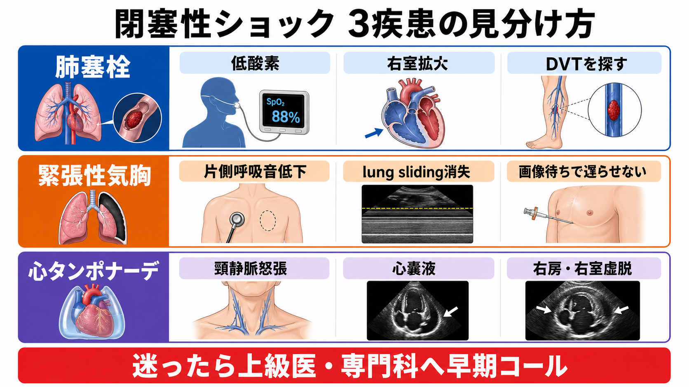

---
title: "閉塞性ショックを疑う場面では何を考えるか"
description: "肺塞栓、緊張性気胸、心タンポナーデを見逃さず、迅速な画像・エコー・処置につなげる。"
aliases:
  - "閉塞性ショック"
tags:
  - 領域/救急・初期対応
  - 種類/クリニカルクエスチョン
  - 対象/研修医
question: "閉塞性ショックを疑う場面では何を考えるか"
clinical_area: "救急・初期対応"
audience: "研修医"
evidence_level: "mixed"
created: "2026-04-27"
updated: "2026-04-27"
enableToc: true
---

# 閉塞性ショックを疑う場面では何を考えるか

> このノートは研修医教育のための一般的整理であり、個別患者の診断・治療指示ではありません。緊急性が高い、判断に迷う、施設方針が関わる場合は上級医・専門科に相談してください。

## クリニカルクエスチョン

閉塞性ショックを疑う場面では、肺塞栓、緊張性気胸、心タンポナーデをどう見逃さず、迅速な画像・エコー・処置につなげるか。

## まず結論

- 閉塞性ショックは「心臓は動こうとしているが、流入・流出が機械的に妨げられるショック」と考える。初期対応では低血圧の原因検索を待ちすぎず、肺塞栓、緊張性気胸、心タンポナーデを同時に探す。
- 低血圧、低酸素、意識障害、冷汗、乳酸上昇に、頸静脈怒張、片側呼吸音低下、右室拡大、心嚢液、DVTリスクが重なるときは閉塞性ショックを前提に動く。
- 緊張性気胸は、重度低血圧や心停止に近い状況では画像を待たずに臨床所見またはPOCUSで判断し、胸腔減圧を優先する場面がある[5]。
- 肺塞栓はCTPAが診断の中心だが、循環不安定でCTに行けない場合は心エコーの右心負荷、下肢静脈エコー、低酸素などを組み合わせて専門科へ早期相談する[1][4]。
- 心タンポナーデは心エコーで心嚢液、右房・右室虚脱、下大静脈拡張を探し、血行動態が崩れていれば心嚢ドレナージの適応を循環器・救急・集中治療と直ちに相談する[6]。
- 原因治療までの酸素、モニター、静脈路、昇圧薬は「時間を稼ぐ処置」であり、閉塞を解除する処置や再灌流治療を遅らせない。

## 判断の型

1. まずショックとして扱う  
   気道、呼吸、循環、意識、体温を評価し、酸素、心電図モニター、血圧反復測定、SpO2、静脈路、採血、乳酸、12誘導心電図を同時に進める。輸液反応性が乏しい、頸静脈怒張がある、肺うっ血が目立たない低血圧では閉塞性ショックを上位に置く。
2. 3疾患を1分で振り分ける  
   「突然の呼吸困難・低酸素・DVTリスク」は肺塞栓、「片側呼吸音低下・陽圧換気中・胸部処置後」は緊張性気胸、「頸静脈怒張・心嚢液・外傷/悪性腫瘍/心膜炎背景」は心タンポナーデを考える。
3. POCUSで閉塞性を補強する  
   RUSHの考え方で、心臓、肺、下大静脈、下肢静脈を短時間に見る。RUSHは未分化ショックの病型推定に有用だが、術者依存であり、陰性だけで肺塞栓やタンポナーデを除外しない[7][8]。
4. 不安定なら原因治療の相談を先にかける  
   CTPA、胸部X線、造影CT、心エコー、心嚢穿刺、胸腔ドレーン、再灌流治療は施設リソースに依存する。画像室へ運ぶ前に、搬送中に破綻しないかを上級医と確認する。

## 初期対応

- **ABCDEを崩さない。** 高流量酸素、必要時のバッグ換気・挿管準備、心電図モニター、除細動器装着、2本の静脈路または骨髄路、動脈ライン検討、血液ガス・乳酸・凝固・トロポニン/BNP・腎機能を同時に進める。
- **過剰輸液を避ける。** 閉塞性ショックでは少量輸液で前負荷を補うことはあるが、右室不全やタンポナーデでは過剰輸液で悪化することがある。反応を見ながら上級医と調整する。
- **昇圧薬は橋渡し。** ノルアドレナリンなどで灌流圧を支えつつ、気胸なら減圧、タンポナーデならドレナージ、肺塞栓なら抗凝固・再灌流治療の適応評価へつなぐ。
- **画像室へ行く前に安全確認。** 持続低血圧、増悪する低酸素、意識低下、心停止切迫では、CTよりベッドサイドエコーや緊急処置が優先されることがある[5]。
- **早期コールの目安。** 「肺塞栓かもしれない低血圧」「緊張性気胸を疑う」「心嚢液があり血圧が低い」は、救急・集中治療・循環器・呼吸器/胸部外科を同時に呼ぶ。

## 鑑別・見逃し

| 優先度 | 疾患・状態 | 見逃さない理由 | 手がかり |
|---|---|---|---|
| 高 | 肺塞栓 | 低酸素、右室不全、心停止につながる。高リスクPEでは入院・集中治療、再灌流治療の検討が必要[4]。 | 突然の呼吸困難、胸痛、失神、頻脈、低酸素、右室拡大、DVTリスク、下肢腫脹 |
| 高 | 緊張性気胸 | 画像待ちで循環虚脱が進む。重度低血圧では胸腔減圧が他の処置より優先される場面がある[5]。 | 片側呼吸音低下、胸郭左右差、頸静脈怒張、皮下気腫、陽圧換気中、肺エコーでlung sliding消失 |
| 高 | 心タンポナーデ | 心拍出が急速に落ち、心嚢ドレナージが根本治療になる。 | 頸静脈怒張、頻脈、低血圧、心音減弱、心嚢液、右房/右室虚脱、外傷・悪性腫瘍・心膜炎 |
| 中 | 緊張性血胸・大量胸水 | 胸腔内圧上昇と出血で閉塞性/低容量性ショックが混在する。 | 外傷、胸部手技後、片側呼吸音低下、貧血、FAST/胸部エコー |
| 中 | 重症喘息・COPD増悪のauto-PEEP | 胸腔内圧上昇で静脈還流が低下し、閉塞性ショック様になる。 | 高い気道内圧、呼気延長、人工呼吸器アラーム、換気困難 |
| 中 | 急性心筋梗塞・重症不整脈 | 心原性ショックと肺塞栓が似る。両者は治療が異なる。 | 12誘導心電図、壁運動異常、胸痛、トロポニン、肺うっ血 |

## 検査

| 検査 | 目的 | 注意点 |
|---|---|---|
| 心エコー/POCUS | 右室拡大、心嚢液、右房・右室虚脱、左室機能、下大静脈を評価する。 | 低画質や術者差がある。肺塞栓は心エコーだけで除外しない[7]。 |
| 肺エコー | lung sliding消失、胸水・血胸、肺うっ血を確認する。 | sliding消失は気胸以外でも起こる。重症例では臨床像と合わせる。 |
| 下肢静脈エコー | DVTを探し、肺塞栓の蓋然性を補強する。 | DVT陰性でも肺塞栓は否定できない。 |
| CTPA | 急性肺塞栓の診断・部位評価の中心。 | 循環不安定、造影禁忌、腎機能、搬送リスクを確認する[4]。 |
| 胸部X線 | 気胸、胸水、縦隔偏位、チューブ位置を確認する。 | 緊張性気胸で破綻している場合は、撮影待ちで処置を遅らせない[5]。 |
| 12誘導心電図 | ACS、不整脈、右心負荷所見を確認する。 | 肺塞栓の心電図所見は非特異的。正常でも除外しない。 |
| 血液ガス・乳酸 | 低酸素、換気、代謝性アシドーシス、灌流不全の把握。 | 原因診断ではなく重症度と経時変化を見る。 |
| Dダイマー | 低〜中等度リスクの肺塞栓除外に使う。 | ショック例や高リスク例ではDダイマー待ちで画像・専門科相談を遅らせない[1][4]。 |

## 治療・マネジメント

- **肺塞栓を疑う場合**  
  循環不安定なら、酸素化と循環維持を行いながら、CTPAまたはベッドサイドエコーで右心負荷を評価し、救急・循環器・集中治療へ早期相談する。急性肺塞栓では抗凝固が基本で、高リスク例では全身血栓溶解、カテーテル治療、外科的血栓摘除、ECMOなどを施設体制に応じて検討する[1][4]。
- **緊張性気胸を疑う場合**  
  心停止または重度低血圧では、診断は身体所見またはPOCUSを軸にし、胸腔減圧を遅らせない。針脱気は迅速な橋渡しであり、可能なら胸腔ドレーンや開放胸腔処置へつなげる[5]。
- **心タンポナーデを疑う場合**  
  心エコーで心嚢液とタンポナーデ所見を確認し、血行動態が崩れていれば緊急ドレナージを相談する。エコーガイド下心嚢穿刺は有効な治療だが、手技リスクがあるため、実施者、穿刺経路、外科バックアップを確認する[6]。
- **日本での注意：肺塞栓の血栓溶解薬**  
  日本では、モンテプラーゼ（クリアクター）が「不安定な血行動態を伴う急性肺塞栓症における肺動脈血栓の溶解」の効能・効果を持つ。添付文書上、急性肺塞栓症ではヘパリン投与などの抗凝固療法を基礎治療として行うこと、出血リスクと有益性を踏まえて投与量を決めることが示されている[2]。海外ガイドラインのalteplase前提の記載を、日本の薬剤・用量・院内採用へそのまま置き換えない。
- **日本での注意：蘇生・特殊状況**  
  日本の蘇生実践ではJRC蘇生ガイドライン2020を確認する。JRC 2020は成人ALSの特殊な状況として肺血栓塞栓症による心停止を扱っており、院内運用はJRC、院内急変対応、各診療科プロトコルに合わせる[3]。

## 図解

## 指導医に確認するポイント

- この患者はCT室へ安全に移動できるか、それともベッドサイドエコー・処置を優先すべきか。
- 肺塞栓を疑う場合、抗凝固開始のタイミング、禁忌、出血リスク、血栓溶解・カテーテル治療・外科治療の相談先はどこか。
- 緊張性気胸を疑う場合、針脱気、胸腔ドレーン、外科的気道・胸部外科バックアップの院内手順はどうなっているか。
- 心タンポナーデを疑う場合、誰が心嚢穿刺を行うか、エコーガイド、外科バックアップ、抗凝固・抗血小板薬内服の扱いをどうするか。
- DNARや治療制限の有無、本人・家族への説明、侵襲的処置の同意を誰がどのタイミングで担うか。

## 患者説明

- 「血圧が下がっており、心臓や肺の周りで血液の流れが妨げられている可能性があります。」
- 「肺の血管の血栓、肺から空気が漏れて圧がかかる状態、心臓の周りに液体がたまる状態を急いで確認しています。」
- 「命に関わることがあるため、酸素、点滴、エコーやCT、必要な処置を並行して進めます。」
- 「治療には出血や処置の合併症もあるため、専門科と相談しながら最も必要な対応を選びます。」

## ピットフォール

- 「ショックだからまず大量輸液」と固定しない。右室不全やタンポナーデでは悪化することがある。
- 緊張性気胸で胸部X線を待ちすぎない。重度低血圧や心停止切迫では処置が診断より先になる場面がある[5]。
- 心エコーで右室拡大を見たら肺塞栓だけに飛びつかない。右室梗塞、慢性肺高血圧、ARDS、COPD、陽圧換気の影響も考える。
- Dダイマー陰性ルールをショック例に機械的に使わない。高リスク・不安定例では画像、エコー、専門科相談を優先する[1][4]。
- 心嚢液が「少量」でも急速貯留ならタンポナーデになり得る。量だけでなく右房・右室虚脱と血行動態を見る[6]。
- 「PEなら血栓溶解」と単純化しない。日本の薬剤、用量、禁忌、院内採用、出血リスク、カテーテル治療の可用性を確認する[2]。

## 関連ノート

- [[MOC｜救急・初期対応]]
- 関連ノート候補（未作成）: ショックを疑ったとき最初に何をするか
- 関連ノート候補（未作成）: 急性肺塞栓を疑うとき何をするか
- 関連ノート候補（未作成）: 緊張性気胸を疑うとき胸腔減圧をどう考えるか
- 関連ノート候補（未作成）: 心タンポナーデを疑うとき心エコーで何を見るか

## MOC更新候補

- [[MOC｜救急・初期対応]] の「未整理・発展候補」または「ショック・循環不全」に本ノートを追加する。
- 将来 MOC｜呼吸器.md（本サイト外） と MOC｜心電図・循環器.md（本サイト外） に、肺塞栓・気胸・心タンポナーデ関連ノートが増えた段階で相互リンクを検討する。

## 参考文献

[1] 日本循環器学会/日本肺高血圧・肺循環学会. (2025). 2025年改訂版 肺血栓塞栓症・深部静脈血栓症および肺高血圧症に関するガイドライン. https://www.j-circ.or.jp/cms/wp-content/uploads/2025/03/JCS2025_Tamura.pdf

[2] 独立行政法人 医薬品医療機器総合機構. (2018). クリアクター静注用40万/80万/160万 再審査報告書. https://www.pmda.go.jp/drugs_reexam/2018/P20180416002/170033000_22000AMX01385_A100_1.pdf

[3] 日本蘇生協議会. (2020). JRC蘇生ガイドライン2020. https://www.jrc-cpr.org/jrc-guideline-2020/

[4] Creager MA, Barnes GD, Giri J, et al. (2026). 2026 AHA/ACC/ACCP/ACEP/CHEST/SCAI/SHM/SIR/SVM/SVN Guideline for the Evaluation and Management of Acute Pulmonary Embolism in Adults. Journal of the American College of Cardiology. https://doi.org/10.1016/j.jacc.2025.11.005

[5] Lott C, Truhlář A, Alfonzo A, et al. (2021). European Resuscitation Council Guidelines 2021: Cardiac arrest in special circumstances. Resuscitation, 161, 152-219. https://doi.org/10.1016/j.resuscitation.2021.02.011

[6] Schulz-Menger J, Collini V, Gröschel J, et al. (2025). 2025 ESC Guidelines for the management of myocarditis and pericarditis. European Heart Journal, 46(40), 3952-4041. https://doi.org/10.1093/eurheartj/ehaf192

[7] Keikha M, Salehi-Marzijarani M, Soldoozi Nejat R, Vahedi HSM, Mirrezaie SM. (2018). Diagnostic Accuracy of Rapid Ultrasound in Shock (RUSH) Exam; A Systematic Review and Meta-analysis. Bulletin of Emergency and Trauma, 6(4), 271-278. https://doi.org/10.29252/beat-060402

[8] Perera P, Mailhot T, Riley D, Mandavia D. (2010). The RUSH exam: Rapid Ultrasound in SHock in the evaluation of the critically ill. Emergency Medicine Clinics of North America, 28(1), 29-56. https://doi.org/10.1016/j.emc.2009.09.010

## 更新ログ

- 2026-04-27: 初版作成。
