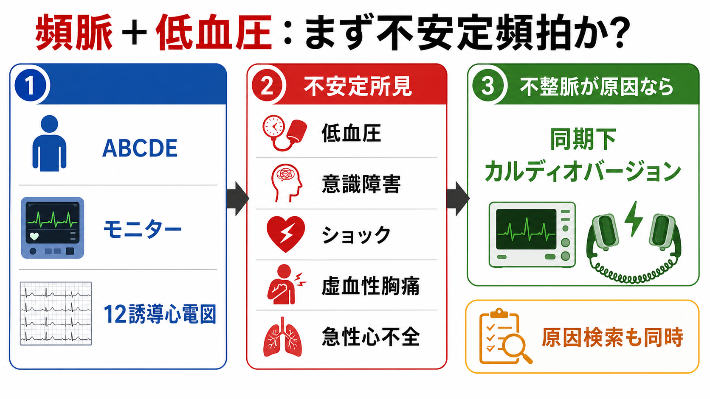
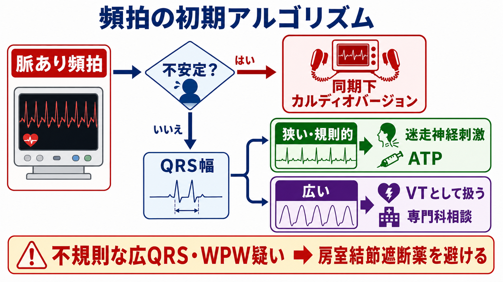
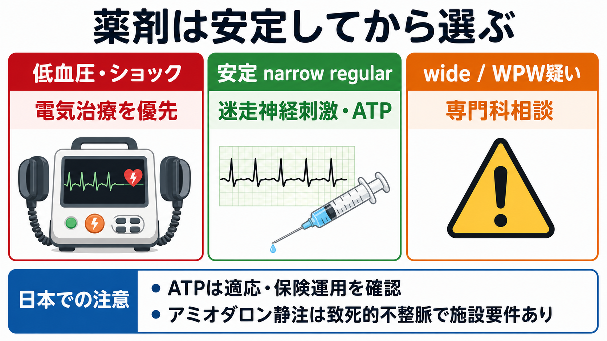

---
title: "頻脈と低血圧がある患者で不整脈治療を急ぐべきか"
description: "頻脈と低血圧を見たときに、不安定頻拍として同期下カルディオバージョンを急ぐ場面と、原因検索・薬剤選択を優先する場面を整理する。"
aliases:
  - "不安定頻拍"
tags:
  - 領域/救急・初期対応
  - 種類/クリニカルクエスチョン
  - 対象/研修医
question: "頻脈と低血圧がある患者で不整脈治療を急ぐべきか"
clinical_area: "救急・初期対応"
audience: "研修医"
evidence_level: "guideline"
created: "2026-04-27"
updated: "2026-04-27"
enableToc: true
---

# 頻脈と低血圧がある患者で不整脈治療を急ぐべきか

> このノートは研修医教育のための一般的整理であり、個別患者の診断・治療指示ではありません。緊急性が高い、判断に迷う、施設方針が関わる場合は上級医・専門科に相談してください。

## クリニカルクエスチョン

頻脈と低血圧がある患者で、不整脈治療を急ぐべきか。特に、不安定頻拍の判断、同期下カルディオバージョン、薬剤選択をどう考えるか。

## まず結論

- 頻脈と低血圧を見たら、最初に「頻拍が低血圧・ショックの主因か」を判断する。敗血症、出血、肺塞栓、アナフィラキシー、緊張性気胸などが主因なら、不整脈だけを止めても循環は改善しないことがある [1]。
- 頻拍が主因で、低血圧、意識障害、ショック徴候、虚血性胸痛、急性心不全を伴う場合は、不安定頻拍として同期下カルディオバージョンを準備する [1,2]。
- 脈あり単形性wide QRS頻拍で不安定なら、VTとして扱い、薬剤で粘らず電気的治療を優先する [1,6]。
- 安定している規則的narrow QRS頻拍では、迷走神経刺激、ATP/アデノシン系薬剤、必要時の房室結節遮断薬を検討する。ただし低血圧・心不全・WPW疑いでは薬剤で悪化しうる [1,3,7,8]。
- AF/AFLの頻拍で血行動態不安定なら、発症時刻や抗凝固の問題を確認しつつも、緊急時は同期下カルディオバージョンが優先される [1,4]。
- 日本では、ATP注射薬の発作性上室頻拍への使用は審査上認められる扱いだが、添付文書上の承認効能とは異なるため、施設手順・記録・監視体制を確認する [7]。

## 判断の型

1. まずABCDE、酸素化、意識、末梢冷感、尿量、乳酸、胸痛、肺うっ血を見て、低灌流の程度を決める。
2. モニター心電図を貼り、除細動器をベッドサイドへ置き、可能なら12誘導心電図を取る。電気的治療が必要なときに待たない。
3. 頻拍が原因らしいかを考える。目安は「突然発症」「心拍数が非常に速い」「リズムが止まれば循環が戻りそう」「他のショック原因が乏しい」。
4. 不安定所見があり、頻拍が主因なら同期下カルディオバージョンを上級医と同時進行で準備する [1,2]。
5. 安定していれば、QRS幅、規則性、P波、QT延長、WPW所見、薬剤歴、電解質異常を見て薬剤を選ぶ。
6. 不規則wide QRS頻拍、WPWを伴うAF疑い、多形性VT、同期がかからない波形では、房室結節遮断薬を避け、循環器・救急上級医へ即相談する [1,6]。

## 初期対応

- 応援要請: 上級医、救急、循環器、看護師、必要時は麻酔科・集中治療を早めに呼ぶ。
- ABCDE: 気道、呼吸、酸素、循環、意識、体温を同時に評価する。低酸素、アシドーシス、電解質異常は頻拍を悪化させる。
- モニター: 心電図、血圧反復測定または動脈圧、SpO2、可能なら除細動パッドを装着する。
- ルート: 太い末梢静脈路を確保し、採血、血液ガス、電解質、血糖を同時に進める。
- 12誘導心電図: 治療を遅らせない範囲で取得する。不安定ならモニター波形だけでも同期下カルディオバージョン準備を進める。
- 鎮静・鎮痛: 意識があり時間的余裕がある場合は鎮静を検討するが、ショックが深いときは鎮静でさらに低血圧になりうるため、上級医と薬剤・気道管理を相談する [1,4]。
- 同期確認: 単形性頻拍では同期マーカーがQRSに乗っているか確認する。多形性VTやVF、同期不能では非同期ショックの適応を含めて上級医と判断する [1]。

## 鑑別・見逃し

| 優先度 | 疾患・状態 | 見逃さない理由 | 手がかり |
|---|---|---|---|
| 高 | VT、SVT、AF/AFL with RVRによる不安定頻拍 | 頻拍が低血圧の主因なら電気的治療で循環が改善しうる | 突然発症、動悸先行、心拍150/分以上、単形性wide QRS、低灌流所見 [1,6] |
| 高 | 急性冠症候群 | 虚血が頻拍の原因にも結果にもなる | 胸痛、ST変化、冷汗、心不全、トロポニン上昇 |
| 高 | 出血・脱水・敗血症 | 代償性洞性頻脈を止めると循環が悪化しうる | 発熱、感染巣、出血、腹痛、皮膚冷感、乳酸上昇 |
| 高 | 肺塞栓、緊張性気胸、心タンポナーデ | 頻拍だけではなく閉塞性ショックの解除が必要 | 低酸素、胸痛、頸静脈怒張、片側呼吸音低下、エコー所見 |
| 高 | アナフィラキシー | アドレナリン筋注など原因治療が優先 | 皮疹、喘鳴、粘膜症状、曝露歴 |
| 中 | 薬剤・中毒、電解質異常、甲状腺中毒症 | 治療薬選択を誤ると悪化する | QT延長、低K/Mg、高K、ジギタリス、交感神経刺激薬、抗不整脈薬 |

## 検査

| 検査 | 目的 | 注意点 |
|---|---|---|
| モニター心電図・12誘導心電図 | QRS幅、規則性、虚血、WPW、QT延長を確認 | 不安定なら検査で電気的治療を遅らせない [1] |
| 血液ガス・乳酸 | 低灌流、アシドーシス、低酸素、K異常を把握 | 乳酸高値はショック原因検索の入口 |
| 電解質、血糖、腎機能、Mg、Ca | 可逆因子の補正、薬剤投与の安全確認 | 低K・低Mg・高Kは不整脈の原因にもなる |
| 心筋逸脱酵素、胸部X線、心エコー | ACS、心不全、肺塞栓、タンポナーデ、気胸の評価 | ベッドサイドエコーは治療方針に直結しうる |
| 薬剤歴・基礎疾患確認 | β遮断薬、Ca拮抗薬、抗不整脈薬、QT延長薬、WPW、心不全の確認 | 房室結節遮断薬や鎮静薬のリスク評価に必要 |

## 治療・マネジメント

### 不安定頻拍なら電気的治療を優先

- 不安定頻拍の中心は「低血圧があるか」だけでなく、頻拍により低灌流が起きているかである。AHA 2025は、不安定性の近接原因を評価することが治療選択に重要と明記している [1]。
- wide QRS頻拍で低血圧、意識障害、ショック、胸痛、急性心不全があれば、同期下カルディオバージョンを推奨する [1,6]。
- narrow QRS頻拍でも血行動態不安定なら、薬剤を待たず同期下カルディオバージョンを行う方向で準備する [1]。
- AF/AFL with RVRで不安定なら、同期下電気的カルディオバージョンが急性期リズムコントロールの治療選択となる [1,4]。

### 安定しているときの薬剤選択

- 規則的narrow QRS頻拍では、迷走神経刺激、ATP/アデノシン系薬剤を考える。AHA 2025では迷走神経刺激とアデノシンが推奨される [1]。
- ベラパミルやジルチアゼムは安定した規則的narrow QRS頻拍で有効な選択肢だが、低血圧、収縮不全、WPW疑いでは悪化しうる。国内添付文書上、ベラパミル静注は頻脈性不整脈に承認がある一方、血圧低下や房室ブロックなどの副作用に注意する [1,8]。
- wide QRS頻拍は、SVT with aberrancyと断定できなければVTとして扱う。安定例でも、薬剤投与は血圧低下や診断誤りのリスクがあるため、循環器・救急上級医と相談する [1,6]。
- 多形性VT、torsades de pointes、QT延長、電解質異常では、原因補正、Mg、除細動/カルディオバージョン、ペーシングなどの別ルートになる。単純なSVT薬剤アルゴリズムに乗せない [1]。

### 日本での注意

- ATP注射薬は、日本では発作性上室頻拍への使用が社会保険診療報酬支払基金の審査情報提供事例で「審査上認める」とされている。一方、承認効能そのものとは異なるため、施設プロトコル、説明・記録、禁忌、気管支攣縮や一過性房室ブロックへの備えを確認する [7]。
- アミオダロン静注は、国内添付文書上「生命に危険のある不整脈で難治性かつ緊急を要する場合」の心室細動・血行動態不安定な心室頻拍などが中心で、投与方法、中心静脈投与、継続期間、追加投与回数などに注意がある [5]。
- プロカインアミド、ソタロール、イブチリドなどは海外アルゴリズムで見かけても、日本の入手性、承認、施設採用、監視体制が異なる。海外資料の用量をそのまま持ち込まない。
- 不安定例では「薬剤で落ち着かせてから電気治療」ではなく、除細動器・鎮静・気道・人手をそろえて電気的治療を安全に行う準備が重要である。

## 図解

## 指導医に確認するポイント

- 低血圧の主因は頻拍か、それとも敗血症・出血・閉塞性ショックなどの別原因か。
- 同期下カルディオバージョンの適応、初回エネルギー、パッド位置、鎮静薬、気道管理をどうするか。
- QRS幅、規則性、WPW疑い、QT延長、多形性VTの可能性をどう読むか。
- ATP、ベラパミル、β遮断薬、アミオダロンなどを使う場合の禁忌、投与量、監視体制、施設採用薬。
- AF/AFLで発症時刻不明または48時間超が疑われるとき、緊急性と血栓塞栓リスクをどう扱うか [4]。
- 電気的治療後に再発した場合、原因検索、抗不整脈薬、電解質補正、循環器コールをどう組むか。

## 患者説明

- 「脈が速すぎるために血圧が保てていない可能性があります。命に関わる状態かを見ながら、心電図と血圧を連続で確認します。」
- 「脈の速さが原因で危険な状態と判断した場合は、電気ショックで脈を整える治療を急ぐことがあります。可能な範囲で眠る薬や痛みを和らげる薬も使います。」
- 「ただし、血圧低下の原因が感染、出血、肺の病気などの場合は、脈だけでなく原因そのものの治療も同時に進めます。」

## ピットフォール

- 洞性頻脈を不整脈として止めようとする。出血・敗血症・低酸素への代償を止めると悪化しうる。
- 「低血圧だから全部カルディオバージョン」と短絡する。頻拍が主因かどうかを同時に見極める。
- 不安定wide QRS頻拍で薬剤投与を待ちすぎる。電気的治療の準備が遅れる。
- 不規則wide QRS頻拍やWPW疑いにベラパミル、ジルチアゼム、β遮断薬、ジゴキシンなどを入れる。
- 同期モード確認を忘れる。単形性頻拍では同期下、多形性VT/VFや同期不能では非同期ショックを検討する。
- 鎮静薬でさらに血圧を下げる。鎮静は大切だが、ショック例では気道・昇圧・人手を含めて設計する。
- 海外アルゴリズムの薬剤名・用量を、日本の承認、採用薬、添付文書、施設ルールを確認せず使う。

## 関連ノート

- 関連ノート候補: ショック患者を見たら最初に何をするか
- 関連ノート候補: ショックの4分類を救急外来でどう見分けるか
- 関連ノート候補: ST上昇を見たら救急外来で何をするか
- 関連ノート候補: 心電図でwide QRS頻拍を見たらどう読むか

## MOC更新候補

- [[MOC｜救急・初期対応]]
- MOC｜心電図・循環器.md（本サイト外）

## 参考文献

[1] Wigginton JG, Agarwal S, Bartos JA, et al. Part 9: Advanced Life Support: 2025 American Heart Association Guidelines for Cardiopulmonary Resuscitation and Emergency Cardiovascular Care. Circulation. 2025;152(suppl 2):S538-S577. https://doi.org/10.1161/CIR.0000000000001376

[2] 日本蘇生協議会. JRC蘇生ガイドライン2020. 2021. https://www.jrc-cpr.org/jrc-guideline-2020/

[3] Ono K, Iwasaki YK, Akao M, et al. JCS/JHRS 2020 Guideline on Pharmacotherapy of Cardiac Arrhythmias. Circulation Journal. 2022;86(11):1790-1924. https://doi.org/10.1253/circj.CJ-20-1212

[4] Joglar JA, Chung MK, Armbruster AL, et al. 2023 ACC/AHA/ACCP/HRS Guideline for the Diagnosis and Management of Atrial Fibrillation. Circulation. 2024;149(1):e1-e156. https://doi.org/10.1161/CIR.0000000000001193

[5] PMDA. アンカロン注150 医療用医薬品情報・添付文書情報. 2024. https://www.pmda.go.jp/PmdaSearch/rdDetail/iyaku/2129410A1028_1?user=1

[6] Brugada J, Katritsis DG, Arbelo E, et al. 2019 ESC Guidelines for the management of patients with supraventricular tachycardia. European Heart Journal. 2020;41(5):655-720. https://doi.org/10.1093/eurheartj/ehz467

[7] 社会保険診療報酬支払基金. 271 アデノシン三リン酸二ナトリウム水和物③（循環器科10）. 2016. https://www.ssk.or.jp/smph/shinryohoshu/sinsa_jirei/teikyojirei/yakuzai/no300/jirei271.html

[8] PMDA. ワソラン静注5mg 医療用医薬品情報・添付文書情報. 2025. https://www.pmda.go.jp/PmdaSearch/rdDetail/iyaku/2129402A1040_1?user=1

## 更新ログ

- 2026-04-27: 初版作成。
