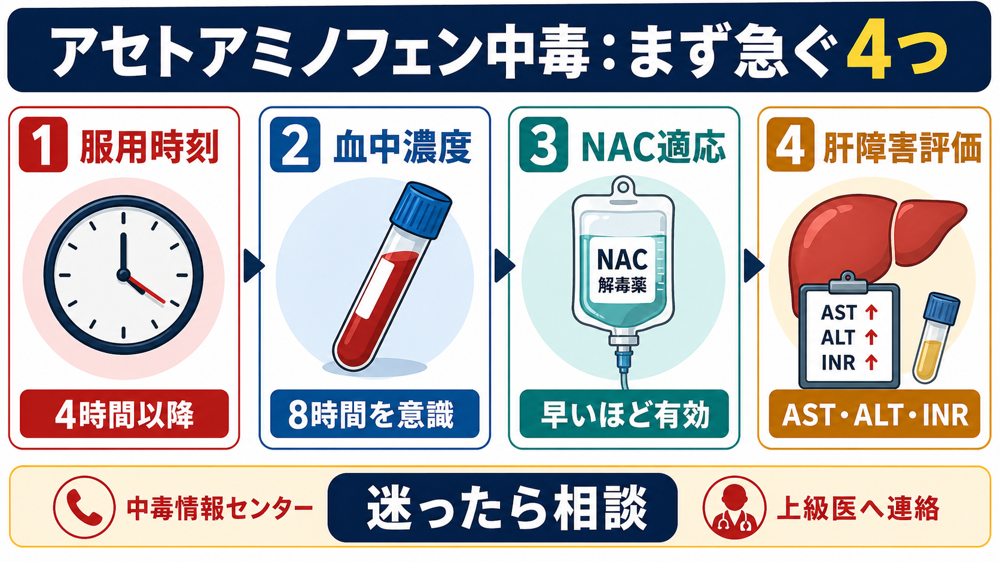
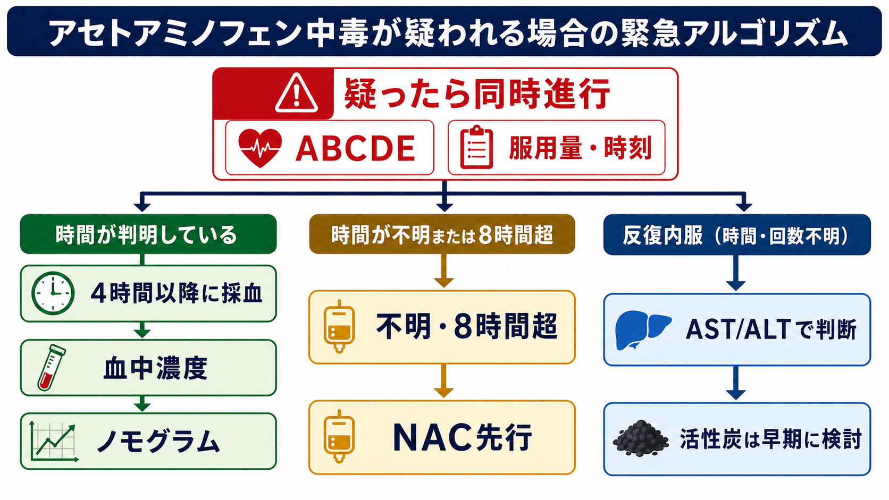
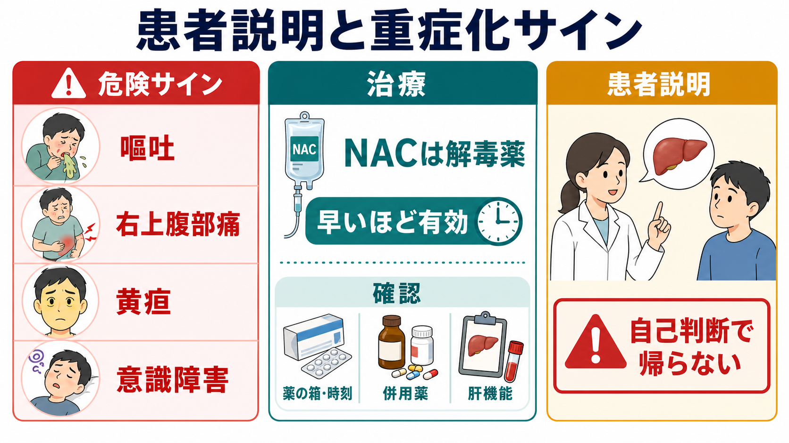

---
title: "アセトアミノフェン中毒では何を急ぐべきか"
description: "服用時刻、血中濃度、NAC適応、肝障害評価を急いで並行処理する。"
aliases:
  - "アセトアミノフェン中毒"
  - "APAP中毒"
  - "NAC適応"
tags:
  - 領域/救急・初期対応
  - 種類/クリニカルクエスチョン
  - 対象/研修医
question: "アセトアミノフェン中毒では何を急ぐべきか"
clinical_area: "救急・初期対応"
audience: "研修医"
evidence_level: "guideline/review"
created: "2026-04-27"
updated: "2026-04-27"
enableToc: true
---

# アセトアミノフェン中毒では何を急ぐべきか

> このノートは研修医教育のための一般的整理であり、個別患者への診断・治療指示ではありません。実際の中毒対応では、施設プロトコル、薬剤部、上級医、集中治療・肝臓専門医、日本中毒情報センターなどに早期相談してください。

## クリニカルクエスチョン

アセトアミノフェン中毒を疑ったとき、服用時刻、血中濃度、N-アセチルシステイン（NAC）適応、肝障害評価のうち何を急ぐべきか。

## まず結論

- 最初に急ぐのは「服用開始時刻」「服用量・製剤」「血中濃度を測る時刻」「NACを待たずに始める条件」の整理である。血中濃度だけを待つと、8時間を超える症例でNAC開始が遅れる。[1],[4]
- 単回急性摂取で時刻が信頼できる場合は、服用4時間以降のアセトアミノフェン血中濃度をノモグラムで評価する。4時間未満の濃度はピーク前で、原則としてリスク判定に使いにくい。[1],[5]
- 時刻不明、8時間超、血中濃度の迅速測定が難しい、または肝障害が疑われる場合は、採血と同時にNAC開始を上級医と相談する。日本の電子添文でも、摂取後8時間以内が望ましく、24時間以内なら効果が報告されている。[1],[4]
- 反復過量内服、徐放製剤、抗コリン薬・オピオイド併用では、単純なノモグラムだけで終わらせない。血中濃度の再検、AST/ALT、PT-INR、Cr、乳酸、血糖、意識状態で評価する。[4],[7]
- 日本での注意：国内で「アセトアミノフェン過量摂取時の解毒」として確認できる電子添文上のアセチルシステイン製剤は内用液で、初回140 mg/kg、その4時間後から70 mg/kgを4時間毎に17回、計18回経口投与する設計である。海外の標準的な静注NACレジメンとは運用が異なるため、施設採用薬と投与経路を早めに確認する。[1],[8]

## 判断の型

1. **本当にアセトアミノフェンかを確認する。** 商品名だけでなく、総合感冒薬、鎮痛薬、配合錠、家族の薬、OTC薬を含めて「アセトアミノフェン総量」を数える。国内添付文書でも、他のアセトアミノフェン含有薬との併用は過量投与による重篤な肝障害につながるため避けるよう注意喚起されている。[2]
2. **時刻を1点ではなく線で聞く。** 「飲み始め」「最後に飲んだ時刻」「何回に分けたか」「徐放・配合薬か」「嘔吐したか」を分ける。時刻があいまいなら、時刻不明ルートとして扱う。[4]
3. **4時間以降の血中濃度を取りにいく。** 到着が4時間未満なら4時間時点で採血を予約し、4時間以降なら直ちに血中濃度を測る。ノモグラムは急性単回摂取の評価道具であり、反復過量内服には使わない。[4],[5]
4. **8時間を越えそうならNACを待たせない。** 血中濃度の結果が8時間以降になる、服用量が大量、時刻不明、肝障害所見あり、という状況ではNAC先行を相談する。[1],[4]
5. **肝障害と重症化を同時に評価する。** AST/ALTだけでなく、PT-INR、ビリルビン、Cr、血糖、血液ガス・乳酸、意識状態を確認し、急性肝不全の兆候を拾う。[4],[7]

## 初期対応

- ABCDE、バイタル、意識状態、嘔吐・誤嚥リスク、自傷企図の有無を同時に見る。自傷企図・悪意ある投与が疑われる場合は、摂取量にかかわらず救急評価と安全確保を優先する。[6]
- 薬の箱、PTP、レシート、スマホ写真、同居者情報を集める。アセトアミノフェン含有の総合感冒薬や鎮痛薬は重複しやすい。[2]
- 服用後早期で、気道防御が保て、禁忌がなければ活性炭を検討する。2023年のUS/Canada consensusでは、肝毒性量の急性摂取では単回活性炭を考慮し、成人50-100 g、小児25-50 gが示されている。[4]
- 採血は「血中濃度を1本」ではなく、アセトアミノフェン濃度、AST/ALT、ALP、ビリルビン、PT-INR、Cr/BUN、電解質、血糖、血液ガス・乳酸、妊娠可能性がある場合の妊娠反応、併用薬に応じたサリチル酸・エタノールなどをまとめて考える。[4],[7]
- 日本中毒情報センターは、医療機関専用電話を365日24時間で案内している。施設内で判断に迷う症例、時刻不明、大量摂取、反復内服、併用薬あり、肝障害ありでは早めに相談する。[3]

## 鑑別・見逃し

- **反復過量内服**：数日かけて多めに飲んだ例では、血中濃度が低くてもAST/ALT上昇や肝不全があり得る。ノモグラムだけで除外しない。[4],[7]
- **時刻不明・証言不一致**：患者申告、家族情報、残薬数、症状、検査値が合わないときは時刻不明として扱う。[4]
- **徐放製剤・胃排出遅延**：徐放製剤、抗コリン薬、オピオイド併用では吸収が遅れ、初回血中濃度が治療ライン未満でも再検が必要になることがある。[4]
- **配合薬中毒**：総合感冒薬、鎮痛薬、睡眠薬、抗ヒスタミン薬、オピオイドなどの併用で、意識障害、けいれん、呼吸抑制、QT延長などが主病像になることがある。
- **急性肝不全への進展**：嘔吐、右上腹部痛、黄疸、低血糖、乳酸上昇、INR延長、腎障害、意識障害は重症化として扱い、ICU・肝移植評価を含めて相談する。[4],[8]

## 検査

- **アセトアミノフェン血中濃度**：服用4時間以降に採血する。4時間以降から24時間までの急性単回摂取では、Rumack-Matthew nomogramの治療ラインでNAC適応を判断する。[4],[5]
- **肝障害評価**：AST/ALT、ビリルビン、PT-INRを初回から確認する。NAC終了や継続判断でも、肝酵素と凝固能の改善が重要である。[7],[8]
- **重症度評価**：Cr/BUN、血糖、血液ガス、乳酸、電解質、リン、意識状態を追う。酸血症、乳酸上昇、Cr上昇、INR延長は予後不良の手がかりになる。[8]
- **併用中毒評価**：自傷企図や情報不確実例では、心電図、サリチル酸、エタノール、尿中薬物スクリーニングなどを病歴に応じて追加する。[4],[7]
- **再検の考え方**：徐放製剤または抗コリン薬・オピオイド併用で、4-12時間の濃度が治療ライン未満でも10 μg/mLを超える場合、4-6時間後の再検が推奨される。[4]

## 治療・マネジメント

- **NACの位置づけ**：NACはアセトアミノフェン中毒の解毒薬で、早期投与ほど肝障害予防効果が期待される。判断が遅れそうな場合は、血中濃度を待つより投与開始を相談する。[1],[4],[8]
- **日本でのNAC**：アセチルシステイン内用液17.6%「あゆみ」の電子添文では、アセトアミノフェン過量摂取時の解毒に、初回140 mg/kg、その4時間後から70 mg/kgを4時間毎に17回、計18回経口投与とされる。経口困難時は胃管または十二指腸管で投与し、投与後1時間以内に嘔吐した場合は同量を再投与する記載がある。[1]
- **海外との違い**：海外では静注NAC 21時間レジメンなどが広く使われる。ACMTは、21時間で機械的に終了せず、アセトアミノフェン濃度、AST/ALT、INR、Cr、乳酸、pHなどが改善しているかで延長を判断する立場を示している。[8]
- **活性炭**：早期摂取で気道が守れるなら検討する。徐放製剤や吸収遅延が疑われるときは、4時間を超えても有用性を相談する余地がある。[4]
- **専門相談**：大量摂取、血中濃度が高リスク、代謝性アシドーシス、乳酸上昇、INR延長、腎障害、意識障害、肝不全徴候では、救急・集中治療・肝臓専門医・中毒専門相談を同時に進める。[3],[4],[8]

## 図解

## 指導医に確認するポイント

- 服用時刻は信頼できるか。時刻不明ルートで扱うべき情報の矛盾はないか。
- 血中濃度の結果がいつ返るか。8時間を超えそうならNAC先行にするか。
- 反復過量内服、徐放製剤、抗コリン薬・オピオイド併用として再検が必要か。
- 国内採用薬として経口NACがすぐ使えるか。投与経路、希釈、嘔吐時対応、薬剤部連絡をどうするか。
- 肝不全・ICU・肝移植評価の相談ラインをいつ起動するか。
- 自傷企図、虐待、薬剤管理困難、退院安全性をどう評価するか。

## 患者説明

- 「この薬は通常量ではよく使われますが、多く飲むと時間がたってから肝臓に強い障害が出ることがあります。」
- 「最初は症状が軽くても、血液検査で薬の濃度と肝臓の状態を確認する必要があります。」
- 「解毒薬は早いほど効果が期待されます。飲んだ時刻、量、薬の箱やシート、他に飲んだ薬が分かると判断が速くなります。」
- 「嘔吐、右上腹部痛、黄疸、強いだるさ、意識がぼんやりする症状があれば、自己判断で帰宅せず医療者に伝えてください。」

## ピットフォール

- 「4時間未満の血中濃度が低い」だけで安心する。ピーク前の可能性がある。[1],[5]
- 服用時刻があいまいなのに、都合よく単回急性摂取としてノモグラムに当てはめる。[4]
- 総合感冒薬・OTC薬・配合薬を数え忘れ、アセトアミノフェン総量を過小評価する。[2]
- 血中濃度の結果待ちでNAC開始が8時間を超える。[1],[4]
- 反復過量内服にノモグラムを使って除外する。[4],[7]
- NACを規定時間で終了し、AST/ALT上昇、INR延長、Cr上昇、乳酸上昇、アセトアミノフェン残存を見落とす。[8]

## 関連ノート

- [[救急外来で病歴聴取が難しい患者から何を聞くべきか]]
- [[救急患者で上級医を呼ぶタイミングはどう判断するか]]
- [[意識障害患者を見たら最初に何を確認するか]]
- [[乳酸値が高い患者をどう解釈するか]]
- 関連ノート候補：薬剤・処方領域に「総合感冒薬の重複内服をどう防ぐか」、救急領域に「中毒患者で活性炭をいつ使うか」を作ると相互参照しやすい。

## MOC更新候補

- [[MOC｜救急・初期対応]] に、外傷・熱傷・中毒の中毒項目として本記事を追加。
- MOC｜薬剤・処方・副作用.md（本サイト外） に、アセトアミノフェン重複内服・解毒薬の関連として本記事を追加。

## 参考文献

[1] PMDA. アセチルシステイン内用液17.6%「あゆみ」電子添文（2024年3月改訂）. https://www.pmda.go.jp/PmdaSearch/iyakuDetail/ResultDataSetPDF/172190_3929006S1049_4_02

[2] PMDA. カロナール錠／アセトアミノフェン製剤 電子添文：警告、用法・用量、併用注意. https://www.pmda.go.jp/PmdaSearch/iyakuDetail/ResultDataSetPDF/172190_1141007C1075_5_05

[3] 公益財団法人 日本中毒情報センター. 中毒110番・電話サービス（医療機関専用）. https://www.j-poison-ic.jp/110serviece/service-guide-medical/

[4] Dart RC, Mullins ME, Matoushek T, et al. Management of Acetaminophen Poisoning in the US and Canada: A Consensus Statement. JAMA Network Open. 2023;6(8):e2327739. doi:10.1001/jamanetworkopen.2023.27739. https://jamanetwork.com/journals/jamanetworkopen/fullarticle/2808062

[5] Rumack BH, Matthew H. Acetaminophen poisoning and toxicity. Pediatrics. 1975;55(6):871-876. doi:10.1542/peds.55.6.871. https://publications.aap.org/pediatrics/article/55/6/871/51263/Acetaminophen-Poisoning-and-Toxicity

[6] Dart RC, Erdman AR, Olson KR, et al; American Association of Poison Control Centers. Acetaminophen poisoning: an evidence-based consensus guideline for out-of-hospital management. Clin Toxicol (Phila). 2006;44(1):1-18. doi:10.1080/15563650500394571. https://www.tandfonline.com/doi/full/10.1080/15563650500394571

[7] Hodgman MJ, Garrard AR. A review of acetaminophen poisoning. Crit Care Clin. 2012;28(4):499-516. doi:10.1016/j.ccc.2012.07.006. https://pubmed.ncbi.nlm.nih.gov/22998987/

[8] American College of Medical Toxicology. ACMT Practice Statement: Duration of Intravenous Acetylcysteine Therapy following Acetaminophen Overdose (2026 update). https://www.acmt.net/news/acmt-practice-statement-duration-of-intravenous-acetylcysteine-therapy-following-acetaminophen-overdose-2026-update/

## 更新ログ

- 2026-04-27: 初版作成。PMDA電子添文、日本中毒情報センター、US/Canada consensus、Rumack-Matthew、ACMT practice statementを確認し、図解3点を追加。
