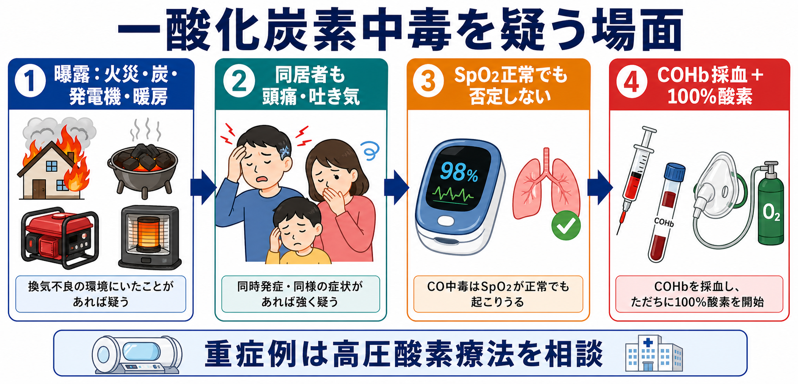
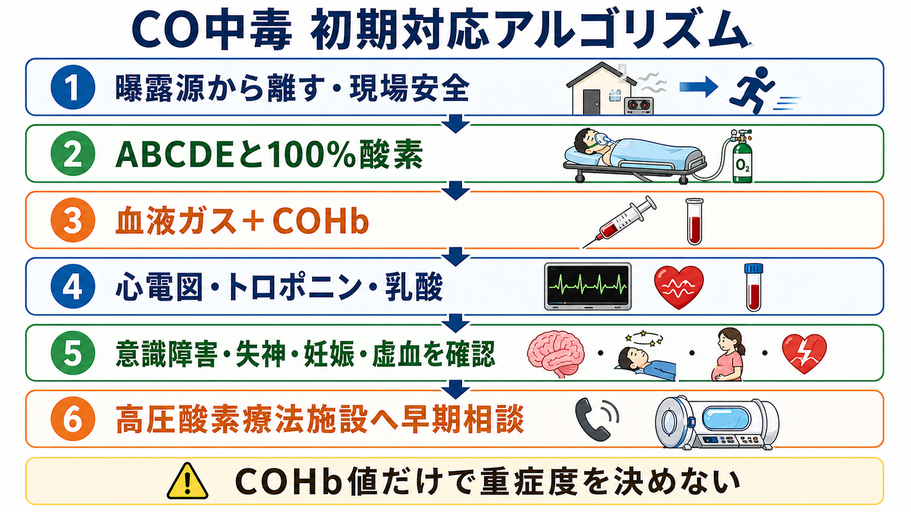
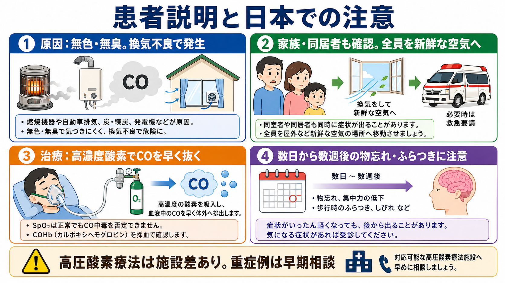

---
title: "一酸化炭素中毒を疑う場面では何を確認するか"
description: "頭痛、意識障害、同居者発症、COHb、酸素投与、高圧酸素療法相談を整理する。"
aliases:
  - "CO中毒"
  - "一酸化炭素中毒"
tags:
  - 領域/救急・初期対応
  - 種類/クリニカルクエスチョン
  - 対象/研修医
question: "一酸化炭素中毒を疑う場面では何を確認するか"
clinical_area: "救急・初期対応"
audience: "研修医"
evidence_level: "mixed"
created: "2026-04-27"
updated: "2026-04-27"
enableToc: true
---

# 一酸化炭素中毒を疑う場面では何を確認するか

> このノートは研修医教育のための一般的整理であり、個別患者の診断・治療指示ではありません。緊急性が高い、判断に迷う、施設方針が関わる場合は上級医・専門科に相談してください。

## クリニカルクエスチョン

頭痛、嘔気、意識障害、失神、胸痛、火災・暖房・炭・発電機・車内曝露、同居者の同時発症がある患者で、一酸化炭素中毒をどう疑い、何を確認して初期対応と高圧酸素療法相談につなげるか。

## まず結論

- 一酸化炭素は無色・無臭で、換気不良下の燃焼機器、炭、練炭、発電機、車の排気、火災で発生する。頭痛・嘔気・めまい・倦怠感は非特異的なので、**同じ場所にいた複数人の症状** と **曝露環境** を先に確認する [1][2]。
- SpO2が正常でもCO中毒は否定できない。通常のパルスオキシメータはCOHbと酸化Hbを十分に区別できず、COHb値は血液ガスまたはCOオキシメータで確認する [2][8]。
- 疑った時点で曝露源から離し、ABCDE評価を行い、原則として高濃度酸素を開始する。COHbの結果待ちで酸素投与を遅らせない [2][3]。
- COHb値は診断を支持するが、重症度・予後・HBO適応を単独では決めない。意識障害、失神、神経症状、心筋虚血、重症アシドーシス、妊娠、曝露時間、酸素投与後の時間を合わせて評価する [2][4][6]。
- 高圧酸素療法は遅発性神経後遺症を減らす可能性がある一方、試験結果は一貫せず、施設可用性にも左右される。重症例・妊婦・心筋障害例では、早期に対応施設または中毒・救急専門医へ相談する [4][5][6][7]。
- 帰宅・転院・入院いずれでも、数日から数週後の記憶障害、ふらつき、集中力低下、性格変化など遅発性神経症状を説明し、再診先を明確にする [2][4]。

## 判断の型

1. **曝露を確認する**: 火災、炭・練炭、屋内発電機、車内待機、暖房器具、給湯器、厨房、地下・ピット・閉鎖空間、冬季・停電・災害後を聞く。厚生労働省の労災事例でも、換気不十分、内燃機関使用、燃焼機器の点検不足が繰り返し原因として示されている [1]。
2. **集団発症を確認する**: 同居者、同室者、職場の同僚、ペットが同時に頭痛・嘔気・意識障害を起こしていないかを聞く。複数人発症はCO中毒を強く疑う手がかりである [2]。
3. **症状と重症所見を分ける**: 頭痛・嘔気・めまいだけなら軽症に見えるが、失神、意識障害、けいれん、胸痛、呼吸困難、低血圧、不整脈、妊娠、乳酸上昇、代謝性アシドーシスは相談を早める [2][4]。
4. **検査前に酸素を始める**: 曝露源から離し、高濃度酸素を開始する。COHbは酸素投与と時間経過で低下するため、採血時刻、曝露終了時刻、酸素開始時刻を記録する [2]。
5. **COHbだけで完結しない**: COHbが低くても、すでに酸素投与後なら低下している。逆にCOHbが高いだけでなく、神経・心筋・妊娠・酸塩基のリスクを合わせて判断する [2][4][7]。

## 初期対応

- **現場安全**: まだ曝露が続く可能性があれば、患者・同伴者を新鮮な空気のある場所へ移す。救急隊、消防、施設管理者と連携し、医療者が曝露環境に入らない。
- **ABCDE**: 気道、呼吸、循環、意識、低体温・外傷・熱傷を同時に見る。火災では気道熱傷、シアン化物中毒、外傷、熱傷、煙吸入を合併しうる。
- **酸素投与**: 疑った時点で高濃度酸素を開始する。意識障害や気道保護不能があれば、上級医と気管挿管・人工呼吸管理を検討する [2][3]。
- **モニタリング**: 心電図モニター、血圧、呼吸数、意識レベル、体温、血糖を確認する。重症CO中毒では心筋障害が予後に関わるため、心電図とトロポニンを確認する [2]。
- **同時発症者対応**: 同居者・同室者・職場同僚・ペットの症状を確認し、同じ曝露環境にいた人は症状が軽くても評価対象として扱う。

## 鑑別・見逃し

| 優先度 | 疾患・状態 | 見逃さない理由 | 手がかり |
|---|---|---|---|
| 高 | 一酸化炭素中毒 | SpO2正常、非特異的症状で見逃しやすく、遅発性神経後遺症がありうる | 火災、暖房、炭、発電機、車内、複数人発症、COHb上昇 [1][2] |
| 高 | シアン化物中毒・煙吸入 | 火災現場ではCO中毒と合併し、急速な循環不全・乳酸上昇を来す | 火災、煤、意識障害、乳酸高値、ショック |
| 高 | 低血糖・脳卒中・けいれん後 | 意識障害をCOだけで説明すると別の救急疾患を逃す | 血糖異常、局在神経症状、発症時刻、けいれん目撃 |
| 中 | ウイルス性胃腸炎・片頭痛 | 頭痛・嘔気だけでは鑑別困難 | 発熱、下痢、反復既往、同一空間での複数人発症なし |
| 中 | アルコール・鎮静薬・オピオイド中毒 | 意識障害・呼吸抑制の原因になり、CO中毒と併存もある | 薬袋、空包、飲酒、縮瞳、呼吸数低下 |
| 中 | 急性冠症候群・不整脈 | COは心筋虚血を起こしうるが、一次性心疾患も鑑別が必要 | 胸痛、心電図変化、トロポニン上昇、不整脈 |

## 検査

| 検査 | 目的 | 注意点 |
|---|---|---|
| 血液ガス、COHb | 診断支持、酸塩基、乳酸、換気状態の評価 | 動脈・静脈いずれもCOHb確認に使われることがある。酸素投与後は低下するため、採血時刻を記録する [2] |
| パルスオキシメータ | 連続モニタ | 通常のSpO2はCOHb存在下で過大評価されうる。正常値でも否定しない [2][8] |
| 心電図、トロポニン | 心筋虚血、不整脈、心筋障害の評価 | 胸痛がなくても重症例では確認する [2] |
| 血糖、電解質、腎肝機能、CK | 意識障害・けいれん・横紋筋融解・合併症評価 | CO中毒だけに固定しない |
| 乳酸、pH、HCO3- | 組織低酸素、シアン化物中毒合併、重症度の把握 | 高度乳酸アシドーシスでは火災関連シアン化物中毒も上級医へ共有 |
| 妊娠反応 | 妊娠時のHBO相談を早める | CDCは妊婦ではより積極的なHBOを支持する国際的合意があると説明している [2] |
| 胸部X線、頭部CT/MRI | 煙吸入、肺水腫、外傷、他疾患除外 | CO中毒の診断そのものは画像で決めない。意識障害や外傷疑いで適応を考える [2] |

## 治療・マネジメント

- **酸素**: CO中毒を疑ったら高濃度酸素を開始する。酸素は日本の電子添文上「酸素欠乏による諸症状の改善」が効能・効果で、用法・用量は医師の指示による。高濃度酸素の長時間投与や高気圧療法下では酸素中毒に注意し、濃度・圧力・時間を必要最小限にする [3]。
- **HBO相談の目安**: 意識消失または持続する意識障害、神経症状、心筋虚血・不整脈、重症代謝性アシドーシス、COHb 25から30%以上、妊娠、重症煙吸入、症状が強い小児・高齢者・心肺疾患患者では早期相談する [2][4][6]。
- **日本での注意**: 高圧酸素療法は施設数、装置種別、夜間休日対応、搬送距離、火災・挿管・モニター管理可否に差がある。日本高気圧潜水医学会は急性CO中毒対応可能施設一覧を公開しており、地域の搬送先を事前に確認しておく [4]。
- **エビデンスの扱い**: Weaverらの二重盲検RCTではHBOが6週時点の認知後遺症を減らしたが、Cochraneレビューは試験間の異質性とバイアスのため、HBOが神経後遺症を減らすかは確定的でないと整理している [6][7]。したがって「HBOを必ず行う」ではなく、「重症所見があれば早期相談し、施設方針・搬送リスク・患者背景で決める」と考える。
- **入院・帰宅判断**: 症状消失、神経所見、心電図・トロポニン、酸塩基、COHb低下、同居者評価、曝露源の安全確認、再診説明を確認する。帰宅時は遅発性神経症状の説明と再診先を文書で残す [2]。

## 図解

## 指導医に確認するポイント

- 曝露終了時刻、酸素開始時刻、COHb採血時刻から、現在のCOHbをどう解釈するか。
- 意識消失、神経所見、心電図変化、トロポニン、乳酸、pH、妊娠の有無から、HBO対応施設へ相談・転院するか。
- 火災例では、気道熱傷、熱傷面積、シアン化物中毒、外傷、低体温をどう同時評価するか。
- 帰宅可能と判断する場合、曝露源の安全確認、同居者評価、再診説明、フォロー先をどう担保するか。
- 日本での施設運用として、近隣のHBO対応施設、夜間休日対応、挿管患者受け入れ、搬送時間をどう確認するか。

## 患者説明

- 「一酸化炭素は色もにおいもないため、気づかないうちに吸い込むことがあります。頭痛や吐き気だけでも、同じ場所にいた人にも症状があれば強く疑います。」
- 「血液中の一酸化炭素を確認しながら、高濃度の酸素で体から一酸化炭素を早く抜く治療をします。」
- 「指先の酸素の数字が正常でも、この病気を否定できません。」
- 「重症の場合や妊娠中、心臓や脳への影響が疑われる場合は、高圧酸素療法ができる施設へ相談することがあります。」
- 「いったん良くなっても、数日から数週後に物忘れ、集中力低下、ふらつき、性格変化が出ることがあります。気になる症状があれば再診してください。」

## ピットフォール

- SpO2が正常だからCO中毒ではない、と判断する。
- 頭痛・嘔気を胃腸炎や片頭痛だけで説明し、同居者発症や暖房・炭・発電機・車内曝露を聞かない。
- COHb値だけで重症度を決める。酸素投与後の低下、曝露終了からの時間、症状、心筋障害、妊娠を見落とす。
- COHb採血のために酸素投与を遅らせる。
- 火災例でCO中毒だけを見て、気道熱傷、シアン化物中毒、熱傷、外傷を見逃す。
- 帰宅時に曝露源の安全確認と同居者評価をしない。
- 遅発性神経症状の説明とフォローを残さない。

## 関連ノート

- [呼吸困難患者を見たら最初に何をするか](../胸痛・呼吸困難/呼吸困難患者を見たら最初に何をするか.md)
- [SpO2低下を見たとき酸素投与をどう選ぶか](../胸痛・呼吸困難/SpO2低下を見たとき酸素投与をどう選ぶか.md)
- [血液ガスで呼吸不全をどう判断するか](../胸痛・呼吸困難/血液ガスで呼吸不全をどう判断するか.md)
- [意識障害の鑑別をAIUEOTIPSでどう整理するか](../意識障害・けいれん/意識障害の鑑別をAIUEOTIPSでどう整理するか.md)
- 関連ノート候補（未作成）: 火災患者でシアン化物中毒をいつ疑うか、高圧酸素療法を救急外来でどう相談するか、同時発症する中毒をどう拾うか。

## MOC更新候補

- [[MOC｜救急・初期対応]] に「外傷・熱傷・中毒」の中毒初期対応として追加候補。
- MOC｜呼吸器.md（本サイト外） に「SpO2が正常でも否定できない低酸素関連病態」として関連候補。
- MOC｜薬剤・処方・副作用.md（本サイト外） に「酸素・高圧酸素療法の注意」として関連候補。

## 参考文献

[1] 厚生労働省. 業務用厨房施設における一酸化炭素中毒災害による労働災害防止について. 2009. https://www.mhlw.go.jp/stf/houdou/2r98520000002y3d.html

[2] Centers for Disease Control and Prevention. Clinical Guidance for Carbon Monoxide Poisoning Following Disasters and Severe Weather. 2024. https://www.cdc.gov/carbon-monoxide/hcp/clinical-guidance/index.html

[3] 医療用医薬品 : 酸素. 電子添文情報 2024年7月改訂 第2版. KEGG MEDICUS/JAPIC. https://www.kegg.jp/medicus-bin/japic_med?japic_code=00069902

[4] 一般社団法人 日本高気圧潜水医学会. 急性一酸化炭素中毒対応可能施設一覧 (2025). 2026年3月19日掲載. https://www.juhms.net/comap/

[5] 矢澤和虎, 野首元成, 竹原延治, ほか. 一酸化炭素中毒に対する高気圧酸素治療の現状－全国救命救急センターアンケート調査結果から－. 日本救急医学会雑誌. 2012;23(12):834-841. https://doi.org/10.3893/jjaam.23.834

[6] Weaver LK, Hopkins RO, Chan KJ, et al. Hyperbaric Oxygen for Acute Carbon Monoxide Poisoning. New England Journal of Medicine. 2002;347(14):1057-1067. https://doi.org/10.1056/NEJMoa013121

[7] Buckley NA, Juurlink DN, Isbister G, Bennett MH, Lavonas EJ. Hyperbaric oxygen for carbon monoxide poisoning. Cochrane Database of Systematic Reviews. 2011;CD002041. https://doi.org/10.1002/14651858.CD002041.pub3

[8] Hampson NB. Pulse oximetry in severe carbon monoxide poisoning. Chest. 1998;114(4):1036-1041. https://doi.org/10.1378/chest.114.4.1036

[9] Weaver LK. Carbon Monoxide Poisoning (Reprinted from the 2023 Hyperbaric Indications Manual 15th edition). Undersea & Hyperbaric Medicine. 2024;51(3):253-276. https://pubmed.ncbi.nlm.nih.gov/39348519/

## 更新ログ

- 2026-04-27: 初版作成。
