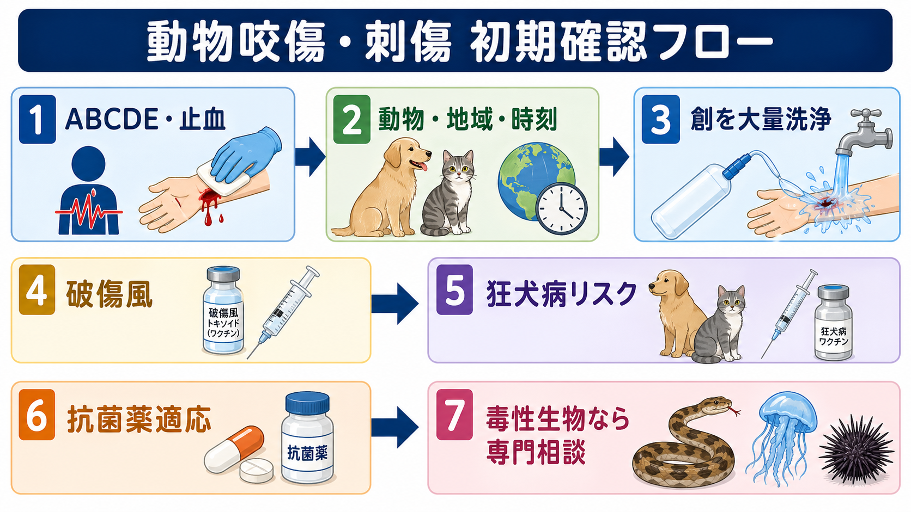
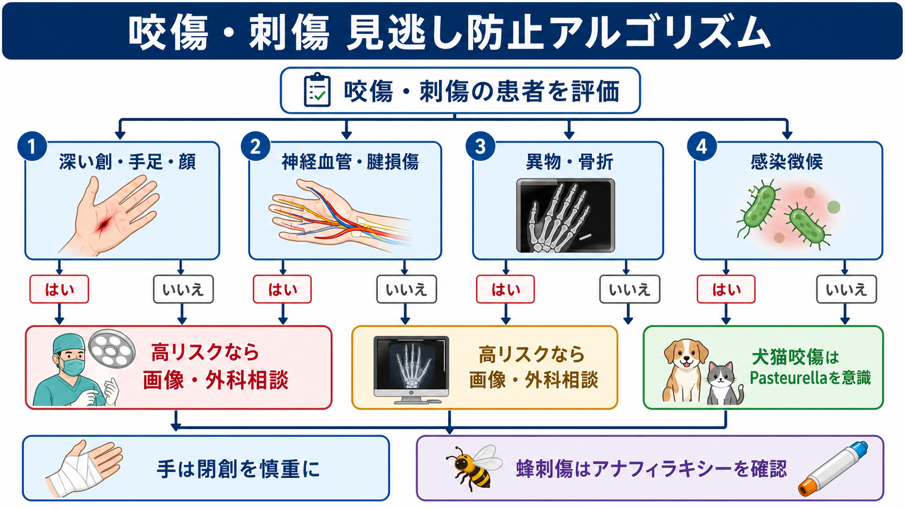
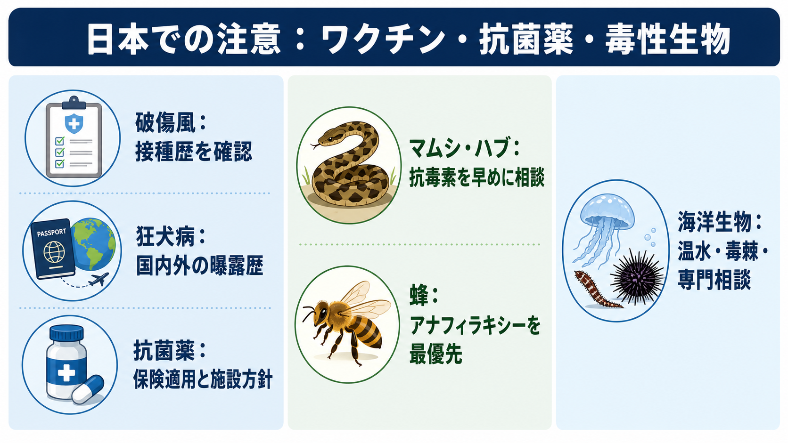

---
title: "動物咬傷・刺傷では何を確認するか"
description: "動物咬傷・刺傷で、創処置、破傷風、狂犬病リスク、抗菌薬、毒性生物への対応を初期診療で整理する。"
aliases:
  - "動物咬傷・刺傷の初期対応"
tags:
  - 領域/救急・初期対応
  - 種類/クリニカルクエスチョン
  - 対象/研修医
question: "動物咬傷・刺傷では何を確認するか"
clinical_area: "救急・初期対応"
audience: "研修医"
evidence_level: "mixed"
created: "2026-04-27"
updated: "2026-04-27"
enableToc: true
---

# 動物咬傷・刺傷では何を確認するか

> このノートは研修医教育のための一般的整理であり、個別患者への診断・治療指示ではありません。重症例、手・顔・関節近傍の創、毒性生物、狂犬病リスク、判断に迷う場合は、上級医・外科・感染症科・救急科・保健所などへ早めに相談してください。

## クリニカルクエスチョン

動物咬傷・刺傷を診たとき、創処置、破傷風、狂犬病リスク、抗菌薬、毒性生物への対応をどの順番で確認するか。

## まず結論

- 最初に見るのは「動物名」ではなく、ABCDE、出血、アナフィラキシー、神経血管・腱損傷、コンパートメント症候群の有無である。蜂刺傷や抗毒素製剤投与後は、皮膚症状だけでなく呼吸・循環・消化器症状を見てアナフィラキシーを拾う[9]。
- 咬傷は、まず大量の洗浄、異物除去、壊死組織の処置を行う。犬猫咬傷では深さ、部位、手・顔・関節近傍、骨・腱・関節包への到達、感染徴候を確認する[1,2]。
- 破傷風は「汚染創」として扱う。動物・ヒト咬傷は唾液で汚染されるため、接種歴が不明・不完全ならワクチンと抗破傷風人免疫グロブリンの要否を確認する[3,4]。
- 狂犬病は日本国内の通常診療では頻度が低いが、海外曝露、輸入動物、コウモリ、野生哺乳類、観察不能な動物では見逃してはいけない。曝露後予防は創洗浄、ワクチン、必要時の免疫グロブリンで構成される[5,6,7]。
- 抗菌薬は全例ではなく、感染創、猫咬傷、手・顔・足・陰部、深部損傷、免疫不全、肝疾患、無脾、浮腫、関節・骨到達疑いなどで考える。海外ガイドラインではアモキシシリン・クラブラン酸が第一選択だが、日本では適応・用量・院内採用を確認する[1,2,8]。
- 毒性生物では「毒の種類」より先に、全身症状、局所腫脹の進行、凝固異常、横紋筋融解、腎障害、神経症状を追う。マムシ・ハブでは抗毒素の保有、投与適応、アナフィラキシー対応を早めに相談する[10]。

## 判断の型

1. **今すぐ危ない病態を拾う**  
   気道・呼吸・循環、止血、意識、疼痛、アナフィラキシー、毒による急速な全身症状を確認する。蜂刺傷で皮膚症状が軽くても、喘鳴、嗄声、低血圧、反復嘔吐、意識障害があれば治療を優先する[9]。
2. **曝露情報を具体化する**  
   動物・昆虫・海洋生物の種類、飼育動物か野生か、接種状況、観察可能か、受傷地、海外渡航歴、時刻、創の洗浄開始までの時間を聞く[1,5]。
3. **創のリスクを層別化する**  
   手、顔、足、関節近傍、深い穿刺、挫滅、異物、骨折、腱・神経・血管損傷、免疫不全、糖尿病、肝硬変、無脾、遅れて受診した創を高リスクとして扱う[1,2]。
4. **感染予防と発症予防を分けて考える**  
   抗菌薬は細菌感染予防・治療、破傷風ワクチンと免疫グロブリンは破傷風予防、狂犬病ワクチンと免疫グロブリンは狂犬病発症予防であり、目的が違う[3,6]。
5. **閉創は急がない**  
   顔面など整容面の理由が強い部位を除き、動物咬傷の一次閉鎖は慎重にする。特に手の咬傷、猫咬傷、深い穿刺、汚染が強い創では、洗浄・デブリードマン・外科相談を優先する[2]。

## 初期対応

- **ABCDEと止血**: 大量出血、ショック、気道浮腫、喘鳴、低酸素、意識障害を先に処置する。
- **創洗浄**: 可能な範囲で流水または生理食塩水で十分に洗浄し、異物と壊死組織を除く。狂犬病リスクがある曝露では石けんと水による洗浄が特に重要である[5,6]。
- **疼痛管理と写真記録**: 腫脹や発赤の進行を見るため、創部写真、腫脹範囲のマーキング、時刻を記録する。
- **破傷風確認**: 最終接種時期、基礎免疫完了、母子手帳・ワクチン記録を確認する。動物咬傷は汚染創として扱う[3]。
- **狂犬病確認**: 国内か海外か、国・地域、犬猫以外の哺乳類、コウモリ、動物の観察可否、現地でPEPを開始したかを聞く[5,6]。
- **毒性生物確認**: マムシ・ハブ、蜂、ムカデ、クラゲ、オニダルマオコゼ、エイ、ウニなどを疑う場合は、全身症状と局所腫脹の進行を繰り返し評価する。

## 鑑別・見逃し

| 優先度 | 病態 | 見逃しやすい理由 | 手がかり |
|---|---|---|---|
| 高 | アナフィラキシー | 皮疹が目立たないことがある | 喘鳴、嗄声、低血圧、失神、反復嘔吐、急速な進行[9] |
| 高 | 腱・神経・血管損傷 | 小さな咬創でも深部に届く | 手指運動、感覚、毛細血管再充満、拍動、腱走行上の痛み |
| 高 | 関節・骨到達、骨折、異物 | 猫咬傷・穿刺創では入口が小さい | 関節近傍、深い疼痛、可動域制限、X線・エコーで異物 |
| 高 | 深部感染・壊死性軟部組織感染 | 初期は発赤が軽い | 痛みが強い、急速進行、発熱、ショック、皮下気腫 |
| 中 | Capnocytophaga感染 | 初期は非特異的 | 犬咬傷、無脾、アルコール多飲、肝疾患、免疫不全[2] |
| 中 | Pasteurella感染 | 犬猫咬傷後に早く悪化 | 受傷後24時間以内の発赤・腫脹・疼痛、猫咬傷[1,2] |
| 中 | マムシ・ハブ咬傷 | 歯痕が不明瞭なことがある | 腫脹進行、疼痛、皮下出血、CK上昇、腎障害、凝固異常[10] |
| 中 | 海洋生物刺傷 | 種類が分からない | 海水・岩場・釣り・ダイビング、毒棘、激痛、遺残棘 |

## 検査

| 検査 | 目的 | 注意点 |
|---|---|---|
| X線 | 骨折、歯牙・棘・異物、関節近傍損傷 | 手、関節近傍、深い創、異物疑いで低閾値に行う |
| エコー | 異物、膿瘍、腱周囲液、血管評価 | 陰性でも深部損傷を除外しきれない |
| 血算・CRP | 感染のベースライン | 初期陰性でも感染を否定しない |
| 腎機能・電解質・CK | マムシ、ハブ、強い腫脹、横紋筋融解疑い | 腫脹進行例では経時的に再検する |
| 凝固系 | ハブ咬傷、重症毒蛇咬傷、出血傾向 | 地域・毒種で出方が異なるため専門相談する |
| 創培養 | 感染創の抗菌薬調整 | 非感染の予防投与前ルーチン培養は有用性が低い[1] |
| 狂犬病関連 | 曝露リスク評価 | 患者検査で早期除外するより、曝露状況と公衆衛生相談が重要[5,6] |

## 治療・マネジメント

### 創処置

- 大量洗浄、異物除去、壊死組織のデブリードマンを行う。深部損傷、手、顔、関節近傍、骨・腱・神経血管損傷疑いでは外科へ早期相談する[1,2]。
- 一次閉鎖は感染リスクと整容面を天秤にかける。IDSAは、顔面創を除き動物咬傷の一次閉鎖を原則推奨していない[2]。

### 破傷風

- 動物・ヒト咬傷、穿刺創、壊死組織を含む創は「汚染創・重症創」として扱う。CDCは、最終接種から5年以上の汚染創ではブースターを、接種歴不明・未完了などではTIGも検討すると整理している[3]。
- 日本で使える製剤は、沈降破傷風トキソイド、抗破傷風人免疫グロブリン製剤などで、製品添付文書と院内手順を確認する[4]。

### 狂犬病

- 日本では犬の登録と年1回の狂犬病予防注射が法的に運用され、国内発生は長く抑えられているが、世界では流行地域が多い。海外で犬などに咬まれた場合は、直ちに洗浄し、現地医療機関で創処置とワクチン接種を受け、帰国時に検疫所へ相談するよう厚生労働省が案内している[5]。
- WHOは曝露をカテゴリーIからIIIに分け、カテゴリーII以上では創洗浄とワクチン、カテゴリーIIIでは免疫グロブリンを推奨する[6]。
- **日本での注意**: 国内流通ワクチンはラビピュール筋注用などで、添付文書上の接種法、曝露前接種歴、海外で開始済みのレジメン、免疫不全の有無により運用が変わる。迷う場合は感染症科、渡航外来、検疫所、保健所へ相談する[5,7]。

### 抗菌薬

- 高リスク咬傷では予防投与を検討する。IDSAは免疫不全、無脾、進行肝疾患、浮腫、手・顔の中等度以上損傷、骨膜・関節包到達疑いで3〜5日間の早期抗菌薬を推奨している[2]。
- 感染創では好気性菌・嫌気性菌の両方をカバーする。IDSAとNICEはいずれもアモキシシリン・クラブラン酸を主要選択肢に置く[1,2]。
- **日本での注意**: オーグメンチン、スルバクタム/アンピシリンなどの国内添付文書は、海外ガイドラインの「咬傷」レジメンと効能・用量が完全には一致しない場合がある。保険適用、用量、腎機能、妊娠、アレルギー、院内採用、AST/感染症科方針を確認する[8]。

### 毒性生物

- 蜂刺傷はアナフィラキシーを最優先で評価する。アドレナリン筋注、酸素、輸液、モニタリング、二相性反応への観察を施設手順に沿って行う[9]。
- マムシ・ハブ咬傷では、咬傷部位を安静にし、腫脹範囲、疼痛、CK、腎機能、凝固系を追う。抗毒素はウマ由来製剤でアナフィラキシーに備える必要があるため、投与適応と投与場所を上級医・救急科・中毒情報センターなどへ早めに相談する[10]。
- 海洋生物では、クラゲ、魚毒、エイ、ウニなどで応急処置が異なる。毒棘の遺残、熱による毒素失活が期待できる種、酢を避けるべき種があり、種が不明なら地域の救急・中毒情報に相談する。

### 日本での注意

- 狂犬病は国内頻度だけで安心しない。海外曝露、コウモリ、輸入動物、観察不能な哺乳類ではPEPの相談を遅らせない[5,6]。
- 国内の狂犬病ワクチン、破傷風トキソイド、抗破傷風人免疫グロブリン、抗毒素、アドレナリンは添付文書と院内採用に依存する。海外の用量表をそのままオーダーにしない[4,7,8,9,10]。
- マムシ・ハブ抗毒素は保有施設が限られることがある。搬送・取り寄せ・投与場所を早期に調整する[10]。

## 図解

## 指導医に確認するポイント

- 手・顔・関節近傍・深部創で、外科相談、画像検査、閉創方針をどうするか。
- 破傷風接種歴が不明または不完全なとき、ワクチンと免疫グロブリンの適応をどう判断するか。
- 狂犬病リスクがある曝露で、保健所・検疫所・感染症科へいつ相談するか。
- 抗菌薬を予防投与するか、感染治療として開始するか。国内添付文書、保険適用、院内採用、腎機能で調整が必要か。
- マムシ・ハブ、蜂、海洋生物で、観察時間、抗毒素、アドレナリン、搬送先をどう決めるか。

## 患者説明

- 「傷は小さく見えても、動物の歯や棘は深く入り、細菌、異物、腱や関節の損傷が隠れることがあります。」
- 「今日は傷をよく洗い、破傷風、狂犬病、抗菌薬が必要かを確認します。海外や野生動物が関係する場合は、追加で専門機関に相談します。」
- 「赤みや腫れが広がる、痛みが強くなる、発熱、指が動かしにくい、しびれ、息苦しさ、めまい、嘔吐があれば、早めに再受診してください。」
- 「蜂や抗毒素では、いったん良くなっても再び症状が出ることがあります。帰宅可否と観察時間は医師が状態を見て判断します。」

## ピットフォール

- 「国内の犬猫だから狂犬病は完全に考えなくてよい」と決めつける。海外曝露、コウモリ、野生動物、輸入動物では別問題である[5,6]。
- 猫咬傷を浅い創として扱う。猫の歯は深い穿刺になりやすく、Pasteurellaなどの早期感染に注意する[1,2]。
- 抗菌薬で破傷風を予防できると考える。破傷風予防は創処置、ワクチン、必要時の免疫グロブリンで考える[3]。
- 手の咬傷を安易に一次閉鎖する。腱・関節・神経血管損傷と深部感染を見逃しやすい[2]。
- 蜂刺傷で皮疹だけを見る。呼吸・循環・消化器・神経症状を含めてアナフィラキシーを判断する[9]。
- マムシ・ハブ咬傷で局所所見だけを追う。腫脹進行、CK、腎機能、凝固異常、抗毒素投与時のアナフィラキシー対応を同時に考える[10]。

## 関連ノート

- 関連ノート候補: `アナフィラキシーを疑ったとき最初に何をするか`
- 関連ノート候補: `破傷風予防は創傷でどう判断するか`
- 関連ノート候補: `手外傷では何を確認するか`
- 関連ノート候補: `海外渡航後の感染症リスクをどう確認するか`

## MOC更新候補

- [[MOC｜救急・初期対応]] の外傷・中毒セクションに本記事へのリンクを追加候補。
- MOC・感染症・抗菌薬.md（本サイト外） の皮膚軟部組織感染または曝露後予防セクションに追加候補。
- MOC・外科・整形・皮膚.md（本サイト外） の手外傷・創傷処置セクションに追加候補。

## 参考文献

[1] National Institute for Health and Care Excellence. Human and animal bites: antimicrobial prescribing. NICE guideline NG184. 2020. https://www.nice.org.uk/guidance/ng184

[2] Stevens DL, Bisno AL, Chambers HF, et al. Practice Guidelines for the Diagnosis and Management of Skin and Soft Tissue Infections: 2014 Update by the Infectious Diseases Society of America. Clinical Infectious Diseases. 2014;59(2):e10-e52. https://doi.org/10.1093/cid/ciu296

[3] Centers for Disease Control and Prevention. Clinical Guidance for Wound Management to Prevent Tetanus. Updated 2025. https://www.cdc.gov/tetanus/hcp/clinical-guidance/index.html

[4] 医薬品医療機器総合機構（PMDA）. 沈降破傷風トキソイド「生研」／テタノブリンIH静注・テタノブリン筋注用 医療用医薬品情報. https://www.pmda.go.jp/PmdaSearch/rdSearch/02/6322400X2048?user=1 ; https://www.pmda.go.jp/PmdaSearch/rdSearch/02/6343433A2031?user=1

[5] 厚生労働省. 狂犬病に関するQ&Aについて. https://www.mhlw.go.jp/bunya/kenkou/kekkaku-kansenshou10/07.html

[6] World Health Organization. Rabies vaccines: WHO position paper - April 2018. Weekly Epidemiological Record. 2018;93:201-220. https://www.who.int/publications/i/item/who-wer9316

[7] 医薬品医療機器総合機構（PMDA）. ラビピュール筋注用 医療用医薬品情報. https://www.pmda.go.jp/PmdaSearch/rdSearch/02/6313400E1025?user=1

[8] 医薬品医療機器総合機構（PMDA）. オーグメンチン配合錠／スルバシリン静注用 医療用医薬品情報. https://www.pmda.go.jp/PmdaSearch/rdSearch/02/6139100F2044?user=1 ; https://www.pmda.go.jp/PmdaSearch/rdSearch/02/6139504F2088?user=1

[9] 日本アレルギー学会 Anaphylaxis対策委員会. アナフィラキシーガイドライン2022. 2022. https://www.jsaweb.jp/modules/news_topics/index.php?content_id=688

[10] 医薬品医療機器総合機構（PMDA）. 乾燥まむし抗毒素「KMB」／乾燥はぶ抗毒素「KMB」 医療用医薬品情報. https://www.pmda.go.jp/PmdaSearch/rdSearch/02/6331412X1078?user=1 ; https://www.pmda.go.jp/PmdaSearch/rdSearch/02/6331410X1036?user=1

## 更新ログ

- 2026-04-27: 初版作成。日本の厚生労働省・PMDA・日本アレルギー学会資料と、NICE、IDSA、CDC、WHO資料を確認し、`$imagegen` 由来のラスター図解3枚を添付。
