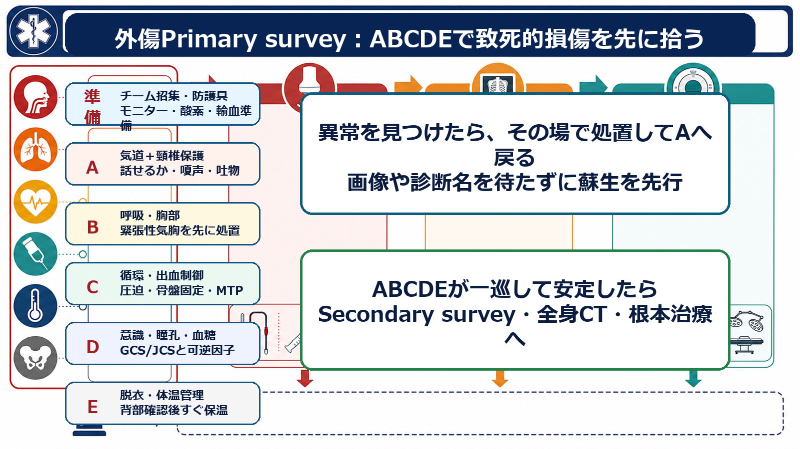
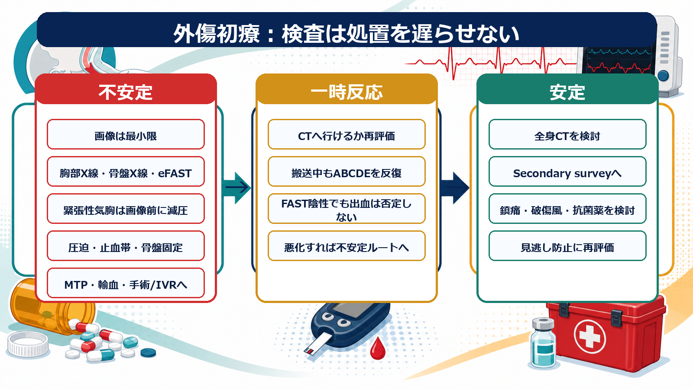
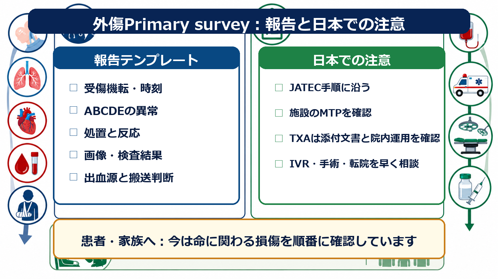

---
title: "外傷患者を見たらPrimary surveyはどう進めるか"
description: "ABCDEに沿って致死的損傷を先に見つけ、画像や処置につなげる外傷初期診療を学ぶ。"
aliases:
  - "外傷Primary survey"
tags:
  - 領域/救急・初期対応
  - 種類/クリニカルクエスチョン
  - 対象/研修医
question: "外傷患者を見たらPrimary surveyはどう進めるか"
clinical_area: "救急・初期対応"
audience: "研修医"
evidence_level: "guideline"
created: "2026-04-27"
updated: "2026-04-27"
enableToc: true
---

# 外傷患者を見たらPrimary surveyはどう進めるか

> このノートは研修医教育のための一般的整理であり、個別患者への診断・治療指示ではありません。緊急性が高い、判断に迷う、施設方針が関わる場合は上級医・救急チーム・外傷チームに相談してください。

## クリニカルクエスチョン

外傷患者を見たら、ABCDEに沿って致死的損傷を先に見つけ、画像検査や止血・気道確保・手術/IVR・転院判断へどうつなげるか。

## まず結論

- Primary surveyは「診断名を当てる時間」ではなく、**今すぐ死につながるA/B/C/D/Eの破綻を探し、その場で処置して、Aへ戻る**手順である。JATECとATLSはいずれも、外傷初期診療を標準化し、Primary survey、蘇生、再評価、Secondary survey、根本治療へ進める考え方を重視する [1,2]。
- 進行順は原則として **準備 → 第一印象 → A 気道＋頸椎保護 → B 呼吸 → C 循環・出血制御 → D 意識・神経 → E 脱衣・体温管理**。異常があれば次へ進む前に介入し、介入後はAから再評価する [1-3]。
- 画像はPrimary surveyを助ける道具であり、処置を遅らせてはいけない。血行動態が不安定な出血疑いでは、画像は胸部X線、骨盤X線、FAST/eFASTなど必要最小限にし、反応がある、または安定している患者でCTを検討する [4]。
- 緊張性気胸、制御不能な外出血、骨盤骨折に伴う出血疑い、出血性ショック、意識障害の可逆因子、低体温は、研修医が抱え込まず早期に上級医・外傷チームを呼ぶ [1,4]。
- 日本ではJATECの手順、院内の大量出血プロトコル、輸血供給、IVR/手術室体制、転院ルールに強く依存する。輸血は厚生労働省の血液製剤適正使用指針も背景に置き、TXAは海外外傷試験で利益が示される一方、日本の添付文書上の効能・用量、禁忌、院内運用を確認して使う [5-8]。

## 判断の型

1. **部屋に入る前に準備する**: 個人防護具、外傷チーム招集基準、モニター、酸素、吸引、バッグバルブマスク、気道器具、胸腔ドレーン、骨盤固定具、止血資材、保温、輸血準備を確認する。
2. **第一印象で危険を拾う**: 話せるか、呼吸努力、皮膚冷汗、活動性出血、意識、体位、受傷機転を10秒程度で把握する。
3. **ABCDEを一方向に進める**: A/B/C/D/Eそれぞれで「異常を見つける」「その場で処置する」「反応を見る」「Aへ戻る」を繰り返す。
4. **画像に行ける安定度かを常に問う**: CT室で悪化しそうな患者は、まず蘇生、止血、気道・呼吸管理、搬送中の人員確保を優先する。
5. **根本治療へ接続する**: Primary surveyで見つけた問題を、手術、IVR、輸血、専門科、ICU、転院へ早くつなげる。

## 初期対応

- **準備**: 受傷機転、到着予告、抗凝固薬、妊娠可能性、小児/高齢者などの情報をチームで共有する。役割はリーダー、気道、処置、記録、薬剤、家族対応に分ける。
- **A 気道＋頸椎保護**: 話せるなら一時的に気道は保たれている可能性が高いが、嗄声、顔面/頸部外傷、吐物、血液、意識低下、熱傷、低酸素があれば悪化を予測する。頸椎保護を意識し、吸引、下顎挙上、酸素、バッグバルブマスク、気管挿管準備を早める。
- **B 呼吸・胸部**: 呼吸数、努力呼吸、SpO2、左右差、皮下気腫、頸静脈怒張、胸郭動揺を確認する。緊張性気胸を疑い、血行動態不安定または重度呼吸障害があれば画像前に減圧を考える [4]。
- **C 循環・出血制御**: 外出血は直接圧迫、止血帯、創部パッキングを考える。ショックでは脈、皮膚冷汗、意識、尿量、乳酸、骨盤不安定性、腹部、胸部、大腿を見て、輸血・MTP・止血処置へつなげる [4,5]。
- **D 意識・神経**: GCS/JCS、瞳孔、麻痺、けいれん、血糖を確認する。意識障害は頭部外傷だけでなく、低酸素、ショック、低血糖、薬物、低体温でも起こる。
- **E 脱衣・体温管理**: 必要範囲を脱衣して背部、会陰、四肢、創、出血、熱傷を確認する。観察後はすぐ保温し、濡れた衣服や冷たい輸液・検査室移動による低体温を避ける。

## 鑑別・見逃し

| 優先度 | 見逃すと危険な病態 | 手がかり | 初期対応の方向 |
|---|---|---|---|
| 高 | 気道閉塞、顔面/頸部外傷、吐物・血液による閉塞 | 話せない、嗄声、喘鳴、意識低下、口腔内血液 | 吸引、気道確保準備、早期上級医 |
| 高 | 緊張性気胸、開放性気胸、大量血胸 | 片側呼吸音低下、重度呼吸困難、低血圧、頸静脈怒張、皮下気腫 | 酸素、減圧、胸腔ドレーン、画像を待ちすぎない |
| 高 | 出血性ショック、骨盤骨折、腹腔内/後腹膜出血 | 頻脈、冷汗、意識変容、腹部膨隆、骨盤痛、FAST陽性/陰性でも疑い | 圧迫、骨盤固定、MTP、手術/IVR相談 |
| 高 | 頭部外傷、脊髄損傷 | GCS低下、瞳孔不同、麻痺、けいれん、高エネルギー外傷 | 酸素化・灌流維持、頭部CTは安定後、脳外科相談 |
| 中 | 低体温、凝固障害、アシドーシス | 体温低下、大量輸液/輸血、長時間露出、乳酸高値 | 保温、加温輸液、早期輸血、止血優先 |

## 検査

| 検査 | 目的 | 注意点 |
|---|---|---|
| モニター、血圧、SpO2、体温、心電図 | A/B/C/D/Eの変化を継続的に拾う | 「一回正常」でも安全とは限らない。処置後に再評価する。 |
| 血糖 | 意識障害の可逆因子確認 | Dで早めに測る。低血糖は頭部外傷のように見える。 |
| 血液ガス、乳酸、Hb、凝固、電解質、交差適合 | ショック、出血、凝固障害、輸血準備 | 採血で処置を遅らせない。Hb初期値は出血量を過小評価し得る。 |
| 胸部X線、骨盤X線、FAST/eFAST | 不安定患者の介入先を絞る | FAST陰性でも腹腔内/後腹膜出血を除外しない [4]。 |
| CT | 損傷範囲を把握し根本治療へつなげる | 反応あり、または安定して搬送できる患者で検討する。移動中もABCDE再評価を続ける [4]。 |

## 治療・マネジメント

- **止血を最優先する**: 直接圧迫、止血帯、創部パッキング、骨盤固定を遅らせない。NICEは外出血に直接圧迫、生命を脅かす四肢出血で直接圧迫が不十分な場合の止血帯、骨盤出血疑いで骨盤固定を推奨している [4]。
- **出血性ショックでは晶質液だけで粘らない**: 大量輸血が予想される場合は院内MTPを発動し、赤血球、血漿、血小板、フィブリノゲン/クリオ等の運用を施設手順で確認する。国内の大量出血ガイドライン第2版は、領域別にMTP、抗線溶療法、凝固評価を扱っている [5]。
- **TXAは早期に検討するが日本の運用を確認する**: CRASH-2では出血または出血リスクのある外傷患者に、受傷8時間以内のTXAで死亡低下が示された [7]。一方、日本のトランサミン注添付文書では効能・用量、禁忌、重大な副作用が定められており、外傷での投与量は院内プロトコルと上級医判断を確認する [6]。
- **気道・呼吸の手技は人を呼んでから行う**: 外傷挿管、頸椎保護下の気道管理、胸腔ドレーン、減圧は失敗時のリスクが大きい。研修医は準備、モニター、薬剤、記録、再評価を確実に担う。
- **低体温を作らない**: 脱衣で全身を確認したら、保温、加温輸液、温風ブランケット、不要な露出の回避を行う。低体温は凝固障害を悪化させる。
- **根本治療の場所を早く決める**: CTで詳しく見る前に、手術、IVR、内視鏡、整形外科固定、脳外科、ICU、転院のどれが必要かをチームで言語化する。

## 図解

## 指導医に確認するポイント

- 気道確保を今行うか、準備だけでよいか。挿管担当、薬剤、頸椎保護、外科的気道のバックアップは誰か。
- 血行動態はCTへ行ける安定度か。検査室へ移動する前に処置室で済ませるべき止血・減圧・輸血はないか。
- MTP発動基準、輸血比率、フィブリノゲン/クリオ、カルシウム補正、抗凝固薬中和の院内手順は何か。
- TXAを使う場合、受傷時刻、禁忌、腎機能、投与量、院内プロトコル、添付文書上の注意をどう確認するか [6,7]。
- 手術、IVR、専門科、ICU、転院のどれをいつ呼ぶか。

## 患者説明

- 「今は診断名を一つに決める前に、命に関わる損傷がないかを順番に確認しています。」
- 「呼吸、出血、意識、体温を繰り返し確認し、必要な処置を先に行います。」
- 「状態が安定すればCTなどで詳しく調べます。状態が不安定な場合は、画像よりも止血や呼吸の処置を優先することがあります。」
- 「必要に応じて、手術、血管内治療、輸血、別の専門病院への搬送を早めに相談します。」

## ピットフォール

- CTを急ぎすぎて、気道・呼吸・循環が不安定な患者を検査室で悪化させる。
- FAST陰性を「出血なし」と解釈する。NICEはFAST陰性でも腹腔内/後腹膜出血を除外しないよう注意している [4]。
- 血圧が保たれているだけでCを安定とみなす。頻脈、冷汗、意識変容、乳酸、受傷機転を含めて判断する。
- 脱衣後に保温を忘れる。低体温、アシドーシス、凝固障害の悪循環を作る。
- 研修医だけで不安定患者を抱え込み、外傷チーム、麻酔、外科、IVR、輸血部、転院調整の招集が遅れる。
- 日本の添付文書や院内採用薬、輸血運用を確認せず、海外プロトコルの用量をそのまま使う。

## 関連ノート

- [[救急外来で患者を診るときABCDE評価はどの順番で進めるか]]
- [[ショック患者を見たら最初に何をするか]]
- [[出血性ショックを疑ったとき輸液と輸血をどう考えるか]]
- 関連ノート候補: 気道確保の準備、緊張性気胸の初期対応、骨盤外傷の初期固定、外傷CTへ行ける条件、外傷患者のTXA使用。

## MOC更新候補

- [[MOC｜救急・初期対応]] に「外傷・熱傷・中毒」または「ABCDE・一次評価」配下の外傷初期診療記事として追加候補。
- MOC｜検査・画像・手技.md（本サイト外） に「外傷初療でのFAST/eFAST・CT判断」関連として追加候補。

## 参考文献

[1] 日本外傷学会, 日本救急医学会 監修. 外傷初期診療ガイドラインJATEC 改訂第6版. へるす出版; 2021. https://www.herusu-shuppan.co.jp/014-2/

[2] American College of Surgeons. Advanced Trauma Life Support (ATLS). https://www.facs.org/quality-programs/trauma/education/advanced-trauma-life-support/

[3] World Health Organization and International Committee of the Red Cross. Basic emergency care: approach to the acutely ill and injured. 2018. https://www.who.int/publications-detail-redirect/9789241513081

[4] NICE. Major trauma: assessment and initial management. NICE guideline NG39. Recommendations. 2016. https://www.nice.org.uk/guidance/ng39/chapter/Recommendations

[5] 松本雅則, 佐藤智彦, 青木誠, ほか. 大量出血症例に対する血液製剤の適正な使用のガイドライン（第2版）. Japanese Journal of Transfusion and Cell Therapy. 2025;71(6):750-798. https://www.jstage.jst.go.jp/article/jjtc/71/6/71_750/_pdf

[6] PMDA. トランサミン注5%／トランサミン注10% 医療用医薬品情報（トラネキサム酸）. 添付文書 2023年改訂. https://www.pmda.go.jp/PmdaSearch/rdDetail/iyaku/3327401A1127_2?user=1

[7] CRASH-2 trial collaborators. Effects of tranexamic acid on death, vascular occlusive events, and blood transfusion in trauma patients with significant haemorrhage: a randomised, placebo-controlled trial. Lancet. 2010;376(9734):23-32. https://doi.org/10.1016/S0140-6736(10)60835-5

[8] 厚生労働省. 「血液製剤の使用指針」（改定版）. https://www.mhlw.go.jp/new-info/kobetu/iyaku/kenketsugo/5tekisei3b.html

## 更新ログ

- 2026-04-27: 初版作成。JATEC、ATLS、WHO BEC、NICE、国内大量出血ガイドライン、厚生労働省資料、PMDA添付文書、CRASH-2を確認し、図解3枚を追加。
