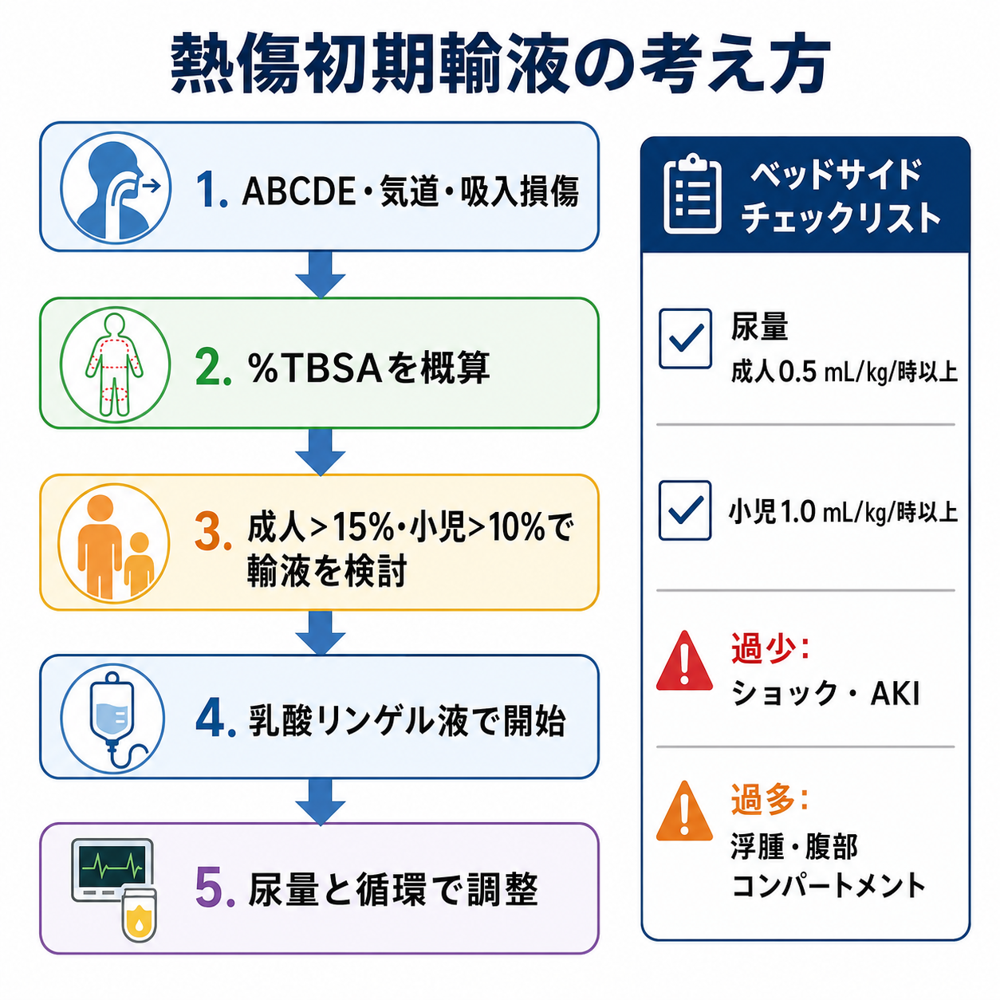
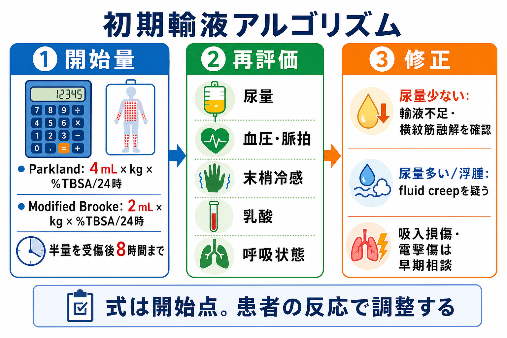
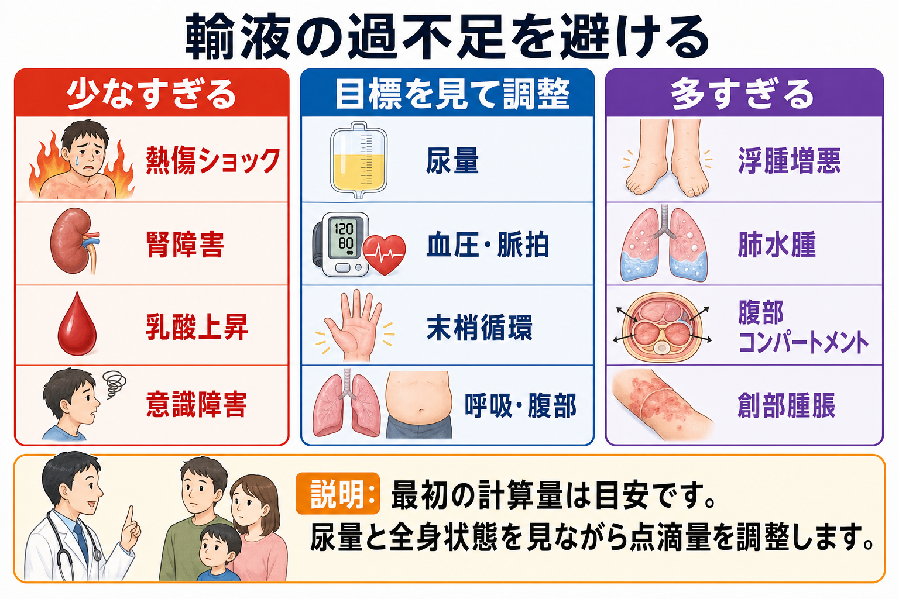

---
title: "熱傷患者で初期輸液はどう考えるか"
description: "広範囲熱傷での輸液量、尿量目標、過不足の危険を整理する。"
aliases:
  - "熱傷の初期輸液"
tags:
  - 領域/救急・初期対応
  - 種類/クリニカルクエスチョン
  - 対象/研修医
question: "熱傷患者で初期輸液はどう考えるか"
clinical_area: "救急・初期対応"
audience: "研修医"
evidence_level: "guideline/review"
created: "2026-04-27"
updated: "2026-04-27"
enableToc: true
---

# 熱傷患者で初期輸液はどう考えるか

> このノートは研修医教育のための一般的整理であり、個別患者の診断・治療指示ではありません。緊急性が高い、判断に迷う、施設方針が関わる場合は上級医・専門科に相談してください。

## クリニカルクエスチョン

広範囲熱傷で、初期輸液量をどう見積もり、尿量目標と過不足の危険をどう追いながら調整するか。

## まず結論

- 熱傷の初期輸液は「計算式で決め切る」のではなく、**%TBSA、受傷時刻、体重、尿量、循環、呼吸、腹部所見を反復評価して調整する蘇生**として考える。[1],[2],[4],[5]
- 成人でおおむね15-20%TBSA以上、小児で10%TBSA以上の深達性熱傷では、広範囲熱傷として乳酸リンゲル液などの等張晶質液による計画的輸液を検討し、早期に熱傷診療に慣れた施設・専門科へ相談する。[1],[2],[3],[5]
- 代表的な開始量は、Parkland式 4 mL × 体重kg × %TBSA/24時間、またはModified Brooke式 2 mL × 体重kg × %TBSA/24時間で、半量を「受傷後」8時間までに投与する考え方である。[1],[4],[5]
- 近年のABAガイドラインは、成人20%TBSA以上の急性熱傷ショック蘇生で、過剰輸液を避けるため2 mL/kg/%TBSA程度からの開始を推奨している。日本では施設プロトコルと搬送先の方針に合わせて、開始量を上級医と確認する。[4]
- 尿量目標は成人0.5 mL/kg/時以上、小児1.0 mL/kg/時以上を目安にする。電撃傷、横紋筋融解、血色素尿・ミオグロビン尿では目標や輸液方針が変わるため早期相談する。[1],[2],[5]
- 過少輸液は熱傷ショック、急性腎障害、乳酸上昇につながり、過剰輸液は浮腫、肺水腫、創部腫脹、腹部コンパートメント症候群などを悪化させ得る。[4],[7],[8]

## 判断の型

1. **最初にABCDE。** 気道熱傷・吸入損傷、顔面・頸部熱傷、嗄声、煤、意識障害、低酸素、外傷合併を先に評価し、輸液計算より気道・呼吸・循環の破綻を優先する。[1],[2]
2. **%TBSAを概算する。** 発赤だけの1度熱傷は輸液計算に含めず、2度以上の熱傷面積を成人は9の法則、小児はLund-Browder表などで見積もる。[1],[5]
3. **受傷時刻から逆算する。** 「8時間」は来院時刻からではなく受傷時刻から数える。来院が遅いほど初期の輸液速度は上がりやすく、過剰補正にも注意する。[1],[5]
4. **開始量を置く。** 乳酸リンゲル液などの等張晶質液を用い、Parkland式またはModified Brooke式を開始点にする。成人広範囲熱傷では2-4 mL/kg/%TBSA/24時間の範囲で施設方針を確認する。[1],[3],[4]
5. **尿量で追い、全身で修正する。** 尿量、血圧、脈拍、末梢冷感、意識、乳酸、Hb、電解質、呼吸状態、腹部緊満を反復評価する。[1],[4],[5]

## 初期対応

- **応援要請と搬送判断:** 広範囲熱傷、気道熱傷疑い、顔面・手・会陰・関節部熱傷、電撃傷、化学熱傷、外傷合併、小児・高齢者・妊婦、基礎疾患がある場合は、早期に上級医、救急科、形成外科・皮膚科、集中治療、熱傷専門施設へ相談する。[1],[2]
- **熱源から離す・冷却:** 安全確保後、衣類・装身具を外し、過度な低体温を避けながら局所冷却を行う。広範囲熱傷では冷却と保温のバランスを取る。[1],[2]
- **気道・呼吸:** 顔面熱傷、閉鎖空間火災、嗄声、煤、咽頭浮腫、意識障害では吸入損傷を疑う。浮腫が進む前に気管挿管の要否を上級医と判断する。[1],[2]
- **循環・ルート:** 可能なら熱傷部位を避けて太い末梢静脈路を2本確保する。困難なら骨髄路や中心静脈路を相談する。
- **尿量測定:** 広範囲熱傷で輸液蘇生を行う場合は尿道カテーテルで時間尿量を追う。尿量だけに依存せず、末梢循環、乳酸、呼吸、腹部所見も合わせる。[1],[4]
- **疼痛・保温・感染予防:** 鎮痛、清潔な被覆、破傷風予防、低体温予防を同時に進める。初期から予防的全身抗菌薬を一律に投与するのではなく、感染所見・手術・施設方針に応じて相談する。[1],[2]

## 鑑別・見逃し

| 優先度 | 疾患・状態 | 見逃さない理由 | 手がかり |
|---|---|---|---|
| 高 | 吸入損傷・気道浮腫 | 気道浮腫は遅れて進み、挿管困難化する。輸液計算より先に評価する。 | 顔面・頸部熱傷、嗄声、煤、閉鎖空間火災、意識障害 |
| 高 | 熱傷ショック | 広範囲熱傷では血管透過性亢進で循環血液量が不足する。 | 低血圧、頻脈、冷汗、末梢冷感、乏尿、乳酸上昇 |
| 高 | 過剰輸液によるfluid creep | 浮腫、肺水腫、腹部コンパートメント、創部腫脹を悪化させる。 | 尿量過多、急な体重増加、腹部緊満、換気圧上昇、酸素化悪化 |
| 高 | 電撃傷・横紋筋融解 | 体表面積に比べ深部障害が大きく、腎障害リスクが高い。 | 高電圧、意識消失、不整脈、筋痛、褐色尿、CK上昇 |
| 中 | 外傷・一酸化炭素中毒 | 火災・爆発・転落では熱傷以外の致死病態が隠れる。 | 頭痛、意識障害、乳酸上昇、COHb高値、外傷機転 |
| 中 | 小児・高齢者の低体温・脱水 | 予備能が少なく、輸液量・保温・糖管理の調整が難しい。 | 体温低下、低血糖、体重不明、既往、内服、介護背景 |

## 検査

| 検査 | 目的 | 注意点 |
|---|---|---|
| %TBSA評価 | 輸液開始量と搬送判断 | 1度熱傷は計算に含めない。小児は成人の9の法則だけで過大・過小評価しやすい。[1],[5] |
| 血液ガス、乳酸、COHb | 循環不全、吸入損傷、一酸化炭素中毒の評価 | SpO2はCO中毒で過大評価されるため、閉鎖空間火災ではCOHbを確認する。[1],[2] |
| CBC、生化学、電解質、Cr、肝機能 | 脱水、腎障害、電解質異常、基礎値の把握 | 大量輸液ではNa、K、Ca、酸塩基、腎機能を反復確認する。 |
| CK、尿潜血、尿色 | 横紋筋融解・ミオグロビン尿の評価 | 電撃傷、圧挫、深部筋障害疑いでは尿量目標を含め早期相談する。 |
| 凝固、血液型・交差適合 | 外傷・手術・大量出血への備え | 熱傷単独でも手術やデブリードマンを見据えて施設方針を確認する。 |
| 胸部X線、心電図 | 吸入損傷、外傷、不整脈の評価 | 電撃傷、不整脈、低酸素、挿管前後で重要。初期X線が正常でも吸入損傷は否定できない。 |

## 治療・マネジメント

- **輸液の開始点:** 乳酸リンゲル液などの等張晶質液を用い、Parkland式 4 mL/kg/%TBSA/24時間、またはModified Brooke式 2 mL/kg/%TBSA/24時間を開始点にする。計算量は予定表であり、投与命令の固定量ではない。[1],[3],[4],[5]
- **投与配分:** 伝統的には24時間量の半量を受傷後8時間まで、残り半量を次の16時間で投与する。来院時点で受傷から時間が経っている場合は、残り時間と状態で速度を調整する。[1],[5]
- **尿量目標:** 成人は0.5 mL/kg/時以上、小児は1.0 mL/kg/時以上を目安にする。小児は維持輸液や低血糖対策も関わるため、小児科・熱傷専門家へ早く相談する。[1],[2],[5]
- **尿量が少ないとき:** ルート漏れ、計算した%TBSAの過小評価、受傷時刻のずれ、熱傷ショック、横紋筋融解、腎前性低灌流を確認する。利尿薬で数字だけを作る前に、循環評価と専門科相談を優先する。
- **尿量が多い・浮腫が強いとき:** 過剰輸液、鎮静・オピオイド、人工呼吸、吸入損傷、遅れた蘇生後の追い込み投与を見直す。fluid creepは腹部コンパートメントや肺水腫につながり得る。[4],[7],[8]
- **アルブミン:** ABA 2024は広範囲熱傷や晶質液だけで蘇生が難しい場合、初期24時間内のアルブミンを考慮し得るとしている。ただしエビデンスの確実性、施設差、血液製剤管理があり、研修医単独で開始しない。[4]
- **日本での注意:** 日本の熱傷診療ガイドラインと皮膚科学会ガイドラインを確認し、搬送基準、熱傷専門施設との連携、採用輸液、アルブミン製剤の扱いは院内プロトコルに従う。[1],[2] 乳酸リンゲル液はPMDA添付文書上、循環血液量・組織間液減少時の細胞外液補給・補正などに用いる製剤で、禁忌・慎重投与、電解質、投与速度は各製剤の添付文書を確認する。[3]
- **専門科相談を早める場面:** 20%TBSA以上、気道熱傷疑い、電撃傷、化学熱傷、顔面・手・会陰・関節部、全周性熱傷、小児、高齢者、妊婦、外傷合併、尿量が反応しない、過剰輸液が疑われる場合。

## 図解

## 指導医に確認するポイント

- この熱傷は輸液計算が必要な%TBSAか。1度熱傷を面積に入れていないか。
- 受傷時刻、体重、%TBSAから、最初の輸液速度をいくらに置くか。
- Parkland式で始めるか、Modified Brooke式または施設プロトコルに沿って少なめに始めるか。
- 尿量目標は成人0.5 mL/kg/時でよいか。小児、電撃傷、横紋筋融解で目標を変える必要があるか。
- いま不足なのか、過剰なのか。尿量、乳酸、末梢循環、呼吸、腹部緊満をどう解釈するか。
- 熱傷専門施設、ICU、形成外科・皮膚科、麻酔科、救急科へどのタイミングで連絡するか。

## 患者説明

- 「広い熱傷では、やけどの部分から水分が体の外や組織に逃げ、血液の循環が不足することがあります。」
- 「最初に体重とやけどの広さから点滴量を計算しますが、それは目安です。尿量、血圧、脈拍、呼吸、血液検査を見ながら点滴量を調整します。」
- 「点滴が少なすぎると腎臓や循環が悪くなり、多すぎてもむくみや呼吸、腹部の圧の問題が起こることがあります。」
- 「状態が変わりやすいため、熱傷を専門的に診られる病院や集中治療での管理が必要になる場合があります。」

## ピットフォール

- 発赤だけの1度熱傷を%TBSAに含め、輸液量を過大に見積もる。
- 「受傷後8時間」を来院後8時間と誤解し、初期速度を誤る。
- Parkland式の計算量を固定処方として流し続け、尿量・呼吸・腹部所見で調整しない。
- 尿量が少ない理由を評価せず、ルート漏れ、横紋筋融解、気道・呼吸悪化、熱傷面積の見積もり違いを見逃す。
- 過剰輸液による浮腫、肺水腫、腹部コンパートメント症候群を「重症熱傷だから仕方ない」と見逃す。
- SpO2だけで吸入損傷や一酸化炭素中毒を否定する。
- 小児・高齢者で体重、維持輸液、低体温、低血糖、基礎疾患を十分に補正しない。

## 関連ノート

- [[第一印象で重症そうな患者を見たら最初の1分で何をするか]]
- [[救急外来で患者を診るときABCDE評価はどの順番で進めるか]]
- [[救急外来で再評価はいつ何を見ればよいか]]
- 関連候補: 熱傷患者で吸入損傷をどう疑うか、電撃傷では何を見逃さないか、化学熱傷の初期対応、全周性熱傷で減張切開を疑うタイミング。

## MOC更新候補

- [[MOC｜救急・初期対応]]
- MOC｜外科・整形・皮膚.md（本サイト外）
- MOC｜輸液・電解質・酸塩基.md（本サイト外）

## 参考文献

[1] 日本熱傷学会 学術委員会. 熱傷診療ガイドライン〔改訂第3版〕. 熱傷. 2021;47(Supplement):S1-S108. https://doi.org/10.34366/jburn.47.Supplement_S1

[2] 日本皮膚科学会 創傷・褥瘡・熱傷ガイドライン策定委員会（熱傷グループ）. 創傷・褥瘡・熱傷ガイドライン（2023）-6 熱傷診療ガイドライン（第3版）. 日本皮膚科学会雑誌. 2024;134(3):509-557. https://doi.org/10.14924/dermatol.134.509

[3] PMDA. ソルラクト輸液（250mL/500mL/1000mL）医療用医薬品情報. 一般名: 乳酸リンゲル液. https://www.pmda.go.jp/PmdaSearch/rdDetail/iyaku/3319534A4160_1?user=1

[4] Cartotto R, Johnson LS, Savetamal A, et al. American Burn Association Clinical Practice Guidelines on Burn Shock Resuscitation. J Burn Care Res. 2024;45(3):565-589. https://doi.org/10.1093/jbcr/irad125

[5] ISBI Practice Guidelines Committee. ISBI Practice Guidelines for Burn Care, Part 2. Burns. 2018;44(7):1617-1706. https://doi.org/10.1016/j.burns.2018.09.012

[6] Pham TN, Cancio LC, Gibran NS; American Burn Association. American Burn Association practice guidelines burn shock resuscitation. J Burn Care Res. 2008;29(1):257-266. https://doi.org/10.1097/BCR.0b013e31815f3876

[7] Saffle JI. The phenomenon of "fluid creep" in acute burn resuscitation. J Burn Care Res. 2007;28(3):382-395. https://doi.org/10.1097/BCR.0B013E318053D3A1

[8] Azzopardi EA, McWilliams B, Iyer S, Whitaker IS. Fluid resuscitation in adults with severe burns at risk of secondary abdominal compartment syndrome: an evidence based systematic review. Burns. 2009;35(7):911-920. https://doi.org/10.1016/j.burns.2009.03.001

## 更新ログ

- 2026-04-27: 初版作成。
