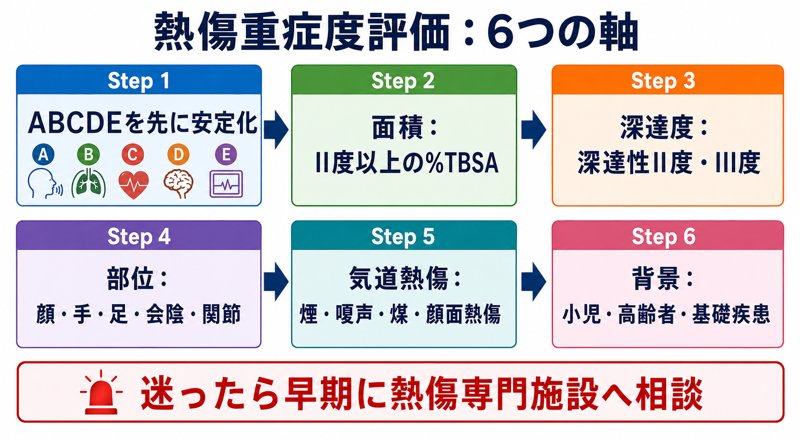
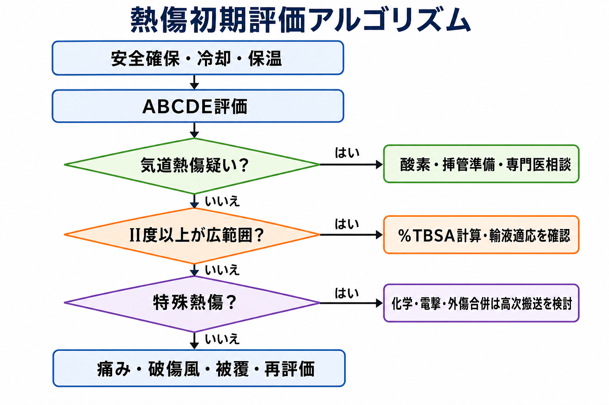
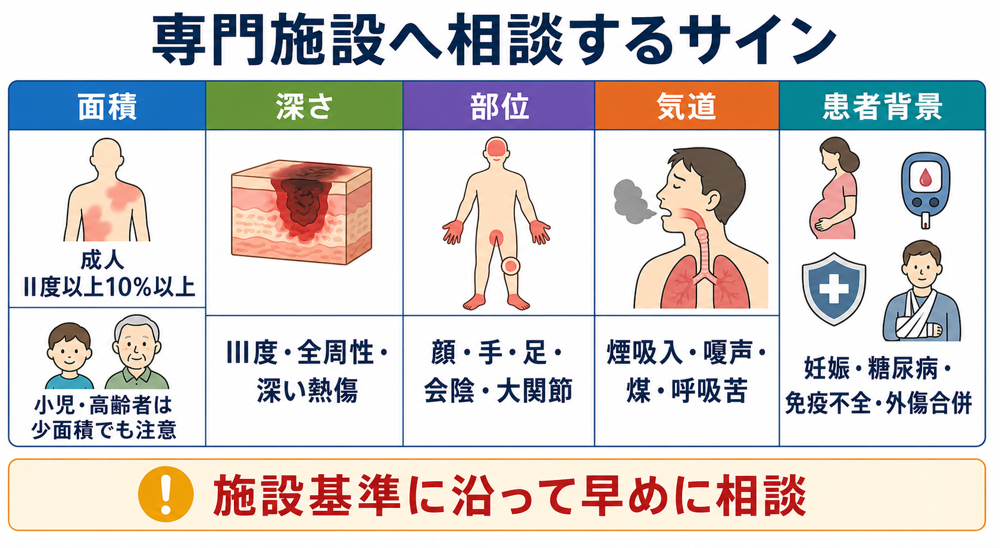

---
title: "熱傷患者の重症度はどう評価するか"
description: "熱傷面積、深達度、部位、気道損傷、年齢、基礎疾患から、救急外来で搬送・入院・専門施設相談の必要性を判断する。"
aliases:
  - "熱傷重症度評価"
tags:
  - 領域/救急・初期対応
  - 種類/クリニカルクエスチョン
  - 対象/研修医
question: "熱傷患者の重症度はどう評価するか"
clinical_area: "救急・初期対応"
audience: "研修医"
evidence_level: "guideline"
created: "2026-04-27"
updated: "2026-04-27"
enableToc: true
---

# 熱傷患者の重症度はどう評価するか

> このノートは研修医教育のための一般的整理であり、個別患者への診断・治療指示ではありません。緊急性が高い、判断に迷う、施設方針が関わる場合は上級医・救急科・形成外科・熱傷専門施設に相談してください。

## クリニカルクエスチョン

熱傷患者を診たとき、熱傷面積、深達度、部位、気道損傷、年齢、基礎疾患から、搬送・入院・専門施設相談の必要性をどう判断するか。

## まず結論

- 重症度は **面積だけで決めない**。最初にABCDEで生命危機を拾い、次に「II度以上の%TBSA」「深達度」「重要部位」「気道損傷」「特殊熱傷」「患者背景」を並列に評価する [1,2,5]。
- 面積評価ではI度熱傷を%TBSAに含めず、II度以上を数える。成人の中等度から広範囲熱傷は9の法則、小児や精密評価はLund-Browder、散在・小範囲は手掌法を使う [1,6,7]。
- 専門施設相談を急ぐ目安は、成人の部分層熱傷10%以上、全層熱傷、顔・手・足・会陰・大関節の深い熱傷、気道損傷疑い、化学損傷、電撃傷、外傷合併、基礎疾患、小児・高齢者である [1,5]。
- 日本熱傷学会2021版では、従来のArtz基準としてII度30%TBSA以上、III度10%TBSA以上、顔・手・足のIII度、気道損傷、外傷合併、電撃傷を重症熱傷として示す一方、ABLS/ABAはII度10%TBSA超から熱傷センター紹介を考える [1,5]。
- 気道損傷は「口腔・咽頭の煤、嗄声、ラ音、顔面熱傷、閉鎖空間での煙吸入」などで疑い、気管支鏡やCTは有用だが、単独で重症度を確定するものではない [1]。
- 日本での注意: 日本皮膚科学会2023版は軽症を含む一般診療、日本熱傷学会2021版は入院を要する重症熱傷を主対象にする。外用薬や破傷風対応はPMDA添付文書と施設プロトコルに沿って確認する [1,2,4]。

## 判断の型

1. **先にABCDE**: 気道、呼吸、循環、意識、低体温を評価し、不安定なら面積計算より蘇生・応援要請を優先する。
2. **II度以上の面積を見積もる**: I度の発赤だけの部分は含めない。成人は9の法則、小児はLund-Browder、散在する小熱傷は患者の手掌を目安にする [1,6,7]。
3. **深さを仮判定し、再評価前提にする**: 浅達性II度は湿潤・疼痛・水疱、深達性II度は蒼白・痛み低下、III度は革様・白色/褐色/黒色・知覚低下を目安にする。受傷直後は過小評価も過大評価も起こる [1,5]。
4. **部位を確認する**: 顔面、手、足、会陰、外陰部、大関節、全周性四肢・胸郭は、面積が小さくても機能障害や循環・換気障害のリスクとして扱う [1,5]。
5. **気道損傷・特殊熱傷を別枠で拾う**: 煙吸入、嗄声、煤、顔面熱傷、閉鎖空間火災、化学損傷、電撃傷、外傷合併は、皮膚面積とは独立して高リスクである [1,5]。
6. **患者背景で閾値を下げる**: 小児、高齢者、妊娠、糖尿病、免疫不全、心肺腎疾患、抗凝固薬、独居・セルフケア困難では、少面積でも入院・専門相談を考える [1,5]。

## 初期対応

- **安全確保**: 熱源、煙、化学物質、電気、救助者安全を確認する。化学損傷は原因物質と曝露時間を確認し、除染・洗浄を施設手順で進める。
- **冷却と保温を両立する**: 小範囲のI度・II度は流水で冷却する。広範囲熱傷では過冷却で低体温になりやすく、冷却し続ける範囲と時間に注意する。日本赤十字社は広範囲の冷却を10分以上続けることを避け、特に小児・高齢者で低体温に注意するとしている [3]。
- **衣類・装身具**: 付着していない衣類、指輪、時計は早めに外す。皮膚に固着した衣類は無理に剥がさない。
- **清潔被覆**: 水疱を不用意につぶさず、清潔な布やドレッシングで覆う。軟膏・油・消毒薬を自己判断で塗り込まない。
- **疼痛、破傷風、再評価**: 鎮痛、破傷風ワクチン歴、バイタル、尿量、末梢循環、疼痛の変化を再評価する。輸液、挿管、減張切開、手術適応は上級医と施設方針で決める。

## 鑑別・見逃し

| 優先度 | 見逃したくない状況 | なぜ重要か | 手がかり |
|---|---|---|---|
| 高 | 気道損傷 | 皮膚所見が軽くても遅れて気道浮腫・呼吸不全に進むことがある | 閉鎖空間火災、煙吸入、顔面熱傷、鼻毛焦げ、煤、嗄声、咳、喘鳴、SpO2低下 |
| 高 | 全周性四肢熱傷 | 浮腫で末梢循環障害を起こす | 強い腫脹、疼痛増悪、冷感、しびれ、毛細血管再充満遅延、脈拍低下 |
| 高 | 全周性胸郭熱傷 | 焼痂で換気が制限される | 胸郭拡張不良、努力呼吸、換気量低下 |
| 高 | 化学損傷・電撃傷 | 表面所見より深部損傷が強いことがある | 原因物質、曝露時間、通電経路、意識消失、不整脈、筋肉痛、外傷合併 |
| 中 | 虐待・自傷・ネグレクト | 再受傷リスクと社会的介入が必要 | 受傷機転が不自然、境界明瞭な浸漬熱傷、受診遅延、多発外傷 |
| 中 | 低温熱傷 | 小さく見えて深いことがある | 湯たんぽ、カイロ、電気毛布、長時間圧迫 |

## 検査

| 検査 | 目的 | 注意点 |
|---|---|---|
| バイタル、SpO2、意識、体温 | ABCDEと低体温の評価 | SpO2だけでは一酸化炭素中毒を除外できない |
| %TBSAの記録 | 輸液・入院・搬送判断 | I度は含めない。小児では成人の9の法則をそのまま使わない |
| 血液ガス、乳酸、COHb | 煙吸入、一酸化炭素中毒、循環不全の評価 | 閉鎖空間火災では早めに検討する |
| CBC、生化学、凝固、CK、尿検査 | 広範囲熱傷、電撃傷、外傷合併、腎障害評価 | 電撃傷では横紋筋融解と不整脈を意識する |
| 胸部X線・CT、気管支鏡 | 気道損傷や合併外傷の評価 | 日本熱傷学会は気管支鏡や胸部CTが用いられるが、単独で確定的な重症度指標はないとしている [1] |
| 心電図 | 電撃傷、意識消失、不整脈、胸部症状 | 高電圧、落雷、失神、胸痛ではモニターを考える |

## 治療・マネジメント

- **専門相談のトリガー**: ABAの紹介基準では、全層熱傷、部分層熱傷10%TBSA以上、顔・手・足・外陰部・会陰・関節の深い熱傷、気道損傷疑い、化学損傷、電撃傷、高電圧、外傷合併、基礎疾患、小児などが相談・転送検討に挙がる [5]。
- **日本での搬送判断**: 日本熱傷学会2021版は、Artz基準としてII度30%TBSA以上、III度10%TBSA以上、顔・手・足のIII度、気道損傷、軟部組織損傷・骨折合併、電撃傷を重症熱傷として示している。一方で、同じ箇所でABLS/ABAの10%TBSA超紹介基準も紹介しており、地域の熱傷診療体制に合わせた早期相談が現実的である [1]。
- **輸液**: 広範囲熱傷ではParkland式などで初期量を見積もるが、尿量や循環動態で調整する。過剰輸液は肺水腫や腹部コンパートメント症候群につながりうるため、式は開始点であり固定量ではない [1,6]。
- **気道**: 進行する顔面・咽頭浮腫、嗄声、喘鳴、呼吸仕事量増大、意識障害、広範囲顔面熱傷では、挿管困難化の前に上級医・麻酔科・救急科へ相談する。
- **局所治療**: 創部は清潔に覆い、疼痛を抑え、感染徴候と深達度変化を再評価する。外用薬は熱傷の深さ、感染リスク、疼痛、禁忌を踏まえ、施設プロトコルに従う。
- **日本での薬剤注意**: スルファジアジン銀（ゲーベンクリーム1%）はPMDA添付文書上、外傷・熱傷などの二次感染に適応がある一方、軽症熱傷、低出生体重児・新生児、サルファ剤過敏症では禁忌・注意がある。軽い熱傷に漫然と塗る薬ではない [4]。

## 図解

## 指導医に確認するポイント

- この患者は「外来でよい軽症」か、「入院・専門施設相談が必要」か。
- %TBSAの見積もりにI度を含めていないか。小児で成人の9の法則を誤用していないか。
- 顔面・手・足・会陰・関節・全周性など、面積以外で重く見る部位がないか。
- 気道損傷、CO中毒、化学損傷、電撃傷、外傷合併をどう除外・評価するか。
- 輸液開始、尿量目標、鎮痛、破傷風対応、局所治療、搬送先選定を誰が最終判断するか。
- 小児、高齢者、妊娠、糖尿病、免疫不全、独居などで入院閾値を下げるべきか。

## 患者説明

- 「やけどは広さだけでなく、深さ、場所、煙を吸った可能性、年齢や持病で重症度が変わります。」
- 「赤いだけの浅いやけどは面積計算に含めませんが、水ぶくれ以上の部分は広さを測って、点滴や入院が必要か判断します。」
- 「顔、手、足、陰部、関節、ぐるっと一周するやけどは、面積が小さくても後遺症やむくみに注意が必要です。」
- 「煙を吸っている可能性がある場合、あとから喉が腫れたり呼吸が悪くなることがあるため、慎重に観察します。」
- 「自己判断で軟膏、油、消毒薬を塗ると評価や治療の妨げになることがあります。医療者が創を確認してから処置を決めます。」

## ピットフォール

- I度熱傷を%TBSAに含めて、重症度や輸液量を過大評価する。
- 小児に成人の9の法則をそのまま使う。
- 顔面熱傷が軽く見えるため、煙吸入・嗄声・煤を見落とす。
- 全周性熱傷の末梢循環障害や胸郭拘束を再評価しない。
- 電撃傷・化学損傷を「皮膚の見た目が小さいから軽い」と判断する。
- 広範囲熱傷を冷やし続けて低体温にする。
- 軽症熱傷にスルファジアジン銀などを漫然と使用し、禁忌や疼痛を確認しない。
- 地域の搬送基準、熱傷専門施設の受け入れ体制、施設プロトコルを確認せず一人で抱える。

## 関連ノート

- [[救急外来で患者を診るときABCDE評価はどの順番で進めるか]]
- [[救急患者で上級医を呼ぶタイミングはどう判断するか]]
- [[救急外来で見逃してはいけないレッドフラッグをどう拾うか]]
- [[ショック患者を見たら最初に何をするか]]
- 関連ノート候補: 電撃傷の初期対応、化学損傷の除染、熱傷の初期輸液、気道熱傷の評価、破傷風予防。

## MOC更新候補

- [[MOC｜救急・初期対応]] に「外傷・熱傷・中毒」配下の記事として追加候補。
- MOC｜外科・整形・皮膚.md（本サイト外） に皮膚外傷・熱傷の関連記事として追加候補。

## 参考文献

[1] 一般社団法人日本熱傷学会学術委員会. 熱傷診療ガイドライン〔改訂第3版〕. 熱傷. 2021;47(Supplement):S1-S108. https://doi.org/10.34366/jburn.47.Supplement_S1

[2] 創傷・褥瘡・熱傷ガイドライン策定委員会（熱傷グループ）. 創傷・褥瘡・熱傷ガイドライン（2023）―6 熱傷診療ガイドライン（第3版）. 日本皮膚科学会. 2024. https://www.dermatol.or.jp/uploads/uploads/files/guideline/nessho2023.pdf

[3] 日本赤十字社. 熱傷（やけど）. https://www.jrc.or.jp/study/safety/burn/

[4] PMDA. ゲーベンクリーム1% 医療用医薬品情報（一般名: スルファジアジン銀）. https://www.pmda.go.jp/PmdaSearch/rdSearch/02/2633705N1031?user=1

[5] American Burn Association. Guidelines for Burn Patient Referral. https://www.ameriburn.org/burn-care-team/resources/guidelines-for-burn-patient-referral

[6] Hettiaratchy S, Papini R. Initial management of a major burn: II--assessment and resuscitation. BMJ. 2004;329:101-103. https://doi.org/10.1136/bmj.329.7457.101

[7] Moore RA, Popowicz P, Burns B. Rule of Nines. StatPearls. Updated 2024. https://www.ncbi.nlm.nih.gov/books/NBK513287/

## 更新ログ

- 2026-04-27: 初版作成。日本熱傷学会、日本皮膚科学会、日本赤十字社、PMDA、ABA、BMJ、StatPearls、厚生労働省資料を確認。
