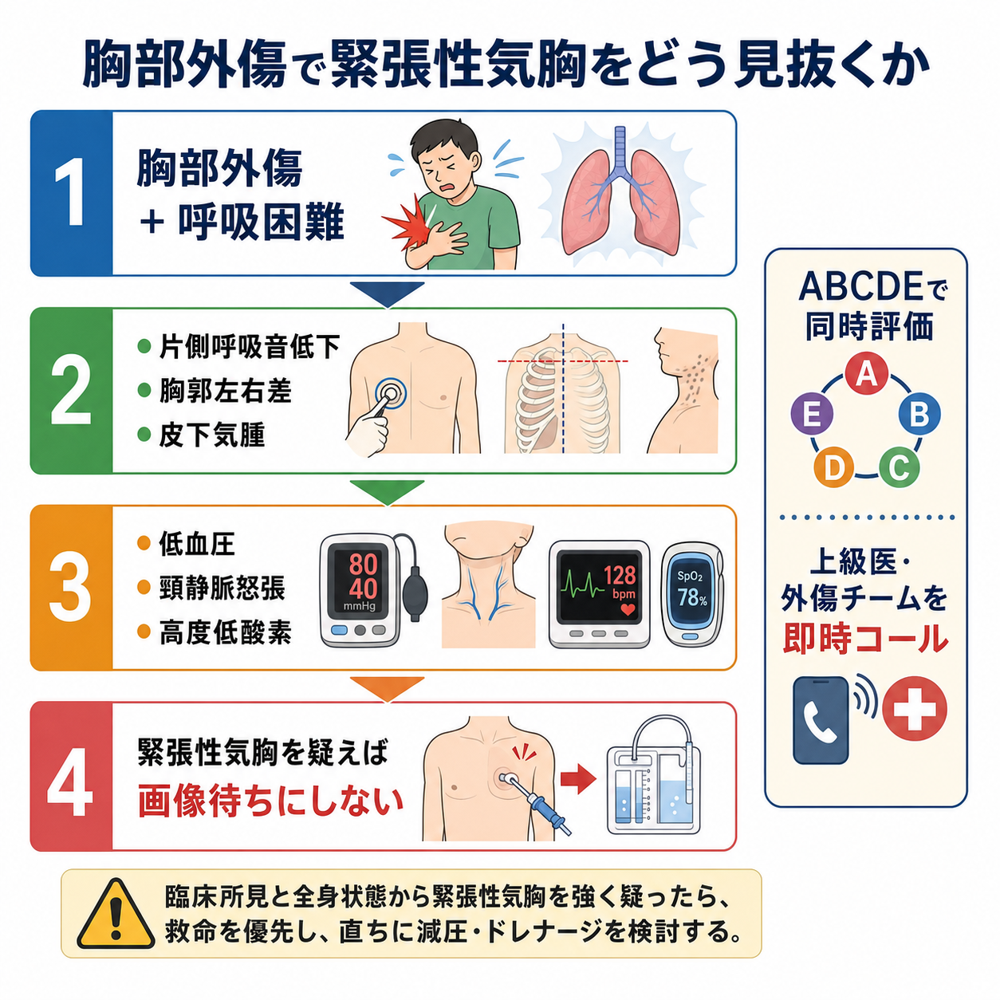
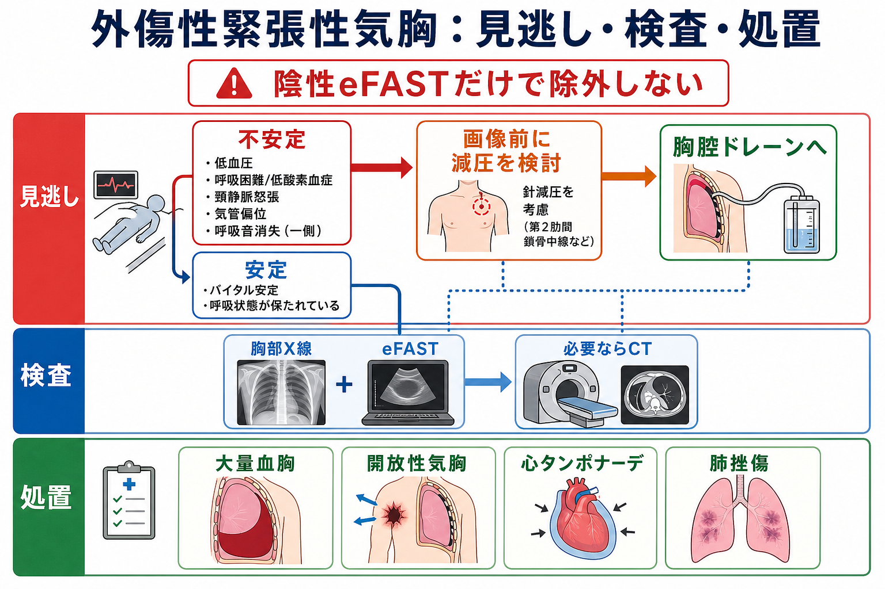
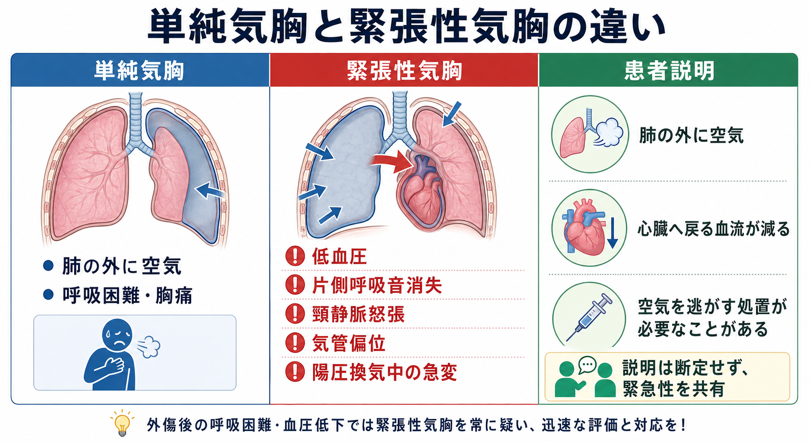

---
title: "胸部外傷で緊張性気胸をどう見抜くか"
description: "低血圧、呼吸困難、片側呼吸音低下、頸静脈怒張などから即時処置を判断する。"
aliases:
  - "外傷性緊張性気胸"
tags:
  - 領域/救急・初期対応
  - 種類/クリニカルクエスチョン
  - 対象/研修医
question: "胸部外傷で緊張性気胸をどう見抜くか"
clinical_area: "救急・初期対応"
audience: "研修医"
evidence_level: "guideline"
created: "2026-04-27"
updated: "2026-04-27"
enableToc: true
---

# 胸部外傷で緊張性気胸をどう見抜くか

> このノートは研修医教育のための一般的整理であり、個別患者の診断・治療指示ではありません。緊急性が高い、判断に迷う、施設方針が関わる場合は上級医・専門科に相談してください。

## クリニカルクエスチョン

胸部外傷で、低血圧、呼吸困難、片側呼吸音低下、頸静脈怒張などから緊張性気胸をどう疑い、画像を待つか即時処置を優先するかをどう判断するか。

## まず結論

- 胸部外傷後の呼吸困難では、まずABCDEで「呼吸」と「循環」を同時に見る。片側呼吸音低下、胸郭運動の左右差、皮下気腫、打診過共鳴に、低血圧・頻脈・高度低酸素・意識障害が重なれば緊張性気胸を強く疑う。[1][2]
- 緊張性気胸は「画像で証明してから考える病名」ではなく、血行動態不安定または重度呼吸障害を伴うときに臨床的に疑って処置につなげる病態である。NICEは、緊張性気胸で血行動態不安定または重度呼吸障害がある場合、画像前の胸腔減圧を推奨している。[2]
- eFASTや胸部X線は有用だが、陰性eFASTだけで気胸を除外しない。安定している胸部外傷では胸部X線、eFAST、必要時CTで気胸、血胸、肺挫傷、心タンポナーデを評価する。[2][3]
- 外傷性の単純気胸・緊張性気胸・血胸では、胸腔ドレーンが標準的治療選択になる。減圧は一時的な救命処置であり、再緊張、ドレーン位置、エアリーク、出血、呼吸・循環の再評価が必要である。[3][4]
- 日本での注意として、JATECは外傷初期診療の標準化教材として国内で用いられるが、穿刺減圧、開胸減圧、胸腔ドレーンの具体的運用は施設体制と術者経験に依存する。左右確認、穿刺部位、局所麻酔薬、ドレーン接続・固定、吸引設定は必ず施設手順と上級医確認に合わせる。[1][5][6]

## 判断の型

1. **外傷後の呼吸困難を見たら、まず致死的胸部外傷として扱う。** 緊張性気胸、大量血胸、開放性気胸、心タンポナーデ、フレイルチェスト/肺挫傷を並行して考える。[1][3]
2. **片側性の呼吸所見を探す。** 患側呼吸音低下または消失、胸郭運動の左右差、皮下気腫、胸部創、肋骨骨折所見を確認する。頸静脈怒張や気管偏位は典型的だが、出血性ショックや観察困難で目立たないことがある。
3. **「不安定なら画像待ちにしない」と決める。** 低血圧、ショック、重度低酸素、意識障害、心停止切迫、陽圧換気中の急な換気不良があれば、緊張性気胸を臨床診断として扱い、上級医・外傷チームへ即時コールする。[2][4]
4. **安定していれば画像で損傷範囲を詰める。** 胸部X線/eFASTで初期評価し、循環・呼吸が保たれCT搬送に耐えられる場合はCTで気胸の大きさ、血胸、肺挫傷、血管損傷、横隔膜損傷などを評価する。[2][3]
5. **処置後も診断を終えない。** 減圧後に改善しない低血圧は、大量血胸、心タンポナーデ、出血性ショック、緊張性血胸、挿管関連トラブルを再評価する。[3][7]

## 初期対応

- 患者到着前から、モニター、酸素、吸引、バッグバルブマスク、気道器具、胸腔ドレーンセット、エコー、輸血準備を整える。外傷では「診断名を当てる」より、Primary surveyで可逆的な死因を処置することを優先する。[1]
- **A/B:** 発語、気道閉塞、気管偏位、呼吸数、SpO2、努力呼吸、胸郭左右差、片側呼吸音低下、皮下気腫を確認する。陽圧換気・挿管後に急に気道内圧が上がりSpO2や血圧が落ちる場合も緊張性気胸を疑う。
- **C:** 血圧低下、頻脈、末梢冷感、冷汗、頸静脈怒張、外出血、骨盤不安定性を同時に見る。頸静脈怒張がなければ除外、とはしない。
- **不安定例:** 画像準備より先に上級医を呼び、施設手順に従って胸腔減圧を検討する。NICEは、院内の緊張性気胸ではopen thoracostomy followed by chest drainを推奨しているが、国内では設備・術者・状況により針減圧を橋渡しにする運用もある。[2][3]
- **安定例:** 胸部X線、eFAST、必要時CTで評価する。eFASTは臨床評価を補助する位置づけで、陰性だけで気胸を除外しない。[2]
- **日本での注意:** 胸腔ドレーン挿入時は、左右取り違え、肺・肝脾・横隔膜損傷、接続外れ、閉塞、過度のクランプを避けるため、画像、体位、穿刺方向、先端位置、接続・固定、排液・エアリーク確認をチームで行う。[5]

## 鑑別・見逃し

| 優先度 | 疾患・状態 | 見逃さない理由 | 手がかり |
|---|---|---|---|
| 高 | 緊張性気胸 | 静脈還流低下からショック、外傷性心停止に至りうる | 片側呼吸音消失、低血圧、頻脈、高度低酸素、頸静脈怒張、気管偏位、陽圧換気中の急変 |
| 高 | 大量血胸 | 低酸素と出血性ショックが同時に進む | 片側呼吸音低下、濁音、胸部外傷、高度貧血、胸腔内液体、ドレーンから大量血性排液 |
| 高 | 開放性気胸 | 空気の出入りで換気不全・緊張化を起こす | 胸壁開放創、吸気時の創部吸い込み、皮下気腫 |
| 高 | 心タンポナーデ | 頸静脈怒張・低血圧で緊張性気胸と似る | 穿通性外傷、心音減弱、心エコーで心嚢液、右房/右室虚脱 |
| 中 | 肺挫傷/ARDS | 初期X線で軽く見えても数時間で低酸素が悪化する | 高エネルギー外傷、肋骨骨折、肺野浸潤影、酸素化悪化 |
| 中 | 気管・気管支損傷 | ドレーン後も空気漏れが続く | 持続エアリーク、縦隔気腫、皮下気腫、肺が再膨張しない |
| 中 | 出血性ショック | 頸静脈怒張が目立たず、低血圧を気胸だけで説明しやすい | 腹腔内出血、骨盤骨折、四肢出血、FAST陽性、乳酸上昇 |

## 検査

| 検査 | 目的 | 注意点 |
|---|---|---|
| 身体診察 | 片側呼吸音低下、胸郭左右差、皮下気腫、循環不安定を拾う | 緊張性気胸は臨床診断で動く場面がある。典型所見がそろうまで待たない。[2] |
| 胸部X線 | 気胸、血胸、縦隔偏位、肋骨骨折、ドレーン位置を確認 | 不安定例で撮影待ちにしない。臥位では気胸を見落としやすい。 |
| eFAST/肺エコー | ベッドサイドで気胸、血胸、心嚢液を評価 | 陰性eFASTだけで気胸を除外しない。術者依存性がある。[2] |
| CT | 安定例で損傷範囲、血管損傷、肺挫傷、横隔膜損傷を評価 | 呼吸・循環が不安定なままCT室へ搬送しない。[3] |
| 血液ガス・乳酸 | 酸素化、換気、循環不全の重症度を追う | 診断確定目的ではなく、再評価と搬送・集中治療判断に使う。 |
| 心エコー | 心タンポナーデ、右心負荷、循環不全の鑑別 | 緊張性気胸だけに固定しないための検査。 |

## 治療・マネジメント

- **疑ったらチームで動く。** 緊張性気胸が疑わしい不安定例では、酸素、モニター、静脈路、輸血準備、気道管理、胸腔減圧、胸腔ドレーンを同時並行で準備する。[1][2]
- **減圧は画像より優先されることがある。** 血行動態不安定または重度呼吸障害がある緊張性気胸では、画像前に減圧を行うことが推奨される。ただし、安定例では画像で確認してから侵襲的処置を検討する。[2]
- **胸腔ドレーンへつなげる。** WSES-AASTは、単純気胸・緊張性気胸・血胸に対して胸腔チューブを治療選択とし、陽圧換気、呼吸障害、血行動態障害があればほぼ必須と整理している。[3]
- **開放性気胸は密閉とドレナージを考える。** 開放創は閉鎖性ドレッシングで空気流入を抑え、緊張化を観察し、胸腔ドレーンと胸壁修復を検討する。[2][3]
- **処置後再評価:** SpO2、血圧、呼吸音、胸郭運動、ドレーンの呼吸性変動・エアリーク・排液量、胸部X線、疼痛、鎮痛、感染、再緊張を確認する。[3][5]
- **日本での注意:** 胸腔ドレーンや局所麻酔薬は、院内採用品、ドレーン径、吸引圧、固定材、リドカイン濃度・最大量、抗凝固薬内服、同意取得の運用が施設で異なる。リドカインはPMDA添付文書と施設規定を確認し、最大量や禁忌を上級医と照合する。[6]
- **抗菌薬:** 外傷性気胸の胸腔ドレーンでの抗菌薬予防は、鈍的外傷と穿通性外傷、開放創、汚染、施設プロトコルで扱いが異なる。WSES-AASTは鈍的または自然気胸の胸腔ドレーンでは予防抗菌薬を推奨せず、穿通性損傷では利益がありうるとしている。[3]

## 図解

## 指導医に確認するポイント

- いま血行動態不安定または重度呼吸障害があり、画像前に胸腔減圧を優先すべき状態か。
- 減圧方法は、針減圧、開胸減圧、胸腔ドレーンのどれを選ぶか。施設手順と術者経験に合っているか。
- 挿入側、穿刺部位、体位、画像、皮膚消毒、局所麻酔、ドレーン径、吸引設定、固定方法は確認済みか。
- 大量血胸、心タンポナーデ、開放性気胸、気管・気管支損傷を同時に評価できているか。
- 処置後に改善しない場合、次に呼ぶ診療科、輸血、手術室/IVR、ICU、転院の判断はどうするか。

## 患者説明

- 「胸のけがで、肺の外側に空気が漏れ、肺や心臓を圧迫している可能性があります。」
- 「血圧低下や強い息苦しさがある場合は命に関わるため、画像を待たずに胸の空気を逃がす処置が必要になることがあります。」
- 「処置後も、管の位置、空気漏れ、出血、呼吸と血圧を繰り返し確認します。」
- 「説明は急いで行うことがありますが、治療内容と危険性は上級医・チームから可能な範囲で共有します。」

## ピットフォール

- 低血圧を出血性ショックだけで説明し、片側呼吸音低下を確認しない。
- 頸静脈怒張や気管偏位がないため緊張性気胸を除外する。出血や観察条件で典型所見はそろわない。
- 不安定例で胸部X線やCTを待ち、減圧が遅れる。
- eFAST陰性を過信する。NICEは陰性eFASTで気胸を除外できないと明記している。[2]
- 胸腔減圧後に再緊張を見逃す。針の逸脱、閉塞、ドレーン屈曲・接続外れ、吸引不良を確認する。
- 胸部外傷を気胸だけで説明し、大量血胸、心タンポナーデ、肺挫傷、腹腔内出血を同時に探さない。
- 胸腔ドレーン挿入時に左右、挿入部位、穿刺方向、局所麻酔薬、接続・固定をチームで確認しない。[5][6]

## 関連ノート

- [[気胸を疑う呼吸困難では何を確認するか]]
- [[閉塞性ショックを疑う場面では何を考えるか]]
- [[胸痛患者を見たら最初に何を除外するか]]
- 関連ノート候補（未作成）: 胸腔ドレーン挿入前に何を確認するか
- 関連ノート候補（未作成）: eFASTで外傷初期評価をどう進めるか

## MOC更新候補

- [[MOC｜救急・初期対応]] の「外傷・熱傷・中毒」または「未整理・発展候補」に本ノートを追加する。
- 将来 MOC｜呼吸器.md（本サイト外） と MOC｜検査・画像・手技.md（本サイト外） に、気胸・胸腔ドレーン・肺エコー関連ノートが増えた段階で相互リンクを検討する。

## 参考文献

[1] 日本外傷学会, 日本救急医学会 監修; 日本外傷学会外傷初期診療ガイドライン改訂第6版編集委員会 編集. (2021). 改訂第6版 外傷初期診療ガイドラインJATEC. へるす出版. https://www.herusu-shuppan.co.jp/014-2/

[2] NICE. (2016). Major trauma: assessment and initial management. NICE guideline NG39. https://www.nice.org.uk/guidance/ng39/chapter/Recommendations

[3] Coccolini F, Cremonini C, Moore EE, et al. (2025). Thoracic trauma WSES-AAST guidelines. World Journal of Emergency Surgery, 20, 78. https://doi.org/10.1186/s13017-025-00651-1

[4] National Clinical Guideline Centre (UK). (2016). Major Trauma: Assessment and Initial Management. Chapter 8, In-hospital tension pneumothoraces. NICE Guideline No. 39. https://www.ncbi.nlm.nih.gov/books/NBK368107/

[5] PMDA. (2020). PMDA医療安全情報 No.60 胸腔ドレーン取扱い時の注意について. https://www.pmda.go.jp/safety/info-services/medical-safety-info/0001.html

[6] PMDA. 医療用医薬品情報: キシロカイン注射液0.5%/1%/2%（リドカイン）添付文書. https://www.pmda.go.jp/PmdaSearch/rdSearch/02/1214401A1027?user=1

[7] Lott C, Truhlář A, Alfonzo A, et al. (2021). European Resuscitation Council Guidelines 2021: Cardiac arrest in special circumstances. Resuscitation, 161, 152-219. https://doi.org/10.1016/j.resuscitation.2021.02.011

## 更新ログ

- 2026-04-27: 初版作成。
